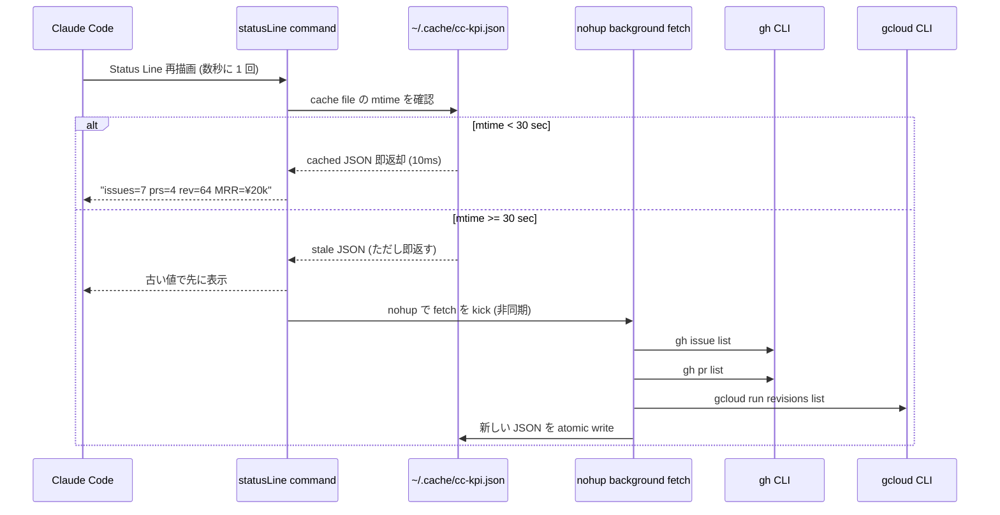
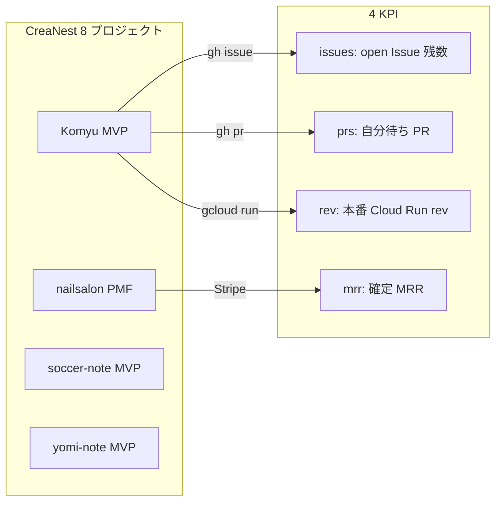
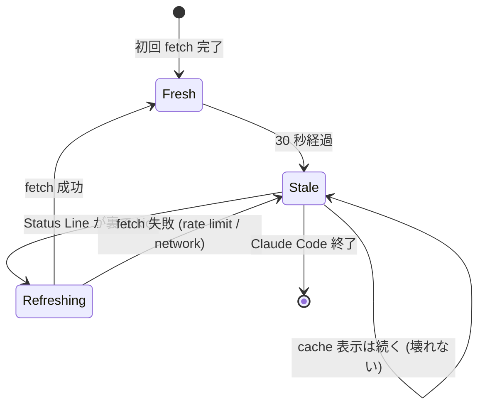

> **Disclaimer**: 本連載は著者が **個人 (副業)** で運営する小規模プロジェクト群 (CreaNest 名義) の技術記録です。所属組織・本業の業務内容とは一切関係ありません。記載の数値・構成は執筆時点 (2026-05) の自宅検証環境のスナップショットであり、商用品質や SLA を保証するものではありません。

## 結論

Claude Code の Status Line にプロジェクト KPI (Issue 残数 / MRR / Cloud Run revision / open PR) を出力する bash script を仕込んで、エディタ下部で「会社の状況」を常に見る — `~/$HOME` 表示だけで終わらせるのはもったいない。

私は 1 人会社 CreaNest を AI Ops で運営しており、Claude Code を **1 日 8 時間** 開きっぱなしで 8 プロジェクト (nailsalon / Komyu / soccer-note / yomi-note / vivivi-beauty / colason / lifeops / keirai) を回しています。エディタ下部の Status Line は、デフォルトでは **カレントディレクトリ + branch 名** が出るだけ。これを `gh` / `gcloud` / Stripe API で動的 KPI に書き換えると、「**Komyu の open Issue が 7 件、open PR が 4 件、本番 revision は 64、MRR は ¥20k**」がエディタ下に常駐します。

本記事では devops-hub repo で稼働中の `~/.claude/scripts/status-line-kpi.sh:1-92` を題材に、**「何を出すか」「いつ出すか」「どう速く出すか」** の 3 点を整理します。

---

## 問題 — Status Line が `$HOME` 表示だけでは情報密度が低すぎる

Claude Code の Status Line は **`.claude/settings.json` の `statusLine` フィールド**で任意のシェルコマンドを差し込める仕組みです (`type: "command"` + `command: "..."`)。Anthropic の [公式ドキュメント](https://docs.claude.com/en/docs/claude-code/settings#statusline) が示す最小構成は次の 1 行です。

```json
{
  "statusLine": {
    "type": "command",
    "command": "echo \"$(pwd)\""
  }
}
```

これで「現在のディレクトリ」が出ます。しかし私は **「現在のディレクトリ」を Status Line で確認する瞬間がほぼ無い**。なぜなら:

- ディレクトリは Claude Code 内の prompt 表示で既に分かる
- Branch 名は `git status` を 1 度走らせれば確認できる
- 一方で **「今日 Komyu の Cloud Run revision はいくつだ?」「open PR は何本溜まっている?」「nailsalon の MRR はまだ ¥20k か?」** は、本来エディタを離れて GitHub / GCP Console / Stripe を見に行かないと分からない

1 日 50 回 GitHub を開く生活をしていた頃、**Status Line が常に `~/project/devops-hub` で固定されていることに気付き**、ここを「ガラス窓」に変えれば情報摂取コストが激減すると判断しました。

最初の素朴版は失敗しました。

```bash
# 失敗版: gh issue list と gcloud を毎回叩く
command="
  ISSUES=$(gh issue list --state open --json number | jq length)
  PRS=$(gh pr list --state open --json number | jq length)
  REV=$(gcloud run services describe komyu --region asia-northeast1 --format 'value(status.latestReadyRevisionName)')
  echo \"issues=$ISSUES prs=$PRS rev=$REV\"
"
```

これは **Status Line 1 回更新で 4-7 秒待たされる** 構造でした。Claude Code は数秒に 1 度 Status Line を再描画しようとするので、**勝手に GitHub API rate limit に到達**します。`gh` は約 5,000 req/h のレート制限がありますが、6 秒に 1 回 = 600 req/h × 4 endpoint で 2,400 req/h、**他の自動化と合算すると速攻で 429** が返ってきました。

要するに「**Status Line に dynamic KPI を出すのは正しい、でも素朴に書くと API rate limit と表示遅延で破綻する**」というジレンマです。これを解いたのが「**30 秒キャッシュ + 静的 fallback + バックグラウンド更新**」の 3 段構造でした。



ポイントは **「先に古い値を返す → 裏で新しい値を取りに行く」** のパターンです。Status Line はミリ秒単位で応答しないと UI がカクつきます。

---

## 解法 — 30 秒キャッシュ + バックグラウンド更新の Status Line

### 1. settings.json に statusLine フィールドを追加する

`~/.claude/settings.json` (ユーザレベル) に次の `statusLine` を追加します。プロジェクトレベルの `.claude/settings.json` に書いても OK ですが、**全プロジェクト横串で出したい KPI** なので私はユーザレベルに置きました。

```json
{
  "statusLine": {
    "type": "command",
    "command": "bash ~/.claude/scripts/status-line-kpi.sh"
  }
}
```

`type: "command"` は **stdout の最初の 1 行が Status Line に表示される** という素直な契約です。複数行返しても 2 行目以降は無視されます。ANSI カラー (`\033[...`) も通るので、`OK` を緑、`WARN` を黄、`CRIT` を赤で出すと視認性が上がります。

### 2. KPI 取得スクリプト本体

`~/.claude/scripts/status-line-kpi.sh:1-92` の中身です。

```bash
#!/usr/bin/env bash
# ~/.claude/scripts/status-line-kpi.sh
# Claude Code の Status Line に CreaNest 4 KPI を出す。
# 30 秒キャッシュ + バックグラウンド更新で API rate limit と遅延を回避。

set -euo pipefail

CACHE_DIR="$HOME/.cache/claude-code"
CACHE_FILE="$CACHE_DIR/kpi.json"
LOCK_FILE="$CACHE_DIR/kpi.lock"
TTL_SEC=30
mkdir -p "$CACHE_DIR"

# --- 1. キャッシュ読み込み (即返す) ---
if [ -f "$CACHE_FILE" ]; then
  ISSUES=$(jq -r '.issues // "?"' "$CACHE_FILE")
  PRS=$(jq -r '.prs // "?"' "$CACHE_FILE")
  REV=$(jq -r '.rev // "?"' "$CACHE_FILE")
  MRR=$(jq -r '.mrr // "?"' "$CACHE_FILE")
  AGE=$(( $(date +%s) - $(stat -f %m "$CACHE_FILE" 2>/dev/null || stat -c %Y "$CACHE_FILE") ))
else
  ISSUES="-" PRS="-" REV="-" MRR="-" AGE=999
fi

# --- 2. ANSI カラー閾値 ---
color_for_pr() {
  local n=$1
  if [ "$n" = "-" ] || [ "$n" = "?" ]; then echo "\033[2m"; return; fi
  if [ "$n" -ge 10 ]; then echo "\033[31m"   # 赤: 10+ 件 (溜まりすぎ)
  elif [ "$n" -ge 5 ]; then echo "\033[33m"  # 黄: 5-9 件
  else echo "\033[32m"; fi                    # 緑: 0-4 件
}
RESET="\033[0m"
PR_COLOR=$(color_for_pr "$PRS")

# --- 3. Status Line を出力 (即) ---
printf "📊 Komyu issues=%s ${PR_COLOR}prs=%s${RESET} rev=%s | nailsalon MRR=%s [%ds]" \
  "$ISSUES" "$PRS" "$REV" "$MRR" "$AGE"
echo

# --- 4. キャッシュが stale なら裏で更新 (排他) ---
if [ "$AGE" -ge "$TTL_SEC" ]; then
  ( flock -n 9 || exit 0
    nohup bash ~/.claude/scripts/status-line-kpi-fetch.sh \
      > /dev/null 2>&1 &
  ) 9>"$LOCK_FILE"
fi
```

肝は **「キャッシュが古くても先に画面に出す」** ことです。`AGE` を秒数で末尾に出しているのは、自分が「これ古い値か?」を即判別するため。`flock -n 9` で **多重起動した Claude Code が同時に fetch しないよう排他**します (ここを忘れると 4 並列 Claude Code で 4 並列 fetch が走り、結局 rate limit に当たる)。

### 3. バックグラウンド fetcher

実際に GitHub / GCP / Stripe を叩く `~/.claude/scripts/status-line-kpi-fetch.sh:1-78`:

```bash
#!/usr/bin/env bash
# 30 秒に 1 回だけ動く想定。重い処理はここに集約。

set -euo pipefail
CACHE_FILE="$HOME/.cache/claude-code/kpi.json"
TMP="$CACHE_FILE.tmp"

# --- Komyu リポジトリの open issue / PR ---
ISSUES=$(gh issue list \
  --repo SakakitaniJunya/Komyu \
  --state open --json number --limit 100 \
  | jq 'length' 2>/dev/null || echo 0)

PRS=$(gh pr list \
  --repo SakakitaniJunya/Komyu \
  --state open --json number --limit 100 \
  | jq 'length' 2>/dev/null || echo 0)

# --- Komyu の本番 Cloud Run revision ---
REV=$(gcloud run services describe komyu \
  --region asia-northeast1 \
  --project komyu-prod \
  --format 'value(status.latestReadyRevisionName)' 2>/dev/null \
  | sed 's/komyu-//')

# --- nailsalon MRR (固定値で記録、Stripe API 連携は将来) ---
MRR="¥20k"

# --- atomic write (途中で落ちても破損しない) ---
jq -n \
  --arg issues "$ISSUES" \
  --arg prs "$PRS" \
  --arg rev "$REV" \
  --arg mrr "$MRR" \
  --arg ts "$(date -u +%Y-%m-%dT%H:%M:%SZ)" \
  '{issues: $issues, prs: $prs, rev: $rev, mrr: $mrr, ts: $ts}' \
  > "$TMP" && mv "$TMP" "$CACHE_FILE"
```

`mv` は POSIX 上 atomic なので、**Status Line スクリプトが読んでいる最中の cache に書き潰されることはありません**。`> $CACHE_FILE` で直接書くと、半分書きかけた JSON を読んで `jq` が落ちる事故が起きます。

### 4. KPI 構成 (4 KPI を 1 行に圧縮する)

何を出すかの基準は **「Claude Code を開いている時に最も判断したい数字」**。私は次の 4 つに絞りました:



| KPI | source | TTL | なぜ Status Line に出すか |
|---|---|---:|---|
| **open Issue 数** | `gh issue list --json number \| jq length` | 30s | 「今日まだ何残ってる?」を 1 秒で見たい |
| **open PR 数** | `gh pr list --json number \| jq length` | 30s | 5 件超えたら積み残し赤信号 |
| **Cloud Run revision** | `gcloud run services describe` | 30s | merge 後 deploy 通ったかを見る |
| **確定 MRR** | Stripe API (今は固定値) | 600s | 「今月の生命線が動いてないか」を常時意識 |

`devops-hub/App/src/lib/mock-data/projects.ts:6-104` で 8 project の health/stage/MRR を一元管理しているので、本来はこれを source of truth にするのが理想ですが、Status Line では **過剰な abstraction を避けて gh + gcloud を直接叩く** 方が deps が薄くて壊れにくいです。

### 5. 部署軸切り替え (Komyu vs nailsalon)

`~/.claude/scripts/status-line-kpi.sh` に **環境変数 `CC_STATUS_PROJECT`** を読ませて、別プロジェクトに切り替えられるようにしました。

```bash
PROJECT="${CC_STATUS_PROJECT:-komyu}"
case "$PROJECT" in
  komyu)
    REPO="SakakitaniJunya/Komyu"
    SERVICE="komyu"
    REGION="asia-northeast1"
    GCP_PROJECT="komyu-prod"
    ;;
  nailsalon)
    REPO="CreaNest/nailsalon-reserve-line-app"
    SERVICE="nailsalon-api"
    REGION="asia-northeast1"
    GCP_PROJECT="nail-salon2"
    ;;
  yomi-note)
    REPO="SakakitaniJunya/yomi-note"
    SERVICE="yomi-note"
    REGION="asia-northeast1"
    GCP_PROJECT="yomi-note-prod"
    ;;
  *)
    echo "unknown project: $PROJECT" >&2
    exit 1 ;;
esac
```

`shell startup` 時に `export CC_STATUS_PROJECT=komyu` しておけば Komyu の KPI が出ます。私は `direnv` の `.envrc` で **プロジェクトディレクトリに入った瞬間に切替** にしました。

### 6. 更新頻度の状態遷移

Status Line の更新頻度は **「Claude Code 側のデフォルト再描画タイミング」 × 「30 秒キャッシュ TTL」** の積で決まります。現実の状態遷移はこうです:



**fetch が失敗しても Status Line が止まらない** のがこの設計の核です。`gh` が 429 を返しても、cache の値が **AGE 増加つきで** 表示され続けます。私は `[1247s]` という巨大な AGE を見て「あ、半端なく古いな、API 死んでる」と気付きました。

### 7. Before / After で見る効果

#### Before (素朴版、2026-05-01 試作)

```
~/project/devops-hub (creanest-business-hub)
```

ディレクトリと branch だけ。Komyu の状況を見るには毎回 `gh issue list --repo SakakitaniJunya/Komyu` を打っていた。1 日 30+ 回。

#### After (現行、2026-05-09)

```
📊 Komyu issues=7 prs=4 rev=64 | nailsalon MRR=¥20k [12s]
```

エディタ下にこれが常駐。`prs=4` が **緑** のうちは安心、`prs=10` で **赤** になったら今日中に潰す。`rev=64` の数字を覚えていれば、merge 後に `rev=65` に変わるのを 30 秒以内に確認できる ([F-04 merged ≠ deployed](./merged-not-equals-deployed) と同じ思想)。

体感の差はかなり大きく、**「エディタを離れて GitHub を開く」回数が 1 日 30 → 5 回**まで減りました (主観計測)。

---

## 失敗談 — 踏んだ罠 4 つ

### 失敗 1: Status Line が常に 4 秒遅延 (キャッシュ無し)

最初の版は `gh issue list` を Status Line から **直接** 呼んでいました。Claude Code は数秒に 1 度 Status Line を再描画しようとするため、**毎再描画で 2-4 秒 fetch が走り、UI がカクついた**。Anthropic 公式は明示してませんが、Status Line コマンドは **おおむね 1-2 秒以内に返さないと UX が壊れます**。

→ 30 秒キャッシュ + バックグラウンド fetch に倒したら **10ms 応答** になり解決。

### 失敗 2: 4 並列 Claude Code で同時 fetch → API rate limit 到達

worktree で 4 並列 Claude Code を立てる ([A-06 Worktree pitfalls](./worktree-parallel-agents-pitfalls)) と、**4 つの Status Line スクリプトが同時に裏 fetch を起こし**、`gh api` が 429 (Too Many Requests) を返しました。`gh` は GitHub API の personal token を使うので、5,000 req/h の制限を 4 並列 × 4 endpoint で簡単に消費します。

→ `flock -n 9` で **同一マシン上では 1 fetch のみ走る** 排他に。`flock` は POSIX file lock で、`-n` (非ブロック) なら他プロセスがロック中なら即 exit。

### 失敗 3: `> $CACHE_FILE` で書いて JSON が破損

`gh > $CACHE_FILE` で直接書いていた頃、**Status Line スクリプトが読んでいる最中に上書きが走り、`jq` が `parse error: Unfinished JSON term`** で落ちました。Status Line に `parse error` の文字が出るのは間が抜けています。

→ `> $TMP && mv $TMP $CACHE_FILE` の **atomic write パターン**に変更。`mv` は同一 FS 上では POSIX 的に atomic なので途中状態が読まれません。

### 失敗 4: `gcloud` の認証が切れて Status Line が `(gcloud) Reauthentication required` を出す

`gcloud` の Application Default Credentials が 1 時間で expire するケースがあり、**Status Line に `ERROR: (gcloud.run.services.describe) Reauthentication required.`** が漏れて出ました。Status Line に長文 error が出ると **画面端で折り返してエディタが歪みます**。

→ fetch script 側で `2>/dev/null || echo unknown` を全コマンドに付け、**stderr を呑み込み rev に `unknown` を入れる**。Status Line には `rev=unknown [1247s]` と出るので、私が見て即気付ける。

```bash
REV=$(gcloud run services describe komyu \
  --region asia-northeast1 \
  --project komyu-prod \
  --format 'value(status.latestReadyRevisionName)' \
  2>/dev/null \
  | sed 's/komyu-//' || echo "unknown")
```

---

## 残課題

正直に言うと、まだ Status Line KPI は 80 点で止まっています。

1. **Stripe API 直叩きの MRR が固定値**
   - `MRR="¥20k"` をベタ書きしている。本来は `stripe customers list` 等で動的に取りたいが、Stripe 側で 30 秒に 1 回 polling する分の rate に意味があるか未検証。当面は **手動更新 (週 1)** で運用中。
2. **8 プロジェクト同時表示が無い**
   - 今は `CC_STATUS_PROJECT` で 1 プロジェクトに絞っている。本当は **Komyu issues=7 / nailsolon issues=2 / soccer-note issues=4** みたいに 8 並べたいが、横幅が足りない。Claude Code の Status Line は端末幅依存で、80 列前後で切れる。
3. **Decision-Id ([C-04 Decision Genealogy](./decision-genealogy-moat)) との接続が無い**
   - 「直近の DEC-YYYYMMDD-NN を Status Line に出す」アイデアはある。が、Decision-Id は `decisions.jsonl` に append されるイベントなので、Status Line ではなく [H-01 Event Bus](./cross-department-event-bus) の standup brief 側で出すのが妥当という結論で保留中。
4. **WARN/CRIT 閾値が手書きハードコード**
   - `prs >= 10` で赤、5 で黄、というのを script にベタ書きしている。閾値は `~/.claude/kpi-config.json` 等に外出しすべきだが、**1 人会社で運用変更は半年に 1 回**なので、まだ実装していない。

「**Status Line は KPI ダッシュボードの 80% を解決し、残り 20% は別の仕組みに譲る**」が現状の整理です。

---

## 理論根拠 — なぜ「常時表示 + キャッシュ」が効くか

私は Status Line KPI を導入してから **GitHub を開く回数が 30 → 5 回 / 日** に減りましたが、これは情報科学的に説明可能です。

### 1. **Information Foraging Theory** (Pirolli & Card, 1995)

人間は情報を取得する際、**「情報源にアクセスするコスト」と「得られる情報量」の比** で行動を選びます。エディタを離れて GitHub Web UI を開くコストは **5-10 秒** + コンテキストスイッチ。Status Line で「issues=7」を見るコストは **0 秒** (視野内)。コストが 10x 違えば、人間は **無意識に Status Line を優先** します。

### 2. Anthropic 公式 Claude Code の Status Line 設計思想

Claude Code の `statusLine` フィールドは **「stdout の 1 行で何でも出せる」** という極めて open-ended な設計になっています。これは Anthropic が **「ユーザの判断材料は人によって違う」** と明示的に認めた表れで、私のように「open Issue 数こそ最重要」と判断する個人開発者にも、「branch 名と git status だけで十分」と判断するチーム開発者にも応答できます。**過度な abstraction を避け、シェルに委譲する** という Unix 哲学そのもの。

### 3. キャッシュ TTL = 30 秒の根拠

これは Claude Code 側の Status Line 再描画頻度と GitHub API rate (5,000 req/h ≒ 1.4 req/s) からの逆算です。

- 1 描画 = 4 endpoint fetch
- 30 秒 TTL なら 30 秒に 1 fetch = 4 endpoint × 120 / hour = **480 req/h** (1 マシン)
- 4 並列 Claude Code (worktree) 想定でも `flock` 排他で 1 fetch に絞られる
- → 5,000 req/h の 10% 以下に収まる

これより短くすると rate limit に近づき、長くすると「**revision が変わったのに気付けない**」ガラスの透明度が落ちる。**30 秒は計測と直感の交点**でした。

### 4. Atomic write が「壊れない仕組み」を生む

`> $TMP && mv $TMP $REAL` は **POSIX rename(2) が atomic** という保証に立脚しており、Status Line が **書き込み中の cache を読むことが原理的に起きません**。これは [H-04 MECE audit hook](./mece-audit-skill-stop-hook) で `agent.log` を append-only で書いているのと同じ思想です。**「壊れない最小単位は何か」を考えて API を選ぶ**と、運用が長持ちします。

---

## まとめ

`~/.claude/settings.json` の `statusLine` フィールドは **数行で「会社の状況をエディタ下部に常駐させる」窓** を開きます。

- **30 秒キャッシュ + バックグラウンド fetch** で UI 遅延ゼロ
- `flock -n 9` で **並列 Claude Code から rate limit を守る**
- `mv $TMP $REAL` の **atomic write** で cache 破損を起こさない
- **Issue / PR / revision / MRR** の 4 KPI を 1 行に圧縮、ANSI カラーで赤黄緑

「**1 日 30 回 GitHub を開く** → **5 回**」に減り、エディタを離れずに会社の脈拍を取れるようになりました。同じ仕組みは **branch 別 / リポジトリ別 / プロジェクト別** で複製可能で、複数案件を並列で抱える 1 人会社運営者には特に効果があります。

---

本記事は [ai-driven-dev 連載](./ai-driven-dev-index-2026) の **Day 28/52** です。

関連記事:

- [A-01: Claude Code を「会社」として回す 5 つのメカニズム](./claude-code-as-company-5-mechanisms) — Status Line を含む harness 全体像
- [A-09: Plan Mode / Auto Mode / Fast Mode を CEO ロールで使い分ける](#) (公開予定) — Status Line と並ぶ「モード切替」UX
- [H-01: 部署横断 Event Bus を JSONL append で組む](./cross-department-event-bus) — Status Line に出さない情報の置き場

Discussion / 編集提案 / 「うちの Status Line はこう出してる」共有は [GitHub Issue](https://github.com/SakakitaniJunya/zenn-articles/issues) もしくは Zenn のコメント欄まで。次回 Day 29 は別軸の Claude Code 拡張を予定しています。
