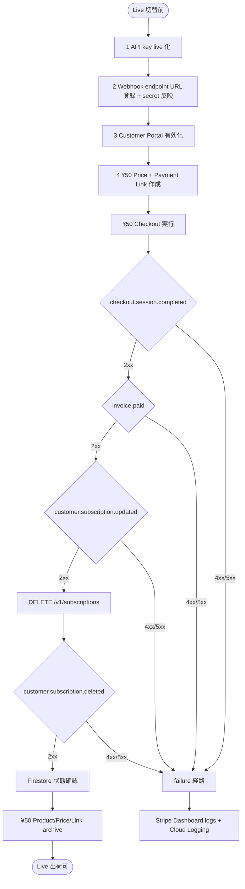
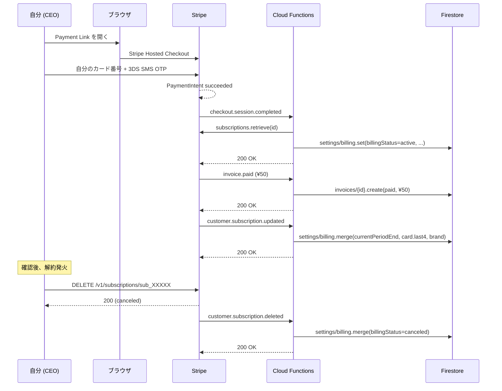
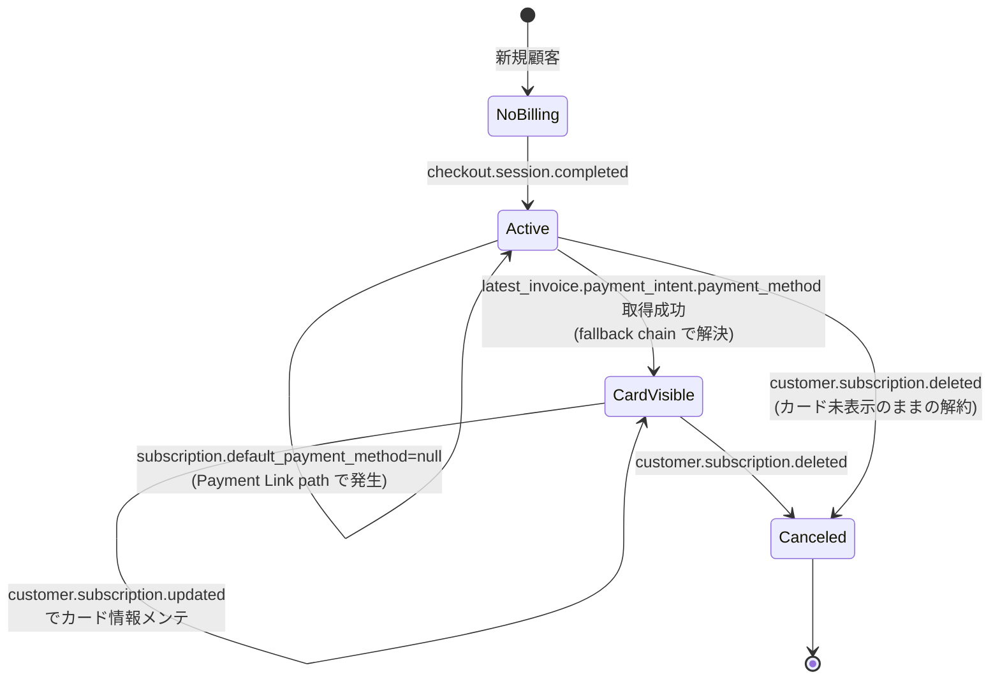
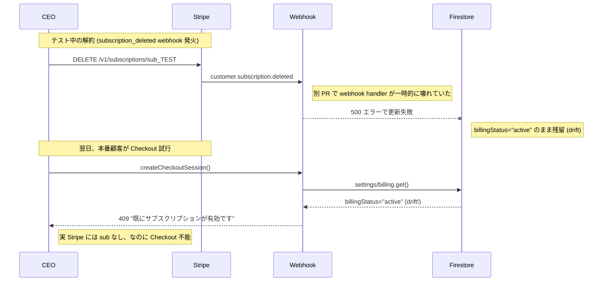

> **Disclaimer**: 本記事は著者が**個人 (副業)** で運営する小規模 SaaS (CreaNest 名義) の技術記録です。所属組織・本業の業務内容とは一切関係ありません。記載の数値・挙動は執筆時点 (2026-05) の著者環境 (nailsalon-reserve-line-app prod / GCP project `nail-salon2` / Stripe Account 1 つ) のスナップショットであり、商用品質や SLA を保証するものではありません。**Stripe / 決済 / 会計まわりは本人責任**で運用してください。Payment Method の取扱いは PCI DSS スコープに関わるため、本記事は「Stripe 公式 SDK の Hosted Checkout を経由する範囲」のみを扱います (生 PAN を自前 server で受け取る構成は対象外)。

## 結論

Stripe Live を本番で初稼働させるには **¥50 決済を 1 回通して webhook 4 本 (`checkout.session.completed` / `invoice.paid` / `customer.subscription.updated` / `customer.subscription.deleted`) を全部受信確認するのが最短**です。1 つでも落ちると 1 ヶ月後に MRR 計算 / カード反映 / 解約処理が静かに壊れて、気付いた時には Firestore と Stripe の状態が drift しています。

私は nailsalon-reserve-line-app (確定収益 ¥22,000/月、1 店舗顧客) で 2026-05-09 に Stripe Live を有効化し、**¥50/月の Payment Link を 1 本だけ作って 1 周し、archive する** という手順で全 webhook を通しました。本記事はその checklist です。

これは連載 **Day 46/52 (J-03)** で、J-01 (LIFF × Vision × Stripe の 3 点セット) の課金部分を**運用の視点から深掘り**した位置付けです。

要点を 3 行で。

- Live は test mode と挙動が違う (Payment Method の参照場所、idempotency、collection_method、retry 挙動)
- ¥50 を **1 周** させると 4 webhook のうち 3 本までは自動で来る、`subscription.deleted` だけ DELETE API か Customer Portal で能動的に発火させる
- 落とし穴は 4 つ: `rawBody` 署名検証 / `metadata` 保存忘れ / `default_payment_method` `null` 化 / `pending_invoice_items_behavior` の `exclude` デフォルト

## なぜ「test mode で全 OK」では本番が通らないか

Stripe の **test mode と live mode は同じ API ですが挙動は別物** です。私が踏んだ違いを 4 つ挙げます。

1. **API key prefix が違う** — test は `sk_test_...` / `pk_test_...`、live は `sk_live_...` / `pk_live_...`。Webhook signing secret も test 用と live 用で**別物**。test で動いた secret を live に流用すると署名検証が即落ちる
2. **Customer / Subscription / Invoice の id namespace が違う** — `cus_...` の id は test と live で**完全に分離**。test で作った Customer は live API では `404 No such customer`。Firestore に `stripeCustomerId` を残したまま live に切り替えると参照不能
3. **3DS / カード認証の発火タイミングが違う** — test カード `4242 4242 4242 4242` は無認証で通るが、本物のカードは 3DS / SMS OTP が走る。`checkout.session.completed` が届くまでの **時間が test の 1 秒 → live の 10-30 秒** に伸びる
4. **Webhook の retry が本気で走る** — Stripe は live で 2xx 以外を返すと**最大 3 日リトライ**。test 中に「とりあえず 500 返して後で修正」が live では「3 日間ずっと flood」になる

つまり **test mode の green は本番の green ではない**。test で 50 回叩けたコードでも、live では 1 回 ¥50 を流して**全 webhook が 2xx で着地するか**を実観測しない限り出荷不可、というのが私の持論です。

## checklist 全景

¥50 E2E で確認すべき項目を 1 枚で。



ポイントは **「Webhook が 4 本全部 2xx で着地するまで Live 出荷しない」** という単一基準。それ以外の小目視チェック (UI に "Active" 出てる、Stripe Dashboard 緑、等) は全部副次情報で、**真実は Firestore 側の最終 state とそれを生んだ webhook の id 一致**です。

## 必要な webhook 4 本と発火源

3 本までは Checkout を 1 周すれば自動で来ます。`subscription.deleted` だけは能動アクションが必要。

```mermaid
flowchart LR
    User([顧客]) -->|カード入力| Stripe[Stripe Hosted Checkout]
    Stripe -->|"1 checkout.session.completed"| Webhook
    Stripe -->|"2 invoice.paid"| Webhook
    Stripe -->|"3 customer.subscription.updated\n(card 更新 / period 更新)"| Webhook
    User -->|Customer Portal cancel\nor DELETE /v1/subscriptions| Stripe
    Stripe -->|"4 customer.subscription.deleted"| Webhook
    Webhook --> Firestore[(settings/billing\ninvoices/{id})]
```

各 webhook が **何を更新するか** を 1 行で。

| Webhook | 更新する Firestore フィールド | 発火源 |
|---|---|---|
| `checkout.session.completed` | `stripeCustomerId` / `stripeSubscriptionId` / `billingStatus: active` / `currentPeriodEnd` | Checkout 決済完了 |
| `invoice.paid` | `invoices/{id}` 新規作成 / `billingStatus: active` 維持 | 自動 (Checkout 直後 + 毎月) |
| `customer.subscription.updated` | `defaultPaymentMethodLast4` / `defaultPaymentMethodBrand` / `currentPeriodEnd` | カード更新 / プラン変更 / 月跨ぎ |
| `customer.subscription.deleted` | `billingStatus: canceled` | Customer Portal cancel / DELETE API |

`invoice.payment_failed` を含めて **5 本目** にする派もありますが、¥50 / 一括カード決済では発火させづらいので、私は**初回 E2E では 4 本で完結**として、`payment_failed` は test mode の `4000 0000 0000 0341` (常に decline) で別途確認する派です。

## checklist 1 — API key を live に切り替える

`STRIPE_KEY` を `sk_test_...` から `sk_live_...` に差し替えるだけ、ですが**手順を 1 つでも飛ばすと事故ります**。

私の手順 (`pipeline-kit/ops/scripts/...` に置いている nailsalon の deploy 手順より引用):

```bash
# 1. Stripe Dashboard で live mode に切替 → API keys → Reveal live secret
# 2. GCP Secret Manager に登録
gcloud secrets versions add STRIPE_KEY \
  --data-file=- --project=nail-salon2 <<< "sk_live_..."

# 3. functions の env config を更新 (Firebase Functions v1)
firebase functions:secrets:set STRIPE_KEY --project=nail-salon2

# 4. Cloud Functions 再 deploy
firebase deploy --only functions:stripeWebhook,functions:createCheckoutSession \
  --project=nail-salon2

# 5. live key で Customer 作成テスト (curl で)
curl https://api.stripe.com/v1/customers \
  -u "sk_live_...:" -d "email=test@example.com" -d "metadata[purpose]=live-key-test"
# → 200 で id が返れば key 反映 OK
# テスト後 customer は archive
```

**ポイント**:

- **GitHub Secrets と GCP Secret Manager の両方を更新**。CI deploy が GitHub Secrets 経由、本番 Cloud Functions の runtime が GCP Secret Manager 経由なので、片方だけだと**CI は通るが prod が test key のまま**という最悪パターンになる
- **Cloud Functions の re-deploy が必須**。Secret Manager の値だけ書き換えても、起動済みのインスタンスは古い key を握ったままになる (Firebase Functions v1 は cold start で再読込)
- **live key で curl 1 回叩く** までやって初めて反映確認

## checklist 2 — Webhook endpoint を登録 + signing secret を反映

これが**全 checklist の中で一番事故ります**。Stripe Dashboard の `Developers → Webhooks` で endpoint を登録すると `whsec_...` が発行されますが、これは **test mode と live mode で別物**。

```bash
# 1. Stripe Dashboard (live mode) → Developers → Webhooks → Add endpoint
#    URL: https://asia-northeast1-nail-salon2.cloudfunctions.net/stripeWebhook
#    Events: checkout.session.completed / invoice.paid /
#            invoice.payment_failed / customer.subscription.updated /
#            customer.subscription.deleted

# 2. 表示される `whsec_...` を Secret Manager に登録
gcloud secrets versions add STRIPE_WEBHOOK_SECRET \
  --data-file=- --project=nail-salon2 <<< "whsec_..."

# 3. Cloud Functions 再 deploy (前項と同じ)
firebase deploy --only functions:stripeWebhook --project=nail-salon2

# 4. Stripe Dashboard → Webhooks → endpoint 詳細 → "Send test webhook" で
#    `checkout.session.completed` を 1 発投げ → 2xx を確認
```

**ポイント**:

- Stripe の **「Send test webhook」は live でも使える** が、これは**ダミーの session id `cs_test_xxxxx`** を投げてくる。Firestore で `subscription.retrieve(id)` を呼ぶ実装だと `404 No such subscription` で 500 返る → これを「webhook が壊れている」と勘違いしないこと
- 本物の検証は **¥50 で 1 周** するしかない (それが本記事の主題)
- endpoint URL は HTTPS 必須、Cloud Functions の `https://...cloudfunctions.net/...` がそのまま通る (`/stripeWebhook` のような path を変えるなら必ず Stripe Dashboard 側も合わせる)

## checklist 3 — ¥50 Price + Payment Link を作る

本番 Price (`¥22,000/月` 等) でいきなり E2E すると Stripe Dashboard が「本番取引」として可視化されて気持ち悪いので、**¥50 専用 Product / Price / Payment Link を作って archive する**運用にしています。

```bash
# Stripe Dashboard (live) → Products → Add product
# Name: "E2E Test (¥50/month)"
# Pricing: Recurring / ¥50 / monthly
# → price_id 発行 (price_1XXXXXX)

# Payment Links → New
# Product: 上記
# Confirmation: Don't show confirmation page
# After payment: Redirect to https://nail-salon2.web.app/billing?test=1
# → URL: https://buy.stripe.com/XXXXX
```

**設計判断 3 つ**:

- **¥50 にする理由**: Stripe の手数料 3.6% でも ¥50 × 3.6% = ¥1.8 (実支払い ¥51-¥52)。¥1 だと Stripe が拒否する (最低決済額 ¥50)。test として最も安くてリアルな金額が ¥50
- **Payment Link を使う理由**: `createCheckoutSession` API の代わりに、Stripe Dashboard で UI で 5 分で作れる。¥50 は使い捨てなので「コード経由で session 作って → return URL 設定して → ...」をやるよりも Payment Link が早い
- **archive する理由**: ¥50 を残しておくと**何かの拍子で本番顧客に表示**される (admin SPA の price 一覧、Customer Portal、等)。E2E 後即 archive

## checklist 4 — ¥50 を 1 周させる (本番カードで)

ここが本番です。**自分のクレジットカードで ¥50 を実際に決済する**。テストカードは使わない (live は test カードを拒否する)。



実行手順:

```bash
# 1. Payment Link をブラウザで開く (LIFF 経由でも、PC ブラウザでも可)
# 2. 自分の本物カード番号を入力 (3DS が走るのでスマホで OTP 入力)
# 3. 決済完了

# 4. Stripe Dashboard → Developers → Webhooks → endpoint → Recent deliveries
#    で 4 本中 3 本 (completed / paid / updated) が 2xx を確認

# 5. Firestore Console で settings/billing を確認
#    billingStatus: "active"
#    stripeCustomerId: "cus_..."
#    stripeSubscriptionId: "sub_..."
#    currentPeriodEnd: <timestamp>
#    defaultPaymentMethodLast4: "4242" (本物のカード末尾)

# 6. Firestore Console で invoices/{id} を確認 (¥50 paid 1 件)

# 7. 解約発火 (subscription.deleted を出す)
curl https://api.stripe.com/v1/subscriptions/sub_XXXXX \
  -u "sk_live_...:" -X DELETE
# → status: "canceled"

# 8. Webhook 4 本目 (deleted) が 2xx 着地、Firestore billingStatus: "canceled"

# 9. Stripe Dashboard で ¥50 Product / Price / Payment Link を archive
```

**ポイント**:

- 1 周で ¥50 + Stripe 手数料 ≒ ¥52 が**自分の口座から出る**。これは「本番出荷の保険料」として割り切る (毎月のオペで月 ¥52 払って静かな MRR 破綻を防ぐ価値はある)
- カード会社によっては 3DS で **SMS OTP の代わりに app 内認証** が走る。所要 30-60 秒、focus を切ると失敗するので**スマホで操作する** のが安全
- 決済から `subscription.deleted` まで **すべての webhook が 2xx で着地** することを Stripe Dashboard 側でも確認 (Firestore だけ見ない)

## webhook handler の最小実装

以下は実 repo の Cloud Functions handler 抜粋。これに沿って実装すれば 4 本 + α (`payment_failed`) を全部捌けます。

```typescript
// nailsalon-reserve-line-app/functions/src/handlers/billing.ts:399-465 (抜粋)
export const stripeWebhook = functions.https.onRequest(
  regionOptions,
  async (req: Request, res: Response) => {
    if (req.method !== "POST") {
      res.status(405).json({ error: "Method not allowed" });
      return;
    }

    try {
      const stripe = getStripe();
      const webhookSecret = process.env.STRIPE_WEBHOOK_SECRET;
      if (!webhookSecret) {
        console.error("STRIPE_WEBHOOK_SECRET is not set");
        res.status(500).json({ error: "Webhook secret not configured" });
        return;
      }

      const signature = req.headers["stripe-signature"] as string;
      if (!signature) {
        res.status(400).json({ error: "Missing stripe-signature header" });
        return;
      }

      // Firebase Functions v1 が rawBody を提供する
      const rawBody = (req as { rawBody?: Buffer }).rawBody;
      if (!rawBody) {
        res.status(500).json({ error: "Request body not available for verification" });
        return;
      }

      const event = stripe.webhooks.constructEvent(rawBody, signature, webhookSecret);
      console.log(`Stripe webhook: ${event.type} (${event.id})`);

      const db = getFirestore();
      switch (event.type) {
        case "checkout.session.completed":
          await onCheckoutCompleted(stripe, db, event);
          break;
        case "invoice.paid":
          await onInvoicePaid(stripe, db, event);
          break;
        case "invoice.payment_failed":
          await onInvoicePaymentFailed(db, event);
          break;
        case "customer.subscription.updated":
          await onSubscriptionUpdated(stripe, db, event);
          break;
        case "customer.subscription.deleted":
          await onSubscriptionDeleted(db, event);
          break;
        default:
          console.log(`Unhandled billing event: ${event.type}`);
      }

      res.json({ received: true });
    } catch (error: unknown) {
      if (error instanceof Stripe.errors.StripeSignatureVerificationError) {
        console.error("Stripe signature verification failed:", error.message);
        res.status(400).json({ error: "Invalid webhook signature" });
        return;
      }
      console.error("Stripe webhook error:", error);
      res.status(500).json({ error: "Webhook handler error" });
    }
  }
);
```

`onCheckoutCompleted` の中身 (`billing.ts:421-448` の方式):

```typescript
// nailsalon-reserve-line-app/functions/src/handlers/billing.ts:421-448 (抜粋)
async function onCheckoutCompleted(
  stripe: Stripe,
  db: FirebaseFirestore.Firestore,
  event: Stripe.Event,
): Promise<void> {
  const session = event.data.object as Stripe.Checkout.Session;
  if (session.mode !== "subscription") return;

  const customerId = typeof session.customer === "string"
    ? session.customer : session.customer?.id;
  const subscriptionId = typeof session.subscription === "string"
    ? session.subscription : session.subscription?.id;
  if (!customerId || !subscriptionId) return;

  const subscription = await stripe.subscriptions.retrieve(subscriptionId);
  const firstItem = subscription.items.data[0];
  const periodEnd = firstItem?.current_period_end
    ? admin.firestore.Timestamp.fromMillis(firstItem.current_period_end * 1000)
    : null;

  const updateData: Record<string, unknown> = {
    stripeCustomerId: customerId,
    stripeSubscriptionId: subscriptionId,
    billingStatus: "active",
    currentPeriodEnd: periodEnd,
    updatedAt: admin.firestore.FieldValue.serverTimestamp(),
  };

  // カード情報を 3 段 fallback で解決 (後述)
  const pmId = await resolvePaymentMethodId(stripe, subscription, customerId);
  await applyCardMetadata(stripe, pmId, updateData);

  await db.collection("settings").doc("billing").set(updateData, { merge: true });
}
```

**handler を分割するメリット**:

- switch の case を細くして単体テスト可能に
- `payment_failed` だけ `try / catch` 別にして「Slack 通知 + 自動 retry の調停」を後付け可能に
- type guard が散らばらない (`session.customer` が string か object かの分岐は 1 箇所だけ)

## 失敗談 1 — 署名検証で `JSON.stringify(req.body)` を渡して 400 連発

J-01 でも書きましたが**最重要の罠**なので再掲。

**Before (壊れた版)**:

```typescript
export const stripeWebhook = functions.https.onRequest(async (req, res) => {
  const event = stripe.webhooks.constructEvent(
    JSON.stringify(req.body), // ← 死亡
    req.headers["stripe-signature"] as string,
    webhookSecret,
  );
  // → StripeSignatureVerificationError:
  //   "No signatures found matching the expected signature for payload"
});
```

**After (現行 `nailsalon/functions/src/handlers/billing.ts:415-422`)**:

```typescript
const rawBody = (req as { rawBody?: Buffer }).rawBody;
if (!rawBody) {
  res.status(500).json({ error: "Request body not available for verification" });
  return;
}
const event = stripe.webhooks.constructEvent(rawBody, signature, webhookSecret);
```

**教訓**: HMAC は **raw body** にかかります。`req.body` は Express の middleware が JSON.parse した**別物**で、これを stringify し直しても **改行 / スペースが消えていて hash が一致しません**。Firebase Functions v1 は親切に `req.rawBody` を Buffer で置いてくれますが、Cloud Run / Next.js の Route Handler では `req.text()` で生文字列を自分で取る必要があります (Next.js 15 / 16 の API route で webhook を受ける場合は `export const config = { runtime: 'nodejs' }` + `req.text()` の組み合わせ)。

私は実装時にこれで本番 webhook が **30 分間 dead state** に入り、Stripe Dashboard で **Failed が積み上がって自動 retry が走っているのを見て**事故に気付きました。Stripe は 2xx を返さないと最大 3 日リトライしてくれるので、復旧後に過去イベントが流れ込むのが救いでしたが、その間 Firestore の状態は古いままです。

## 失敗談 2 — `metadata` 保存忘れで backfill invoice の発行月が消えた

PR #57 (`nailsalon-reserve-line-app` 2026-05-10) で踏んだ罠。`createBackfillInvoice` で 4 月分の請求書を発行した時、`metadata.billingYearMonth: "2026-04"` を invoice に付けていたのに、`invoice.paid` webhook 着信時に **period_start から計算した発行月で上書きされて "2026-05" になっていました**。

**Before (壊れた版 `billing.ts:512-529` の旧実装)**:

```typescript
async function onInvoicePaid(
  stripe: Stripe,
  db: FirebaseFirestore.Firestore,
  event: Stripe.Event,
): Promise<void> {
  const invoice = event.data.object as Stripe.Invoice;
  const periodStart = invoice.lines.data[0]?.period?.start;
  const billingYearMonth = periodStart
    ? new Date(periodStart * 1000).toISOString().slice(0, 7)
    : null;
  // ↑ backfill 用の 4月分 invoice でも period_start = 2026-05 が入っていて
  //   metadata 側の 2026-04 を完全に無視 → Firestore に 2026-05 で保存
  // ...
}
```

**After (現行)**:

```typescript
async function onInvoicePaid(
  stripe: Stripe,
  db: FirebaseFirestore.Firestore,
  event: Stripe.Event,
): Promise<void> {
  const invoice = event.data.object as Stripe.Invoice;

  // metadata.source === "backfill" の場合は metadata.billingYearMonth を優先
  const isBackfill = invoice.metadata?.source === "backfill";
  const metaYM = invoice.metadata?.billingYearMonth;

  let billingYearMonth: string | null;
  if (isBackfill && metaYM) {
    billingYearMonth = metaYM;
  } else {
    const periodStart = invoice.lines.data[0]?.period?.start;
    billingYearMonth = periodStart
      ? new Date(periodStart * 1000).toISOString().slice(0, 7)
      : null;
  }
  // ...
}
```

**教訓**: Stripe で**自分が付けた `metadata` は webhook payload にそのまま流れてくる**ので、invoice 作成時に `metadata: { source: "backfill", billingYearMonth: "2026-04" }` を付けて、webhook 側で**最優先で読む** のが正しい。`period_start` は Stripe の請求期間で、必ずしも「ユーザの認識する発行月」と一致しません。

加えて `pending_invoice_items_behavior: "include"` を `invoices.create` に明示しないと、**InvoiceItem が orphan になって ¥0 の空 invoice が静かに作られる** という別バグも踏みました (PR #57 同梱、Stripe デフォルトが `exclude` で、これが backfill オペで致命的)。

```typescript
// PR #57 hotfix: pending_invoice_items_behavior を明示
const invoice = await stripe.invoices.create({
  customer: customerId,
  collection_method: "send_invoice",
  days_until_due: 7,
  pending_invoice_items_behavior: "include", // ← これがないと空 invoice
  metadata: { source: "backfill", billingYearMonth: "2026-04" },
});
```

## 失敗談 3 — `default_payment_method` が `null` で「カードが反映されない」バグ

これは 2026-05-09 時点で nailsalon に**残っている**未修正バグです (cosmetic noise、生死には関わらない)。J-01 でも触れましたが**ここで決定版の修正を載せます**。

**現象**: Payment Link 経由で初回 Checkout 完了後、`subscription.default_payment_method` が `null` のまま webhook が届き、UI で「カードが未登録」と表示される。実際には `latest_invoice.payment_intent.payment_method` には正しく登録されている。



**Before (1 段だけ見ていた壊れた版)**:

```typescript
const pmId = subscription.default_payment_method ?? null;
// → null のとき何もできない、UI に "カードが未登録" と表示される
```

**After (現行 `billing.ts:67-145` の `resolvePaymentMethodId` fallback chain)**:

```typescript
// nailsalon-reserve-line-app/functions/src/handlers/billing.ts:67-145 (抜粋)
async function resolvePaymentMethodId(
  stripe: Stripe,
  subscription: Stripe.Subscription,
  customerId: string,
): Promise<string | null> {
  // 1. subscription.default_payment_method (preferred — Checkout Session path)
  const direct = subscription.default_payment_method;
  if (typeof direct === "string") return direct;
  if (direct && "id" in direct) return direct.id;

  // 2. latest_invoice.payment_intent.payment_method (Payment Link path)
  const latestInvoiceId = typeof subscription.latest_invoice === "string"
    ? subscription.latest_invoice
    : subscription.latest_invoice?.id;
  if (latestInvoiceId) {
    try {
      const invoice = await stripe.invoices.retrieve(latestInvoiceId, {
        expand: ["payment_intent"],
      });
      const pi = (invoice as Stripe.Invoice & { payment_intent?: Stripe.PaymentIntent | string })
        .payment_intent;
      if (pi && typeof pi !== "string" && pi.payment_method) {
        return typeof pi.payment_method === "string"
          ? pi.payment_method
          : pi.payment_method.id;
      }
    } catch (e) {
      console.warn("latest_invoice.payment_intent retrieve failed:", e);
    }
  }

  // 3. customer.invoice_settings.default_payment_method (Customer Portal path)
  try {
    const customer = await stripe.customers.retrieve(customerId);
    if ((customer as Stripe.DeletedCustomer).deleted) return null;
    const inv = (customer as Stripe.Customer).invoice_settings?.default_payment_method;
    return typeof inv === "string" ? inv : inv?.id ?? null;
  } catch (e) {
    console.warn("customer retrieve failed:", e);
  }
  return null;
}
```

**教訓**: Stripe の subscription / invoice / customer は **3 つの場所にカード情報の参照を持つ**。

- **Checkout Session で作ると 1 番** (`subscription.default_payment_method`)
- **Payment Link で作ると 2 番** (`latest_invoice.payment_intent.payment_method`)
- **Customer Portal で更新すると 3 番** (`customer.invoice_settings.default_payment_method`)

**入る場所が path によって変わる** ので fallback chain 必須。これを書く前は「カードを登録したのに表示されない」というクレームに毎回手作業で対応していました。

## 失敗談 4 — Firestore drift で `createCheckoutSession` が 409 で塞がれた

2026-05-10 に踏んだ最新の罠。**Stripe 実態と Firestore の `billingStatus` が drift** すると、`createCheckoutSession` が `billingStatus === "active"` を見て **409 Conflict** を返すロジックが**正常顧客の Checkout を塞ぎ**ます。



**Before (壊れた版 `billing.ts:332-335`)**:

```typescript
const profileDoc = await db.collection("settings").doc("billing").get();
const profile = profileDoc.exists ? profileDoc.data() : null;

if (profile?.billingStatus === "active") {
  res.status(409).json({ error: "既にサブスクリプションが有効です" });
  return;
}
```

**After (検討中の hotfix)**:

```typescript
const profileDoc = await db.collection("settings").doc("billing").get();
const profile = profileDoc.exists ? profileDoc.data() : null;

if (profile?.billingStatus === "active" && profile?.stripeSubscriptionId) {
  // Firestore だけ信じない、Stripe 実態を verify
  try {
    const sub = await stripe.subscriptions.retrieve(profile.stripeSubscriptionId);
    if (sub.status === "active" || sub.status === "trialing") {
      res.status(409).json({ error: "既にサブスクリプションが有効です" });
      return;
    }
    // Stripe 側が canceled なら Firestore drift、reset して続行
    await db.collection("settings").doc("billing").set(
      { billingStatus: "canceled", updatedAt: admin.firestore.FieldValue.serverTimestamp() },
      { merge: true },
    );
  } catch (e) {
    // Stripe 側の sub が存在しない (404) → drift、reset
    console.warn("subscription.retrieve failed, resetting drift:", e);
    await db.collection("settings").doc("billing").set(
      { billingStatus: "canceled" },
      { merge: true },
    );
  }
}
```

**教訓**: **Firestore は webhook の最終結果を保存しているだけで、真実は Stripe** です。`billingStatus` のような **単方向 mirror** で blocking 判定する API は、必ず**実態 verify** か **TTL** を入れないと、webhook が 1 回欠落しただけで顧客側のフローが詰まります。

これは ¥50 E2E では発火しません (テスト中は drift がない)。**運用 1 ヶ月後に静かに壊れる**型のバグなので、checklist に明示的に入れることが重要。

## 残課題 4 つ

### (a) `event.id` での idempotency

Stripe webhook は同じイベントが**重複配送される**仕様 (at-least-once)。今は `event.id` を Firestore に書いて重複防止 — を**実装していません**。`invoices/<stripeInvoiceId>.set({...}, { merge: true })` の merge で偶然冪等になっているだけで、`amountTotal` が累積するロジック (例: `FieldValue.increment(invoice.amount_paid)`) を足したら破綻します。

**正攻法**は `webhook_events/<event.id>` コレクションを作って `db.runTransaction` で `if (exists) return` する dedup。Stripe 公式 docs にも `Receiving the same event multiple times` 節で明記されています。

### (b) `invoice.voided` / `invoice.finalized` 未対応

backfill オペで作った ¥0 空 invoice (PR #57 hotfix 前の残骸 `in_1TV8dfEVtupoI8YFX8D2PorA`) を Stripe Dashboard で void したのに、Firestore 側は `status: "open"` のまま残っています。`invoice.voided` webhook を handler に足せば自動同期できますが優先度低 (cosmetic)。

### (c) Customer Portal の文面ローカライズ

Stripe Billing Portal は日本語化されていますが、**「キャンセル」「カード変更」のラベルが Stripe 標準のままで店主が迷う**。Stripe Portal は branding 設定でロゴ + 色だけ替えられますが、ラベル文言までは触れません。**自前で Customer Portal 相当の UI を書く**のが商用ライン。本実装は MVP ということで Stripe Portal をそのまま使っています。

### (d) Webhook retry + Dead-letter

`stripe.webhooks.constructEvent` 失敗時に 400 / 500 を返してそのまま終わっています。Stripe 側は自動リトライしますが、**ハンドラ内で Anthropic API や Firestore の transient error が出た場合**、Stripe 側に 500 だけ返って Cloud Logging を見ないと原因が見えない。**Cloud Tasks / Pub/Sub で worker queue 化** して、webhook handler は 受信 + キューイング のみに絞るのが正攻法。

## 理論根拠 — なぜ ¥50 1 周が「最も合理的」なのか

3 つの観点で。

### (1) Stripe 公式の testing 推奨

[Stripe 公式 docs の Testing webhooks](https://docs.stripe.com/webhooks/test) には **「Use the Stripe CLI to forward events to a local server, then test in live mode with a small charge」** と明記されています。**「test mode の green は live の green ではない」** は私の独自意見ではなく、Stripe 公式のスタンスでもあります。

実際 Stripe Dashboard → Developers → Webhooks → endpoint には **「Last 50 events」** ビューが live / test 別々に存在し、`Send test webhook` のダミー id (`evt_00000000`) は **「production-like だが production ではない」** と明示されています。

### (2) 「At-least-once」配送の前提

Stripe webhook は **at-least-once delivery** です ([公式 docs / Webhook delivery semantics](https://docs.stripe.com/webhooks#deliveries))。これは:

- 同じ event が複数回届くことがある (idempotency 必要)
- 順序が逆転することがある (`subscription.updated` が `checkout.completed` より先に来る、等)
- 失敗時は最大 3 日リトライ (累積 4xx/5xx でも諦めず投げ続ける)

¥50 で 1 周させると **「実際に retry が起きる前に 4 本が来る」** ことが観測できる。仮想化された test では at-least-once のリアル挙動が出ない (Stripe CLI でも単発配送)。

### (3) 「Payment Method の参照場所が 3 箇所」問題

Stripe の Payment Method は **3 箇所に参照を持ち得る** という構造的事実は [Stripe 公式 / Save payment details](https://docs.stripe.com/payments/save-and-reuse) と [Subscriptions / payment methods](https://docs.stripe.com/billing/subscriptions/payment-methods) 双方の docs から読み取れます。**Checkout Session / Payment Link / Customer Portal の 3 path がそれぞれ違う場所に書く** という設計は、Stripe 側の歴史的経緯 (Checkout Session が後発、Payment Link はさらに後発) によるものです。

これを **「我々の SaaS 側で 1 箇所に正規化する」** のが `resolvePaymentMethodId` fallback chain で、これは Stripe SDK が**やってくれない** 領域 (= 自前で書くしかない)。¥50 E2E をやれば、自分の path がどの番号で書かれるか実観測できます。

## checklist 印刷用 1 ページ

そのまま印刷して壁に貼れる版:

```
== Stripe Live ¥50 E2E checklist ==

[ ] 1. STRIPE_KEY を sk_live_... に差し替え (GitHub Secrets + GCP Secret Manager 両方)
[ ] 2. Cloud Functions 再 deploy
[ ] 3. live key で curl 1 回叩いて customer 作成成功確認 → archive
[ ] 4. Stripe Dashboard (live) で Webhook endpoint 登録
       → events: completed / paid / payment_failed / subscription.updated / .deleted
[ ] 5. STRIPE_WEBHOOK_SECRET を Secret Manager に登録 + Cloud Functions 再 deploy
[ ] 6. Stripe Dashboard で Customer Portal を有効化
[ ] 7. ¥50/月 Product + Price + Payment Link を作成
[ ] 8. 自分の本物カードで Payment Link を 1 周
[ ] 9. Stripe Dashboard → Webhooks → Recent deliveries で 3 本 (completed/paid/updated) 2xx
[ ]10. Firestore settings/billing で billingStatus=active 確認 + invoices/{id} ¥50 paid 確認
[ ]11. DELETE /v1/subscriptions/sub_XXX で解約発火
[ ]12. Webhook 4 本目 (subscription.deleted) 2xx + Firestore billingStatus=canceled 確認
[ ]13. Stripe Dashboard で ¥50 Product / Price / Payment Link を archive
[ ]14. Firestore drift verify (createCheckoutSession を 1 度叩いて 200 が返ること)

所要時間: 約 30-45 分 / コスト: ¥52 (¥50 + Stripe 手数料)
```

## 実装規模

実測 (`wc -l`):

```
nailsalon-reserve-line-app/functions/src/handlers/billing.ts   726 行
  - resolvePaymentMethodId fallback chain    79 行 (67-145)
  - createCheckoutSession                    59 行 (249-307)
  - createBackfillInvoice                    47 行 (PR #56)
  - stripeWebhook (router)                   67 行 (399-465)
  - 5 handler (completed / paid / failed / updated / deleted)  約 200 行
nailsalon-reserve-line-app/functions/src/index.ts               72 行
```

**合計 800 行未満**で「Live Stripe 全 webhook + Checkout + Portal + Backfill」の E2E が閉じます。1 人で 1 週間で書ける規模感。重要なのは **行数より checklist** で、コードを書く時間より **checklist を 1 周させる時間** の方が事故率は低いです。

依存ライブラリ:

```json
{
  "stripe": "^22.0.0",
  "firebase-admin": "^12.0.0",
  "firebase-functions": "^5.0.0"
}
```

> 注: 本記事の nailsalon は legacy で `firebase-admin` を使っていますが、新規開発は **C-017 (CLAUDE.md)** に従って `@google-cloud/firestore` を直接使う構成を推奨します (純 GCP 統一方針)。

## 連載中の関連記事

- **J-01** [LINE LIFF × Claude Vision × Stripe — 中小零細 SaaS の最小構成](./line-vision-stripe-japan-saas) — 3 点セット全景、本記事の上位概念
- **G-02** LINE 画像 → Webhook → Vision → Prisma → CSV E2E — LINE Webhook の `rawBody` 罠と本記事の Stripe 罠は同根
- **F-04** Cloud Run / Functions の secret management — 本記事 checklist 1-2 の secret 取扱い詳細
- **D-05** Anthropic Prompt Caching — `cache_control` で Vision コスト 90% 減 (Stripe とは別の話だが SaaS 運用コストの両輪)
- **J-02** インボイス番号 (T+13 桁) を Vision で構造化 — 本記事の `metadata` 設計を Vision 側にも展開

## 次の記事へ + 連載をフォロー

これは **52 本連載 (ai-driven-dev) の Day 46/52 (J-03)** です。

→ **J-01 [LINE LIFF × Claude Vision × Stripe — 中小零細 SaaS の最小構成](./line-vision-stripe-japan-saas)** — 本記事の上位概念、LIFF + Vision の側
→ **F-04 Cloud Run / Functions の secret management** — checklist 1-2 の secret 詳細
→ **J-04 Stripe Tax + 適格請求書 (T+13 桁) の Vision 連結** — 近日公開

連載を見逃さない方法:

- **Zenn でこの著者をフォロー** — 公開通知が届きます
- **repo を watch**: [SakakitaniJunya/zenn-articles](https://github.com/SakakitaniJunya/zenn-articles) — 全 draft が見えます
- **GitHub Discussions** で「Stripe Tax の対応はどう?」「Customer Portal の自前化のサンプルが見たい」のリクエストをお待ちしています

¥50 E2E を 1 周させた **Stripe Dashboard のスクショ**と、本番 webhook の Cloud Logging サンプル (個人情報を伏せた状態) は近日 repo に追加予定です。
