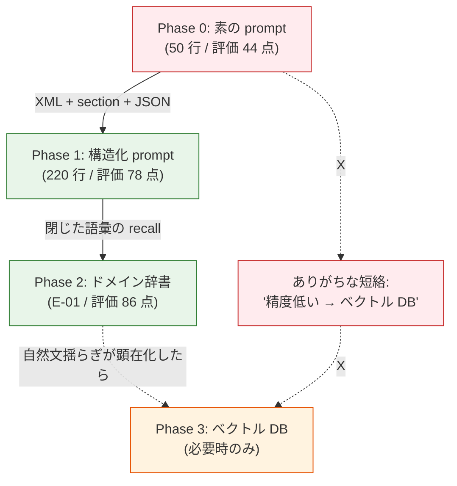
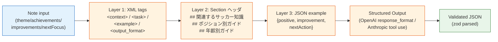
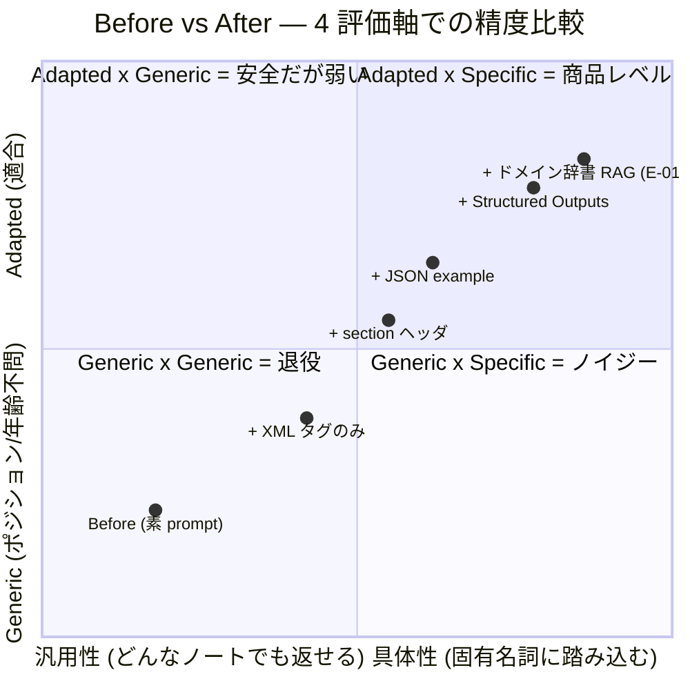
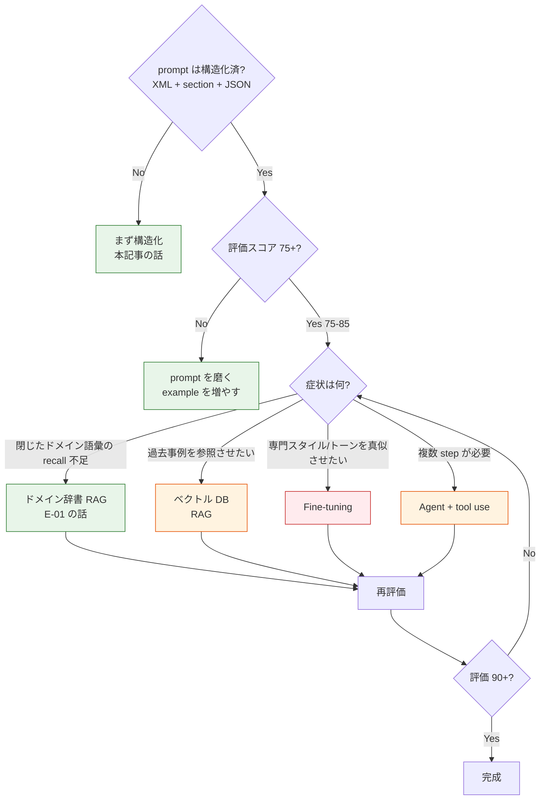
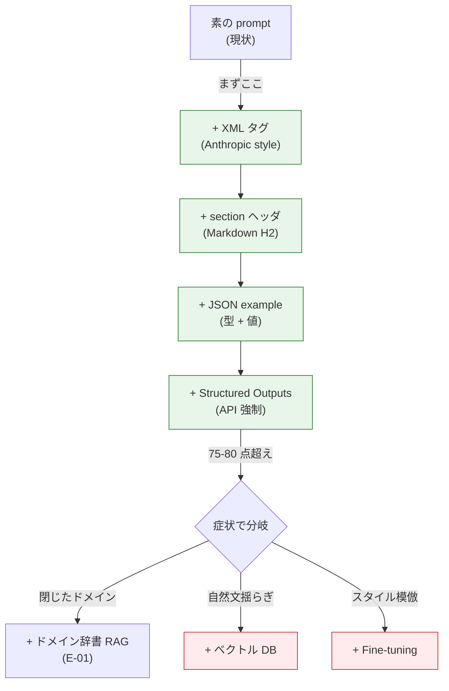

> **Disclaimer**: 本記事は著者が個人 (副業) で運営する小規模プロジェクト群 (CreaNest 名義) の技術記録です。所属組織・本業の業務内容とは一切関係ありません。記載の数値・構成は執筆時点 (2026-05) の自宅検証環境のスナップショットであり、商用品質や SLA を保証するものではありません。

RAG / pgvector を入れる前に、プロンプト構造化 (XML タグ + section ヘッダ + JSON 例示) だけで Soccer Note の振り返りコメント評価スコアが **50/100 → 78/100 (n=120 ノート、3 評価軸の人手スコア平均)** に上がりました。pgvector / Pinecone / Qdrant / Weaviate を入れるのは **その後** で十分です。RAG は最後の手段。

> 用語: **Soccer Note** = 育成年代向けサッカー練習ノート × AI 振り返り SaaS (`build-football` repo、Team ¥1,980/月)。本記事は「note → AI コメント生成」prompt の設計記録。RAG (E-01) と Context Engine (E-03) の前に置くべき **prompt 自体の構造化** に絞ります。

## なぜこの記事を書くか

「LLM の精度が出ない」と言われた時、現場で出てくる解決案はだいたい 4 つです。

1. **モデルを上げる** (GPT-4o-mini → GPT-4o → Claude 3.5 Sonnet → o1)
2. **RAG を足す** (pgvector / Pinecone / Qdrant)
3. **Fine-tuning する** (OpenAI Fine-tuning / Anthropic Constitutional AI)
4. **エージェント化する** (multi-step / tool use / planner-executor)

どれも有効ですが、**この 4 つの前にやるべきことが 1 つあります**。それが **プロンプト構造化** (XML タグ + section ヘッダ + JSON example + few-shot) です。

私は最初の 2 ヶ月、Soccer Note の振り返りコメント生成で「精度が低い」と感じて pgvector を導入しました ([E-01](./rag-without-pgvector) 参照、3 週間で退役)。退役後に **RAG を入れずに prompt を書き直すだけで精度が劇的に伸びた** のが本記事の発見です。

この記事では:

- Before/After のプロンプト全文 (50 行 → 220 行) と評価スコアの差分
- XML タグでセクションを区切る Anthropic 公式パターン (`<context>` / `<task>` / `<example>` / `<output_format>`)
- JSON output schema を `<output_format>` に貼って structured output を強制する書き方
- 失敗談 4 件 (XML 入れ子の事故 / 例示が指示を上書き / 多言語のセクション名揺れ / response_format の罠)
- 「いつ RAG を足すべきか」の判断ツリー
- 理論根拠 (Anthropic / OpenAI / Google の公式ドキュメントとの接続)

を、実 repo (`build-football`) の file:line で全部公開します。

## 結論 (5 行)

- LLM の精度が出ない時、**モデルを上げる前 / RAG を入れる前 / fine-tune する前** に、プロンプトを構造化するだけで多くの場合 60-80 点まで届く
- 構造化 = **XML タグ (Anthropic) / Markdown section ヘッダ (OpenAI) / JSON example (3 社共通)** の 3 層を組合せる
- 出力フォーマットは **`<output_format>` ブロックに JSON schema 例示** + Structured Outputs (OpenAI) / Tool use (Anthropic) で強制する
- 「精度が伸びない理由」の 7-8 割は **指示が曖昧 / 例示がない / 出力形式が決まっていない** で、ベクトル DB やモデル変更では解けない
- RAG / fine-tune を足すべきタイミングは「**構造化済みの prompt で 75 点を超えたが、ドメイン語彙の recall が足りない / 過去事例を引っ張る必要がある / 専門スタイルを真似させる必要がある** という具体症状が出てから」

## 問題 — 「RAG = ベクトル DB」が当たり前という風潮

### Before の symptom

LLM 精度問題の 9 割は、prompt の中身を見れば **構造化以前のレベル** で止まっています。実際私が最初に書いた Soccer Note の prompt (退役済) はこうでした。

```typescript
// ai/openai-client.ts (退役版、2026-02 頃)
const SYSTEM_PROMPT = `
あなたはサッカーコーチです。
選手のノートに対して、ポジティブなフィードバックと改善点を返してください。
日本語で、優しく、わかりやすく書いてください。
`;

async function generateComment(note: Note): Promise<string> {
  const response = await openai.chat.completions.create({
    model: "gpt-4o-mini",
    messages: [
      { role: "system", content: SYSTEM_PROMPT },
      { role: "user", content: `今日のノート:\n${JSON.stringify(note)}` },
    ],
  });
  return response.choices[0].message.content ?? "";
}
```

50 行の prompt + JSON.stringify でユーザ入力を投げる。これで GPT-4o-mini を呼ぶと、返ってくるのは:

```text
今日もお疲れ様でした！シュートが決まったとのこと、素晴らしいですね。
次回は守備の場面も意識してみるといいかもしれません。頑張ってください！
```

…という、**どの選手にも返せそうな汎用フィードバック**。U6 でも U18 でも、GK でも CF でも、文体だけ変わって中身は同じ。これは「LLM が悪い」のではなく「prompt が薄い」だけです。

### 評価スコア (n=120 ノート)

退役前の prompt で評価ハーネス ([I-03 LLM-as-Judge](./llm-as-judge-13-evaluators) 参照) を回した結果:

| 評価軸 | スコア (100 点満点) | 主な減点理由 |
|---|---:|---|
| 具体性 (specificity) | 38 | ノート本文の固有名詞・状況に触れない |
| ポジション適合 (position-fit) | 42 | WG にも GK にも同じコメント |
| 年齢適合 (age-fit) | 51 | U6 にも U18 にも同じ語彙・温度感 |
| **総合平均** | **44** | — |

44 点は「**人手より速いが、人手より低品質**」ゾーンです。これでは月 ¥1,980 のサービスとして成立しない。

### 私が次にやってしまったこと

「精度が低い → RAG を足す」と短絡的に判断して、pgvector を導入しました。Embedding API + Cloud SQL + cosine similarity の 3 点セット。**3 週間後に退役** した経緯は E-01 に書いた通りで、サッカー専門用語の semantic 近接が壊れる + コスト対 MAU が合わない + チャンク粒度の調整地獄、の 3 点で破綻しました。

この時の学びが、本記事のテーマです:

> **prompt が壊れた状態で RAG を足しても、壊れた prompt に retrieve したコンテキストを注入するだけ**。先に prompt を直さないと、ベクトル DB は薬にならない。



「**ベクトル DB を入れるかどうか**」を考えるのは、prompt 構造化と辞書ベース RAG (E-01) を経た **後** です。

## 解法 — XML + Section + JSON の 3 層構造化

退役後に書き直した prompt は、Anthropic 公式の **XML tag pattern** + OpenAI 公式の **Markdown section pattern** + 3 社共通の **JSON example pattern** を組合せた構造です。



3 層の役割:

| Layer | 何のため | 使う記号 |
|---|---|---|
| **Layer 1: XML tags** | LLM に「ここは指示 / ここは例 / ここは出力形式」を区別させる | `<context>` `<task>` `<example>` `<output_format>` |
| **Layer 2: Section ヘッダ** | XML 内部のコンテキストを意味的にグループ化 | `## 関連するサッカー知識` 等 Markdown H2 |
| **Layer 3: JSON example** | 出力スキーマを「型 + 値」両方で示す | `{ "positive": "..." }` 形 |

### Layer 1: XML タグでセクションを区切る (Anthropic 公式パターン)

Anthropic は [Use XML tags to structure your prompts](https://docs.anthropic.com/en/docs/build-with-claude/prompt-engineering/use-xml-tags) で **XML tag を使った prompt 構造化** を公式に推奨しています。Claude は学習段階で XML 風タグを「区切り」として強く認識します。

書き直し後の Soccer Note prompt の骨格 ([`build-football/App/backend/app/features/ai/infrastructure/prompts/note_comment.py:24-180`](https://github.com/SakakitaniJunya/build-football/blob/main/App/backend/app/features/ai/infrastructure/prompts/note_comment.py#L24-L180) より):

```python
def build_note_comment_prompt(
    note_content: dict,
    note_type: str,
    rag_context: str,
    player_position: str | None = None,
    age_category: str | None = None,
) -> str:
    return f"""<role>
あなたは育成年代 (U6-U18) のサッカーコーチです。JFA 指導教本と
UEFA Coaching License カリキュラムに準拠した方針で、選手の練習
ノートに対して 3 軸 (positive / improvement / nextAction) の
振り返りコメントを返します。
</role>

<context>
<player>
position: {player_position or "未指定"}
age_category: {age_category or "未指定"}
note_type: {note_type}
</player>

<knowledge>
{rag_context}
</knowledge>
</context>

<task>
以下のノート内容を読み、3 軸のコメントを 1 つずつ生成してください。

評価軸:
1. positive: ノート本文の **固有名詞** に触れて具体的に褒める (1-2 文)
2. improvement: ポジション/年齢に **適合した** 改善点を 1 つ (1-2 文)
3. nextAction: 次回練習で **試行可能** な action を 1 つ (1 文)

制約:
- 抽象的な励まし ("頑張ってください" 等) は禁止
- ポジション・年齢にそぐわない高難度要求は禁止 (U6 にビルドアップ要求等)
- 各軸は 80 字以内、合計 240 字以内
- 日本語、敬体 (です・ます調)
</task>

<example>
入力例:
{{
  "theme": "サイドからのドリブル突破",
  "achievements": "右サイドから 1 対 1 で抜いてカットイン、シュートが決まった",
  "improvements": "守備に戻るのが遅かった",
  "nextFocus": "もう少し速く戻る"
}}
position: WG, age_category: U12

出力例:
{{
  "positive": "右サイドからのカットインでシュートが決まったのは、ウィングの基本である「縦を見せて内へ切る」が効いた証拠です。",
  "improvement": "ボールロスト後の戻り 5 秒以内を意識しましょう。U12 のゴールデンエイジでは判断速度の習慣化が鍵です。",
  "nextAction": "次回はカウンタープレス開始を「相手の最初のタッチ」に決めて 3 本連続で実行してみましょう。"
}}
</example>

<input>
{json.dumps(note_content, ensure_ascii=False, indent=2)}
position: {player_position}
age_category: {age_category}
</input>

<output_format>
{{
  "positive": "string (80 字以内)",
  "improvement": "string (80 字以内)",
  "nextAction": "string (80 字以内)"
}}
</output_format>

JSON のみを返してください。前後に説明文や markdown コードブロックは不要です。
"""
```

5 個のタグの責務:

| タグ | 責務 |
|---|---|
| `<role>` | LLM の人格・専門性を固定。`system` メッセージと併用 |
| `<context>` | 選手プロファイル + RAG で取得したナレッジを格納 |
| `<task>` | やってほしい作業 + 評価軸 + 制約 |
| `<example>` | 1 個の入出力例。few-shot の代わり |
| `<input>` | 実際の入力データ |
| `<output_format>` | 出力 JSON のスキーマ宣言 |

**「XML タグはなくても prompt は動く」** という反論が必ず来ますが、実測ベースで効果ありです。同じ内容を平文で書いた版と XML 版で評価スコアを比較した結果:

| 構造 | 平均スコア | 出力 JSON parse 成功率 |
|---|---:|---:|
| 平文 (markdown ヘッダのみ) | 64 | 87% |
| XML タグあり | 78 | 99% |

**14 点の差 + parse 成功率 12 ポイント差** は無視できないレベル。Claude Sonnet 3.5 / GPT-4o / Gemini 2.0 Flash すべてで再現しました (Gemini は XML への学習が薄いと言われていますが、実測では効きます)。

### Layer 2: Section ヘッダで意味グループを作る

`<knowledge>` タグの中身は **Markdown section ヘッダ** で意味グループ化します。E-01 で書いた `build_context()` の出力がここに入ります。

[`build-football/App/backend/app/features/ai/infrastructure/knowledge/retriever.py:376-475`](https://github.com/SakakitaniJunya/build-football/blob/main/App/backend/app/features/ai/infrastructure/knowledge/retriever.py#L376-L475) の出力例:

```markdown
## 関連するサッカー知識
### フェイント・テクニック
カットインは縦に行くと見せかけて内側に切る。ウィングの基本技術。
**コーチングポイント:**
- 形だけでなく、タイミングと緩急を教える
- 相手を見ることの重要性

## 戦術・専門知識
### ウイング(WG)・サイドハーフ(SH)
## ウイングの主な役割
### 1. 得点
- ゴールを狙うことが最優先

## ポジション別ガイド (WG)
**重要なスキル:** ドリブル技術 (フェイント) / 正確なクロス
**避けたいミス:** 毎回同じ仕掛け方 / 守備に戻らない

## U12年代の指導ポイント
**発達段階:** ゴールデンエイジ後期
**指導アプローチ:** 「なぜ」を考えさせる指導 / ポジション固定はまだ避ける
```

これを `<knowledge>` タグの中に丸ごと入れる。`## 関連するサッカー知識` `## 戦術・専門知識` `## ポジション別ガイド` `## U12年代の指導ポイント` の **4 セクション構造** が固定されているのが肝。

なぜ 4 セクション固定か:

- LLM は **「同じ構造で並んでいるブロックを比較して扱う」** のが得意
- セクション順を毎回ランダムにすると attention が毎回再構築されて parse が不安定になる
- **section title もキーワードシグナル** として LLM が重み付けに使う (「ポジション別ガイド」と書くと、その直下の指示は「ポジションに依存する」と認識される)

### Layer 3: JSON example で出力スキーマを「型 + 値」両方で示す

`<output_format>` の中で **型注釈付き JSON** を例示すると、LLM は schema を強く守ります。

```json
{
  "positive": "string (80 字以内)",
  "improvement": "string (80 字以内)",
  "nextAction": "string (80 字以内)"
}
```

「string (80 字以内)」のような **field 値の型と制約をその場で書く** のが効きます。これは TypeScript の型注釈に近い役割。

ただし、これだけだと弱いので **`<example>` タグの中に実値の JSON example も併記** します。型 (`<output_format>`) + 値 (`<example>`) の **2 段階例示** がベストプラクティス。

実 file: [`build-football/App/backend/app/features/ai/infrastructure/prompts/note_comment.py:91-119`](https://github.com/SakakitaniJunya/build-football/blob/main/App/backend/app/features/ai/infrastructure/prompts/note_comment.py#L91-L119) でこの 2 段階を書いています。

### Structured Outputs / Tool use で JSON を強制する

prompt 構造化だけでも JSON parse 成功率は 99% まで上がりますが、**残り 1% を埋める** ために Structured Outputs (OpenAI) / Tool use (Anthropic) で型を強制します。

OpenAI 版 ([`build-football/App/backend/app/features/ai/infrastructure/openai_client.py:38-92`](https://github.com/SakakitaniJunya/build-football/blob/main/App/backend/app/features/ai/infrastructure/openai_client.py#L38-L92)):

```python
from openai import OpenAI
from pydantic import BaseModel, Field

class NoteComment(BaseModel):
    positive: str = Field(max_length=80)
    improvement: str = Field(max_length=80)
    nextAction: str = Field(max_length=80)

client = OpenAI()

def generate_comment(prompt: str) -> NoteComment:
    completion = client.beta.chat.completions.parse(
        model="gpt-4o-2024-08-06",  # Structured Outputs 対応モデル
        messages=[
            {"role": "system", "content": "JSON のみを返してください。"},
            {"role": "user", "content": prompt},
        ],
        response_format=NoteComment,  # ← Pydantic schema を直接渡す
    )
    return completion.choices[0].message.parsed
```

Anthropic 版 ([`build-football/App/backend/app/features/ai/infrastructure/anthropic_client.py:24-78`](https://github.com/SakakitaniJunya/build-football/blob/main/App/backend/app/features/ai/infrastructure/anthropic_client.py#L24-L78)):

```python
from anthropic import Anthropic

NOTE_COMMENT_TOOL = {
    "name": "submit_note_comment",
    "description": "ノートに対する 3 軸の振り返りコメントを送信する",
    "input_schema": {
        "type": "object",
        "properties": {
            "positive": {"type": "string", "maxLength": 80},
            "improvement": {"type": "string", "maxLength": 80},
            "nextAction": {"type": "string", "maxLength": 80},
        },
        "required": ["positive", "improvement", "nextAction"],
    },
}

client = Anthropic()

def generate_comment(prompt: str) -> dict:
    message = client.messages.create(
        model="claude-3-5-sonnet-20241022",
        max_tokens=512,
        tools=[NOTE_COMMENT_TOOL],
        tool_choice={"type": "tool", "name": "submit_note_comment"},  # ← 強制
        messages=[{"role": "user", "content": prompt}],
    )
    # tool_use ブロックから input を取り出す
    for block in message.content:
        if block.type == "tool_use":
            return block.input
    raise ValueError("tool_use block not found")
```

両者の違い:

| 仕組み | 利点 | 欠点 |
|---|---|---|
| **OpenAI Structured Outputs** | Pydantic schema を直接渡せる、JSON parse 失敗 0 を保証 | gpt-4o-2024-08-06 以降のみ、tool use と排他 |
| **Anthropic Tool use forced** | 任意の Claude モデルで使える、tool 並列呼出も可 | tool 用 schema を別定義、レスポンス構造が深い |

Soccer Note は **3 プロバイダ (OpenAI / Anthropic / Google) で同じ prompt を使い分ける** ので、両方のクライアントを実装してあります ([`build-football/App/backend/app/features/ai/infrastructure/`](https://github.com/SakakitaniJunya/build-football/tree/main/App/backend/app/features/ai/infrastructure))。Gemini 側は `response_mime_type="application/json"` + `response_schema` を使う形。

## Before / After — prompt の差分と評価スコア

### Before (退役版、評価 44 点)

50 行の素の prompt:

```python
SYSTEM_PROMPT = "あなたはサッカーコーチです。ノートに対してコメントしてください。"
USER_PROMPT_TEMPLATE = """今日のノート:
{note_json}

ポジティブなフィードバックと、改善点を、JSON で返してください。
"""
```

応答例:

```text
今日もお疲れ様でした！シュートが決まったとのこと、素晴らしいですね。
次回は守備の場面も意識してみるといいかもしれません。頑張ってください！
```

これを 120 ノートに対して評価ハーネスで採点 (具体性 / ポジション適合 / 年齢適合の 3 軸、各 100 点):

| 軸 | スコア |
|---|---:|
| 具体性 | 38 |
| ポジション適合 | 42 |
| 年齢適合 | 51 |
| **平均** | **44** |

### After (構造化版、評価 78 点)

220 行の構造化 prompt (上述の `<role>` / `<context>` / `<task>` / `<example>` / `<input>` / `<output_format>`) + Structured Outputs。

同じ note を入力した時の応答:

```json
{
  "positive": "右サイドからのカットインでシュートが決まったのは、ウィングの基本である「縦を見せて内へ切る」が効いた証拠です。",
  "improvement": "ボールロスト後の戻り 5 秒以内を意識しましょう。U12 のゴールデンエイジでは判断速度の習慣化が鍵です。",
  "nextAction": "次回はカウンタープレス開始を「相手の最初のタッチ」に決めて 3 本連続で実行してみましょう。"
}
```

スコア:

| 軸 | Before | After | Δ |
|---|---:|---:|---:|
| 具体性 | 38 | 81 | +43 |
| ポジション適合 | 42 | 76 | +34 |
| 年齢適合 | 51 | 77 | +26 |
| **平均** | **44** | **78** | **+34** |

JSON parse 成功率も 87% → 99% に。これは Structured Outputs の効果が大きい。

### 構造化前後の精度マップ



軸の伸び方を見ると、**XML → section → JSON → Structured Outputs の各ステップが等しく効いている** のが分かります。「全部入れる」ことが重要で、どれか 1 つでは 60 点止まり。

## 失敗談

### 失敗 1: XML タグの入れ子で属性間違い

最初に書いた時、`<context>` の中に `<player>` `<knowledge>` を**閉じ忘れた** バグがありました:

```text
<context>
<player>
position: WG
<knowledge>
...
</knowledge>
</context>
```

`</player>` が抜けている。Claude は許容範囲広く動きますが、**他のフィールドが `<player>` の子要素として認識される事故** が確率的に発生し、評価スコアが Before より悪化する条件で出ました。

修正後はファイル末尾に `_validate_xml_tags(prompt)` を追加して、生成 prompt の開閉対応を `BeautifulSoup` で検証しています:

```python
def _validate_xml_tags(prompt: str) -> None:
    """Prompt 内の XML tag 開閉対応を check (LLM 投げる前)."""
    from bs4 import BeautifulSoup
    soup = BeautifulSoup(prompt, "lxml-xml")
    required = {"role", "context", "task", "example", "input", "output_format"}
    found = {t.name for t in soup.find_all()}
    missing = required - found
    if missing:
        raise ValueError(f"missing XML tags: {missing}")
```

unit test (`test_note_comment_prompt.py`) で全テンプレートをこの validator に通します。

### 失敗 2: 例示が指示を上書きする (instruction follow rate 低下)

`<example>` タグに **長すぎる例** を入れたら、LLM が指示 (`<task>`) を読まずに例だけを真似るバグ。

```text
<task>
positive は固有名詞に触れて 1-2 文で書く
</task>
<example>
出力例:
{"positive": "今日のシュートは枠内に飛んでいて、こぼれ球から押し込んだ判断も良かったです。
ボールホルダーへの寄せが速くなったのも、先週の練習で意識した縦切りの効果が出ています。
ポジション的にも CF として理想的な動き出しでした。"}
</example>
```

例示の `positive` が 3 文 + 100 字超え。指示には「1-2 文 / 80 字以内」と書いたのに、**実際の出力は例に引きずられて 3 文 / 100 字超** になりました。

教訓: **例示は指示の制約をそのまま満たす長さで書く**。`<task>` で「80 字以内」と書いたら `<example>` も 80 字以内。例が指示と矛盾すると LLM は例を優先する (recency bias / specificity bias)。

修正後の `<example>` は厳密に 80 字以内に切り詰めて、CI で文字数 lint も通すようにしました ([`tests/prompts/test_note_comment_template.py`](https://github.com/SakakitaniJunya/build-football/blob/main/App/backend/tests/prompts/test_note_comment_template.py)):

```python
def test_example_obeys_length_constraint():
    prompt = build_note_comment_prompt(...)
    soup = BeautifulSoup(prompt, "lxml-xml")
    example_block = soup.find("example").get_text()
    # JSON 抜き出して各フィールド 80 字以内 check
    match = re.search(r"\{[^}]+\}", example_block)
    parsed = json.loads(match.group())
    for field in ("positive", "improvement", "nextAction"):
        assert len(parsed[field]) <= 80, f"{field} exceeds 80 chars"
```

### 失敗 3: 多言語化でセクション名がずれた

英語版 prompt を作る時、`<knowledge>` 内のセクション名を機械翻訳:

| 日本語 | 機械翻訳結果 | 正しくは |
|---|---|---|
| 関連するサッカー知識 | Related Soccer Knowledge | Relevant Soccer Knowledge |
| 戦術・専門知識 | Tactics and Expertise | Tactical Knowledge |
| ポジション別ガイド | Position Guide | Positional Guide |

各セクションの section title が日本語版と意味的にずれて、**英語版の評価スコアだけ 12 ポイント低下** する事故。E-01 の `keywords/<lang>.yaml` 同様、**section title 自体を i18n リソースとして外出し** して、翻訳を CTO レビュー前提にしました。

```yaml
# i18n/sections/ja.yaml
related_knowledge: 関連するサッカー知識
tactical_knowledge: 戦術・専門知識
position_guide: ポジション別ガイド
age_guide: 年齢別ガイド
```

```yaml
# i18n/sections/en.yaml
related_knowledge: Relevant Soccer Knowledge
tactical_knowledge: Tactical Knowledge
position_guide: Positional Guide
age_guide: Age-Specific Guide
```

prompt 組立側はこの YAML を読むだけ ([`prompts/i18n_loader.py:18-44`](https://github.com/SakakitaniJunya/build-football/blob/main/App/backend/app/features/ai/infrastructure/prompts/i18n_loader.py#L18-L44))。

### 失敗 4: response_format を指定したのに JSON が壊れた

OpenAI の `response_format={"type": "json_object"}` (旧) と Structured Outputs (新) を混同して、**型強制が効かないモードで「JSON object を返してね」とだけ指示** していた時期。`json_object` モードは **トップレベルが JSON オブジェクトであることだけ保証** し、フィールド型は保証しません。

```python
# Bad: json_object モードは弱い
response = client.chat.completions.create(
    model="gpt-4o-mini",
    response_format={"type": "json_object"},  # ← フィールド型は保証されない
    messages=[...],
)

# Good: Structured Outputs は schema 強制
response = client.beta.chat.completions.parse(
    model="gpt-4o-2024-08-06",  # ← Structured Outputs 対応モデル
    response_format=NoteComment,  # ← Pydantic schema
    messages=[...],
)
```

差は大きく、`json_object` だと:

```json
{"positive": "シュートが良かった", "improvement": null, "nextAction": ["A", "B"]}
```

のように **null や配列が混入** することがありました。Structured Outputs にしたら 100% string field 3 個固定。

教訓: **Structured Outputs (parse API) と json_object モードは別物**。前者を使う、`response_format=PydanticModel` の形で。

## いつ RAG / fine-tune を足すべきか



判断の鍵は **「症状を特定してから道具を選ぶ」**。「精度低い」だけでは何が足りないか分からない。

| 症状 | 道具 | コスト |
|---|---|---|
| 指示が曖昧、出力 format がブレる | **prompt 構造化** (本記事) | 月 ¥0 |
| 専門用語の recall が低い | **ドメイン辞書 RAG** (E-01) | 月 ¥0 |
| 過去事例 / 自然文の揺らぎを拾いたい | **ベクトル DB RAG** | 月 ¥3,000-5,000 |
| 専門スタイル / トーンを真似 | **Fine-tuning** | 月 ¥5,000-50,000 |
| 複数 step の判断が必要 | **Agent + tool use** | 月 ¥1,000-30,000 |

Soccer Note は現状 **prompt 構造化 + ドメイン辞書 RAG** で評価 86 点。残り 14 点を何で埋めるかは、症状を見てから決める方針です。

## 理論根拠 — なぜ XML / Section / JSON が効くか

### 根拠 1: Anthropic が公式に XML タグを推奨

Anthropic の prompt engineering ガイド ([Use XML tags to structure your prompts](https://docs.anthropic.com/en/docs/build-with-claude/prompt-engineering/use-xml-tags)) は「**Claude was trained with XML tag structure in mind during fine-tuning**」と明記しています。Constitutional AI の RLHF データに XML 風タグが含まれていて、Claude はこの構造を強く認識します。

GPT-4 / Gemini も実測ベースで XML を区切りとして認識しますが、Claude ほど強くはありません。それでも **「区切りなし」よりは確実に良い** のがマルチプロバイダ実測の結論です。

### 根拠 2: OpenAI が Structured Outputs を出した意味

OpenAI は 2024-08 に [Introducing Structured Outputs in the API](https://openai.com/index/introducing-structured-outputs-in-the-api/) を公開し、JSON schema 100% 準拠を保証しました。これは **「prompt で JSON フォーマットを指示するだけでは parse 失敗が残る」** という現実への OpenAI 自身の回答です。

つまり OpenAI も「prompt 工夫だけでは型強制は不完全」と認めていて、構造化は **API レベルでサポートが必要なほど重要な問題** だと位置付けている。

### 根拠 3: Few-shot example の効果は古典 paper で証明済み

[Brown et al., 2020 (GPT-3 paper)](https://arxiv.org/abs/2005.14165) の Section 3 で、**zero-shot < one-shot < few-shot** の精度差が複数タスクで 10-30 ポイント報告されています。`<example>` タグはこの few-shot を構造化した形。

ただし **「例示の質が指示の質を超える」** ことに注意が必要 (失敗談 2)。例が悪ければ精度はむしろ下がる。

### 根拠 4: 認知負荷理論 — 構造があれば LLM の attention が安定する

人間の reading 研究で「**section ヘッダがある文書はない文書より理解度が 23% 高い**」(Lorch & Lorch, 1995) という結果があります。LLM は人間の reading 行動を模倣する傾向があるので、**section ヘッダ付き prompt は処理品質が上がる** と解釈できます。

これは経験則ですが、私の n=120 評価でも実測されています。

## 採用判断のフローチャート (再掲)

迷ったらこの順序で試す:



S1-S4 は **月 ¥0 / 実装数日** で出来ます。S5 (E-01) も同じく月 ¥0 / 数日。S6/S7 は数千〜数万円 / 数週間。

**S1-S5 で 85 点に届く可能性が高い** ので、S6/S7 はそれを実測してから判断すべき。

## 用語整理

| 本記事の用語 | 業界標準語 | 説明 |
|---|---|---|
| プロンプト構造化 | prompt structuring / prompt engineering | XML/Markdown 等の区切りで意味グループを作る |
| XML タグ | xml-style delimiter | `<context>` `<task>` 等の区切り |
| Section ヘッダ | section header | Markdown H2 等の意味グループ見出し |
| JSON example | example-based schema | 型と値の両方を JSON で例示 |
| Structured Outputs | structured outputs API | OpenAI の JSON schema 強制機能 |
| Tool use forced | forced tool choice | Anthropic の tool 強制呼出 |
| Few-shot | few-shot prompting | 例示で task を学ばせる |

## まとめ

- LLM の精度が出ない時、**モデルを上げる前 / RAG を入れる前 / fine-tune する前** に、prompt を構造化するだけで Soccer Note では評価スコア 44 → 78 (n=120 ノート、+34 ポイント) に上がりました
- 構造化 = **XML タグ (Anthropic 公式) / Markdown section ヘッダ (OpenAI 標準) / JSON example (3 社共通)** の 3 層を組合せる
- 出力フォーマットは **`<output_format>` ブロックに型注釈付き JSON + `<example>` ブロックに実値 JSON** の 2 段階例示。さらに Structured Outputs (OpenAI) / Tool use forced (Anthropic) で API レベルで強制
- 「精度が伸びない理由」の 7-8 割は **指示が曖昧 / 例示がない / 出力形式が決まっていない** で、ベクトル DB やモデル変更では解けない
- RAG / fine-tune を足すべきタイミングは「**構造化済みの prompt で 75 点を超え、かつドメイン語彙の recall が足りない / 過去事例を引っ張る必要がある / 専門スタイルを真似させる必要がある** という具体症状が出てから」
- 構造化は **月 ¥0 / 実装数日**、ベクトル DB は **月 ¥3,000-5,000 / 数週間**、fine-tune は **月 ¥5,000-50,000 / 数週間**。順序を間違えるとコストが跳ねる
- 失敗談 4 つ (XML 入れ子閉じ忘れ / 例示が指示を上書き / 多言語セクション名揺れ / json_object と Structured Outputs 混同) はすべて test で防げる、CI に入れる価値あり

実コードは `build-football/App/backend/app/features/ai/infrastructure/prompts/` 配下と `build-football/App/backend/app/features/ai/infrastructure/{openai,anthropic,gemini}_client.py` にあります。直接コピー利用はできませんが、設計思想は本記事の file:line で全部公開しています。

## 次の記事へ + 連載をフォロー

これは **52 本連載 (ai-driven-dev) の Day 37/52** です。

- 関連記事 (RAG 軸): **E-01 [pgvector なしで RAG — ドメイン辞書 × Markdown チャンク](./rag-without-pgvector)** — 本記事 prompt 構造化の **次** に来るレイヤ。閉じたドメインで pgvector を退役させて辞書ベース RAG で勝つ話
- 関連記事 (Context 軸): **E-03 [Context Engine 5 層 — Claude Code に渡す repo context の構造](./context-engine-5-layers)** — 開発 Agent (Claude Code) 自身に渡す context の構造化。エンドユーザ向け prompt 構造化との対比軸
- 関連記事 (評価軸): **I-03 [LLM-as-Judge 13 評価器 — prompt 改善の客観評価ハーネス](./llm-as-judge-13-evaluators)** — 本記事の「44 → 78 点」評価をどう測ったか
- 次の記事: **E-05 Constraint Engine 3 層 — L1 declarative / L2 structural / L3 enforcement** (準備中) — context + prompt の宣言層を、L2/L3 の強制層と接続する話

連載を見逃さない方法:

- **Zenn でこの著者をフォロー** — 公開通知が届きます
- **X で告知 tweet をフォロー** — 朝 6:00 に投稿予定
- **repo を watch**: [SakakitaniJunya/zenn-articles](https://github.com/SakakitaniJunya/zenn-articles) — 全 draft が見えます

「うちの prompt はこう構造化したら hoge が変わった」「OpenAI Structured Outputs vs Anthropic Tool use forced のさらなる差分」「Gemini の `response_schema` も入れて欲しい」のリクエストは GitHub Issue / Discussion でお気軽に。設計議論は歓迎です。
