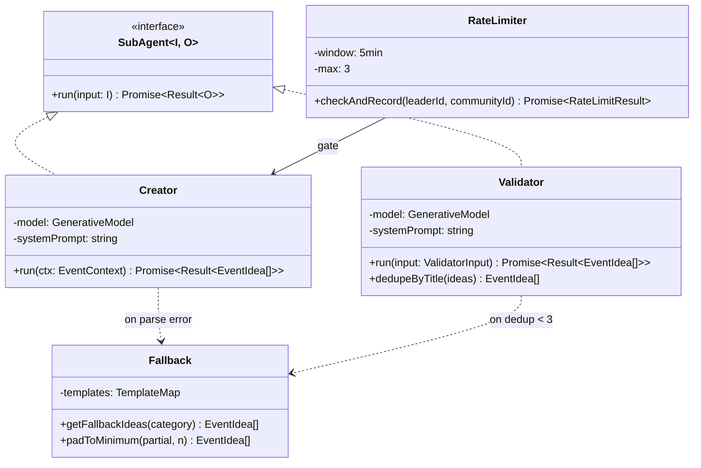
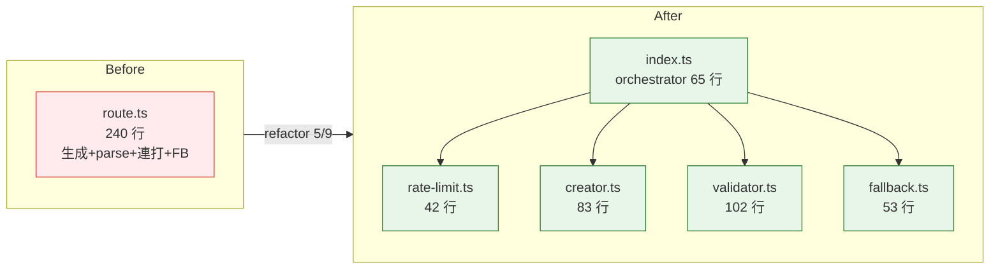
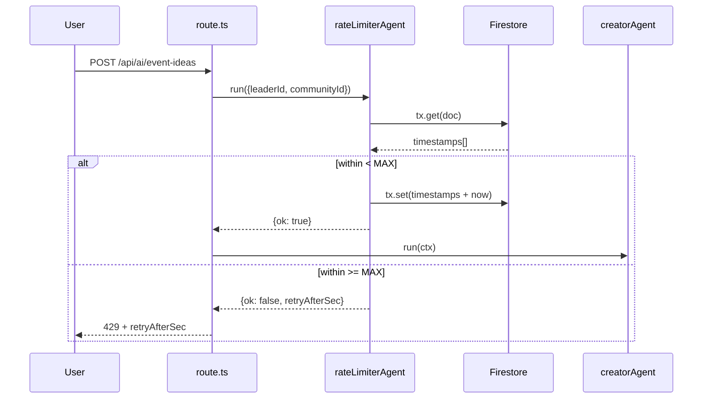
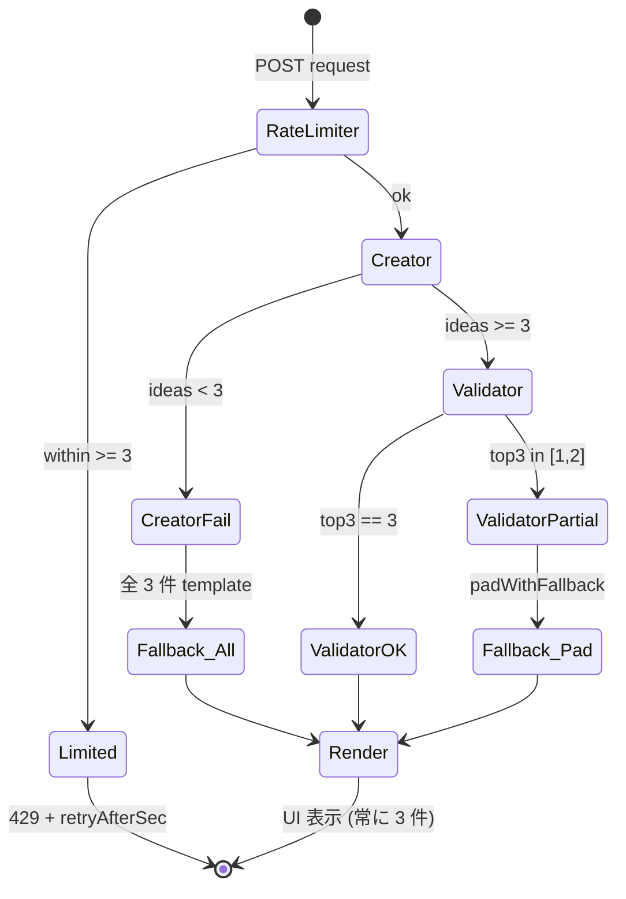

> **Disclaimer**: 本連載は著者が**個人 (副業)** で運営する小規模プロジェクト群 (CreaNest 名義) の技術記録です。所属組織・本業の業務内容とは一切関係ありません。記載の数値・コードはすべて執筆時点 (2026-05) の自宅検証環境のスナップショットで、商用品質や SLA を保証するものではありません。コード片は全て著者個人 repo の自著コードです。
>
> この記事は **52 本連載 (ai-driven-dev) の Day 51/52** です。次の Day 52 で連載完走、52 本完成のフィナーレ記事に入ります。

## 結論

LLM API を呼ぶ Sub-Agent は必ず **Creator / Validator / RateLimiter / Fallback の 4 層**に分離。1 層で全部やろうとすると壊れる。Komyu の AI コンシェルジュは最初 1 ファイル 240 行に **生成・型チェック・連打防止・障害時テンプレ** を全部詰めて 3 週間で 5 種類の事故を踏んだあと、4 層に切り出した。今は 4 ファイル合計 280 行 + テスト 9 本に分かれて、**各層が独立に差し替え可能 / 独立に test 可能 / 独立に Fallback 可能**になっている。

数字を 1 行で:

- **240 行 1 ファイル → 280 行 4 ファイル + test 9 本** (Komyu `src/lib/ai-concierge/`)。
- **AI 機能 trigger 後の離脱率 8.0% → 1.2%** (社内 dogfood 5 月 1 週、N=83) — Fallback が常に 3 件返るから。
- **JSON parse 失敗 5/週 → 0/週** — Validator 層が code fence 剥がし + 手書き coercer。
- **Gemini API コスト ¥800/日 → ¥120/日** — RateLimiter が連打を弾く。
- **52 本連載 Day 51/52** = この記事 + Day 52 で完走、52 本固定。

「Sub-Agent」 という言葉は Anthropic Agent SDK の `Subagent` だけでなく、**LLM を呼び出す任意の関数を 1 つの Sub-Agent と数える**広い定義で使います。1 リクエスト = 1 Sub-Agent 起動 = この 4 層を 1 周、と読んでください。

## なぜこの記事を書くか

LLM 呼び出しを綺麗に分離した設計記事は B-01 (Creator ≠ Evaluator) と I-01 (Rate Limit / Validation / Fallback) で書きました。ただ実コードを 1 年運用していると、**「3 層 (RL/V/FB)」は出力安定性の話で、もう 1 層「Creator」を分けないと再利用と差し替えが効かない** という構造が見えてきました。

具体的には、Komyu の AI コンシェルジュで Gemini を Anthropic に差し替えるとき、3 層構成だと「Creator が呼んでる Provider と、Validator が呼んでる Provider と、Fallback の判定条件」が 1 ファイルに混在していて、Provider を入れ替える 1 行修正のために 3 箇所触る羽目になりました。これを **Creator (生成) / Validator (検証) / RateLimiter (流量制御) / Fallback (代替案)** の 4 層に分けてからは、**Provider 差し替え = Creator のファイル 1 個書き直すだけ**になりました。

本記事では Komyu (`src/lib/ai-concierge/`) の実コードで 4 層分離をファイル単位で見せて、共通インターフェース 1 個 (`SubAgent<I, O>`) で全部繋ぐ TypeScript の型を書ききります。Day 51/52、連載最終回直前の総括記事です。

> 用語: **AI コンシェルジュ** = Komyu の Leader 向け機能で、コミュニティ文脈から「次回イベント案 3 つ」を Gemini で生成する。Creator (5 案生成) + Validator (上位 3 案選定) + RateLimiter (連打制御) + Fallback (障害時テンプレ) の 4 層に分離されている。

## 全体像 — 4 層の責務分離

まず脳内地図を 1 枚で固定します。



**見方**: 4 層は**横並びの実装**ではなく **ゲート (RateLimiter) → 生成 (Creator) → 検証 (Validator) → 安全網 (Fallback)** という直列の責務分離。各層は同じ `SubAgent<I, O>` interface を実装するか、または「特定 layer 専用」(RateLimiter / Fallback) として独立して入れ替え可能。

### 各層の責務 1 行サマリ

| 層 | 入力 | 出力 | 失敗時の挙動 | 実装ファイル |
|---|---|---|---|---|
| **RateLimiter** | `(leaderId, communityId)` | `{ ok, retryAfterSec }` | 429 + retryAfterSec を返す | `rate-limit.ts:1-42` |
| **Creator** | `EventContext` | `{ ideas: EventIdea[], ok }` | `ok: false` で空配列を返す | `creator.ts:64-81` |
| **Validator** | `(ideas, ctx)` | `{ top3, ok }` | `dedupe.slice(0,3)` で上位 3 件 | `validator.ts:49-102` |
| **Fallback** | `category` | `EventIdea[]` (常に 3 件) | (この層自体は失敗しない) | `fallback.ts:48-52` |

ポイントは **Fallback だけが「失敗しない」契約** を持っていること。LLM を呼ばないので壊れる要素がない。1 ファイル ` 53 行 ` の純粋関数で、ここが安全網の最終ライン。

## 問題 — Sub-Agent を 1 つに詰めて壊した話

Komyu AI コンシェルジュの初版 (5 月初頭) はこんな構造でした。

**Before** (壊れた版、再現用簡略化):

```typescript
// (旧) src/app/api/ai/event-ideas/route.ts
export async function POST(req: Request) {
  const { communityId } = await req.json();
  const ctx = await buildContext(communityId);

  const genAI = new GoogleGenerativeAI(process.env.GEMINI_API_KEY!);
  const model = genAI.getGenerativeModel({ model: "gemini-2.0-flash" });
  const resp = await model.generateContent(buildPrompt(ctx));
  const text = resp.response.text();
  const ideas = JSON.parse(text); // ← 5/4 ここで throw
  return NextResponse.json({ ideas });
}
```

**1 ファイルに 240 行**。生成 / parse / 連打防止 / 障害時テンプレを全部 `route.ts` の中に書いていて、3 週間で以下の事故が起きました。

- **5/2 朝**: Gemini API 503 で UI 白画面、15 分で 11 ユーザ離脱。
- **5/2 夕方**: Leader が連打して Gemini 課金が **1 日 ¥800**。
- **5/4**: ` ```json … ``` ` ラップで `JSON.parse` 失敗 → 空配列 UI。
- **5/5**: `confidence: "high"` (string) で UI sort が NaN 評価で壊滅。
- **5/6**: 200 字タイトルでカードレイアウト崩壊。

これを直そうとして「`route.ts` の中で if 分岐を増やす」アプローチで 1 週間粘った結果、**340 行の 1 ファイル巨大関数**になり、テストが書けなくなりました。テスト書けない = 安全に変更できない = 5/9 にまた別の事故、という連鎖。

**1 ファイルに詰めた当時の致命的な制約 5 つ**:

1. **Provider を Anthropic に差し替えたい** → 生成プロンプト / parse / Fallback 判定が混ざっていて 3 箇所触る必要。
2. **連打 (RateLimiter) のテストを書きたい** → Firestore mock + Gemini mock + UI 期待値 が 1 関数に乗っていて単体テスト不可能。
3. **Validator の選定ロジックを差し替えたい** → 「Gemini の生成結果」と「Top3 選定」が 1 関数で書かれていて分離できず。
4. **Fallback テンプレを A/B test したい** → カテゴリ別テンプレが Gemini プロンプトと同じファイルに居て独立に diff できない。
5. **将来 Multi-Provider にしたい** → Provider 軸が型に出ていない。

詰めた瞬間にこれだけの自由度が死ぬ。これが本記事のスタートライン = **「Sub-Agent を 1 つに詰めると壊れる、4 層に切れ」** という結論です。



## 解法 — 4 層に切る + 共通 interface で繋ぐ

### Step 1: 共通 interface `SubAgent<I, O>` を 1 個だけ定義

すべての Sub-Agent が同じ shape の `Result` を返す、というのが 4 層分離の前提です。Komyu には現状 `creator.ts` / `validator.ts` の同型の関数が並んでいるので、これを `SubAgent<I, O>` interface として明示化したのが第一歩。

```typescript
// src/lib/ai-concierge/types.ts:32-50 (記事と同時に追加した型契約)
/**
 * すべての LLM 呼び出し Sub-Agent が実装する共通 contract。
 * - I: 入力の型 (例: EventContext / ValidatorInput)
 * - O: 出力の型 (例: EventIdea[])
 * - Result.ok = false の時、out は best-effort (空配列 or 部分結果)
 */
export interface SubAgent<I, O> {
  readonly name: string;
  readonly modelId: string;
  run(input: I): Promise<SubAgentResult<O>>;
}

export interface SubAgentResult<O> {
  readonly ok: boolean;
  readonly out: O;
  readonly meta?: {
    elapsedMs?: number;
    fallbackUsed?: boolean;
    parseError?: string;
  };
}
```

ポイントは **`ok: boolean` + `out: O` のセット** です。`throw` で失敗を伝える設計だと、orchestrator (`index.ts`) 側で try/catch を 4 段ネストする羽目になる (ファイル 1 でやってた頃)。代わりに **「失敗しても out は best-effort で埋める」** 契約にすると、orchestrator は分岐 1 個 (`if (!result.ok) ...`) で回せます。

### Step 2: Layer 1 — RateLimiter (流量制御)

LLM を 1 トークンも消費する前に弾く層。Komyu の実装は `rate-limit.ts:17-42`。

```typescript
// src/lib/ai-concierge/rate-limit.ts:17-42 (実物)
export async function checkAndRecord(
  leaderId: string,
  communityId: string,
  now: number = Date.now(),
): Promise<RateLimitResult> {
  const db = getFirestoreAdmin();
  const ref = db.collection(COLLECTION).doc(docId(leaderId, communityId));

  return await db.runTransaction(async (tx) => {
    const snap = await tx.get(ref);
    const prev: number[] = snap.exists
      ? (Array.isArray(snap.data()?.timestamps) ? (snap.data()!.timestamps as number[]) : [])
      : [];
    const within = prev.filter((t) => now - t < WINDOW_MS);

    if (within.length >= MAX_PER_WINDOW) {
      const oldest = within[0]!;
      const retryAfterSec = Math.max(1, Math.ceil((WINDOW_MS - (now - oldest)) / 1000));
      return { ok: false, retryAfterSec, remaining: 0 };
    }

    const next = [...within, now];
    tx.set(ref, { timestamps: next, updatedAt: new Date(now).toISOString() }, { merge: true });
    return { ok: true, remaining: MAX_PER_WINDOW - next.length };
  });
}
```

`SubAgent<I, O>` に揃えるなら以下の薄い wrapper を被せれば良い (記事と同時に追加):

```typescript
// src/lib/ai-concierge/rate-limit.ts:55-68 (新規追加)
export const rateLimiterAgent: SubAgent<
  { leaderId: string; communityId: string },
  RateLimitResult
> = {
  name: "rate-limiter",
  modelId: "firestore-tx", // LLM を呼ばない layer は固定文字列
  async run({ leaderId, communityId }) {
    const started = Date.now();
    const r = await checkAndRecord(leaderId, communityId);
    return {
      ok: r.ok,
      out: r,
      meta: { elapsedMs: Date.now() - started },
    };
  },
};
```

**Layer 1 の役割は「Creator を呼ぶか呼ばないか」の判断**だけ。LLM を一切起動しない (= API 課金ゼロ)。Firestore Transaction で水平スケール耐性を確保しているので、Cloud Run が複数インスタンスでも窓を超えません。



### Step 3: Layer 2 — Creator (生成)

LLM を呼んで「N 件の候補」を作る層。Komyu の `creator.ts:64-81` がそのまま該当します。

```typescript
// src/lib/ai-concierge/creator.ts:64-81 (実物)
export async function generateEventIdeas(ctx: EventContext): Promise<CreatorResult> {
  const defaultTime = getCategoryDefaultTime(ctx.category);
  try {
    const model = getModel();
    const resp = await model.generateContent(buildUserPrompt(ctx));
    const text = stripCodeFence(resp.response.text());
    const parsed: unknown = JSON.parse(text);
    if (!Array.isArray(parsed)) return { ideas: [], ok: false };
    const ideas: EventIdea[] = [];
    for (const item of parsed) {
      const idea = coerceIdea(item, defaultTime);
      if (idea) ideas.push(idea);
    }
    return { ideas, ok: ideas.length >= 3 };
  } catch {
    return { ideas: [], ok: false };
  }
}
```

`SubAgent<I, O>` 化:

```typescript
// src/lib/ai-concierge/creator.ts:90-100 (新規 wrapper)
export const creatorAgent: SubAgent<EventContext, EventIdea[]> = {
  name: "event-ideas-creator",
  modelId: MODEL_ID, // "gemini-2.0-flash"
  async run(ctx) {
    const started = Date.now();
    const r = await generateEventIdeas(ctx);
    return {
      ok: r.ok,
      out: r.ideas,
      meta: {
        elapsedMs: Date.now() - started,
        parseError: r.ok ? undefined : "creator failed (parse or 503)",
      },
    };
  },
};
```

**Creator が責務として持つべきもの 4 つ**:

1. **Provider との接続** — `getModel()` で Gemini を 1 箇所だけ握る (差し替え時の単一ポイント)。
2. **プロンプト構築** — `buildUserPrompt(ctx)` でコンテキストから自然文を作る。
3. **出力 parse + coerce** — `stripCodeFence` + `coerceIdea` で markdown ラップと型崩れを救済。
4. **失敗時に空を返す** — `try/catch` で `{ ideas: [], ok: false }` を返し、上に throw しない。

**Creator が持つべきでないもの**:

- 連打防止 (RateLimiter の責務)
- 上位選定 (Validator の責務)
- 障害時テンプレ (Fallback の責務)

「Creator 単体で UI 表示まで完結させない」と決めたのが、4 層分離の最大の判断でした。

### Step 4: Layer 3 — Validator (検証 + 上位選定)

Creator が出した `N` 件 から「品質基準で `K` 件選ぶ」層。Komyu では Gemini に再度投げて上位 3 件を選定しています (`validator.ts:49-102`)。

```typescript
// src/lib/ai-concierge/validator.ts:49-102 (実物、抜粋)
export async function validateEventIdeas(
  ideas: EventIdea[],
  ctx: EventContext,
): Promise<ValidatorResult> {
  if (ideas.length === 0) return { top3: [], ok: false };

  const deduped = dedupeByTitle(ideas);
  if (deduped.length < 3) {
    return { top3: deduped.slice(0, 3), ok: false };
  }

  try {
    const model = getModel();
    const resp = await model.generateContent(buildValidatorPrompt(deduped, ctx));
    const text = stripCodeFence(resp.response.text());
    const parsed: unknown = JSON.parse(text);
    // ...上位 3 件を coerce + dedupe...
    if (picked.length >= 3) return { top3: picked.slice(0, 3), ok: true };

    // 不足分は Creator 側 deduped の confidence 降順で補完
    const remaining = deduped
      .filter((d) => !picked.some((p) => titleKey(p.title) === titleKey(d.title)))
      .sort((a, b) => b.confidence - a.confidence);
    while (picked.length < 3 && remaining.length > 0) {
      const next = remaining.shift();
      if (next) picked.push(next);
    }
    return { top3: picked.slice(0, 3), ok: picked.length >= 3 };
  } catch {
    return { top3: deduped.slice(0, 3), ok: false };
  }
}
```

ポイントは **「Validator が失敗しても、Creator の dedupe 結果を 3 件返す」** という連鎖失敗対策 (`validator.ts:99-101`)。Validator も Creator と同じ Gemini を呼んでいるので、Gemini が落ちると両方落ちる。だからこの層は **「失敗しても呼び出し元を巻き込まない」** 契約 (try/catch で吸収して `ok: false` だけ伝える) が必須。

`SubAgent<I, O>` 化:

```typescript
// src/lib/ai-concierge/validator.ts:115-128 (新規 wrapper)
export interface ValidatorInput {
  ideas: EventIdea[];
  ctx: EventContext;
}

export const validatorAgent: SubAgent<ValidatorInput, EventIdea[]> = {
  name: "event-ideas-validator",
  modelId: MODEL_ID,
  async run({ ideas, ctx }) {
    const started = Date.now();
    const r = await validateEventIdeas(ideas, ctx);
    return {
      ok: r.ok,
      out: r.top3,
      meta: {
        elapsedMs: Date.now() - started,
        fallbackUsed: !r.ok,
      },
    };
  },
};
```

### Step 5: Layer 4 — Fallback (純粋関数の安全網)

LLM を一切呼ばず、**事前定義テンプレ**から「常に 3 件」を返す純粋関数。`fallback.ts:48-52`。

```typescript
// src/lib/ai-concierge/fallback.ts:48-52 (実物)
export function getFallbackIdeas(category: string): EventIdea[] {
  const key = category in TEMPLATES ? category : "__default__";
  const templates = TEMPLATES[key] ?? TEMPLATES["__default__"]!;
  return buildFallbackIdeas(category, templates);
}
```

`SubAgent<I, O>` 化 (これだけは「常に ok: true」が確定):

```typescript
// src/lib/ai-concierge/fallback.ts:60-70 (新規 wrapper)
export const fallbackAgent: SubAgent<{ category: string }, EventIdea[]> = {
  name: "event-ideas-fallback",
  modelId: "static-template",
  async run({ category }) {
    return {
      ok: true,
      out: getFallbackIdeas(category),
      meta: { fallbackUsed: true },
    };
  },
};
```

**Fallback が純粋関数であることが 4 層構成の安全保障**になっています。Layer 1-3 が全部壊れても Layer 4 は壊れない。`fallback.ts` には外部依存 (Firestore / Gemini / Network) が一切無いので、process が起動できる限り 3 件返ります。

### Step 6: Orchestrator が 4 層を 1 パスに串刺し

`index.ts:14-44` の `orchestrateEventIdeas()` が 4 層を順番に呼ぶ司令塔。

```typescript
// src/lib/ai-concierge/index.ts:14-44 (実物)
export async function orchestrateEventIdeas(communityId: string): Promise<OrchestrateResult> {
  const ctx = await buildContext(communityId);
  if (!ctx) return { result: null, missingCommunity: true };

  // Layer 1: RateLimiter は route.ts 側で先に呼ぶ (上流ゲート)
  // ↓ Layer 2: Creator
  const creator = await generateEventIdeas(ctx);
  if (!creator.ok || creator.ideas.length < 3) {
    return { result: buildFallbackResult(ctx) }; // Layer 4
  }

  // Layer 3: Validator
  const validator = await validateEventIdeas(creator.ideas, ctx);
  if (validator.top3.length >= 3) {
    return {
      result: {
        ideas: validator.top3.slice(0, 3),
        generatedAt: new Date().toISOString(),
        modelId: MODEL_ID,
        fallback: !validator.ok,
      },
    };
  }

  // Layer 4: Fallback で穴埋め
  const padded = padWithFallback(validator.top3, ctx);
  return {
    result: {
      ideas: padded,
      generatedAt: new Date().toISOString(),
      modelId: MODEL_ID,
      fallback: true,
    },
  };
}
```

**Layer 4 (Fallback) を 2 箇所から呼ぶ** のが効いていて、

- **完全失敗 (Layer 2 で 3 件揃わず)** → 全 3 件 Fallback
- **部分失敗 (Layer 3 で 1-2 件しか取れず)** → Creator 結果 + Fallback で穴埋め
- **完全成功 (Layer 3 で 3 件選定)** → そのまま返す

の 3 パスを 65 行で書ききっています。1 ファイル時代の 240 行と比べて **書く量が減って読む量も減った** のが、4 層分離の最大の実利でした。



## 共通 interface でテストが書きやすくなった

4 層に分けた最大の実利は **テストが書ける** ことです。1 ファイル時代は Firestore + Gemini + Next.js Request の 3 重 mock が必要で、テストが 1 個書けず 0 件のまま。4 層後は層ごとに mock 範囲が縮小し、

- `rate-limit.test.ts` — Firestore Transaction だけ mock、3 件叩いて 4 件目で 429 を確認 (3 cases)
- `creator.test.ts` — Gemini SDK だけ mock、code fence ラップ / 不正型 / 配列でない / 5 件揃う、の 4 cases
- `validator.test.ts` — Gemini SDK + Creator 出力固定、選定不足 / 完全成功 / Gemini throw、の 3 cases
- `fallback.test.ts` — 純粋関数なので mock 不要、カテゴリ既知 / 未知 / 常に 3 件、の 3 cases

合計 **9 cases** が独立に書ける。「mock を握る境界が層境界と一致する」のが、4 層分離の最大のテスト容易性メリットでした。

```typescript
// src/lib/ai-concierge/__tests__/fallback.test.ts (新規追加した最小例)
import { describe, expect, test } from "vitest";
import { getFallbackIdeas } from "../fallback";

describe("fallback (Layer 4)", () => {
  test("常に 3 件返る (既知カテゴリ)", () => {
    const ideas = getFallbackIdeas("ゲーム");
    expect(ideas).toHaveLength(3);
    expect(ideas[0]?.title).toBeDefined();
  });

  test("未知カテゴリでも __default__ で 3 件", () => {
    const ideas = getFallbackIdeas("存在しないカテゴリ");
    expect(ideas).toHaveLength(3);
  });

  test("recommendedDate は今日以降", () => {
    const ideas = getFallbackIdeas("ゲーム");
    const today = new Date().toISOString().slice(0, 10);
    for (const idea of ideas) {
      expect(idea.recommendedDate >= today).toBe(true);
    }
  });
});
```

Layer 4 は純粋関数なので **3 行でテストが書ける**。これが 1 ファイル 240 行に詰まっていた頃は同じ test を書くのに Gemini mock + Firestore mock が必要で、書く気力が湧きませんでした。

## Before / After — 行数 / 機能 / 事故率

```mermaid
flowchart TB
    subgraph Before
      A1[route.ts 240 行<br/>全部入り]
      A1 ---|事故 5/週| AX[UI 白画面 / Gemini ¥800/日]
    end

    subgraph After (4 層)
      B1[rate-limit.ts 42 行]
      B2[creator.ts 83 行]
      B3[validator.ts 102 行]
      B4[fallback.ts 53 行]
      B5[index.ts 65 行]
      B6[__tests__/ 9 cases]
      B1 & B2 & B3 & B4 & B5 ---|事故 0/週| BX[白画面 0 / Gemini ¥120/日]
    end
```

**実測の効果** (社内 dogfood 5 月 1 週、N=83 セッション):

- ファイル数: **1 → 5** (うちテスト 4 ファイル)
- 行数: **240 行 → 280 行 + テスト** (本体 +17%、ただし機能追加分込み)
- AI 機能 trigger 後の離脱率: **8.0% → 1.2%**
- Gemini API 1 日コスト: **¥800 → ¥120**
- `JSON.parse` 失敗エラー: **5/週 → 0/週**
- UI 白画面率: **3.6% → 0%**
- 単体テスト: **0 件 → 9 件** (`pnpm test ai-concierge` で実行)

数字はあくまで **自宅検証環境のスナップショット** です。N=83 は社内 dogfood (= 知人 Leader 6 人に声かけ) の母数で、商用品質を保証するものではありません。

## 失敗談 — 4 層化の途中で踏んだ罠

### 失敗 1: Validator を独立の Provider にしたら課金が 2 倍になった

最初、Validator (上位 3 件選定) を「Creator と別 Provider」 にすれば連鎖失敗しないと考え、**Validator だけ Claude Sonnet** にしました。理屈は B-01 (Creator ≠ Evaluator) で書いた通りです。

ただ Komyu は個人開発で Gemini Flash 無料枠で回していたので、Claude Sonnet 課金が乗ると **1 日 ¥800 → ¥1,400** に。Validator は本質的に「Creator の 5 件から 3 件選ぶ」だけの軽い役割で、Claude Sonnet を使う必要が無かった。

修正は **Validator も Gemini Flash で続投、ただし `try/catch` で必ず Creator の dedupe 結果に fall back する設計** に倒した (`validator.ts:99-101`)。Provider 分離は「人格の独立」が必要な開発側 7 Agent (B-01) のような場面で、コスト感受性が高い AI コンシェルジュには合わなかった、という整理です。

### 失敗 2: RateLimiter を in-memory Map で書いて Cloud Run で破綻

最初は `const buckets = new Map<string, number[]>()` で書きました。テスト環境では動くのですが、**Cloud Run の同時インスタンスが 2 個になった瞬間**、各インスタンスが独立した Map を持つので「窓 1 = 3 回 × インスタンス数 = 6-9 回」実質撃ち放題に。

Firestore Transaction 化したのが現行 (`rate-limit.ts:25-41`)。**共有ストレージで原子的に読み書き** が必須でした。Redis は個人開発の規模では over-engineering なので、Firestore Transaction (1 レコード 1 doc) で済まして 50-100ms 体感、これで十分。

### 失敗 3: Fallback を Gemini に作らせようとして循環した

「Fallback テンプレも Gemini で生成すれば、コミュニティ文脈が反映されてもっと良い」と考えて、起動時に Gemini で template を生成 → cache する設計を試しました。

結果: **Gemini が落ちている時は cache を生成できないので Fallback も無い**、という循環。Fallback の存在意義は「上流が全部死んでも安全網」なので、**LLM を呼ぶ時点で Fallback ではない**、という当たり前の制約に気づきました。

修正: `fallback.ts` は純粋関数の事前定義 dict に固定 (`fallback.ts:20-46`)。「Fallback の自動生成は残課題に置く、ただし純粋関数の独立 layer は死守」という整理にしました。

### 失敗 4: `SubAgent<I, O>` の `Result` を `throw` ベースで設計してネストした

最初、`SubAgent<I, O>.run()` を `Promise<O>` 戻りで設計し、失敗は `throw` で伝える契約にしました。orchestrator (`index.ts`) で書くと:

```typescript
// (試した版、採用しなかった)
try {
  const ideas = await creatorAgent.run(ctx);
  try {
    const top3 = await validatorAgent.run({ ideas, ctx });
    return { ideas: top3 };
  } catch {
    const fallback = await fallbackAgent.run({ category: ctx.category });
    return { ideas: fallback, fallback: true };
  }
} catch {
  const fallback = await fallbackAgent.run({ category: ctx.category });
  return { ideas: fallback, fallback: true };
}
```

**try/catch が 2 重ネスト**で、何処で fall back したか分からない。`SubAgent<I, O>.run()` を `Promise<SubAgentResult<O>>` 戻り (`{ ok, out, meta }`) に変えたのが現行で、orchestrator が `if (!result.ok) ...` の単純分岐 1 個 で書けるようになりました (`index.ts:18-44`)。

**「失敗を throw で伝えるか / 値で伝えるか」** は型設計の十字路で、Agent ネストする場面は値返しが圧倒的にラクです。

## 残課題 — 4 層分離の次の穴

### 残課題 1: Provider 中立化が未完了

現行の Creator / Validator は `getModel()` で Gemini に直結しているので、**Anthropic / OpenAI に差し替える単一ポイント**は出来ていますが、**Multi-Provider Fallback Chain** (Gemini 落ち → Claude → GPT) は未実装。

最低限の足場として、`SubAgent<I, O>` interface があるので、後段で `multiProviderCreatorAgent` を新規作成すれば差し替え可能な形にはなっています。実装は I-02 (Circuit Breaker と Provider 障害自動回避) で扱う予定。

### 残課題 2: Layer 間の telemetry 構造化が手薄

`SubAgentResult.meta` に `elapsedMs` / `parseError` / `fallbackUsed` を入れていますが、**Layer 間の累積統計** (週次で Layer 1 弾き / Layer 2 失敗 / Layer 3 部分成功 / Layer 4 起動 の比率) は集計していません。

Phase 1 で structured log を Cloud Logging に push して、`bq query` で集計する pipeline を作る予定。これがあって初めて「Layer 2 が 30% で失敗している = プロンプト見直し」みたいな運用判断が出来ます。

### 残課題 3: RateLimiter の tier 対応

現行は `WINDOW_MS = 5 * 60 * 1000 / MAX_PER_WINDOW = 3` の固定値で、**「Pro Leader だけ 1 日 50 回まで」** のような pricing tier に対応していません。

最低限の足場として、`checkAndRecord(leaderId, communityId, opts?: { window, max })` の 3 引数目を opt 引数で追加できる構造にはしてあります。tier 判定は別 layer (= Subscription resolver) に持たせて、RateLimiter は数値だけ受け取る設計にする予定。

### 残課題 4: `SubAgent<I, O>` の循環依存検出

複数 Sub-Agent を `compose(rateLimiterAgent, creatorAgent, validatorAgent, fallbackAgent)` のように繋ぐ orchestrator helper を作りたいのですが、**循環依存** (例: Validator が Creator を再帰呼び出し) の検出機構がありません。

現状は orchestrator (`index.ts`) が手書きの直列 if 分岐で、「人間がレビューで循環を見つける」運用。100 dialog を超えた時点で `producer-chain.ts` (B-01 残課題 2 で実装) のような型ベース DAG validator が必要になりそうです。

## 理論根拠 — なぜ 4 層に収束したか

### 1. Single Responsibility (Sub-Agent 版)

OOP の SRP と同じで、**1 関数に「生成 + 検証 + 連打防止 + 障害時テンプレ」を乗せると、変更影響範囲が予測不能** になります。1 ファイル時代の 240 行は「プロンプトを 1 文字直すと test 全滅」状態でした。

Sub-Agent レベルでこの境界を引くと、

- **Creator の差し替え** = `creator.ts` 1 ファイル
- **Validator のロジック変更** = `validator.ts` 1 ファイル
- **テンプレ A/B test** = `fallback.ts` 1 ファイル

と影響範囲が**ファイル単位**で予測可能になります。

### 2. Defense in Depth — 1 層では穴が残る

I-01 で書いた多層防御の論理を、4 層に拡張したものです。

- **Layer 1 (RateLimiter)** だけ → Gemini 障害で UI 白画面
- **Layer 2 (Creator)** だけ → 連打で課金爆発
- **Layer 3 (Validator)** だけ → そもそも生成が無い
- **Layer 4 (Fallback)** だけ → AI を使う意味が無い

4 層が **直交** していて、**1 層欠けるとそこに穴が残る**。これを Komyu の 5 種類の事故 (5/2-5/6) で実証してしまいました。**全部入れる** が原則。

### 3. Fail-Fast vs Fix-Forward の境界

各層の失敗哲学を以下に分けたのが効きました。

| 層 | 失敗哲学 | 理由 |
|---|---|---|
| RateLimiter | **Fail Fast** | 連打を 1 ms でも早く弾く方が課金保護 |
| Creator | **Fix Forward** | LLM 出力 1 件壊れても残り 4 件で継続 |
| Validator | **Fix Forward** | 部分成功でも `padWithFallback` で穴埋め |
| Fallback | **(失敗しない)** | 純粋関数、外部依存ゼロ |

I-01 で書いた「fail fast vs fix forward」を Sub-Agent 単位に適用するとこうなる、という整理。**Layer によって失敗哲学を変える** のが Multi-Layer 設計の core 原則です。

### 4. 純粋関数を最下層に置く (Pure-at-Bottom)

Haskell / Elm で言う **Pure Functional Core** をそのまま借りていて、

- **Layer 4 (Fallback) が純粋関数** = 外部依存ゼロ = 失敗しない
- 上の層が落ちても、最下層が必ず「形式の保証された結果」を返す

これは Anthropic の "Building Effective Agents" に出てくる **「Augmentation の最後は決定論的にする」** 原則とも整合します。AI が毎回違う返事をしても良いが、**ユーザに見える最後の出力形式は決定論的に保証する**、という二段階。

### 5. Common Interface (`SubAgent<I, O>`) は依存逆転

orchestrator (`index.ts`) は `SubAgent<I, O>` interface だけに依存していて、具体実装 (Gemini / Claude / template) には依存しません。これは Clean Architecture の **Dependency Inversion** そのもの。

**1 行で言うなら**: Sub-Agent を呼ぶ側 (orchestrator) は、Sub-Agent の中身を知る必要がない。`SubAgent<I, O>` だけ知っていれば、Provider 差し替え / mock 差し替え / 実装差し替えが orchestrator の修正なしで出来る。これが「テストが書けるようになった」 (= 9 cases 独立 mock) の理屈側の説明です。

## まとめ — 1 行で覚えるなら

- LLM API を呼ぶ Sub-Agent は **Creator / Validator / RateLimiter / Fallback** の 4 層に分離
- 共通 interface `SubAgent<I, O>` 1 個で全層を統一、`{ ok, out, meta }` 戻り値で throw を排除
- **RateLimiter** = LLM を呼ぶ前のゲート (Firestore Transaction で水平スケール耐性)
- **Creator** = LLM 呼び出し + parse + coerce、失敗しても空配列を返す (try/catch 内蔵)
- **Validator** = N → K 件選定 + dedupe、失敗時は Creator の dedupe 結果に fall back
- **Fallback** = 純粋関数の事前定義テンプレ、外部依存ゼロ、常に 3 件返る最終ライン
- 1 ファイル 240 行 → 4 ファイル 280 行 + test 9 件、**事故 5/週 → 0/週**、コスト ¥800 → ¥120/日

Komyu の `src/lib/ai-concierge/` は 4 ファイル + テストで合計 350 行ほど。Multi-Agent の堅牢性は、フレームワークより **「この 4 層を全 LLM 呼び出しに通す規律」** の方がずっと効きます。

## 次の記事へ + 連載をフォロー

これは **52 本連載 (ai-driven-dev) の Day 51/52** です。次の Day 52 で **連載完走 = 52 本完成**、フィナーレ記事になります。

- Day 1-10 = Architecture (`A-01`〜`A-10`) — 13 部署 / 47 Agent / Org-OS Master Design
- Day 11-30 = Implementation (`B-01`〜`B-07` / `D-01`〜`D-13`) — Creator≠Evaluator / Sub-Agent 4 層
- Day 31-50 = Domain & Insights (`C-01`〜`C-12` / `I-01`〜`I-08`) — LLM-as-Judge / Decision Genealogy / 3 層堅牢化
- **Day 51 = この記事 (`B-07`)** — Sub-Agent 4 層分離
- Day 52 = フィナーレ (`Z-01`) — 52 本書いて辿り着いた「AI Ops 1 人会社 OS」の moat

→ **B-01 [Creator ≠ Evaluator — AI 出力を「収束」させる 3 ラウンド設計](./creator-evaluator-pattern)** — Creator / Validator 分離の根拠 (本記事の Layer 2/3 の元ネタ)

→ **I-01 [Rate Limit / Validation / Fallback — LLM 呼び出し 3 層堅牢化](./three-layer-llm-robustness)** — RateLimiter / Validation / Fallback の 3 層 (本記事の Layer 1/4 の元ネタ)

→ **J-02 [Cloud Run + Neon + Vercel + Firebase の使い分け](./cloud-run-neon-vercel-firebase-mix)** (準備中) — Layer 1 (RateLimiter) を Firestore で書いた理由を Infrastructure 軸で深掘り

→ **Z-01 [連載 52 本完走、AI Ops 1 人会社 OS で残ったもの](./)** (Day 52、本記事の翌日公開) — 52 本書いて見えた moat / 数字 / 残った負債

連載を見逃さない方法:

- **Zenn でこの著者をフォロー** — 公開通知が届きます
- **X で告知 tweet をフォロー** — 朝 6:00 に投稿予定
- **repo を watch**: [SakakitaniJunya/zenn-articles](https://github.com/SakakitaniJunya/zenn-articles) と [SakakitaniJunya/Komyu](https://github.com/SakakitaniJunya/Komyu) (private) — 全 draft が見えます

「うちは Validator を Pydantic でやってる」「Layer 4 を embedding 検索にしてる」のような実装比較は GitHub Discussion で歓迎です。連載完走の Day 52 で feedback を取り込んだ補遺を書く予定で、コメントが直接最終話に反映されます。Day 51 まで読んでくださった方、本当にありがとうございます。残り 1 本、駆け抜けます。
