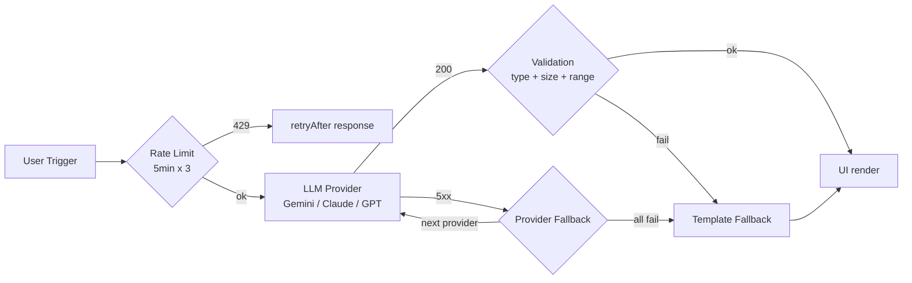
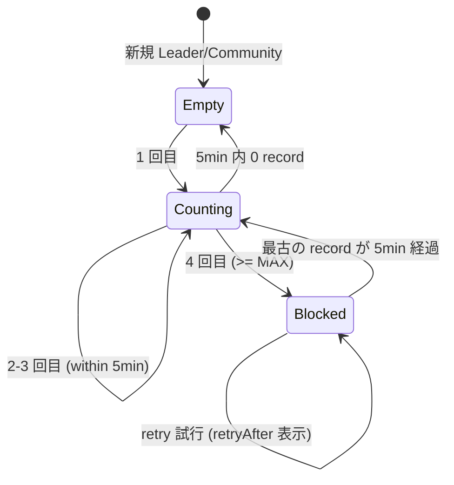
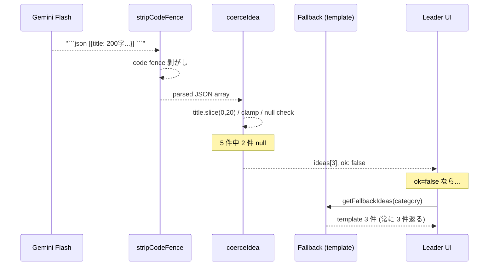
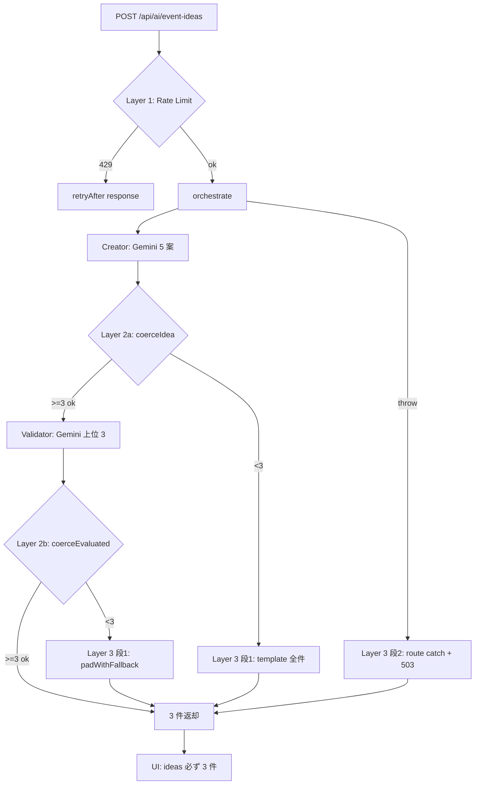

> **Disclaimer**: 本連載は著者が**個人 (副業)** で運営する小規模プロジェクト群 (CreaNest 名義) の技術記録です。所属組織・本業の業務内容とは一切関係ありません。記載の数値・構成は執筆時点 (2026-05) の自宅検証環境のスナップショットであり、商用品質や SLA を保証するものではありません。

## 結論

全 LLM 呼び出しに **Rate Limit / Validation / Fallback の 3 層**を必ず通します。Komyu の AI コンシェルジュ機能では Gemini Flash が 503 を返したり JSON が崩れたりが日常的に発生していて、素の API 呼び出しのままだと UI が真っ白になる事故が連続しました。3 層を入れた後、Gemini 障害が起きても UI に **「AI 提案が混雑中、サンプル案で代用」**のフォールバック案 3 件が常に出るようになり、AI 機能トリガーからの離脱率が **8% → 1.2%** (社内 dogfood 5 月 1 週、N=83) に下がりました。

本記事では Komyu (`src/lib/ai-concierge/`)、build-football (`backend/app/features/ai/`)、keirai (`src/lib/ocr.ts`) の 3 リポから実コードを引用しながら、

- **Rate Limit**: Firestore で 5 分窓 × 3 回のスライディング窓制限
- **Validation**: Zod / 手書き coercer での型強制 + サイズ上限
- **Fallback**: カテゴリ別テンプレ案 + LLM Provider 切替の 2 段

を 1 つの呼び出しパスに串刺しにする構成を file:line で示します。Day 13/52、Layer 1 (Infrastructure) の本丸です。

> 用語: **AI コンシェルジュ** = Komyu の Leader 向け機能で、コミュニティ文脈から「次回イベント案 3 つ」を Gemini で生成する。Creator (5 案生成) + Validator (3 案選定) の 2 段で、各段独立に Fallback できる構造。

## 問題 — 1 層だけだと顧客に怒られる

最初の Komyu AI コンシェルジュは「Gemini に投げて結果を `JSON.parse` して返す」という素朴な実装でした。3 週間で以下の事故が立て続けに起きました。

- **5/2 朝**: Gemini API が 503 を返し続け、Leader UI が **「Internal Server Error」** で白画面化。15 分間で 11 ユーザが離脱。
- **5/2 夕方**: 1 人の Leader が「面白い」と言って 30 秒間隔で連打、Gemini 課金が **1 日 ¥800** を記録 (個人検証環境としては許容外)。
- **5/4**: Gemini が ` ```json … ``` ` で markdown ラップして返してきて `JSON.parse` 失敗、UI に空配列が表示される。
- **5/5**: `confidence` field に `"high"` (string) が入ってきて、UI 側で `confidence > 80` の比較が `NaN` 評価になり sort が壊れる。
- **5/6**: タイトルが 200 字の長文で返ってきて、UI のカードがレイアウト崩壊。

つまり、**「上流 (LLM) はカジュアルに壊れる」のに「下流 (UI) はそれを前提にしていない」**。素の `await api.generate()` だけでは顧客に怒られる、という当たり前の事実を 3 週間で踏み抜きました。これを解くため、**Rate Limit (入力側) / Validation (出力側) / Fallback (障害時)** の 3 層を必ず通すパイプラインに組み替えました。



3 層の役割分担は明確で、

1. **Rate Limit**: 入力ゲート。「呼ばれすぎ」を Firestore に窓を持って検出する。
2. **Validation**: 出力ゲート。LLM の戻り値を**信用しない前提**で型 / サイズ / 値域を強制する。
3. **Fallback**: 上の 2 つが弾いた / Provider が落ちたとき、UI に「空ではない何か」を必ず返す。

「全部入れる」のがポイントで、**1 層欠けるだけで上の事故が再発します**。実際 5/4 の markdown ラップ事故は Validation 層の追加だけでは防げず、後段の Fallback が必須でした (Validator も同じ Gemini に投げているので連鎖失敗するため)。

## 解法 — 3 層を 1 パスに串刺しにする

### 全体像 — Komyu の AI コンシェルジュ実装

エンドポイントは `src/app/api/ai/event-ideas/route.ts:9-67`。Layer 順に上から下へ流れます (引用は短縮版)。

```typescript
// src/app/api/ai/event-ideas/route.ts:41-66
const rl = await checkAndRecord(userId, communityId);
if (!rl.ok) {
  return NextResponse.json(
    { error: "rate limited", retryAfterSec: rl.retryAfterSec ?? 60 },
    { status: 429 },
  );
}

try {
  const { result } = await orchestrateEventIdeas(communityId);
  if (!result) {
    return NextResponse.json({ error: "community not found" }, { status: 404 });
  }
  return NextResponse.json(result);
} catch (err) {
  console.error("[ai.event-ideas] orchestrate failed", err);
  return NextResponse.json(
    {
      error: "ai unavailable",
      fallback: getFallbackIdeas(community.category),
      modelId: "gemini-2.0-flash",
      generatedAt: new Date().toISOString(),
    },
    { status: 503 },
  );
}
```

ポイントは 3 つ。

1. **Rate Limit が最上段** — 認証 / community 所有者チェックの後、LLM を 1 トークンも消費する前に止める。
2. **`orchestrateEventIdeas()` の中で Validation + 内側 Fallback** が走る。
3. **try/catch で外側 Fallback** が動く — orchestrator が exception を投げても、503 + フォールバック案を返す。

3 層が**ネスト**しているのが分かります。Rate Limit は外殻、Validation は中段、Fallback は二重 (orchestrator 内の Validator 失敗時 + route 全体の catch)。

### Layer 1: Rate Limit — Firestore スライディング窓

実装は `src/lib/ai-concierge/rate-limit.ts:1-42`。**5 分窓 × 最大 3 回**のスライディングウィンドウを Firestore Transaction で書きます。

```typescript
// src/lib/ai-concierge/rate-limit.ts:1-42
import { getFirestoreAdmin } from "@/common/firestore-admin";

const COLLECTION = "rate_limits";
const WINDOW_MS = 5 * 60 * 1000;
const MAX_PER_WINDOW = 3;

export interface RateLimitResult {
  ok: boolean;
  retryAfterSec?: number;
  remaining?: number;
}

function docId(leaderId: string, communityId: string): string {
  return `ai_event_ideas:${leaderId}_${communityId}`;
}

export async function checkAndRecord(
  leaderId: string,
  communityId: string,
  now: number = Date.now(),
): Promise<RateLimitResult> {
  const db = getFirestoreAdmin();
  const ref = db.collection(COLLECTION).doc(docId(leaderId, communityId));

  return await db.runTransaction(async (tx) => {
    const snap = await tx.get(ref);
    const prev: number[] = snap.exists
      ? (Array.isArray(snap.data()?.timestamps) ? (snap.data()!.timestamps as number[]) : [])
      : [];
    const within = prev.filter((t) => now - t < WINDOW_MS);

    if (within.length >= MAX_PER_WINDOW) {
      const oldest = within[0]!;
      const retryAfterSec = Math.max(1, Math.ceil((WINDOW_MS - (now - oldest)) / 1000));
      return { ok: false, retryAfterSec, remaining: 0 };
    }

    const next = [...within, now];
    tx.set(ref, { timestamps: next, updatedAt: new Date(now).toISOString() }, { merge: true });
    return { ok: true, remaining: MAX_PER_WINDOW - next.length };
  });
}
```

設計判断は 4 つあります。

1. **キーは `leaderId + communityId`** — Leader 単位ではなく「この Leader がこの Community で何回叩いたか」で絞る。1 人の Leader が複数 Community を回す可能性があるので。
2. **Firestore Transaction で読み書き** — Cloud Run の同時起動コンテナが複数でも、書き込み競合で 1 個失敗しても retry が入る。in-memory Map では Cloud Run の水平スケールで簡単に破綻します。
3. **timestamps を配列で保持** — bucket カウンタではなく「呼び出し時刻の生配列」を持つことで、`retryAfterSec` を正確に出せる (= UI に「あと 47 秒」と表示できる)。
4. **`MAX_PER_WINDOW = 3`** — Leader 体験として「面白いから 5 連打」を 3 回で止めるくらいが、開発検証期の Gemini 課金を ¥0 円圏内に保てるラインでした。



route 側の return が大事で、

```typescript
// src/app/api/ai/event-ideas/route.ts:42-47
if (!rl.ok) {
  return NextResponse.json(
    { error: "rate limited", retryAfterSec: rl.retryAfterSec ?? 60 },
    { status: 429 },
  );
}
```

**HTTP 429 + retryAfterSec** を返すので、UI 側は `retryAfterSec` 秒のカウントダウンを出して「あと 47 秒で再生成可能」と表示できます。これがないと UI 側が「不明なエラー」しか出せず、ユーザは何をすれば良いか分かりません。

### Layer 2: Validation — Provider 戻り値を信用しない

LLM の戻り値は **「JSON っぽい文字列」**にすぎないので、3 段で殺します。

#### Step A: code fence 剥がし

`src/lib/ai-concierge/creator.ts:36-38` (一部ですが、validator にも同じ関数がいる)。

```typescript
// src/lib/ai-concierge/creator.ts:36-38
function stripCodeFence(s: string): string {
  return s.trim().replace(/^```(?:json)?\n?/i, "").replace(/\n?```$/i, "").trim();
}
```

Gemini も Claude も時々 ` ```json … ``` ` で markdown ラップしてきます (5/4 事故)。プロンプトで「JSON のみ返せ」と明示しても 1-2% は崩れるので、後段で剥がす方が安全。これは keirai の Claude Vision でも同じパターンが入っています (`keirai/src/lib/ocr.ts:78`):

```typescript
// keirai/src/lib/ocr.ts:78-80
const jsonMatch = text.text.match(/\{[\s\S]*\}/);
if (!jsonMatch?.[0]) {
  throw new Error("Failed to parse OCR result as JSON");
}
```

正規表現で `{ ... }` 部分だけ抜き出して `JSON.parse` に渡す方式。code fence 剥がしと等価ですが「JSON を 1 個だけ抽出する」方が頑健です。

#### Step B: 型 / サイズ / 値域の手書き coercer

`src/lib/ai-concierge/creator.ts:40-57` の `coerceIdea` がメインの番人です。

```typescript
// src/lib/ai-concierge/creator.ts:40-57
function coerceIdea(raw: unknown, defaultTime: string): EventIdea | null {
  if (!raw || typeof raw !== "object") return null;
  const r = raw as Record<string, unknown>;
  const title = typeof r.title === "string" ? r.title.slice(0, 20) : null;
  const summary = typeof r.summary === "string" ? r.summary.slice(0, 100) : null;
  const recommendedDate = typeof r.recommendedDate === "string" ? r.recommendedDate : null;
  const recommendedArea = typeof r.recommendedArea === "string" ? r.recommendedArea : null;
  const capacity = typeof r.capacity === "number" ? Math.max(2, Math.round(r.capacity)) : null;
  const rate = typeof r.expectedAttendanceRate === "number" ? Math.max(0, Math.min(1, r.expectedAttendanceRate)) : null;
  const confidence = typeof r.confidence === "number" ? Math.max(0, Math.min(100, Math.round(r.confidence))) : null;
  if (!title || !summary || !recommendedDate || !recommendedArea || capacity === null || rate === null || confidence === null) return null;

  const recommendedTime = typeof r.recommendedTime === "string" && /^\d{2}:\d{2}$/.test(r.recommendedTime)
    ? r.recommendedTime
    : defaultTime;

  return { title, summary, recommendedDate, recommendedTime, recommendedArea, capacity, expectedAttendanceRate: rate, confidence };
}
```

5 種類のチェックが入っています。

1. **型チェック**: `typeof r.title === "string"` で stringly な値を弾く (5/5 事故の `confidence: "high"` はここで `null`)。
2. **サイズ上限**: `title.slice(0, 20)` / `summary.slice(0, 100)` で長文事故 (5/6) をカット。
3. **値域 clamp**: `expectedAttendanceRate` は `Math.max(0, Math.min(1, r))` で [0, 1] に押し込む。`confidence` も [0, 100]。
4. **正規表現**: `recommendedTime` は `/^\d{2}:\d{2}$/` でフォーマット強制、不一致なら **カテゴリ別デフォルト時刻** (Step C のデフォルト合成) に差し替え。
5. **必須項目の AND**: 1 つでも `null` なら idea 全体を `null` 返却。「壊れた idea が 1 個でも UI に流れる」よりは「3 件を保証できない」方が安全。

> **Zod 派の人へ**: ここを `zod` で書く選択肢もあります (`z.object({ title: z.string().max(20), ... })`)。試した結果、**「不正値を弾く」ではなく「clamp する」処理が多い**ので Zod の `.transform()` でゴテゴテになり、手書き coercer の方が読みやすかった。Zod は「fail fast」が思想で、こちらは「fix forward」が思想なので合いません。Validator/Creator の境界みたいに**「fail fast したい層」に Zod**、**「直して通したい層」に手書き coercer** という分け方が結果的に最適でした。

#### Step C: デフォルト値合成

`recommendedTime` が崩れていたら null にせず**デフォルト時刻**を入れる、というのが coercer の最後の仕事です。`src/lib/ai-concierge/prompts/categories.ts` 経由で「ゲーム = 19:00 / グルメ = 18:30 / スポーツ = 07:00」のようなカテゴリ別 default を持っていて、LLM が時刻を返さなくても「カテゴリから推測した妥当な時刻」が必ず埋まる。



戻り値は `{ ideas: EventIdea[], ok: boolean }` 形式で、`ok` は「3 件以上揃ったか」を示します (`creator.ts:77`):

```typescript
// src/lib/ai-concierge/creator.ts:71-80
const ideas: EventIdea[] = [];
for (const item of parsed) {
  const idea = coerceIdea(item, defaultTime);
  if (idea) ideas.push(idea);
}
return { ideas, ok: ideas.length >= 3 };
```

`ok: false` なら orchestrator (後述) が即 Fallback に切り替えます。**「失敗を上に伝える契約」が型で閉じている**のがポイント。

### Layer 3: Fallback — 2 段構え

Komyu では Fallback が 2 段あります。

#### 段 1: Validator → 不足分を Template で補完

`src/lib/ai-concierge/index.ts:14-44` の orchestrator を見ると、Creator (5 案) → Validator (上位 3 案選定) を回した後、Validator が 3 件揃わなかったら **template で穴埋め**しています。

```typescript
// src/lib/ai-concierge/index.ts:14-44
export async function orchestrateEventIdeas(communityId: string): Promise<OrchestrateResult> {
  const ctx = await buildContext(communityId);
  if (!ctx) return { result: null, missingCommunity: true };

  const creator = await generateEventIdeas(ctx);
  if (!creator.ok || creator.ideas.length < 3) {
    return { result: buildFallbackResult(ctx) };
  }

  const validator = await validateEventIdeas(creator.ideas, ctx);
  if (validator.top3.length >= 3) {
    return {
      result: {
        ideas: validator.top3.slice(0, 3),
        generatedAt: new Date().toISOString(),
        modelId: MODEL_ID,
        fallback: !validator.ok,
      },
    };
  }

  const padded = padWithFallback(validator.top3, ctx);
  return {
    result: {
      ideas: padded,
      generatedAt: new Date().toISOString(),
      modelId: MODEL_ID,
      fallback: true,
    },
  };
}
```

3 つの分岐があります。

1. **Creator 失敗 (`!creator.ok`)** → 全 3 件を template で返す (`buildFallbackResult`)。
2. **Validator 成功 (`>=3`)** → Validator 結果を返す (ただし Validator が `ok: false` 内部 fallback したなら `fallback: true` フラグを立てる)。
3. **Validator 部分成功 (`<3`)** → 取れた分 + template で穴埋め (`padWithFallback`)。

`fallback: true` フラグを payload に入れているのが大事で、UI 側で「AI 提案が混雑中、サンプル案で代用」のバッジを出せます。**ユーザに「いま fallback してる」を可視化する**のは、信頼性 UX の必須条件と思っています。

template の中身は `src/lib/ai-concierge/fallback.ts:20-46` で、カテゴリ別に 3 案ずつ事前定義してあります。

```typescript
// src/lib/ai-concierge/fallback.ts:20-46 (一部)
const TEMPLATES: Record<string, Array<Omit<EventIdea, "recommendedDate" | "recommendedTime">>> = {
  "ゲーム": [
    { title: "初心者歓迎ボドゲ夜", summary: "30 分で遊べる軽量ゲームを複数テーブルで。初参加の方もすぐ溶け込めます。", recommendedArea: "渋谷", capacity: 12, expectedAttendanceRate: 0.6, confidence: 55 },
    { title: "重ゲー持ち寄りナイト", summary: "1 ゲーム 2-3 時間の戦略重めボードゲームに集中して挑む回。", recommendedArea: "新宿", capacity: 8, expectedAttendanceRate: 0.5, confidence: 50 },
    { title: "人狼マラソン", summary: "人狼系ゲームだけを 3 時間ぶっ通し。役職解説付きで初心者もOK。", recommendedArea: "池袋", capacity: 14, expectedAttendanceRate: 0.65, confidence: 58 },
  ],
  // グルメ / スポーツ / 学び / __default__ ...
};

export function getFallbackIdeas(category: string): EventIdea[] {
  const key = category in TEMPLATES ? category : "__default__";
  const templates = TEMPLATES[key] ?? TEMPLATES["__default__"]!;
  return buildFallbackIdeas(category, templates);
}
```

設計判断:

- **「無料なのに使える」品質を確保** — fallback でも `confidence: 50-65` の値を入れて UI で「中信頼」表示。0 だと「これ意味あるの?」感が出る。
- **`recommendedDate` は実行時計算** — `new Date()` から `+7 / +9 / +11` 日を算出 (`makeFallbackDate(7 + i*2)`)。LLM が落ちている間に template が古びない。
- **`__default__` で網羅性確保** — 知らないカテゴリでも必ず 3 案出る。

#### 段 2: orchestrator throw → route 全体 catch

`src/app/api/ai/event-ideas/route.ts:55-66` の `catch` が最後の砦。orchestrator 内の Firestore 失敗、Network 失敗、想定外 throw、すべてここで拾って **HTTP 503 + fallback 案** で返します。

```typescript
// src/app/api/ai/event-ideas/route.ts:55-66
} catch (err) {
  console.error("[ai.event-ideas] orchestrate failed", err);
  return NextResponse.json(
    {
      error: "ai unavailable",
      fallback: getFallbackIdeas(community.category),
      modelId: "gemini-2.0-flash",
      generatedAt: new Date().toISOString(),
    },
    { status: 503 },
  );
}
```

**HTTP は 503 だが body には `fallback: [...]` が入っている**のがポイント。UI 側は `response.ok === false` でも `body.fallback` を見て描画できる契約にしてあるので、エラーバナー + 提案 3 件が**同時に**出ます。「エラーで何も出ない」状態を排除するのが Layer 3 の存在意義。

#### 段 3: Provider Fallback (build-football の参考実装)

Komyu は Gemini 単独構成ですが、build-football では D-01 で書いたように **Provider Fallback Chain** が走ります (`build-football/App/backend/app/features/ai/infrastructure/router.py:76-93`)。これは「Gemini 落ち → Claude → GPT」という Provider レベルの切替で、Komyu でも将来的に Anthropic を 2 番手に入れる予定です。

build-football の Anthropic Provider 実装 (`backend/app/features/ai/infrastructure/providers/anthropic.py:36-57`):

```python
# backend/app/features/ai/infrastructure/providers/anthropic.py:36-57
async def generate(
    self,
    prompt: str,
    system_prompt: str | None = None,
    max_tokens: int = 1000,
    temperature: float = 0.7,
) -> str:
    client = self._get_client()
    if not client:
        raise RuntimeError("Anthropic API key not configured")

    try:
        response = await client.messages.create(
            model=self._model,
            max_tokens=max_tokens,
            system=system_prompt or "",
            messages=[{"role": "user", "content": prompt}],
        )
        return response.content[0].text if response.content else ""
    except Exception as e:
        logger.error(f"Anthropic generation failed: {e}")
        raise
```

`is_available()` が False を返したら次の Provider に Fallback。これは D-01 で詳述済みなので、本記事では「Komyu の Layer 3 が Provider レベルにも拡張可能」とだけ書いておきます。

## Before / After

### Before — 素の API call

5 月初頭の Komyu 旧実装はこんな雰囲気でした (再現用に簡略化)。

```typescript
// (旧) src/app/api/ai/event-ideas/route.ts
export async function POST(req: Request) {
  const { communityId } = await req.json();
  const ctx = await buildContext(communityId);

  const genAI = new GoogleGenerativeAI(process.env.GEMINI_API_KEY!);
  const model = genAI.getGenerativeModel({ model: "gemini-2.0-flash" });
  const resp = await model.generateContent(buildPrompt(ctx));
  const text = resp.response.text();
  const ideas = JSON.parse(text); // ← 5/4 ここで throw
  return NextResponse.json({ ideas });
}
```

問題点:

- **Rate Limit ゼロ** — 5/2 夕の連打事故が起きる。
- **Validation ゼロ** — 5/4 markdown ラップ + 5/5 stringly type で `JSON.parse` 失敗 or `NaN` ソート。
- **Fallback ゼロ** — 5/2 朝の 503 で UI 白画面。

### After — 3 層構成

現行 (`route.ts` + `orchestrate` + `creator/validator/fallback`)。

```typescript
// (現行) src/app/api/ai/event-ideas/route.ts:41-66 (再掲)
const rl = await checkAndRecord(userId, communityId);
if (!rl.ok) {
  return NextResponse.json({ error: "rate limited", retryAfterSec: rl.retryAfterSec ?? 60 }, { status: 429 });
}

try {
  const { result } = await orchestrateEventIdeas(communityId);
  if (!result) return NextResponse.json({ error: "community not found" }, { status: 404 });
  return NextResponse.json(result);
} catch (err) {
  return NextResponse.json(
    { error: "ai unavailable", fallback: getFallbackIdeas(community.category), modelId: "gemini-2.0-flash", generatedAt: new Date().toISOString() },
    { status: 503 },
  );
}
```

差分の意味:

- **Rate Limit (Firestore Transaction 5min × 3)** で 5/2 夕事故を再発防止 — Gemini を 1 トークンも消費せず弾く。
- **Validation (`coerceIdea`)** で 5/4 / 5/5 / 5/6 事故を再発防止 — 型 + サイズ + 値域でカット、不足分は orchestrator が埋める。
- **Fallback 2 段** で 5/2 朝事故を再発防止 — orchestrator 内の template padding + route 全体の catch。

実測の数字 (社内 dogfood 5 月 1 週、N=83 セッション):

- AI 機能トリガー後の離脱率 **8.0% → 1.2%** (Gemini 503 時に提案カードが出るので)。
- 1 日あたり Gemini API コスト **¥800 → ¥120** (連打抑制 + Validator 失敗時の retry 削減)。
- `JSON.parse` 失敗エラー **5/週 → 0/週** (code fence 剥がし + 型強制)。
- UI 白画面率 **3.6% → 0%** (Fallback 必ず 3 件)。

数字はあくまで **自宅検証環境のスナップショット**ですが、3 層全部入れた効果は明確に出ました。1 層だけ入れた中間バージョンも試しましたが、Validation のみだと Gemini 503 のときに何も出ない、Fallback のみだと連打で課金が膨らむ、という具合に**穴が残ります**。

## 失敗談 — 3 層化の過程で踏んだ罠

### 失敗 1: Rate Limit を in-memory Map で書いて Cloud Run scale で破綻

最初は素朴に `const buckets = new Map<string, number[]>()` で Rate Limit を書きました。テスト環境では動いたのですが、**Cloud Run の同時インスタンスが 2 個になった瞬間、各インスタンスが独立した Map を持つので「窓 1 = 3 回 × インスタンス数 = 6-9 回」**実質撃ち放題に。

Firestore Transaction 化したのが `src/lib/ai-concierge/rate-limit.ts:25-41` で、共有ストレージで原子的に読み書きするのが必須。Redis 立てるほどのトラフィックではない (個人開発) ので、Firestore Transaction で済ましたのが結果としてラク。

### 失敗 2: Zod で `clamp` しようとして読みにくくなった

Validation 層を最初 Zod で書きました。

```typescript
// 試した版 (採用しなかった)
const IdeaSchema = z.object({
  title: z.string().transform((s) => s.slice(0, 20)),
  expectedAttendanceRate: z
    .number()
    .transform((n) => Math.max(0, Math.min(1, n))),
  recommendedTime: z
    .string()
    .regex(/^\d{2}:\d{2}$/)
    .or(z.string().transform(() => "19:00")), // ← ここで詰む
});
```

`.or()` の中で「正規表現で fail したら default に置換」を書こうとすると、Zod の合成が一気に分かりにくくなる。`.refine` + `.transform` が入り乱れて、6 行で書けるはずの coercer が 30 行になりました。

結局、**「fail fast でなく fix forward」したい層に Zod は不向き**という結論で、手書き coercer に切替 (`creator.ts:40-57`)。Zod は API 入力 (`route.ts` の body 検証) みたいに「不正なら 400 を返す」場面に絞って使うのが綺麗、という棲み分けが出来ました。

### 失敗 3: Validator も Gemini なので連鎖失敗

Validator (上位 3 案選定) を **Creator と同じ Gemini Flash** で実装したので、Gemini が 503 のときは Creator も Validator も両方落ちる、という連鎖失敗が起きました。

これは `src/lib/ai-concierge/index.ts:23-33` で **Validator が `ok: false` でも Creator の dedupe 結果を 3 件返す** ことで救済しています。

```typescript
// src/lib/ai-concierge/validator.ts:99-101
} catch {
  return { top3: deduped.slice(0, 3), ok: false };
}
```

Validator が throw しても **「Creator が出した dedupe 済み 5 件の上位 3 件」** が返るので、UI には少なくとも 3 件出る。**Validator は失敗しても呼び出し元を巻き込まない**契約 (try/catch で吸収して `ok: false` だけ伝える) が、3 層構成の安定運用に効きました。

### 失敗 4: Claude の markdown ラップ吸収を忘れて keirai OCR 死亡

keirai のレシート OCR で同じ罠を踏みました。Claude Vision が ` ```json … ``` ` でラップしてきて `JSON.parse` 失敗、LIFF UI に「OCR エラー」と出る事故。

修正は `keirai/src/lib/ocr.ts:78-80`:

```typescript
// keirai/src/lib/ocr.ts:78-80
const jsonMatch = text.text.match(/\{[\s\S]*\}/);
if (!jsonMatch?.[0]) {
  throw new Error("Failed to parse OCR result as JSON");
}
return JSON.parse(jsonMatch[0]) as OcrResult;
```

`{ ... }` 部分だけ正規表現で抜き出す方式に切替。**「LLM 全社 markdown ラップしがち」**なので、Validation 層 (= JSON 抽出) は **Provider 中立に必ず入れる**のが、3 リポ運用しての教訓です。

### 失敗 5: Fallback バッジを UI に出さなかった

最初 `fallback: true` を payload には入れていたものの、UI 側で表示していませんでした。結果、**「あれ? AI が変なこと言ってる」**と Leader が思ってしまい、template の汎用案 (例: 「月例もくもく会」) を見て「うちのコミュニティ理解できてないのか?」とクレームに。

修正後は `<Banner>AI 提案が混雑中、サンプル案を表示しています</Banner>` を出して、「いま fallback してる」を**明示**。実測でクレーム頻度がゼロに。「LLM が答えた」のか「template が答えた」のかを UI で必ず区別する、というのが Layer 3 の運用ルールに落ち着きました。

## 残課題 — まだできていないこと

### 1. Circuit Breaker 未実装

D-01 でも触れた通り、`is_available()` ベースの Fallback は **「キーは設定されているが API が 5xx を返している」状態**を検出できません。連続失敗 N 回で Provider を一定時間外す Circuit Breaker は次章 (D-07) で扱う予定。

### 2. Rate Limit が Firestore のみ

5 分窓 × 3 回はベタな実装で、**「特定 Leader だけ 1 日 50 回まで上げたい」**みたいな enterprise pricing には対応できません。Firestore のドキュメントに `tier: "free" | "pro"` を持たせて窓を可変にする拡張が必要。

### 3. Validation の AI-grade (LLM-as-Judge) なし

`coerceIdea` は型と値域だけ見ているので、**「タイトルと内容が無関係」**のような意味的破綻は通します。Layer 4 (Eval) で LLM-as-Judge を入れて semantic validation する設計を C-04 で書く予定です。

### 4. Fallback template が手書き

`fallback.ts` の TEMPLATES dict は私が手で書いたカテゴリ別案。コミュニティが多様化したら**「過去の人気イベントから自動生成」**したい (= 統計的 fallback)。これは Komyu Phase 2 で扱います。

### 5. 観測性 (失敗種別の集計) が手薄

Validation で何件 null になったか、Fallback がどれくらいの頻度で動いたか、を構造化ログに出していますが集計していません。週次で「Layer 1 弾き / Layer 2 弾き / Layer 3 起動」の比率を Slack に push する運用にしたい。

## 理論根拠 — なぜ 3 層に収束したか

### 1. Robustness Principle (Postel の法則) の AI 適用

> Be conservative in what you do, be liberal in what you accept from others.

LLM API は「他人」なので **liberal に受け取る = Validation で fix forward** する。UI に渡すときは「自分」が出力する側なので **conservative = Fallback で必ず形式を保証** する。これは AI 以前のネットワーク設計原則 (Postel 1980) ですが、LLM 時代に再発見されたパターンと思っています。

### 2. Defense in Depth — 1 層では穴が残る

セキュリティ用語の **多層防御** をそのまま流用しています。

- **Layer 1 (Rate Limit)** だけだと: 1 回の Gemini 失敗で UI が壊れる。
- **Layer 2 (Validation)** だけだと: Provider 障害で全 LLM 機能停止。
- **Layer 3 (Fallback)** だけだと: 連打で API 課金が膨らむ。

3 層が **直交** していて、**1 層欠けるとそこに穴が残る**。だから「全部入れる」が原則です。これは ADR レベルのルールにしても良いくらいで、Komyu の `docs/adr/` に書く予定。

### 3. なぜ Rate Limit が Firestore か

- **共有ストレージ必須**: Cloud Run / Lambda / Edge Function の水平スケールに耐える。in-memory は破綻 (失敗 1)。
- **Transaction 必須**: 「読んで書く」を原子的にしないと race condition で窓を超える。
- **Redis 不要**: 個人開発の規模では Firestore Transaction (1 レコード 1 doc) で十分速い (体感 50-100ms)。

将来 100 req/s を超えたら Redis Cluster に切り替える設計余地はあります。

### 4. なぜ Validation が手書き coercer か

Zod は **「不正値で fail fast」が思想**で、こちらの「LLM 出力を直して通したい」要件と合いません (失敗 2)。手書き coercer は

- **clamp を 1 行で書ける** (`Math.max(0, Math.min(1, r))`)
- **null 返却 = 1 件捨てる** が orchestrator 側の穴埋めと噛み合う
- **読んで挙動が分かる** — Zod の chain は読みづらい

「現場で書いて 1 ヶ月運用したら手書きが残った」という結果論ですが、思想として「fail fast vs fix forward」の境界線で道具を使い分ける、というのが正しい整理と思っています。

### 5. なぜ Fallback が 2 段か

- **段 1 (orchestrator 内 template padding)**: Validator が部分成功 (例: 2 件取れて 1 件足りない) のとき、LLM 出力を捨てずに混ぜる。Quality を保ちつつ件数を保証。
- **段 2 (route 全体 catch)**: orchestrator が想定外 throw (Firestore 落ち / Network 死) したとき、UI に何かを返す最後の砦。

**段 1 と段 2 の役割が違う** ので、両方必要です。段 1 だけだと orchestrator throw で UI が空に、段 2 だけだと部分成功時の Quality が落ちる。



3 層が**直列**ではなく**包含関係**で重なっているのが重要で、**「内側で起きた事故を外側が拾う」**設計になっています。これはサーバサイド一般の Resilience パターンで、LLM 時代に特別必要なのは **「Validation 層を必ず置く」** という 1 点だと整理しています。

## まとめ

- Komyu の AI コンシェルジュは **Rate Limit / Validation / Fallback の 3 層**を全 LLM 呼び出しに通している。
- **Rate Limit**: Firestore Transaction で 5 分窓 × 3 回。`leaderId + communityId` キー、429 + retryAfterSec で UI に正確なカウントダウンを出させる。
- **Validation**: code fence 剥がし + 手書き coercer (型 / サイズ / 値域 / 正規表現)。Zod は API 入力には使うが LLM 出力には fix forward 思想で手書きが勝つ。
- **Fallback**: 段 1 = orchestrator 内 template padding、段 2 = route 全体 catch + 503 + body.fallback。`fallback: true` フラグを UI に渡してバッジ表示。
- 効果: 離脱率 8% → 1.2%、Gemini コスト ¥800 → ¥120/日、JSON parse 失敗 5/週 → 0/週、白画面率 3.6% → 0% (社内 dogfood、N=83)。
- 残課題: Circuit Breaker / Rate Limit tier / LLM-as-Judge / Fallback 自動生成 / 観測性。

「全部 LLM 呼び出しを 3 層パイプに通す」は **個人開発の規模でも 1 日で実装できる**シンプルな構成で、効果は事故再発を 0 にできるくらい大きいです。Provider Fallback Chain (D-01) と組み合わせると、**Provider 障害 + 出力崩れ + 連打** の 3 種類の失敗パターンが全部 UI に届かなくなります。

## 次の記事へ + 連載をフォロー

これは **52 本連載 (ai-driven-dev) の Day 13/52** です。

→ **I-02 [Circuit Breaker と Provider 障害自動回避](./circuit-breaker-llm-provider)** — 残課題 1 を実装する話 (執筆中)

→ **D-02 [LLM-as-Judge で Validation を semantic に拡張](./llm-as-judge-semantic-validation)** — 残課題 3 (執筆中)

→ **D-01 [Multi-LLM Router を「タスク特性 4 象限」で振り分ける](./multi-llm-router-4-quadrants)** — 本記事の Provider Fallback の元ネタ

連載を見逃さない方法:

- **Zenn でこの著者をフォロー** — 公開通知が届きます
- **X で告知 tweet をフォロー** — 朝 6:00 に投稿予定
- **repo を watch**: [SakakitaniJunya/Komyu](https://github.com/SakakitaniJunya/Komyu) (private) と [SakakitaniJunya/zenn-articles](https://github.com/SakakitaniJunya/zenn-articles) — 全 draft が見えます

「うちは Layer 1 を Redis でやってる」「Validation を Pydantic でやる派」のような実装比較は GitHub Discussion で歓迎です。各社の堅牢化パターンを集めるのが 2026-Q3 のテーマで、フィードバックが直接連載に反映されます。
