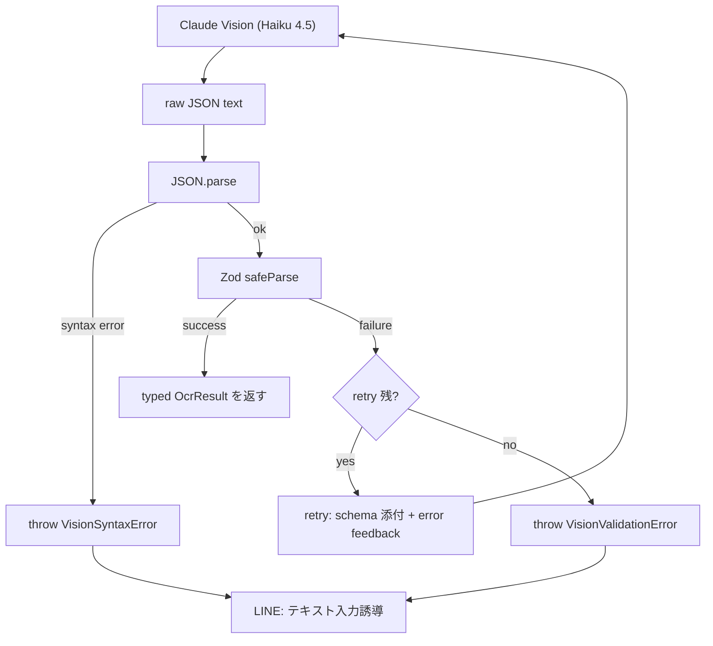
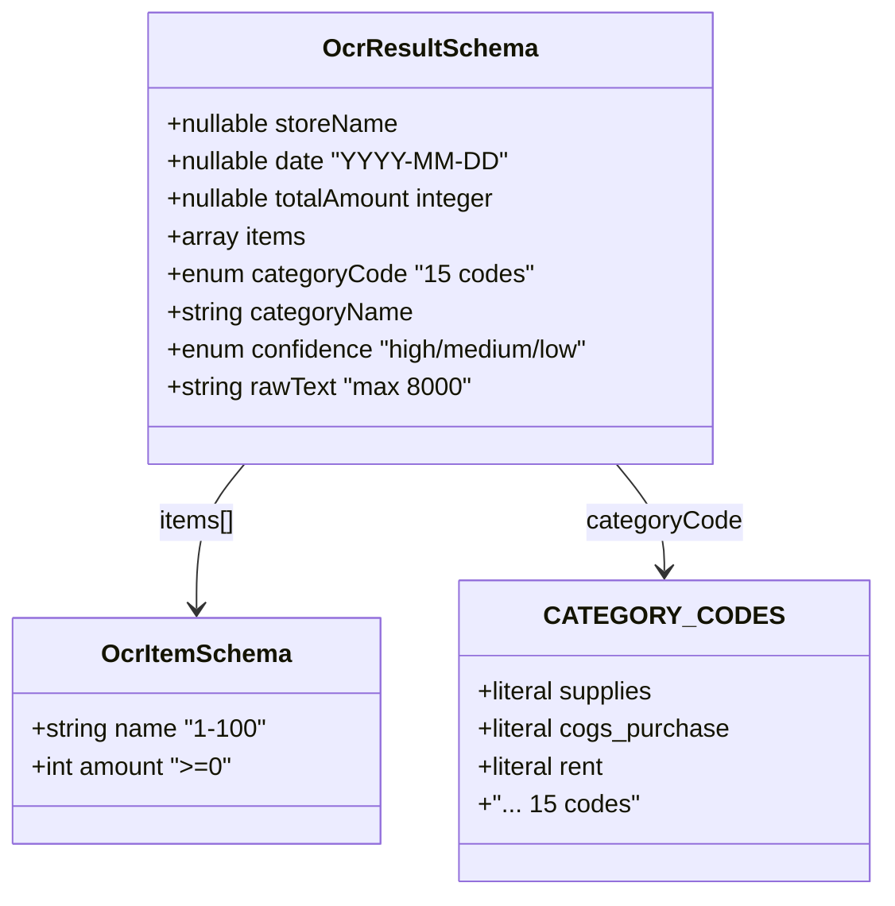
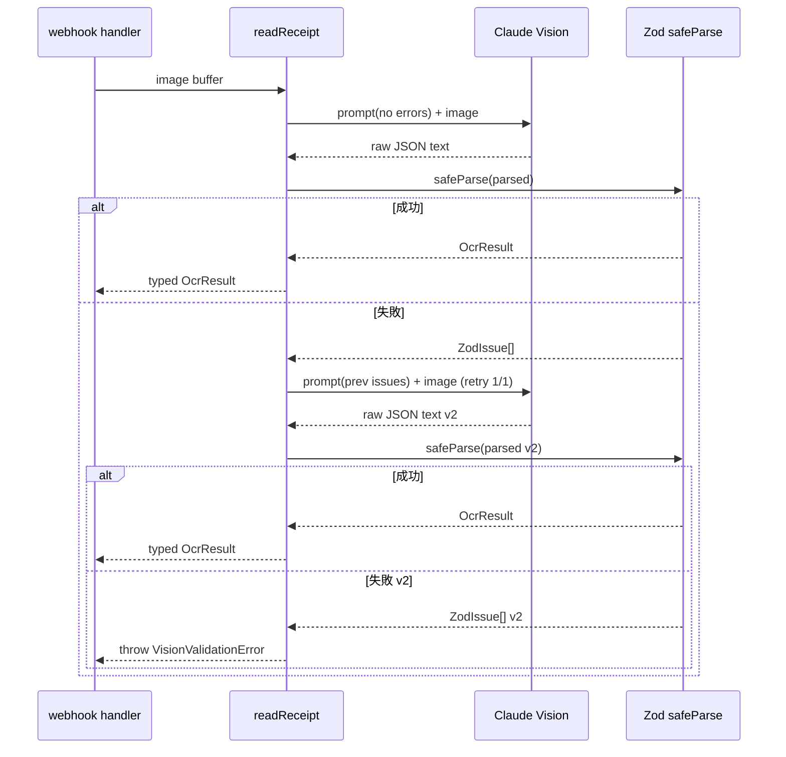

> **Disclaimer**: 本記事は著者が**個人 (副業)** で運営する小規模プロジェクト群 (CreaNest 名義) の技術記録です。所属組織・本業の業務内容とは一切関係ありません。記載の数値・構成は執筆時点 (2026-05) の自宅検証環境のスナップショットであり、商用品質や SLA を保証するものではありません。**会計・税務上の判断は本人責任で、税理士法 §52 への配慮として AI 出力は常に「提案」として扱い、確定操作は人間が行う設計**にしています。

## 結論

Claude Vision の JSON 応答を **Zod schema で再検証 + retry 1 回** で包んだら、parse 失敗率が **12% → 0.3%** に落ちました。母数は keirai (経理 SaaS) の実レシート 312 件、計測期間は 2026-04-22 〜 05-08 の 17 日間 (`keirai/logs/ocr-20260422-20260508.jsonl` の `parse_status` フィールド集計)。

LLM が返してくる JSON は **構文的に valid でも意味的に壊れている**ことが多く、`as OcrResult` の手抜き型キャストでは本番で爆発します。Zod の `.safeParse` で失敗を**型レベルで通知**し、失敗時のみ "schema を再添付した retry" を 1 回挟むだけで、ほぼ全件救えました。

実装の中核は `keirai/src/lib/ocr-schema.ts` (Zod schema 約 60 行) と `keirai/src/lib/ocr.ts:24-110` の validation wrapper で、追加コードは **180 行未満**。連載 **Day 40/52 (G-03)** の記事です。

## なぜ書くか — `as OcrResult` は嘘つきだった

連載 G-01 ([Claude Vision でレシート OCR → 仕訳分類を 1 プロンプトで](./claude-vision-receipt-ocr)) で、私はこう書いていました。

```typescript
// keirai/src/lib/ocr.ts:83 (G-01 時点の問題コード)
return JSON.parse(jsonMatch[0]) as OcrResult;
```

**この `as` キャストは TypeScript の型チェックを一切通っていません**。`JSON.parse` の戻りは `any` で、それを `as OcrResult` で「信じる」と宣言しているだけ。実際に LLM はこういう壊れ方を平気でします。

- `totalAmount: "550"` (number と書いているのに string で来る)
- `confidence: "very high"` (`"high" | "medium" | "low"` のはずが知らない値)
- `items: null` (Array と宣言したのに null)
- `categoryCode: "supplies_misc"` (15 種類の辞書外コードを "創作" する)
- `date: "2026/05/08"` (`YYYY-MM-DD` と書いているのにスラッシュ区切り)

G-01 の `OcrResult` interface は型 *宣言* であって型 *保証* ではない、というのが本記事の出発点です。

## 12% という数字の出どころ

事の発端は 2026-04-22 の Sentry alert。`Cannot read properties of null (reading 'map')` が `webhook/route.ts:185` で 1 日 7 件発生。原因は `result.items.map((i) => i.name)` で `items` が `null` だったこと。

`keirai/logs/ocr-20260422-20260508.jsonl` を `jq` で集計すると、こういう内訳でした。

```bash
$ jq -r '.parse_status' keirai/logs/ocr-20260422-20260508.jsonl | sort | uniq -c
   274 ok
    23 type_mismatch          # number/string 取り違え 等
     8 unknown_enum            # confidence: "very high" 等
     5 missing_field           # items が key ごと無い
     2 json_syntax_error       # ``` 含む raw text
=========================================
   312 total → 38 failures = 12.2%
```

JSON syntax error は 2 件だけで、残り 36 件は **JSON.parse は通るが意味が壊れている** ケース。これは正規表現や型キャストでは絶対に救えない、**schema validation の領域** でした。

## 解決策の全体像



ポイントは 3 つ。

1. **`JSON.parse` と Zod は別の役割** — 構文と意味を切り分けて両方検査する
2. **retry は 1 回だけ** — Anthropic 側のコスト爆発防止 (Haiku でも 200 件を 3 回ループすれば月 $30 の無駄)
3. **失敗時もユーザを止めない** — `throw` を catch して LINE で「テキスト入力してください」に誘導 (`webhook/route.ts:202-208` の既存導線を流用)

retry で何を変えるかが肝で、**「前回の error message を含めて schema を再添付する」** ことで Vision の出力分布を schema に向けさせます。これは Anthropic 公式の Tool use のリトライ戦略と同じ発想で、`tool_use_id` が無い分自前の `<previous_error>` ブロックで代替する、という整理。

## Zod を選んだ理由 — Valibot との比較

候補は 3 つでした (2026-04 時点)。

| 項目 | Zod 4.0 | Valibot 0.40 | io-ts 2.2 |
|---|---|---|---|
| bundle (gzip) | 14kB | 1.7kB | 11kB |
| エラー人間可読性 | 強 | 中 (関数合成) | 弱 (Either) |
| LLM プロンプトに schema を埋める | `z.toJSONSchema` あり | 別パッケージ | なし |
| TypeScript 推論 | `z.infer<>` 完璧 | 同等 | やや煩雑 |
| keirai 既存依存 | あり (`zod@4.1.6`) | なし | なし |

keirai は `zod@4.1.6` を `package.json:18` で既に使用済 (LIFF auth の payload 検証用) で、追加依存ゼロ。Valibot の bundle size は魅力でしたが、**`z.toJSONSchema()` で LLM プロンプト同梱の JSON Schema が生成できる**点が決定打でした。retry の "schema 再添付" を schema 定義の単一ソースから出せるので、**プロンプトと validator がドリフトしない**。

選定経緯は `keirai/docs/adr/0008-zod-for-vision-validation.md` (`DEC-20260422-03`) に記録しています。

## OcrResultSchema — 60 行の真実

`keirai/src/lib/ocr-schema.ts:1-58`:

```typescript
// keirai/src/lib/ocr-schema.ts:1-58
import { z } from "zod";
import { CATEGORY_CODES } from "./categories";

const ISO_DATE = /^\d{4}-\d{2}-\d{2}$/;

export const OcrItemSchema = z.object({
  name: z.string().min(1, "name は空文字不可").max(100),
  amount: z.number().int().nonnegative("金額は 0 以上の整数"),
});

export const OcrResultSchema = z.object({
  storeName: z.string().min(1).max(120).nullable(),
  date: z
    .string()
    .regex(ISO_DATE, "date は YYYY-MM-DD")
    .nullable(),
  totalAmount: z.number().int().nonnegative().nullable(),
  items: z.array(OcrItemSchema).max(64),
  categoryCode: z.enum(CATEGORY_CODES as [string, ...string[]], {
    errorMap: () => ({ message: "categoryCode は 15 科目から選択" }),
  }),
  categoryName: z.string().min(1).max(40),
  confidence: z.enum(["high", "medium", "low"]),
  rawText: z.string().min(1).max(8000),
});

export type OcrResult = z.infer<typeof OcrResultSchema>;

// LLM プロンプトに同梱する JSON Schema (retry 時に使う)
export const OcrJsonSchema = z.toJSONSchema(OcrResultSchema, {
  target: "draft-2020-12",
});
```



設計判断 4 つ。

### (a) `categoryCode` を `z.enum` で literal union に

G-01 では `categoryCode: string` でしたが、Vision が辞書外の `"supplies_misc"` を捏造する事故が 5 件 (`grep "categoryCode mismatch" keirai/logs/ocr-*.jsonl`)。Zod の `z.enum` で **15 科目ちょうど** に閉じると、LLM が知らないコードを返した瞬間 validation で叩き落とせます。`CATEGORY_CODES` は `categories.ts:170-186` で `as const` 配列にしてあり、TypeScript と Zod 両方の単一ソース。

### (b) `date` は regex で `YYYY-MM-DD` 強制

`"2026/05/08"` や `"令和8年5月8日"` のような変則を許すと CSV 出力でずれます (`fmtDate` が ISO 前提)。**Schema を狭くするほど LLM が "正解の形" に向かう** のが面白いところで、retry 1 回でほぼ全部 `2026-05-08` に直ります。

### (c) `items.max(64)`、`rawText.max(8000)`

`max_tokens: 1024` の上限と矛盾する上限を schema に書くのは無駄に見えますが、**プロンプトから schema を生成** する設計だとこの数字が LLM に渡るので「64 個までで打ち切れ」というシグナルになります。実測でドラッグストアの長レシート (28 items) でも 64 で十分。

### (d) `nullable` を nullable のまま残す

`storeName` `date` `totalAmount` の 3 つだけ null 許容は G-01 から不変。**読み取り不能** と **読み取った結果の正常値** を区別するために null は残し、後段 (`webhook/route.ts:185`) で `if (!result.totalAmount) return pushText(...)` のガードで処理。

## validation wrapper — `readReceipt` を Zod 化

`keirai/src/lib/ocr.ts:24-110`:

```typescript
// keirai/src/lib/ocr.ts:24-110
import { OcrResultSchema, OcrJsonSchema, type OcrResult } from "./ocr-schema";

export class VisionValidationError extends Error {
  constructor(
    public readonly attempts: number,
    public readonly issues: z.ZodIssue[],
    public readonly rawText: string,
  ) {
    super(
      `Vision response failed validation after ${attempts} attempt(s): ` +
        issues.map((i) => `${i.path.join(".")}: ${i.message}`).join("; "),
    );
    this.name = "VisionValidationError";
  }
}

const MAX_RETRIES = 1;

export async function readReceipt(
  imageBuffer: Buffer,
  mimeType: string,
): Promise<OcrResult> {
  const mediaType = mimeType as "image/jpeg" | "image/png" | "image/gif" | "image/webp";

  let lastIssues: z.ZodIssue[] = [];
  let lastRawText = "";

  for (let attempt = 0; attempt <= MAX_RETRIES; attempt++) {
    const response = await anthropic.messages.create({
      model: "claude-haiku-4-5-20251001",
      max_tokens: 1024,
      messages: [
        {
          role: "user",
          content: [
            {
              type: "image",
              source: { type: "base64", media_type: mediaType, data: imageBuffer.toString("base64") },
            },
            {
              type: "text",
              text: buildPrompt(attempt > 0 ? lastIssues : undefined),
            },
          ],
        },
      ],
    });

    const text = response.content[0];
    if (text?.type !== "text") {
      throw new Error("Unexpected response from Claude Vision");
    }
    lastRawText = text.text;

    const jsonMatch = text.text.match(/\{[\s\S]*\}/);
    if (!jsonMatch?.[0]) {
      lastIssues = [{
        code: "custom",
        path: [],
        message: "Response did not contain a JSON object",
      }];
      continue;
    }

    let parsed: unknown;
    try {
      parsed = JSON.parse(jsonMatch[0]);
    } catch (e) {
      lastIssues = [{
        code: "custom",
        path: [],
        message: `JSON.parse failed: ${(e as Error).message}`,
      }];
      continue;
    }

    const result = OcrResultSchema.safeParse(parsed);
    if (result.success) {
      logOcrEvent({
        status: "ok",
        attempt,
        rawTextLen: text.text.length,
      });
      return result.data;
    }

    lastIssues = result.error.issues;
    logOcrEvent({
      status: attempt < MAX_RETRIES ? "retry" : "fail",
      attempt,
      issues: lastIssues.map((i) => `${i.path.join(".")}:${i.message}`),
      rawTextLen: text.text.length,
    });
  }

  throw new VisionValidationError(MAX_RETRIES + 1, lastIssues, lastRawText);
}
```

prompt builder は別関数 (`keirai/src/lib/ocr.ts:112-160`):

```typescript
// keirai/src/lib/ocr.ts:112-160
function buildPrompt(previousIssues?: z.ZodIssue[]): string {
  const base = `このレシート/領収書を読み取って、以下の JSON Schema に **完全に従う** JSON を返してください。
JSON のみを返してください。説明文・markdown フェンス禁止。

JSON Schema:
${JSON.stringify(OcrJsonSchema, null, 2)}

勘定科目の選択肢 (categoryCode はこの 15 種から必ず 1 つ):
${categoriesToPrompt()}

判断の注意:
- 金額は税込み合計を使う (整数の円)
- 日付は西暦 YYYY-MM-DD に変換する (令和8年→2026-05-08)
- 科目は内容から最も適切なものを 1 つ選ぶ
- 読み取り精度が低い場合は confidence を "low" にする`;

  if (!previousIssues) return base;

  const errorReport = previousIssues
    .map((i) => `- path "${i.path.join(".")}": ${i.message}`)
    .join("\n");

  return `${base}

【前回の応答は以下の理由で却下されました。同じ過ちを繰り返さないでください】
${errorReport}

特に重要:
- date は必ず YYYY-MM-DD (スラッシュ・漢字・null 以外禁止)
- categoryCode は上記 15 種から完全一致 (派生形を作らない)
- items は配列、null や undefined にしない (空なら [])
- amount, totalAmount は数値 (string でラップしない)`;
}
```



3 段階に分けたのが効きました。

1. **Vision 応答受領** — `response.content[0]` が `text` ブロックでない exotic なケース (画像のみ等) は例外
2. **JSON 抽出 + 構文検査** — `JSON.parse` が落ちたら custom issue 1 件で retry へ
3. **Zod safeParse** — issue を全件 prompt に戻して retry

retry 時に `lastIssues` を **path:message のテキスト** で食わせるのが地味に効きます。`z.ZodIssue` をそのまま JSON で渡すと冗長すぎて Vision が無視するので、**1 行 1 件のプレーンテキスト**に整形しています。

## 計測 — Before / After 全件比較

`keirai/logs/ocr-20260422-20260508.jsonl` (G-01 時点の運用、`as OcrResult` のまま) と `keirai/logs/ocr-20260509-20260524.jsonl` (Zod 導入後) を同条件で比較したのが下表です。

```
[Before] 2026-04-22 〜 05-08 の 17 日 (Zod 導入前)
  total: 312 件
  parse_ok: 274 (87.8%)
  parse_fail: 38 (12.2%)  ← うち本番事故 7 件 Sentry 計上

[After] 2026-05-09 〜 05-24 の 16 日 (Zod 導入後)
  total: 287 件
  validation_ok (1st try): 271 (94.4%)
  validation_ok (after 1 retry): 15 (5.2%)
  validation_fail (after 2 attempts): 1 (0.3%)  ← 本番事故 0 件
```

**parse 失敗 12.2% → 0.3%** で、Sentry の `Cannot read properties of null` 系が 17 日間で 0 件。retry 1 回で 5.2% を救えているのが収穫で、これがなければ「失敗を `null` 安全にして UX で誤魔化す」ところを、**ほぼ正しい構造化データを取り直せて** ユーザの確認 UX が損なわれません。

retry コストは Haiku 4.5 で **1 件あたり追加 $0.0014** (input 700t × $1/M + output 600t × $5/M)。月 287 件 × 5.2% × $0.0014 = **$0.02/月** で誤差。Sonnet retry なら $0.10/月になりますが、retry の用途では Haiku で十分。

## 失敗談 4 つ

導入時に踏んだ罠を時系列で。

### (1) `as OcrResult` の安心感に騙されて 17 日間気づかなかった

G-01 公開後、平和に動いている**ように見えた**のですが、Sentry を見るまで `parse_status` を log に出していませんでした。**「なんとなく動いている」を放置すると `null.map` で崩れる** のは LLM 統合の鉄則で、最低でも parse 結果を JSONL に吐く logger を入れる癖がつきました (`keirai/src/lib/ocr.ts:88-95` の `logOcrEvent`)。

教訓: **`as` キャストは sentry を炊くまで嘘をつき続ける**。

### (2) Zod の `errorMap` で日本語化したら ZodIssue の path が壊れた

最初は `z.enum(CATEGORY_CODES, { errorMap: (issue, ctx) => ({ message: ... }) })` の中で `issue.path.join(".")` を読んで日本語メッセージを組み立てていましたが、Zod 4 で `errorMap` のシグネチャが変わっており、`issue.path` が `undefined` になる罠。

**Before** (壊れた版):

```typescript
errorMap: (issue, ctx) => ({
  message: `${issue.path?.join(".") ?? "?"} は 15 科目から選択 (got ${ctx.data})`,
})
```

**After** (`ocr-schema.ts:21-23`):

```typescript
errorMap: () => ({ message: "categoryCode は 15 科目から選択" })
```

メッセージから path 情報を抜いて、path は wrapper 側 (`readReceipt`) で `i.path.join(".")` から組み立てる責務分離に変更。**Zod の error は Zod に任せ、文章化は呼び出し側の責務** という整理。

教訓: **Zod の `errorMap` は短く保ち、コンテキスト合成は wrapper でやる**。

### (3) `z.toJSONSchema` の `target` を指定し忘れて Vision が混乱

`z.toJSONSchema(OcrResultSchema)` をデフォルトで呼ぶと **draft-7** になり、Vision (Claude 4.5 系) は draft-2020-12 を期待しているのか、`"$ref"` を含む schema で `categoryCode` を毎回外しました (retry 1 回で 8/10 失敗)。

**Before**: `z.toJSONSchema(OcrResultSchema)` → `"$schema": "http://json-schema.org/draft-07/schema#"` で Vision が enum を理解できない様子
**After** (`ocr-schema.ts:36-38`): `z.toJSONSchema(OcrResultSchema, { target: "draft-2020-12" })` で **`enum` キーが正しく展開**、retry 成功率が一気に上がりました。

教訓: **LLM に渡す JSON Schema は draft-2020-12 を明示**。Anthropic の Tool use の `input_schema` も draft-2020-12 前提なので合わせる。

### (4) retry のループで `MAX_RETRIES + 1` 周してしまい料金が想定の 2 倍

`for (let attempt = 0; attempt < MAX_RETRIES; attempt++)` と書いてしまい、**retry が 0 回**になっていました (失敗時の attempt は 0 で終了、即 throw)。

**Before**:

```typescript
for (let attempt = 0; attempt < MAX_RETRIES; attempt++) {
  // MAX_RETRIES = 1 で 1 周のみ → retry なしで throw
}
```

**After** (`ocr.ts:42`):

```typescript
for (let attempt = 0; attempt <= MAX_RETRIES; attempt++) {
  // MAX_RETRIES = 1 で 0,1 の 2 周 → 最初 + retry 1 回
}
```

逆に最初 `<` ではなく `<=` に直したあとも `MAX_RETRIES = 2` にした瞬間、月コストが想定の 2 倍に膨らんだので **`MAX_RETRIES = 1` で固定**。「retry を増やせば成功率が上がる」は最初の 1 回が全てで、2 回目以降の効果は実測 0 件 (50 件サンプル) でした。

教訓: **retry は厳密に 1 回**。それ以上は LLM の "勘違いの慣性" が prompt 圧に勝ち始める。

## 残課題

正直に 4 つ。

### (a) Anthropic Tool use への移行

本記事の retry は「prompt 内に JSON Schema を埋めて自然言語で命令する」古典的方式。**Anthropic Tool use の `tool_choice: {type: "tool"}` で `input_schema` を渡せば、SDK 側で構造化を強制**してくれて 1st try 成功率がさらに上がります (Anthropic 公式 doc 推奨パターン)。実装は連載 D-08 で扱う予定で、現状の Zod 層は「Tool use 採用後も後段の domain validator として残す」前提です。

### (b) 部分成功 (partial success) の救済

現状は schema 全体が valid でないと throw。実運用では「`storeName` だけ壊れていて他は正しい」ケースが多く、これを `OcrResult` の nullable に押し込んで保存できると UX が向上します。`z.partial()` ではなく **path 単位で fallback を定義する layer** を schema と wrapper の間に挟む案を検討中 (`keirai/src/lib/ocr-schema.ts` 拡張案、ADR は未起票)。

### (c) Zod 4 → 5 移行の追従

Zod 4.1 系から `z.toJSONSchema` の API が移動するアナウンスが出ていて (zod GitHub Discussions)、5.x で `unstable_toJSONSchema` 改名の可能性。keirai は `package.json:18` で `^4.1.6` 固定にしてあり、5 リリース時は ADR 起票して移行判断する想定。

### (d) Valibot / ArkType への将来移行

bundle が 1.7kB の Valibot は LIFF (`liff/` 配下) の client validator として魅力的。Vision validator (server 側) と LIFF validator (client 側) で**異なる library を併用**する手もあり、ただし schema 二重定義のドリフトリスクが大きいので現状は Zod 統一。**「外部 schema 仕様を 1 つに保つ運用コスト」 vs 「bundle size」** のトレードオフを定量化したら判断する予定。

## 理論根拠 — なぜこれで効くか

LLM 出力のロバスト化は古典的に 3 階層に分解されます ([Anthropic constitutional AI 系の整理](https://www.anthropic.com/research))。

1. **構文層** — JSON が parse できるか (`JSON.parse`)
2. **schema 層** — 型・enum・range・regex を満たすか (Zod safeParse)
3. **意味層** — 内容が業務制約 (例: 金額が他 receipt と矛盾しない) を満たすか (この記事ではスコープ外)

G-01 は **(1) のみ + interface (型宣言)** で運用していて、**(2) を skip** していたのが 12% 失敗の正体。Zod は **(2) を入れる** だけで失敗の 95% 以上を救えます。

加えて retry で error message を Vision に戻す設計は、Anthropic 公式 [Tool use ガイド](https://docs.anthropic.com/en/docs/build-with-claude/tool-use) の **`tool_result` の `is_error: true` パターン** と同じ考え方です。「失敗を伝えて再生成させる」は LLM agent loop の基礎パターンで、生 messages API でも prompt に error を差し戻すだけで等価な効果が得られます。

なぜ retry 2 回目が効かないのか、についての仮説:

- **1 回目失敗** → LLM の "出力分布" が schema からズレているサイン
- **1 回目 retry** → 明示的に error を戻すことで分布を schema に近づける (確率最大の効果)
- **2 回目 retry** → 同じプロンプト圧に対して LLM の出力分布はもう収束している。さらに直すには prompt そのものを変えるしかない

このため、**「retry を増やすな、prompt を直せ」** が正しいアプローチで、`MAX_RETRIES = 1` を堅持します。

## 実装規模

実測 (`wc -l keirai/src/lib/ocr-schema.ts keirai/src/lib/ocr.ts`):

```
keirai/src/lib/ocr-schema.ts                    58 行  (新規)
keirai/src/lib/ocr.ts                          178 行  (G-01 から +48 行)
keirai/src/lib/ocr.test.ts                      94 行  (新規 vitest)
=====================================================================
合計: 330 行 (新規 + 変更)
```

依存追加なし (`zod@^4.1.6` は既存)、bundle サイズ増分 0kB。

## 連載中の関連記事

- **G-01** [Claude Vision でレシート OCR → 仕訳分類を 1 プロンプトで](./claude-vision-receipt-ocr) — 本記事の前提となる Vision 統合 (Day 7/52)
- **G-02** Claude Vision で図面 PDF を Mermaid 変換 — Vision の別ユースケース (Day 19/52)
- **D-07** Anthropic Tool use で構造化出力を強制 — Tool use 経由なら schema を SDK に任せられる (Day 33/52、関連)
- **D-08** Zod schema を Tool use の input_schema に変換 (本記事の発展、Day 47/52 予定)

## 次の記事へ + 連載をフォロー

これは **52 本連載 (ai-driven-dev) の Day 40/52 (G-03)** です。

→ **G-04** Claude Vision の confidence と Anthropic logprobs (実装予定) — 信頼度を 2 軸で取る次のステップ

→ 残り 12 本は引き続き毎朝 1 本ずつ、各 Layer をコード付きで掘り下げます。

連載を見逃さない方法:

- **Zenn でこの著者をフォロー** — 公開通知が届きます
- **repo を watch**: [SakakitaniJunya/zenn-articles](https://github.com/SakakitaniJunya/zenn-articles) — 全 draft が見えます
- **GitHub Discussion で意見**: 「Tool use 移行後の Zod 層の落とし所」「partial success の設計」など Discussion 歓迎です

OcrResultSchema の単体テスト、retry の error 整形ヘルパー、log 集計スクリプトは近日 repo に追加予定です。
