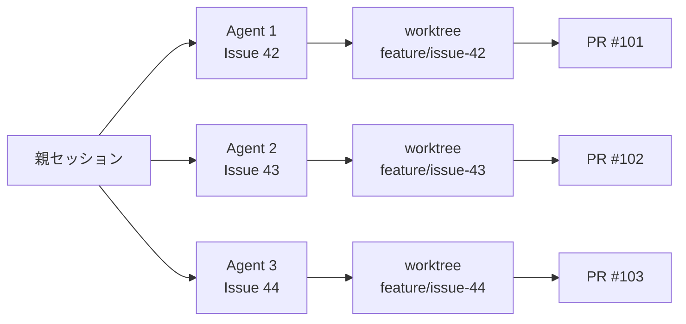
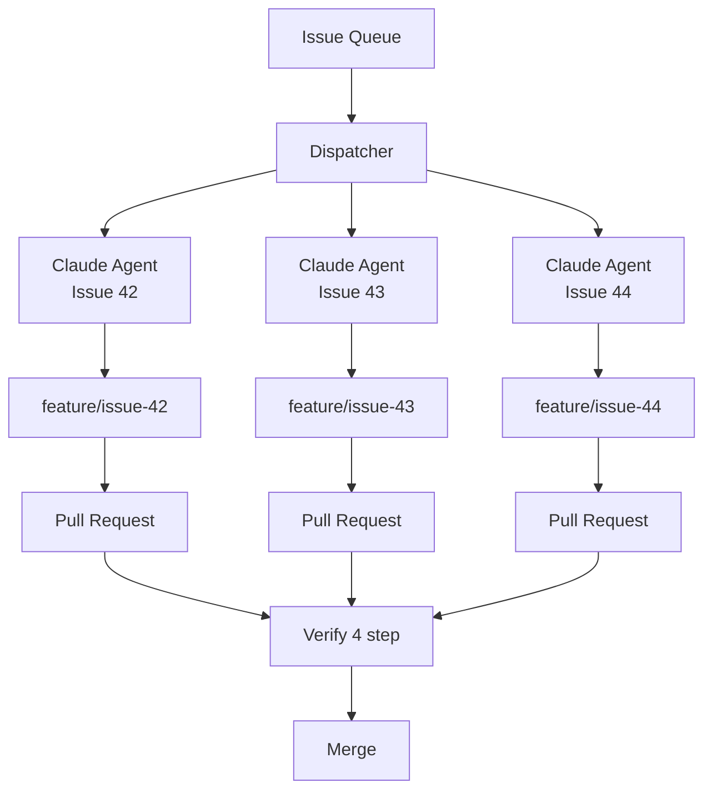
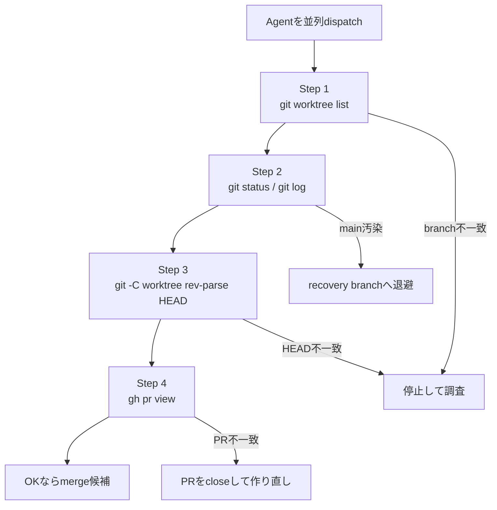
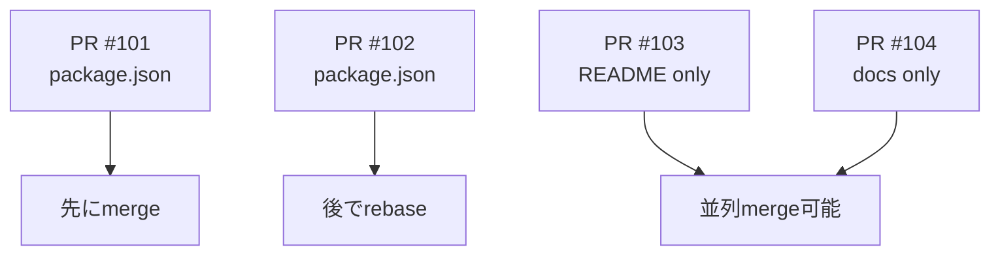

> **Disclaimer**: 本記事は、著者が個人で運営する小規模プロジェクト群での検証記録です。所属組織・本業の業務内容とは関係ありません。記載の構成・数値・運用ルールは、2026年5月時点の自宅検証環境での経験に基づきます。

## TL;DR

Claude Code Agent SDKで複数Issueを並列に処理したいなら、`worktree` はかなり便利です。

ただし、`isolation: "worktree"` を指定しただけで安心すると危ないです。

私の環境では、並列実行したAgentのcommitが、本来のfeature branchではなくmain treeに混入する事故が起きました。

そのため、並列dispatch後は次の4つを必ず確認する運用にしました。

```bash
# 1. worktreeが正しく切られているか
git worktree list

# 2. main treeが汚れていないか
git status
git log --oneline -10

# 3. 各worktreeのHEADがAgent報告と一致するか
git -C <worktree-path> rev-parse HEAD

# 4. PRのhead branch / commitが正しいか
gh pr view <PR-number> --json headRefName,baseRefName,headRefOid
```

この記事では、Claude Code Agent SDKでworktreeを使って並列開発する方法と、実運用で踏んだ落とし穴、その回避策を書きます。

---

## やりたかったこと

やりたかったことはシンプルです。

複数のGitHub IssueをClaude Code Agentに投げて、それぞれ別branchで並列に実装してもらう。

イメージはこうです。



Claude Codeを1つのターミナルで順番に動かすと、どうしても待ち時間が発生します。

一方でIssueが小さく分割されているなら、別々のAgentに任せて並列で進めたい。

そこで使いたくなるのが `worktree` です。

---

## git worktreeとは何か

`git worktree` は、1つのrepositoryから複数の作業ディレクトリを作れるGitの機能です。

普通は1つのrepositoryで1つのbranchをcheckoutします。

```text
repo/
  └── main branch
```

しかし、`git worktree` を使うと、同じrepositoryから複数のbranchを別ディレクトリとして同時に開けます。

```text
repo/                                  -> main
repo/.claude/worktrees/issue-42/       -> feature/issue-42
repo/.claude/worktrees/issue-43/       -> feature/issue-43
repo/.claude/worktrees/issue-44/       -> feature/issue-44
```

つまり、Claude Code Agentごとに別worktreeを渡せば、複数Agentが同じrepositoryを触っても、ファイルの編集場所を分けられます。

これが、Agent並列開発と相性が良い理由です。

---

## Agent SDKでやりたい構成

理想の構成はこうです。



ポイントは、Agentに直接main branchを触らせないことです。

各Agentには、次のような単位で仕事を渡します。

| 項目 | 例 |
|---|---|
| Issue | `#42` |
| worktree path | `.claude/worktrees/issue-devops-hub-42` |
| branch | `feature/issue-42` |
| task | Issue本文 + 実装方針 |
| expected output | commit hash + PR number |

実装イメージはこのようになります。

```typescript
// 擬似コードです。実際のSDKやwrapperに合わせて調整してください。
import { Agent } from "@anthropic-ai/agent-sdk";

type DispatchOptions = {
  issueNumber: number;
  task: string;
  repoPath: string;
};

async function dispatchIssue(opts: DispatchOptions) {
  const branchName = `feature/issue-${opts.issueNumber}`;
  const worktreePath = `${opts.repoPath}/.claude/worktrees/issue-devops-hub-${opts.issueNumber}`;

  const agent = new Agent({
    isolation: "worktree",
    cwd: worktreePath,
    branch: branchName,
    task: opts.task,
  });

  const result = await agent.run();

  return {
    issueNumber: opts.issueNumber,
    branchName,
    worktreePath,
    commitHash: result.commitHash,
    prNumber: result.prNumber,
  };
}
```

ただし、ここで重要なのは、Agentの実行結果をそのまま信用しないことです。

「PRを作りました」
「commitしました」
「branchにpushしました」

こういう報告を受けても、必ずGitの実体を確認します。

理由は、実際に事故ったからです。

---

## 実際に起きた事故: main branchにcommitが混入した

ある日、複数IssueをClaude Code Agentで並列dispatchしました。

狙いとしては、それぞれのAgentが次のように独立して作業する想定でした。

```text
Issue 42 -> feature/issue-42 -> PR
Issue 43 -> feature/issue-43 -> PR
Issue 44 -> feature/issue-44 -> PR
```

しかし翌朝、main branch相当の親treeに、身に覚えのないcommitが積まれていました。

```bash
git log --oneline -5
```

```text
a1b2c3d fix(ui): typo in dashboard header
9f8e7d6 chore: update lockfile
4567abc feat(api): add /api/projects endpoint
...
```

これらは、本来は各feature branchに入るべきcommitでした。

ところが、いくつかのworktreeが正しいfeature branchではなく、main branchを向いた状態でAgent作業を始めていました。

つまり、ディレクトリは分かれていたのに、Git branchの向きが間違っていたのです。

```text
期待していた状態:

repo/                               -> main
repo/.claude/worktrees/issue-42/    -> feature/issue-42
repo/.claude/worktrees/issue-43/    -> feature/issue-43

実際に起きた状態:

repo/                               -> main
repo/.claude/worktrees/issue-42/    -> feature/issue-42
repo/.claude/worktrees/issue-43/    -> main  // ここが危険
```

この状態でAgentがcommitすると、作業内容がmain側に混入します。

---

## なぜ起きるのか

原因は、`worktree` が万能の隔離ではないからです。

`worktree` が分けてくれるのは、主にファイルシステム上の作業ディレクトリです。

しかし、次のことまでは自動で保証されません。

- そのworktreeが正しいbranchを向いていること
- Agentが報告したcommit hashと実際のHEADが一致すること
- PRのhead branchが想定通りであること
- main treeに余計なcommitや差分が入っていないこと

つまり、`isolation: "worktree"` は便利ですが、**Git上の意味論的な隔離までは別途確認が必要**です。

ここを勘違いすると、並列化した瞬間に事故ります。

---

## 解決策: dispatch後にverify 4 stepを必ず通す

私の運用では、Agentを並列dispatchした直後に、必ず次の4 stepを確認するようにしました。



それぞれ見ていきます。

---

## Step 1: `git worktree list` でbranchの向きを見る

まず見るべきは、worktreeの一覧です。

```bash
git worktree list
```

期待する出力はこうです。

```text
/Users/me/project/devops-hub                                      a1b2c3d [main]
/Users/me/project/devops-hub/.claude/worktrees/issue-devops-42    9f8e7d6 [feature/issue-42]
/Users/me/project/devops-hub/.claude/worktrees/issue-devops-43    4567abc [feature/issue-43]
```

見るべきポイントは、worktree pathではありません。

重要なのは、右端のbranch名です。

```text
[feature/issue-42]
[feature/issue-43]
```

ここが `[main]` になっていたら危険です。

たとえば、次のような出力はNGです。

```text
/Users/me/project/devops-hub                                      a1b2c3d [main]
/Users/me/project/devops-hub/.claude/worktrees/issue-devops-42    9f8e7d6 [feature/issue-42]
/Users/me/project/devops-hub/.claude/worktrees/issue-devops-43    4567abc [main]
```

`issue-devops-43` というディレクトリにいるから安全、ではありません。

そのworktreeがどのbranchを向いているかを確認する必要があります。

---

## Step 2: main treeが汚れていないか見る

次に、親tree側で確認します。

```bash
git status
git log --oneline -10
```

`git status` では、意図しない変更が残っていないかを見ます。

```bash
git status --porcelain
```

何か出たら注意です。

```text
 M package.json
 M src/app/page.tsx
```

これは、Agentが触るべきではない親treeに変更が入っている可能性があります。

次に、`git log` を見ます。

```bash
git log --oneline -10
```

ここに、Agentが作ったはずのcommitがmain側に入っていたらアウトです。

見るべき観点はこれです。

| 確認項目 | OK | NG |
|---|---|---|
| `git status` | clean | Agent作業らしき差分がある |
| `git log` | main本来の履歴だけ | feature実装のcommitがある |
| commit message | release / merge系など想定内 | `feat(issue-42)` などがmainにある |

---

## Step 3: worktreeのHEADを確認する

Agentが「commit hashはこれです」と報告しても、そのまま信用しません。

実際のworktreeでHEADを確認します。

```bash
git -C /Users/me/project/devops-hub/.claude/worktrees/issue-devops-42 rev-parse HEAD
```

あわせて直近のlogも見ます。

```bash
git -C /Users/me/project/devops-hub/.claude/worktrees/issue-devops-42 log --oneline -5
```

確認するのは次の3つです。

| 確認 | 内容 |
|---|---|
| HEAD hash | Agentの報告と一致するか |
| commit message | Issueの作業内容と合っているか |
| branch | `feature/issue-N` を向いているか |

ここで不一致が出たら、Agentの報告ではなくGitの実体を信じます。

---

## Step 4: PRのhead branchとcommitを見る

最後に、GitHub PRの向きも確認します。

```bash
gh pr view <PR-number> --json headRefName,baseRefName,headRefOid
```

期待値はこうです。

```json
{
  "headRefName": "feature/issue-42",
  "baseRefName": "main",
  "headRefOid": "9f8e7d6..."
}
```

見るべきポイントは3つです。

| 項目 | 期待値 |
|---|---|
| `headRefName` | `feature/issue-42` |
| `baseRefName` | `main` |
| `headRefOid` | Step 3で見たHEADと一致 |

PRが存在していても、head branchが違っていたら危険です。

PRがあるかどうかではなく、**正しいbranchから正しいcommitでPRが出ているか**を確認します。

---

## verifyをwrapperに入れる

手作業で毎回確認するのは面倒なので、wrapperに入れます。

```typescript
// 擬似コードです。
import { execSync } from "node:child_process";

type VerifyOptions = {
  repoPath: string;
  worktreePath: string;
  branchName: string;
  expectedCommitHash: string;
  prNumber: number;
};

function sh(command: string, cwd?: string) {
  return execSync(command, { cwd, encoding: "utf-8" }).trim();
}

export function verifyAgentResult(opts: VerifyOptions) {
  // Step 1: worktreeが存在し、branchが正しいか
  const wtList = sh("git worktree list", opts.repoPath);

  if (!wtList.includes(opts.worktreePath)) {
    throw new Error(`worktree not found: ${opts.worktreePath}`);
  }

  if (!wtList.includes(`[${opts.branchName}]`)) {
    throw new Error(`worktree branch mismatch: expected ${opts.branchName}`);
  }

  // Step 2: main treeが汚れていないか
  const mainStatus = sh("git status --porcelain", opts.repoPath);

  if (mainStatus !== "") {
    throw new Error(`main tree is dirty:\n${mainStatus}`);
  }

  // Step 3: worktree HEADがAgent報告と一致するか
  const actualHead = sh(`git -C ${opts.worktreePath} rev-parse HEAD`);

  if (actualHead !== opts.expectedCommitHash) {
    throw new Error(
      `HEAD mismatch: expected ${opts.expectedCommitHash}, actual ${actualHead}`,
    );
  }

  // Step 4: PRが正しいbranch / commitを向いているか
  const prJson = sh(
    `gh pr view ${opts.prNumber} --json headRefName,baseRefName,headRefOid`,
    opts.repoPath,
  );

  const pr = JSON.parse(prJson) as {
    headRefName: string;
    baseRefName: string;
    headRefOid: string;
  };

  if (pr.headRefName !== opts.branchName) {
    throw new Error(`PR head branch mismatch: ${pr.headRefName}`);
  }

  if (pr.baseRefName !== "main") {
    throw new Error(`PR base branch mismatch: ${pr.baseRefName}`);
  }

  if (pr.headRefOid !== actualHead) {
    throw new Error(`PR head commit mismatch: ${pr.headRefOid}`);
  }
}
```

Agentの自己申告を信用するのではなく、GitとGitHubの実体で確認します。

このwrapperを通して初めて「Agentの作業が完了した」と扱います。

---

## force-pushで詰まったら、新しいPRを作る

並列開発をしていると、rebaseやfixupの都合でforce-pushしたくなることがあります。

しかし、branch protectionが有効なrepositoryでは、`--force-with-lease` も拒否されることがあります。

```bash
git push --force-with-lease origin feature/issue-42
```

```text
! [remote rejected] feature/issue-42 -> feature/issue-42 (refusing to allow force-push)
```

ここで何度もretryすると時間を失います。

私の運用では、force-pushが拒否されたら、既存PRにこだわらず新branchで作り直す方針にしました。

```bash
# 既存PRを閉じる
gh pr close 123 --comment "force-pushが拒否されたため、新しいbranchでPRを作り直します"

# 新しいbranchを切る
git checkout -b feature/issue-42-v2 origin/main

# 必要なcommitを移植する
git cherry-pick <commit-hash>

# 新branchをpushする
git push origin feature/issue-42-v2

# PRを作り直す
gh pr create \
  --base main \
  --head feature/issue-42-v2 \
  --title "..." \
  --body "..."
```

force-pushのretryに固執するより、新しいbranchでPRを作り直す方が速いことが多いです。

---

## main汚染を検知したときの安全な復旧

main treeに意図しないcommitや差分が入ったとき、いきなり `git reset --hard` するのは危険です。

まずは、汚染状態を失わないように退避します。

```bash
SAFE_BRANCH="recovery/$(date +%Y%m%d-%H%M%S)"
git checkout -b "$SAFE_BRANCH"
git push origin "$SAFE_BRANCH"
```

そのうえで、mainを戻します。

```bash
git checkout main
git fetch origin
git reset --hard origin/main
```

`reset --hard` は破壊的なので、チーム開発や重要repositoryでは必ず確認してから実行します。

安全側に倒すなら、まずrecovery branchを作るのがおすすめです。

---

## 並列数は増やしすぎない

Agent並列数は、多ければ多いほど速いわけではありません。

私の環境では、6〜8並列あたりが扱いやすい上限でした。

| 並列数 | 状態 | コメント |
|---:|---|---|
| 4 | 安定 | まずはここからで十分 |
| 8 | 速いが注意 | 実用上のsweet spot |
| 16 | 詰まりやすい | memory / API / hookが重くなる |
| 30 | 逆に遅い | rate limitや待機が増える |

並列数を増やすと、次の問題が出やすくなります。

- memory pressure
- GitHub API rate limit
- lockfile conflict
- 同じファイルの編集衝突
- hookの同時実行による待機
- merge順序のconflict

最初は4並列くらいから始めて、repositoryやマシンの状態を見ながら増やす方が安全です。

---

## mergeも順番を考える

並列にPRを作ると、merge時にも詰まります。

特に、複数PRが同じファイルを触る場合は注意です。

よく衝突するファイルは次のようなものです。

- `package.json`
- lockfile
- route定義
- mock data
- schema file
- generated file

merge順序を考えずに一気にmergeすると、後続PRがまとめてconflictします。

私の運用では、PRごとに変更ファイルを見て、同じファイルを触るPRは順番にmergeするようにしています。



Agent並列化では、実装だけでなくmerge phaseも設計対象です。

---

## 運用ルールまとめ

Claude Code Agent SDKでworktree並列を使うなら、私はこのルールにしています。

| ルール | 理由 |
|---|---|
| Agentごとにworktreeを分ける | ファイル編集の衝突を減らす |
| branch名はIssue番号から決定的に作る | 対応関係を追いやすくする |
| dispatch後にverify 4 stepを必ず通す | main汚染を早期検知する |
| Agentの自己報告を信用しすぎない | Gitの実体とズレることがある |
| force-push拒否時は新PRに切り替える | retryで時間を溶かさない |
| 並列数は4〜8から始める | memory / API / conflictを抑える |
| merge順序を見る | 後続PRのconflictを減らす |

---

## なぜここまで確認するのか

理由は、失敗したときのコストが大きいからです。

verify 4 stepは、慣れれば30秒〜1分で終わります。

一方で、main branchに意図しないcommitが混入し、それを他のAgentがpullして、複数PRに伝播すると、復旧に何時間もかかります。

```text
verifyするコスト: 数十秒
main汚染を放置するコスト: 数時間
```

この非対称性があるので、並列Agent運用では「多分大丈夫」ではなく「毎回確認する」が正解です。

---

## まとめ

Claude Code Agent SDKでworktreeを使うと、複数Issueを並列に処理できます。

これはかなり便利です。

ただし、`isolation: "worktree"` を指定しただけでは、Git branchの向きやPRの正しさまでは保証されません。

並列dispatch後は、必ず次の4つを確認します。

```bash
git worktree list
git status
git log --oneline -10
git -C <worktree-path> rev-parse HEAD
gh pr view <PR-number> --json headRefName,baseRefName,headRefOid
```

Agent並列開発で大事なのは、Agentを信じないことではありません。

**Agentの出力を、GitとGitHubの実体で検証すること**です。

worktree並列は強力ですが、verifyとセットで初めて安全に使えます。

---

## 関連記事

- [A-01: Issue 1つでCloud Runまで届く7-Agent CI/CDパイプライン](./issue-to-cloud-run-workflow)
- [A-04: PostToolUse hookで品質ゲートを倒す](./hooks-quality-gates)
- [B-03: マージ済 ≠ 本番反映済 — verify deployパターン](./merged-not-equals-deployed)
