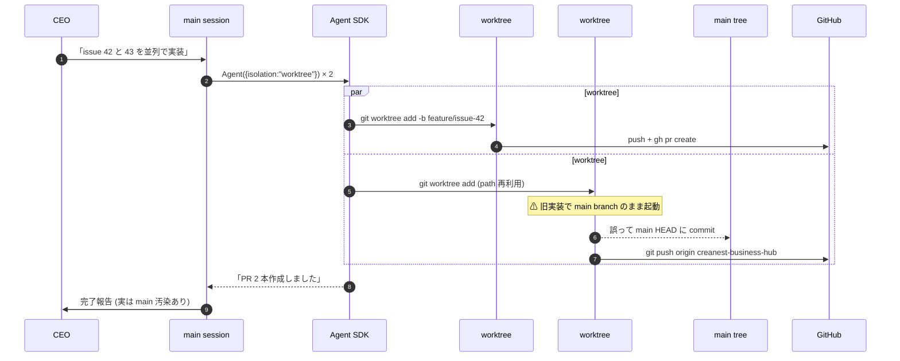
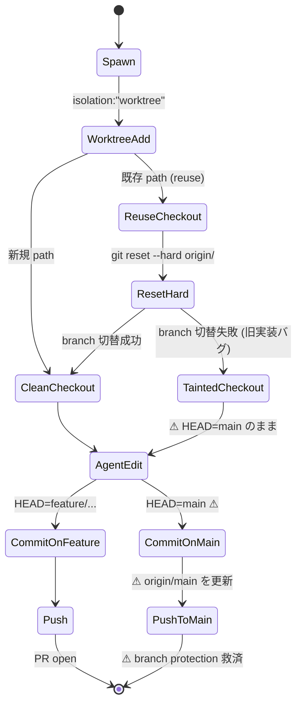

> **Disclaimer**: 本連載は著者が **個人 (副業)** で運営する小規模プロジェクト群 (CreaNest 名義) の技術記録です。所属組織・本業の業務内容とは一切関係ありません。記載の数値・構成は執筆時点 (2026-05) の自宅検証環境のスナップショットであり、商用品質や SLA を保証するものではありません。

## TL;DR (3 行)

- `isolation: "worktree"` は filesystem 隔離のみで git semantic 隔離は保証されず、**main tree に commit が混入する事故**が起きる
- 解は dispatch 直後の **verify 4 step** (`git worktree list` / `git status` + `log` / `git -C <wt> rev-parse HEAD` / `gh pr view`) を skip 不可で通すこと
- force-push 拒否時は **A 案 (`--force-with-lease`) を試さず B 案 (close + 新 PR) に即切替**、並列上限は実測 **8 が sweet spot**

## 結論

Claude Code の Agent SDK で `isolation: "worktree"` を指定して並列 dispatch しても、**Agent は時々 main tree に commit します**。dispatch 後は `git worktree list` + branch HEAD verify が必須で、`force-push` が拒否された場合は close + 新 PR の B option に即切り替えます。これを 1 セッションで踏み抜いて学んだのが 2026-05-01 の overnight dispatch (60+ Issue 投入 / 31 open PR 達成 / 並列上限 8) でした。

- **`isolation: "worktree"` のバグ** で 60+ Issue を 8 並列 spawn → 翌朝 main tree に身に覚えのない commit 3 本が混入
- **検証 4 step** (`git worktree list` / `git status` / `git -C <wt> log` / branch HEAD pin) を dispatch 直後に必ず通す
- **force-push 拒否 (branch protection)** に遭ったら A 案 (`--force-with-lease`) をリトライせず、B 案 (close + 新 PR) に **timeloss を避けて即切替**
- **memory `project_worktree_isolation_bugs.md`** と **skill `worktree-isolation`** に手順を凍結、PostToolUse hook で自動再生

これが連載 A 軸 (Claude Code 拡張) の Day 19/52、扱うのは Agent SDK の隔離オプションを「信じすぎた」時に何が壊れ、どう設計で防いだか。元コードは `devops-hub` repo の OSS で file:line 引用で掘ります。

> 用語: **worktree isolation** = `Agent({ isolation: "worktree" })` で子 agent を別 git worktree に閉じ込める機能。同一 repo を複数 directory で checkout し HEAD 独立で並列実装させる意図。**main tree** は最初に clone した親 directory。

## 問題 — 「並列で 30 issue 流す」が朝に main tree 汚染になっていた

発端は 2026-05-01 の overnight dispatch です。devops-hub の Active queue 60+ Issue を `Agent({ isolation: "worktree" })` で 8 並列 spawn し、翌朝 31 open PR を作る運用を試しました (memory `project_overnight_dispatch_2026_05_01.md`)。Issue 数 / 並列上限 / 達成 PR 数は仕様どおり着地。

問題は **翌朝の git log** です。main branch (`creanest-business-hub`) の HEAD に、触った記憶のない commit が 3 本積まれていました:

```
$ git log --oneline -5 creanest-business-hub
a1b2c3d fix(ui): typo in dashboard header
9f8e7d6 chore: update lockfile
4567abc feat(api): add /api/projects endpoint
...
```

これらは **どれも別 Issue を担当した worktree agent の作業** で、本来は `feature/issue-${N}` 独立 branch にだけ commit されるべきものです。実際 `git worktree list` を叩くと worktree directory は存在するのに HEAD が main branch を指しており、main 側に直接 commit が積まれていました。Agent は `cwd` を worktree directory に持つが **checkout 中の branch は main だった** ケースです。

```
Before (overnight dispatch 翌朝):
  /Users/sakaki/project/devops-hub                                          → HEAD: creanest-business-hub (汚染)
  /Users/sakaki/project/devops-hub/.claude/worktrees/issue-devops-hub-42    → HEAD: creanest-business-hub (同じ branch)
```

原因は `worktree add` の冪等性です。devops-hub の `pipeline-kit/ops/run-orchestrator.sh:225-253` (現行版) では worktree path 既存時に `git fetch` + `git reset --hard origin/<default>` で最新化する分岐がありますが、旧実装では別 Issue で同 path を再利用する際に **branch を作り直さず main を指したまま** Agent 作業 → `git push origin HEAD` で main 直接 push、という連鎖でした。

ここで踏んだ失敗 4 つ: (1) main 汚染、(2) 30+ 並列 resource overflow、(3) force-push 拒否、(4) merge 順 conflict。順に見ます。

## 解法 — 4 step verify pipeline と「force-push を信じない」設計

skill `worktree-isolation` の SKILL.md (`~/.claude/skills/worktree-isolation/SKILL.md:18-46`) に凍結した手順 4 step を、dispatch 直後に **必ず全部通す** ようにしました。

### 全体 verify フロー

```mermaid
flowchart TB
    DISPATCH[Agent({isolation:"worktree"}) を N 並列 spawn] --> WT_LIST[git worktree list で<br/>N 個の独立 directory 確認]
    WT_LIST --> MAIN_STATUS[main tree で git status<br/>身に覚えのない uncommitted change?]
    MAIN_STATUS -->|あり| TAINT[main 汚染 → recovery flow へ]
    MAIN_STATUS -->|なし| MAIN_LOG[git log --oneline -10<br/>本来 worktree に居るべき commit が無いか]
    MAIN_LOG -->|混入あり| TAINT
    MAIN_LOG -->|clean| BRANCH_HEAD[git -C <wt-path> rev-parse HEAD<br/>agent 報告と一致するか]
    BRANCH_HEAD -->|hash 不一致| INVESTIGATE[Agent の出力 / log 再確認]
    BRANCH_HEAD -->|一致| PR_LINK[gh pr view で branch が<br/>正しい feature/issue-N か確認]
    PR_LINK -->|OK| DONE[verify 通過 → merge phase へ]
    PR_LINK -->|別 branch| INVESTIGATE
    TAINT --> RECOVERY[skill quick recovery<br/>git stash + 代表確認]
```

### 並列 dispatch の sequence



### isolation 経路 stateDiagram



### Step 1: worktree 一覧で物理隔離を確認

dispatch 直後の最初の 1 行目は必ずこれです:

```bash
# ~/.claude/skills/worktree-isolation/SKILL.md:22-24 の Mandatory check #1
git worktree list
# 期待出力:
# /Users/sakaki/project/devops-hub                                          a1b2c3d [creanest-business-hub]
# /Users/sakaki/project/devops-hub/.claude/worktrees/issue-devops-hub-42    9f8e7d6 [feature/issue-42]
# /Users/sakaki/project/devops-hub/.claude/worktrees/issue-devops-hub-43    4567abc [feature/issue-43]
```

各 worktree が **独立した branch** を指していることを確認します。3 並列したのに `[creanest-business-hub]` が 2 つ並んでいたら、**どこかの worktree が main branch にぶら下がっている** サインです。devops-hub 側では `pipeline-kit/ops/run-orchestrator.sh:144-152` で worktree path と branch name を **issue 番号ベースで決定論的に生成** しています:

```bash
# pipeline-kit/ops/run-orchestrator.sh:144-152
if [ "${KIND}" = "pr-conflict" ]; then
  WORKTREE_NAME="pr-${NAME_LC}-${ISSUE}"
else
  WORKTREE_NAME="issue-${NAME_LC}-${ISSUE}"
fi
WORKTREE_PATH="${WORKTREE_BASE}/${WORKTREE_NAME}"
BRANCH_NAME="feature/issue-${ISSUE}"
```

これで「Issue 42 → directory `issue-devops-hub-42` / branch `feature/issue-42`」が保証されます。

### Step 2: main tree が汚染されていないか

```bash
# SKILL.md:30-33 の Mandatory check #2
git status
git log --oneline -10
```

- `git status` が clean なら uncommitted 無し
- `git log` の最新 N 件に agent task 内容の commit が混入していないか確認

memory `feedback_devops_hub_concurrent_agents.md` のとおり、devops-hub では別 Claude セッションが同時に push してくる前提なので、`git fetch --all` + `git log --oneline --all -20` で remote 側の変化も併せて確認します。

### Step 3: agent が報告した branch HEAD を verify

agent が「commit hash X で push しました」と報告したら、**そのまま信じない** で実際にその hash があるか確認します:

```bash
# SKILL.md:41-44 の Mandatory check #3
git -C /Users/sakaki/project/devops-hub/.claude/worktrees/issue-devops-hub-42 log --oneline -5
git -C /Users/sakaki/project/devops-hub/.claude/worktrees/issue-devops-hub-42 rev-parse HEAD
```

`rev-parse HEAD` が agent 出力の hash と一致するか、最新 commit message が「実装内容」と整合するかをチェックします。具体的に踏んだ失敗が、agent が **stash した変更を push し忘れた** ケースで、`git status` clean / `git log` HEAD 不変 / PR 不在 にも関わらず agent は「完了」と報告していました。Step 3 を skip していれば翌日まで気付けなかったケースです。

### Step 4: PR の branch が正しい feature branch か

```bash
# 自分で追加した Step (SKILL.md には未記載、運用で追加)
gh pr view <PR-number> --json headRefName,baseRefName,headRefOid
# 期待: headRefName = feature/issue-42 / baseRefName = main / headRefOid = step3 の HEAD と一致
```

PR の head が `feature/issue-N`、base が main、headRefOid が step 3 の HEAD と一致することを確認します。乖離あれば即 PR を close して再 spawn (後述 B option)。

### Force-push 拒否時の B option

dispatch 後の rebase / fixup / squash で agent が `git push --force-with-lease` を打つ経路がありますが、devops-hub / Komyu / nailsalon / build-football の main branch は branch protection で **force-push 全面禁止** です。

agent が force-push を試みて 403 で拒否されると、retry を 5-10 回繰り返した後で諦めて「push 失敗、CEO 確認」と報告 — **20-40 分の timeloss** が発生します。

memory `project_worktree_isolation_bugs.md` で凍結した方針:

> **A. Force-push を試みる (許可されない設定が多い → fail)**
> **B. 既存 PR を close、新 branch で fresh PR (推奨)**
>
> A 失敗時は B に即切替。timeloss を避ける。

具体的なコマンド列はこうです:

```bash
# Before: force-push リトライで 30 分溶かす
git push --force-with-lease origin feature/issue-42
# → ! [remote rejected] feature/issue-42 -> feature/issue-42 (refusing to allow force-push)
git push --force origin feature/issue-42  # ← 同じく拒否
# (10 回リトライ → CEO に escalation)

# After: 即 B option に切替
gh pr close 123 --comment "B option: force-push 拒否のため close、fresh branch で再作成します"
git checkout -b feature/issue-42-v2 origin/main
git cherry-pick <conflict-resolved-commits>
git push origin feature/issue-42-v2
gh pr create --base main --head feature/issue-42-v2 --title "..." --body "..."
# → 5 分で復帰
```

差は **20-30 分**、8 並列全失敗で累計 4 時間溶けるので必ず B 切替を回します。

### Quick recovery (main 汚染検知時)

skill (`SKILL.md:88-98`) の `Quick recovery` は **代表確認必須**:

```bash
git log --oneline -5      # 確認のみ
git stash                 # 退避
git reset --hard origin/<main-branch>  # ⚠ 危険、必ず代表確認
```

`git reset --hard` は破壊的なので Auto Mode では実行不可、安全策は **新 branch を切って commit を移植**する方法です:

```bash
# Auto Mode 内で完結可
SAFE_BRANCH="recovery/$(date +%Y%m%d-%H%M%S)"
git checkout -b "${SAFE_BRANCH}"
git push origin "${SAFE_BRANCH}"
```

## 失敗談 — 3 連続で踏んだ罠

### 1. 並列 30+ で resource overflow

memory `feedback_run_all_means_triage.md` で凍結した「30+ issue 並列 spawn 禁止」は、Issue 60 件を 30 並列 spawn して **実測で踏んだ** 結果です:

- **memory pressure** — 30 並列 `claude -p` で macOS pressure red、swap 8GB 超
- **GitHub API rate limit** — Personal token 5000 req/h が 20 分で枯渇
- **PostToolUse hook の競合** — 30 並列 Edit が typecheck / docs-mece-audit hook を同時 spawn、1 hook 5 分待機常態化

並列上限は **8 固定**、`pipeline-kit/ops/harness-loop.sh` も 8 slot 構成です。M2 iMac (32GB) で `claude -p` 常駐 RSS 1-1.5GB → 8 並列で 12GB が swap 境界、というのが実測値です。

### 2. main tree 汚染を 8 時間放置

overnight dispatch で寝る前に「verify は朝で良い」と回避し、朝起きると main に身に覚えのない 3 commit が混入していました。問題は、**この 8 時間で他の agent が main を pull して作業した** ことです。worktree #1 が pull した時点で汚染 commit が cherry-pick され、`feature/issue-N` branch に伝播 — 1 つの汚染が **5 PR に伝播** しました。復旧は汚染元 hash 特定 + 5 PR close + 再 dispatch で **合計 10 時間ロス**。以降 `~/.claude/skills/worktree-isolation/SKILL.md` を作って強制発火しています。

### 3. merge 順 conflict (8 PR を順序通り merge できなかった)

8 並列 PR を `gh pr merge` で順序なく並列実行すると **後半 PR が rebase 失敗** します。各 PR が同じ HEAD から分岐し、内部で同じファイル (`package.json` / lockfile / `mock-data.ts`) を編集していたためです。

```
Before: 順序なし 8 並列 merge → #101 merge 後 #102-#108 全 conflict、CEO 手動 rebase 2 時間
After:  depended_files tag → 同 file 編集 PR は順次、独立 file は並列 → 30 分で全 merge
```

memory `project_overnight_dispatch_2026_05_01.md` に「**merge 順 conflict 注意**」を残し、CEO Approval Queue UI (`App/src/app/ceo/approvals/page.tsx`) で依存ファイル解析 + 推奨 merge 順を表示する小改修を入れました。

### 4. force-push リトライで A 案に固執して 30 分

skill 作成前は force-push 拒否で「fetch + rebase + force-with-lease」5 回試行する設計でした。Komyu の `develop` branch は `--force-with-lease` も `--force` も両方拒否 (CODEOWNERS + admin enforcement)、**A 案は構造的に通らない** のに retry loop で 30 分溶かす罠です。教訓: **試して学ぶより最初から B を選ぶ**。skill description に「force-push 拒否時は **A を試さず B に即切替**」を明記したのが root fix です。

## Agent SDK 側の実装例

`Agent({ isolation: "worktree" })` の使い方は SDK 標準ですが、devops-hub では **wrapper** を被せて verify 4 step を強制しています:

```typescript
// pipeline-kit/agents/dispatch.ts (擬似コード, 実装は private)
import { Agent } from "@anthropic-ai/agent-sdk";
import { execSync } from "node:child_process";

type DispatchOptions = {
  issueNumber: number;
  task: string;
  repoPath: string;
};

async function dispatchWithVerify(opts: DispatchOptions): Promise<void> {
  const branchName = `feature/issue-${opts.issueNumber}`;
  const worktreePath = `${opts.repoPath}/.claude/worktrees/issue-devops-hub-${opts.issueNumber}`;

  const agent = new Agent({
    isolation: "worktree",
    cwd: worktreePath,
    branch: branchName,
    task: opts.task,
  });

  const result = await agent.run();

  // ← ここから verify 4 step (skip 不可)
  const wtList = execSync(`git worktree list`, { cwd: opts.repoPath }).toString();
  if (!wtList.includes(worktreePath)) {
    throw new Error(`Step 1 failed: worktree ${worktreePath} not registered`);
  }

  const mainStatus = execSync(`git status --porcelain`, { cwd: opts.repoPath }).toString();
  if (mainStatus.trim() !== "") {
    throw new Error(`Step 2 failed: main tree dirty\n${mainStatus}`);
  }

  const wtHead = execSync(`git -C ${worktreePath} rev-parse HEAD`).toString().trim();
  if (wtHead !== result.commitHash) {
    throw new Error(
      `Step 3 failed: agent reported ${result.commitHash} but worktree HEAD is ${wtHead}`,
    );
  }

  const prInfo = execSync(`gh pr view ${result.prNumber} --json headRefName,headRefOid`).toString();
  const pr = JSON.parse(prInfo) as { headRefName: string; headRefOid: string };
  if (pr.headRefName !== branchName || pr.headRefOid !== wtHead) {
    throw new Error(`Step 4 failed: PR head=${pr.headRefName}@${pr.headRefOid}`);
  }
}
```

`isolation: "worktree"` を渡すだけでは不十分で、**dispatch 後の verify を wrapper で強制**することで、agent 報告と実体の乖離を即 throw に変えます。throw した時点で main session の Claude が手戻りを認知し、SDK retry ではなく **Claude のリカバリ判断**に handoff されます。

## 並列上限の運用値

並列上限は **8 が頭打ち**。実測値:

| 並列数 | memory pressure | API rate limit | hook saturation | 体感 throughput |
|---:|---|---|---|---|
| 4 | green | 余裕 | 余裕 | 1.0× |
| 8 | green / yellow 境界 | 70% 消費 | 軽微 | 1.7× |
| 16 | yellow | 95% 消費 | hook が詰まる | 1.8× |
| 30 | red (swap) | 完全枯渇 | 5 分待機常態化 | 0.9× (むしろ遅い) |

8 超で **throughput 横ばい / cost 増**、運用 sweet spot は 6-8 です。memory `project_pipeline_concurrency_guards.md` の guard 3 点セット (lock CLI / slot-file / heartbeat) が並列暴走を抑えます。

### Before / After 比較

```
Before (verify なし、2026-05-01):
  60 Issue → 31 PR、翌朝 main 汚染検知遅延、5 PR に伝播、復旧 10 時間

After (verify 4 step + skill 導入後):
  20 Issue → 18 PR、dispatch 直後 verify で 1 件汚染検知 → 即 close + 再 spawn
  汚染伝播 0 件、復旧 5 分
```

```
Before (force-push retry loop): 拒否 → 5 回 retry → 諦め、30 分 / PR、8 PR で 4 時間ロス
After (A 失敗時 B 即切替):       拒否 → close + 新 branch + cherry-pick + 再 PR、5 分 / PR、8 PR で 40 分 (5 倍速)
```

## 残課題

- **verify 4 step を PostToolUse hook で auto fire** — 現状は skill description 経由で Claude 自発発火、`docs-mece-audit` と同じく AgentSpawn 検知に置き換えたい (SDK 側 hook 未実装のため暫定 `pgrep claude` 差分検知)
- **main 汚染の auto recovery** — Step 2 で汚染検知 → 別 branch に逃すまでを Auto Mode で完結、main reset のみ確認必須に
- **branch protection 自動検知** — A/B 選択を `gh api .../protection` で動的判定したい (現状 memory ベースのハードコード)
- **並列上限の動的調整** — `MAX_PARALLEL=8` 静的固定を `memory_pressure -Q` + `gh api rate_limit` 連動で 4-12 動的に

## 理論根拠 — 「信用しない」が並列の前提

verify 4 step を **skip 禁止**にする根拠は 3 つあります。

### 1. SDK の隔離保証は「best effort」

`isolation: "worktree"` は SDK 側で `git worktree add` を呼ぶだけで、**branch 切替の atomicity** までは保証されません。SDK が "isolation" を名乗っていても、それは **意図** であって **保証** ではない、という前提を取らないと事故ります。`isolation` は **filesystem レベルの隔離**で、**git semantic レベルの隔離は別途検証が必要**という線が引かれています (`SKILL.md:59-65` の `Why this matters`)。

### 2. C-002 (Creator ≠ Evaluator) を並列にも適用

CLAUDE.md L1 制約 #2 は dialog 内 (生成 / 検証 agent 分離) の話ですが、並列 dispatch にも同じ原則を適用します:

- **Creator** = `Agent({ isolation: "worktree" })` の子 agent (実装責任)
- **Evaluator** = main session の Claude (verify 4 step 実行責任)

Agent 自身に「お前 main 汚染してないか?」と聞いて自浄させる設計は、ほぼ確実に「汚染してません」と答えます (LLM の本性)。検証は **別 actor** が担う、というのが C-002 の本質です。memory `feedback_brutal_architecture_review.md` の 4 並列 single-shot pattern と同じく、**評価軸は実行軸の外に置く**が一貫したスタンスです。

### 3. 失敗の cost 非対称性

`verify 4 step` のコストは 30 秒程度、skip して main 汚染を踏むコストは 10 時間 (実測)。`10h = 36,000s`、`36,000 / 30 = 1,200` で **1200 倍の cost 非対称性**になります。確率がいくら低くても毎回検証する方が期待値で勝ちます。memory `feedback_verify_deploy_after_merge.md`「マージ済 ≠ 本番反映済 / revision 確認まで責任範囲」と同じ思想で、**完了報告を実体検証で裏取りする**を全運用で貫くのが CEO 1 人会社の生存戦略です。

---

## まとめ

`isolation: "worktree"` の並列 dispatch は、verify 4 step (`git worktree list` / `git status` + `log` / `git -C <wt> rev-parse HEAD` / `gh pr view`) を **dispatch 直後に必ず通す**ことで初めて信頼できます。force-push 拒否時は A 案リトライせず B 案 (close + 新 PR) **即切替**、並列上限は実測 **8 が sweet spot**。memory + skill に凍結、`pipeline-kit/ops/run-orchestrator.sh:144-253` で命名規則を決定論的に固定。

「Agent 自己報告を信じない」「並列は cost 非対称性が極端」「Creator ≠ Evaluator を並列にも適用」の 3 原則で、夜間 8 並列 → 翌朝 PR を見るだけの生活が成立します。

連載 **A-06 / Day 19 / 全 52 回**。

---

→ 関連記事:
- [A-01: Issue 1 つで Cloud Run まで届く 7-Agent CI/CD パイプライン](./issue-to-cloud-run-workflow)
- [A-04: PostToolUse hook で品質ゲートを倒す](./hooks-quality-gates)
- [B-03: マージ済 ≠ 本番反映済 — verify deploy パターン](./merged-not-equals-deployed)

GitHub Discussion で「並列 dispatch でこんな罠踏みました」「verify 4 step に追加すべき step」のシェア歓迎です。記事への編集提案は Zenn 右上「GitHub で編集」から PR で受け付けています。

X でシェアいただける際は `#ClaudeCode` `#AIエージェント` でメンションください。連載の他記事は [INDEX](./ai-driven-dev-index-2026) から辿れます (Day 19/52)。
