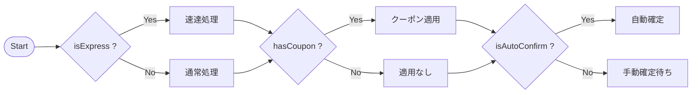
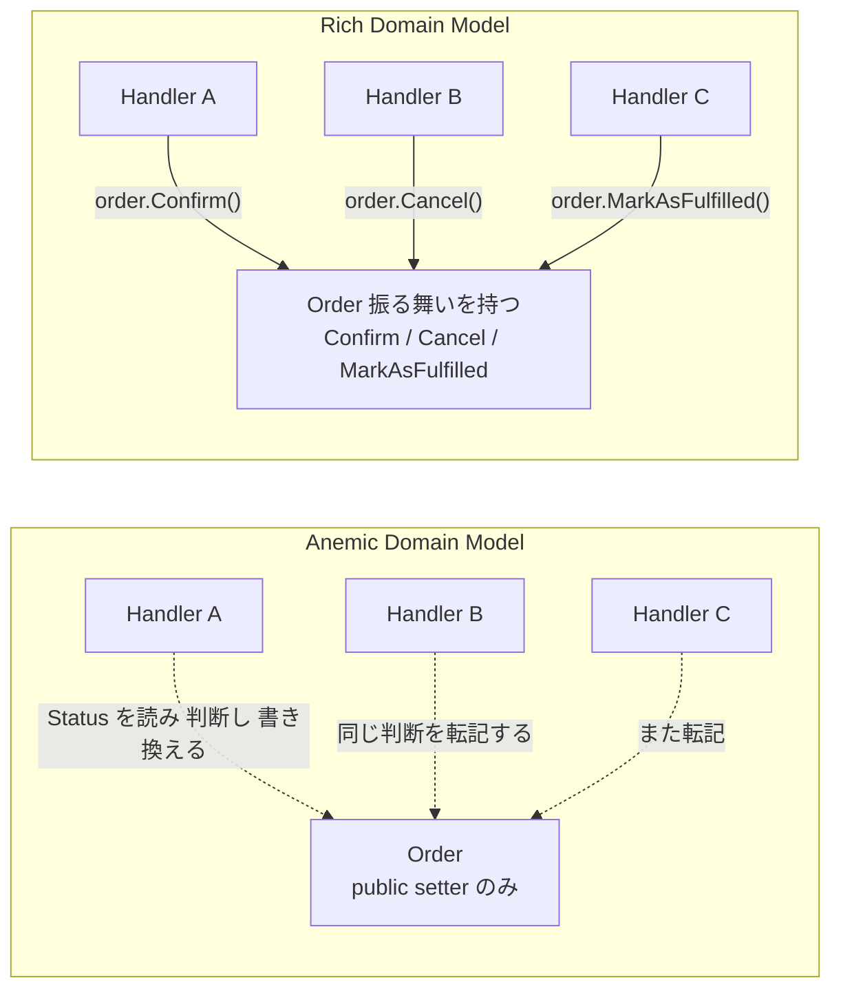

# 第 1 章 — なぜ if は増殖するのか

> **この章のゴール**
> - 「if が増えていく」現象を、コードの腐敗ではなく **設計の問題** として説明できるようになる
> - 増殖の 3 つの典型パターンを見分けられるようになる
> - 「if を消す」のではなく「if の住所を直す」というメンタルモデルを持つ

---

## 1.1 ある日のコードレビュー(再掲)

「まえがき」で見たコードを、もう少し詳しく観察してみよう。

```csharp
// 半年で 30 行 → 400 行に成長した CreateOrderHandler
public async Task<Result> HandleAsync(CreateOrderCommand cmd, CancellationToken ct)
{
    var order = factory.Create(cmd);

    if (cmd.IsExpress)
    {
        var fee = expressFeeCalculator.Calc(order);
        order.ApplyExpressFee(fee);
        await expressInventory.Reserve(order, ct);
    }
    else
    {
        await normalInventory.Reserve(order, ct);
    }

    if (cmd.HasCoupon)
    {
        var discount = couponService.Apply(cmd.CouponCode, order);
        order.ApplyDiscount(discount);
    }

    if (cmd.IsAutoConfirm)
    {
        var rate = await autoPricingService.GetRateAsync(order, ct);
        order.AutoConfirm(rate);
        // 自動確定のときは Kafka を送らない
    }
    else
    {
        await kafka.PublishAsync(new OrderCreated(order.Id), ct);
    }

    await repo.AddAsync(order, ct);
    await uow.SaveChangesAsync(ct);
    return new Result(order.Id);
}
```

このコードを **「悪いコードだ」と感じる勘** を、まず言語化することから始めよう。

---

## 1.2 増殖を可視化する

git の履歴を辿ると、このコードは次のように成長していた。


各コミット自体は「機能追加」として正しく見える。レビュアーも「`if (cmd.HasCoupon) { ... }` を足す」変更を止める理由はない。**1 つ 1 つの diff は無害なのに、6 ヶ月後の総体が腐っている**。

これがソフトウェア設計における最も厄介な腐敗パターンだ。Robert C. Martin はこれを **"Architectural Drift"** (アーキテクチャの漂流)と呼んでいる[^drift]。

[^drift]: Robert C. Martin, *Clean Architecture* (2017), Chapter 1 "What is Design and Architecture?". 「動くコード」と「保守できるコード」は別物であり、後者は意識的な設計を要する、という主張の出発点。

---

## 1.3 if が増えていく 3 つの典型パターン

増殖のしかたを分類すると、3 つの典型に集約される。

### パターン A — **横方向に広がる**(機能追加で if が並ぶ)



**症状**: `if (isXxx)` が同じメソッドの中に 3 個、5 個、10 個と並んでいく。
**増え方の動機**: 新機能 = 新フラグ = 新 if。
**第 10 章で詳説**: [巨大 Handler の解体](10-handler-decomposition)

### パターン B — **縦方向に深くなる**(条件のネストが深まる)

```csharp
if (cmd.IsAutoConfirm)
{
    if (cmd.AutoConfirmReason == "VIP")
    {
        if (await pricingService.IsAvailableAsync(order, ct))
        {
            if (order.Total > 100000)
            {
                // 4 段ネストの中で本処理
            }
        }
    }
}
```

**症状**: インデントが 4 段、5 段と深くなる。Linus Torvalds 曰く「3 段を超えたら設計を疑え」[^linus]。
**増え方の動機**: 例外条件・特殊ケース・null チェックの積み重ね。
**第 6 章で詳説**: [Entity に状態遷移を返す](06-entity-state-transition)

[^linus]: Linus Torvalds, "Linux kernel coding style" — "...if you need more than 3 levels of indentation, you're screwed anyway, and should fix your program." https://www.kernel.org/doc/html/latest/process/coding-style.html

### パターン C — **層をまたいで散らばる**(同じ if が複数ファイルに転記される)

```text
backend/Domain/Order.cs              ← if (Status == "Confirmed") ...
backend/Application/Handlers/X.cs    ← if (Status == "Confirmed") ...
backend/Infrastructure/Mapper.cs     ← if (Status == "Confirmed") ...
backend/Web/Controllers/Y.cs         ← if (Status == "Confirmed") ...
frontend/components/Form.tsx         ← if (status === "Confirmed") ...
```

**症状**: 同じ業務ルールが grep で 7 箇所引っかかる。1 箇所だけ修正されてバグになる。
**増え方の動機**: 「とりあえずここでもチェックしておこう」「フロントでも防御しよう」の積み重ね。
**第 7 章で詳説**: [Value Object と Primitive Obsession](07-value-object)

---

## 1.4 3 つのパターンに共通する病理 — Anemic Domain Model

3 つの典型は、表面の症状は違うが **病理は同じ** だ。

> **業務上の判断(if)を、それを下す権利のないオブジェクトの中で書いている。**

「権利」とは何か。例えば「`Order` の Status を `Pending` から `Confirmed` に遷移させていいか」を判断する権利は、本質的に **`Order` 自身が持つべき**だ。`Order` 以外がそれを判断すると:

- `Order` が「次の状態」のルールを知らないので、`order.Status = "Confirmed"` を誰でも書ける
- 同じ判断ロジックが Handler、Mapper、Controller、Frontend に転記される
- 仕様変更時に全箇所を直さないとバグる

この状態を Martin Fowler は **Anemic Domain Model (貧血ドメインモデル)** と呼び、明示的にアンチパターンと位置づけた[^anemic]。

[^anemic]: Martin Fowler, [AnemicDomainModel](https://martinfowler.com/bliki/AnemicDomainModel.html), 2003. "The fundamental horror of this anti-pattern is that it's so contrary to the basic idea of object-oriented design; which is to combine data and process together."



if が増殖しているコードベースは、ほぼ例外なく Anemic Domain Model の症状を示している。診断方法はシンプル:

> **Entity のクラスを開いて、public な振る舞いメソッド(動詞)が 0 個だったら、それは Anemic。**

`Order` クラスが `Id`, `Status`, `Total` といったプロパティだけを持ち、メソッドが 1 つもない。代わりに `OrderService.Confirm(order, ...)` が外側にいる。これが古典的な Anemic だ。

---

## 1.5 「if を消す」のではなく「if の住所を直す」

ここまで読むと「if を全部消せばいい」と聞こえるかもしれない。それは間違いだ。

**if は道具である。問題は配置場所だ。**

例えば次の 2 つの if を比べてみよう。

```csharp
// ❌ 悪い if — Handler が Entity の状態を読んで判断している
if (order.Status == OrderStatus.Pending)
{
    order.Status = OrderStatus.Confirmed;
    order.ConfirmedAt = DateTime.UtcNow;
}

// ✅ 良い if — Entity 自身が遷移可能性を判断している
public void Confirm()
{
    if (Status is not OrderStatus.Pending)
        throw new InvalidStateTransitionException(Status, OrderStatus.Confirmed);

    Status = OrderStatus.Confirmed;
    ConfirmedAt = DateTime.UtcNow;
}
```

if の数は変わっていない。何が変わったか:

| 観点 | 悪い if | 良い if |
| --- | --- | --- |
| **判断主体** | Handler(外野) | Order(本人) |
| **不変条件の保護** | 誰も守っていない(`order.Status = Anything` できる) | Order が独占 |
| **発見可能性** | Handler を読まないと遷移ルールが分からない | `Order` の公開メソッドを見れば一覧できる |
| **転記の余地** | 別 Handler でも `if (Status == Pending)` を書いてしまう | `order.Confirm()` を呼ぶしかない |

**if の住所が変わると、コードベースの腐敗速度が変わる**。これが本書の中心テーマだ。

---

## 1.6 「if = 業務判断」かどうかを見分ける質問

次の章に進む前に、1 つの質問を覚えておいてほしい。

> **その if は「業務上の概念名」で分岐しているか?**

- ✅ 業務判断の if: `if (order.Status == Pending)`, `if (customer.IsVip)`, `if (sku.IsDigital)`
- ⭕ 純粋なガード(消さない): `if (string.IsNullOrEmpty(input))`, `if (list == null)`, `if (idx >= items.Count)`
- ⭕ コマンドルーティング(消さない): `switch (cmd.Type)` で Handler を振り分ける(後述)

**「業務上の概念名(Pending、VIP、Digital など)」を含む if が、自身の状態を扱う Entity の外で書かれていたら、それは住所を間違えている。**

この見分け方を、第 5 章の判定表でさらに精密化する。

---

## 1.7 章末演習

### 演習 1.1 — 増殖パターンの分類

以下の 3 つのコードは、それぞれパターン A / B / C のどれに該当するか?

**コード 1**:
```csharp
public Money CalculateShipping(Order order) {
    if (order.Region == "Tokyo") {
        if (order.Weight > 10) { return Money.Yen(2000); }
        else { return Money.Yen(800); }
    } else if (order.Region == "Osaka") {
        if (order.Weight > 10) { return Money.Yen(2500); }
        else { return Money.Yen(1000); }
    }
    // ...10 都市分つづく
}
```

**コード 2**:
```text
frontend/OrderForm.tsx:   if (status === "Confirmed") setLabel("確定済み");
backend/OrderMapper.cs:   if (Status == "Confirmed") return "確定済み";
admin/OrderList.tsx:      if (status === "Confirmed") return <Badge color="green"/>;
```

**コード 3**:
```csharp
public async Task Handle(...) {
    if (cmd.IsA) { ... }
    if (cmd.IsB) { ... }
    if (cmd.IsC) { ... }
    if (cmd.IsD) { ... }
}
```

### 演習 1.2 — 「業務判断 vs ガード」

以下の if は、業務判断 / ガード / コマンドルーティングのどれか?

```csharp
1. if (order.Status == OrderStatus.Pending) { ... }
2. if (input == null) throw new ArgumentNullException();
3. if (customer.MembershipTier >= Tier.Gold) { ApplyVipDiscount(); }
4. switch (cmd.OperationType) { case "Create": ...; case "Update": ...; }
5. if (idx < 0 || idx >= items.Count) throw new IndexOutOfRangeException();
```

### 演習 1.3 — あなたのコードベースで grep してみる

実際に自分のプロジェクトで以下を grep してみよう。

```bash
# Entity の Status を外から触っている箇所
grep -rn "order.Status =" backend/
grep -rn "order.Status ==" backend/

# 同じ業務ルールが何箇所に書かれているか
grep -rn "Status == \"Confirmed\"" .
```

**何件ヒットしたか?** 5 件以下なら健全。20 件以上なら Anemic Domain Model の症状が出ている可能性が高い。

→ 解答は [付録 C](appendix-c-exercises) に。

---

## 1.8 まとめ

- if 増殖は **コードの腐敗ではなく設計の問題** — 1 つ 1 つの diff は無害でも、総体が腐っていく
- 増殖は 3 パターン: **横展開(A)・縦ネスト(B)・層またぎ(C)**
- 共通の病理は **Anemic Domain Model** — 業務判断を権利のないオブジェクトが行っている
- 解決は **「if を消す」ではなく「if の住所を直す」**

次の章では、住所を決めるための地図 — Clean Architecture を 15 分でインストールする。

→ **[第 2 章 Clean Architecture の最小知識](02-clean-architecture)**
