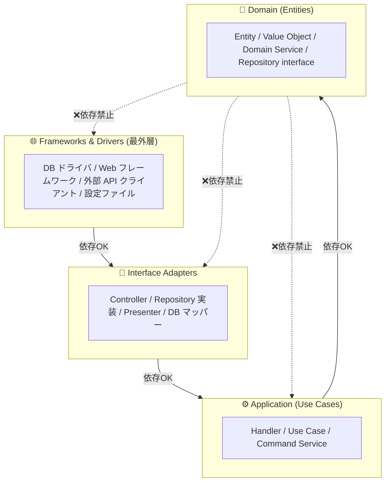
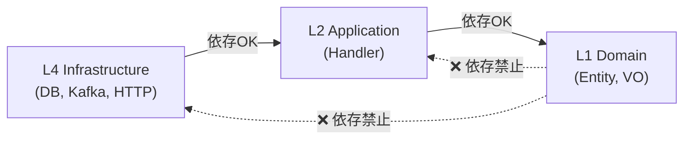
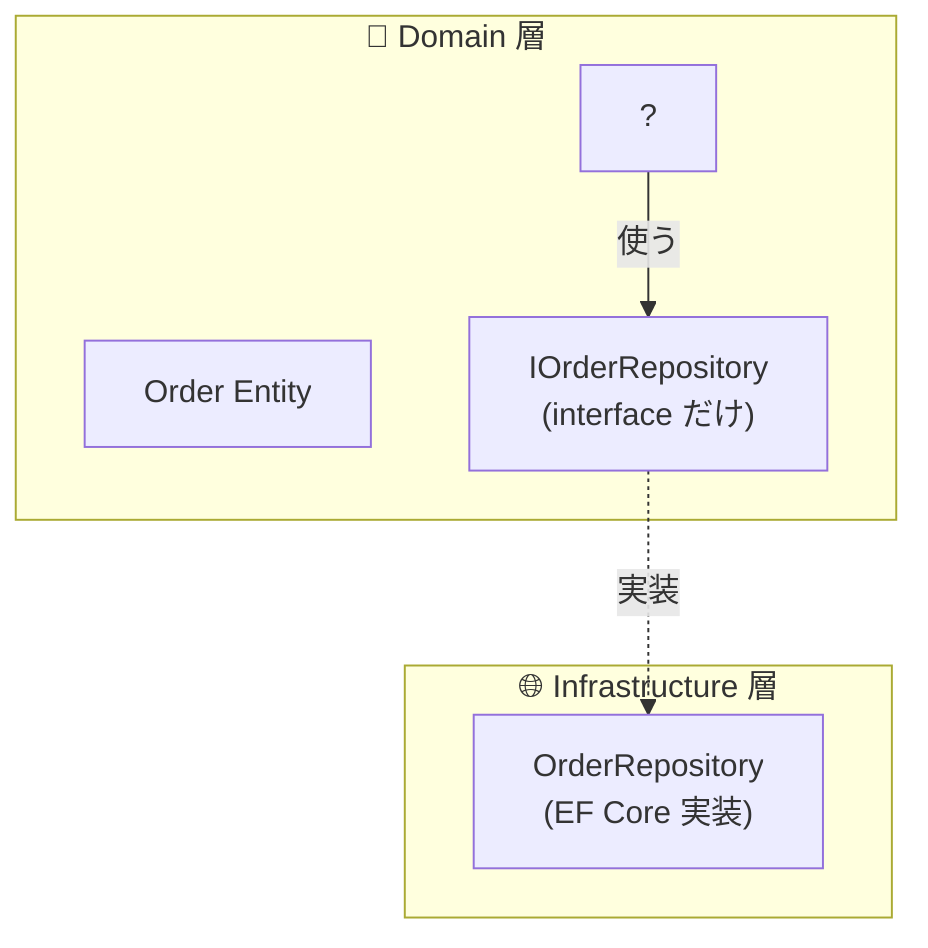
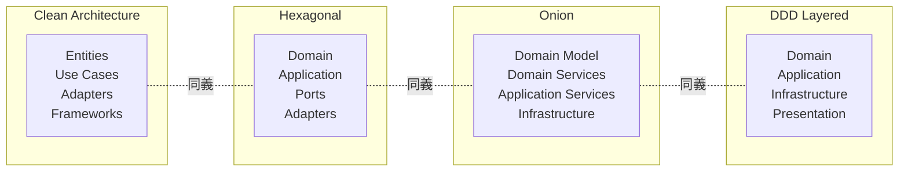

# 第 2 章 — Clean Architecture の最小知識

> **この章のゴール**
> - Clean Architecture が言っていることを **「依存の向きを一方向に揃える」の一行** で説明できるようになる
> - 4 層(Domain / Application / Interface Adapters / Frameworks)の責務を区別できる
> - 「Infrastructure に業務ルールが漏れている」を診断できる

---

## 2.1 Clean Architecture とは何か

Clean Architecture は Robert C. Martin(通称 Uncle Bob)が 2012 年のブログ記事[^cleanarch]、2017 年の同名書籍[^cleanarchbook]で提唱した設計手法だ。原典の同心円図を再掲する。


> *出典: Robert C. Martin, ["The Clean Architecture"](https://blog.cleancoder.com/uncle-bob/2012/08/13/the-clean-architecture.html), 2012-08-13*

[^cleanarch]: Robert C. Martin, ["The Clean Architecture"](https://blog.cleancoder.com/uncle-bob/2012/08/13/the-clean-architecture.html), 2012-08-13. 同心円モデルの原典。
[^cleanarchbook]: Robert C. Martin, *Clean Architecture: A Craftsman's Guide to Software Structure and Design*, Prentice Hall, 2017.

この円が言いたいことは **たった 1 つ** だ。

> **The Dependency Rule: source code dependencies must point only inward.**
> (依存方向は内側だけを指せ)

これ以外のことは全部、この一行を実現するためのテクニックに過ぎない。

---

## 2.2 4 つの層 — 内側から外側へ



### 各層の責務 — 一行で

| 層 | 何が住む | 例(EC) |
|----|----------|--------|
| **L1: Domain** | 業務ルールの本体 — DB や Web を知らない | `Order`, `Money`, `IOrderRepository`(interface) |
| **L2: Application** | 1 ユースケース(注文作成、ステータス更新)のフロー | `CreateOrderHandler`, `UpdateOrderStatusHandler` |
| **L3: Interface Adapters** | 外の世界と中の世界を翻訳する | `OrderController`(HTTP), `OrderRepository`(EF Core 実装) |
| **L4: Frameworks & Drivers** | フレームワークや外部システムそのもの | ASP.NET Core, EF Core, PostgreSQL, Stripe SDK |

### 内側ほど「業務」、外側ほど「技術」

ここで一番大事な感覚は:

> **内側ほど「このシステムは何をしているのか」が書いてある。外側ほど「どうやってそれを実現しているか」が書いてある。**

「EC サイトは注文を受け付ける」は業務本質(L1)。
「注文を PostgreSQL の orders テーブルに INSERT する」は実装詳細(L3-L4)。

業務本質は 10 年経っても変わらないが、実装詳細は 3 年で変わる(SQL → MongoDB → DynamoDB)。
**変化速度の違うものを別の層に置く**。これが Clean Architecture の実利だ[^stability].

[^stability]: Robert C. Martin, *Clean Architecture*, Chapter 14 "Component Coupling". 「安定したものに依存し、変化するものは依存される側に置く」の原則。

---

## 2.3 依存方向のルール(これだけ守る)



### Domain 層は誰にも依存しない

これが Clean Architecture の中心ルールだ。`Order.cs` を開いて、`using` 文を確認してほしい。

```csharp
// ✅ 健全な Order.cs の using
using System;
using System.Collections.Generic;
using MyApp.Domain.Common;  // 同じ Domain 内
// それ以外なし
```

```csharp
// ❌ Domain が外を知っている = 危険信号
using System;
using Microsoft.EntityFrameworkCore;  // ← L4 依存!
using MyApp.Application.Handlers;     // ← L2 依存!
using Stripe;                         // ← L4 依存!
```

`Domain/Order.cs` の `using` に `Microsoft.EntityFrameworkCore` や `Stripe` が並んでいたら、それは設計が壊れているサインだ。

### Repository interface は Domain に置く

「DB アクセスは Domain と別の層なんだから、Domain は Repository を知らないはずでは?」と思うかもしれない。実は逆だ。



**interface は Domain に、実装は Infrastructure に**。これは **Dependency Inversion Principle (DIP)** — SOLID の "D" — の典型適用だ[^dip]。

[^dip]: Robert C. Martin, *Clean Architecture*, Chapter 11 "DIP: The Dependency Inversion Principle". 「上位モジュールも下位モジュールも、抽象に依存せよ。具体に依存するな。」

こうすると:

- Domain は「Order を保存する手段がある」ことしか知らない(`IOrderRepository.AddAsync(order)`)
- Domain は EF Core を知らない。明日 Dapper に変えても Domain は無傷
- テストでは Mock Repository に差し替えられる

---

## 2.4 Clean Architecture の親戚たち

Clean Architecture と本質的に同じことを言っている設計手法は複数ある。**用語が違うだけで言いたいことは同じ**。

| 名称 | 提唱者 | 核となる主張 |
| --- | --- | --- |
| **Clean Architecture**[^cleanarch] | Robert C. Martin (2012) | 同心円・依存は内向き |
| **[Hexagonal Architecture](https://alistair.cockburn.us/hexagonal-architecture/)** (Ports & Adapters)[^hex] | Alistair Cockburn (2005) | 内側に純粋業務、外側にアダプタ |
| **[Onion Architecture](https://jeffreypalermo.com/2008/07/the-onion-architecture-part-1/)**[^onion] | Jeffrey Palermo (2008) | 玉ねぎ状に層を重ねる |
| **DDD のレイヤード**[^evans] | Eric Evans (2003) | Presentation / Application / Domain / Infrastructure |

[^hex]: Alistair Cockburn, [Hexagonal Architecture](https://alistair.cockburn.us/hexagonal-architecture/), 2005. "Ports and Adapters" の別名。
[^onion]: Jeffrey Palermo, [The Onion Architecture: part 1](https://jeffreypalermo.com/2008/07/the-onion-architecture-part-1/), 2008.
[^evans]: Eric Evans, *Domain-Driven Design: Tackling Complexity in the Heart of Software*, Addison-Wesley, 2003. Chapter 4 "Isolating the Domain".



**本書では Clean Architecture の用語を使うが、Hexagonal / Onion / DDD レイヤードのどれを採用していても判定表は同じように使える**。

---

## 2.5 「Infrastructure に業務ルールが漏れている」を診断する

Clean Architecture の最頻出のアンチパターンは **業務ルールの層違い** だ。

### 症状

```csharp
// ❌ Infrastructure 層の Repository 実装に業務ルールが入っている
public class OrderRepository(AppDbContext db) : IOrderRepository
{
    public async Task<Order> GetActiveOrderAsync(string customerId)
    {
        var orders = await db.Orders
            .Where(o => o.CustomerId == customerId)
            .Where(o => o.Status == "Confirmed" || o.Status == "Processing")  // ← 業務判断!
            .Where(o => o.TotalAmount > 0)                                     // ← 業務判断!
            .ToListAsync();

        // 「最新の確定注文を返す」ロジック
        return orders.OrderByDescending(o => o.ConfirmedAt).First();
    }
}
```

「`Status == Confirmed || Processing` を Active とみなす」「`TotalAmount > 0` を有効とみなす」は **業務上の定義**だ。これが Infrastructure 層に書かれていると:

| 問題 | 影響 |
|------|------|
| 同じ判断ロジックが他の Repository、Controller、フロントに転記される | 仕様変更時に全箇所探す羽目になる |
| Domain だけ読んでも「Active な注文とは何か」が分からない | 新メンバが業務を理解できない |
| `OrderStatus.Active` のような型がない → 文字列比較に依存 | typo がコンパイル時に弾けない |

### 直し方 — Specification パターン or Value Object

```csharp
// ✅ 業務ルールを Domain に引き上げる
namespace MyApp.Domain;

public sealed class Order
{
    public OrderStatus Status { get; private set; }
    public Money TotalAmount { get; private set; }

    // 業務ルールを Entity 自身が知る
    public bool IsActive => Status.IsActive && TotalAmount.IsPositive;
}

public sealed record OrderStatus(string Value)
{
    public static readonly OrderStatus Pending    = new("Pending");
    public static readonly OrderStatus Confirmed  = new("Confirmed");
    public static readonly OrderStatus Processing = new("Processing");

    public bool IsActive => this == Confirmed || this == Processing;
}
```

```csharp
// Repository はクエリの組み立てに専念し、業務判断はしない
public async Task<Order?> GetActiveOrderAsync(string customerId)
{
    return (await db.Orders.Where(o => o.CustomerId == customerId).ToListAsync())
        .Where(o => o.IsActive)
        .OrderByDescending(o => o.ConfirmedAt)
        .FirstOrDefault();
}
```

**業務上の概念(Active)は Domain の Entity / VO に住まわせる**。これだけで多くの設計上の問題が解決する。

---

## 2.6 「層を増やすとボイラープレートが増える」への反論

Clean Architecture を初めて適用すると、**ファイル数が 3〜5 倍になる**。よくある反応:

> 「シンプルな CRUD アプリにここまでの層分けは必要?」

これは正当な疑問だ。答えは **「規模・寿命・チームサイズに応じて判断する」**。

| プロジェクトの性質 | Clean Architecture を |
| --- | --- |
| 1 人開発、3 ヶ月で捨てるプロトタイプ | **採用しない**。Anemic で十分。後から直せばいい |
| 1 人開発、PMF 検証中の MVP | **部分採用**。Entity に振る舞いだけ持たせる |
| 3 人以上 × 1 年以上の本番運用 | **採用推奨**。Drift コストの方が大きい |
| 5 人以上 × 3 年以上、複数チーム | **採用必須**。これなしで保守不能 |

本書は **「採用したほうがいい規模」を想定** している。プロトタイプには過剰だ。

> **YAGNI (You Aren't Gonna Need It)**[^yagni] とのバランス: 「将来必要になるかもしれない」だけで層を増やすのは過剰設計。「現に困っている / 困りそうな兆候が出ている」状況で増やす。

[^yagni]: Martin Fowler, [Yagni](https://martinfowler.com/bliki/Yagni.html), 2015. "Always implement things when you actually need them, never when you just foresee that you need them."

---

## 2.7 章末演習

### 演習 2.1 — 層違いを見つける

以下のコードはどの層に書かれていて、何が問題か?

```csharp
// File: backend/Infrastructure/Payment/StripeAdapter.cs
public class StripeAdapter : IPaymentGateway
{
    public async Task<PaymentResult> ChargeAsync(Order order)
    {
        // VIP 顧客は手数料免除
        decimal fee = order.Customer.IsVip ? 0m : order.Total * 0.03m;

        // 大口注文(10 万以上)は分割課金
        if (order.Total > 100000)
        {
            return await ChargeInInstallmentsAsync(order, fee);
        }

        return await stripeClient.ChargeAsync(order.Total + fee);
    }
}
```

### 演習 2.2 — using 文監査

あなたのプロジェクトの `Domain/` フォルダ配下で、以下を実行:

```bash
grep -rn "^using" backend/Domain/ | grep -v "^.*using System" | grep -v "MyApp.Domain"
```

(あるいは TypeScript なら `grep -rn "^import" backend/src/domain/ | grep -v "from '@/domain'"` 相当)

**何件ヒットしたか? Domain 層が外を知っていないか確認しよう。**

### 演習 2.3 — 円を描く

あなたのプロジェクトの主要ファイルを 10 個ピックアップして、Clean Architecture の同心円のどこに配置すべきか紙に描いてみる。違和感のある配置は設計改善の余地がある。

→ 解答は [付録 C](appendix-c-exercises) に。

---

## 2.8 まとめ

- Clean Architecture が言いたいことは **依存方向を内向きに揃える** の一行
- 4 層: **Domain / Application / Interface Adapters / Frameworks**
- 内側ほど業務本質、外側ほど技術詳細。**変化速度の違うものを分離する**
- Domain は誰にも依存しない。Repository interface は Domain に、実装は Infrastructure に(**DIP**)
- 親戚: Hexagonal / Onion / DDD レイヤードは同じことを言っている
- 「Infrastructure に業務ルールが漏れている」は最頻出のアンチパターン

次の章では、Domain 層の中身をどう書くか — DDD の登場人物 6 種類をインストールする。

→ **[第 3 章 DDD の最小知識](03-ddd-minimum)**
