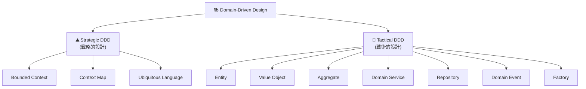
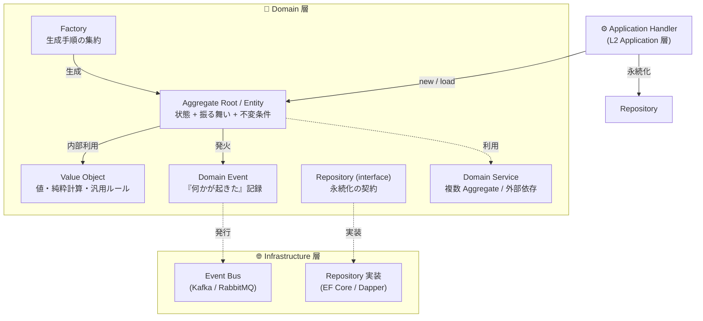
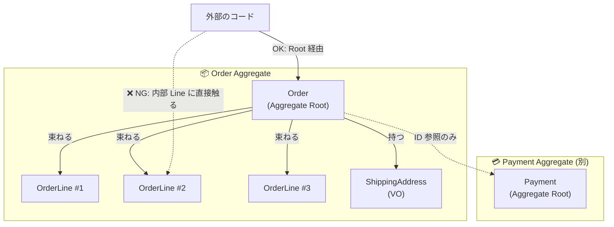
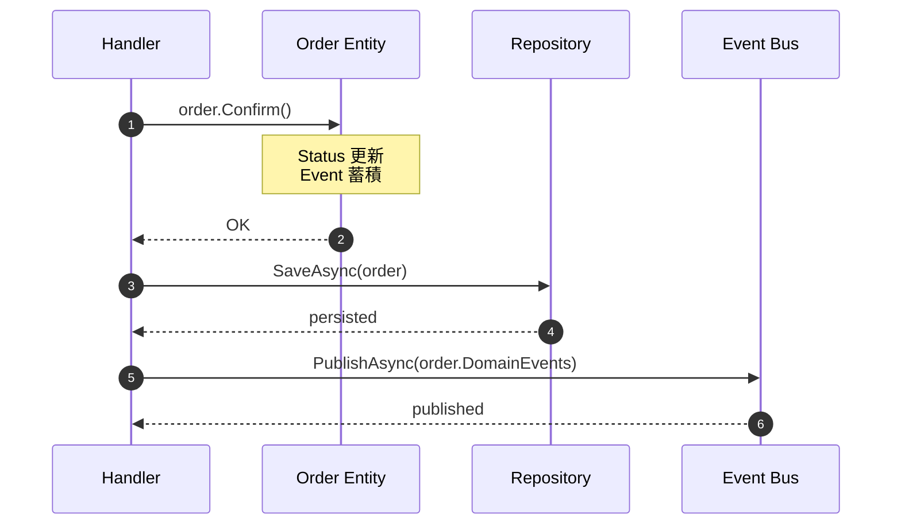
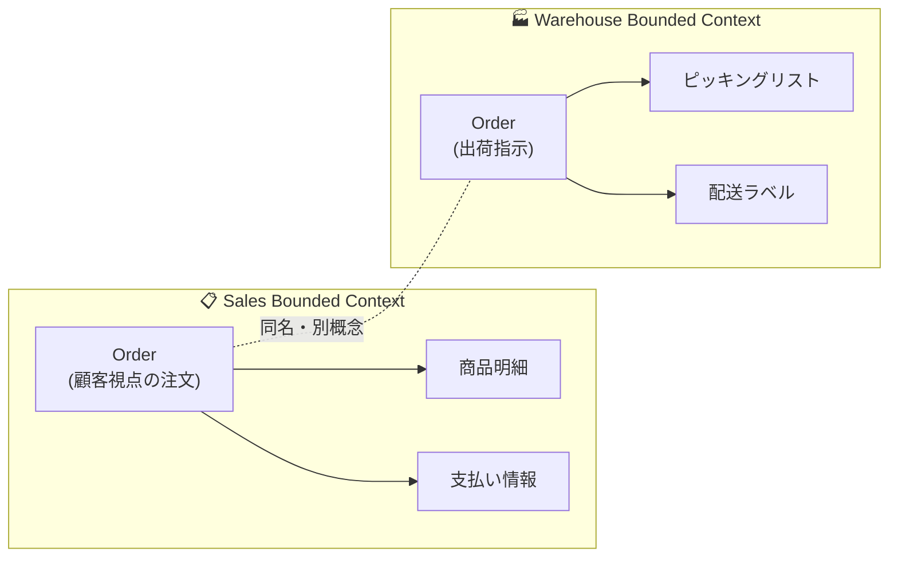

# 第 3 章 — DDD の最小知識

> **この章のゴール**
> - DDD(ドメイン駆動設計) を **「業務概念をそのままコードの型に写す方法論」** の一行で説明できる
> - 6 つの登場人物(Entity / Aggregate / VO / Domain Service / Repository / Domain Event) を区別できる
> - 「ユビキタス言語」が **コードと会話の語彙を一致させる装置** であることを理解する

---

## 3.1 DDD とは何か

DDD (Domain-Driven Design) は Eric Evans が 2003 年の同名書籍[^evans]で体系化した設計方法論だ。後に Vaughn Vernon が *Implementing Domain-Driven Design* (2013) で実装パターンを整理した[^vernon]。

[^evans]: Eric Evans, *Domain-Driven Design: Tackling Complexity in the Heart of Software*, Addison-Wesley, 2003. 「青本」。
[^vernon]: Vaughn Vernon, *Implementing Domain-Driven Design*, Addison-Wesley, 2013. 「赤本」。

DDD の中身は大きく 2 つに分かれる。



- **Strategic DDD**: 「システムをどう分割するか」「チーム間でどう用語を揃えるか」
- **Tactical DDD**: 「Domain 層をどう実装するか」(本書のメインテーマ)

本書は Tactical DDD に集中する。Strategic は別の本に譲る[^strategic]。

[^strategic]: Strategic DDD については Vlad Khononov, *Learning Domain-Driven Design* (O'Reilly, 2021) が読みやすい。

---

## 3.2 6 つの登場人物 — 全体像



各登場人物を **一行 + 例 + どこに住むか** で整理する。

| 登場人物 | 一行で | 例(EC) | 住む層 |
|---------|-------|--------|--------|
| **Entity** | ID で識別され、状態を持ち変化していくもの | `Order`, `Customer` | Domain |
| **Aggregate Root** | 関連 Entity をひと束にした "窓口 Entity" | `Order`(中に `OrderLine` を持つ) | Domain |
| **Value Object** | 値そのものに意味があり、不変・等価 | `Money`, `Sku`, `Address` | Domain |
| **Domain Service** | Entity に置きづらいロジック(複数 Aggregate / 外部依存) | `IInventoryReservation` | Domain (interface) / Infrastructure (実装) |
| **Repository** | 永続化の窓口 | `IOrderRepository` | Domain (interface) / Infrastructure (実装) |
| **Domain Event** | 「何かが起きた」事実 | `OrderConfirmed`, `OrderFulfilled` | Domain |

---

## 3.3 Entity — ID で識別される

**Entity の本質的な性質は「同一性 (identity)」だ**[^entity].

[^entity]: Evans, *Domain-Driven Design*, Chapter 5 "A Model Expressed in Software" — "ENTITIES (also known as REFERENCE OBJECTS)".

```csharp
public sealed class Order
{
    public OrderId Id { get; }            // 同一性を担保する ID
    public OrderStatus Status { get; private set; }
    public Money Total { get; private set; }
    // ...

    public void Confirm() { /* 振る舞い */ }
}
```

**同じ ID なら同じもの。属性が違っても同じもの**。

```csharp
var orderA = new Order(OrderId.Of("ORD-001"), Money.Yen(1000));
var orderB = new Order(OrderId.Of("ORD-001"), Money.Yen(2000));  // 金額が違う

orderA.Equals(orderB);  // true — 同じ ID なので同じ Order(時間軸で変化したもの)
```

これは **Value Object と対照的**だ。VO は「同じ値なら同じもの」、Entity は「同じ ID なら同じもの」。

### Entity を設計するときの基本

1. **ID を明示的に表現する** — `string` ではなく `OrderId` のような専用型(Strongly-Typed ID)
2. **public setter を避ける** — 状態変更はメソッド経由のみ(`Confirm()`, `Cancel()`)
3. **不変条件 (Invariant) を持つ** — 「Status が Cancelled の Order は Total が変更できない」のような条件は Entity 自身が守る

---

## 3.4 Value Object (VO) — 値で識別される

**VO の本質的な性質は「値等価 (value equality)」と「不変性 (immutability)」だ**[^vo].

[^vo]: Evans, *Domain-Driven Design*, Chapter 5 "A Model Expressed in Software" — "VALUE OBJECTS". Martin Fowler, [ValueObject](https://martinfowler.com/bliki/ValueObject.html).

```csharp
public sealed record Money(decimal Amount, string Currency)
{
    public Money Add(Money other)
    {
        if (Currency != other.Currency)
            throw new InvalidOperationException("通貨が異なります");
        return this with { Amount = Amount + other.Amount };
    }
}

var a = new Money(1000m, "JPY");
var b = new Money(1000m, "JPY");
a.Equals(b);  // true — 同じ値だから同じ
```

### VO の典型例(EC ドメイン)

| VO | 表す概念 | 内部に持つルール |
|----|---------|----------------|
| `Money` | 金額 + 通貨 | 加算は同通貨のみ、負値禁止 |
| `Sku` | 商品コード | 8 桁英数字、prefix で種別判定 |
| `Address` | 住所 | 郵便番号 7 桁、都道府県マスタ |
| `Email` | メールアドレス | RFC 5322 形式、長さ上限 |
| `OrderId` | 注文 ID | `ORD-` prefix + 9 桁数字 |

### VO の威力 — Primitive Obsession の解消

VO を使わないと、こんな関数シグネチャになる:

```csharp
// ❌ Primitive Obsession
public Order CreateOrder(string customerId, string sku, decimal price, string currency, string addressZip, string addressLine);

// ✅ VO を使う
public Order CreateOrder(CustomerId customerId, Sku sku, Money price, Address shipTo);
```

引数の意味が型で読み取れる。引数の順番を間違えてもコンパイル時に弾ける。**ドメインの語彙がそのまま型として現れる**。

詳細は [第 7 章](07-value-object) で。

---

## 3.5 Aggregate — Entity を束ねる "境界線"

**Aggregate は、データの整合性を保証する境界線だ**[^aggregate].

[^aggregate]: Evans, *Domain-Driven Design*, Chapter 6 "The Life Cycle of a Domain Object" — "AGGREGATES". Vernon, *Implementing DDD*, Chapter 10 "Aggregates" — 実装上の指針が詳しい。



### 4 つのルール(Vernon の "Effective Aggregate Design")[^vernon-aggregate]

[^vernon-aggregate]: Vaughn Vernon, "Effective Aggregate Design" (3 part series), 2011. https://www.dddcommunity.org/library/vernon_2011/ — Aggregate 設計の事実上の標準ガイド。

1. **小さく保つ** — 1 Aggregate に大量の Entity を詰めない
2. **Root 経由でのみアクセス** — 外部からは `order.AddLine(...)` のみ、`order.Lines[0].Quantity = 5` 禁止
3. **トランザクション境界 = Aggregate 境界** — 1 トランザクションで 1 Aggregate のみ更新
4. **Aggregate 間は ID 参照** — `Order` が `Customer` オブジェクトを直接持たない。`CustomerId` だけ持つ

詳細は [第 9 章 Aggregate 境界の引き方](09-aggregate-boundary) で。

---

## 3.6 Domain Service — Entity に置きづらい業務ロジック

**Entity に置けないが、業務ルールであることに変わりないロジック**は Domain Service に置く[^domain-service]。

[^domain-service]: Evans, *Domain-Driven Design*, Chapter 5 — "SERVICES". 「重要なドメイン操作で、ENTITY や VALUE OBJECT の自然な責務に属さないものがある。」

### 「Entity に置けない」状況

| パターン | 例 |
| --- | --- |
| 複数 Aggregate にまたがる | `IInventoryReservation.Reserve(order, productCatalog)` |
| 外部依存(API / マスタ参照)が必要 | `ITaxRateResolver.GetRate(region, orderDate)` |
| ステートレスな計算式の集合 | `IShippingFeeCalculator.Calculate(order)` |

### interface は Domain、実装は Infrastructure

```csharp
// Domain 層
namespace MyApp.Domain.Services;
public interface IInventoryReservation
{
    Task<ReservationResult> ReserveAsync(Order order, CancellationToken ct);
}

// Infrastructure 層
namespace MyApp.Infrastructure.Inventory;
public class InventoryReservationService(IInventoryApi api) : IInventoryReservation
{
    public async Task<ReservationResult> ReserveAsync(Order order, CancellationToken ct)
    {
        // 在庫 API 呼び出し
    }
}
```

詳細は [第 8 章 Domain Service と Strategy](08-domain-service-strategy) で。

---

## 3.7 Repository — 永続化の窓口

**Repository は Entity のコレクションのように振る舞う interface だ**[^repo].

[^repo]: Martin Fowler, [Repository pattern](https://martinfowler.com/eaaCatalog/repository.html), *Patterns of Enterprise Application Architecture*, 2002. Evans, *Domain-Driven Design*, Chapter 6 "REPOSITORIES".

```csharp
// Domain 層
public interface IOrderRepository
{
    Task<Order?> GetByIdAsync(OrderId id, CancellationToken ct);
    Task AddAsync(Order order, CancellationToken ct);
    Task<IReadOnlyList<Order>> FindByCustomerAsync(CustomerId customerId, CancellationToken ct);
}

// 利用側 — Handler
var order = await orderRepository.GetByIdAsync(cmd.OrderId, ct);
order.Confirm();
await orderRepository.AddAsync(order, ct);  // または unit of work で SaveChanges
```

### Repository が "やってはいけない" こと

- ❌ クエリビルダーを露出する(`IQueryable<Order>` を返す)
- ❌ DTO を返す(Aggregate を返すべき)
- ❌ 業務ロジックを書く(`GetActiveOrders` の "Active" の判断は Domain に)

詳細は [第 11 章 Repository 設計の落とし穴](11-repository-design) で。

---

## 3.8 Domain Event — 「何かが起きた」事実

**Domain Event は、Entity の状態が変わった瞬間に発火する記録だ**[^event].

[^event]: Martin Fowler, [DomainEvent](https://martinfowler.com/eaaDev/DomainEvent.html), 2005. Vernon, *Implementing DDD*, Chapter 8 "Domain Events".

```csharp
public sealed record OrderConfirmed(OrderId Id, CustomerId CustomerId, DateTime At) : IDomainEvent;

public sealed class Order
{
    private readonly List<IDomainEvent> _events = new();
    public IReadOnlyList<IDomainEvent> DomainEvents => _events;

    public void Confirm()
    {
        if (Status is not OrderStatus.Pending) throw new InvalidStateTransitionException();
        Status = OrderStatus.Confirmed;
        ConfirmedAt = DateTime.UtcNow;
        _events.Add(new OrderConfirmed(Id, CustomerId, ConfirmedAt.Value));
    }
}
```



### Domain Event の典型用途

- **副作用の非同期化**: 「注文確定 → メール送信」をハンドラから切り離す
- **Aggregate 間の結合疎結合化**: `Order` が `Payment` を知らずに「請求を作って」と発火するだけ
- **監査ログ**: 「いつ・誰が・何をした」が型として残る

---

## 3.9 Factory — 生成手順を集約する

**コンストラクタが複雑になりすぎたとき、生成手順を別オブジェクトに切り出す**[^factory].

[^factory]: Evans, *Domain-Driven Design*, Chapter 6 "FACTORIES". Gamma et al., *Design Patterns* (1994) — Factory Method の原典。

```csharp
public sealed class OrderFactory(IPricingPolicy pricing, ICustomerRepository customers)
{
    public async Task<Order> CreateAsync(CreateOrderCommand cmd, CancellationToken ct)
    {
        var customer = await customers.GetByIdAsync(cmd.CustomerId, ct)
            ?? throw new CustomerNotFoundException(cmd.CustomerId);

        var lines = cmd.Items.Select(i => OrderLine.Create(i.Sku, i.Quantity, pricing.PriceOf(i.Sku))).ToList();
        var total = lines.Aggregate(Money.Zero("JPY"), (acc, l) => acc.Add(l.Subtotal));

        return Order.NewPending(customer.Id, lines, total, cmd.ShipTo);
    }
}
```

**Factory が必要な兆候**:
- コンストラクタ引数が 5 個以上
- コンストラクタの中で外部リソース(DB / API) を呼びたくなる
- 同じ Entity を異なる初期状態で作るパターンが 2 つ以上ある

---

## 3.10 ユビキタス言語 — コードと会話の語彙を一致させる

DDD で **最も大事なのに最もスキップされがち** な概念が **ユビキタス言語 (Ubiquitous Language)** だ[^ubiquitous]。

[^ubiquitous]: Evans, *Domain-Driven Design*, Chapter 2 "Communication and the Use of Language". 「ユビキタス言語(普遍言語)は、すべての関係者が共有する語彙。コードもこれに従う。」

### 何を意味するか

- ドメイン専門家(EC 事業の運営担当)と開発者が、**同じ単語を同じ意味で使う**
- その単語が、**コードの中の型名・メソッド名にそのまま現れる**

### 悪い例

- 業務側は「**確定済み注文**」と呼んでいる
- コードでは `ConfirmedOrder` か?と思いきや `ProcessedOrder` だったり `ActiveOrder` だったりする
- 会議で「確定済みって…どの状態のこと?」と毎回確認している

### 良い例

- 業務側「確定済み注文」 → コード `OrderStatus.Confirmed`
- 業務側「速達」 → コード `ShippingType.Express`
- 業務側「VIP 顧客」 → コード `MembershipTier.Vip`

**会話で出てきた業務用語は、すべて型名にする**。これが Anemic Domain Model を防ぐ最も基本的な技術だ。

### Bounded Context — 用語の有効範囲

同じ「Order」でも、文脈が違えば意味が違う。



**同じ "Order" でも、Sales Bounded Context と Warehouse Bounded Context では別物**。これを混ぜると Aggregate が肥大化する。

---

## 3.11 章末演習

### 演習 3.1 — 6 つの登場人物を分類

以下はそれぞれ Entity / VO / Domain Service / Repository / Domain Event のどれか?

```csharp
1. public sealed record OrderId(string Value);
2. public class Order { public OrderId Id { get; } /* ... */ }
3. public interface IOrderRepository { Task<Order?> GetByIdAsync(OrderId id); }
4. public sealed record OrderShipped(OrderId Id, DateTime At) : IDomainEvent;
5. public interface ITaxRateResolver { decimal GetRate(Address shipTo); }
6. public sealed record Money(decimal Amount, string Currency);
```

### 演習 3.2 — ユビキタス言語の発掘

あなたのプロジェクトの仕様書 or Slack の会話で、過去 1 週間に出てきた **業務用語** をリストアップしてみる(目安 10 個)。その用語が、コードの中で **同じ単語の型名やメソッド名** として存在するか確認する。

| 業務用語 | コード上の型名 | 一致? |
| --- | --- | --- |
| 確定済み注文 | ? | ? |
| 速達 | ? | ? |
| ... | ... | ... |

ヒットしない単語が多いほど、ユビキタス言語が機能していない兆候。

### 演習 3.3 — Aggregate を 1 つ描いてみる

あなたのプロジェクトで、最も中心的な Aggregate を 1 つ選び、Mermaid で図を描いてみる。Root は何か、内部に持つ Entity は何か、外側との関係はどうなっているか。

→ 解答は [付録 C](appendix-c-exercises) に。

---

## 3.12 まとめ

- DDD = **業務概念をそのままコードの型に写す方法論**
- 6 つの登場人物: **Entity / Aggregate / VO / Domain Service / Repository / Domain Event**
- Entity は **ID で同一**、VO は **値で同一**
- Aggregate は **整合性を保証する境界線**(詳細は第 9 章)
- ユビキタス言語: **業務用語 = 型名** にする
- Domain Service / Repository は **interface を Domain に、実装を Infrastructure に**

次の章では、これらの登場人物を使って「Rich」に書くか「Anemic」に書くかの分岐点を見る。

→ **[第 4 章 Rich Domain Model vs Anemic Domain Model](04-rich-vs-anemic)**
