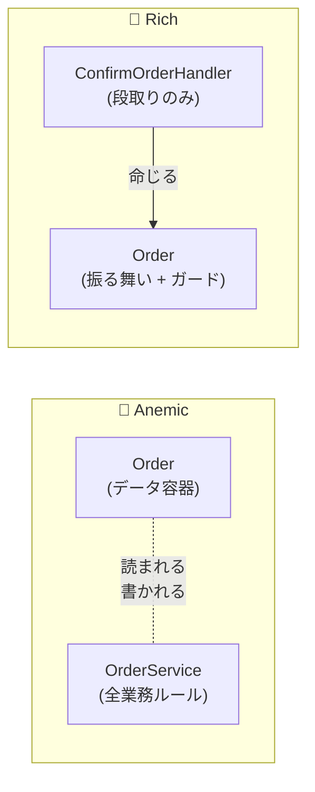

# 第 4 章 — Rich Domain Model vs Anemic Domain Model

> **この章のゴール**
> - Anemic Domain Model がなぜアンチパターンなのかを **歴史的経緯と一緒に** 理解する
> - Rich Domain Model のメリットを 5 つの観点(不変条件・変更の局所性・発見可能性・テスト容易性・型安全性) で説明できる
> - 「自分のコードは Anemic か Rich か」を即座に診断できる

---

## 4.1 用語の起源 — Martin Fowler の警告

Anemic Domain Model という言葉は Martin Fowler が 2003 年のブログ記事で命名した[^anemic-origin]。

[^anemic-origin]: Martin Fowler, [AnemicDomainModel](https://martinfowler.com/bliki/AnemicDomainModel.html), 2003-11-25. 文中で Eric Evans との議論を引用。

> The fundamental horror of this anti-pattern is that it's so contrary to the basic idea of object-oriented design; which is to combine data and process together.
> (このアンチパターンの根本的な恐ろしさは、オブジェクト指向設計の基本思想 — データと処理を結合する — に真っ向から反していることだ。)
> — Martin Fowler, 2003

Fowler は当時の Java エンタープライズ開発(EJB 時代)を観察して、

- 「Bean(データ容器)」と「Service(処理)」が完全に分離している
- 結果として、「業務ルール」がどこにあるのか分からなくなる

という現象を指摘した。これが 23 年経った 2026 年の現在でも、C# / TypeScript の現場で **再生産され続けている**。

---

## 4.2 同じドメインの 2 つの実装

「注文を確定する」という業務操作を、両方のスタイルで実装する。

### Anemic 版

```csharp
// === Anemic Domain ===
public class Order
{
    public string Id { get; set; }
    public string Status { get; set; }
    public decimal Total { get; set; }
    public DateTime? ConfirmedAt { get; set; }
    public string CustomerId { get; set; }
    // ↑ プロパティ並び。メソッド 0 個。public setter のオンパレード。
}

public class OrderService(IOrderRepository repo, IUnitOfWork uow)
{
    public async Task ConfirmOrderAsync(string orderId, CancellationToken ct)
    {
        var order = await repo.GetByIdAsync(orderId, ct);

        if (order.Status != "Pending")
            throw new InvalidOperationException("Pending じゃないと確定できない");
        if (order.Total <= 0)
            throw new InvalidOperationException("金額がおかしい");

        order.Status = "Confirmed";
        order.ConfirmedAt = DateTime.UtcNow;

        await uow.SaveChangesAsync(ct);
    }
}
```

### Rich 版

```csharp
// === Rich Domain ===
public sealed class Order
{
    public OrderId Id { get; }
    public OrderStatus Status { get; private set; }
    public Money Total { get; private set; }
    public DateTime? ConfirmedAt { get; private set; }
    public CustomerId CustomerId { get; }

    public void Confirm()
    {
        if (Status is not OrderStatus.Pending)
            throw new InvalidStateTransitionException(Status, OrderStatus.Confirmed);
        if (!Total.IsPositive)
            throw new DomainException("金額が 0 以下の Order は確定できない");

        Status = OrderStatus.Confirmed;
        ConfirmedAt = DateTime.UtcNow;
        _events.Add(new OrderConfirmed(Id, CustomerId, ConfirmedAt.Value));
    }
}

public class ConfirmOrderHandler(IOrderRepository repo, IUnitOfWork uow)
{
    public async Task HandleAsync(ConfirmOrderCommand cmd, CancellationToken ct)
    {
        var order = await repo.GetByIdAsync(cmd.OrderId, ct)
            ?? throw new OrderNotFoundException(cmd.OrderId);

        order.Confirm();  // ← これだけ

        await uow.SaveChangesAsync(ct);
    }
}
```

---

## 4.3 何が違うか — 5 つの観点



| 観点 | Anemic | Rich |
| --- | --- | --- |
| **不変条件の保護** | Service ごとに散らばる → 漏れる | Entity が独占 → 破れない |
| **変更の局所性** | Service が複数あれば全部直す | Entity 1 箇所 |
| **発見可能性** | 関連 Service を grep 探索 | `Order` のメソッド一覧で完結 |
| **テスト容易性** | Service の依存(repo, uow, ...)を全部 mock | Entity を `new` してメソッド呼ぶだけ |
| **型安全性** | string / decimal が裸 → typo が通る | OrderStatus / Money 型でコンパイル時に弾く |

### 観点 1 — 不変条件の保護

「Pending じゃないと確定できない」という不変条件を、誰が守っているか。

**Anemic**: `OrderService.ConfirmOrderAsync` が守っている。しかし `RefundOrderService`、`CancelOrderService`、`Admin/OrdersController` も独自に同じチェックを書いてしまう。**3 箇所のうち 1 箇所が忘れたらバグる**。

**Rich**: `Order.Confirm()` 1 箇所だけ。**誰が呼んでも同じガードを通る**。

### 観点 2 — 変更の局所性

仕様変更:「Pending OR Reserved の状態から Confirmed に遷移可能にする」が来たとき。

**Anemic**: `if (order.Status != "Pending")` を grep して全箇所探す。10 箇所あったら 10 箇所修正する。
**Rich**: `Order.Confirm()` のガード 1 箇所だけ修正する。

### 観点 3 — 発見可能性

新メンバが「Order に対してどんな操作ができるか?」を知りたいとき。

**Anemic**: `OrderService`, `OrderHandler`, `OrderController` を全部開いて、メソッドリストを目で追う。**そもそも操作が何個あるか分からない**。

**Rich**: IDE で `Order.` と打てば、可能な操作が IntelliSense にすべて出てくる。

```text
Order.
├─ Confirm()
├─ Cancel(string reason)
├─ MarkAsFulfilled(string actorId)
├─ MarkAsFailed(string actorId, string reason)
├─ AddLine(OrderLine line)
└─ ApplyDiscount(Money discount)
```

**Order のクラスを開く = 業務ドメインの目次を読むことになる**。

### 観点 4 — テスト容易性

「Pending じゃないと確定できない」を検証するテストを書きたい。

**Anemic**:
```csharp
// 大量の mock セットアップが必要
var repo = new Mock<IOrderRepository>();
var uow = new Mock<IUnitOfWork>();
repo.Setup(r => r.GetByIdAsync(...)).ReturnsAsync(new Order { Status = "Confirmed" });
var service = new OrderService(repo.Object, uow.Object);

await Assert.ThrowsAsync<InvalidOperationException>(() => service.ConfirmOrderAsync("ORD-001"));
```

**Rich**:
```csharp
// mock 不要、Entity を new するだけ
var order = OrderTestFactory.CreateConfirmed();
Assert.Throws<InvalidStateTransitionException>(() => order.Confirm());
```

**Rich Model のテストコードは Anemic の半分以下になる**。これが最大の実利と言ってよい。

### 観点 5 — 型安全性

```csharp
// Anemic
order.Status = "Confimed";  // typo がコンパイル時に通る!本番でバグる
order.Total = -1000m;        // 負値を代入できてしまう

// Rich
order.Status = OrderStatus.Confimed;  // ❌ コンパイルエラー(typo)
order.Total = Money.Yen(-1000m);       // Money のコンストラクタで弾く
```

C# / TypeScript の型システムは、こうしたタイポを **コンパイル時に検出する能力** を持っているのに、Anemic はそれを捨てている。

---

## 4.4 Anemic がなぜ蔓延するのか — 4 つの引力

「Rich のほうがいい」のが分かっているのに、現場では Anemic が量産される。なぜか。

### 引力 1 — チュートリアルの大半が Anemic

Microsoft 公式 ASP.NET Core チュートリアル、多くの YouTube 動画、Udemy 講座 — **入門教材の 8 割が Anemic で書かれている**。新人エンジニアが最初に出会うのは Anemic なので、それが「普通」になる。

### 引力 2 — ORM が Anemic を誘導する

Entity Framework Core も Prisma も、**「Entity = データクラス」** という前提でドキュメントを書いている。プロパティに `[Required]` 属性を付けるくらいで、振る舞いを持たせる例は出てこない。

### 引力 3 — レイヤード設計の誤解

「Controller → Service → Repository」という 3 層構成を教わると、業務ロジックは **どうしても Service に入りたがる**。Entity に振る舞いを持たせるという発想自体が湧かない。

### 引力 4 — 初期コストが Anemic のほうが低い

Rich Model は最初の Entity 設計に時間がかかる。「とりあえず動かす」フェーズでは Anemic が圧倒的に早い。**問題は 6 ヶ月後** に顕在化する。第 1 章で見た「半年で 30 行 → 400 行」がこれ。

---

## 4.5 「Rich = 過剰設計」への反論

Anemic 派の典型的な反論を 3 つ取り上げる。

### 反論 1 — 「うちは CRUD だから Anemic で十分」

**部分的に正しい**。本当に CRUD(取得・登録・更新・削除のみで業務ルールがない)なら、Rich にする必要はない。

しかし「CRUD だから」と言っているシステムの大半は、よく観察すると **業務ルールが Controller や Service に散らばっている**。「これって CRUD だっけ?」と聞きながらコードを書いてみるとよい。

### 反論 2 — 「Rich にするとコード量が増える」

**増えない**。コード量は **同じ** か **減る**ことが多い。例えば 4.2 節の Rich 版と Anemic 版、行数を数えると Rich のほうが少ない(Handler が痩せたので)。

### 反論 3 — 「ORM と相性が悪い」

これは古い説。EF Core は `private set` でもマッピングできるし、コンストラクタを使ったマッピングもサポートしている[^efcore]。Prisma は Entity が振る舞いを持つことを妨げない(Generated type を内部に保持する設計にすれば良い)。

[^efcore]: Microsoft Learn, [Backing Fields - EF Core](https://learn.microsoft.com/en-us/ef/core/modeling/backing-field). EF Core は private setter / backing field を完全にサポートする。

---

## 4.6 Rich Domain Model に向かないケース

公平のために、Rich が向かない状況も書く。

| 状況 | Anemic でいい理由 |
| --- | --- |
| プロトタイプ(3 ヶ月で捨てる) | 投資回収できない |
| Read-only な集計ビュー | 振る舞いが存在しない |
| Event Sourcing の Read Model | 状態の "現在値スナップショット" であり、変更操作がない |
| マイクロサービスの薄い BFF | ロジックは下流サービスに置く |
| 純粋なデータ移行スクリプト | 1 回限りの処理 |

**Rich は「業務ロジックが集中している領域」に向く。データの単純な転送・表示には Anemic で良い**。

---

## 4.7 診断 — あなたの Order は何点?

下の質問に Yes/No で答えて、点数を計算する。

| 質問 | Yes なら |
| --- | --- |
| `Order` クラスに public な振る舞いメソッド(動詞)が 1 個以上あるか? | +2 |
| `order.Status = "Confirmed"` のような外部書き換えが禁止されているか?(`private set` か `init` のみ) | +2 |
| `OrderStatus` は string ではなく enum か専用型か? | +1 |
| `Total` などの金額は `decimal` ではなく `Money` 型か? | +1 |
| Entity の不変条件をテストする単体テストが存在するか?(`Pending じゃないと確定できない` 等) | +2 |
| Entity の状態遷移を Mermaid 図にできるか?(描いて答えがすぐ出る) | +1 |
| Entity に "状態を聞く if" を Handler / Service が書いていないか?(`if (order.Status == "X")` を grep して 0 件) | +1 |

**合計 10 点**

| 点数 | 診断 |
| --- | --- |
| 0-3 | 重度の Anemic。本書を読み終えてからリファクタを始める価値あり |
| 4-6 | 中度の Anemic。痛みが出始めている。第 6-9 章を重点的に |
| 7-8 | Rich 寄り。あと少し |
| 9-10 | Rich Domain Model。本書を読まなくてもいい(が、第 11-14 章は読む価値あり) |

---

## 4.8 章末演習

### 演習 4.1 — Anemic を Rich に書き換える

以下の Anemic コードを Rich に書き換えよ。ヒント: `RegisterCustomer` メソッドを `Customer` Entity に持たせる。

```csharp
// Before
public class Customer
{
    public string Id { get; set; }
    public string Email { get; set; }
    public bool IsActive { get; set; }
    public DateTime? RegisteredAt { get; set; }
}

public class CustomerService(ICustomerRepository repo)
{
    public async Task RegisterAsync(string id, string email, CancellationToken ct)
    {
        var customer = new Customer { Id = id, Email = email, IsActive = false };

        if (!email.Contains("@"))
            throw new ArgumentException("invalid email");

        customer.IsActive = true;
        customer.RegisteredAt = DateTime.UtcNow;

        await repo.AddAsync(customer, ct);
    }
}
```

### 演習 4.2 — 診断点数を出す

あなたのプロジェクトの中心 Entity 1 つを選び、4.7 節の診断で点数を出してみる。点数が低い項目を改善する 1 PR を計画する。

### 演習 4.3 — 「振る舞いのないクラス」を grep する

```bash
# C# の場合: メソッド 0 個のクラスを探す
find . -name "*.cs" -exec sh -c 'count=$(grep -c "public.*(" "$1" 2>/dev/null); [ "$count" -lt 2 ] && echo "$1: $count methods"' _ {} \;
```

該当した Entity / Domain クラスをリストアップし、振る舞いを持たせる候補を 3 個ピックアップ。

→ 解答は [付録 C](appendix-c-exercises) に。

---

## 4.9 まとめ

- **Anemic Domain Model** = データ容器 + 外部 Service という分離パターン。Martin Fowler が明示的にアンチパターンと位置づけ
- **Rich Domain Model** = Entity に状態と振る舞いを集中させる設計
- 5 つの観点 — **不変条件・変更の局所性・発見可能性・テスト容易性・型安全性** — でほぼ Rich が優位
- ただし **プロトタイプ・Read-only ビュー・Event Sourcing Read Model** などは Anemic でいい
- 診断は **「振る舞いメソッドがあるか + public setter が禁止されているか」** で 7 割わかる

次の章では、本書の心臓部 — ロジックの居場所判定表を出す。

→ **[第 5 章 ロジックの居場所判定表](05-judgment-table)**
