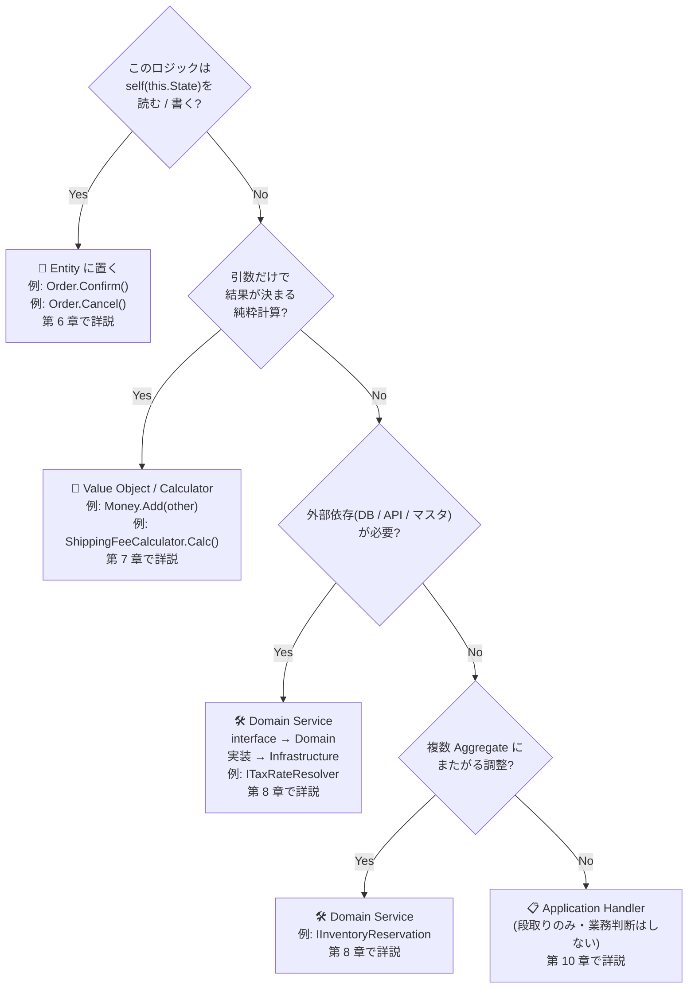

# 第 5 章 — ロジックの居場所判定表(本書の心臓部)

> **この章のゴール**
> - 4 つの質問で「このロジックはどこに置くか」を機械的に判定できるようになる
> - Entity / VO / Domain Service / Application Handler の責務境界が言える
> - 「Domain Service と Application Handler どっちに置くか」の混乱を解消する

この章は **本書の最も重要な 1 ページ** だ。第 6 章以降のすべての判断は、この章の判定表に立ち返って行う。**ここだけは読み返せるようにブックマーク推奨**。

---

## 5.1 判定表(決定木)



### 表で再掲

| このロジックは… | 置き場所 | EC の例 | 詳説 |
| --- | --- | --- | --- |
| `this.State` を読む / 変える、自身の不変条件を守る | **Entity** ✅ | `Order.Confirm()`, `Order.Cancel()` | [Ch6](06-entity-state-transition) |
| 引数だけで結果が決まる純粋計算(状態無関係) | **Value Object / Calculator** | `Money.Add()`, `ShippingFeeCalculator` | [Ch7](07-value-object) |
| 通貨・商品コードなど **型に付随する汎用ルール** | **Value Object** | `Money.Round()`, `Sku.IsDigital` | [Ch7](07-value-object) |
| 複数 Aggregate にまたがる調整 | **Domain Service** | `IInventoryReservation` | [Ch8](08-domain-service-strategy) |
| 外部依存(DB / API / マスタ参照) が必要 | **Domain Service** | `ITaxRateResolver` | [Ch8](08-domain-service-strategy) |
| Command → Entity 呼出 → 永続化 → 通知 の **全体フロー** | **Application Handler** | `CreateOrderHandler` | [Ch10](10-handler-decomposition) |

---

## 5.2 4 つの質問を 1 つずつ掘り下げる

### Q1 — 「self を読む / 書く?」

```csharp
// ✅ Yes — self を触っている。Entity に置く
public void Confirm()
{
    if (this.Status is not OrderStatus.Pending) throw new InvalidStateTransitionException();
    this.Status = OrderStatus.Confirmed;       // ← self を書き換え
    this.ConfirmedAt = DateTime.UtcNow;
}

// ❌ Yes に見えるが、実は自身の状態を読まずに計算だけしている — VO 候補
public Money DiscountFor(Money price, decimal rate)
{
    return new Money(price.Amount * (1 - rate), price.Currency);
    // self の状態を一切読んでいない → 純粋計算
}
```

判定の仕方: **メソッド本体で `this.` が何回登場するかを数える**。

- 多い(状態を読む / 書く)→ Entity
- 0 個 → Entity の中に置く理由がない。VO か Domain Service か Handler

### Q2 — 「引数だけで結果が決まる純粋計算?」

```csharp
// ✅ Yes — 引数だけで決まる純粋計算 → VO に置く
public sealed record Money(decimal Amount, string Currency)
{
    public Money Add(Money other)
    {
        if (Currency != other.Currency) throw new InvalidOperationException();
        return new Money(Amount + other.Amount, Currency);
    }
}

// ✅ Yes — 純粋計算だが汎用的すぎる → 専用 Calculator
public class ShippingFeeCalculator
{
    public Money Calculate(Region region, decimal weight)
    {
        return region switch
        {
            Region.Tokyo  => weight > 10 ? Money.Yen(2000) : Money.Yen(800),
            Region.Osaka  => weight > 10 ? Money.Yen(2500) : Money.Yen(1000),
            _ => throw new ArgumentException("unknown region")
        };
    }
}
```

判定の仕方:

- **状態を持たない**(`private` フィールドが 0 個)
- **同じ引数を渡せば同じ結果を返す**(冪等性)
- **外部依存が存在しない**(DB / API を呼ばない)

3 つ全部 Yes なら純粋計算 = VO / Calculator。

### Q3 — 「外部依存が必要?」

```csharp
// ✅ Yes — DB マスタ参照が必要 → Domain Service
public interface ITaxRateResolver
{
    Task<decimal> GetRateAsync(Region shipTo, DateTime orderDate, CancellationToken ct);
}

// Infrastructure 層に実装
public class TaxRateResolver(AppDbContext db) : ITaxRateResolver
{
    public async Task<decimal> GetRateAsync(Region shipTo, DateTime orderDate, CancellationToken ct)
    {
        var rate = await db.TaxRates
            .Where(r => r.Region == shipTo && r.EffectiveFrom <= orderDate)
            .OrderByDescending(r => r.EffectiveFrom)
            .FirstAsync(ct);
        return rate.Rate;
    }
}
```

**外部依存の代表例**:

| 依存先 | 例 |
| --- | --- |
| DB マスタ参照 | 税率・通貨コード・国コードなど時系列でも変わる業務マスタ |
| 外部 API | 在庫サービス・配送業者・支払いゲートウェイ |
| メッセージング | Kafka / RabbitMQ への発行 |
| ファイル / ストレージ | S3 / GCS / ローカルファイル |
| 時刻 / 乱数 | `DateTime.UtcNow`, `Random` |

時刻もリストに入っていることに注意。**`DateTime.UtcNow` は外部依存** だ(テストで時間を制御したいので)[^clock]。

[^clock]: Mark Seemann, [Time as a Value Object](https://blog.ploeh.dk/2013/10/23/mocks-for-commands-stubs-for-queries/) など。`IClock` interface を Domain に置き、`SystemClock` を Infrastructure に置くのが定石。

### Q4 — 「複数 Aggregate にまたがる調整?」

```csharp
// ✅ Yes — Order と Product Catalog という 2 Aggregate にまたがる調整 → Domain Service
public interface IInventoryReservation
{
    Task<ReservationResult> ReserveAsync(Order order, IProductCatalog catalog, CancellationToken ct);
}
```

これは Q3 とよく似ているが、**「外部依存はないが、別 Aggregate を引っ張ってくる必要がある」** ケースも含まれる。

判定の仕方: そのロジックが扱う **Aggregate Root が 2 個以上** なら Domain Service。

---

## 5.3 「Domain Service」と「Application Handler」の最頻出の混乱

**この 2 つは何度説明しても混乱する**。本書で最も大事な区別の 1 つ。

| 観点 | Domain Service | Application Handler |
| --- | --- | --- |
| 立ち位置 | **Domain 層**(interface のみ) | **Application 層** |
| 責務 | **業務ルール**(在庫引当、税率算出、ルーティング解決) | **ユースケースの段取り**(Command 受信 → Entity 呼出 → 永続化 → 通知) |
| 例 | `IInventoryReservation.Reserve(order)` | `CreateOrderHandler.HandleAsync(cmd)` |
| 中身の if | 業務判断のため OK(例: 在庫不足なら例外) | コマンドルーティングのみ。**業務判断は禁止** |
| 再利用性 | 複数 Handler から呼ばれる | 1 ユースケース専用 |
| トランザクション境界 | 持たない | 持つ(`SaveChangesAsync`) |
| Web リクエスト依存 | なし(バッチ・CLI からも呼ばれうる) | なし(が、Web/CLI/バッチごとに別 Handler を作ることが多い) |

### 判別法 — 1 つの問いで決まる

> **「このロジックは Web リクエスト以外の経路(バッチ / CLI / メッセージング)からも呼ばれる可能性があるか?」**
>
> - **Yes** → **Domain Service** に切り出す(複数の Application 層から呼べる)
> - **No** → **Handler 内 or Handler の private メソッド** で十分

### 例 — 同じ「税率計算」でもどっちに置くか

```csharp
// ❌ NG — 業務ルール(税率計算式)が Handler に居る
public class CreateOrderHandler(...)
{
    public async Task HandleAsync(CreateOrderCommand cmd, CancellationToken ct)
    {
        // 税率を取得 — これは Domain Service の役割
        var rate = await db.TaxRates.Where(...).FirstAsync();
        var tax = order.Subtotal * rate / 100;
        order.SetTax(tax);
        // ...
    }
}

// ✅ OK — 業務ルールは Domain Service に、Handler は段取りに専念
public class CreateOrderHandler(
    IOrderRepository repo,
    ITaxRateResolver taxResolver,    // ← Domain Service
    IUnitOfWork uow)
{
    public async Task HandleAsync(CreateOrderCommand cmd, CancellationToken ct)
    {
        var order = OrderFactory.Create(cmd);
        var rate = await taxResolver.GetRateAsync(order.ShipTo, DateTime.UtcNow, ct);
        order.ApplyTax(rate);    // Entity に税率を渡して計算は Entity 内
        await repo.AddAsync(order, ct);
        await uow.SaveChangesAsync(ct);
    }
}
```

---

## 5.4 迷ったときの 3 つの問い

判定表が頭に入っていなくても、この 3 つを順に聞けば 8 割は決まる。

### 問い 1 — 「このメソッドは自分(this)の状態を触るか?」

→ Yes なら Entity。

### 問い 2 — 「引数が全部 primitive(または VO)で、DI が不要か?」

→ Yes なら Value Object / Calculator。

### 問い 3 — 「このロジックは `Order` 以外の Entity でも使いそうか?」

→ Yes なら共通の VO や Domain Service へ。
→ No なら `Order` の private メソッド or Handler 内 private で十分。

---

## 5.5 判定の境界事例

判定表は機械的に当てはまるが、3 つだけ難しい境界事例がある。

### 境界 1 — 「自身の状態を読むだけ、書き換えはしない」

```csharp
public sealed class Order
{
    public bool IsExpiredFor(DateTime now)
    {
        return CreatedAt.AddDays(7) < now;
    }
}
```

これは self を読むが、書き換えない。**読むだけでも Entity に置くべき**。理由: 「期限切れの定義」は `Order` 自身が知っているべき業務ルール。

### 境界 2 — 「Static method にしたくなる純粋計算」

```csharp
// VO の static method として置くか?
public sealed record Money
{
    public static Money Sum(IEnumerable<Money> moneys) { ... }
}

// それとも独立した Calculator クラスに置くか?
public class MoneySumCalculator { ... }
```

**判定**: 引数の型が **その VO 専用**(Money のリスト)なら VO の static method。複数の概念をまたぐなら独立 Calculator。

### 境界 3 — 「Entity の中で別 Aggregate を引きたい」

```csharp
public sealed class Order
{
    public void Confirm(IProductCatalog catalog)  // ← interface を受け取る
    {
        foreach (var line in Lines)
        {
            var product = catalog.GetById(line.ProductId);
            // 業務ロジック
        }
    }
}
```

これは **Entity メソッドに DI を渡している**。可能だが、原則は「引数で渡す」より「Domain Service に切り出す」のほうが綺麗。

```csharp
// より定石
public interface IOrderConfirmation
{
    void Confirm(Order order, IProductCatalog catalog);
}
```

ただし境界事例なので、プロジェクトの規約に従えばよい[^vernon-service]。

[^vernon-service]: Vernon, *Implementing DDD*, Chapter 7 "Services" — Entity と Service の境界判断について詳しい。

---

## 5.6 判定表 + 4 つのアンチパターン

第 II 部以降で扱うアンチパターンは、すべて「**判定表のどこを間違えたか**」で説明できる。

| アンチパターン | 何の判定を間違えたか | 直し方 | 章 |
| --- | --- | --- | --- |
| **環境モード分岐が Infrastructure に漏れる** | Q3 を Infrastructure 層が肩代わりしている | Strategy(Domain Service) に切り出す | [Ch8](08-domain-service-strategy) |
| **外から状態 switch する** | Q1 を Handler が肩代わりしている | Entity に状態遷移メソッドを置く | [Ch6](06-entity-state-transition) |
| **巨大 Handler に複数フラグ** | Q1 の判断を全部 Handler でやっている | ユースケース分割 or Strategy | [Ch10](10-handler-decomposition) |
| **Anemic Component** | Q2(純粋計算) を Component に書いている | schema 集約(VO 相当) | [Ch12](12-frontend-application) |

---

## 5.7 章末演習

### 演習 5.1 — 次のロジックの置き場所は?

判定表を使って、それぞれどこに置くべきか答えよ。

1. **「Order の合計金額が 10 万円以上なら VIP 扱いにする」** という判定
2. **2 つの Money を加算する**(同通貨)
3. **「注文確定時に在庫を引き当てる」** ロジック
4. **配送料を地域と重量から計算する**(マスタ参照なし、固定ロジック)
5. **配送料を地域と重量から計算する**(料金マスタを DB から引く)
6. **「Order を作成して、在庫引当、決済、通知をまとめる」** 全体フロー

### 演習 5.2 — あなたのコードベースで居場所違反を 3 個見つける

`grep` でアンチパターン候補を探す:

```bash
# Q1 違反: Handler が Entity の状態を読んで判断している
grep -rn "if.*\.Status ==" backend/Application/

# Q2 違反: Handler 内に純粋計算が書かれている
grep -rn "Math\." backend/Application/

# Q3 違反: Infrastructure に業務判断
grep -rn "if.*IsVip\|IsPremium\|IsExpress" backend/Infrastructure/
```

ヒットした上位 3 個を、判定表のどこに移すべきか書き出す。

### 演習 5.3 — チームメンバ 3 人に同じ質問をする

あなたのチームの 3 人(できれば新人 / 中堅 / シニア各 1 名)に、次の質問をする。

> 「Order の合計金額が 10 万円以上なら VIP 扱い、というロジックはどこに書くべきか?」

3 人の答えが揃ったらユビキタス言語が機能している。バラバラなら、本書の輪読が必要だ。

→ 解答は [付録 C](appendix-c-exercises) に。

---

## 5.8 まとめ

- 判定は **4 つの質問** で機械的に決まる:
  1. self を触る? → **Entity**
  2. 引数だけで決まる? → **VO / Calculator**
  3. 外部依存が必要? → **Domain Service**
  4. 複数 Aggregate にまたがる? → **Domain Service**
  5. 上記いずれでもない → **Application Handler**(段取りのみ)
- **Domain Service と Handler の判別** は「Web 以外からも呼ばれるか」で決まる
- 判定表は **第 6 章以降のすべての設計判断の土台**

ここまでが本書の **第 I 部 — 地図を持つ**。
次の章から第 II 部 — ドメイン層を Rich にする に入る。

→ **[第 6 章 Entity に状態遷移を返す](06-entity-state-transition)**
