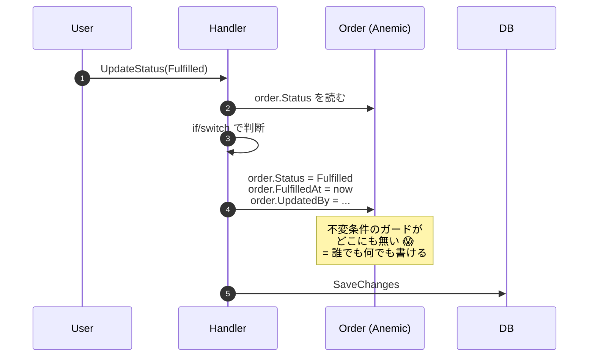
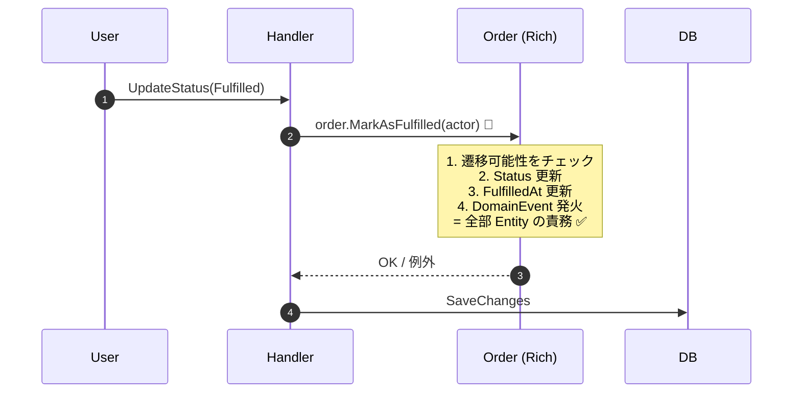
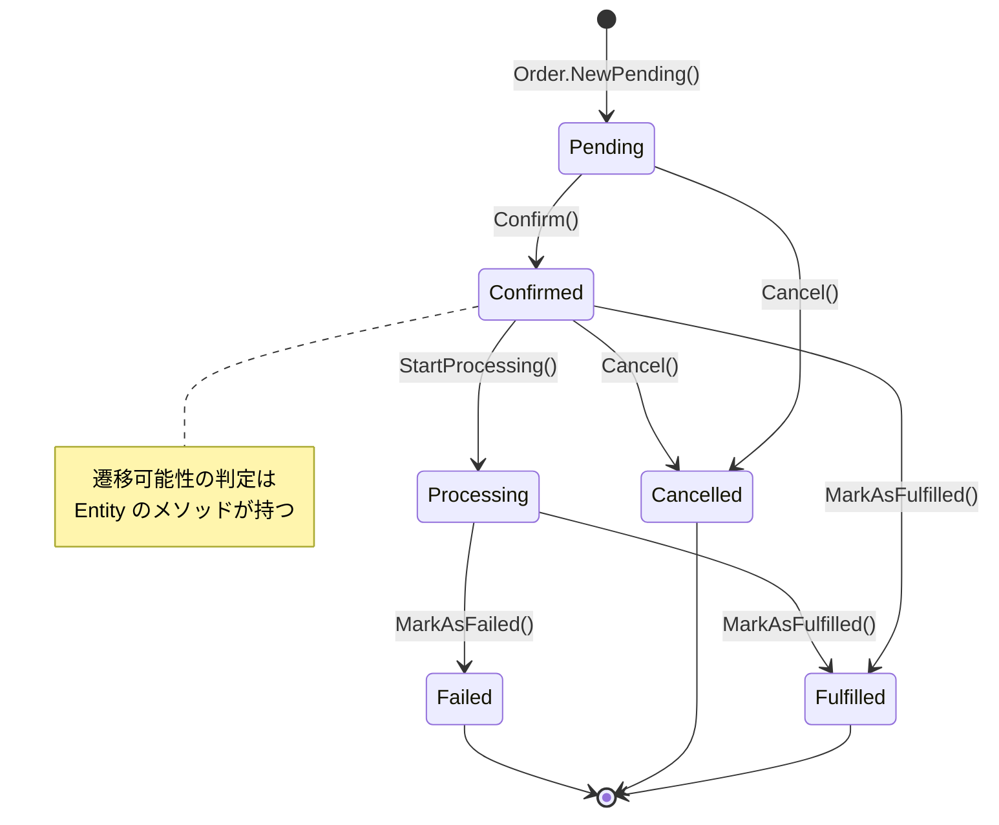

# 第 6 章 — Entity に状態遷移を返す

> **この章のゴール**
> - **Tell, Don't Ask** 原則を理解し、`if (order.Status == X) { order.Status = Y; }` を撲滅できる
> - Entity に状態遷移メソッドを書く **5 ステップ** を再現できる
> - 状態遷移を Mermaid 図にして仕様書代わりに使える
> - 状態遷移メソッドの単体テストを mock なしで書ける

---

## 6.1 Tell, Don't Ask — Andy Hunt と Dave Thomas の警告

Tell, Don't Ask は Andy Hunt と Dave Thomas が *The Pragmatic Programmer* (1999) で提唱した原則だ[^prag]。後に Martin Fowler が bliki で広めた[^tda]。

[^prag]: Andy Hunt, Dave Thomas, *The Pragmatic Programmer: From Journeyman to Master*, Addison-Wesley, 1999.
[^tda]: Martin Fowler, [TellDontAsk](https://martinfowler.com/bliki/TellDontAsk.html), 2013.

> Procedural code gets information then makes decisions. Object-oriented code tells objects to do things.
> (手続き型コードは情報を取得してから判断する。オブジェクト指向コードはオブジェクトに命じる。)
> — Alec Sharp, *Smalltalk by Example*

### Ask スタイル(NG)

```csharp
// 「Order の状態を聞いて、こっちで判断して、書き換える」
if (order.Status == OrderStatus.Pending && order.Total > Money.Zero)
{
    order.Status = OrderStatus.Confirmed;
    order.ConfirmedAt = DateTime.UtcNow;
    order.UpdatedBy = userId;
}
```

### Tell スタイル(OK)

```csharp
// 「Order に "確定しろ" と命じる」
order.Confirm(userId);
// 状態を読むのも書くのも Order の中で起きる
```

**Ask は呼び出し側が判断する → Anemic Domain Model**
**Tell は Entity 自身が判断する → Rich Domain Model**

---

## 6.2 アンチパターン — 外から状態 switch する Handler

第 1 章で見た「Order Status 更新」の Anemic 版を、もう少し精緻に見る。

### Before

```csharp
// ❌ Anemic Order — public setter のオンパレード
public class Order
{
    public string Id { get; set; }
    public OrderStatus Status { get; set; }
    public DateTime? FulfilledAt { get; set; }
    public DateTime? FailedAt { get; set; }
    public DateTime? CancelledAt { get; set; }
    public string UpdatedBy { get; set; } = "";
    public string? FailureReason { get; set; }
}

// ❌ Handler が状態を読んで判断して書き換える
public async Task<Result> HandleAsync(UpdateOrderStatusCommand cmd, CancellationToken ct)
{
    var order = await repo.GetByIdAsync(cmd.OrderId, ct);
    if (order is null) return Result.NotFound();

    if (order.Status != cmd.NewStatus)
    {
        switch (cmd.NewStatus)
        {
            case OrderStatus.Fulfilled:
                if (order.Status != OrderStatus.Confirmed && order.Status != OrderStatus.Processing)
                    return Result.Conflict("invalid transition");

                order.Status = OrderStatus.Fulfilled;
                order.FulfilledAt = DateTime.UtcNow;
                order.UpdatedBy = cmd.UserId;
                break;

            case OrderStatus.Failed:
                if (order.Status == OrderStatus.Fulfilled || order.Status == OrderStatus.Cancelled)
                    return Result.Conflict("invalid transition");

                order.Status = OrderStatus.Failed;
                order.FailedAt = DateTime.UtcNow;
                order.UpdatedBy = cmd.UserId;
                order.FailureReason = cmd.Reason;
                break;

            // ...他 5 ケース
        }
        await uow.SaveChangesAsync(ct);
    }
    return Result.Ok();
}
```

### 何が壊れているか



| 問題 | 影響 |
|------|------|
| 「Pending → Fulfilled は禁止」のような遷移ルールが Handler 内 | 別 Handler / Console / Background Job が同じルールを忘れる |
| `order.Status = Anything` が可能 | typo / 仕様外の値が混入する |
| `FulfilledAt` と `Status = Fulfilled` の同期は誰が保証する? | Handler が忘れると整合性が壊れる |
| 「状態遷移図」が Handler のコードからしか復元できない | 仕様書を読んでもどう遷移するか分からない |

---

## 6.3 After — Entity に状態遷移メソッドを返す

```csharp
// ✅ Rich Order
public sealed class Order
{
    public OrderId Id { get; }
    public OrderStatus Status { get; private set; }
    public DateTime? FulfilledAt { get; private set; }
    public DateTime? FailedAt { get; private set; }
    public DateTime? CancelledAt { get; private set; }
    public string? FailureReason { get; private set; }
    public UserId UpdatedBy { get; private set; }

    private readonly List<IDomainEvent> _events = new();
    public IReadOnlyList<IDomainEvent> DomainEvents => _events;

    public void MarkAsFulfilled(UserId actor)
    {
        if (Status is not (OrderStatus.Confirmed or OrderStatus.Processing))
            throw new InvalidStateTransitionException(Status, OrderStatus.Fulfilled);

        Status = OrderStatus.Fulfilled;
        FulfilledAt = DateTime.UtcNow;
        UpdatedBy = actor;
        _events.Add(new OrderFulfilled(Id, actor, FulfilledAt.Value));
    }

    public void MarkAsFailed(UserId actor, string reason)
    {
        if (Status is OrderStatus.Fulfilled or OrderStatus.Cancelled)
            throw new InvalidStateTransitionException(Status, OrderStatus.Failed);
        if (string.IsNullOrWhiteSpace(reason))
            throw new DomainException("failure reason is required");

        Status = OrderStatus.Failed;
        FailedAt = DateTime.UtcNow;
        FailureReason = reason;
        UpdatedBy = actor;
        _events.Add(new OrderFailed(Id, actor, reason));
    }

    public void Cancel(UserId actor, string reason)
    {
        if (Status is OrderStatus.Fulfilled)
            throw new InvalidStateTransitionException(Status, OrderStatus.Cancelled);

        Status = OrderStatus.Cancelled;
        CancelledAt = DateTime.UtcNow;
        UpdatedBy = actor;
        _events.Add(new OrderCancelled(Id, actor, reason));
    }
}
```

Handler は劇的に痩せる。

```csharp
// ✅ 痩せた Handler — コマンドルーティングだけ
public async Task<Result> HandleAsync(UpdateOrderStatusCommand cmd, CancellationToken ct)
{
    var order = await repo.GetByIdAsync(cmd.OrderId, ct);
    if (order is null) return Result.NotFound();

    // 冪等性ガード(同じ状態への再遷移はスキップ)
    if (order.Status == cmd.NewStatus) return Result.Ok();

    try
    {
        switch (cmd.NewStatus)
        {
            case OrderStatus.Fulfilled: order.MarkAsFulfilled(cmd.UserId); break;
            case OrderStatus.Failed:    order.MarkAsFailed(cmd.UserId, cmd.Reason ?? ""); break;
            case OrderStatus.Cancelled: order.Cancel(cmd.UserId, cmd.Reason ?? ""); break;
            default: return Result.BadRequest($"Unsupported transition: {cmd.NewStatus}");
        }
        await uow.SaveChangesAsync(ct);
        return Result.Ok();
    }
    catch (InvalidStateTransitionException ex)
    {
        return Result.Conflict(ex.Message);
    }
}
```

### After のシーケンス図



---

## 6.4 状態遷移図 — 仕様書代わりに使う

Rich Order の状態遷移を Mermaid の `stateDiagram` で書くと、**Entity を読むだけで遷移ルールが目視できる**。



**この図と Entity のメソッドリストは一対一対応する**。仕様書を別に書く必要がない。

---

## 6.5 Entity に状態遷移メソッドを書く 5 ステップ

リファクタの実行手順をテンプレ化する。

### Step 1 — メソッド名は「動詞 + 過去分詞 / 命令形」

```csharp
// ✅ 良い名前
order.Confirm();
order.Cancel(reason);
order.MarkAsFulfilled(actor);
order.MarkAsFailed(actor, reason);

// ❌ 悪い名前 — Status の名前と同じにすると、状態名と操作名が混ざる
order.Fulfill();   // FulfilledAt とどっち?
order.Failed();    // ← 過去形(状態を表す)になっている
order.Update();    // 何を Update?
```

**`MarkAsXxx` プレフィックス**は「状態が Xxx になる遷移」を表すイディオムとしてよく使われる。Vernon の *Implementing DDD* もこれを推奨[^vernon-method]。

[^vernon-method]: Vernon, *Implementing DDD*, Chapter 5 — Entity に状態遷移メソッドを置く実装パターン。

### Step 2 — 冒頭で遷移可能性をチェック

```csharp
public void MarkAsFulfilled(UserId actor)
{
    if (Status is not (OrderStatus.Confirmed or OrderStatus.Processing))
        throw new InvalidStateTransitionException(Status, OrderStatus.Fulfilled);

    // ↓ 本処理
}
```

**独自例外型を作る** — Handler が `catch` で適切な HTTP ステータス(409 Conflict)に変換できる。

```csharp
public sealed class InvalidStateTransitionException(OrderStatus from, OrderStatus to)
    : DomainException($"Cannot transition from {from} to {to}")
{
    public OrderStatus From { get; } = from;
    public OrderStatus To { get; } = to;
}
```

### Step 3 — 同時に変えるべき属性をすべて更新

「Status を Fulfilled に変えるなら、FulfilledAt も必ず更新」を Entity が保証する。

```csharp
public void MarkAsFulfilled(UserId actor)
{
    if (Status is not (OrderStatus.Confirmed or OrderStatus.Processing))
        throw new InvalidStateTransitionException(Status, OrderStatus.Fulfilled);

    Status = OrderStatus.Fulfilled;
    FulfilledAt = DateTime.UtcNow;    // ← セットで更新
    UpdatedBy = actor;                // ← セットで更新
}
```

**Handler から個別に setter を呼ばせない**。setter 自体を private にする(Step 5)。

### Step 4 — Domain Event を発火

```csharp
_events.Add(new OrderFulfilled(Id, actor, FulfilledAt.Value));
```

「いつ・誰が・何の状態になったか」が型として残る。これは:
- 監査ログ
- 副作用の非同期化(メール送信を Event Bus に流す)
- Audit trail
- Event Sourcing への移行可能性

の全てに繋がる[^event].

[^event]: Vernon, *Implementing DDD*, Chapter 8 "Domain Events". 「Domain Event はビジネスにとって意味のある出来事を表す」。

### Step 5 — public setter を private set / init に降格

```csharp
// ❌ Before
public OrderStatus Status { get; set; }
public DateTime? FulfilledAt { get; set; }

// ✅ After
public OrderStatus Status { get; private set; }    // 外部書き込み禁止
public DateTime? FulfilledAt { get; private set; }

// または生成時のみ:
public OrderId Id { get; init; }  // init = 生成時のみ書き込み可
```

**「外部から触れない」ことをコンパイラに守らせる**。EF Core は `private set` でもマッピング可能[^efcore-private].

[^efcore-private]: Microsoft Learn, [Property mapping with private fields](https://learn.microsoft.com/en-us/ef/core/modeling/backing-field).

---

## 6.6 残った switch は OK?

After の Handler にも `switch` が残っている。これは消すべきか?

```csharp
switch (cmd.NewStatus)
{
    case OrderStatus.Fulfilled: order.MarkAsFulfilled(cmd.UserId); break;
    case OrderStatus.Failed:    order.MarkAsFailed(cmd.UserId, cmd.Reason ?? ""); break;
    case OrderStatus.Cancelled: order.Cancel(cmd.UserId, cmd.Reason ?? ""); break;
}
```

**答え: 消さなくて OK**。

この switch は「**コマンドを Entity のメソッドにディスパッチする**」だけのもので、業務判断ではない。第 1 章で言った:

> **「if が残ったら負け」ではなく、「if の中身に業務ルールが入っているか」が判定基準**

この switch の中身は単なるメソッド呼び出しで、業務ルールは Entity の中に閉じている。これは健全。

---

## 6.7 設計のごほうび — テストが激変する

Rich Model の最大の実利は **テストの書きやすさ** だ。

```csharp
public class OrderStateTransitionTests
{
    [Fact]
    public void Confirmed_から_Fulfilled_へ遷移できる()
    {
        var order = OrderTestFactory.CreateConfirmed();
        order.MarkAsFulfilled(UserId.Of("user-1"));
        Assert.Equal(OrderStatus.Fulfilled, order.Status);
        Assert.NotNull(order.FulfilledAt);
        Assert.Contains(order.DomainEvents, e => e is OrderFulfilled);
    }

    [Fact]
    public void Pending_から_Fulfilled_へは遷移できない()
    {
        var order = OrderTestFactory.CreatePending();
        Assert.Throws<InvalidStateTransitionException>(
            () => order.MarkAsFulfilled(UserId.Of("user-1")));
    }

    [Theory]
    [InlineData(OrderStatus.Confirmed, true)]
    [InlineData(OrderStatus.Processing, true)]
    [InlineData(OrderStatus.Pending, false)]
    [InlineData(OrderStatus.Cancelled, false)]
    [InlineData(OrderStatus.Fulfilled, false)]
    public void Fulfilled_への遷移可能性は状態に依存する(OrderStatus from, bool expected)
    {
        var order = OrderTestFactory.CreateWithStatus(from);
        var act = () => order.MarkAsFulfilled(UserId.Of("user-1"));

        if (expected) act();    // 例外が出ないこと
        else Assert.Throws<InvalidStateTransitionException>(act);
    }
}
```

**Mock 0 個。DI コンテナ立ち上げ 0 回**。Entity を new するだけで、業務ルールを 100% テストできる。これが Rich Domain Model の最大のごほうびだ。

`OrderTestFactory` は Entity の private set / コンストラクタを使ってテスト用のオブジェクトを作るヘルパー(後述、第 13 章)。

---

## 6.8 Domain Event を Handler から発行する

Step 4 で `_events.Add(...)` していたが、これを実際に Kafka などに publish するのは Handler の責務だ。

```csharp
public async Task<Result> HandleAsync(UpdateOrderStatusCommand cmd, CancellationToken ct)
{
    var order = await repo.GetByIdAsync(cmd.OrderId, ct);
    if (order is null) return Result.NotFound();
    if (order.Status == cmd.NewStatus) return Result.Ok();

    try
    {
        // Entity に命じる
        switch (cmd.NewStatus)
        {
            case OrderStatus.Fulfilled: order.MarkAsFulfilled(cmd.UserId); break;
            // ...
        }

        // 永続化
        await uow.SaveChangesAsync(ct);

        // Event 発行(永続化成功後)
        foreach (var ev in order.DomainEvents)
            await eventBus.PublishAsync(ev, ct);

        return Result.Ok();
    }
    catch (InvalidStateTransitionException ex)
    {
        return Result.Conflict(ex.Message);
    }
}
```

**永続化後に Event を発行する**のが定石[^outbox]。永続化前に Event を発行すると、DB エラーで状態がロールバックされたのに Event だけ流れてしまう。

[^outbox]: 厳密には Transactional Outbox パターン(永続化と Event 発行を同一トランザクションで扱う)が推奨される。Chris Richardson, [Pattern: Transactional outbox](https://microservices.io/patterns/data/transactional-outbox.html). 本書では割愛するが、本番運用では検討すべき。

---

## 6.9 EF Core での Entity マッピング

「private set で EF Core 動くの?」という疑問に答える。

```csharp
// DbContext 側
modelBuilder.Entity<Order>(b =>
{
    b.HasKey(o => o.Id);
    b.Property(o => o.Id)
        .HasConversion(id => id.Value, value => OrderId.Of(value));  // Strongly-Typed ID
    b.Property(o => o.Status)
        .HasConversion<string>();    // enum を string で保存
    b.Property(o => o.FulfilledAt);
    b.Property(o => o.UpdatedBy)
        .HasConversion(u => u.Value, v => UserId.Of(v));
    b.Ignore(o => o.DomainEvents);   // Event は永続化しない

    // private fields のマッピング(必要なら)
    b.Property<DateTime>("_createdAt").HasField("_createdAt");
});
```

**private set / コンストラクタ / Strongly-Typed ID すべてマッピング可能**。これは EF Core 6+ で安定動作する[^efcore-mapping].

[^efcore-mapping]: Microsoft Learn, [EF Core - Value Conversions](https://learn.microsoft.com/en-us/ef/core/modeling/value-conversions). Strongly-Typed ID のサポート。

---

## 6.10 章末演習

### 演習 6.1 — Anemic Customer を Rich に書き換える

```csharp
// Before
public class Customer
{
    public string Id { get; set; }
    public string Status { get; set; }   // "Active", "Suspended", "Deleted"
    public DateTime? SuspendedAt { get; set; }
    public string? SuspendReason { get; set; }
}

public class CustomerService(...)
{
    public async Task SuspendAsync(string id, string reason)
    {
        var c = await repo.GetByIdAsync(id);
        if (c.Status == "Deleted") throw new InvalidOperationException();
        c.Status = "Suspended";
        c.SuspendedAt = DateTime.UtcNow;
        c.SuspendReason = reason;
        await uow.SaveChangesAsync();
    }
}
```

→ Rich 版に書き換え、`Customer.Suspend(string reason)` メソッドを実装せよ。Active → Suspended、Active → Deleted、Suspended → Active(Reactivate)の 3 遷移をサポート。

### 演習 6.2 — 状態遷移図を描く

演習 6.1 の Customer の状態遷移を Mermaid の `stateDiagram-v2` で書け。

### 演習 6.3 — テストを書く

演習 6.1 の `Customer.Suspend()` の単体テストを 4 ケース書け:
1. Active → Suspended が成功する
2. Suspended → Suspended が冪等(または例外)
3. Deleted → Suspended が失敗する
4. Suspend 後に `CustomerSuspended` Event が発火する

→ 解答は [付録 C](appendix-c-exercises) に。

---

## 6.11 まとめ

- **Tell, Don't Ask** — 状態を聞いて判断するな、命じよ
- Entity に状態遷移メソッドを書く **5 ステップ**:
  1. 動詞名(`MarkAsXxx`)
  2. 冒頭で遷移可能性チェック
  3. 関連属性を同時更新
  4. Domain Event を発火
  5. public setter を private set に降格
- **状態遷移図 = Entity のメソッド一覧** — 仕様書を別に書かなくていい
- Handler の switch は **コマンドルーティング** なので残して OK
- テストは **mock 0 個** で書ける — これが最大の実利

次の章では、Entity の中身を支える Value Object と Primitive Obsession を扱う。

→ **[第 7 章 Value Object と Primitive Obsession](07-value-object)**
