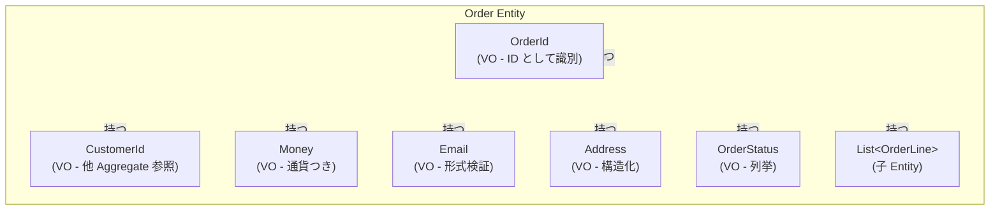
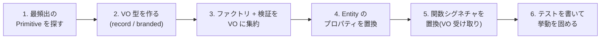

# 第 7 章 — Value Object と Primitive Obsession

> **この章のゴール**
> - **Primitive Obsession** という匂いを嗅ぎ分けられるようになる
> - VO を切り出す **5 つの判定軸** を持つ
> - VO 自体に業務ルールを閉じ込めて、コードベースから "魔法の文字列" を消す
> - C# `record` / TypeScript branded type で VO を実装する具体パターンを身につける

---

## 7.1 Primitive Obsession とは何か

Primitive Obsession(プリミティブ執着)は Martin Fowler が *Refactoring* で挙げた "Bad Smells in Code" の 1 つだ[^refactoring]。

[^refactoring]: Martin Fowler, *Refactoring: Improving the Design of Existing Code*, Addison-Wesley, 1999 (2nd ed. 2018). Chapter 3 "Bad Smells in Code" — 「Primitive Obsession」。

> Programmers ... love to use primitives. ... Few code bases escape this temptation entirely.
> (プログラマはプリミティブを使いたがる。完全に逃れているコードベースはほとんどない。)

### 症状の例

```csharp
public Order CreateOrder(
    string customerId,           // ← なぜ string?
    string sku,                  // ← なぜ string?
    decimal price,               // ← なぜ decimal? 通貨は?
    string currency,             // ← price と一緒であるべきでは?
    string emailForReceipt,      // ← なぜ string? 検証は?
    string addressZip,           // ← なぜ string? 7 桁の保証は?
    string addressLine1,
    string addressLine2,
    DateTime deliveryDate)
{
    // 100 行
}
```

呼び出し側:

```csharp
// ❌ 引数を取り違えても気づかない
CreateOrder("CUS-001", "SKU-002", 1000m, "JPY", "user@example.com", "1000001", ...);
//             ^^^^^^^^ ^^^^^^^^                              ^^^^^^^^^^
//             どっちが customer? どっちが sku? 順序入れ替えてもコンパイル通る
```

これが Primitive Obsession の最も典型的な症状だ。

---

## 7.2 なぜ string / decimal が悪いのか — 5 つの罪

### 罪 1 — 引数の順序を間違える

```csharp
// 同じシグネチャ
public void Send(string from, string to, string subject, string body) { ... }

// 呼び出し側
Send("user@example.com", "admin@example.com", "Order #001", "...");
// from と to を入れ替えてもコンパイル通る。バグになる。
```

### 罪 2 — typo がコンパイル時に検出されない

```csharp
order.Status = "Confimed";   // typo!
if (order.Status == "Confirmed") { ... }   // false になる。実行時バグ。
```

### 罪 3 — 業務ルールがバラバラに転記される

```csharp
// File A: Email validation
if (!input.Contains("@")) throw new ArgumentException("invalid email");

// File B: 同じことを書く
if (input.IndexOf("@") < 0) throw new ArgumentException("not an email");

// File C: 微妙に違うルールで書く
if (!Regex.IsMatch(input, @"^[^@]+@[^@]+$")) throw new ArgumentException("...");
```

「Email の有効性とは何か」が **5 箇所で 3 通りの定義** になる典型。

### 罪 4 — 通貨と金額がペアで扱われない

```csharp
public void Transfer(decimal amount, string currency, ...) { ... }

Transfer(1000m, "JPY", ...);  // OK
Transfer(1000m, "USD", ...);  // amount は同じだが…意味は全然違う
amount + amount2;             // ← 通貨違いを足し算!サイレントバグ
```

### 罪 5 — 値の "形" を保証できない

```csharp
// 郵便番号は 7 桁の数字
string zip = "abc-defgh";  // ← 通る
```

これらすべてを **VO に閉じ込めることで一気に解決** する。

---

## 7.3 VO に閉じ込める — Before / After

### Before(Primitive Obsession)

```csharp
public class Order
{
    public string Id { get; set; }
    public string CustomerId { get; set; }
    public string Sku { get; set; }
    public decimal Price { get; set; }
    public string Currency { get; set; }
    public string EmailForReceipt { get; set; }
    public string AddressZip { get; set; }
    public string AddressLine { get; set; }
    public DateTime DeliveryDate { get; set; }
}
```

### After(VO 化)

```csharp
public sealed class Order
{
    public OrderId Id { get; }
    public CustomerId CustomerId { get; }
    public Sku Sku { get; }
    public Money Price { get; }
    public Email EmailForReceipt { get; }
    public Address ShipTo { get; }
    public DeliveryDate DeliveryDate { get; }
}

// すべて型として表現
public sealed record OrderId(string Value)
{
    public static OrderId Of(string value)
    {
        if (!Regex.IsMatch(value, @"^ORD-\d{9}$"))
            throw new ArgumentException($"Invalid OrderId: {value}");
        return new OrderId(value);
    }
}

public sealed record CustomerId(string Value)
{
    public static CustomerId Of(string value)
    {
        if (!Regex.IsMatch(value, @"^CUS-\d{6}$"))
            throw new ArgumentException($"Invalid CustomerId: {value}");
        return new CustomerId(value);
    }
}

public sealed record Sku(string Value)
{
    public static Sku Of(string value)
    {
        if (!Regex.IsMatch(value, @"^[A-Z]{3}-\d{5}$"))
            throw new ArgumentException($"Invalid SKU: {value}");
        return new Sku(value);
    }
    public bool IsDigital => Value.StartsWith("DGT-");
}

public sealed record Money(decimal Amount, string Currency)
{
    public static Money Yen(decimal amount) => new(amount, "JPY");
    public static Money Zero(string currency) => new(0m, currency);

    public Money Add(Money other)
    {
        if (Currency != other.Currency)
            throw new InvalidOperationException($"Currency mismatch: {Currency} vs {other.Currency}");
        return this with { Amount = Amount + other.Amount };
    }

    public bool IsPositive => Amount > 0;
}

public sealed record Email(string Value)
{
    private static readonly Regex Pattern = new(@"^[^@\s]+@[^@\s]+\.[^@\s]+$");
    public static Email Of(string value)
    {
        if (!Pattern.IsMatch(value))
            throw new ArgumentException($"Invalid email: {value}");
        return new Email(value.ToLowerInvariant());
    }
}

public sealed record Address(string Zip, string Prefecture, string Line1, string Line2)
{
    public static Address Of(string zip, string prefecture, string line1, string line2)
    {
        if (!Regex.IsMatch(zip, @"^\d{3}-\d{4}$"))
            throw new ArgumentException($"Invalid zip: {zip}");
        // ...
        return new Address(zip, prefecture, line1, line2);
    }
}
```

### 効果 1 — 引数の取り違えがコンパイル時に弾ける

```csharp
// Before
CreateOrder("ORD-001", "CUS-002", ...);  // 順序入れ替え OK(バグ)

// After
CreateOrder(OrderId.Of("ORD-001"), CustomerId.Of("CUS-002"), ...);
CreateOrder(CustomerId.Of("CUS-002"), OrderId.Of("ORD-001"), ...);  // ❌ コンパイルエラー
```

### 効果 2 — VO のコンストラクタが業務ルールのゲートになる

「Email の有効性とは何か」が `Email.Of()` 1 箇所に集中する。**コードベースのどこから生成しても同じガードを通る**。

### 効果 3 — 通貨と金額がペア扱いになる

```csharp
var a = Money.Yen(1000);
var b = new Money(100m, "USD");
a.Add(b);  // ❌ InvalidOperationException — 通貨違い
```

---

## 7.4 VO の 5 つの判定軸

「これは VO にすべきか?」を判断する 5 つの軸:

### 軸 1 — **値で識別される(ID を持たない)**

`Money(1000, "JPY")` と `Money(1000, "JPY")` は **同じもの**。
これに対し `Order { Id = "ORD-001" }` は ID が同じなら同じ Order(属性が違ってもよい)。

### 軸 2 — **不変(immutable)**

VO は生成後に変更しない。「変更したい」場合は新しい VO を作る。

```csharp
var money = Money.Yen(1000);
var doubled = money.Multiply(2);  // 新しい Money を返す。元の money は変わらない
```

C# 9+ の `record` は `with` 式で不変更新が綺麗に書ける:
```csharp
var bumped = money with { Amount = money.Amount + 100 };
```

### 軸 3 — **自己完結した業務ルールを持つ**

- `Money.Add` は同通貨チェック
- `Email.Of` は形式チェック
- `Sku.IsDigital` はプレフィックス判定

これらは **VO 自身が知っているべき業務ルール**。Entity や Service に書くべきではない。

### 軸 4 — **取り違えると意味が変わる**

`OrderId` と `CustomerId` は両方 string だが、意味が違う。取り違えるとデータが壊れる。**意味が違うものは型で区別する**。

### 軸 5 — **複数の場所で使われる**

`Money` は `Order.Total`、`Customer.CreditLimit`、`Invoice.Amount` で使われる。共通の VO に切り出す価値がある。

---

## 7.5 VO の典型実装パターン

### パターン A — C# `record`(推奨)

```csharp
public sealed record Money(decimal Amount, string Currency);
```

- 値等価が自動で実装される(`Equals`, `GetHashCode`)
- `ToString()` も自動
- `with` 式で不変更新

ファクトリメソッドを足す:

```csharp
public sealed record Money(decimal Amount, string Currency)
{
    public static Money Yen(decimal amount) => new(amount, "JPY");
    public static Money Zero(string currency) => new(0m, currency);
    public static Money Of(decimal amount, string currency)
    {
        if (amount < 0) throw new ArgumentException("amount must be >= 0");
        if (string.IsNullOrEmpty(currency)) throw new ArgumentException("currency required");
        return new Money(amount, currency);
    }
}
```

### パターン B — TypeScript `branded type`

```typescript
// Branded type (Phantom type) で識別子を区別
type Brand<T, B> = T & { readonly __brand: B };

type OrderId = Brand<string, "OrderId">;
type CustomerId = Brand<string, "CustomerId">;

// ファクトリ関数
const OrderId = {
  of(value: string): OrderId {
    if (!/^ORD-\d{9}$/.test(value)) throw new Error(`Invalid OrderId: ${value}`);
    return value as OrderId;
  },
};

// 使用
const orderId = OrderId.of("ORD-000000001");
const customerId = CustomerId.of("CUS-000001");

function findOrder(id: OrderId) { /* ... */ }

findOrder(orderId);       // OK
findOrder(customerId);    // ❌ TS2345: 'CustomerId' is not assignable to 'OrderId'
findOrder("CUS-000001");  // ❌ TS2345: 'string' is not assignable to 'OrderId'
```

これで TypeScript でも nominal typing 相当の保護が得られる[^branded].

[^branded]: [TypeScript Branded Types Pattern](https://www.typescriptlang.org/docs/handbook/2/everyday-types.html#object-types). Phantom types とも呼ばれる。Effective TypeScript 等で紹介。

### パターン C — Class ベース VO(Java スタイル)

```typescript
class Money {
  private constructor(
    public readonly amount: number,
    public readonly currency: string,
  ) {}

  static of(amount: number, currency: string): Money {
    if (amount < 0) throw new Error("amount must be >= 0");
    return new Money(amount, currency);
  }

  add(other: Money): Money {
    if (this.currency !== other.currency)
      throw new Error(`Currency mismatch: ${this.currency} vs ${other.currency}`);
    return new Money(this.amount + other.amount, this.currency);
  }

  equals(other: Money): boolean {
    return this.amount === other.amount && this.currency === other.currency;
  }
}
```

JavaScript には値等価がないので `equals` を手書きする。`record` のような糖衣構文がないので C# より冗長になる。

---

## 7.6 Zod / Yup と VO の関係

TypeScript フロントエンドだと「Zod schema があるから VO は不要では?」という質問がよく出る。答え:

> **Zod schema は VO の "validator + parser"。VO そのものではない**。

```typescript
import { z } from "zod";

// Zod schema = 検証ルール
const EmailSchema = z.string().email();

// VO = 型 + 値
type Email = z.infer<typeof EmailSchema> & { readonly __brand: "Email" };

const Email = {
  parse(input: unknown): Email {
    return EmailSchema.parse(input) as Email;
  },
};
```

**Zod が形を保証する → VO がドメイン語彙として現れる**。両方使うのが正解。

---

## 7.7 Entity と VO の混在パターン

`Order` Entity は内部に大量の VO を持つ。



**Entity ≒ "ID で識別される、VO の集合体" と捉えてよい**。

---

## 7.8 VO が陥りがちな罠

### 罠 1 — 巨大 VO

```csharp
// ❌ プロパティ 30 個の Address
public sealed record Address(
    string Zip, string Prefecture, string City, string Ward,
    string Town, string Block, string Building, string Floor,
    string Room, string Phone, string Fax, /* ... */);
```

これは VO というより **データ転送オブジェクト (DTO)**。分割するか、Entity に格上げする。

### 罠 2 — VO 内で外部依存

```csharp
// ❌ VO の中で DB を呼ぶ
public sealed record Sku(string Value, IProductCatalog catalog)
{
    public bool IsAvailable => catalog.IsAvailable(Value);  // DI 注入が必要 → VO ではない
}
```

VO は **純粋なデータ + 純粋計算**。外部依存が必要なら Domain Service に。

### 罠 3 — ファクトリと検証が分散

```csharp
// ❌ 検証なしのコンストラクタが open
public sealed record Email(string Value);

// 利用側
var e = new Email("not_an_email");  // 通ってしまう
```

**コンストラクタを `private` にしてファクトリメソッドのみ公開**するのが定石。

```csharp
public sealed record Email
{
    public string Value { get; }
    private Email(string value) { Value = value; }
    public static Email Of(string value) { /* 検証 */ return new Email(value); }
}
```

ただし `record` の primary constructor を private にする構文は C# 12 でやや煩雑。実務では「コンストラクタは internal、外部はファクトリメソッド経由」というチーム規約で運用することが多い。

### 罠 4 — VO を ORM で扱うときのマッピング

EF Core は VO を **Owned Entity Type** としてマッピングできる[^owned].

[^owned]: Microsoft Learn, [Owned Entity Types - EF Core](https://learn.microsoft.com/en-us/ef/core/modeling/owned-entities). VO を「親 Entity の一部」としてマッピングする機能。

```csharp
modelBuilder.Entity<Order>().OwnsOne(o => o.ShipTo, addr =>
{
    addr.Property(a => a.Zip).HasColumnName("ship_zip");
    addr.Property(a => a.Prefecture).HasColumnName("ship_pref");
    // ...
});

// Strongly-Typed ID は Value Converter
modelBuilder.Entity<Order>().Property(o => o.Id)
    .HasConversion(id => id.Value, value => OrderId.Of(value));
```

---

## 7.9 VO を導入するリファクタの順序

既存コードに VO を導入する手順。



### Step 1 — 最頻出の Primitive を探す

```bash
# 例: customerId が何回出てきているか
grep -rn "string customerId\|customerId: string" backend/ | wc -l
grep -rn "string sku\|sku: string" backend/ | wc -l
grep -rn "decimal price\|price: number" backend/ | wc -l
```

出現回数の多いものから VO 化する。

### Step 2-3 — VO 作成

```csharp
public sealed record CustomerId(string Value)
{
    public static CustomerId Of(string value) { /* 検証 */ return new(value); }
}
```

### Step 4 — Entity 側を置き換え

```diff
- public string CustomerId { get; set; }
+ public CustomerId CustomerId { get; }
```

### Step 5 — 関数シグネチャを置き換え

```diff
- public Order CreateOrder(string customerId, ...);
+ public Order CreateOrder(CustomerId customerId, ...);
```

### Step 6 — テスト

```csharp
[Fact]
public void Invalid_CustomerId_は_例外を投げる()
{
    Assert.Throws<ArgumentException>(() => CustomerId.Of("invalid"));
}
```

---

## 7.10 章末演習

### 演習 7.1 — Primitive を VO 化

以下を VO 化せよ。

```csharp
public class User
{
    public string Id { get; set; }        // "USR-XXXXXX" 形式
    public string Email { get; set; }     // RFC 5322
    public string PhoneNumber { get; set; }  // E.164 形式 (+81901234567)
    public int Age { get; set; }          // 0-150
    public string Country { get; set; }   // ISO 3166-1 alpha-2 (2 文字)
}
```

### 演習 7.2 — Money の演算を実装

`Money` 型に以下を実装せよ。

- `Subtract(Money other)` — 同通貨のみ
- `Multiply(decimal factor)` — 倍率による拡大縮小
- `Divide(int n)` — 等分(小数点以下は四捨五入で1円調整)
- `static Money Sum(IEnumerable<Money> moneys)` — 通貨が混在したら例外

### 演習 7.3 — branded type で TypeScript 版を書く

演習 7.1 を TypeScript の branded type + Zod で書け。

→ 解答は [付録 C](appendix-c-exercises) に。

---

## 7.11 まとめ

- **Primitive Obsession** は最頻出の設計の匂い — string/decimal/int を裸で使い回す
- 5 つの罪: 順序取り違え / typo 不検出 / ルール分散 / 通貨ペア破綻 / 形の不保証
- **VO の判定軸 5 つ**: 値で識別 / 不変 / 自己完結ルール / 取り違え危険 / 共用
- 実装: C# は `record`、TypeScript は **branded type + Zod**
- ORM マッピング: EF Core の Owned Entity Type、Strongly-Typed ID は Value Converter
- リファクタは **最頻出 Primitive から順に** 6 ステップで

次の章では、Entity に置けないロジックの居場所 — Domain Service と Strategy パターンを扱う。

→ **[第 8 章 Domain Service と Strategy パターン](08-domain-service-strategy)**
