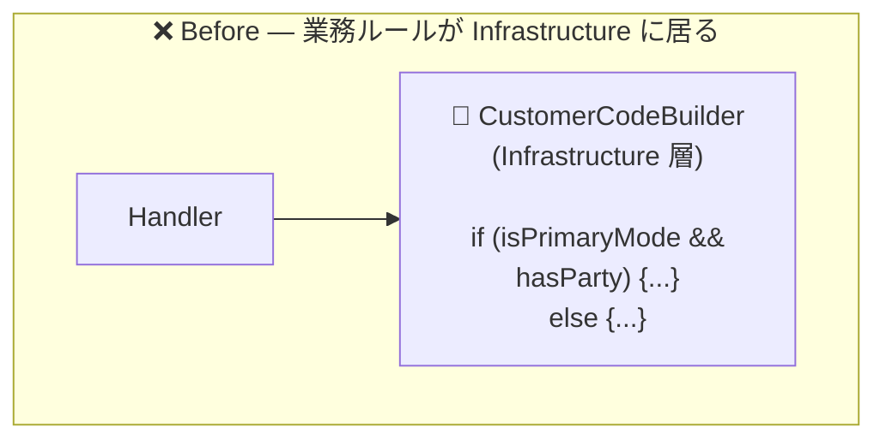
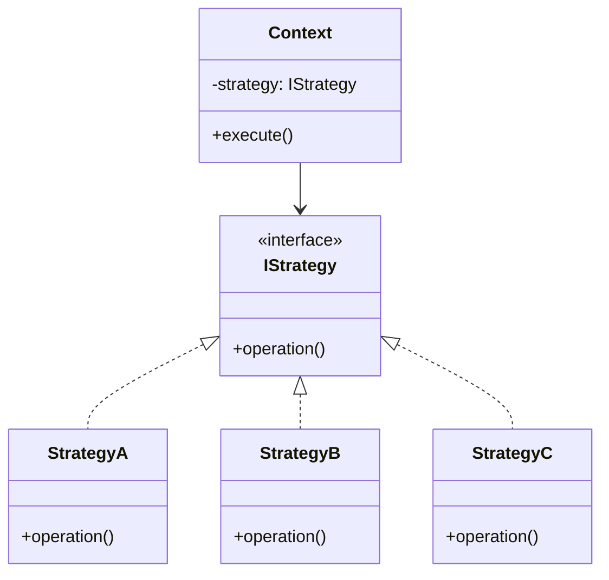
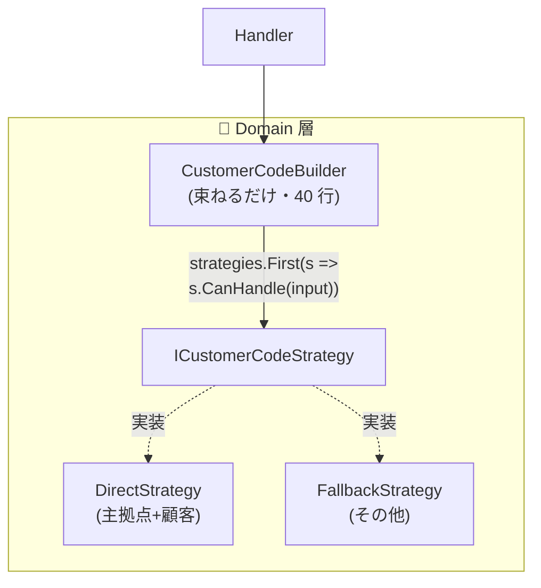
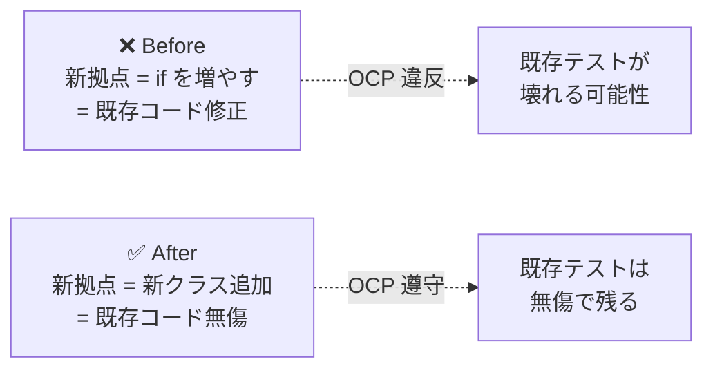
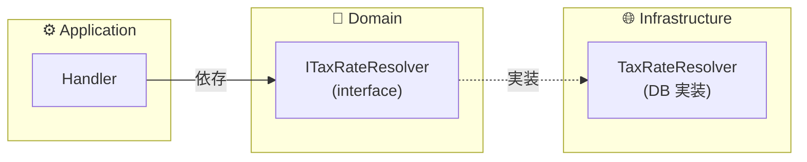

# 第 8 章 — Domain Service と Strategy パターン

> **この章のゴール**
> - Domain Service が **「Entity に置きづらいロジック」の居場所** であることを理解する
> - Strategy パターンで **環境モード分岐 / 拠点分岐** などのアンチパターンを解体できる
> - Strategy 化の判断基準を持ち、過剰適用を回避できる
> - interface を Domain、実装を Infrastructure に置く DIP の実装を書ける

---

## 8.1 Domain Service が必要になる典型シナリオ

第 3 章で見たが、Domain Service は **Entity に置けない業務ロジック** の居場所だ。再掲する判定軸:

| シナリオ | 例 |
| --- | --- |
| 複数 Aggregate にまたがる | `Order` と `Product Catalog` の在庫引当 |
| 外部依存(DB / API / マスタ) が必要 | 税率マスタからの参照 |
| ステートレスな計算式の集合 | 配送料の階段表 |
| 戦略の入れ替えがある | 拠点ごとの顧客コード組み立て |

これらに当てはまるロジックを Entity の中に書こうとすると、Entity に DI が必要になったり、Entity が外部システムを知ることになったりする。Clean Architecture の依存方向を破る。

---

## 8.2 アンチパターン — Infrastructure に業務ルールが漏れる

「主要拠点 = 内部コードをそのまま使う、それ以外 = ダミー埋めで組み立てる」という業務ルールがあるとする。Anemic な実装はこうなる。

### Before

```csharp
// ❌ Infrastructure の Builder に業務ルールが直書き
namespace MyApp.Infrastructure;

public sealed class CustomerCodeBuilder(
    IOptions<RegionSettings> region,
    IOptions<DatabaseSettings> dbSettings) : ICustomerCodeBuilder
{
    public Task<string> BuildAsync(
        string? branchNo, string? partyCode, string? loc, string? accountNo, CancellationToken ct)
    {
        var isPrimaryMode = string.Equals(
            dbSettings.Value.Region, "PRIMARY", StringComparison.OrdinalIgnoreCase);
        var hasParty = !string.IsNullOrWhiteSpace(partyCode);

        if (isPrimaryMode && hasParty)
        {
            // 主拠点 + 顧客指定 → 別建てフォーマット
            return Task.FromResult(
                CustomerCodeGenerator.FromCustomer(branchNo ?? "", accountNo ?? ""));
        }

        // それ以外 → ダミー埋めしてフォーマット
        var effBranch = string.IsNullOrEmpty(branchNo) ? region.Value.DummyBranch : branchNo;
        var effParty  = string.IsNullOrEmpty(partyCode) ? region.Value.DummyParty  : partyCode;
        var effLoc    = string.IsNullOrEmpty(loc)       ? region.Value.DummyLoc    : loc;
        return Task.FromResult(CustomerCodeGenerator.Generate(effBranch, effParty, effLoc));
    }
}
```

### Before の構造図



### 何が壊れているか

| 観点 | 影響 |
| --- | --- |
| 層責務 | 業務ルール(拠点 × 顧客有無) が Infrastructure 層に染み出している |
| 概念の表現 | 「主拠点モード」が string 比較でしか表現されていない |
| 拡張性 | 新拠点を足すと if が増殖する(OCP 違反) |
| テスト容易性 | Builder 全体を立ち上げないと検証できない |
| 文字列分岐 | `"PRIMARY"` という魔法の文字列 — typo がコンパイル時に弾けない |

判定表(第 5 章) に照らすと:

- 「拠点モードの判定」は **外部依存(設定)を必要とする** → **Domain Service**(interface を Domain、実装を Infrastructure)
- 「組み立てルール」は **引数だけで結果が決まる純粋計算** → **VO / Calculator**
- 「どちらの戦略を使うか」は **Strategy パターン** で分離

---

## 8.3 Strategy パターン — Gang of Four の古典

Strategy パターンは GoF *Design Patterns* (1994) で命名された[^gof]。

[^gof]: Erich Gamma, Richard Helm, Ralph Johnson, John Vlissides, *Design Patterns: Elements of Reusable Object-Oriented Software*, Addison-Wesley, 1994. Strategy パターンの章。

> Define a family of algorithms, encapsulate each one, and make them interchangeable.
> (アルゴリズム群を定義し、各々をカプセル化し、相互に交換可能にする。)



---

## 8.4 After — Strategy + Selector に分解

```csharp
// =============== Domain 層 ===============
namespace MyApp.Domain.Customers;

// 入力(VO)
public sealed record CustomerCodeInput(
    Region Region, string? BranchNo, string? PartyCode, string? Loc, string? AccountNo);

public sealed record Region(string Value)
{
    public static readonly Region Primary  = new("PRIMARY");
    public static readonly Region Asia     = new("ASIA");
    public static readonly Region Europe   = new("EUROPE");
}

// Strategy interface
public interface ICustomerCodeStrategy
{
    bool CanHandle(CustomerCodeInput input);
    string Build(CustomerCodeInput input);
}

// Strategy 1 — 主拠点 + 顧客指定
public sealed class DirectCustomerCodeStrategy : ICustomerCodeStrategy
{
    public bool CanHandle(CustomerCodeInput x) =>
        x.Region == Region.Primary && !string.IsNullOrWhiteSpace(x.PartyCode);

    public string Build(CustomerCodeInput x) =>
        CustomerCode.FromMaster(x.BranchNo!, x.AccountNo!).ToString();
}

// Strategy 2 — フォールバック(ダミー埋め)
public sealed class FallbackCustomerCodeStrategy(IOptions<RegionSettings> region) : ICustomerCodeStrategy
{
    public bool CanHandle(CustomerCodeInput _) => true;  // 常に true(最後尾に置く)

    public string Build(CustomerCodeInput x)
    {
        var r = region.Value;
        return CustomerCode.Compose(
            x.BranchNo ?? r.DummyBranch,
            x.PartyCode ?? r.DummyParty,
            x.Loc       ?? r.DummyLoc
        ).ToString();
    }
}

// Selector(束ねるだけ)
public sealed class CustomerCodeBuilder(IEnumerable<ICustomerCodeStrategy> strategies)
    : ICustomerCodeBuilder
{
    public string Build(CustomerCodeInput input) =>
        strategies.First(s => s.CanHandle(input)).Build(input);
}

// =============== Infrastructure 層 ===============
// DI 登録(.NET DI コンテナ)
services.AddScoped<ICustomerCodeStrategy, DirectCustomerCodeStrategy>();
services.AddScoped<ICustomerCodeStrategy, FallbackCustomerCodeStrategy>();
services.AddScoped<ICustomerCodeBuilder, CustomerCodeBuilder>();
```

### After の構造図



---

## 8.5 リファクタの効用

| 観点 | Before | After |
| --- | --- | --- |
| 新拠点を足すとき | `if` を増やす + 既存ロジック修正 | クラスを 1 個足して DI 登録するだけ(**OCP**) |
| Strategy ごとの単体テスト | Builder 全体を立ち上げる必要 | Strategy 単独で `CanHandle`, `Build` をテスト可能 |
| 業務概念の表現 | `"PRIMARY"` 文字列比較 | `Region.Primary` 型 |
| 層責務 | 業務ルールが Infrastructure に | 業務ルールが Domain に |
| 順序の明示 | if/else の暗黙順序 | `strategies` リストの並びで明示 |

### Open/Closed Principle (OCP) の体現



「**修正に閉じ、拡張に開かれている**」のがまさにこの状態だ[^ocp].

[^ocp]: Bertrand Meyer, *Object-Oriented Software Construction*, Prentice Hall, 1988. OCP の原典(Robert Martin が SOLID の "O" として再定式化)。

---

## 8.6 ⚠️ Strategy パターンの過剰適用

「if を見たら Strategy」は危険。**戦略が少数で増えない場合、Strategy 化はオーバーエンジニアリング** になる。

### 判定マトリクス

| 状況 | Strategy 化すべきか |
| --- | --- |
| 戦略が 3 つ以上、または近く増える見込みがある | ✅ する |
| 戦略が 2 つで安定している(増減しない) | △ 状況次第(`if-else` で十分なケースが多い) |
| 戦略が 1 つしかない | ❌ YAGNI[^yagni-strategy]。素直に書く |
| 各戦略の中身が 5 行未満で、構造もほぼ同じ | ❌ private メソッドで十分 |
| 戦略どうしが共通の前処理を大量に持つ | △ Template Method など別パターンを検討 |

[^yagni-strategy]: Martin Fowler, [Yagni](https://martinfowler.com/bliki/Yagni.html). 「将来必要になりそう」だけで作らない。

### 判定の合言葉

> **if が業務上の概念名(拠点・商品種別・会員区分など)で分岐しているか?**
>
> - **Yes** → Strategy 化を検討
> - **No**(null チェック / 早期 return / 単純ガード) → 通常の if のまま

---

## 8.7 Domain Service の典型例 4 つ

### 例 1 — 在庫引当(複数 Aggregate にまたがる)

```csharp
public interface IInventoryReservation
{
    Task<ReservationResult> ReserveAsync(Order order, CancellationToken ct);
}

public sealed record ReservationResult(bool Success, IReadOnlyList<string> UnavailableSkus);

// Infrastructure 実装
public sealed class InventoryReservationService(IInventoryApi api) : IInventoryReservation
{
    public async Task<ReservationResult> ReserveAsync(Order order, CancellationToken ct)
    {
        var skus = order.Lines.Select(l => l.Sku).ToList();
        var response = await api.ReserveAsync(skus, order.Id, ct);
        return new ReservationResult(response.AllReserved, response.Unavailable);
    }
}
```

`Order` Aggregate と「在庫」(別 Aggregate or 外部システム) にまたがるので Domain Service。

### 例 2 — 税率算出(マスタ参照)

```csharp
public interface ITaxRateResolver
{
    Task<decimal> GetRateAsync(Region region, DateTime orderDate, CancellationToken ct);
}
```

「いつ・どの地域の税率はいくらか」は DB マスタを引かないと分からない。Domain Service。

### 例 3 — 一意性検証(横断クエリ)

```csharp
public interface IUserUniquenessChecker
{
    Task<bool> IsEmailUniqueAsync(Email email, CancellationToken ct);
}
```

「Email がシステム全体で一意か」は単一 User Entity だけでは答えられない。Domain Service。

### 例 4 — 価格決定(戦略入れ替え)

```csharp
public interface IPricingPolicy
{
    bool Applies(CreateOrderCommand cmd);
    Money CalculatePrice(Order order);
}
```

通常価格 / VIP 価格 / セール価格 が戦略で切り替わるなら Strategy として Domain Service に。

---

## 8.8 Domain Service の設計指針

### 指針 1 — interface を Domain、実装を Infrastructure に

```text
backend/Domain/Services/        ← interface
   ITaxRateResolver.cs
   IInventoryReservation.cs

backend/Infrastructure/Services/   ← 実装
   TaxRateResolver.cs (DB を叩く)
   InventoryReservationService.cs (HTTP を叩く)
```

これは **Dependency Inversion Principle (DIP)** の典型適用。



### 指針 2 — Domain Service にもステートを持たせない

```csharp
// ❌ Stateful な Domain Service(避ける)
public class TaxRateResolver : ITaxRateResolver
{
    private decimal _lastRate;  // ← なぜ持つ?
    public async Task<decimal> GetRateAsync(...) { ... }
}

// ✅ Stateless
public class TaxRateResolver(AppDbContext db) : ITaxRateResolver
{
    public async Task<decimal> GetRateAsync(...) { /* 毎回引く */ }
}
```

キャッシュが欲しければ別の interface(`ICachedTaxRateResolver`)を被せる Decorator パターンが綺麗。

### 指針 3 — Domain Service の名前は **動詞 + サフィックス**

| 形 | 例 |
| --- | --- |
| 動詞 + er/or | `TaxRateResolver`, `InventoryReservator` |
| 動詞 + Service | `OrderConfirmationService`(避けたい — Anemic っぽい) |
| 動詞 + Checker/Validator | `UserUniquenessChecker` |
| 動詞 + Calculator | `ShippingFeeCalculator` |

「**動詞が表に出ている**」のがポイント。`UserService` のような汎用名は避ける(何を Service するの?が不明)。

---

## 8.9 Strategy の "選び方" を Strategy 自身に持たせる

第 8.4 節の `CanHandle` は **Strategy 自身が「自分が適用可能か」を知っている** パターンだ。これは Selector に if/switch を書かないための定石。

```csharp
// ❌ Selector が判断
public string Build(CustomerCodeInput input)
{
    if (input.Region == Region.Primary && !string.IsNullOrEmpty(input.PartyCode))
        return strategies.OfType<DirectCustomerCodeStrategy>().Single().Build(input);
    return strategies.OfType<FallbackCustomerCodeStrategy>().Single().Build(input);
}

// ✅ Strategy が自分の適用可否を知っている
public string Build(CustomerCodeInput input) =>
    strategies.First(s => s.CanHandle(input)).Build(input);
```

**Selector に if が無い** = 新しい Strategy を足すだけで使える。これが Strategy パターンの真価。

---

## 8.10 Domain Service の単体テスト

```csharp
public class TaxRateResolverTests
{
    [Fact]
    public async Task Tokyo_の_2024_年度の税率は_10_パーセント()
    {
        // Arrange — InMemory DB or 専用テスト用 DbContext
        var db = TestDb.Create();
        db.TaxRates.Add(new TaxRateRecord {
            Region = "Tokyo",
            EffectiveFrom = new DateTime(2024, 4, 1),
            Rate = 0.10m
        });
        await db.SaveChangesAsync();

        var resolver = new TaxRateResolver(db);

        // Act
        var rate = await resolver.GetRateAsync(
            Region.Tokyo, new DateTime(2024, 6, 1), CancellationToken.None);

        // Assert
        Assert.Equal(0.10m, rate);
    }
}
```

外部依存があるので Pure Domain ロジックよりはセットアップが重いが、Handler の統合テストよりは軽い。

Strategy の単体テストは超軽量:

```csharp
public class DirectCustomerCodeStrategyTests
{
    [Fact]
    public void CanHandle_は_PrimaryRegion_かつ_PartyCode_あり_の時のみ_true()
    {
        var strategy = new DirectCustomerCodeStrategy();
        Assert.True(strategy.CanHandle(new CustomerCodeInput(
            Region.Primary, "B01", "P001", null, "A001")));
        Assert.False(strategy.CanHandle(new CustomerCodeInput(
            Region.Asia, "B01", "P001", null, "A001")));
        Assert.False(strategy.CanHandle(new CustomerCodeInput(
            Region.Primary, "B01", null, null, "A001")));
    }
}
```

**Mock 0 個** で書ける。

---

## 8.11 章末演習

### 演習 8.1 — Infrastructure 層から業務ルールを引き上げる

以下の Anemic コードから業務ルールを Domain に引き上げよ。

```csharp
// Infrastructure 層
public class OrderRepository(AppDbContext db) : IOrderRepository
{
    public async Task<Order?> GetActiveAsync(string customerId)
    {
        return await db.Orders
            .Where(o => o.CustomerId == customerId)
            .Where(o => o.Status == "Confirmed" || o.Status == "Processing")
            .Where(o => o.Total > 0)
            .OrderByDescending(o => o.ConfirmedAt)
            .FirstOrDefaultAsync();
    }
}
```

ヒント: "Active" の定義を `Order.IsActive` プロパティに引き上げる(第 2 章のパターン)。

### 演習 8.2 — Strategy パターンを適用すべきか?

以下のコードに Strategy パターンを適用すべきか、判定マトリクスを使って判断せよ。

```csharp
public Money CalculateDiscount(Order order)
{
    if (order.Customer.IsVip) return order.Subtotal * 0.10m;
    if (order.Subtotal > 100000) return order.Subtotal * 0.05m;
    return Money.Zero();
}
```

### 演習 8.3 — Domain Service を 1 つ設計

あなたのプロジェクトで「Entity に置けないけど業務ルール」なロジックを 1 つ見つけ、Domain Service として interface を設計せよ。interface は Domain 層、実装は Infrastructure 層に置く配置を明示する。

→ 解答は [付録 C](appendix-c-exercises) に。

---

## 8.12 まとめ

- Domain Service は **「Entity に置けない業務ロジック」の居場所**
- 典型シナリオ: 複数 Aggregate / 外部依存 / ステートレス計算 / 戦略入れ替え
- Strategy パターンで if-else 分岐を解体できる: `CanHandle` + `Build` の 2 メソッド interface
- **Selector に if を書かない** — Strategy 自身が適用可否を知る
- ⚠️ Strategy は **戦略 3 つ以上 / 増えそうな兆候** がある時だけ。それ以外は YAGNI
- interface は **Domain 層**、実装は **Infrastructure 層**(DIP の典型適用)

次の章では、Entity と Aggregate の境界をどう引くか — 設計判断の最難関を扱う。

→ **[第 9 章 Aggregate 境界の引き方](09-aggregate-boundary)**
