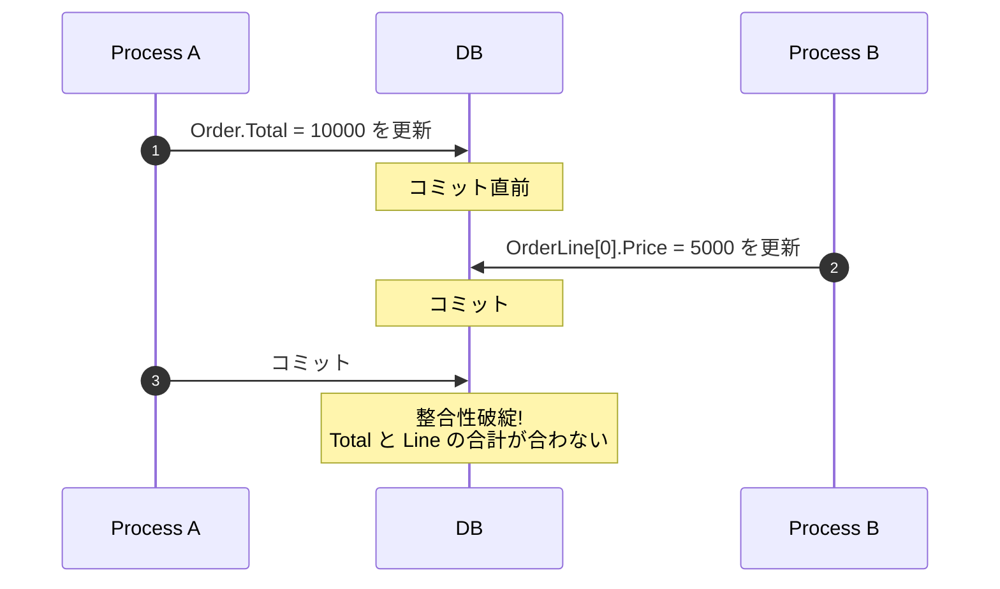
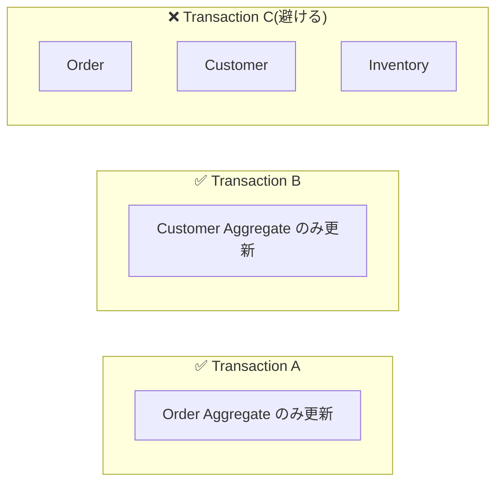
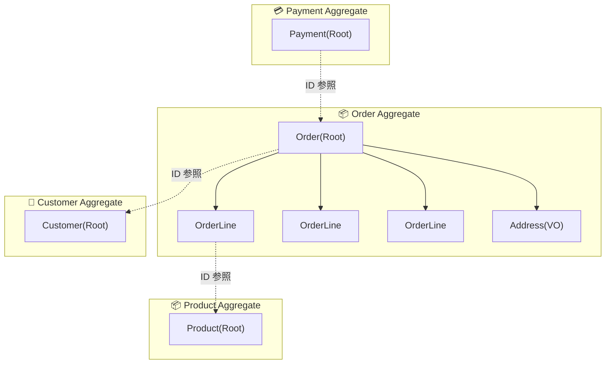
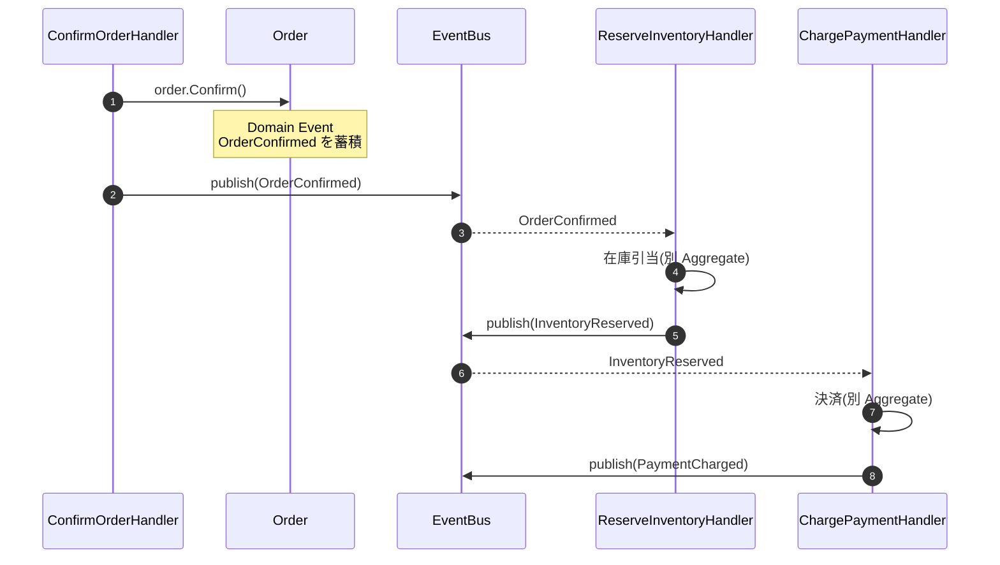
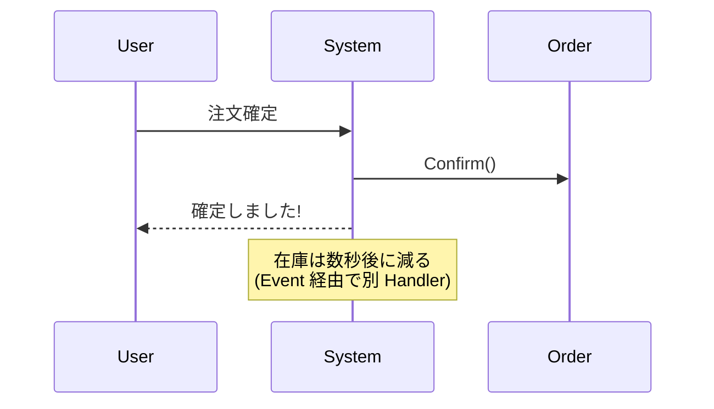
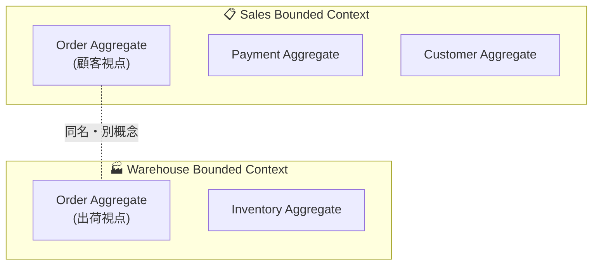

# 第 9 章 — Aggregate 境界の引き方

> **この章のゴール**
> - Aggregate を **「トランザクション境界 + 整合性保証範囲」** として捉えられるようになる
> - Vaughn Vernon の "Effective Aggregate Design" 4 ルール を再現できる
> - 「Aggregate を大きくしすぎた / 小さくしすぎた」両方の失敗パターンを避けられる
> - Aggregate 間の参照は **ID 参照** で行う具体パターンを身につける

---

## 9.1 Aggregate とは何か(再掲 + 深掘り)

第 3 章でも触れたが、Aggregate は **データの整合性を保証する境界線** だ[^aggregate].

[^aggregate]: Eric Evans, *Domain-Driven Design*, Chapter 6 "AGGREGATES". Vaughn Vernon, "Effective Aggregate Design", 3 part series, 2011: https://www.dddcommunity.org/library/vernon_2011/ — 実装上の事実上の標準ガイド。

### 整合性とは何か

「Order の合計金額は、必ず OrderLine の合計と一致する」 — これが不変条件 (Invariant) の一例だ。Order と OrderLine が **別々のトランザクション** で更新できるとしたら、この整合性は壊れる。



Aggregate は **「このグループは 1 つのトランザクションで一緒に更新される」** という単位を表す。Vernon 流に言えば「**Consistency Boundary** (整合性境界)」だ。

---

## 9.2 Vernon の "Effective Aggregate Design" 4 ルール

Vaughn Vernon が 2011 年に *IEEE Software* に投稿した 3 部作の論文[^vernon-aggregate-1][^vernon-aggregate-2][^vernon-aggregate-3] が、現在の Aggregate 設計の事実上の標準だ。

[^vernon-aggregate-1]: Vaughn Vernon, "Effective Aggregate Design Part I: Modeling a Single Aggregate", 2011. https://www.dddcommunity.org/library/vernon_2011/
[^vernon-aggregate-2]: Vaughn Vernon, "Effective Aggregate Design Part II: Making Aggregates Work Together", 2011.
[^vernon-aggregate-3]: Vaughn Vernon, "Effective Aggregate Design Part III: Gaining Insight Through Discovery", 2011.

### ルール 1 — 真の不変条件を保護する

「同じトランザクションで一緒に守らなければならないルール」だけが Aggregate 内にあるべき。

```csharp
// ❌ 大きすぎる Aggregate
public sealed class Customer
{
    public CustomerId Id { get; }
    public List<Order> Orders { get; }    // ← 顧客が持つ全注文を内部に持つ?
    public List<Address> Addresses { get; }
    public CreditScore Score { get; }
}

// ✅ 小さく保つ
public sealed class Customer
{
    public CustomerId Id { get; }
    public List<Address> Addresses { get; }  // 顧客の付属物
    public CreditScore Score { get; }
    // Orders は別 Aggregate(ID で参照する)
}

public sealed class Order
{
    public OrderId Id { get; }
    public CustomerId CustomerId { get; }   // ← ID 参照のみ
    public List<OrderLine> Lines { get; }
}
```

「顧客が持つ全注文」を 1 トランザクションで更新する業務操作はほぼ無い。だから別 Aggregate に分ける。

### ルール 2 — 小さな Aggregate を設計する

Vernon は明確に推奨している:

> Use small Aggregates. As a general rule, modeling small Aggregates is preferred.
> (小さな Aggregate を使いなさい。原則として、小さな Aggregate のモデリングが好ましい。)
> — Vernon, "Effective Aggregate Design Part I"

理由:

| 効果 | 大きい Aggregate | 小さい Aggregate |
| --- | --- | --- |
| トランザクション競合 | 多発(同じ Order でも別ユーザが触れない) | 少ない |
| ロック範囲 | 広い | 狭い |
| メモリフットプリント | 重い | 軽い |
| 並行性 | 低い | 高い |

### ルール 3 — Aggregate 間は ID で参照する

```csharp
// ❌ オブジェクト参照(やめる)
public sealed class Order
{
    public Customer Customer { get; }  // ← 別 Aggregate のオブジェクトを持つ
    // → Order を読むたびに Customer も読まれる
    // → どちらをトランザクションで更新するのか曖昧
}

// ✅ ID 参照
public sealed class Order
{
    public CustomerId CustomerId { get; }  // ← ID のみ
}
```

別 Aggregate のデータが必要なときは、Repository で別に読む。

```csharp
// Handler 側
var order = await orderRepo.GetByIdAsync(cmd.OrderId, ct);
var customer = await customerRepo.GetByIdAsync(order.CustomerId, ct);
```

### ルール 4 — 1 トランザクション = 1 Aggregate



複数 Aggregate にまたがる更新が必要な場合、**Domain Event で非同期に伝播** させる(Eventual Consistency)。

---

## 9.3 「Order と OrderLine は同じ Aggregate、Order と Payment は別」

なぜか?を、ルール 1(真の不変条件)で説明する。

### Order と OrderLine

- **不変条件**: `Order.Total == Sum(OrderLine.Subtotal)`
- 同じトランザクションで更新が必要
- → **同じ Aggregate**(Order が Root)

### Order と Payment

- **不変条件はあるか?** — 「Order.Total == Payment.Amount」?
- 実は **必ずしも一致しない**(分割払い・部分返金・後払いなど)
- 同じトランザクションで更新する必要が **常にはない**
- → **別 Aggregate**(Order ID で参照)

### Order と Customer

- **不変条件はあるか?** — 「Customer が削除されたら Order も削除」?
- これは **削除制約**であって、整合性条件ではない(Cascade Delete でも DB レベルで実現可能)
- 同じトランザクションで更新する必要は無い
- → **別 Aggregate**(Customer ID で参照)



---

## 9.4 Aggregate を大きくしすぎた失敗パターン

### 症状 1 — トランザクション失敗が頻発する

```csharp
// ❌ Customer が全注文を内部に持つ巨大 Aggregate
public sealed class Customer
{
    public List<Order> Orders { get; } = new();
    public List<Review> Reviews { get; } = new();
}

// 1 つの Order の Status を変えるたびに Customer 全体を保存
customer.Orders.First(o => o.Id == orderId).MarkAsFulfilled();
await customerRepo.SaveAsync(customer);  // ← Customer 全体ロック
```

複数ユーザが別々の Order を同時に更新すると **書き込み衝突** が頻発する。EF Core の Optimistic Concurrency で例外が出まくる。

### 症状 2 — 1 Aggregate 取得で大量データロード

```csharp
var customer = await customerRepo.GetByIdAsync(customerId);
// ↑ この 1 行で 1 顧客 + 全注文(5000 件) + 全レビュー(200 件) がロードされる
// → メモリ爆発 + クエリ遅延
```

### 症状 3 — 整合性が "嘘" になる

「Customer に閉じた整合性」のはずが、実は別ユースケースが Customer.Orders に追加するので、データが古いまま動作する。

---

## 9.5 Aggregate を小さくしすぎた失敗パターン

逆に小さすぎると、本来同期で守るべき整合性が破綻する。

### 症状 — Order と OrderLine を別 Aggregate にする

```csharp
// ❌ OrderLine を別 Aggregate にすると…
public sealed class Order { /* Lines を持たない */ }
public sealed class OrderLine { public OrderId OrderId { get; } }

// → "Order.Total = Sum(Lines.Subtotal)" の整合性が壊れる
// → Order を Confirmed にしたあと OrderLine を増やせる(本来禁止)
```

**Order の Status と OrderLine の追加削除は同じトランザクションで守るべき** 不変条件がある。だから OrderLine は Order Aggregate の内部に置く。

---

## 9.6 判断のフローチャート

```mermaid
flowchart TD
    Start{Entity A と B<br/>を同じ Aggregate に<br/>するか?}
    Start --> Q1
    Q1{A の状態変更と<br/>B の状態変更が<br/>同じ TX で必須?}
    Q1 -->|Yes| Same["同じ Aggregate に"]
    Q1 -->|No| Q2
    Q2{B 単体を別文脈で<br/>更新するユースケースは?}
    Q2 -->|ある| Diff["別 Aggregate に<br/>(ID 参照)"]
    Q2 -->|ない| Q3
    Q3{B のライフサイクルは<br/>A に従属する?<br/>(A 削除で B 削除)}
    Q3 -->|Yes| Same
    Q3 -->|No| Diff
```

---

## 9.7 Aggregate Root 経由のアクセス

ルール: **外部から Aggregate の内部 Entity に直接触らない**。

```csharp
// ❌ 内部 Entity を直接触る
order.Lines[0].Quantity = 5;
order.Lines.Add(new OrderLine(...));

// ✅ Root 経由
order.UpdateLineQuantity(lineId: LineId.Of("L001"), quantity: 5);
order.AddLine(sku: Sku.Of("SKU-001"), quantity: 2);
```

### Order の責務として表現する

```csharp
public sealed class Order
{
    private readonly List<OrderLine> _lines = new();
    public IReadOnlyList<OrderLine> Lines => _lines;  // 読み取り専用で公開

    public void AddLine(Sku sku, int quantity, Money unitPrice)
    {
        if (Status is not OrderStatus.Pending)
            throw new InvalidStateTransitionException("Cannot add lines after confirmation");
        if (quantity <= 0) throw new DomainException("quantity must be positive");
        if (_lines.Any(l => l.Sku == sku)) throw new DomainException("duplicate SKU");

        _lines.Add(new OrderLine(LineId.NewId(), sku, quantity, unitPrice));
        RecalculateTotal();
    }

    public void RemoveLine(LineId lineId)
    {
        if (Status is not OrderStatus.Pending)
            throw new InvalidStateTransitionException();
        var line = _lines.FirstOrDefault(l => l.Id == lineId)
            ?? throw new DomainException("line not found");
        _lines.Remove(line);
        RecalculateTotal();
    }

    private void RecalculateTotal()
    {
        Total = _lines.Aggregate(Money.Zero("JPY"), (acc, l) => acc.Add(l.Subtotal));
    }
}
```

**`Lines` は `IReadOnlyList` で公開** + **変更操作は Root のメソッド経由のみ**。これで不変条件 `Total == Sum(Lines.Subtotal)` が常に守られる。

---

## 9.8 Aggregate 間の協調 — Domain Event で繋ぐ

複数 Aggregate にまたがる業務操作は、**Domain Event で非同期** に繋ぐのが定石だ[^saga].

[^saga]: Hector Garcia-Molina, Kenneth Salem, "Sagas", 1987. 分散トランザクションの古典的代替パターン。Chris Richardson, [Saga Pattern](https://microservices.io/patterns/data/saga.html) が現代的な解説。

### 例 — 「注文確定 → 在庫引当 → 決済」



**1 つの Handler で 3 Aggregate を更新するのではなく、Domain Event で連鎖** させる。これにより:

- 各 Handler は単一 Aggregate に集中
- 失敗時のリトライ単位が小さくなる
- 部分失敗時の補償(Compensation)を Handler ごとに書ける

---

## 9.9 Eventual Consistency の覚悟

Aggregate 境界を引くと、**境界を越えた整合性は "結果整合性 (Eventual Consistency)" になる**[^eventual].

[^eventual]: Werner Vogels, "Eventually Consistent", *Communications of the ACM*, 2009. Amazon CTO による古典的記事。

### 例 — 「注文確定後、在庫が減るまで数秒かかる」



ユーザ体験としては:
- 「確定 → 即座に在庫減」は嘘
- 「確定 → 数秒遅れて在庫減」が本当

業務側と合意する必要がある。**「秒単位で整合してなくてもいい」** ことを確認する。

「いや、注文確定と在庫減は同期で守るべき」となったら、それは別の Aggregate に分けてはいけないサインだ。1 つの Aggregate にまとめる(が、その場合スケーラビリティを犠牲にする)。

---

## 9.10 Bounded Context との関係

第 3 章で触れたが、**Bounded Context は Aggregate の "上の階層"** だ。



**同じ "Order" でも Sales BC と Warehouse BC では別物**。BC をまたぐ調整は **Domain Event + Anti-Corruption Layer** で行う[^acl].

[^acl]: Eric Evans, *Domain-Driven Design*, Chapter 14 "Maintaining Model Integrity" — "Anticorruption Layer". 他コンテキストの概念が侵食するのを防ぐ層。

---

## 9.11 Aggregate を診断する 5 つの質問

あなたの現在の Aggregate 設計を診断する質問:

1. **1 つの Aggregate を読むのに、何個のテーブルを JOIN するか?** 5 個以上ならおそらく大きすぎる
2. **同時に複数ユーザが触っても安全か?** 衝突が頻発するなら大きすぎる
3. **トランザクション内で更新する Aggregate は 1 個か?** 2 個以上ならルール違反
4. **Aggregate 間がオブジェクト参照になっていないか?** ID 参照に統一する
5. **「この 2 つは別 Aggregate」と言える明確な理由が言えるか?** 言えないなら設計の見直し

---

## 9.12 章末演習

### 演習 9.1 — Aggregate 境界を引く

EC サイトの以下の概念を、Aggregate 境界で分類せよ。同じ Aggregate / 別 Aggregate / どちらでもよい のいずれかを答え、理由を書け。

1. **Order と OrderLine**
2. **Order と ShippingAddress**(注文ごとに変えられる)
3. **Customer と CustomerAddress**(顧客が複数住所登録)
4. **Order と Payment**
5. **Product と ProductReview**
6. **Cart と CartItem**

### 演習 9.2 — 大きすぎる Aggregate を分割する

以下の `Customer` Aggregate を、Vernon の 4 ルールで分析し、分割案を出せ。

```csharp
public sealed class Customer
{
    public CustomerId Id { get; }
    public List<Order> Orders { get; } = new();      // 全注文履歴(数千件)
    public List<Review> Reviews { get; } = new();    // 投稿レビュー
    public List<Address> Addresses { get; } = new(); // 登録住所
    public CreditScore Score { get; private set; }
    public Wallet Wallet { get; }
}
```

### 演習 9.3 — 結果整合性の覚悟

あなたのプロジェクトで「これは同期で守るべきと思っていたが、実は結果整合性で良かった」ロジックを 1 つ見つけ、Domain Event で分解する設計を描く。

→ 解答は [付録 C](appendix-c-exercises) に。

---

## 9.13 まとめ

- Aggregate は **トランザクション境界 + 整合性保証範囲**
- Vernon の **4 ルール**:
  1. 真の不変条件を保護する
  2. 小さな Aggregate を設計する
  3. Aggregate 間は ID 参照
  4. 1 トランザクション = 1 Aggregate
- Order と OrderLine は同じ、Order と Customer / Payment は別
- 大きすぎる Aggregate: **競合・メモリ爆発・整合性嘘**
- Aggregate 間の協調は **Domain Event + Eventual Consistency**
- Bounded Context は **Aggregate の上の階層**

ここまでが **第 II 部 — ドメイン層を Rich にする**。
次の章から第 III 部 — Application / Infrastructure 層に入る。

→ **[第 10 章 巨大 Handler の解体](10-handler-decomposition)**
