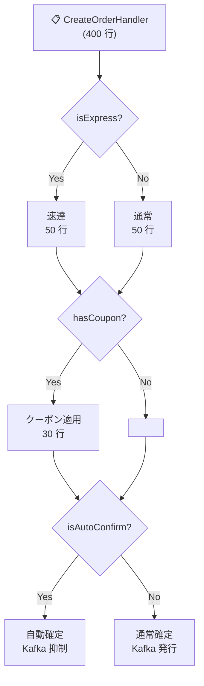
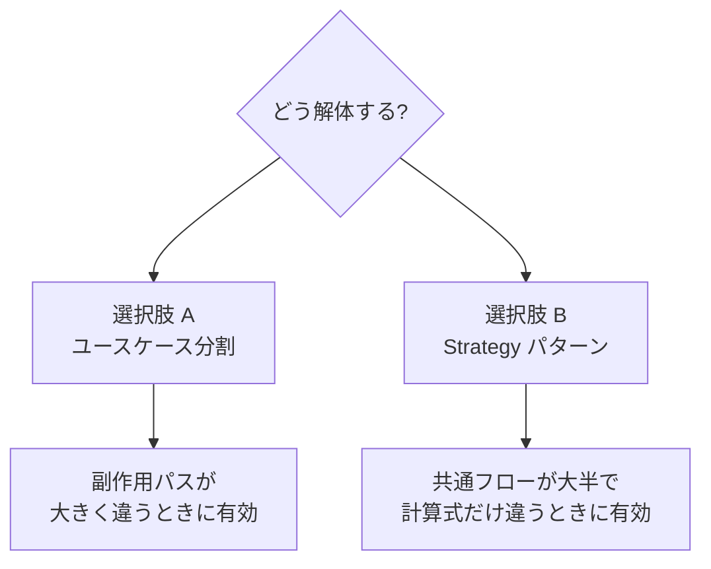
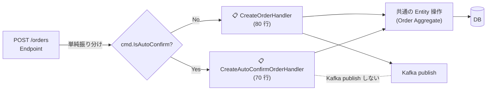
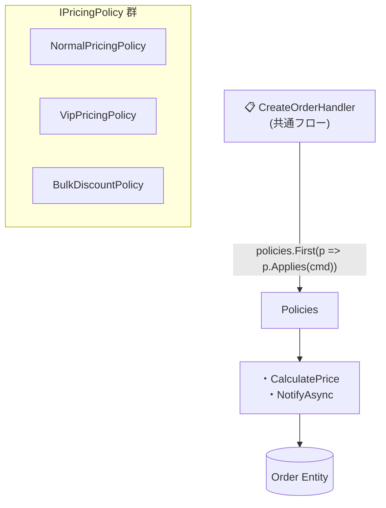

# 第 10 章 — 巨大 Handler の解体

> **この章のゴール**
> - 1 メソッド 400 行の Handler を、**ユースケース分割** か **Strategy** で解体できる
> - 「複数フラグの if が積み上がる」アンチパターンを 2 つの選択肢で直せる
> - Feature Folder スタイル(縦割り)でユースケースを表現する具体構成を身につける
> - **コマンドルーティング switch は残してよい**、を再確認する

---

## 10.1 症状 — 1 つの Handler に複数フラグが積み上がる

第 1 章で見たコードを再掲する。半年で 30 行 → 400 行に成長した `CreateOrderHandler` だ。

```csharp
public async Task<Result> HandleAsync(CreateOrderCommand cmd, CancellationToken ct)
{
    var order = factory.Create(cmd);

    if (cmd.IsExpress)
    {
        var fee = expressFeeCalculator.Calc(order);
        order.ApplyExpressFee(fee);
        await expressInventory.Reserve(order, ct);
    }
    else
    {
        await normalInventory.Reserve(order, ct);
    }

    if (cmd.HasCoupon)
    {
        var discount = couponService.Apply(cmd.CouponCode, order);
        order.ApplyDiscount(discount);
    }

    if (cmd.IsAutoConfirm)
    {
        var rate = await autoPricingService.GetRateAsync(order, ct);
        order.AutoConfirm(rate);
        // 自動承認のときは Kafka を送らない
    }
    else
    {
        await kafka.PublishAsync(new OrderCreated(order.Id), ct);
    }

    if (cmd.IsPromotion) { /* ... */ }
    if (cmd.HasGiftWrap) { /* ... */ }
    if (cmd.IsBundle)    { /* ... */ }
    // ...

    await repo.AddAsync(order, ct);
    await uow.SaveChangesAsync(ct);
    return new Result(order.Id);
}
```

### 構造図



### 何が壊れているか

| 観点 | 問題 |
| --- | --- |
| 読みやすさ | 「自動承認時の挙動が知りたい」とき 400 行を読む必要 |
| テスト容易性 | 全フラグの組み合わせ 2^N をテストする羽目に |
| PR レビュー時間 | 1 PR で 400 行差分 → レビュアー疲弊 |
| 並行開発 | フラグが衝突 → コンフリクト多発 |
| 副作用の隠蔽 | 「自動承認時 Kafka 送らない」が Handler の奥に埋もれる |
| 認知負荷 | 機能追加するたびに全 if パスを意識する必要 |

---

## 10.2 解体の 2 つの選択肢



選択基準は **「副作用がどれくらい違うか」**。

---

## 10.3 選択肢 A — ユースケース分割(推奨)

「フラグ違い」を `if` で表現せず、**異なるユースケースとして独立した Handler に分ける**。

### After A — 構造図



### After A — コード

```csharp
// === Handler 1: 通常注文(80 行) ===
public sealed class CreateOrderHandler(
    OrderFactory factory,
    IOrderRepository repo,
    IUnitOfWork uow,
    IEventBus eventBus)
{
    public async Task<Result> HandleAsync(CreateOrderCommand cmd, CancellationToken ct)
    {
        var order = await factory.CreateAsync(cmd, ct);
        await repo.AddAsync(order, ct);
        await uow.SaveChangesAsync(ct);
        await eventBus.PublishAsync(new OrderCreated(order.Id), ct);
        return new Result(order.Id);
    }
}

// === Handler 2: 自動承認注文(70 行) ===
public sealed class CreateAutoConfirmOrderHandler(
    OrderFactory factory,
    IAutoPricingService pricing,
    IOrderRepository repo,
    IUnitOfWork uow)
{
    public async Task<Result> HandleAsync(CreateAutoConfirmOrderCommand cmd, CancellationToken ct)
    {
        var order = await factory.CreateAsync(cmd, ct);
        var rate = await pricing.GetRateAsync(order, ct);
        order.AutoConfirm(rate);
        await repo.AddAsync(order, ct);
        await uow.SaveChangesAsync(ct);
        // Kafka 発行しない(これがこの Handler の意図的な副作用)
        return new Result(order.Id);
    }
}

// === Handler 3: 速達注文(90 行) ===
public sealed class CreateExpressOrderHandler(
    OrderFactory factory,
    IExpressFeeCalculator feeCalc,
    IInventoryReservation inventory,
    IOrderRepository repo,
    IUnitOfWork uow,
    IEventBus eventBus)
{
    public async Task<Result> HandleAsync(CreateExpressOrderCommand cmd, CancellationToken ct)
    {
        var order = await factory.CreateAsync(cmd, ct);
        var fee = feeCalc.Calculate(order);
        order.ApplyExpressFee(fee);
        await inventory.ReserveAsync(order, ct);
        await repo.AddAsync(order, ct);
        await uow.SaveChangesAsync(ct);
        await eventBus.PublishAsync(new ExpressOrderCreated(order.Id), ct);
        return new Result(order.Id);
    }
}
```

### Endpoint で振り分け

```csharp
endpoint.MapPost("/orders", async (CreateOrderRequest req, IServiceProvider sp, CancellationToken ct) =>
{
    if (req.IsAutoConfirm)
    {
        var handler = sp.GetRequiredService<CreateAutoConfirmOrderHandler>();
        return await handler.HandleAsync(req.ToAutoCommand(), ct);
    }
    if (req.IsExpress)
    {
        var handler = sp.GetRequiredService<CreateExpressOrderHandler>();
        return await handler.HandleAsync(req.ToExpressCommand(), ct);
    }

    var normal = sp.GetRequiredService<CreateOrderHandler>();
    return await normal.HandleAsync(req.ToCommand(), ct);
});
```

### フォルダ構成(Feature Folder スタイル)

```text
backend/src/Features/Order/
├─ Commands/
│   ├─ CreateOrderCommand.cs              # 通常注文の Command
│   ├─ CreateExpressOrderCommand.cs       # 速達の Command
│   └─ CreateAutoConfirmOrderCommand.cs   # 自動承認の Command
├─ Handlers/
│   ├─ CreateOrderHandler.cs              # 通常(80 行)
│   ├─ CreateExpressOrderHandler.cs       # 速達(90 行)
│   └─ CreateAutoConfirmOrderHandler.cs   # 自動承認(70 行・Kafka 無し)
└─ OrderEndpoints.cs                      # ルーティング層
```

これは **Clean Architecture / DDD の "Feature Folder" スタイル** だ[^feature-folder]。縦割りで 1 ユースケースが完結する。**Handler を開けば、そのユースケースの入口から出口まで全副作用が見える**。

[^feature-folder]: Jimmy Bogard, [Vertical Slice Architecture](https://jimmybogard.com/vertical-slice-architecture/), 2018. Feature Folder の現代的な解釈。

---

## 10.4 選択肢 B — Strategy パターン(共通フローが大半のとき)

「フローの大筋は同じだが、計算式や副作用の一部だけ違う」場合は Strategy のほうが綺麗。

### After B — 構造図



### After B — コード

```csharp
// Domain 層
public interface IPricingPolicy
{
    bool Applies(CreateOrderCommand cmd);
    Money CalculatePrice(Order order);
    Task NotifyAsync(Order order, CancellationToken ct);
}

public sealed class NormalPricingPolicy(IEventBus bus) : IPricingPolicy
{
    public bool Applies(CreateOrderCommand cmd) => true;  // フォールバック(最後尾)
    public Money CalculatePrice(Order order) => order.Subtotal;
    public Task NotifyAsync(Order order, CancellationToken ct) =>
        bus.PublishAsync(new OrderCreated(order.Id), ct);
}

public sealed class VipPricingPolicy(IEventBus bus) : IPricingPolicy
{
    public bool Applies(CreateOrderCommand cmd) => cmd.Customer.IsVip;
    public Money CalculatePrice(Order order) => order.Subtotal.Multiply(0.9m);  // 10% off
    public Task NotifyAsync(Order order, CancellationToken ct) =>
        bus.PublishAsync(new VipOrderCreated(order.Id), ct);
}

public sealed class BulkDiscountPolicy(IEventBus bus) : IPricingPolicy
{
    public bool Applies(CreateOrderCommand cmd) => cmd.Items.Sum(i => i.Quantity) >= 100;
    public Money CalculatePrice(Order order) => order.Subtotal.Multiply(0.85m);  // 15% off
    public Task NotifyAsync(Order order, CancellationToken ct) =>
        bus.PublishAsync(new BulkOrderCreated(order.Id), ct);
}

// Application 層 — 共通フローを 1 つに
public sealed class CreateOrderHandler(
    IEnumerable<IPricingPolicy> policies,
    OrderFactory factory,
    IOrderRepository repo,
    IUnitOfWork uow)
{
    public async Task<Result> HandleAsync(CreateOrderCommand cmd, CancellationToken ct)
    {
        var order = await factory.CreateAsync(cmd, ct);
        var policy = policies.First(p => p.Applies(cmd));

        var price = policy.CalculatePrice(order);
        order.ApplyPrice(price);
        await policy.NotifyAsync(order, ct);

        await repo.AddAsync(order, ct);
        await uow.SaveChangesAsync(ct);
        return new Result(order.Id);
    }
}

// DI 登録(順序が重要 — 特殊→一般の順)
services.AddScoped<IPricingPolicy, VipPricingPolicy>();
services.AddScoped<IPricingPolicy, BulkDiscountPolicy>();
services.AddScoped<IPricingPolicy, NormalPricingPolicy>();  // フォールバック
```

---

## 10.5 A と B の選び方

| 状況 | A: ユースケース分割 | B: Strategy |
| --- | --- | --- |
| 副作用パスが大きく違う(Kafka 送る / 送らない、別 API 叩く) | ◎ | △ |
| 計算式・少数の手順だけ違う | △ | ◎ |
| 将来 N 種類に増えそう | ◎(クラス追加) | ◎(Strategy 追加) |
| 既存 1 種類しか無いのに「将来のために」分けたい | ❌ YAGNI | ❌ YAGNI |
| ユースケース名で命名できる(`CreateAutoConfirmOrderHandler`) | ◎ | × |
| 同じ "Create Order" の中の派生 | × | ◎ |

### 判断の合言葉

> **「Handler 名で違いを表現できるか?」**
>
> - **Yes** → A(ユースケース分割)
> - **No**(同じ "Create Order" の中の派生) → B(Strategy)

---

## 10.6 Handler に残してよい if / switch

リファクタ後でも Handler に if / switch が残ることがある。**残してよい if** を整理する。

### ✅ 残してよい — コマンドルーティング

```csharp
switch (cmd.NewStatus)
{
    case OrderStatus.Fulfilled: order.MarkAsFulfilled(cmd.UserId); break;
    case OrderStatus.Failed:    order.MarkAsFailed(cmd.UserId, cmd.Reason); break;
    case OrderStatus.Cancelled: order.Cancel(cmd.UserId, cmd.Reason); break;
}
```

これは Entity のメソッドへの dispatch。業務判断ではない。

### ✅ 残してよい — 冪等性ガード

```csharp
if (order.Status == cmd.NewStatus) return Result.Ok();  // 既に同じ状態
```

「同じコマンドが二回来ても安全」を保証するためのガード。

### ✅ 残してよい — null / 不正入力ガード

```csharp
if (order is null) return Result.NotFound();
if (string.IsNullOrEmpty(cmd.UserId)) return Result.BadRequest();
```

技術的な入力検証。

### ❌ 残すと悪臭 — 業務判断

```csharp
if (order.Customer.IsVip) { /* 10% 割引 */ }   // ← Strategy へ
if (order.Total > 100000) { /* 大口処理 */ }    // ← Strategy or Entity メソッドへ
if (order.Status == "Pending") order.Status = "Confirmed";  // ← Entity メソッドへ
```

---

## 10.7 Handler 解体時の段取り

### Step 1 — フラグを棚卸し

```bash
grep -n "if (cmd\.Is\|if (cmd\.Has" backend/Features/Order/Handlers/CreateOrderHandler.cs
```

例:
- `cmd.IsExpress`
- `cmd.HasCoupon`
- `cmd.IsAutoConfirm`
- `cmd.IsPromotion`
- `cmd.HasGiftWrap`
- `cmd.IsBundle`

### Step 2 — 副作用の違いを分類

各フラグごとに副作用を表に書く:

| フラグ | 計算が変わる? | Kafka 送信? | 別 API 叩く? | 別 DB 更新? |
| --- | --- | --- | --- | --- |
| Express | ○ | ○ | ○(別在庫) | ✕ |
| Coupon | ○ | ✕ | ✕ | ✕ |
| AutoConfirm | ○ | **✕(抑制)** | ○ | ✕ |
| Promotion | ○ | ✕ | ✕ | ✕ |

「Kafka 送信」や「別 API」のように副作用が大きいフラグ → A(分割)
「計算だけ違う」フラグ → B(Strategy)

### Step 3 — A と B の混合採用

実務では A と B を併用することが多い。

```text
CreateOrderHandler.cs          # 通常 + Coupon + Promotion (B: Strategy 内包)
CreateExpressOrderHandler.cs   # 速達(A: 分割)
CreateAutoConfirmOrderHandler.cs  # 自動承認(A: 分割)
```

### Step 4 — テストを先に書く

リファクタの前に、現状の振る舞いを保証するテストを書く。

```csharp
[Fact]
public async Task IsAutoConfirm_では_Kafka_を発行しない()
{
    var bus = new Mock<IEventBus>();
    var handler = ...;
    await handler.HandleAsync(new CreateOrderCommand { IsAutoConfirm = true }, ct);
    bus.Verify(b => b.PublishAsync(It.IsAny<OrderCreated>(), It.IsAny<CancellationToken>()),
        Times.Never);
}
```

リファクタ後にこのテストが通れば、副作用を壊していない証拠になる[^char-test].

[^char-test]: Michael Feathers, *Working Effectively with Legacy Code*, Prentice Hall, 2004. "Characterization Tests" — レガシーコードの現在の振る舞いを保証するテスト手法。

---

## 10.8 MediatR / Mediator Pattern について

C# 界隈では `MediatR` を使って Handler を整理することが多い[^mediatr].

[^mediatr]: Jimmy Bogard, [MediatR](https://github.com/jbogard/MediatR). .NET の Mediator パターン実装。

```csharp
public sealed record CreateOrderCommand(...) : IRequest<Result>;

public sealed class CreateOrderHandler(...) : IRequestHandler<CreateOrderCommand, Result>
{
    public Task<Result> Handle(CreateOrderCommand cmd, CancellationToken ct) { /* ... */ }
}
```

**MediatR は本書の本質と直交している**。MediatR を使っても使わなくても、本書の主張(ユースケース分割 / Strategy)は同じく適用できる。

ただし MediatR の `Behavior` (Pipeline) は **横断関心(logging / validation / retry)** を綺麗に挟むのに便利。

---

## 10.9 章末演習

### 演習 10.1 — 解体方針を判断

以下の Handler について、A(ユースケース分割)/ B(Strategy) のどちらが適切か判定し、理由を書け。

```csharp
public async Task ChargePaymentHandler(...)
{
    if (cmd.PaymentMethod == "CreditCard") { await stripeClient.ChargeAsync(...); }
    else if (cmd.PaymentMethod == "PayPay") { await payPayClient.ChargeAsync(...); }
    else if (cmd.PaymentMethod == "BankTransfer") { await sendInvoiceEmail(...); }
    // CreditCard と PayPay は即時課金、BankTransfer は請求書発送
}
```

### 演習 10.2 — Strategy で書き換える

以下を Strategy パターンで書き換えよ。

```csharp
public Money CalculateDeliveryFee(Order order)
{
    if (order.Customer.IsPremium) return Money.Zero();
    if (order.Total > 5000) return Money.Zero();
    if (order.Region == "Tokyo") return Money.Yen(500);
    if (order.Region == "Osaka") return Money.Yen(600);
    return Money.Yen(800);
}
```

### 演習 10.3 — フラグを棚卸し

あなたのプロジェクトで最も大きい Handler を 1 つ選び、フラグ棚卸しテーブル(10.7 節)を作成する。A / B / 混合 のどれを採用するか決める。

→ 解答は [付録 C](appendix-c-exercises) に。

---

## 10.10 まとめ

- 巨大 Handler は **副作用の違い** で分類する
- 解体の 2 つの選択肢:
  - **A: ユースケース分割**(Feature Folder スタイル、副作用が大きく違うとき)
  - **B: Strategy パターン**(共通フローで計算式が違うとき)
- 判断: **Handler 名で違いを表現できるか?**
- Handler に残してよい if: コマンドルーティング / 冪等性ガード / 入力検証
- Handler に残すと悪臭の if: 業務判断
- **リファクタ前にテストを書く**(Characterization Tests)

次の章では、Application 層が依存する Repository の設計を扱う。

→ **[第 11 章 Repository 設計の落とし穴](11-repository-design)**
