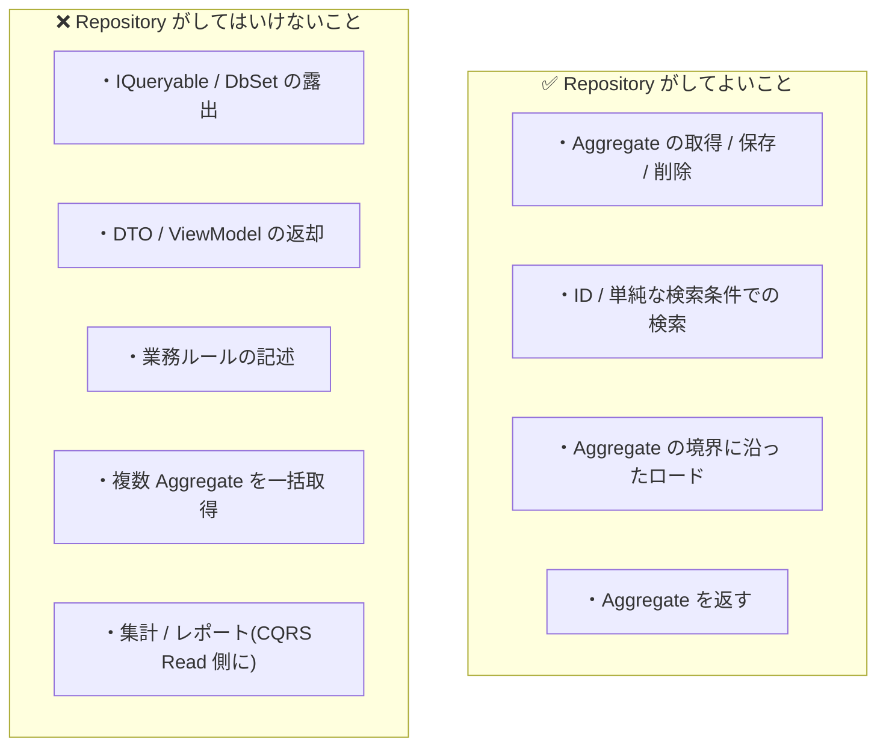
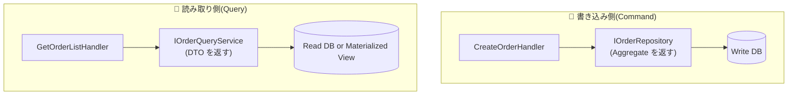

# 第 11 章 — Repository 設計の落とし穴

> **この章のゴール**
> - Repository を **「Aggregate のコレクションのように振る舞う interface」** として理解する
> - 4 つの典型アンチパターン(`IQueryable` 漏洩 / God Repository / DTO 返却 / 業務ロジック混入)を識別できる
> - CQRS の Read モデルと Repository の関係を整理する
> - EF Core / Dapper / Prisma で Repository を実装する具体パターンを持つ

---

## 11.1 Repository の本質 — Fowler の定義

> Mediates between the domain and data mapping layers using a collection-like interface for accessing domain objects.
> (ドメイン層とデータマッピング層の間を、ドメインオブジェクトにアクセスするためのコレクション風 interface で橋渡しする。)
> — Martin Fowler, *Patterns of Enterprise Application Architecture*, 2002[^repo-eaa]

[^repo-eaa]: Martin Fowler, *Patterns of Enterprise Application Architecture*, Addison-Wesley, 2002. Repository パターンの章。

**キーワードは "コレクション風"**。`List<Order>` を扱うかのような感覚で Aggregate を扱える、というのが Repository の心。

```csharp
// 理想形
public interface IOrderRepository
{
    Task<Order?> GetByIdAsync(OrderId id, CancellationToken ct);
    Task AddAsync(Order order, CancellationToken ct);
    Task RemoveAsync(Order order, CancellationToken ct);
    Task<IReadOnlyList<Order>> FindByCustomerAsync(CustomerId customerId, CancellationToken ct);
}
```

これだけ。`GetByIdAsync`, `AddAsync` — まるで `Dictionary<OrderId, Order>` を触っている感覚。

---

## 11.2 4 つの典型アンチパターン

### アンチパターン 1 — `IQueryable` を露出する

```csharp
// ❌ NG
public interface IOrderRepository
{
    IQueryable<Order> Query();
}

// 利用側
var orders = repo.Query()
    .Where(o => o.Status == "Confirmed")
    .Where(o => o.Total > 1000)
    .OrderByDescending(o => o.ConfirmedAt)
    .ToListAsync();
```

**何が悪いか**:

| 観点 | 影響 |
| --- | --- |
| 抽象の漏洩 | `IQueryable` は EF Core(Linq Provider)の概念。Domain が EF Core を知ることになる |
| テスト不能 | `IQueryable` を Mock するのが極めて困難 |
| クエリの所在不明 | クエリが各 Handler に散らばる |
| 業務判断の漏洩 | `Status == "Confirmed"` が Handler 側で書かれる(第 2 章で見たアンチパターン) |

**修正**: 専用メソッドに切り出す。

```csharp
public interface IOrderRepository
{
    Task<IReadOnlyList<Order>> FindActiveByCustomerAsync(CustomerId customerId, CancellationToken ct);
    Task<IReadOnlyList<Order>> FindRecentlyConfirmedAsync(int limit, CancellationToken ct);
}
```

### アンチパターン 2 — God Repository

```csharp
// ❌ NG — メソッド 30 個の Repository
public interface IOrderRepository
{
    Task<Order?> GetByIdAsync(OrderId id, CancellationToken ct);
    Task<IReadOnlyList<Order>> FindByCustomerAsync(...);
    Task<IReadOnlyList<Order>> FindByDateRangeAsync(...);
    Task<IReadOnlyList<Order>> FindByStatusAsync(...);
    Task<IReadOnlyList<Order>> FindByProductAsync(...);
    Task<IReadOnlyList<Order>> FindActiveAsync(...);
    Task<IReadOnlyList<Order>> FindFulfilledLastMonthAsync(...);
    Task<IReadOnlyList<Order>> FindByDeliveryAddressAsync(...);
    Task<int> CountByCustomerAsync(...);
    Task<decimal> SumTotalByMonthAsync(...);
    // ... 続く
    Task<IReadOnlyList<OrderReportRow>> GetMonthlySummaryAsync(...);  // ← Order じゃない型!
}
```

**何が悪いか**:

- interface が肥大化 → Mock も肥大化
- **Aggregate を返さないメソッド(集計など)が混入** する
- 1 ファイルが 200 行越え

**修正**: 関心ごとに interface を分割する(**Interface Segregation Principle**[^isp]).

[^isp]: Robert C. Martin, *Clean Architecture*, Chapter 10 "ISP: The Interface Segregation Principle".

```csharp
// Aggregate の永続化(これだけ Domain に置く)
public interface IOrderRepository
{
    Task<Order?> GetByIdAsync(OrderId id, CancellationToken ct);
    Task AddAsync(Order order, CancellationToken ct);
    Task<IReadOnlyList<Order>> FindByCustomerAsync(CustomerId customerId, CancellationToken ct);
}

// 集計用 Query Service(別 interface、CQRS の Read 側)
public interface IOrderReportingService
{
    Task<MonthlyOrderSummary> GetMonthlySummaryAsync(int year, int month, CancellationToken ct);
    Task<int> CountByCustomerAsync(CustomerId customerId, CancellationToken ct);
}
```

### アンチパターン 3 — DTO を返す Repository

```csharp
// ❌ NG
public interface IOrderRepository
{
    Task<OrderDto> GetByIdAsync(OrderId id, CancellationToken ct);
    // ↑ Aggregate ではなく DTO を返す
}

public sealed class OrderDto
{
    public string Id { get; set; }
    public string Status { get; set; }    // string!
    public decimal Total { get; set; }    // 通貨なし!
    public List<OrderLineDto> Lines { get; set; }
}
```

**何が悪いか**:

- Aggregate を返さないので **業務ロジックを呼べない**(`dto.Confirm()` できない)
- 利用側で DTO → Aggregate の手動マッピングが必要
- 「Aggregate のコレクション」という Repository の本質から乖離

**修正**: Aggregate を返す。

```csharp
public interface IOrderRepository
{
    Task<Order?> GetByIdAsync(OrderId id, CancellationToken ct);  // ← Aggregate を返す
}
```

DTO は **API のレスポンス用 / View 用** に Presentation 層で作る。Repository では扱わない。

### アンチパターン 4 — 業務ロジックを Repository に書く

第 2 章で見たパターン。再掲する。

```csharp
// ❌ NG
public async Task<Order> GetActiveOrderAsync(string customerId)
{
    var orders = await db.Orders
        .Where(o => o.CustomerId == customerId)
        .Where(o => o.Status == "Confirmed" || o.Status == "Processing")  // ← 業務判断
        .Where(o => o.TotalAmount > 0)                                     // ← 業務判断
        .ToListAsync();
    return orders.OrderByDescending(o => o.ConfirmedAt).First();
}
```

**何が悪いか**: 「Active な注文とは何か」の定義が Repository に埋まる。

**修正**: 業務ルールを Domain に引き上げる(第 2 章参照)。

```csharp
public sealed class Order
{
    public bool IsActive => Status.IsActive && Total.IsPositive;
}

public async Task<Order?> GetActiveOrderAsync(CustomerId customerId, CancellationToken ct)
{
    var all = await FindByCustomerAsync(customerId, ct);
    return all.Where(o => o.IsActive).OrderByDescending(o => o.ConfirmedAt).FirstOrDefault();
}
```

---

## 11.3 Repository が **してよいこと** / **してはいけないこと**



---

## 11.4 CQRS との関係 — 書き込みと読み取りを分ける

複雑な読み取り(集計・レポート・検索) は Repository から切り離す。これが **CQRS (Command Query Responsibility Segregation)**[^cqrs].

[^cqrs]: Martin Fowler, [CQRS](https://martinfowler.com/bliki/CQRS.html), 2011. 元々は Greg Young の用語。



### Write 側 — Repository

```csharp
public interface IOrderRepository
{
    Task<Order?> GetByIdAsync(OrderId id, CancellationToken ct);
    Task AddAsync(Order order, CancellationToken ct);
}
```

Aggregate を返す。業務操作のための一貫した読み取り。

### Read 側 — Query Service

```csharp
public interface IOrderQueryService
{
    Task<IReadOnlyList<OrderListItem>> SearchAsync(OrderSearchCriteria criteria, CancellationToken ct);
    Task<OrderDetailView?> GetDetailAsync(OrderId id, CancellationToken ct);
}

public sealed record OrderListItem(
    string Id, string CustomerName, decimal Total, string Status, DateTime CreatedAt);

public sealed record OrderDetailView(/* 表示用フィールド */);
```

DTO を返す。**SQL を生で書いたり、Read 用のテーブル / View を別に持つことも可能**。

### 効果

- 書き込み側は Aggregate 整合性に集中
- 読み取り側は表示要件に最適化(JOIN・集計・Denormalize)
- 互いに干渉しない

---

## 11.5 EF Core での実装パターン

### Repository 実装の例

```csharp
public sealed class OrderRepository(AppDbContext db) : IOrderRepository
{
    public async Task<Order?> GetByIdAsync(OrderId id, CancellationToken ct)
    {
        return await db.Orders
            .Include(o => o.Lines)              // Aggregate 内部はロード
            .FirstOrDefaultAsync(o => o.Id == id, ct);
    }

    public Task AddAsync(Order order, CancellationToken ct)
    {
        db.Orders.Add(order);
        return Task.CompletedTask;  // SaveChanges は UnitOfWork で
    }

    public async Task<IReadOnlyList<Order>> FindByCustomerAsync(
        CustomerId customerId, CancellationToken ct)
    {
        return await db.Orders
            .Include(o => o.Lines)
            .Where(o => o.CustomerId == customerId)
            .ToListAsync(ct);
    }
}
```

### Unit of Work

```csharp
public interface IUnitOfWork
{
    Task SaveChangesAsync(CancellationToken ct);
}

public sealed class UnitOfWork(AppDbContext db) : IUnitOfWork
{
    public Task SaveChangesAsync(CancellationToken ct) => db.SaveChangesAsync(ct);
}
```

**Repository は `Add` するだけ、`SaveChanges` は UoW** という分業。Handler が UoW を 1 回呼べばトランザクション 1 つで複数操作をコミットできる。

### EF Core の DbContext は既に UoW

実は `DbContext` 自体が Unit of Work パターンを実装している[^efcore-uow].

[^efcore-uow]: Microsoft Learn, [DbContext as a Unit of Work](https://learn.microsoft.com/en-us/ef/core/saving/). DbContext は Identity Map + UoW を実装している。

```csharp
// 実は DbContext を直接 inject しても良い
public sealed class ConfirmOrderHandler(IOrderRepository repo, AppDbContext db)
{
    public async Task HandleAsync(...)
    {
        var order = await repo.GetByIdAsync(cmd.OrderId, ct);
        order.Confirm();
        await db.SaveChangesAsync(ct);  // ← UoW commit
    }
}
```

ただし「Domain 層 / Application 層が EF Core を知る」のは依存方向の観点から良くない。だから `IUnitOfWork` interface で覆うのが多い。

---

## 11.6 Dapper との併用

EF Core は書き込み側(Aggregate ロード)に向くが、複雑な集計・検索には遅い。**Read 側だけ Dapper を使う**のは合理的なパターンだ。

```csharp
// Write 側 — EF Core Repository
public sealed class OrderRepository(AppDbContext db) : IOrderRepository { /* ... */ }

// Read 側 — Dapper Query Service
public sealed class OrderQueryService(IDbConnection conn) : IOrderQueryService
{
    public async Task<IReadOnlyList<OrderListItem>> SearchAsync(
        OrderSearchCriteria criteria, CancellationToken ct)
    {
        const string sql = @"
            SELECT o.id, c.name AS customer_name, o.total, o.status, o.created_at
            FROM orders o
            JOIN customers c ON c.id = o.customer_id
            WHERE o.status = ANY(@statuses)
              AND o.created_at >= @from
            ORDER BY o.created_at DESC
            LIMIT @limit";

        var items = await conn.QueryAsync<OrderListItem>(sql, new
        {
            statuses = criteria.Statuses.Select(s => s.Value).ToArray(),
            from = criteria.FromDate,
            limit = criteria.Limit,
        });
        return items.ToList();
    }
}
```

**書き込み = EF Core、読み取り = Dapper** はモダンな .NET 設計の定番[^dapper-ef].

[^dapper-ef]: Jimmy Bogard, ["Hybrid Persistence with EF Core and Dapper"](https://jimmybogard.com/hybrid-persistence-with-ef-core-and-dapper/), 2017.

---

## 11.7 TypeScript / Prisma での Repository

```typescript
// Domain 層
export interface OrderRepository {
  getById(id: OrderId): Promise<Order | null>;
  add(order: Order): Promise<void>;
  findByCustomer(customerId: CustomerId): Promise<Order[]>;
}

// Infrastructure 層
import { PrismaClient } from "@prisma/client";

export class PrismaOrderRepository implements OrderRepository {
  constructor(private readonly prisma: PrismaClient) {}

  async getById(id: OrderId): Promise<Order | null> {
    const row = await this.prisma.order.findUnique({
      where: { id: id.value },
      include: { lines: true },
    });
    return row ? this.toAggregate(row) : null;
  }

  async add(order: Order): Promise<void> {
    await this.prisma.order.create({
      data: {
        id: order.id.value,
        customerId: order.customerId.value,
        status: order.status,
        total: order.total.amount,
        currency: order.total.currency,
        lines: { create: order.lines.map(l => ({ /* ... */ })) },
      },
    });
  }

  private toAggregate(row: any): Order {
    // Prisma の row → Order Aggregate への手動マッピング
    return Order.reconstruct(/* ... */);
  }
}
```

Prisma は EF Core ほど ORM らしくないので、**Aggregate ↔ Row のマッピングを Repository が担う**。

---

## 11.8 テスト戦略

Repository は外部依存(DB) があるので、**統合テスト** が必要。

### 統合テスト(Testcontainers)

```csharp
public class OrderRepositoryTests : IAsyncLifetime
{
    private readonly PostgreSqlContainer _db = new PostgreSqlBuilder()
        .WithImage("postgres:16")
        .Build();

    public async Task InitializeAsync()
    {
        await _db.StartAsync();
        // マイグレーション実行
    }

    [Fact]
    public async Task GetById_は_保存した_Order_を返す()
    {
        using var ctx = new AppDbContext(_db.GetConnectionString());
        var repo = new OrderRepository(ctx);
        var order = OrderTestFactory.CreatePending();

        await repo.AddAsync(order, default);
        await ctx.SaveChangesAsync();

        var loaded = await repo.GetByIdAsync(order.Id, default);
        Assert.NotNull(loaded);
        Assert.Equal(order.Id, loaded.Id);
    }
}
```

**Mock では DB の制約や同時実行を再現できない**。Testcontainers で本物の DB を立てる[^testcontainers].

[^testcontainers]: [Testcontainers](https://testcontainers.com/). コンテナで本物の外部依存を起動するライブラリ。.NET / TypeScript / Java / Go など対応。

### Mock Repository(Unit テストで Handler を試すとき)

```csharp
public sealed class InMemoryOrderRepository : IOrderRepository
{
    private readonly Dictionary<OrderId, Order> _orders = new();

    public Task<Order?> GetByIdAsync(OrderId id, CancellationToken ct) =>
        Task.FromResult(_orders.GetValueOrDefault(id));

    public Task AddAsync(Order order, CancellationToken ct)
    {
        _orders[order.Id] = order;
        return Task.CompletedTask;
    }
    // ...
}
```

**インメモリ実装** を 1 個書いておくと、Handler の単体テストが楽になる。

---

## 11.9 Repository 設計の最終チェックリスト

新しい Repository を作る前に確認:

- [ ] 戻り値は Aggregate Root か?(DTO ではない)
- [ ] interface のメソッド数は 7 個以下か?
- [ ] `IQueryable` を露出していないか?
- [ ] 業務ルール(Status の比較など)を書いていないか?
- [ ] 集計やレポートが混ざっていないか?
- [ ] `Include` で Aggregate 境界を越えていないか?
- [ ] テストは Testcontainers / InMemory のどちらで書くか決まっているか?

---

## 11.10 章末演習

### 演習 11.1 — God Repository の分割

以下のメソッドを、Repository / Query Service のどちらに配置するか分類せよ。

```csharp
public interface IOrderRepository
{
    Task<Order?> GetByIdAsync(OrderId id);
    Task AddAsync(Order order);
    Task<IReadOnlyList<Order>> FindByCustomerAsync(CustomerId customerId);
    Task<int> CountByStatusAsync(OrderStatus status);
    Task<MonthlyOrderReport> GetMonthlyReportAsync(int year, int month);
    Task<IReadOnlyList<TopCustomer>> GetTopCustomersAsync(int limit);
    Task<Order?> GetActiveByCustomerAsync(CustomerId customerId);
    Task RemoveAsync(Order order);
}
```

### 演習 11.2 — IQueryable を排除

```csharp
// Before
public interface IOrderRepository
{
    IQueryable<Order> Query();
}

// 利用側
var recent = await repo.Query()
    .Where(o => o.Status == OrderStatus.Confirmed)
    .OrderByDescending(o => o.ConfirmedAt)
    .Take(10)
    .ToListAsync();
```

→ `Query()` を撤廃し、Domain 概念に沿った専用メソッドに置き換えよ。

### 演習 11.3 — Aggregate と Read モデルの分離

あなたのプロジェクトで「Repository が DTO を返している / 集計を返している」箇所を 1 つ見つけ、Query Service に切り出す設計を描く。

→ 解答は [付録 C](appendix-c-exercises) に。

---

## 11.11 まとめ

- Repository は **「Aggregate のコレクションのように振る舞う interface」**
- 4 つのアンチパターン:
  1. `IQueryable` の露出
  2. God Repository(30 メソッド)
  3. DTO を返す
  4. 業務ロジックを書く
- 集計・レポート・検索は **Query Service** に切り出す(CQRS)
- 書き込み = EF Core(Repository) / 読み取り = Dapper(Query Service) はモダンな定番
- テストは **Testcontainers** で実 DB / Handler テストは **InMemory** Repository
- DbContext 自体が UoW を兼ねるが、Domain が EF Core を知らないために `IUnitOfWork` で覆う

次の章では、ここまでの原則をフロントエンド(React + TypeScript) に適用する。

→ **[第 12 章 フロントエンドにも同じ原則を](12-frontend-application)**
