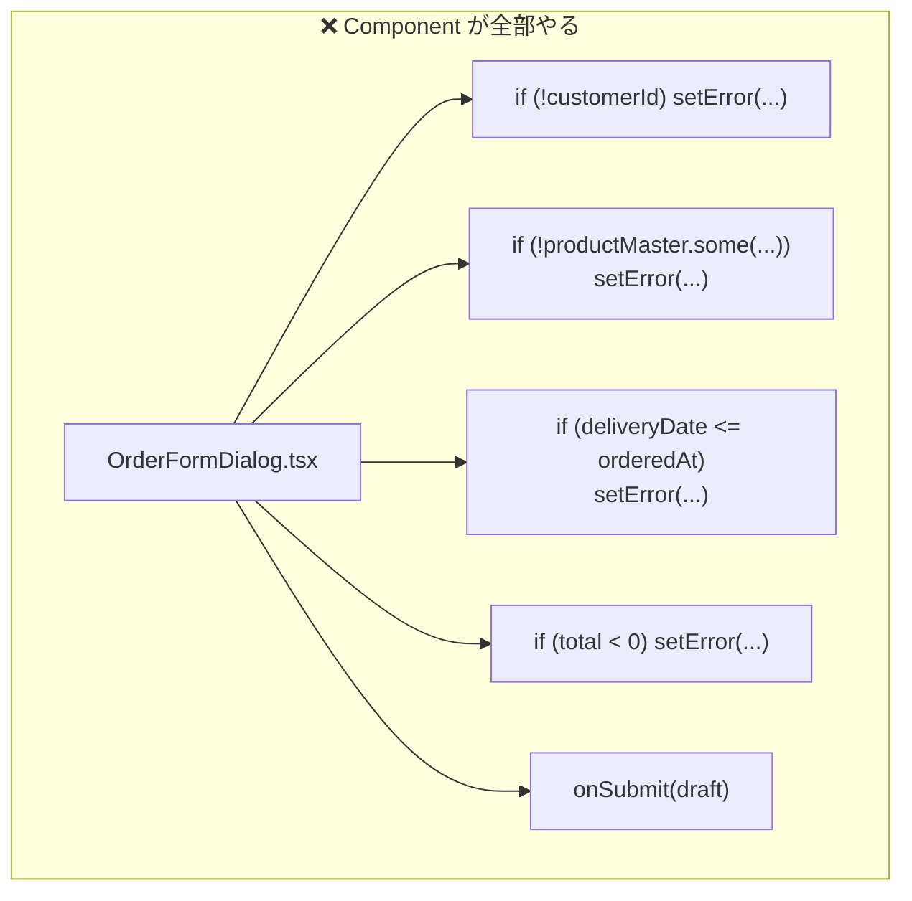
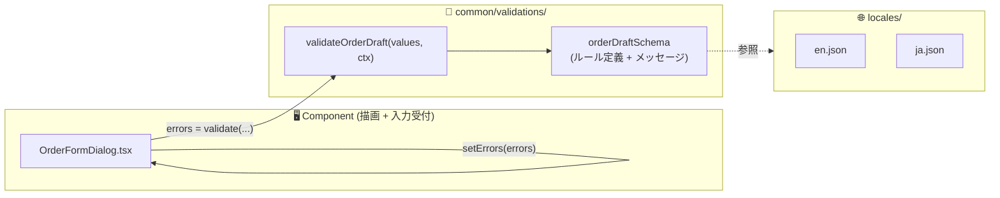
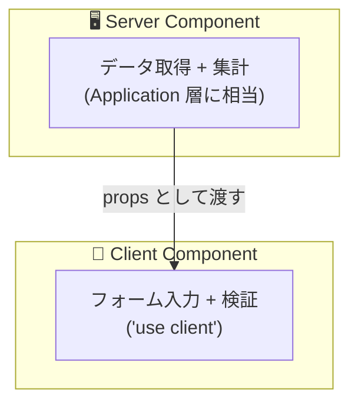

# 第 12 章 — フロントエンドにも同じ原則を

> **この章のゴール**
> - **Anemic Component** — フロントエンドにも同じ病理が存在することを認識する
> - Validation を schema(VO 相当)に集約し、Component を描画専念にできる
> - cross-field validation、マスタ参照、i18n をすべて schema 内で扱う設計を身につける
> - React + Zod / TypeScript Branded Type で実装する具体パターンを持つ

---

## 12.1 Component が if だらけになる現象

バックエンドで「Anemic Domain Model」 → 「業務ルールが Service に散らばる」 という構図があった。
フロントエンドにも全く同じ構図がある。Component が **データ容器 + イベントハンドラ** になっていて、業務ルール(検証 / マスタ参照 / 表示判定)が Component の中に散らばる。

### 症状

```tsx
// ❌ Before — OrderFormDialog.tsx (Anemic Component)
export function OrderFormDialog({ productMaster, onSubmit }: Props) {
  const [draft, setDraft] = useState<OrderDraft>({});
  const [error, setError] = useState("");

  const handleSubmit = async () => {
    if (!draft.customerId?.trim()) {
      setError("CustomerId is required");
      return;
    }
    if (!draft.itemName?.trim()) {
      setError("Item name is required");
      return;
    }
    if (!draft.items || draft.items.length === 0) {
      setError("Please select at least one item");
      return;
    }
    if (!productMaster.some(p => p.sku === draft.sku)) {
      setError(`Product ${draft.sku} is not available`);
      return;
    }
    if (draft.deliveryDate && draft.orderedAt && draft.deliveryDate <= draft.orderedAt) {
      setError("Delivery date must be after order date");
      return;
    }
    if (draft.total && draft.total < 0) {
      setError("Total must be positive");
      return;
    }

    await onSubmit(draft);
  };

  return (/* ... */);
}
```

### Before の構造図



これは **Anemic Domain Model のフロントエンド版** = **Anemic Component** だ。同じパターンを別の画面(Modal A / Form B / Admin C)でも書き直すことになる。

---

## 12.2 何が壊れているか

| 観点 | 影響 |
| --- | --- |
| **文言の所在** | i18n・仕様変更時に全 Component を grep する羽目 |
| **ルールの分散** | 同じ「マスタ存在チェック」が Modal A / Form B で再実装 |
| **テスト容易性** | Component を mount しないと検証できない |
| **集約境界** | schema が返す `errors` を後から上書き = 単一の信頼源を破壊 |
| **順序依存** | `if-return` チェインは「上から順」なので **複数エラーが同時に出せない** |
| **コンポーネント肥大化** | 1 ファイル 300 行超 |

---

## 12.3 直し方の方針 — 判定表をフロントに翻訳する

第 5 章の判定表をフロントエンド版に翻訳する。

| バックエンドの判定 | フロントの翻訳 |
| --- | --- |
| 自身の状態を触る → **Entity** | フォーム全体の状態を触る → **Form Reducer / Store** |
| 引数だけで決まる純粋計算 → **VO** | 入力値だけで決まる検証 → **schema(VO 相当)** |
| 外部依存 → **Domain Service** | マスタデータが必要 → **schema + ctx(参照データ)** |
| 全体フロー → **Application Handler** | UI イベントの段取り → **Component(描画専念)** |

### After の構造図



---

## 12.4 After — schema 集約版

### Step 1 — schema を定義(Zod)

```typescript
// common/validations/order-schema.ts
import { z } from "zod";

export const orderDraftSchema = z.object({
  customerId: z.string().min(1, { message: "errors.customerId.required" }),
  itemName: z.string().min(1, { message: "errors.itemName.required" }),
  items: z.array(z.object({
    sku: z.string().regex(/^[A-Z]{3}-\d{5}$/, { message: "errors.sku.invalid" }),
    quantity: z.number().int().positive({ message: "errors.quantity.positive" }),
  })).min(1, { message: "errors.items.atLeastOne" }),
  total: z.number().nonnegative({ message: "errors.total.nonnegative" }),
  orderedAt: z.date(),
  deliveryDate: z.date().optional(),
}).refine(
  data => !data.deliveryDate || data.deliveryDate > data.orderedAt,
  { message: "errors.deliveryDate.afterOrdered", path: ["deliveryDate"] }
);

export type OrderDraft = z.infer<typeof orderDraftSchema>;
```

### Step 2 — マスタ参照を含む検証

```typescript
// マスタ参照が必要な検証は ctx を受け取る
export function validateOrderDraftWithMaster(
  values: OrderDraft,
  ctx: { productMaster: Product[] }
): Record<string, string> {
  const errors: Record<string, string> = {};

  const schemaResult = orderDraftSchema.safeParse(values);
  if (!schemaResult.success) {
    schemaResult.error.errors.forEach(e => {
      errors[e.path.join(".")] = e.message;
    });
  }

  // マスタ参照
  values.items.forEach((item, idx) => {
    if (!ctx.productMaster.some(p => p.sku === item.sku)) {
      errors[`items.${idx}.sku`] = `errors.sku.notInMaster:${item.sku}`;
    }
  });

  return errors;
}
```

### Step 3 — i18n に文言を集約

```json
// locales/ja.json
{
  "errors": {
    "customerId": { "required": "顧客 ID は必須です" },
    "itemName":   { "required": "商品名は必須です" },
    "sku":        { "invalid": "SKU の形式が不正です", "notInMaster": "商品 {{sku}} は在庫にありません" },
    "quantity":   { "positive": "数量は 1 以上を指定してください" },
    "items":      { "atLeastOne": "少なくとも 1 つ商品を選択してください" },
    "total":      { "nonnegative": "金額は 0 以上にしてください" },
    "deliveryDate": { "afterOrdered": "配送日は注文日より後にしてください" }
  }
}
```

### Step 4 — Component を描画専念にする

```tsx
// ✅ After — OrderFormDialog.tsx (痩せた Component)
export function OrderFormDialog({ productMaster, onSubmit }: Props) {
  const { t } = useTranslation();
  const [draft, setDraft] = useState<OrderDraft>(initialDraft);
  const [errors, setErrors] = useState<Record<string, string>>({});

  const handleSubmit = async () => {
    const errs = validateOrderDraftWithMaster(draft, { productMaster });
    if (Object.keys(errs).length > 0) {
      setErrors(errs);
      return;
    }
    setErrors({});
    await onSubmit(draft);
  };

  return (
    <Dialog>
      <Field
        label={t("order.customerId")}
        value={draft.customerId}
        onChange={v => setDraft({ ...draft, customerId: v })}
        error={errors.customerId ? t(errors.customerId) : undefined}
      />
      {/* 他フィールド */}
      <Button onClick={handleSubmit}>{t("common.submit")}</Button>
    </Dialog>
  );
}
```

**Component には if が 1 つもない**(submit ハンドラの長さ 5 行)。すべての業務ルールが schema に閉じている。

---

## 12.5 効用

| 観点 | Before | After |
| --- | --- | --- |
| マスタ参照 | Component 内で `productMaster.some(...)` | schema が `ctx.productMaster` を受け取って完結 |
| cross-field 比較 | Component 内で `deliveryDate <= orderedAt` | schema の `.refine(...)` で表現 |
| 文言 | Component に直書き | i18n に集約、schema は key を返す |
| 複数エラー同時表示 | 不可能(`if-return` チェイン) | 可能(全エラーを Object で返す) |
| テスト | Component を mount | schema は純粋関数 → 単体テスト可 |
| 再利用 | 不可 | Modal / Form / Admin で同 schema |

### Schema の単体テスト(超軽量)

```typescript
import { describe, it, expect } from "vitest";
import { validateOrderDraftWithMaster } from "./order-schema";

describe("orderDraftSchema", () => {
  const validDraft = {
    customerId: "CUS-001",
    itemName: "Test",
    items: [{ sku: "ABC-12345", quantity: 1 }],
    total: 1000,
    orderedAt: new Date("2026-05-01"),
    deliveryDate: new Date("2026-05-05"),
  };
  const ctx = { productMaster: [{ sku: "ABC-12345" }] };

  it("有効な draft は errors が空", () => {
    expect(validateOrderDraftWithMaster(validDraft, ctx)).toEqual({});
  });

  it("deliveryDate が orderedAt 以前ならエラー", () => {
    const errs = validateOrderDraftWithMaster(
      { ...validDraft, deliveryDate: new Date("2026-04-30") }, ctx);
    expect(errs.deliveryDate).toContain("afterOrdered");
  });

  it("マスタに無い SKU はエラー", () => {
    const errs = validateOrderDraftWithMaster(
      { ...validDraft, items: [{ sku: "XYZ-00000", quantity: 1 }] }, ctx);
    expect(errs["items.0.sku"]).toContain("notInMaster");
  });
});
```

**React Testing Library 不要、jsdom 不要、Component mount 不要**。schema は純粋関数なので最速でテストできる。

---

## 12.6 React Hook Form と Zod の組み合わせ

実務で広く使われる組み合わせ。

```tsx
import { zodResolver } from "@hookform/resolvers/zod";
import { useForm } from "react-hook-form";

export function OrderFormDialog({ productMaster, onSubmit }: Props) {
  const { register, handleSubmit, formState: { errors } } = useForm<OrderDraft>({
    resolver: zodResolver(orderDraftSchema),
  });

  return (
    <form onSubmit={handleSubmit(onSubmit)}>
      <input {...register("customerId")} />
      {errors.customerId && <span>{errors.customerId.message}</span>}
      {/* ... */}
    </form>
  );
}
```

**Zod schema を Resolver として渡すだけ**で、検証 + エラー表示が一体で動く。

---

## 12.7 状態管理 — Redux / Zustand / Jotai

「フォーム全体の状態管理」は React の `useState` だけだと複雑になる。中規模以上では Store を使う。

### Zustand の例

```typescript
import { create } from "zustand";

type OrderFormStore = {
  draft: OrderDraft;
  errors: Record<string, string>;
  setField: <K extends keyof OrderDraft>(key: K, value: OrderDraft[K]) => void;
  validate: (ctx: { productMaster: Product[] }) => boolean;
  reset: () => void;
};

export const useOrderFormStore = create<OrderFormStore>((set, get) => ({
  draft: initialDraft,
  errors: {},
  setField: (key, value) =>
    set(state => ({ draft: { ...state.draft, [key]: value } })),
  validate: (ctx) => {
    const errors = validateOrderDraftWithMaster(get().draft, ctx);
    set({ errors });
    return Object.keys(errors).length === 0;
  },
  reset: () => set({ draft: initialDraft, errors: {} }),
}));
```

**Store は "Entity + 状態遷移メソッド" のフロント版**。`validate()` がドメインルールのゲート。

---

## 12.8 Branded Type で型を強化

第 7 章で見た branded type を、フロント側でも徹底する。

```typescript
type CustomerId = string & { readonly __brand: "CustomerId" };
type Sku = string & { readonly __brand: "Sku" };

const CustomerId = {
  of: (v: string): CustomerId => {
    if (!/^CUS-\d{6}$/.test(v)) throw new Error(`Invalid CustomerId: ${v}`);
    return v as CustomerId;
  },
};

// 関数シグネチャ
function fetchOrders(customerId: CustomerId): Promise<Order[]> { /* ... */ }

// 利用
fetchOrders(CustomerId.of("CUS-000001"));    // OK
fetchOrders("CUS-000001");                    // ❌ string は CustomerId じゃない
fetchOrders(Sku.of("ABC-12345"));             // ❌ Sku は CustomerId じゃない
```

**API の引数取り違えがフロント側でも TypeScript により弾ける**。

---

## 12.9 Server Components / RSC との関係

Next.js 13+ の React Server Components(RSC) では、Server Component と Client Component の責務が明確に分かれる。



- **Server Component**: データ取得・SSR 描画 → Application 層的役割
- **Client Component**: フォーム・対話的 UI → Presentation 層的役割

検証(schema) は **両方で使えるユーティリティ層** として共通化するのが定石。

```text
src/
├─ app/
│   └─ orders/
│       ├─ page.tsx              # Server Component(データ取得)
│       └─ OrderForm.tsx         # 'use client'(フォーム)
├─ domain/
│   └─ order/
│       ├─ schema.ts             # Zod schema(両方から import)
│       ├─ types.ts              # branded types
│       └─ logic.ts              # 純粋関数の業務ロジック
```

---

## 12.10 フロントエンド版アンチパターンチェックリスト

PR レビュー時に機械的にチェックする項目:

- [ ] Component 内に `if (!xxx) { setError("..."); return; }` の連鎖がないか?
- [ ] エラーメッセージ文字列が Component に直書きされていないか?(i18n key を使う)
- [ ] `validateDraft` の戻り値を inline で `errors[...] = ...` 上書きしていないか?
- [ ] マスタ参照が必要なら schema に `ctx` を渡すよう拡張しているか?
- [ ] Cross-field 比較を Component が直接していないか?
- [ ] 同じ業務ルール(SKU 形式・Email 形式)が複数 Component で書かれていないか?
- [ ] schema の単体テストが書かれているか?

---

## 12.11 章末演習

### 演習 12.1 — Anemic Component を schema 化

以下を schema + i18n に書き換えよ。

```tsx
const handleSubmit = async () => {
  if (!email.includes("@")) {
    setError("Email is invalid");
    return;
  }
  if (password.length < 8) {
    setError("Password must be 8 characters or more");
    return;
  }
  if (password !== passwordConfirm) {
    setError("Passwords do not match");
    return;
  }
  if (age < 18) {
    setError("Must be 18 or older");
    return;
  }
  await register({ email, password, age });
};
```

### 演習 12.2 — cross-field validation を Zod の refine で書く

「予約フォーム」で以下を表現せよ。
- `startDate` は今日以降
- `endDate` は `startDate` より後
- `endDate - startDate` は 30 日以内
- `participants` は 1-50 人

### 演習 12.3 — Branded Type の網羅

あなたのフロントエンドで `string` で扱っている ID(`userId`, `orderId`, `productId` など) を grep し、branded type 化する候補を 3 個リストアップせよ。

→ 解答は [付録 C](appendix-c-exercises) に。

---

## 12.12 まとめ

- **Anemic Component**: バックエンドの Anemic Domain Model のフロント版
- 解決: **Validation を schema に集約**、Component は描画専念
- schema は **マスタ参照(ctx)・cross-field 比較・i18n** すべてを内包できる
- 実装は **Zod + React Hook Form + i18n key** が定番
- 状態管理が複雑なら **Zustand / Jotai** で "Store = Entity" 的に書く
- **Branded Type** で API 引数の取り違えを TypeScript 型で弾く
- Server Components 時代でも schema は **両層共通のユーティリティ** として活きる

ここまでが **第 III 部 — Application / Infrastructure 層**。
次の章から第 IV 部 — 維持と進化 に入る。

→ **[第 13 章 テスト戦略 4 階層](13-test-strategy)**
