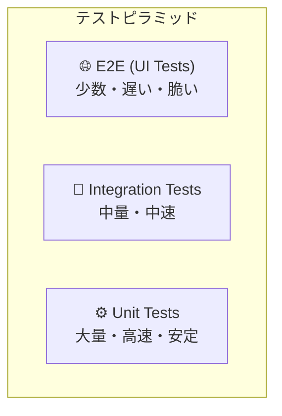
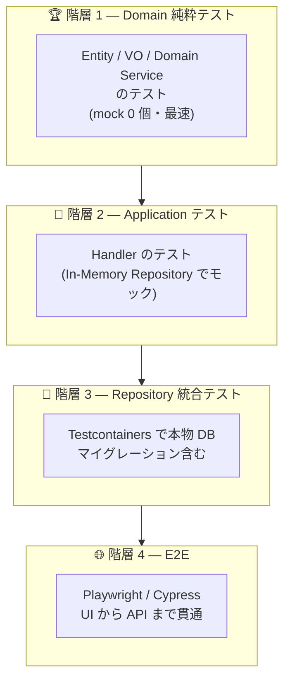
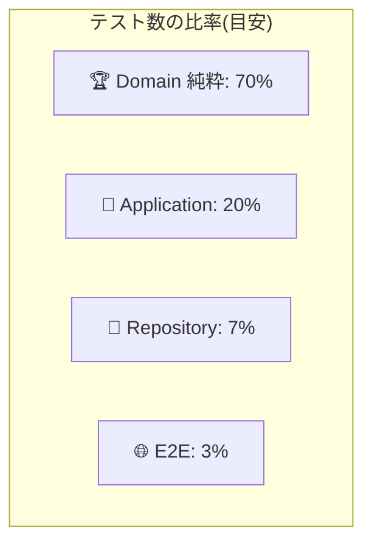

# 第 13 章 — テスト戦略 4 階層

> **この章のゴール**
> - テストを **4 階層**(Domain / Application / Repository / E2E) に分け、それぞれの役割を理解する
> - **テストピラミッド** を Clean Architecture の文脈で書き直せる
> - Entity / VO の単体テスト → Domain Service の契約テスト → Handler の統合テスト → E2E の住み分けが言える
> - Rich Domain Model の最大のごほうび — **mock 不要のテスト** を実装できる

---

## 13.1 テストピラミッド — Mike Cohn の古典

Mike Cohn が *Succeeding with Agile* (2009) で提唱した **テストピラミッド** は今もテスト戦略の基本だ[^cohn].

[^cohn]: Mike Cohn, *Succeeding with Agile: Software Development Using Scrum*, Addison-Wesley, 2009.



しかし Clean Architecture / DDD の文脈では、もう少し細かく分けたほうが現実的だ。

### 4 階層テスト戦略



| 階層 | 対象 | 速度 | 推奨カバレッジ |
| --- | --- | --- | --- |
| **1. Domain 純粋** | Entity / VO / Domain Service | ⚡ 数 ms / test | **95%+** |
| **2. Application** | Handler | 🏃 数十 ms / test | **80%+** |
| **3. Repository 統合** | Repository / DB マッピング | 🐢 数百 ms / test | **70%+** |
| **4. E2E** | UI → API → DB 貫通 | 🐌 数秒 / test | **主要シナリオ 10-20 本** |

---

## 13.2 階層 1 — Domain 純粋テスト(mock なし)

Rich Domain Model の最大のごほうび。

```csharp
public class OrderConfirmationTests
{
    [Fact]
    public void Pending_状態からは_Confirmed_へ遷移できる()
    {
        var order = OrderTestFactory.CreatePending();

        order.Confirm();

        Assert.Equal(OrderStatus.Confirmed, order.Status);
        Assert.NotNull(order.ConfirmedAt);
        Assert.Contains(order.DomainEvents, e => e is OrderConfirmed);
    }

    [Theory]
    [InlineData(OrderStatus.Confirmed)]
    [InlineData(OrderStatus.Cancelled)]
    [InlineData(OrderStatus.Fulfilled)]
    public void Pending_以外の状態からは_Confirmed_に遷移できない(OrderStatus from)
    {
        var order = OrderTestFactory.CreateWithStatus(from);
        Assert.Throws<InvalidStateTransitionException>(() => order.Confirm());
    }
}
```

**特徴**:
- ✅ Mock 0 個
- ✅ DI コンテナ立ち上げ不要
- ✅ DB 不要
- ✅ 1 テスト = 数ミリ秒
- ✅ CI で 5,000 テスト動かしても 30 秒以内

### Test Factory パターン

```csharp
public static class OrderTestFactory
{
    public static Order CreatePending(
        OrderId? id = null,
        CustomerId? customerId = null,
        Money? total = null) =>
        Order.Reconstruct(
            id ?? OrderId.Of("ORD-000000001"),
            customerId ?? CustomerId.Of("CUS-000001"),
            OrderStatus.Pending,
            total ?? Money.Yen(1000),
            createdAt: DateTime.UtcNow);

    public static Order CreateWithStatus(OrderStatus status) =>
        status switch
        {
            OrderStatus.Pending => CreatePending(),
            OrderStatus.Confirmed => CreatePending().Then(o => o.Confirm()),
            OrderStatus.Cancelled => CreatePending().Then(o => o.Cancel(UserId.Of("u"), "x")),
            _ => throw new ArgumentException()
        };
}
```

**Then 拡張**:
```csharp
public static T Then<T>(this T target, Action<T> action) { action(target); return target; }
```

これで 1 行で「Pending を Confirm した状態」が作れる。

### VO のテスト(さらに軽量)

```csharp
public class MoneyTests
{
    [Fact]
    public void 同通貨同士の加算は_合算される()
    {
        var a = Money.Yen(1000);
        var b = Money.Yen(2000);
        Assert.Equal(Money.Yen(3000), a.Add(b));
    }

    [Fact]
    public void 通貨が違うと_加算でエラー()
    {
        var jpy = Money.Yen(1000);
        var usd = new Money(10m, "USD");
        Assert.Throws<InvalidOperationException>(() => jpy.Add(usd));
    }
}
```

---

## 13.3 階層 2 — Application テスト(InMemory Repository)

Handler のテストは **本物の DB は使わない**。InMemory Repository に差し替える。

```csharp
public class ConfirmOrderHandlerTests
{
    private readonly InMemoryOrderRepository _repo = new();
    private readonly InMemoryUnitOfWork _uow = new();
    private readonly InMemoryEventBus _bus = new();

    private ConfirmOrderHandler CreateHandler() =>
        new ConfirmOrderHandler(_repo, _uow, _bus);

    [Fact]
    public async Task 存在しない_Order_は_NotFound()
    {
        var handler = CreateHandler();
        var result = await handler.HandleAsync(
            new ConfirmOrderCommand(OrderId.Of("ORD-NOTHING")), CancellationToken.None);
        Assert.Equal(ResultStatus.NotFound, result.Status);
    }

    [Fact]
    public async Task Pending_の_Order_を_Confirm_できる()
    {
        var order = OrderTestFactory.CreatePending();
        await _repo.AddAsync(order, default);

        var handler = CreateHandler();
        var result = await handler.HandleAsync(
            new ConfirmOrderCommand(order.Id), CancellationToken.None);

        Assert.True(result.IsSuccess);
        var saved = await _repo.GetByIdAsync(order.Id, default);
        Assert.Equal(OrderStatus.Confirmed, saved!.Status);
        Assert.Single(_bus.Published.OfType<OrderConfirmed>());
    }
}
```

### InMemory Repository の実装(再掲)

```csharp
public sealed class InMemoryOrderRepository : IOrderRepository
{
    private readonly Dictionary<OrderId, Order> _store = new();

    public Task<Order?> GetByIdAsync(OrderId id, CancellationToken ct) =>
        Task.FromResult(_store.GetValueOrDefault(id));

    public Task AddAsync(Order order, CancellationToken ct)
    {
        _store[order.Id] = order;
        return Task.CompletedTask;
    }
}
```

**Repository interface があるおかげで、Domain / Application は DB を知らずにテストできる**。Clean Architecture の依存方向の実利だ。

---

## 13.4 階層 3 — Repository 統合テスト(Testcontainers)

Repository 自体は、本物の DB を使ってテストする。

```csharp
public class OrderRepositoryIntegrationTests : IAsyncLifetime
{
    private readonly PostgreSqlContainer _container = new PostgreSqlBuilder()
        .WithImage("postgres:16")
        .WithDatabase("test")
        .Build();

    private AppDbContext _ctx = null!;
    private OrderRepository _repo = null!;

    public async Task InitializeAsync()
    {
        await _container.StartAsync();
        var options = new DbContextOptionsBuilder<AppDbContext>()
            .UseNpgsql(_container.GetConnectionString())
            .Options;
        _ctx = new AppDbContext(options);
        await _ctx.Database.MigrateAsync();
        _repo = new OrderRepository(_ctx);
    }

    public async Task DisposeAsync()
    {
        await _ctx.DisposeAsync();
        await _container.DisposeAsync();
    }

    [Fact]
    public async Task 保存して取得すると_Order_が一致する()
    {
        var order = OrderTestFactory.CreatePending();
        await _repo.AddAsync(order, default);
        await _ctx.SaveChangesAsync();

        _ctx.ChangeTracker.Clear();  // ← Identity Map を空にして "新しく読む" を再現

        var loaded = await _repo.GetByIdAsync(order.Id, default);
        Assert.NotNull(loaded);
        Assert.Equal(order.Status, loaded.Status);
        Assert.Equal(order.Total, loaded.Total);
    }

    [Fact]
    public async Task OrderLine_は_Order_と一緒にロードされる()
    {
        var order = OrderTestFactory.CreatePending();
        order.AddLine(Sku.Of("ABC-12345"), 2, Money.Yen(1000));
        await _repo.AddAsync(order, default);
        await _ctx.SaveChangesAsync();
        _ctx.ChangeTracker.Clear();

        var loaded = await _repo.GetByIdAsync(order.Id, default);
        Assert.Single(loaded!.Lines);
    }
}
```

**Testcontainers で本物の PostgreSQL を立てる**[^testcontainers]ことで、

- スキーマの整合性
- Value Conversion
- Owned Entity Type のマッピング
- マイグレーションの正しさ

を一気にテストできる。

[^testcontainers]: [Testcontainers for .NET](https://dotnet.testcontainers.org/). 同じ思想の TypeScript 版・Java 版・Go 版あり。

---

## 13.5 階層 4 — E2E テスト(Playwright)

UI → API → DB の貫通を確認する。**主要シナリオの 10-20 本だけ**書く。

```typescript
// e2e/order-creation.spec.ts
import { test, expect } from "@playwright/test";

test("ユーザは商品を選んで注文できる", async ({ page }) => {
  await page.goto("/login");
  await page.fill('[name="email"]', "user@example.com");
  await page.fill('[name="password"]', "password123");
  await page.click('button:has-text("ログイン")');
  await expect(page).toHaveURL("/dashboard");

  await page.click('a:has-text("商品一覧")');
  await page.click('[data-testid="add-to-cart-ABC-12345"]');
  await page.click('a:has-text("カートを見る")');
  await page.click('button:has-text("注文確定")');

  await expect(page.locator('[data-testid="order-status"]')).toHaveText("確定済み");
});
```

**E2E は脆く・遅い・高価** なので、

| 書くべき | 書くべきでない |
| --- | --- |
| ユーザがログインして注文を作る、の **happy path** | エラーメッセージの細かい文言検証 |
| 重要な業務フロー(決済・サインアップ) | フォームバリデーションの全パターン |
| 課金や法的に重要なシナリオ | 計算式のテスト |

E2E でカバーするのは **「アプリの根幹」5-20 本だけ**。あとは下位階層で。

---

## 13.6 テスト戦略の配分



| プロジェクト規模 | 階層 1 | 階層 2 | 階層 3 | 階層 4 |
| --- | --- | --- | --- | --- |
| 小規模 (3 月 / 1 人) | 50 本 | 20 本 | 10 本 | 3 本 |
| 中規模 (1 年 / 3 人) | 500 本 | 150 本 | 50 本 | 10 本 |
| 大規模 (3 年 / 10 人) | 5000 本 | 1500 本 | 300 本 | 30 本 |

**比率がピラミッドの逆になっているプロジェクトは要注意**(E2E ばかりで Unit が少ない = 遅いビルド・脆い CI)。これは Martin Fowler が "Test Ice Cream Cone" と呼んだアンチパターン[^icecream].

[^icecream]: [The Practical Test Pyramid](https://martinfowler.com/articles/practical-test-pyramid.html) by Ham Vocke, 2018. Fowler の解説。"Ice cream cone" アンチパターンに言及。

---

## 13.7 テストダブルの使い分け

> Mock を多用するテストは "脆い" — Sandi Metz[^metz]

[^metz]: Sandi Metz, *Practical Object-Oriented Design in Ruby*, Addison-Wesley, 2012. 「依存先の具体実装でなく、ロール(interface)に依存せよ。Mock するのは外向きのメッセージ(コマンド)だけ。」

### 4 種類のテストダブル(Fowler の分類[^doubles])

[^doubles]: Martin Fowler, [TestDouble](https://martinfowler.com/bliki/TestDouble.html), 2006. Gerard Meszaros の用語法を整理。

| 種類 | 役割 | 使うとき |
| --- | --- | --- |
| **Dummy** | 引数を埋めるだけ。呼ばれない | 必要だが使わない依存 |
| **Stub** | 決まった値を返すだけ | 状態を読み取る依存 |
| **Mock** | 呼び出しを検証する | 副作用(コマンド)の検証 |
| **Fake** | 動くが軽量版(InMemory DB など) | Repository / Cache |

```csharp
// Stub の例 — タイムスタンプを固定
public sealed class FixedClock(DateTime now) : IClock
{
    public DateTime UtcNow => now;
}

// Mock の例 — Event 発行を検証
var bus = new Mock<IEventBus>();
await handler.HandleAsync(cmd, ct);
bus.Verify(b => b.PublishAsync(It.IsAny<OrderConfirmed>(), It.IsAny<CancellationToken>()), Times.Once);

// Fake の例 — InMemory Repository
var repo = new InMemoryOrderRepository();
```

**Fake を多用、Mock は副作用検証だけ** が原則。Stub で済むなら Stub。

---

## 13.8 テストカバレッジの罠

カバレッジは目安だが、**100% を目指すな** ということが本書の主張だ。

| 階層 | 推奨カバレッジ | 理由 |
| --- | --- | --- |
| Domain 純粋 | **95-100%** | ロジックの本体 + 最も書きやすい |
| Application | 80% | 主要 Handler パスは網羅 |
| Repository | 70% | クエリ系は重要、CRUD は半分 |
| Web / Controllers | 50% | 重要なルートだけ |
| Infrastructure(設定・DI) | 0% でも OK | 動作確認は E2E で |

**100% を強要すると getters / setters のテストや exception path の作為的テストが増えてノイズになる**。中身があるロジックに集中する。

---

## 13.9 テストの "命名" — 業務語彙で書く

```csharp
// ❌ 技術寄りの命名
[Fact] public void Test_Method_1() { ... }
[Fact] public void Confirm_Should_Succeed() { ... }

// ✅ 業務語彙での命名(日本語可)
[Fact] public void Pending_状態の_Order_は_Confirm_できる() { ... }
[Fact] public void 既に_Cancelled_の_Order_は_Confirm_に失敗する() { ... }
[Fact] public void Confirm_すると_OrderConfirmed_イベントが発火される() { ... }
```

**テスト名がそのまま仕様書になる**。CI のレポートを開けば「このシステムは何ができるか」が読める状態が理想。

xUnit / NUnit / Vitest など、全て日本語メソッド名が使える。

---

## 13.10 フロントエンドのテスト戦略

バックエンドと同じ 4 階層が引ける。

| 階層 | フロント版 | ツール |
| --- | --- | --- |
| 1. Domain 純粋 | schema / branded type / 純粋関数 | Vitest |
| 2. Application | Component の振る舞いテスト | React Testing Library |
| 3. Integration | API + Component | Mock Service Worker(MSW) |
| 4. E2E | UI 貫通 | Playwright / Cypress |

```typescript
// 階層 1 — schema(純粋関数)
describe("orderDraftSchema", () => {
  it("有効な draft はエラーなし", () => {
    expect(orderDraftSchema.safeParse(validDraft).success).toBe(true);
  });
});

// 階層 2 — Component(描画と入力)
describe("OrderFormDialog", () => {
  it("submit 時に validate が呼ばれる", async () => {
    const onSubmit = vi.fn();
    render(<OrderFormDialog productMaster={[]} onSubmit={onSubmit} />);
    await userEvent.click(screen.getByRole("button", { name: /submit/i }));
    expect(onSubmit).not.toHaveBeenCalled();  // 入力空なので submit されない
    expect(screen.getByText(/required/i)).toBeInTheDocument();
  });
});

// 階層 3 — API モック(MSW)
beforeAll(() => server.listen());
test("注文作成 API を叩く", async () => {
  server.use(rest.post("/api/orders", (req, res, ctx) => res(ctx.json({ id: "ORD-001" }))));
  render(<App />);
  // ...
});

// 階層 4 — E2E(Playwright)
test("ユーザが注文できる", async ({ page }) => { /* ... */ });
```

---

## 13.11 CI でのテスト実行戦略

```yaml
# .github/workflows/test.yml
jobs:
  unit:
    name: "Unit Tests (1 + 2)"
    runs-on: ubuntu-latest
    steps:
      - uses: actions/checkout@v4
      - run: dotnet test --filter Category=Unit

  integration:
    name: "Integration Tests (3)"
    runs-on: ubuntu-latest
    needs: unit       # Unit 通ってから走る
    steps:
      - uses: actions/checkout@v4
      - run: dotnet test --filter Category=Integration

  e2e:
    name: "E2E (4)"
    runs-on: ubuntu-latest
    needs: integration
    if: github.event_name == 'push' && github.ref == 'refs/heads/main'  # main push 時のみ
    steps:
      - run: pnpm exec playwright test
```

**Unit はあらゆる PR で走らせる**、**Integration は PR で走らせる**、**E2E は main 時 or nightly のみ**。これでフィードバックループを早く保つ。

---

## 13.12 章末演習

### 演習 13.1 — 4 階層のどれに該当?

以下のテストが階層 1-4 のどれか分類せよ。

```csharp
1. [Fact] void Money_の_加算は_可換である() { /* ... */ }
2. [Fact] async Task CreateOrderHandler_は_注文を保存する() { /* InMemoryRepo */ }
3. [Fact] async Task OrderRepository_は_Lines_を_Include_する() { /* Testcontainers */ }
4. [Fact] async Task ユーザは_商品をカートに入れて_決済できる() { /* Playwright */ }
5. [Fact] void Order_Confirm_は_Pending以外で例外() { /* mock 0 個 */ }
```

### 演習 13.2 — Mock を Fake に置き換える

以下のテストを Fake(InMemory) を使って書き直せ。

```csharp
[Fact]
public async Task Test()
{
    var repo = new Mock<IOrderRepository>();
    var uow = new Mock<IUnitOfWork>();
    repo.Setup(r => r.GetByIdAsync(It.IsAny<OrderId>(), It.IsAny<CancellationToken>()))
        .ReturnsAsync(OrderTestFactory.CreatePending());

    var handler = new ConfirmOrderHandler(repo.Object, uow.Object);
    await handler.HandleAsync(new ConfirmOrderCommand(OrderId.Of("ORD-001")), default);

    repo.Verify(r => r.GetByIdAsync(It.IsAny<OrderId>(), It.IsAny<CancellationToken>()), Times.Once);
    uow.Verify(u => u.SaveChangesAsync(It.IsAny<CancellationToken>()), Times.Once);
}
```

### 演習 13.3 — Test Factory を作る

あなたのプロジェクトで最も中心的な Entity 1 つを選び、`XxxTestFactory.CreatePending()` / `CreateConfirmed()` / ... を実装せよ。

→ 解答は [付録 C](appendix-c-exercises) に。

---

## 13.13 まとめ

- テストは **4 階層** に分ける: Domain 純粋 / Application / Repository / E2E
- 階層 1(Domain 純粋) は **mock 0 個・最速・最も多く書く**
- 階層 3(Repository) は **Testcontainers で本物 DB**
- 階層 4(E2E) は **主要シナリオ 10-20 本**
- 比率がピラミッドの逆 = "Ice Cream Cone" アンチパターン
- テストダブルは **Fake を多用、Mock は副作用検証だけ**
- カバレッジは **Domain 95% / Application 80% / Repository 70% / Infra 0%** が目安
- テスト名は **業務語彙(日本語可)** で書く — 仕様書代わりになる

次の章では、本書の原則を **既存のレガシーコード** に適用するための段階的移行プレイブックを扱う。

→ **[第 14 章 Legacy からの段階的移行](14-legacy-migration)**
