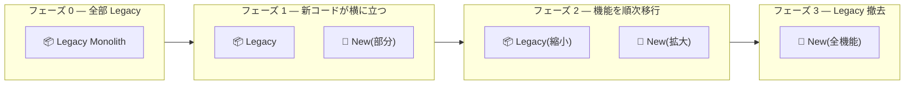
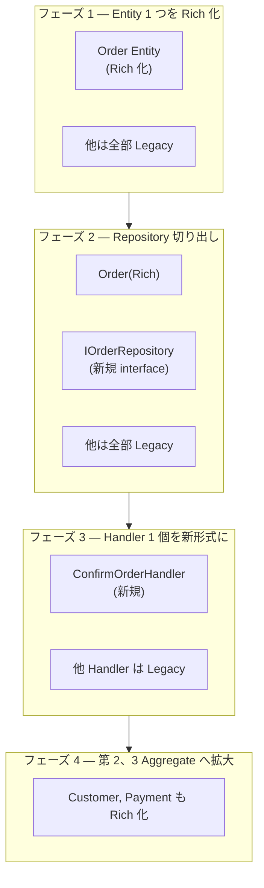
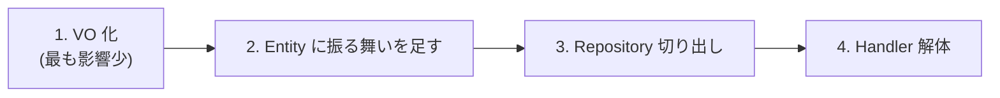
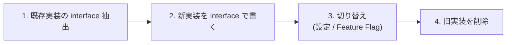
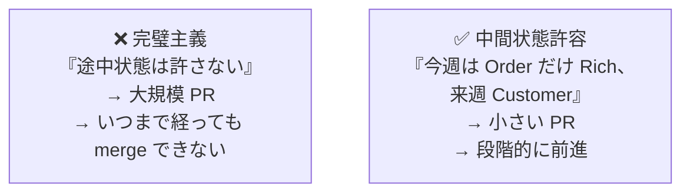
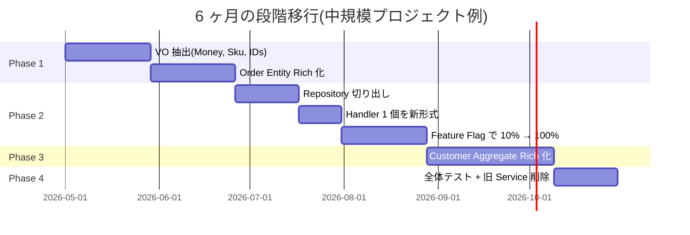

# 第 14 章 — Legacy からの段階的移行

> **この章のゴール**
> - 既存の Anemic / 巨大 Handler / Primitive Obsession コードを **段階的に** Rich Model へ移行する方針を持つ
> - **Strangler Fig パターン** を Clean Architecture 文脈で適用できる
> - 移行リスクを下げる 5 つのテクニック(Characterization Tests / Feature Flag / Branch by Abstraction / 並行運用 / 段階リリース) を使い分けられる
> - 移行中に必ず起きる "中間状態" を許容するチームルールを設計できる

---

## 14.1 「全部書き直したい」の罠

Joel Spolsky が "Things You Should Never Do, Part I" (2000) で警告した古典的な罠[^joel]:

[^joel]: Joel Spolsky, ["Things You Should Never Do, Part I"](https://www.joelonsoftware.com/2000/04/06/things-you-should-never-do-part-i/), 2000. Netscape の Mozilla 全書き直しが商業的破滅を招いた事例。

> They did it by making the single worst strategic mistake that any software company can make: they decided to rewrite the code from scratch.
> (彼らはソフトウェア会社が犯しうる最悪の戦略的ミスをした — コードをゼロから書き直すと決めた)

**Big Bang Rewrite はほぼ確実に失敗する**。理由:

| 失敗要因 | 内容 |
| --- | --- |
| 機能パリティの過小評価 | 「あの機能ってどう動いてたっけ?」が無数に出る |
| ビジネスは進む | 旧システムへの機能追加が止められず、新システムは追従できない |
| 新システム側の隠れた要件 | 「ログ集計が前のフォーマット前提だった」等 |
| モチベーション崩壊 | 完成しない → エンジニアが辞める |

本書では **Strangler Fig パターン** による段階移行を推奨する。

---

## 14.2 Strangler Fig パターン

Martin Fowler が 2004 年に提唱したパターン[^strangler].

[^strangler]: Martin Fowler, [StranglerFigApplication](https://martinfowler.com/bliki/StranglerFigApplication.html), 2004. Strangler Fig は熱帯雨林の絞め殺し植物。既存の木の周りに育ち、最終的に置き換える。



**「新コードを Legacy の周りに育てて、徐々に置き換える」**。Big Bang ではなく **段階的な絞め殺し**。

### Clean Architecture 文脈での適用



---

## 14.3 段階移行プレイブック

### Step 0 — 痛みの優先順位を決める

「**最も痛みが大きい場所から始める**」。痛みの兆候:

| 兆候 | 移行優先度 |
| --- | --- |
| そのコードでバグが頻発する | ★★★ |
| 機能追加が遅い(1 機能追加に 1 週間以上) | ★★★ |
| 新メンバが理解できない | ★★ |
| テストが書きにくい | ★★ |
| パフォーマンス問題 | ★ |
| 単に古い | 0(移行しない) |

「単に古い」だけでは移行しない。**痛みが投資を正当化する**。

### Step 1 — Characterization Tests を書く

リファクタの前に、**現状の振る舞いを保証するテスト** を書く[^char-test].

[^char-test]: Michael Feathers, *Working Effectively with Legacy Code*, Prentice Hall, 2004. Characterization Tests — 「正しいかどうかではなく、現状の振る舞いを記録する」テスト。

```csharp
// Characterization Test の例 — 現状の挙動を観察してテストにする
[Fact]
public async Task 既存_CreateOrder_は_自動承認時に_Kafka_を発行しない()
{
    var bus = new Mock<IEventBus>();
    var handler = new OldCreateOrderHandler(...);
    var cmd = new CreateOrderCommand { IsAutoConfirm = true, /* ... */ };

    await handler.HandleAsync(cmd, default);

    bus.Verify(b => b.PublishAsync(It.IsAny<OrderCreated>(), It.IsAny<CancellationToken>()),
        Times.Never);
}
```

**「正しい挙動」かは問わない。「今そう動いている」をテストにする**。リファクタ後にこのテストが通れば、副作用を壊していない証拠になる。

### Step 2 — 内向きに Rich 化を進める



**最も影響範囲の小さい変更から始める**。

| ステップ | 変更範囲 | リスク |
| --- | --- | --- |
| 1. VO 化 | string → 型(段階的) | 低 |
| 2. Entity に振る舞い | メソッド追加(setter は残す) | 低 |
| 3. Repository 切り出し | 既存 Service の中から interface 抽出 | 中 |
| 4. Handler 解体 | フラグ → ユースケース分割 | 高 |

### Step 3 — Branch by Abstraction

Jez Humble が *Continuous Delivery* (2010) で紹介したパターン[^bba].

[^bba]: Jez Humble, David Farley, *Continuous Delivery: Reliable Software Releases through Build, Test, and Deployment Automation*, Addison-Wesley, 2010. Branch by Abstraction.



```csharp
// Step 1 — interface 抽出
public interface IOrderConfirmation
{
    Task ConfirmAsync(OrderId id, UserId actor, CancellationToken ct);
}

// 既存実装をそのまま interface でラップ
public sealed class LegacyOrderConfirmation : IOrderConfirmation
{
    public Task ConfirmAsync(OrderId id, UserId actor, CancellationToken ct) =>
        // 既存の OldOrderService.Confirm を呼ぶ
}

// Step 2 — 新実装(Rich Model)
public sealed class RichOrderConfirmation(IOrderRepository repo, IUnitOfWork uow) : IOrderConfirmation
{
    public async Task ConfirmAsync(OrderId id, UserId actor, CancellationToken ct)
    {
        var order = await repo.GetByIdAsync(id, ct);
        order.Confirm(actor);
        await uow.SaveChangesAsync(ct);
    }
}

// Step 3 — 切り替え(設定で)
services.AddScoped<IOrderConfirmation>(sp =>
    config.UseNewOrderConfirmation
        ? sp.GetRequiredService<RichOrderConfirmation>()
        : sp.GetRequiredService<LegacyOrderConfirmation>()
);
```

**1 PR で全部切り替える必要がない**。設定で旧↔新を切り替えられる状態でリリースし、本番で検証してから旧を消す。

### Step 4 — Feature Flag で段階リリース

```csharp
public sealed class OrderConfirmationRouter(
    IFeatureFlags flags,
    LegacyOrderConfirmation legacy,
    RichOrderConfirmation rich) : IOrderConfirmation
{
    public Task ConfirmAsync(OrderId id, UserId actor, CancellationToken ct)
    {
        // 顧客 ID の % で段階リリース
        if (flags.IsEnabledFor("rich-order-confirmation", actor.Value, percent: 10))
            return rich.ConfirmAsync(id, actor, ct);
        return legacy.ConfirmAsync(id, actor, ct);
    }
}
```

10% → 50% → 100% と段階的にロールアウト。問題があれば即フラグを戻す。

### Step 5 — 並行運用 + Shadow Run

最もリスクが低い手法: **両方の実装を同時に動かして、結果を比較する**。

```csharp
public sealed class ShadowingOrderConfirmation(
    LegacyOrderConfirmation legacy,
    RichOrderConfirmation rich,
    ILogger<ShadowingOrderConfirmation> logger) : IOrderConfirmation
{
    public async Task ConfirmAsync(OrderId id, UserId actor, CancellationToken ct)
    {
        // 本番は Legacy(信用できる)
        await legacy.ConfirmAsync(id, actor, ct);

        // 並行で Rich も走らせる(結果は捨てるか、別 DB に書く)
        try
        {
            await rich.ConfirmAsync(id, actor, ct);  // Read-only モードで
            logger.LogInformation("rich matched legacy for order {Id}", id);
        }
        catch (Exception ex)
        {
            logger.LogError(ex, "rich diverged from legacy for order {Id}", id);
        }
    }
}
```

**新実装の不具合が見つかっても本番への影響なし**。十分な観測期間を経て切り替える。

---

## 14.4 移行中の "中間状態" を許容する



「ベスト or ナッシング」は移行の敵。**「Order Aggregate だけは Rich、他はまだ Anemic」** という中間状態を 3 ヶ月続けても問題ない。

### 中間状態の規約例

```markdown
# Order Aggregate 移行ルール (期間: 2026-05 〜 2026-07)

## 完了領域(Rich)
- `Order` Entity と関連 VO(`Money`, `Sku`, `OrderId`)
- `IOrderRepository` interface(新規)
- `ConfirmOrderHandler` / `CancelOrderHandler`

## 未完了領域(Legacy)
- `Customer` Aggregate(まだ Anemic、Q3 で移行)
- 旧 `OrderService.GetActiveOrders()`(検索系は Q3 で Query Service へ)

## ルール
- 新規コードは Rich 規約に従う
- Legacy エリアを触るときは Boy Scout Rule(関連する小範囲だけは綺麗に)
- 完了領域に Anemic コードを足したら PR Reject
```

これを `docs/` に置き、PR レビュアー全員が参照する。

---

## 14.5 移行を加速する 5 つのテクニック

### テクニック 1 — Adapter で旧 ↔ 新を繋ぐ

```csharp
// 新 Repository が必要だが、まだ Aggregate が Anemic
public sealed class OrderRepositoryAdapter(LegacyDbContext db) : IOrderRepository
{
    public async Task<Order?> GetByIdAsync(OrderId id, CancellationToken ct)
    {
        var row = await db.OldOrders.FirstOrDefaultAsync(o => o.Id == id.Value, ct);
        if (row is null) return null;
        return Order.Reconstruct(  // ← Anemic Row → Rich Aggregate
            OrderId.Of(row.Id),
            CustomerId.Of(row.CustomerId),
            ParseStatus(row.Status),
            Money.Yen(row.Total));
    }
}
```

**Aggregate と DB スキーマを別物として扱う**。スキーマを直さなくても Aggregate を Rich にできる。

### テクニック 2 — 古い API を新コードで使い続ける

```csharp
// 既存の Controller を変えない
public class OrderController(IMediator mediator) : ControllerBase
{
    [HttpPost("/api/orders/{id}/confirm")]
    public async Task<IActionResult> Confirm(string id)
    {
        // 内部だけ新 Handler に dispatch
        var result = await mediator.Send(new ConfirmOrderCommand(OrderId.Of(id)));
        return result.IsSuccess ? Ok() : Conflict();
    }
}
```

**API 仕様は維持、内部だけ Rich**。クライアントへの影響ゼロ。

### テクニック 3 — Read-only ビューはまだ Anemic で OK

「とりあえず動くダッシュボード」は Rich 化しない。読み取り専用なので不変条件が不要。

```csharp
// Query Service は Anemic な DTO を返してよい
public interface IOrderReportingService
{
    Task<MonthlyOrderReport> GetMonthlyReportAsync(int year, int month, CancellationToken ct);
}
```

**書き込み側(Command)から Rich 化を進める**。読み取り側(Query)は後回しでよい。

### テクニック 4 — VO 化は内部から外部へ

```csharp
// Step A — Entity の内部だけ VO 化(API は string のまま)
public sealed class Order
{
    public OrderId Id { get; }  // ← VO
    public string LegacyApiId => Id.Value;  // ← API には string で公開
}

// Step B — Handler の中で VO 変換
public async Task<Result> HandleAsync(string idStr, ...)
{
    var id = OrderId.Of(idStr);  // 入り口で変換
    var order = await repo.GetByIdAsync(id, ct);
    // ...
}

// Step C — 最終的に API シグネチャも VO 化
[HttpPost("/api/orders/{id}")]
public async Task<IActionResult> Get([FromRoute] OrderId id) { ... }
```

**段階的に VO の "侵入" を深くする**。

### テクニック 5 — テストカバレッジを移行のサインに使う

移行中の領域のカバレッジが上がる = 移行が進んでいる証拠。

```yaml
# coverage threshold
"Domain/": 90%
"Application/": 70%
"Infrastructure/": 40%
# Legacy フォルダはあえて threshold を設けない(無視)
```

---

## 14.6 失敗パターン — やってはいけないこと

### 失敗 1 — 巨大 PR を作る

1 PR で 50 ファイル変更 = レビュアーが見切れない → コンフリクト多発 → モチベーション低下。

**1 PR = 1 Aggregate or 1 機能** に制限する。

### 失敗 2 — テストなしでリファクタする

Characterization Tests を書かずにリファクタすると、**「動いていた挙動」を壊して気づかない**。本番でバグが出る。

### 失敗 3 — 並行で大量の Aggregate を移行する

「Order と Customer と Payment を同時に Rich 化」は失敗する。**1 つの Aggregate を完了してから次へ**。

### 失敗 4 — レビュー基準が曖昧

「Rich のはず…」「Anemic のままでもよくない?」が PR で議論される。**完了領域と未完了領域のルールを文書化** する(14.4 節参照)。

### 失敗 5 — 完璧主義で merge を止める

「ここも Rich にしないと merge できない」と PR を止めると、進まない。**段階的前進** を許容する。

---

## 14.7 移行のスケジュール感

| プロジェクト規模 | 1 Aggregate の Rich 化 | 全体移行完了 |
| --- | --- | --- |
| 小規模(コード 1 万行) | 1-2 週間 | 1-2 ヶ月 |
| 中規模(コード 10 万行) | 1-2 ヶ月 | 6-12 ヶ月 |
| 大規模(コード 100 万行) | 3-6 ヶ月 | 2-3 年 |

**「明日完了」は不可能、「永久に進まない」も避ける**。

---

## 14.8 段階移行の成功事例パターン



---

## 14.9 章末演習

### 演習 14.1 — 痛みの優先順位を決める

あなたのプロジェクトで、以下の Aggregate / 機能を「移行優先度」でランク付けせよ。

- バグが頻発する領域
- 機能追加が遅い領域
- 新メンバが理解できない領域
- テストが書きにくい領域

### 演習 14.2 — Branch by Abstraction で 1 Handler を移行する設計

あなたのプロジェクトから 1 Handler を選び、以下を設計せよ。

1. 既存実装の interface 抽出(`IXxxOperation`)
2. 新実装(Rich Model)のメソッド名
3. Feature Flag の設定
4. ロールアウト計画(10% → 50% → 100% の閾値)

### 演習 14.3 — 移行ルールを書く

あなたのチーム向けに「Rich 移行ルール」を書け。完了領域 / 未完了領域 / PR レビュー基準 を含める。

→ 解答は [付録 C](appendix-c-exercises) に。

---

## 14.10 まとめ

- **Big Bang Rewrite はやめる**(Joel Spolsky の警告)
- **Strangler Fig パターン**: 新コードを既存の周りに育てて徐々に置き換える
- 段階移行プレイブック:
  1. 痛みの優先順位
  2. Characterization Tests
  3. Branch by Abstraction
  4. Feature Flag で段階リリース
  5. Shadow Run で並行運用
- **中間状態を許容する** — 完璧主義は移行の敵
- 移行加速テクニック: Adapter / 古い API 維持 / Read-only は Anemic OK / VO は内→外 / カバレッジでサイン
- 失敗パターン: 巨大 PR / テストなし / 並行移行 / ルール曖昧 / 完璧主義

---

# 終章

ここまで読んでくれてありがとう。

本書で繰り返し言ってきた主張は **「if が悪いのではない、住所が悪いのだ」** という 1 つのことに尽きる。

第 5 章の判定表(Q1-Q4)を脳内にロードし、PR レビューでこの 4 つの質問を聞ける状態になれば、本書の目的は達成だ。

設計の腕は、本を読むだけでは伸びない。**自分のコードでアンチパターンを見つけ、書き換えて、テストを書く** — この繰り返しでしか身につかない。本書の章末演習をすべて手を動かして解いたなら、すでに大きく前進している。

そして、設計の議論は終わらない。Eric Evans の青本(2003) から 23 年経った今でも、世界中のエンジニアが Aggregate 境界をどう引くかで議論している。本書もその継続的な議論の一部だ。

もし本書がきっかけで、あなたのコードベースの 1 つの Entity が Rich になり、1 つの Handler が短くなり、1 つの PR レビューで「ここは Domain Service にしましょう」と言えるようになったなら、それは本書を書いたすべての時間が報われる瞬間だ。

最後に。本書で挙げた原典に当たることを強く勧める。Eric Evans、Martin Fowler、Robert Martin、Vaughn Vernon。彼らの本やブログは本書よりずっと深い。**本書は彼らへの道標** に過ぎない。

それでは、よい設計を。

---

→ **[付録 A 用語辞典](appendix-a-glossary)**
→ **[付録 B PR レビューチェックリスト](appendix-b-checklist)**
→ **[付録 C 章末演習解答](appendix-c-exercises)**
→ **[参考文献](references)**
