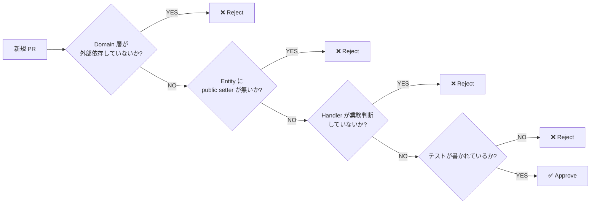

# 付録 B — PR レビューチェックリスト

PR レビューで「**14 章分の主張を 1 ページで思い出す**」ためのチェックリスト。
このページを印刷してデスクに貼るのを推奨。

---

## 🏗️ アーキテクチャ層

- [ ] **L1 — Domain 層の純粋性**: `Domain/` 配下の `using` に `Microsoft.EntityFrameworkCore` / 外部 SDK が含まれていないか?(第 2 章)
- [ ] **L2 — Application 層**: Handler は段取りのみで、業務判断 if が混入していないか?(第 5 章, 第 10 章)
- [ ] **L3 — Interface Adapters**: Repository 実装が `IQueryable` を露出していないか?(第 11 章)
- [ ] **L4 — Frameworks**: ASP.NET / EF Core / Stripe SDK 等が Domain を侵食していないか?(第 2 章)

---

## 💎 Entity / Aggregate

- [ ] **public setter 禁止**: Entity のプロパティは `private set` / `init` のみか?(第 6 章)
- [ ] **状態遷移メソッドが存在**: `MarkAsXxx` / `Confirm` / `Cancel` 等の動詞メソッドが定義されているか?(第 6 章)
- [ ] **冒頭で遷移可能性チェック**: 各状態遷移メソッドの冒頭で `if (Status is not ...) throw` のガードがあるか?(第 6 章)
- [ ] **同時更新の整合性**: `Status` を変えるメソッドが `XxxAt` / `UpdatedBy` を同時更新しているか?(第 6 章)
- [ ] **Domain Event の発火**: 状態遷移時に `_events.Add(new XxxEvent(...))` を呼んでいるか?(第 6 章)
- [ ] **Aggregate Root 経由のアクセス**: 内部 Entity(`OrderLine`)を外から直接触っていないか?(第 9 章)
- [ ] **Aggregate 間は ID 参照**: `Customer` オブジェクトを直接保持せず、`CustomerId` のみ保持しているか?(第 9 章)
- [ ] **トランザクション境界 = Aggregate 境界**: 1 トランザクションで 1 Aggregate しか更新していないか?(第 9 章)

---

## 📐 Value Object

- [ ] **ID は Strongly-Typed**: `string customerId` ではなく `CustomerId` 型を使っているか?(第 7 章)
- [ ] **金額は Money 型**: `decimal price` ではなく `Money` 型を使っているか?(第 7 章)
- [ ] **VO は不変**: VO のプロパティは `init` のみ、または `record` を使っているか?(第 7 章)
- [ ] **VO のコンストラクタで検証**: `Email.Of("invalid")` が例外を投げるか?(第 7 章)
- [ ] **同名 / 別概念の取り違え**: 同じ `string` でも `OrderId` と `CustomerId` を型で区別しているか?(第 7 章)

---

## 🛠️ Domain Service

- [ ] **interface は Domain、実装は Infrastructure**: `IXxx` が `Domain/` に、`Xxx` 実装が `Infrastructure/` にあるか?(第 8 章)
- [ ] **動詞 + サフィックス命名**: `TaxRateResolver` / `InventoryReservator` 等、動詞が出ているか?`OrderService` のような汎用名を避けているか?(第 8 章)
- [ ] **Stateless**: Domain Service が `private` フィールド(キャッシュ等) を持っていないか?(第 8 章)

---

## 🧩 Strategy パターン

- [ ] **過剰適用していないか**: 戦略が 1 つしかないのに Strategy 化していないか?(第 8 章, YAGNI)
- [ ] **Selector に if がない**: `strategies.First(s => s.CanHandle(input))` のように Strategy 自身が適用可否を判断しているか?(第 8 章)
- [ ] **業務概念が型として現れる**: `"PRIMARY"` 文字列比較ではなく `Region.Primary` 型を使っているか?(第 8 章)

---

## 📋 Application Handler

- [ ] **痩せた Handler**: 1 Handler が 200 行を超えていないか?(第 10 章)
- [ ] **業務判断の if がない**: `if (order.Customer.IsVip)` 等の業務判断 if が Handler に混入していないか?(第 5 章, 第 10 章)
- [ ] **コマンドルーティングのみ**: 残っている switch が「コマンドを Entity メソッドにディスパッチ」だけになっているか?(第 6 章)
- [ ] **冪等性ガード**: `if (order.Status == cmd.NewStatus) return Ok();` で同じ状態への再遷移を弾いているか?(第 6 章)
- [ ] **副作用が明示的**: Handler 名で副作用の違いが表現されているか?(`CreateAutoConfirmOrderHandler` 等)(第 10 章)
- [ ] **Event 発行は永続化後**: `SaveChangesAsync` の後に `eventBus.PublishAsync` を呼んでいるか?(第 6 章)

---

## 💾 Repository

- [ ] **Aggregate Root を返す**: `Task<OrderDto>` ではなく `Task<Order?>` を返しているか?(第 11 章)
- [ ] **`IQueryable` を露出しない**: `IQueryable<Order> Query()` のような露出がないか?(第 11 章)
- [ ] **God Repository を避ける**: 1 interface のメソッド数が 7 個以下か?(第 11 章)
- [ ] **業務ロジックを Repository に書かない**: `Status == "Confirmed" || Processing` のような業務判断を Repository が書いていないか?(第 2 章, 第 11 章)
- [ ] **集計は Query Service に**: 月次集計・トップユーザー検索などは別 interface(`IOrderReportingService`)に切り出しているか?(第 11 章)
- [ ] **Include は Aggregate 境界内のみ**: `.Include(o => o.Lines)` は OK、`.Include(o => o.Customer.Orders)` は別 Aggregate を引いているので NG(第 9 章, 第 11 章)

---

## 🖥️ フロントエンド

- [ ] **Validation の if 連鎖がない**: Component 内に `if (!xxx) { setError(...); return; }` の連鎖がないか?(第 12 章)
- [ ] **エラーメッセージが i18n key**: Component に文言を直書きせず i18n key を使っているか?(第 12 章)
- [ ] **schema に集約**: マスタ参照 / cross-field 比較が schema 側(`refine`) で表現されているか?(第 12 章)
- [ ] **Branded Type**: API の引数に `string` ではなく branded type(`CustomerId`)を使っているか?(第 7 章, 第 12 章)
- [ ] **schema の単体テスト**: schema が純粋関数として単体テストされているか?(第 12 章, 第 13 章)

---

## 🧪 テスト

- [ ] **Domain 純粋テストが mock なし**: Entity / VO のテストで `Mock<>` を使っていないか?(第 13 章)
- [ ] **Test Factory が存在**: `OrderTestFactory.CreatePending()` 等のファクトリが整備されているか?(第 13 章)
- [ ] **テスト名が業務語彙**: `Pending_状態の_Order_は_Confirm_できる` のように日本語で仕様が読めるか?(第 13 章)
- [ ] **Repository は Testcontainers**: Repository テストが Mock ではなく実 DB(Postgres コンテナ) を使っているか?(第 13 章)
- [ ] **E2E は主要シナリオのみ**: E2E テストが 20 本以下に絞られているか?(第 13 章)
- [ ] **カバレッジが階層別**: `Domain/` 90%+ / `Application/` 70%+ / `Infrastructure/` 制約なし、になっているか?(第 13 章)

---

## 🔄 Legacy 移行

- [ ] **Big Bang Rewrite していない**: 50 ファイル以上を 1 PR で書き換えていないか?(第 14 章)
- [ ] **Characterization Tests が先**: リファクタの前に既存挙動を保証するテストを書いているか?(第 14 章)
- [ ] **Branch by Abstraction**: 旧↔新の切り替えが Feature Flag / interface で実装されているか?(第 14 章)
- [ ] **中間状態を許容**: 「ここはまだ Anemic」を明示的にルール化しているか?(第 14 章)
- [ ] **完了領域への退行禁止**: Rich 化が済んだ Aggregate に Anemic コードを足す PR が拒否されるか?(第 14 章)

---

## 💬 ユビキタス言語

- [ ] **業務用語 = 型名**: 会議で「確定済み注文」と呼ぶものが `OrderStatus.Confirmed` で表現されているか?(第 3 章)
- [ ] **コミットメッセージが業務語彙**: 「fix bug」ではなく「Order の Confirm 後に FulfilledAt が更新されない問題を修正」のように業務語彙で書かれているか?(第 3 章)
- [ ] **Bounded Context が明示**: 同じ "Order" でも Sales / Warehouse など別 Context の場合、フォルダ分けで明示されているか?(第 3 章, 第 9 章)

---

## ⚠️ 過剰設計の禁止

- [ ] **Strategy を 1-2 個で乱用していない**: 戦略数が増える兆候がないのに Strategy 化していないか?(第 8 章)
- [ ] **Repository を Read-only Query に作っていない**: 集計用 DTO に Repository を作っていないか?(第 11 章)
- [ ] **過剰な layer**: プロトタイプ / 3 ヶ月で捨てるコードに Clean Architecture を完全適用していないか?(第 2 章)
- [ ] **Event Sourcing への早すぎる移行**: PMF 前の MVP で Event Sourcing を導入していないか?(本書範囲外だが、YAGNI 適用)

---

## 📝 PR 説明文

- [ ] **業務的な変更内容**: 「何を業務上できるようになるか」を 2-3 行で書けているか?
- [ ] **設計上の判断**: 「なぜ Entity ではなく Domain Service に置いたか」等の判断が記述されているか?
- [ ] **トレードオフの明示**: 完璧な設計ではないが許容したトレードオフが書かれているか?
- [ ] **テストの追加**: 新規 / 修正コードに対応するテストが追加されているか?
- [ ] **関連 ADR / Issue リンク**: 関連する Architecture Decision Record (ADR) や Issue が紐付いているか?

---

## 🚦 PR の判定基準

---

→ **[付録 C 章末演習解答](appendix-c-exercises)**
