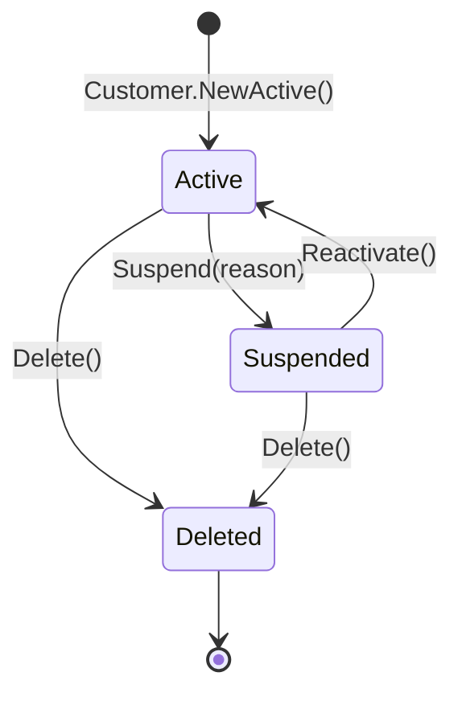

# 付録 C — 章末演習解答

各章末演習の解答例。あくまで「1 つの解」であり、唯一解ではない。

---

## 第 1 章 — なぜ if は増殖するのか

### 演習 1.1 — 増殖パターンの分類

- **コード 1** = パターン B(縦ネスト) + パターン C(地域ごとに転記)の混合。地域マスタ(VO) と料金計算(Calculator) に分けるのが定石。
- **コード 2** = パターン C(層またぎ)。`OrderStatus` の表示ロジックを VO の `DisplayLabel` プロパティに集約。
- **コード 3** = パターン A(横方向)。第 10 章のユースケース分割 / Strategy で解体。

### 演習 1.2 — 業務判断 vs ガード

| # | 分類 | 理由 |
| --- | --- | --- |
| 1 | 業務判断 | `OrderStatus.Pending` は業務概念 → Entity の状態遷移メソッドへ |
| 2 | ガード | `null` チェックは技術的入力検証 → 残してよい |
| 3 | 業務判断 | `MembershipTier.Gold` は業務概念 → Strategy or Entity メソッドへ |
| 4 | コマンドルーティング | `OperationType` は Command の振り分け → 残してよい |
| 5 | ガード | 範囲チェックは技術的検証 → 残してよい |

### 演習 1.3 — grep 結果

健全な目安: 5 件以下。20 件超なら Anemic Domain Model の兆候。「同じ if が分散している」のは典型症状。

---

## 第 2 章 — Clean Architecture の最小知識

### 演習 2.1 — 層違いを見つける

```csharp
// File: backend/Infrastructure/Payment/StripeAdapter.cs
public class StripeAdapter : IPaymentGateway
{
    public async Task<PaymentResult> ChargeAsync(Order order)
    {
        decimal fee = order.Customer.IsVip ? 0m : order.Total * 0.03m;  // ← 業務判断 in Infra
        if (order.Total > 100000) { return await ChargeInInstallmentsAsync(order, fee); }  // ← 業務判断 in Infra
        return await stripeClient.ChargeAsync(order.Total + fee);
    }
}
```

**問題**: 「VIP は手数料免除」「10 万円以上は分割」という業務ルールが Infrastructure 層に住んでいる。

**修正方針**:
- `Order.CalculatePaymentFee()` を Entity メソッドに(あるいは Domain Service `IPaymentFeeCalculator`)
- `Order.RequiresInstallment()` を Entity の判定メソッドに
- Stripe Adapter は決済 API 呼び出しに専念

### 演習 2.2 — using 文監査

`Domain/` 配下の `using` に外部 SDK が混入していたら警告レベル。Aggregate Root の依存先は **同じ Domain 内 + System 系のみ** が理想。

### 演習 2.3 — 円を描く

ファイルを 4 層(L1-L4) に当てはめる作業。違和感のある配置(`UserService.cs` が Application 層なのか Domain 層なのか曖昧) が見つかれば、それは設計判断の余地がある領域。

---

## 第 3 章 — DDD の最小知識

### 演習 3.1 — 6 つの登場人物の分類

| # | 分類 |
| --- | --- |
| 1 | Value Object(`OrderId` は ID を表す不変な値) |
| 2 | Entity / Aggregate Root |
| 3 | Repository(interface) |
| 4 | Domain Event |
| 5 | Domain Service(interface) |
| 6 | Value Object |

### 演習 3.2 — ユビキタス言語の発掘

ヒットしない単語が **5 個以上**あるなら、ユビキタス言語が機能していない兆候。チームで命名規約のレビューを推奨。

### 演習 3.3 — Aggregate 描画

例: `Order` Aggregate なら Root = `Order`、内部 Entity = `OrderLine`、内部 VO = `Address`, `Money`、関連 = `CustomerId` で `Customer` を ID 参照、`Payment` も ID 参照。

---

## 第 4 章 — Rich Domain Model vs Anemic Domain Model

### 演習 4.1 — Anemic → Rich

```csharp
public sealed class Customer
{
    public CustomerId Id { get; }
    public Email Email { get; private set; }
    public bool IsActive { get; private set; }
    public DateTime? RegisteredAt { get; private set; }

    private Customer(CustomerId id, Email email)
    {
        Id = id;
        Email = email;
        IsActive = false;
    }

    public static Customer NewPending(CustomerId id, Email email) =>
        new(id, email);

    public void Register()
    {
        if (IsActive) throw new DomainException("既に登録済みです");
        IsActive = true;
        RegisteredAt = DateTime.UtcNow;
    }
}

public class CustomerService(ICustomerRepository repo, IUnitOfWork uow)
{
    public async Task RegisterAsync(CustomerId id, Email email, CancellationToken ct)
    {
        var customer = Customer.NewPending(id, email);
        customer.Register();
        await repo.AddAsync(customer, ct);
        await uow.SaveChangesAsync(ct);
    }
}
```

ポイント: `Email` を VO 化することで `if (!email.Contains("@"))` のような検証が `Email.Of()` に移る。

### 演習 4.2 — 診断点数

5 点以下なら本書 Part II を重点的に読む。

### 演習 4.3 — 振る舞いゼロ Entity の grep

「メソッド 0 個 + プロパティ 5 個以上」のクラスは Anemic 候補。

---

## 第 5 章 — ロジックの居場所判定表

### 演習 5.1 — 居場所判定

| # | ロジック | 居場所 | 理由 |
| --- | --- | --- | --- |
| 1 | 「Order 合計 ≧ 10万 で VIP」 | **Entity**(`Order.IsLargeOrder` プロパティ) | self の合計を読む |
| 2 | Money 加算(同通貨) | **VO**(`Money.Add`) | 引数だけで決まる純粋計算 |
| 3 | 「注文確定時に在庫引当」 | **Domain Service**(`IInventoryReservation`) | 別 Aggregate + 外部依存 |
| 4 | 配送料計算(マスタ参照なし) | **VO / Calculator**(`ShippingFeeCalculator`) | 純粋計算 |
| 5 | 配送料計算(マスタ参照あり) | **Domain Service**(`IShippingFeeResolver`) | 外部依存 |
| 6 | 「Order 作成 → 在庫 → 決済 → 通知」全体 | **Application Handler**(`CreateOrderHandler`) | 段取り |

### 演習 5.2 — 居場所違反 grep

3 つの典型例(`Status ==` / `Math.` in Application / `IsVip` in Infra) を grep し、ヒットを判定表に当てはめる。

### 演習 5.3 — チームメンバ 3 人質問

3 人が違う答えを言ったなら、それは設計判断が共有されていない明確な指標。本書の輪読を推奨。

---

## 第 6 章 — Entity に状態遷移を返す

### 演習 6.1 — Rich Customer

```csharp
public sealed class Customer
{
    public CustomerId Id { get; }
    public CustomerStatus Status { get; private set; }
    public DateTime? SuspendedAt { get; private set; }
    public string? SuspendReason { get; private set; }

    private readonly List<IDomainEvent> _events = new();
    public IReadOnlyList<IDomainEvent> DomainEvents => _events;

    public void Suspend(string reason)
    {
        if (Status is CustomerStatus.Deleted)
            throw new InvalidStateTransitionException(Status, CustomerStatus.Suspended);
        if (string.IsNullOrWhiteSpace(reason))
            throw new DomainException("suspend reason is required");

        Status = CustomerStatus.Suspended;
        SuspendedAt = DateTime.UtcNow;
        SuspendReason = reason;
        _events.Add(new CustomerSuspended(Id, reason, SuspendedAt.Value));
    }

    public void Reactivate()
    {
        if (Status is not CustomerStatus.Suspended)
            throw new InvalidStateTransitionException(Status, CustomerStatus.Active);
        Status = CustomerStatus.Active;
        SuspendedAt = null;
        SuspendReason = null;
        _events.Add(new CustomerReactivated(Id));
    }

    public void Delete()
    {
        if (Status is CustomerStatus.Deleted)
            throw new InvalidStateTransitionException(Status, CustomerStatus.Deleted);
        Status = CustomerStatus.Deleted;
        _events.Add(new CustomerDeleted(Id));
    }
}
```

### 演習 6.2 — 状態遷移図



### 演習 6.3 — 4 つのテスト

```csharp
[Fact]
public void Active_から_Suspended_に遷移できる()
{
    var c = CustomerTestFactory.CreateActive();
    c.Suspend("policy violation");
    Assert.Equal(CustomerStatus.Suspended, c.Status);
    Assert.NotNull(c.SuspendedAt);
    Assert.Equal("policy violation", c.SuspendReason);
}

[Fact]
public void 既に_Suspended_の状態で_Suspend_すると_新しい時刻が記録される()
{
    var c = CustomerTestFactory.CreateSuspended("first");
    var firstSuspendedAt = c.SuspendedAt;
    Thread.Sleep(10);
    c.Suspend("second");
    Assert.NotEqual(firstSuspendedAt, c.SuspendedAt);
}

[Fact]
public void Deleted_からは_Suspend_できない()
{
    var c = CustomerTestFactory.CreateDeleted();
    Assert.Throws<InvalidStateTransitionException>(() => c.Suspend("any"));
}

[Fact]
public void Suspend_すると_CustomerSuspended_Event_が発火()
{
    var c = CustomerTestFactory.CreateActive();
    c.Suspend("reason");
    Assert.Contains(c.DomainEvents, e => e is CustomerSuspended);
}
```

---

## 第 7 章 — Value Object と Primitive Obsession

### 演習 7.1 — VO 化

```csharp
public sealed record UserId(string Value)
{
    public static UserId Of(string v)
    {
        if (!Regex.IsMatch(v, @"^USR-[A-Z0-9]{6}$"))
            throw new ArgumentException($"Invalid UserId: {v}");
        return new UserId(v);
    }
}

public sealed record Email(string Value)
{
    private static readonly Regex Pattern = new(@"^[^@\s]+@[^@\s]+\.[^@\s]+$");
    public static Email Of(string v)
    {
        if (!Pattern.IsMatch(v)) throw new ArgumentException($"Invalid email: {v}");
        return new Email(v.ToLowerInvariant());
    }
}

public sealed record PhoneNumber(string Value)
{
    public static PhoneNumber Of(string v)
    {
        if (!Regex.IsMatch(v, @"^\+\d{10,15}$"))
            throw new ArgumentException($"Invalid phone (E.164): {v}");
        return new PhoneNumber(v);
    }
}

public sealed record Age(int Value)
{
    public static Age Of(int v)
    {
        if (v < 0 || v > 150) throw new ArgumentException($"Invalid age: {v}");
        return new Age(v);
    }
    public bool IsAdult => Value >= 18;
}

public sealed record CountryCode(string Value)
{
    public static CountryCode Of(string v)
    {
        if (!Regex.IsMatch(v, @"^[A-Z]{2}$"))
            throw new ArgumentException($"Invalid country code (ISO 3166-1 alpha-2): {v}");
        return new CountryCode(v);
    }
}
```

### 演習 7.2 — Money の演算

```csharp
public sealed record Money(decimal Amount, string Currency)
{
    public Money Subtract(Money other)
    {
        if (Currency != other.Currency) throw new InvalidOperationException();
        return this with { Amount = Amount - other.Amount };
    }

    public Money Multiply(decimal factor) =>
        this with { Amount = Math.Round(Amount * factor, 2) };

    public IReadOnlyList<Money> Divide(int n)
    {
        if (n <= 0) throw new ArgumentException("divisor must be positive");
        var base_ = Math.Floor(Amount / n);
        var remainder = Amount - base_ * n;
        return Enumerable.Range(0, n)
            .Select(i => this with { Amount = base_ + (i < remainder ? 1 : 0) })
            .ToList();
    }

    public static Money Sum(IEnumerable<Money> moneys)
    {
        var list = moneys.ToList();
        if (list.Count == 0) throw new ArgumentException("empty");
        var currency = list[0].Currency;
        if (list.Any(m => m.Currency != currency))
            throw new InvalidOperationException("currency mismatch");
        return new Money(list.Sum(m => m.Amount), currency);
    }
}
```

### 演習 7.3 — TypeScript branded type 版

```typescript
import { z } from "zod";

type Brand<T, B> = T & { readonly __brand: B };

const UserIdSchema = z.string().regex(/^USR-[A-Z0-9]{6}$/);
type UserId = Brand<string, "UserId">;
const UserId = { of: (v: string): UserId => UserIdSchema.parse(v) as UserId };

const EmailSchema = z.string().email();
type Email = Brand<string, "Email">;
const Email = { of: (v: string): Email => EmailSchema.parse(v).toLowerCase() as Email };

const AgeSchema = z.number().int().min(0).max(150);
type Age = Brand<number, "Age">;
const Age = { of: (v: number): Age => AgeSchema.parse(v) as Age };
```

---

## 第 8 章 — Domain Service と Strategy

### 演習 8.1 — Infrastructure から業務ルールを引き上げる

```csharp
// Domain
public sealed class Order
{
    public bool IsActive => Status.IsActive && Total.IsPositive;
}

public sealed record OrderStatus(string Value)
{
    public static readonly OrderStatus Confirmed = new("Confirmed");
    public static readonly OrderStatus Processing = new("Processing");
    public bool IsActive => this == Confirmed || this == Processing;
}

// Infrastructure
public async Task<Order?> GetActiveOrderAsync(CustomerId customerId, CancellationToken ct)
{
    var orders = await db.Orders
        .Where(o => o.CustomerId == customerId)
        .ToListAsync(ct);
    return orders.Where(o => o.IsActive).OrderByDescending(o => o.ConfirmedAt).FirstOrDefault();
}
```

### 演習 8.2 — Strategy 適用判断

戦略数が 3 つ(VIP / Bulk / Normal)、増える兆候もある(セール期間中の特別割引、初回購入割引など) → **Strategy 化を推奨**。

### 演習 8.3 — Domain Service 設計

例: `IShippingFeeResolver` interface を Domain に、`ShippingFeeResolver` 実装を Infrastructure に。

---

## 第 9 章 — Aggregate 境界

### 演習 9.1 — Aggregate 境界

| # | 関係 | 判定 | 理由 |
| --- | --- | --- | --- |
| 1 | Order と OrderLine | **同じ Aggregate** | 整合性条件(Total == Sum(Lines)) が同 TX 必須 |
| 2 | Order と ShippingAddress | **同じ Aggregate**(VO として) | 注文ごとに変わる住所 = Order の一部 |
| 3 | Customer と CustomerAddress | **同じ Aggregate**(VO のコレクション) | 顧客 ID 配下、整合性は Customer 内で守る |
| 4 | Order と Payment | **別 Aggregate** | 部分払い・後払いの可能性、独立した状態遷移 |
| 5 | Product と ProductReview | **別 Aggregate** | レビューが大量、Product のロード時に毎回引きたくない |
| 6 | Cart と CartItem | **同じ Aggregate** | カート全体の合計整合性、ライフサイクルが Cart 配下 |

### 演習 9.2 — 大きすぎる Customer の分割

- Customer 内に残す: `Addresses`, `Score`, `Wallet`(顧客 ID 配下、整合性が必要)
- 別 Aggregate に出す: `Orders`(独立した状態遷移、数千件)、`Reviews`(独立、検索される)

### 演習 9.3 — 結果整合性

「ログイン直後にレコメンドが更新されてなくてもいい」「メール配信は数秒遅れて OK」「在庫減は確定後 1 秒以内に」など。

---

## 第 10 章 — 巨大 Handler の解体

### 演習 10.1 — A vs B

`PaymentMethod` ごとに副作用が大きく違う(Stripe / PayPay / メール送信) → **A: ユースケース分割**を推奨。`ChargePaymentByCreditCardHandler` / `ChargePaymentByPayPayHandler` / `ChargePaymentByBankTransferHandler` の 3 つに分割。

### 演習 10.2 — Strategy で書き換え

```csharp
public interface IDeliveryFeePolicy
{
    bool Applies(Order order);
    Money Calculate(Order order);
}

public sealed class FreeDeliveryForPremiumPolicy : IDeliveryFeePolicy
{
    public bool Applies(Order order) => order.Customer.IsPremium;
    public Money Calculate(Order _) => Money.Zero("JPY");
}

public sealed class FreeDeliveryForLargeOrderPolicy : IDeliveryFeePolicy
{
    public bool Applies(Order order) => order.Total.Amount > 5000;
    public Money Calculate(Order _) => Money.Zero("JPY");
}

public sealed class RegionalDeliveryPolicy : IDeliveryFeePolicy
{
    private static readonly Dictionary<string, decimal> Rates = new()
    {
        ["Tokyo"] = 500m, ["Osaka"] = 600m,
    };
    public bool Applies(Order _) => true;
    public Money Calculate(Order order) =>
        Money.Yen(Rates.GetValueOrDefault(order.Region.Value, 800m));
}
```

### 演習 10.3 — フラグ棚卸し

実プロジェクトで該当 Handler を分析、A / B / 混合のどれを採用するか決定。

---

## 第 11 章 — Repository 設計

### 演習 11.1 — God Repository の分類

| メソッド | Repository / Query Service |
| --- | --- |
| `GetByIdAsync` | Repository(Aggregate を返す) |
| `AddAsync` | Repository |
| `FindByCustomerAsync` | Repository(Aggregate のリストを返す) |
| `CountByStatusAsync` | Query Service(集計、DTO 返却) |
| `GetMonthlyReportAsync` | Query Service(集計) |
| `GetTopCustomersAsync` | Query Service(集計) |
| `GetActiveByCustomerAsync` | Repository(Aggregate を返す) |
| `RemoveAsync` | Repository |

### 演習 11.2 — IQueryable を排除

```csharp
// 専用メソッドに切り出し
public interface IOrderRepository
{
    Task<IReadOnlyList<Order>> FindRecentlyConfirmedAsync(int limit, CancellationToken ct);
}

// 実装
public async Task<IReadOnlyList<Order>> FindRecentlyConfirmedAsync(int limit, CancellationToken ct) =>
    await db.Orders
        .Where(o => o.Status == OrderStatus.Confirmed)
        .OrderByDescending(o => o.ConfirmedAt)
        .Take(limit)
        .ToListAsync(ct);
```

### 演習 11.3 — Read モデル分離

実プロジェクトで該当箇所を発見、Query Service interface を Application 層に追加。

---

## 第 12 章 — フロントエンド

### 演習 12.1 — schema + i18n

```typescript
import { z } from "zod";

export const registerSchema = z.object({
  email: z.string().email({ message: "errors.email.invalid" }),
  password: z.string().min(8, { message: "errors.password.minLength" }),
  passwordConfirm: z.string(),
  age: z.number().int().min(18, { message: "errors.age.minimum" }),
}).refine(
  data => data.password === data.passwordConfirm,
  { message: "errors.passwordConfirm.mismatch", path: ["passwordConfirm"] }
);

// Component
const errors = validate(registerSchema, values);
```

### 演習 12.2 — 予約フォームの cross-field

```typescript
export const reservationSchema = z.object({
  startDate: z.date().refine(d => d >= startOfToday(), {
    message: "errors.startDate.notInPast"
  }),
  endDate: z.date(),
  participants: z.number().int().min(1).max(50),
}).refine(
  data => data.endDate > data.startDate,
  { message: "errors.endDate.afterStart", path: ["endDate"] }
).refine(
  data => differenceInDays(data.endDate, data.startDate) <= 30,
  { message: "errors.endDate.within30Days", path: ["endDate"] }
);
```

### 演習 12.3 — Branded Type 候補

実プロジェクトで grep して `userId: string`, `orderId: string` などを発見、branded type に置換する PR を作成。

---

## 第 13 章 — テスト戦略

### 演習 13.1 — 階層判定

| # | 階層 | 理由 |
| --- | --- | --- |
| 1 | **階層 1**(Domain 純粋) | VO の純粋計算 |
| 2 | **階層 2**(Application) | Handler + InMemory Repository |
| 3 | **階層 3**(Repository 統合) | Testcontainers + 本物 DB |
| 4 | **階層 4**(E2E) | UI 貫通 |
| 5 | **階層 1**(Domain 純粋) | Entity の状態遷移、mock 0 個 |

### 演習 13.2 — Mock を Fake に置き換え

```csharp
[Fact]
public async Task Test()
{
    var repo = new InMemoryOrderRepository();
    var uow = new InMemoryUnitOfWork();
    await repo.AddAsync(OrderTestFactory.CreatePending(OrderId.Of("ORD-000000001")), default);

    var handler = new ConfirmOrderHandler(repo, uow);
    await handler.HandleAsync(new ConfirmOrderCommand(OrderId.Of("ORD-000000001")), default);

    var saved = await repo.GetByIdAsync(OrderId.Of("ORD-000000001"), default);
    Assert.Equal(OrderStatus.Confirmed, saved!.Status);
    Assert.Equal(1, uow.SaveCount);
}
```

### 演習 13.3 — Test Factory

実プロジェクトで `XxxTestFactory.CreateXxx()` を整備。

---

## 第 14 章 — Legacy 移行

### 演習 14.1 — 痛みの優先順位

実プロジェクトで「バグ頻発」「機能追加遅い」「テスト書きにくい」「新人理解できない」の各観点でランク付け。複数該当 = 最優先。

### 演習 14.2 — Branch by Abstraction 設計

1. interface 抽出: `IOrderConfirmation`
2. 新実装: `RichOrderConfirmation`
3. Feature Flag: `rich-order-confirmation`
4. ロールアウト: 10% (1 週) → 50% (2 週) → 100% (1 週)、エラー率モニタ

### 演習 14.3 — 移行ルール

例:
```markdown
# Order Aggregate 移行ルール (2026-Q2-Q3)

## 完了領域(Rich のみ許容)
- Order, OrderLine, Money, Sku, OrderId
- IOrderRepository, ConfirmOrderHandler, CancelOrderHandler

## 未完了領域(Legacy 可)
- Customer, Payment, Inventory

## PR レビュー基準
- 完了領域への変更は Rich 規約遵守必須
- 未完了領域の変更は Boy Scout Rule(関連箇所だけ綺麗に)
- 完了領域に Anemic コードを足したら Reject
```

---

→ **[参考文献](references)**
