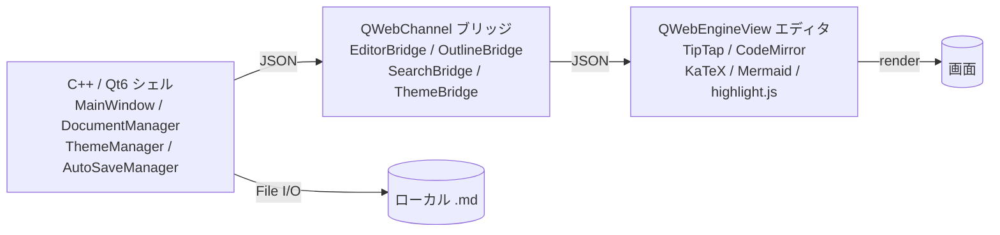

> Electron をやめて C++/Qt6 で Markdown エディタを書いたら、QWebEngine の初回ビルドに 5 時間かかった。それでも C++/Qt を選ぶ理由は 3 つあって、本書はその選択を 9 章 + 8 つの実体験ハマりで再現可能にしたものだ。

「Markdown エディタを作る」と言うとき、2026 年の標準的な選択肢は次の 4 つだ。

| 選択肢 | 起動速度 | RAM | 配布サイズ | 学習コスト |
|---|---|---|---|---|
| ① Electron + Web 技術 | 遅 (1〜2 秒) | 重 (150-300MB) | 大 (100MB+) | 低 |
| ② Tauri + Rust | 速 (0.3 秒) | 軽 (40-80MB) | 中 (15-30MB) | 中 |
| ③ Flutter Desktop | 中 | 中 | 中 | 中 |
| ④ **Qt6 + QWebEngine (本書の選択)** | 速 (0.5 秒) | 中 (100MB) | 中 (40-80MB) | 高 |

**本書の結論: ④ Qt6 + QWebEngine を選ぶ — 起動 0.5 秒 + OS 統合 + Web 技術の WYSIWYG を全部取る**。理由を 3 つに絞って書く。

## 1. WYSIWYG エディタ部分は Web 技術で書きたい

Markdown WYSIWYG エディタの中身は実質「リッチテキストエディタ + Markdown シリアライズ + KaTeX / Mermaid / Syntax Highlight」の塊で、これを native で 1 から書くのは現実的でない。**Web 技術 (TipTap / CodeMirror / ProseMirror) を WebView で動かすのが最短**。

つまり Electron か Tauri か Qt + QWebEngine、いずれかになる。

## 2. それでもネイティブシェルが欲しい

「macOS / Windows / Linux で **OS 標準のメニューバー、ウィンドウ管理、ドラッグ&ドロップ、ファイルダイアログ** を持つ」要件があると、Electron は「真ん中だけ Web で外側はネイティブ風」を演じる必要が出る。これは Electron の Chromium プロセスが OS API を直接触れない制約のせいで、IPC bridge の設計が複雑になる。

Tauri は Rust ネイティブ層が薄く、ネイティブ UI を書こうとすると Rust + Tauri Plugin で書くことになる。「OS 固有 UI」が増えるほど Rust 比率が高まる。

Qt は **30 年熟成された C++ クロスプラットフォーム GUI フレームワーク** で、「ネイティブメニュー」「ドラッグ&ドロップ」「IME」「Accessibility」「アクセシビリティ」が箱から出して機能する。OS 統合の地味な部分でハマる時間が一番短い。

## 3. C++ で書ける = AI 時代のニッチに刺さる

Markdown エディタを Web で書ける時代に、わざわざ C++ で書くニッチな価値は何か。筆者の仮説は「**SPEC 駆動開発時代の Markdown 専用 reader**」だ。

Claude Code / Cursor / Devin で AI が大量に Markdown を吐くようになった。設計書・PRD・ADR・実装メモが `.md` で増殖する。これを「軽い・速い・OS 統合された専用ビューア」で読む需要は、Notion でも VS Code でも完全には満たせない。Typora の市場が消えないのと同じ構造で、**速度と OS 統合が必要な層** には Qt 製のニッチが残る。

本書では筆者の実プロジェクト **Colason** (C++/Qt6 ハイブリッド Markdown エディタ) の設計記録を素材として使う。**詳細な現状や今後のロードマップは最終章 (第 9 章) にまとめている**ので、本書は「実プロジェクトを背景に持つ設計パターン集」として読んでほしい。

## 全体アーキテクチャ

- C++ 側: File I/O、自動保存、テーマ、エクスポート、検索、Outline、設定
- Web 側: WYSIWYG 編集体験、構文ハイライト、数式、図表
- ブリッジ: 双方向 JSON メッセージ (QWebChannel + qwebchannel.js)

C++ と TypeScript の責務を最初に明確に分けることが、後の保守性を決める。

## 本書で扱う技術スタック

- **C++20** (ranges, concepts, std::format)
- **Qt 6.8+** (Core / Gui / Widgets / WebEngine / WebChannel)
- **CMake 3.25+** + **vcpkg** (macOS / Windows) or **apt** (Linux Codespaces)
- **Vite + TypeScript** (Web 側のビルド)
- **TipTap** / **CodeMirror 6** / **KaTeX** / **Mermaid** / **highlight.js**
- **GoogleTest** (単体テスト)

## 本書の対象読者

- C++ を一通り書ける (smart pointer / RAII / move semantics が分かる)
- **Qt は未経験で OK** (必要な分は第 3〜5 章で順番に解説する)
- TypeScript と npm エコシステムは既知
- **CMake は読めれば OK** (手書きしたことがあるとよりスムーズ、なければ本書のサンプルから始められる)

## 本書の対象外

- QML / Qt Quick (Widgets 路線でいくため、QML は最小限)
- ゲーム描画 / OpenGL / Metal の深い話
- Qt Mobile (Android / iOS) — 本書はデスクトップ専用

## 各章の構成

| 章 | テーマ |
|---|---|
| 2 | CMake + vcpkg + Qt6 環境構築 (3 OS) |
| 3 | QMainWindow ベースのネイティブシェル |
| 4 | QWebEngineView の埋め込みと初期化順 |
| 5 | QWebChannel C++ ↔ JS 双方向ブリッジ |
| 6 | Web 側 (TipTap / CodeMirror) の責務 |
| 7 | DocumentManager / ThemeManager / AutoSaveManager / ExportManager の実装パターン |
| 8 | 3 OS 配布 (macdeployqt / windeployqt / Linux AppImage) と LGPL ソース提供義務 |
| 9 | ハマりどころと Colason ロードマップ |

## 次の章

第 2 章では CMake + vcpkg / apt で 3 OS マトリクスのビルド環境を立てる。
