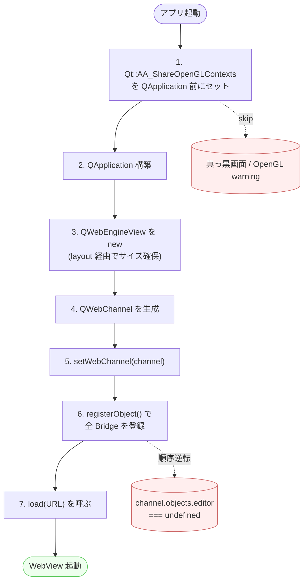

第 3 章で `m_editorPane = new EditorPane(this)` を `setCentralWidget()` していた。本章ではこの `EditorPane` の中身、つまり QWebEngineView を抱えて editor/dist/ をロードする部分を実装する。

## 設計方針

- `EditorPane` は **QWebEngineView を内側に持つ単一 widget**
- ローカルファイル (`editor/dist/index.html`) を `qrc:` または `file:` URL でロード
- 初期化は遅延しない (起動時に同期で load 開始)
- ロード完了通知を `loadFinished` signal で受けて `signalEditorReady()` を発行

## EditorPane.h

```cpp
#pragma once

#include <QWidget>
class QWebEngineView;
class QWebChannel;

class EditorPane : public QWidget {
    Q_OBJECT
public:
    explicit EditorPane(QWidget *parent = nullptr);
    ~EditorPane() override;

    QWebChannel *webChannel() const { return m_webChannel; }
    QWebEngineView *webView() const { return m_webView; }

signals:
    void editorReady();      // editor/dist/index.html ロード完了
    void editorLoadFailed(); // ロード失敗

private slots:
    void onLoadFinished(bool ok);

private:
    QString resolveEditorPath() const;

    QWebEngineView *m_webView = nullptr;
    QWebChannel *m_webChannel = nullptr;
};
```

## EditorPane.cpp

```cpp
#include "EditorPane.h"

#include <QVBoxLayout>
#include <QUrl>
#include <QFile>
#include <QFileInfo>
#include <QCoreApplication>
#include <QtWebEngineWidgets/QWebEngineView>
#include <QtWebEngineCore/QWebEngineSettings>
#include <QtWebEngineCore/QWebEnginePage>
#include <QtWebChannel/QWebChannel>

EditorPane::EditorPane(QWidget *parent) : QWidget(parent) {
    auto *layout = new QVBoxLayout(this);
    layout->setContentsMargins(0, 0, 0, 0);

    m_webView = new QWebEngineView(this);
    layout->addWidget(m_webView);

    // QWebChannel を準備 (実際のオブジェクト登録は第 5 章)
    m_webChannel = new QWebChannel(this);
    m_webView->page()->setWebChannel(m_webChannel);

    // 開発者ツールを有効化したい場合
    auto *settings = m_webView->settings();
    settings->setAttribute(QWebEngineSettings::JavascriptEnabled, true);
    settings->setAttribute(QWebEngineSettings::LocalContentCanAccessRemoteUrls, true);
    settings->setAttribute(QWebEngineSettings::LocalContentCanAccessFileUrls, true);

    connect(m_webView, &QWebEngineView::loadFinished,
            this, &EditorPane::onLoadFinished);

    const auto editorPath = resolveEditorPath();
    if (editorPath.isEmpty()) {
        emit editorLoadFailed();
        return;
    }
    m_webView->load(QUrl::fromLocalFile(editorPath));
}

EditorPane::~EditorPane() = default;

QString EditorPane::resolveEditorPath() const {
    // 1) アプリ実行ディレクトリ直下の editor/index.html (リリース配布形態)
    const auto exeDir = QFileInfo(QCoreApplication::applicationFilePath()).absolutePath();
    const auto deployed = exeDir + "/editor/index.html";
    if (QFile::exists(deployed)) return deployed;

    // 2) プロジェクトルートからの相対 (デバッグ時)
    const auto repoRel = exeDir + "/../../editor/dist/index.html";
    if (QFile::exists(repoRel)) return QFileInfo(repoRel).absoluteFilePath();

    return QString();
}

void EditorPane::onLoadFinished(bool ok) {
    if (ok) {
        emit editorReady();
    } else {
        emit editorLoadFailed();
    }
}
```


## 初期化順の罠



WebEngine は **QApplication 構築後に初めて使える** が、それだけでなく:

1. `QApplication::setAttribute(Qt::AA_ShareOpenGLContexts)` を `QApplication` 構築 **前** に呼ぶ
2. `m_webView = new QWebEngineView(this)` を呼んだ瞬間に Chromium プロセスが spawn する (起動が重い)
3. `setWebChannel()` を `load()` 前に呼ぶ
4. ロードする HTML 側で `<script src="qwebchannel.js"></script>` を **load イベント前に必ず読み込む**

これらが揃わないと「WebView は表示されるが Bridge から JS にアクセスできない」という症状が出る。

### `qwebchannel.js` の参照経路に注意

`<script src="qrc:///qtwebchannel/qwebchannel.js">` の参照は **同じ scheme から load された HTML でないとブロックされる**ことがある。

- `file://editor/dist/index.html` から `qrc:///...` を参照する → ブラウザのセキュリティモデル上、cross-scheme で原則弾かれる
- `LocalContentCanAccessRemoteUrls=true` は HTTP(S) 系には効くが、`qrc:` を許可する設定ではない

実運用での解決策は次のどちらか:

1. **`qwebchannel.js` を editor/dist/ に物理コピー** して `<script src="./qwebchannel.js">` と相対参照する (推奨)
2. **HTML 自体も qrc:// から load する** (本章後段の qrc embed パターン、scheme が揃うので問題なし)

Qt のサンプルが両方混在しているせいで「動くはずなのに何も起きない」事故が多発する。最初は (1) で揃えるのが安全。

## qrc リソース vs ファイルシステム

editor/dist/ をどう配信するかは 2 択ある。

| 方式 | 利点 | 欠点 |
|---|---|---|
| **qrc に embed** (`qt_add_resources`) | バイナリ 1 個で完結、改竄に強い | リビルド必要、開発時の hot reload が遠回り |
| **ファイル配置** (`add_custom_command POST_BUILD`) | dev で web 側を `npm run dev` で hot reload しやすい | バイナリと dir を一緒に配布する必要 |

筆者は **デバッグはファイル配置、リリースは qrc embed** のハイブリッドを推奨する。CMake オプションで切り替える。

```cmake
option(EDITOR_EMBED_QRC "Embed editor/dist/ into qrc" OFF)
if(EDITOR_EMBED_QRC)
    qt_add_resources(youreditor "editor"
        PREFIX "/"
        BASE   "${EDITOR_DIST_DIR}"
        FILES  "${EDITOR_DIST_DIR}/index.html"
    )
endif()
```

`m_webView->load(QUrl("qrc:/editor/index.html"))` でロード。

## DevTools (開発者ツール) の出し方

```cpp
// MainWindow で Cmd+Option+I / F12 で開発者ツールを別ウィンドウに表示
auto *devAction = new QAction(tr("開発者ツール"), this);
devAction->setShortcut(QKeySequence("F12"));
connect(devAction, &QAction::triggered, this, [this]() {
    auto *devTools = new QWebEngineView();
    m_editorPane->webView()->page()->setDevToolsPage(devTools->page());
    devTools->show();
});
addAction(devAction);
```

DevTools は別 QWebEngineView を inspector の page として接続するという少し変わった API。Chromium の DevTools UI が表示される。

## ロード失敗時の UX

```cpp
connect(m_editorPane, &EditorPane::editorLoadFailed, this, [this]() {
    QMessageBox::critical(this, tr("起動エラー"),
        tr("エディタの初期化に失敗しました。\neditor/dist/index.html が見つかりません。\n\n"
           "対処: editor/ ディレクトリで npm run build を実行してください。"));
});
```

editor/dist/ が無い時は静かに白画面ではなく明示的にエラーを出す。配布版で `editor/` 同梱を忘れた事故を即気付ける。

## 落とし穴

1. **`QWebEngineView` のサイズが 0**: layout に詰めずに親に `setCentralWidget` だけすると初期サイズが 0 になることがある。layout 経由で詰める
2. **`loadFinished(false)` が高頻度で出る**: ローカルファイルなのに `LocalContentCanAccessFileUrls` を有効にし忘れている
3. **メモリリーク**: `QWebEnginePage` を自分で new した場合、QWebEngineView 削除後も Chromium プロセスが残ることがある。基本は `QWebEngineView` の自動生成 page に任せる
4. **macOS で WebView の透過背景が黒くなる**: `m_webView->page()->setBackgroundColor(Qt::transparent)` で対処
5. **High DPI で初期サイズがおかしい**: Qt6 では `AA_EnableHighDpiScaling` は **deprecated / no-op** (常時 ON)。Qt5 時代の対処なので Qt6 で書く必要はない。レイアウトが崩れる場合は `Qt::HighDpiScaleFactorRoundingPolicy::PassThrough` の指定など別軸の対処を検討

## 次の章

第 5 章で QWebChannel を使って C++ オブジェクトを JS から呼べるようにし、JSON メッセージで双方向通信する。
