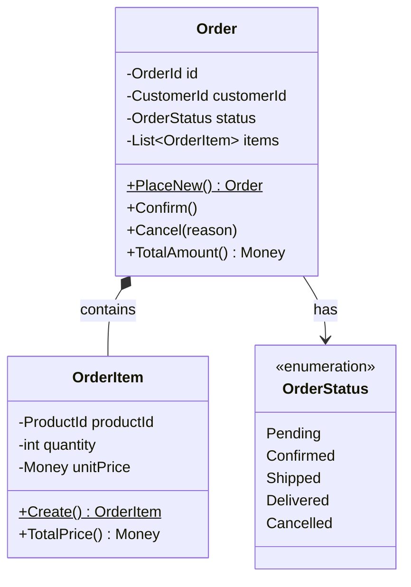

# はじめに — この本が目指すもの

## この本は何を目指しているか

本書は一つの問いに答えるために書かれました。

**「DDD（Domain-Driven Design）を、実務で使えるレベルまで理解・実装・レビューできるようになるには、何が必要か」**

答えは単純ではありません。なぜなら DDD は「技術スタックを覚える」のではなく、「ソフトウェアとビジネスの関係を根本から再設計する思考法」だからです。Aggregate を実装できても、なぜ Aggregate が必要かを説明できなければ、設計レビューで的外れな指摘をしてしまいます。Context Map を描けても、チームの力学を無視した境界を引けば、Conway の法則に反して結局は密結合になります。

本書は **アーキテクトとして DDD を理解・実装・レビュー・設計できるレベル** を到達目標に設定しています。プロジェクトで DDD を提案し、コードレビューで DDD の観点から指摘し、チームに DDD を教えられる——そのレベルまで一冊で到達することを目指します。

---

## この本の構成

本書は 4 つのパートで構成されています。

### Part I: DDD の土台（第1章〜第3章）

「なぜ DDD が必要か」「なぜ普通の開発では限界があるのか」を具体的なバグと設計の失敗例で説明します。ユビキタス言語がなぜコードの品質に直結するか、ドメインを Core / Supporting / Generic に分類することがなぜ投資配分の決定になるかを理解します。

**Part I を読み終えると:**
- DDD を選ぶべき状況と選ばなくてよい状況を判断できる
- ユビキタス言語の用語集を作り、コードに反映できる
- ビジネスの文脈からサブドメインを分類できる

### Part II: Strategic Design（第4章〜第6章）

Bounded Context の設計、Context Map による複数コンテキストの関係設計、Event Storming によるドメイン知識の発見を扱います。これらは「設計をどう分割するか」という最も重要な戦略的判断です。

**Part II を読み終えると:**
- Bounded Context の境界を5つの判断基準で決定できる
- 9つの Context Map パターンを使い分けられる
- Event Storming セッションをファシリテートできる

### Part III: Tactical Design（第7章〜第13章）

Value Object、Entity、Aggregate、Domain Event、Repository、Domain Service / Application Service、Factory を実装します。各パターンの C# .NET 9 による完全実装と、よくある設計ミスの Before/After を提供します。

**Part III を読み終えると:**
- 28 のコードレビュー観点でDDDの実装を評価できる
- EF Core を使った Aggregate の永続化を設計できる
- Domain Event 駆動のアーキテクチャを実装できる

### Part IV: Architecture & Advanced Patterns（第14章〜第23章）

Hexagonal Architecture / Clean Architecture、CQRS、Event Sourcing、Saga / Process Manager、Read Model、マイクロサービスとの関係、テスト戦略、レガシーシステムのリファクタリングを扱います。

**Part IV を読み終えると:**
- ポート＆アダプターパターンでテスト可能なアーキテクチャを設計できる
- CQRS + Event Sourcing の判断基準と実装を理解できる
- 既存システムを Strangler Fig パターンで段階的に DDD 化できる

---

## 誰のために書かれているか

### 主な対象読者

**ソフトウェアアーキテクト / テックリード**

設計の決定を下す立場にある方。DDD を導入すべきかどうかの判断、Bounded Context の境界線の引き方、チームへの DDD の教え方を学べます。

**シニアエンジニア（3年以上の経験）**

コードを書くだけでなく、設計全体を考える段階に入った方。「なぜこの設計はリファクタリングしにくいのか」「なぜバグが特定の場所に集中するのか」という問いに、DDD の観点から答えが得られます。

**C# / .NET エンジニア**

本書のサンプルコードはすべて C# .NET 9 です。EF Core、Dapper、MediatR、MassTransit など、.NET エコシステムのライブラリと DDD パターンの統合を実践的に学べます。

### この本が想定していない読者

- プログラミング未経験者（オブジェクト指向の基礎を前提とします）
- 単純な CRUD アプリのみを作る方（DDD はそのようなシステムには過剰設計です）
- 特定のフレームワークの使い方を学びたい方（本書はパターンと設計の本です）

---

## サンプルコードについて

### ECサイトを題材に

本書では一貫して「ECサイト（オンラインショッピング）」を題材に使います。注文管理、在庫管理、顧客管理、決済、配送の各コンテキストを使って、DDD の全パターンを説明します。

ECサイトを選んだ理由:
- 読者がビジネスルールを直感的に理解できる
- Core / Supporting / Generic の分類が明確
- Bounded Context が複数存在し Context Map を描ける
- Event Sourcing、CQRS、Saga などの高度なパターンも自然に登場する

### C# .NET 9 の構文

```csharp
// 本書で使う .NET 9 の新構文例

// File-scoped namespace（ネストを減らす）
namespace OrderContext.Domain.Orders;

// Primary constructor（依存注入の簡素化）
public sealed class PlaceOrderHandler(
    IOrderRepository orderRepo,
    IDomainEventDispatcher dispatcher)
{
    // ...
}

// Collection expressions（リストの初期化）
var items = [
    OrderItem.Create(productId, "商品A", 1, Money.Of(1000m, "JPY")),
    OrderItem.Create(productId2, "商品B", 2, Money.Of(2000m, "JPY"))
];

// Pattern matching（状態による分岐）
var message = order.Status switch
{
    OrderStatus.Pending  => "注文受付中",
    OrderStatus.Confirmed => "注文確定",
    OrderStatus.Shipped  => "発送済み",
    OrderStatus.Delivered => "配達完了",
    OrderStatus.Cancelled => "キャンセル済み",
    _ => throw new InvalidOperationException($"不明なステータス: {order.Status}")
};

// Record（Value Object に適している）
public sealed record Money(decimal Amount, string Currency)
{
    public Money Add(Money other)
    {
        if (Currency != other.Currency)
            throw new InvalidOperationException("通貨が異なります");
        return this with { Amount = Amount + other.Amount };
    }
}
```

### GitHub リポジトリ

本書のサンプルコードは `SakakitaniJunya/ddd-csharp-sample` で公開しています。

```
ddd-csharp-sample/
├── src/
│   ├── OrderContext/          # 注文コンテキスト
│   │   ├── Domain/            # Domain Layer
│   │   │   ├── Orders/        # Order Aggregate
│   │   │   ├── Customers/     # Customer Reference
│   │   │   └── Shared/        # Value Objects
│   │   ├── Application/       # Application Layer
│   │   ├── Infrastructure/    # Infrastructure Layer
│   │   └── Api/               # API Layer
│   ├── InventoryContext/      # 在庫コンテキスト
│   ├── CustomerContext/       # 顧客コンテキスト
│   └── SharedKernel/          # 共有カーネル（Money, Address など）
├── tests/
│   ├── OrderContext.Tests/    # 注文コンテキストのテスト
│   └── Integration.Tests/    # 統合テスト（TestContainers使用）
└── docs/
    └── class-diagrams/        # Mermaid クラス図
```

各章のコードは `ch01/`, `ch07/`, `ch09/` のようにディレクトリで管理されています。

---

## DDD を学ぶ際の注意点

### DDD は「銀の弾丸」ではない

DDD は強力な設計手法ですが、全てのプロジェクトに適しているわけではありません。

**DDD が効果的な場合:**
- ビジネスロジックが複雑で、ドメイン専門家との継続的なコラボレーションが必要
- 長期間（数年以上）にわたって開発・保守が続くシステム
- 複数のチームが同じドメインの異なる側面を開発している
- 将来的にシステムが大きく進化することが予想される

**DDD が不要な場合:**
- 単純な CRUD（Create/Read/Update/Delete）アプリ
- 短期間で廃棄される可能性があるプロトタイプ
- ドメインルールがほとんどない（= 単なるデータの読み書き）
- チームが小さく、コミュニケーションのオーバーヘッドを避けたい

### 「Big Design Up Front」にしない

DDD を学ぶと「最初から完璧な Bounded Context を設計しなければ」という衝動に駆られることがあります。しかし Evans 自身が強調するように、DDD のモデルは「発見する」ものであり、最初から「決定する」ものではありません。

反復的なアプローチ:
1. まず動くシステムを作る（シンプルに）
2. ドメイン専門家と会話し続ける
3. 会話の中でモデルを発見する
4. コードにモデルを反映させる
5. 2に戻る

### 「Aggregate の大きさ」は最初から完璧にならない

特に Aggregate の境界設計は、実際にシステムを動かしてからでないと見えてこない問題が多くあります。最初に「Order Aggregate は何を含むべきか」という問いに正解はなく、実装を進める中でビジネスの要件と技術的な制約が見えてきます。最初のバージョンが変わることを恐れないでください。

---

## Mermaid 図について

本書では設計を可視化するために Mermaid 記法を使います。Zenn では Mermaid 図がレンダリングされます。



クラス図（`classDiagram`）、シーケンス図（`sequenceDiagram`）、状態遷移図（`stateDiagram-v2`）、フロー図（`graph`）を使い分けます。

---

## 専門家の視点について

本書には「専門家の視点」として、Eric Evans、Vaughn Vernon などの DDD の権威の言葉を引用します。これらは全て著書・講演・ブログから引用したものです。引用の際は出典を明記しています。

**引用の例:**

Eric Evans（Blue Book, 2003）より:
> 「ドメインの複雑さに立ち向かうには、そのドメインを徹底的に理解しなければならない。そのためには、ドメインの専門家との密なコラボレーションが不可欠だ」

Vaughn Vernon（*Implementing Domain-Driven Design*, 2013）より:
> 「Aggregate の境界を決めるのは、トランザクションの一貫性の単位だ。何が一つのビジネストランザクションで変わるべきかを理解することが、Aggregate 設計の核心にある」

これらの引用は、筆者の実践的な経験・解釈と組み合わせることで、単なる理論書ではなく「現場で使える指針」を提供します。

---

## 謝辞

本書は多くの人々の知恵に支えられています。

Eric Evans の "Domain-Driven Design"（2003）は、複雑なソフトウェアシステムに立ち向かう哲学を教えてくれました。Vaughn Vernon の "Implementing Domain-Driven Design"（2013）は、その哲学を実装レベルに落とし込む方法を示してくれました。Alberto Brandolini の "Introducing Event Storming" は、ドメイン知識を引き出す実践的な手法を提供してくれました。

また、日本語 DDD コミュニティの皆様——勉強会、読書会、ブログ記事で共有された知見は、本書の随所に影響しています。

---

## 読み進め方のヒント

本書は最初から順番に読むことを推奨しますが、以下の読み方も可能です。

**「急ぎで DDD の概要を掴みたい」場合:**
第1章 → 第4章 → 第7〜9章 → 第14章の順で読む（概要把握）

**「C# での具体的な実装を知りたい」場合:**
第7〜13章を中心に、各章のコードを手元で動かしながら読む

**「既存システムに DDD を導入したい」場合:**
第18章（リファクタリング）から先に読む

**「マイクロサービスとの関係を理解したい」場合:**
第4〜5章（Bounded Context / Context Map）→ 第19章（マイクロサービス）→ 第22章（Saga）

---

それでは、DDD の世界へ踏み出しましょう。複雑なビジネスロジックが、クリーンでテスト可能な、ビジネスの言語で語られるコードに変わっていく体験を、ぜひ一緒に楽しみましょう。
