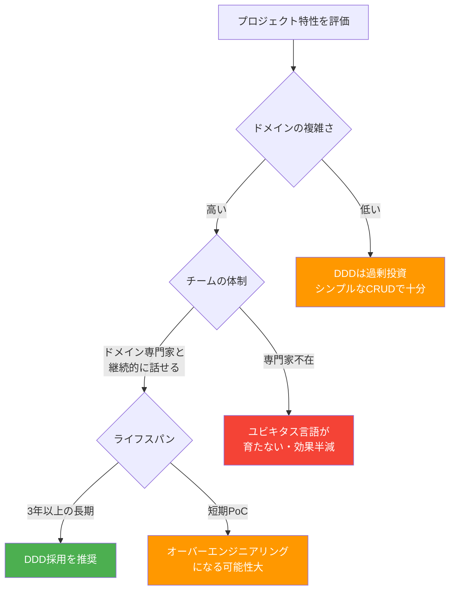

## 1.1 2003年、Eric Evansが見た危機

2003年、Eric Evansは500ページを超える一冊の本を世に送り出しました。タイトルは *Domain-Driven Design: Tackling Complexity in the Heart of Software*（通称「Blue Book」）。この本が生まれた背景には、当時のソフトウェア業界が直面していた深刻な問題がありました。

それは、「ソフトウェアがビジネスの言葉を話せない」という問題です。

1990年代から2000年代初頭にかけて、オブジェクト指向プログラミングが普及し、UMLによる設計手法も広まりました。しかし多くの現場では、エンジニアとビジネス担当者は互いに翻訳を必要とする「外国語」で会話していました。エンジニアは「テーブル」「カラム」「JOIN」と話し、ビジネス担当者は「受注」「与信」「引当」と話す。この言語的断絶が、仕様の誤解・手戻り・技術的負債の根本原因でした。

Evansはこの状況を変えるために、ドメイン駆動設計（DDD）という体系を提唱しました。

## 1.2 データ駆動 vs ドメイン駆動：設計思想の違い

DDDを理解するには、まず「データ駆動設計」との対比が有効です。

**データ駆動設計の典型例：**

```csharp
// テーブル構造を直接クラスに写したデータ駆動の設計
public class OrderTable
{
    public int OrderId { get; set; }
    public int CustomerId { get; set; }
    public int StatusCode { get; set; }  // 0=新規, 1=処理中, 2=完了, 3=キャンセル
    public decimal TotalAmount { get; set; }
    public DateTime CreatedAt { get; set; }
}

// サービス層でビジネスロジックが溢れ出す
public class OrderService
{
    public void ProcessOrder(int orderId)
    {
        var order = _repo.FindById(orderId);
        if (order.StatusCode == 0 && order.TotalAmount > 0)
        {
            order.StatusCode = 1;
            // ここに数百行のビジネスロジック...
        }
    }
}
```

このコードを読んでも、「注文がキャンセルできる条件は何か」「与信チェックはどこで走るか」はわかりません。ビジネスルールがコードに埋没しています。

**ドメイン駆動設計の同じ機能：**

```csharp
// ドメインの言語でモデルを表現する
public class Order
{
    private readonly List<OrderItem> _items;
    public OrderId Id { get; }
    public CustomerId CustomerId { get; }
    public OrderStatus Status { get; private set; }
    public Money TotalAmount => _items.Sum(i => i.SubTotal);

    // ビジネスルールをドメインオブジェクト自身が持つ
    public void Confirm(CreditCheckService creditCheck)
    {
        if (Status != OrderStatus.Draft)
            throw new InvalidOperationException("下書き状態の注文のみ確定できます");

        if (!creditCheck.IsApproved(CustomerId, TotalAmount))
            throw new DomainException("与信限度額を超えています");

        Status = OrderStatus.Confirmed;
        AddDomainEvent(new OrderConfirmed(Id, TotalAmount));
    }

    public void Cancel(CancellationReason reason)
    {
        if (Status == OrderStatus.Shipped)
            throw new DomainException("発送済み注文はキャンセルできません");

        Status = OrderStatus.Cancelled;
        AddDomainEvent(new OrderCancelled(Id, reason));
    }
}
```

「注文は下書き状態のみ確定できる」「発送済みはキャンセル不可」というビジネスルールが、コードを読めば即座に理解できます。これが「コードがビジネスの言語を話す」ということです。

## 1.3 DDDが効く条件 / 効かない条件



DDDは万能薬ではありません。特に以下のケースでは費用対効果が低くなります。

- **CRUD中心のシンプルなシステム**：マスタ管理、設定画面など、データの登録・表示・削除が主目的の画面
- **短命なプロトタイプ**：2〜3ヶ月で捨てる検証用コード
- **ドメイン専門家が不在または非協力的**：ユビキタス言語が育たず、名前だけのDDDになる

逆に、DDDが真価を発揮するのは次のような条件下です。

- ビジネスルールが複雑で、かつ頻繁に変化する
- ドメイン専門家（業務担当者）とエンジニアが継続的に協業できる
- 3年以上運用するシステムで、技術的負債の蓄積コストが高い

## 1.4 「コードがビジネスの言語を話す」とはどういうことか

具体的に考えてみましょう。ネイルサロンの予約システムを例に取ります。

業務担当者はこう言うでしょう。「予約は、空き枠があって、かつ顧客がブラックリストに入っていなければ受け付けられます。キャンセルは24時間前まで無料ですが、それ以降はキャンセル料が発生します。」

このビジネスルールが次のコードに自然に対応していると、コードを読んだエンジニアは業務担当者と同じ言葉で会話できます。

```csharp
public class Reservation
{
    public ReservationId Id { get; }
    public TimeSlot TimeSlot { get; }
    public CustomerId CustomerId { get; }
    public ReservationStatus Status { get; private set; }

    public static Reservation Book(
        TimeSlot slot,
        Customer customer,
        AvailabilityChecker availability)
    {
        if (!availability.IsAvailable(slot))
            throw new DomainException("指定の時間帯は空き枠がありません");

        if (customer.IsBlacklisted)
            throw new DomainException("予約を受け付けできないお客様です");

        return new Reservation(slot, customer.Id);
    }

    public CancellationFee Cancel(DateTimeOffset cancelledAt)
    {
        var hoursUntilAppointment = (TimeSlot.StartAt - cancelledAt).TotalHours;

        return hoursUntilAppointment >= 24
            ? CancellationFee.Free
            : CancellationFee.Full;
    }
}
```

「空き枠」「ブラックリスト」「キャンセル料」という言葉が、コードの中にそのまま生きています。これがDDDの本質です。

---

> ### 参考文献と著者の解釈：Eric Evans
>
> Eric Evansは *Domain-Driven Design*（2003年）の中でこう述べています。
>
> **「ソフトウェアの心臓は、ユーザーのドメイン関連の問題を解決する能力にある。その他の機能はすべて、その中心的な目的を支えるものに過ぎない。」**
>
> この言葉は、多くの現場で忘れられている真実を突いています。技術的な洗練さ—マイクロサービス、最新のフレームワーク、完璧なCI/CDパイプライン—はすべて手段です。目的は常に「ビジネスの問題を解決すること」であり、その能力の源泉はドメインモデルの質にあります。
>
> Evansが強調するのは「深いモデル（Breakthrough Model）」の追求です。表面的な機能一覧をクラス化するのではなく、ビジネスの本質的な概念・規則・関係をコードに落とし込む。その深みが、長期にわたってシステムを柔軟に保つ唯一の方法である—というのがDDDの根底にある哲学です。

---

## まとめ

DDDは「コードをデータベース構造から解放し、ビジネスの言語と一致させる」設計思想です。2003年にEvansが提唱して以来、20年以上を経た今も、複雑なビジネスドメインを扱うシステム開発の指針として有効であり続けています。次章では、その実践の出発点となる「ユビキタス言語」について詳しく見ていきます。
