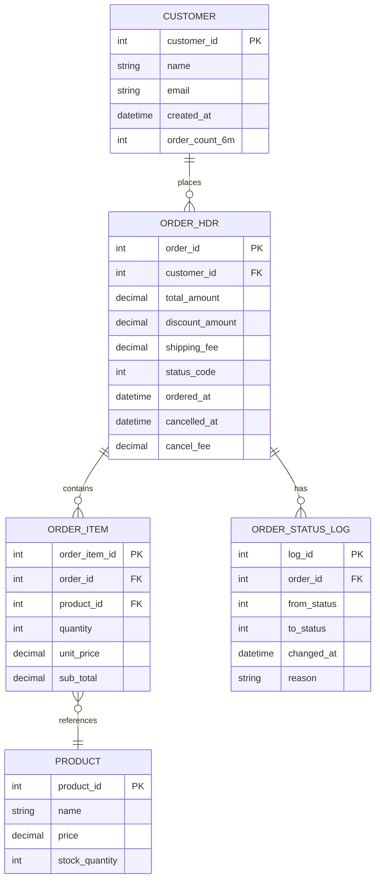
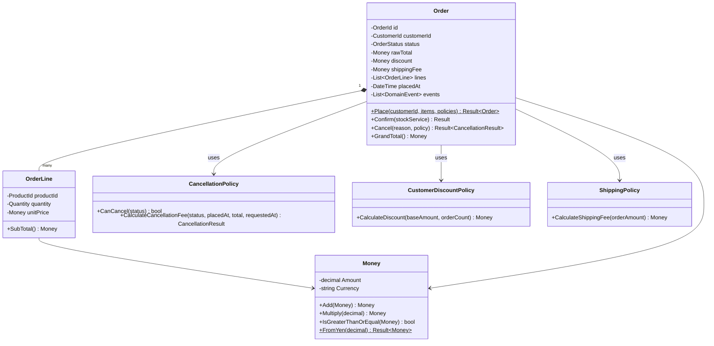
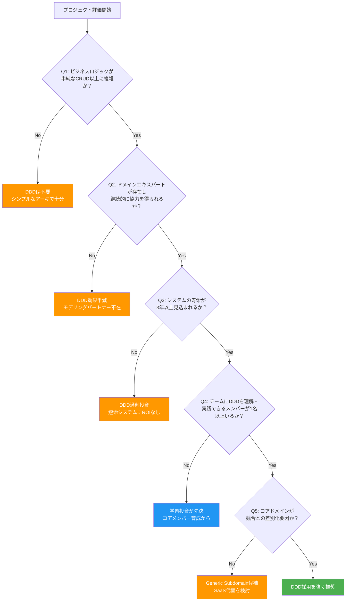
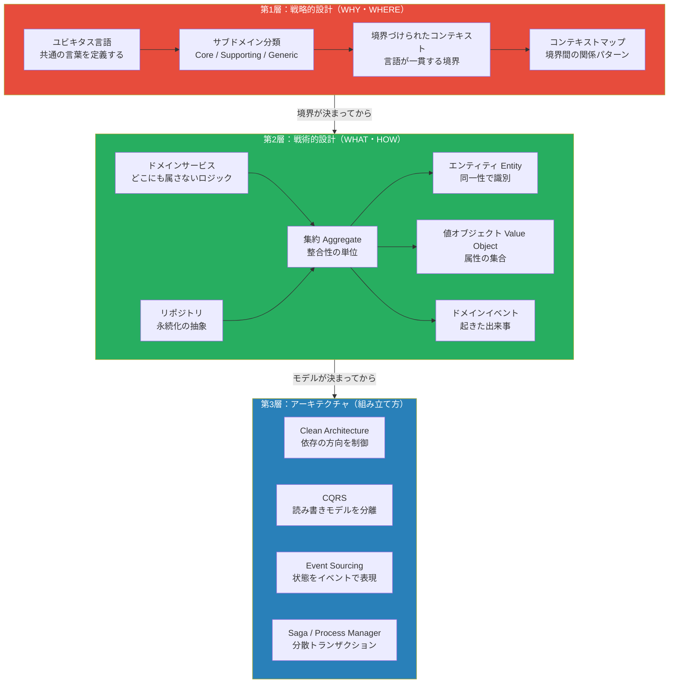

# 第1章: なぜDDDなのか — ソフトウェア設計の根本問題と処方箋

---

## 0. TL;DR（3行）

ドメイン駆動設計（DDD）とは「ビジネスの言葉でコードを書く」という思想であり、デザインパターンの集合ではありません。複雑なビジネスロジックを抱えるシステムにおいて、エンジニアとドメインエキスパートの「言語の乖離」が腐敗の根本原因であることをEvansは1990年代の実践から導き出しました。本章ではDDDの誕生背景・3大誤解・データ駆動との本質的差異を解説し、あなたのプロジェクトにDDDが必要かどうかを判断する基準を示します。

---

## 1. 2003年、Eric Evansが見た危機（詳細版）

### 1.1 1990年代のソフトウェア開発が抱えていた構造的問題

2003年に「Domain-Driven Design: Tackling Complexity in the Heart of Software」（通称Blue Book）が出版されたとき、ソフトウェア業界はある種のパラドックスに苦しんでいました。ハードウェアは飛躍的に進化し、オブジェクト指向言語（C++、Java）が普及し、リレーショナルデータベースは成熟していた。にもかかわらず、大規模プロジェクトの失敗率は依然として高く、「なぜ技術が揃っているのに、ビジネスの問題が解けないのか」という矛盾が現場に蔓延していました。

1990年代の典型的な大規模SI開発を振り返りましょう。当時の主流はウォーターフォール型のプロセスで、工程は厳格に分離されていました。要件定義フェーズでは業務アナリストが顧客のビジネスプロセスをヒアリングし、数百ページにわたる「要件定義書」に落とし込みます。次に基本設計フェーズでは設計者がERD（Entity-Relationship Diagram）を中心に、テーブル定義書とシステム間インターフェース定義書を作成します。詳細設計フェーズではプログラマがその設計書を見ながら、C言語やCOBOLで手続き的なコードを書いていきます。

この工程分離が致命的な問題を生み出していました。要件定義書には「受注処理」「与信管理」「在庫引当」というビジネス用語が溢れていますが、詳細設計書になると「ORDER_HDRテーブル」「CREDIT_CHKプロシージャ」「STOCK_ALLCルーチン」に変換されます。そして実装コードでは `processOrder()`, `checkCredit()`, `allocateStock()` という関数群に翻訳されます。この3段階の「翻訳」の連鎖の中で、ビジネスの意図はどこかに消えていきます。

もう一つの問題は「データベース中心設計」の台頭でした。RDBMSの登場により、多くの設計者は「データを正規化されたテーブルに格納すれば、あとはSQLで何でも取り出せる」という発想を持つようになりました。この考え方は決して間違いではありませんが、ビジネスロジックがどこに宿るべきかという問いへの答えとしては不完全です。データは格納できても、「このデータを使って何をするか」「どういう状況でこのデータの変化が許されるか」というルールは、データベース外のどこかに書かなければならない。そのどこかが、多くの場合「ストアドプロシージャ」や「サービスクラスのif文の嵐」になっていきました。

大規模SIにおける別の問題として「設計者と実装者の分離」がありました。設計者（SE）が詳細設計書を書き、実装者（PG）がそれをコードに翻訳する工場型の開発では、設計者がドメインの深い理解を持っていても、その知識は設計書という形式的なドキュメントに封じ込められ、実装者に完全に伝わりません。逆に実装者がドメインに対する鋭い洞察を得ても、設計書への反映経路がなければ消えてしまいます。知識の流通経路がなく、ドメイン理解がコードに蓄積されない構造でした。

### 1.2「技術はあるのに、ビジネスの問題が解けない」の矛盾

Evansが実際のコンサルティング現場で見た光景は、次のようなものでした。

あるプロジェクトでは、保険業務システムの再設計を担当していました。顧客企業の業務担当者（ドメインエキスパート）は「保険契約の『失効』と『解約』は全く別のビジネスイベントであり、処理フローも会計処理も根本的に異なる」と熱心に説明します。しかしエンジニアが設計したシステムでは、`Status`カラムに `EXPIRED` と `CANCELLED` という値を持つだけの単純なステータス管理でした。業務担当者が言う「失効」の意味——保険料未払いによる契約効力の自動停止、猶予期間の管理、復活申請の可否——はコードのどこにも表現されていませんでした。

この状況が引き起こすのは単なる「仕様ミス」ではありません。コードとビジネスの言語が乖離したまま年月が経つと、誰も全体像を把握できなくなります。新機能要求が来るたびに「このロジックをどこに書けばいいか分からない」という状況が生まれ、既存コードを読んでも何をやっているか分からない。業務担当者に聞いても「システムがどう動いているか分からないから、システムに合わせて業務を変えている」という本末転倒が起きます。

これはEvansが「知識の腐敗（Knowledge Digestion Failure）」と呼んだ現象です。ドメインエキスパートの頭の中にある豊かなビジネス知識が、コードに変換される過程で蒸発してしまう。残るのは技術的な実装のアーティファクトだけで、ビジネスの意図は誰の頭の中にも、コードの中にも存在しなくなります。

技術的な負債という概念は1992年にWard Cunninghamが提唱しましたが、多くの現場ではこれを「リファクタリングすれば解消できる技術的な問題」として捉えていました。しかしEvansはより深い問題に気づいていました。技術的な構造の問題ではなく、「ビジネスとコードの概念的乖離」こそが最も解消困難な負債であると。コードをいくらリファクタリングしても、ドメインの概念がモデルに正しく取り込まれていなければ、問題は形を変えて繰り返すだけです。

### 1.3 Evansが気づいた根本原因：「コードとビジネスの言語が乖離している」

複数のプロジェクトを経験する中でEvansが辿り着いた洞察は、驚くほどシンプルなものでした。

**「エンジニアとビジネスが異なる言語を使っている限り、どれだけ技術が優れていても本質的な問題は解決できない」**

この命題を真剣に受け止めると、解決策も自ずと見えてきます。エンジニアとビジネスが共通の言語（ユビキタス言語）を持ち、その言語でコードを書けば、コードとビジネスの乖離は構造的に防げるはずです。

しかし「共通言語を使いましょう」というのは言うは易し行うは難しです。ビジネスの言語は曖昧で文脈依存的です。「顧客」という言葉一つをとっても、営業部門では「見込み客も顧客」、経理部門では「入金実績がある取引先のみ顧客」、カスタマーサポートでは「製品を購入済みの人のみ顧客」と定義が異なります。この曖昧さに向き合い、文脈ごとに明確な境界を引く——これが後に「境界づけられたコンテキスト（Bounded Context）」として体系化される概念の萌芽でした。

もう一つの洞察は「ドメインモデルは単なるデータ構造ではなく、ビジネスの振る舞いを内包すべきである」というものでした。注文（Order）クラスがあるとして、それは単に `OrderId`, `CustomerId`, `TotalAmount` というプロパティを持つデータ入れ物ではなく、「注文を確定する」「注文をキャンセルする（ただしキャンセル期限を過ぎた場合は不可）」「値引きを適用する（ただし承認済みのプロモーションコードに限る）」という振る舞いを持つべきです。データとロジックをオブジェクトとして統合する——これはオブジェクト指向の基本原則でありながら、実際の大規模システムではほとんど守られていませんでした。

Evansはこの現象を後に「Anemic Domain Model（貧血ドメインモデル）」と命名しました。ドメインオブジェクトが振る舞いを持たないデータ構造に過ぎず、すべてのビジネスロジックが「サービス層」に集中するアンチパターンです。Martin Fowlerも「Anemic Domain Modelはドメインモデルの利点をすべて失いながら、手続き型プログラミングのコストだけが残る」と批判しています。

### 1.4 Blue Book 誕生の経緯と業界への影響

Evansは1990年代末から2000年代初頭にかけて、自身の考えを体系化していきました。2003年に出版されたBlue Bookは全560ページにわたる大著で、当初はそれほど大きな反響を得られませんでした。Javaエンタープライズ開発全盛期のこの時代、Spring FrameworkやHibernateが注目の的であり、「ドメインモデル」という概念はむしろ「重くて使いにくい」というイメージを持たれていました（いわゆるAnemic Domain Modelへの批判が本書に含まれていたにもかかわらず、アーキテクチャの主流はまさにAnemicでした）。

転換点は2006年から2010年代にかけて、いくつかの変化が重なったことで訪れます。まず、XP（エクストリームプログラミング）やスクラムの普及により「ドメインエキスパートとの継続的なコラボレーション」が開発プロセスに組み込まれるようになりました。これはDDDの実践と親和性が高い変化でした。次に、CQRS（Command Query Responsibility Segregation）やEvent Sourcingといったアーキテクチャパターンが登場し、これらをDDDと組み合わせることで複雑なビジネスシステムをエレガントに設計できることが実証されました。そしてマイクロサービスアーキテクチャの台頭により、「境界づけられたコンテキスト」はサービス分割の指針として再評価されました。

特にGreg Youngが2010年頃に提唱したCQRS+Event Sourcingのパターンは、DDDとの組み合わせで「複雑なビジネスロジックを持つイベント駆動システム」の設計に強力な解決策を提供しました。Vaughn Vernonが2013年に出版した「Implementing Domain-Driven Design」（ヴァーノン本）は、Blue Bookの理論を具体的な実装に落とし込み、DDDの普及に決定的な役割を果たしました。

現在（2026年時点）では、DDDはモノリスからマイクロサービス、さらにはAIを組み込んだ複雑なシステム設計においても中心的な設計思想として確立しています。特にC# .NETの世界では、Microsoftが提供するeShopOnContainersリファレンスアーキテクチャがDDD+CQRSをベースにしており、.NET 9の最新機能（Primary Constructor、新しいパターンマッチング構文、Discriminated Unionsの検討）もDDDの実践をより自然に記述できるよう進化しています。

---

## 2. DDDの3大誤解

### 2.1 誤解1: DDDはデザインパターンの集合である（正：思想・哲学）

DDDを「学ぼう」と決めた多くのエンジニアが最初にやることは「Entity、Value Object、Aggregate、Repository、Domainサービスを覚える」ことです。確かにBlue Bookにはこれらの戦術的パターンが詳細に解説されています。しかし、これらのパターンを暗記し、機械的に適用することはDDDの実践ではありません。むしろ、この誤解こそがDDD導入の最大の罠です。

なぜこれが誤解なのかを具体例で示しましょう。

ある開発チームがDDDを導入することになりました。チームはBlue Bookを読み、次のようなコードを書きました。一見「DDDっぽく」見えます。EntityをOrderIdで識別し、Value ObjectとしてMoneyを使い、Aggregateとして内部のOrderItemリストを保護しています。しかし、このコードにはDDDの本質が欠けています。

何が欠けているのでしょうか？それは「ビジネスルール」と「ユビキタス言語」です。現実のビジネスでは「注文をキャンセルする」というオペレーションは無条件に行えるわけではありません。「発送準備完了後はキャンセル不可」「当日注文は1時間以内のみキャンセル可能」「キャンセル時は在庫を戻す必要がある」といったルールが必ずあります。

さらに「ユビキタス言語」の観点から見ると、`AddItem` という名前はビジネス的に正しいでしょうか？ビジネス担当者は「商品を追加する」と言うかもしれませんが、「明細を追加する」「注文行を追加する」と表現するかもしれません。また、注文が「確定」される前後で「商品を追加できる状態」は変わるはずです。確定後の注文に商品を追加できるのか？これらの疑問に答えることなく、単にクラスとメソッドを作ることは「DDDのパターンを適用した」ではなく「DDDの用語を借りただけ」です。

DDDの本質は「ドメインエキスパートとエンジニアが継続的な対話を通じてドメインモデルを精緻化し、その理解をコードに反映し続けるプロセス」です。パターンはその副産物として自然に現れるものであり、パターンから逆算してドメインを設計するものではありません。

Evansはこのことを「Model-Driven Design」という章で明確に述べています。モデルとコードは双方向に影響し合うべきであり、コードを見ればビジネスの理解が分かり、ビジネスの変化はコードに直接反映されるべきです。この双方向性こそがDDDの核心であり、パターンの暗記では絶対に到達できない境地です。

正しいアプローチは「ドメインエキスパートとの会話から始める」ことです。「注文のキャンセルにはどんな条件がありますか？」「状態が変わるのはどんなイベントが起きた時ですか？」「この業務用語はチームによって意味が違うことはありますか？」——こうした質問を通じてユビキタス言語を構築し、そのモデルがコードに自然に落ちてくる。その結果として現れるコードに、EntityやAggregateというパターンが含まれているのです。

DDDをパターンの集合と捉えると、「Repository実装を正しく書けた→DDDができている」という錯覚が生まれます。しかし本質的には「この境界の内側でRepository操作は正確にAggregateルートのみを対象とし、整合性の単位がビジネスルールと一致しているか」を問わなければなりません。テクニックの正確さではなく、ビジネスとの整合性がDDDの評価軸です。

ここで重要な補足をします。パターンを学ぶこと自体は無価値ではありません。Value ObjectをC#でどう実装するか、Aggregateの整合性をどう保証するか——これらの技術的知識は不可欠です。問題は「パターンを先に学んでから、ドメインに当てはめようとする」順序にあります。正しくは「ドメインを先に理解し、その表現として自然にパターンが選ばれる」です。

### 2.2 誤解2: すべてのプロジェクトにDDDを使うべきである（正：複雑ドメイン限定）

DDDの魅力に気づいたエンジニアが次に陥る罠は「DDDはベストプラクティスだから全プロジェクトに適用すべき」という考えです。これは治療法の過剰投与と同じ問題であり、DDDが本来解決しようとしている複雑性よりも多くの複雑性を生み出すことがあります。

Evansは本書の中でアプリケーションを「コア・ドメイン（Core Domain）」「サポーティング・サブドメイン（Supporting Subdomain）」「汎用サブドメイン（Generic Subdomain）」に分類しています。この分類は「どこにDDDを適用すべきか」の答えを示しています。

**コア・ドメイン**とは、あなたの事業の競合優位性の源泉となるビジネスロジックを含む領域です。保険会社であれば「リスク評価モデル」、ECサイトであれば「パーソナライズされたレコメンデーションエンジン」、物流会社であれば「最適配送ルート計算」がコア・ドメインに当たります。ここは競合他社と差別化する部分であり、ビジネスルールが複雑で頻繁に変化し、ドメインエキスパートの深い知識が不可欠です。**DDDを集中的に適用すべきはここだけです。**

**サポーティング・サブドメイン**はコア・ドメインを支える補助的な業務領域です。通知送信、帳票出力、ユーザー管理などが典型例です。ここはビジネス的に重要ですが、競合優位性には直結しません。DDDの一部の概念は有用ですが、フル適用は過剰投資になります。シンプルなサービス層と薄いリポジトリで十分なケースも多いです。

**汎用サブドメイン**は認証・認可、メール送信、決済処理など、業界標準ライブラリやSaaSで代替できる領域です。ここにDDDを適用するのは明確な無駄です。Keycloak、Stripe、SendGridといった既製品を使うべきです。

**DDDのコストは無視できません。** DDDを適切に実践するには次のコストが発生します。

1. **ドメインエキスパートとの定期的なモデリングセッション** — 週2〜4時間×複数ヶ月の継続的投資が必要です。ドメインエキスパートの時間は通常、最も希少なリソースの一つです。
2. **ユビキタス言語の維持管理** — 用語集の更新、チーム内での言語統一の努力、新メンバーへのオンボーディングコストが発生します。
3. **高い設計スキルの要求** — どこがAggregateの境界か、どこにBounded Contextを引くかの判断は経験と深い理解を必要とします。間違った境界設定はコスト最大化のリスクがあります。
4. **学習コスト** — チーム全員がDDDを理解するまでの時間投資。特にAggregateの設計は習得に数ヶ月かかることがあります。
5. **短期的な開発速度の低下** — パターン適用の検討、ユビキタス言語の確認、モデリングセッションによるオーバーヘッドが発生します。最初の3〜6ヶ月は特に顕著です。
6. **テスト設計の複雑さ** — ドメインロジックのテストは比較的容易になりますが、集約間の整合性テスト、Domain Eventのテストなど新たな課題も生まれます。

これらのコストに見合うリターンがあるのは、ビジネスロジックが十分に複雑な場合に限ります。「Excelで管理していた業務をシステム化する」「CRUDが中心のデータ管理ツール」「短命なプロトタイプ」にDDDを適用することは、単純に時間とコストの無駄です。

では「十分に複雑」とはどういう状態を指すのでしょうか？Section 4で詳細な判断基準を示しますが、端的に言えば「ビジネスルールが競合他社と差別化する源泉になっており、そのルールを正確に実装することがシステムの価値の大部分を占める」場合です。CRUD操作の多さではなく、ビジネスロジックの深さと変化の頻度が判断軸になります。

現実的に言えば、多くのビジネスアプリケーションの80%以上はCRUDで構成されており、DDDが真に必要なのはその中の複雑なコアロジックを扱う部分です。ECサイト全体にDDDを適用するのではなく、「注文・決済フロー」「在庫引当ロジック」「プロモーション適用エンジン」といったコア部分にのみDDDを集中させ、商品カタログの表示や検索結果の返却といった部分はシンプルなクエリサービスで実装する——この使い分けが実務における正しいDDDの適用です。

### 2.3 誤解3: EntityとValue Objectを覚えれば理解できる（正：戦略的設計が先）

これは誤解1の変形版ですが、より具体的な失敗パターンとして独立して論じる価値があります。多くのDDD入門書やオンライン記事が「Entity vs Value Object」という概念から始めるため、多くの学習者がここから学習を開始します。しかし戦術的設計（Tactical Design）のパターンを先に学ぶことは、設計全体を正しく方向付けることができません。

なぜなら、Entity（エンティティ）とValue Object（値オブジェクト）をどう使うかは、Bounded Context（境界づけられたコンテキスト）の境界をどこに引くかによって大きく変わるからです。

例えば「ユーザー」という概念を考えましょう。ECサイトの「注文コンテキスト」では、ユーザーは注文者として識別され、過去の注文履歴によって振る舞いが変わる「エンティティ」です。一方、「レコメンデーションコンテキスト」では、ユーザーはある行動パターンを持つ「属性の集合体」として扱われ、Value Objectに近い扱いになるかもしれません。さらに「認証コンテキスト」では、ユーザーはメールアドレスとパスワードハッシュを持つ認証主体として独立して管理されます。

同じ「ユーザー」という言葉が、コンテキストによって全く異なるモデルになるのです。この認識なしに「ユーザーはエンティティだ」と決めてしまうと、コンテキストを超えた巨大なUserクラスが生まれ、あらゆる業務の文脈が混入した「神クラス」になります。これはDDDを導入したにもかかわらず、結果として最悪の設計を生み出すパターンです。

もう一つの典型的な失敗例を示します。あるチームが「住所」をValue Objectとして実装しました。以下のようなコードです。

```csharp
// 一見正しいValue Object実装
public sealed record Address(
    string PostalCode,
    string Prefecture,
    string City,
    string Street,
    string? Building = null);
```

しかしこの実装は、どのBounded Contextで使われるかによって問題になります。「配送コンテキスト」では住所は配送業者APIとのインターフェースに合わせた正規化が必要かもしれません。「請求コンテキスト」では法人の登記住所として管理する必要があり、個人の自宅住所とは別エンティティとして扱うべきかもしれません。「マーケティングコンテキスト」では都道府県と市区町村だけが必要で、詳細な番地は不要かもしれません。

Bounded Contextを定義せずに「住所=Value Object」と決めると、3つのコンテキスト全てで同じAddressクラスを使い始め、やがて全コンテキストの要求を詰め込んだ巨大なAddressクラスになります。これはShared Kernelパターンの誤用であり、コンテキスト間の強い結合を生み出します。

正しい学習順序は次の通りです。

まず**戦略的設計（Strategic Design）**を先に理解することが必要です。ユビキタス言語の構築方法、Bounded Contextの発見と定義、Context Map（コンテキスト間の関係パターン）、サブドメインの分類（コア/サポーティング/汎用）を習得します。

次に**戦術的設計（Tactical Design）**に進みます。Aggregateの設計原則（Small Aggregate、Reference by Identity）、Entity と Value Object の識別基準、Domain Event の設計、Repository と Domain Service の役割分担を学びます。

最後に**アーキテクチャパターン**を選択します。Clean Architecture / Onion Architecture、CQRS（コマンドとクエリの分離）、Event Sourcing の適用基準を理解します。

戦略的設計なしの戦術的設計は「どこを設計するか決めずに、どう設計するかを議論している」状態です。どれほど美しいEntityクラスを作っても、Bounded Contextの境界が正しくなければ、ある日突然そのクラスに全く異なるコンテキストのロジックが混入し始めます。この「混入」が起きると修正コストは指数関数的に増加します。

---

## 3. データ駆動 vs ドメイン駆動（完全対比）

### 3.1 対比の前提：「注文管理」機能の仕様

両アプローチの対比に使う「注文管理」機能の仕様を明確にします。

**業務仕様**:
- 顧客は商品を注文できる（複数商品可）
- 注文確定時に在庫を引き当てる
- 注文確定後24時間以内は無料キャンセル可能
- 24時間経過後のキャンセルはキャンセル手数料（注文金額の10%）が発生
- 発送完了後はキャンセル不可
- 合計金額が1万円以上の場合、自動的に送料無料になる
- VIP顧客（過去6ヶ月で5回以上注文）は5%の常時割引が適用される
- 注文のステータス変化はすべてイベントとして記録される

### 3.2 データ駆動アプローチ：ERDからサービスへ

データ駆動では、最初にテーブル設計（ERD）を行い、そこからサービスクラスとリポジトリクラスを生成するアプローチを取ります。



このERDに基づいたC#実装がどのようになるかを見てみましょう。

```csharp
// ====================================================================
// データ駆動アプローチ (Anemic Domain Model + Transaction Script)
// ====================================================================

// --- エンティティ（データ入れ物）---

public class OrderEntity
{
    public int OrderId { get; set; }
    public int CustomerId { get; set; }
    public decimal TotalAmount { get; set; }
    public decimal DiscountAmount { get; set; }
    public decimal ShippingFee { get; set; }
    public int StatusCode { get; set; } // 0=Draft, 1=Confirmed, 2=Shipped, 3=Cancelled
    public DateTime OrderedAt { get; set; }
    public DateTime? CancelledAt { get; set; }
    public decimal CancelFee { get; set; }
    public List<OrderItemEntity> Items { get; set; } = new();
}

public class OrderItemEntity
{
    public int OrderItemId { get; set; }
    public int OrderId { get; set; }
    public int ProductId { get; set; }
    public int Quantity { get; set; }
    public decimal UnitPrice { get; set; }
    public decimal SubTotal { get; set; }
}

public class CustomerEntity
{
    public int CustomerId { get; set; }
    public string Name { get; set; } = string.Empty;
    public string Email { get; set; } = string.Empty;
    public DateTime CreatedAt { get; set; }
    public int OrderCount6M { get; set; }
}

public class ProductEntity
{
    public int ProductId { get; set; }
    public string Name { get; set; } = string.Empty;
    public decimal Price { get; set; }
    public int StockQuantity { get; set; }
}

// --- リポジトリ（薄いデータアクセス層）---

public interface IOrderRepository
{
    Task<OrderEntity?> GetByIdAsync(int orderId);
    Task<List<OrderEntity>> GetByCustomerIdAsync(int customerId);
    Task<int> InsertAsync(OrderEntity order);
    Task UpdateAsync(OrderEntity order);
}

public interface ICustomerRepository
{
    Task<CustomerEntity?> GetByIdAsync(int customerId);
    Task<int> GetOrderCountLast6MonthsAsync(int customerId);
}

public interface IProductRepository
{
    Task<ProductEntity?> GetByIdAsync(int productId);
    Task UpdateStockAsync(int productId, int newQuantity);
}

public interface IOrderStatusLogRepository
{
    Task InsertAsync(int orderId, int fromStatus, int toStatus, string reason);
}

// --- サービス（ビジネスロジックの墓場）---

public class OrderService
{
    private readonly IOrderRepository _orderRepo;
    private readonly ICustomerRepository _customerRepo;
    private readonly IProductRepository _productRepo;
    private readonly IOrderStatusLogRepository _logRepo;

    public OrderService(
        IOrderRepository orderRepo,
        ICustomerRepository customerRepo,
        IProductRepository productRepo,
        IOrderStatusLogRepository logRepo)
    {
        _orderRepo = orderRepo;
        _customerRepo = customerRepo;
        _productRepo = productRepo;
        _logRepo = logRepo;
    }

    // 注文作成
    public async Task<int> CreateOrderAsync(int customerId, List<(int ProductId, int Quantity)> items)
    {
        var customer = await _customerRepo.GetByIdAsync(customerId);
        if (customer == null)
            throw new Exception($"Customer {customerId} not found");

        decimal totalAmount = 0;
        var orderItems = new List<OrderItemEntity>();

        foreach (var (productId, quantity) in items)
        {
            var product = await _productRepo.GetByIdAsync(productId);
            if (product == null)
                throw new Exception($"Product {productId} not found");
            if (product.StockQuantity < quantity)
                throw new Exception($"Insufficient stock for product {productId}");

            var subTotal = product.Price * quantity;
            totalAmount += subTotal;
            orderItems.Add(new OrderItemEntity
            {
                ProductId = productId,
                Quantity = quantity,
                UnitPrice = product.Price,
                SubTotal = subTotal
            });
        }

        // VIP割引（マジックナンバー埋め込み）
        var orderCount6M = await _customerRepo.GetOrderCountLast6MonthsAsync(customerId);
        decimal discountAmount = 0;
        if (orderCount6M >= 5)
            discountAmount = totalAmount * 0.05m;

        // 送料（マジックナンバー埋め込み）
        decimal shippingFee = (totalAmount - discountAmount) >= 10000 ? 0 : 500;

        var order = new OrderEntity
        {
            CustomerId = customerId,
            TotalAmount = totalAmount,
            DiscountAmount = discountAmount,
            ShippingFee = shippingFee,
            StatusCode = 0,
            OrderedAt = DateTime.UtcNow,
            Items = orderItems
        };

        return await _orderRepo.InsertAsync(order);
    }

    // 注文確定
    public async Task ConfirmOrderAsync(int orderId)
    {
        var order = await _orderRepo.GetByIdAsync(orderId);
        if (order == null)
            throw new Exception($"Order {orderId} not found");
        if (order.StatusCode != 0)
            throw new Exception($"Order {orderId} is not in Draft status");

        foreach (var item in order.Items)
        {
            var product = await _productRepo.GetByIdAsync(item.ProductId);
            if (product == null || product.StockQuantity < item.Quantity)
                throw new Exception($"Stock allocation failed for product {item.ProductId}");
            await _productRepo.UpdateStockAsync(item.ProductId, product.StockQuantity - item.Quantity);
        }

        var oldStatus = order.StatusCode;
        order.StatusCode = 1;
        await _orderRepo.UpdateAsync(order);
        await _logRepo.InsertAsync(orderId, oldStatus, 1, "Order confirmed");
    }

    // 注文キャンセル（ビジネスルールがすべてここに集積）
    public async Task CancelOrderAsync(int orderId, string reason)
    {
        var order = await _orderRepo.GetByIdAsync(orderId);
        if (order == null)
            throw new Exception($"Order {orderId} not found");

        if (order.StatusCode == 2)
            throw new Exception("Cannot cancel shipped order");
        if (order.StatusCode == 3)
            throw new Exception("Order is already cancelled");

        decimal cancelFee = 0;
        if (order.StatusCode == 1)
        {
            var hoursSinceOrder = (DateTime.UtcNow - order.OrderedAt).TotalHours;
            if (hoursSinceOrder > 24)
                cancelFee = order.TotalAmount * 0.10m; // マジックナンバー
        }

        if (order.StatusCode == 1)
        {
            foreach (var item in order.Items)
            {
                var product = await _productRepo.GetByIdAsync(item.ProductId);
                if (product != null)
                    await _productRepo.UpdateStockAsync(item.ProductId, product.StockQuantity + item.Quantity);
            }
        }

        var oldStatus = order.StatusCode;
        order.StatusCode = 3;
        order.CancelledAt = DateTime.UtcNow;
        order.CancelFee = cancelFee;
        await _orderRepo.UpdateAsync(order);
        await _logRepo.InsertAsync(orderId, oldStatus, 3, $"Cancelled: {reason}");
    }
}
```

このアプローチの問題点を整理します。

**問題1: ビジネスルールがサービスクラスに散在している。** VIP判定（5回以上）、送料無料条件（1万円以上）、キャンセル手数料（24時間、10%）——これらのルールがOrderServiceクラスのif文に埋め込まれており、コードを読むだけでは仕様が分かりません。

**問題2: マジックナンバーの氾濫。** `0.05m`、`10000`、`500`、`24`、`0.10m`——これらの数値が何を意味するかは文脈を読み解かなければ分かりません。将来のビジネスルール変更（「VIPは7回以上に変更」）で修正漏れが発生するリスクがあります。

**問題3: ステータスが整数コードで表現されている。** `StatusCode == 1`が「確定済み」を意味することは、コメントを見るか別のファイルの定数定義を見なければ分かりません。

**問題4: テストが書きにくい。** ビジネスロジックがサービス層に集中しており、DBモックなしにキャンセル手数料のロジックを単体テストすることが困難です。

### 3.3 ドメイン駆動アプローチ：ドメインモデルからコードへ

DDDでは、まずユビキタス言語を確立し、ドメインモデルを設計してからコードに落とします。



```csharp
// ====================================================================
// ドメイン駆動アプローチ (.NET 9 + Result パターン)
// ====================================================================

// --- Resultパターン（エラーを例外ではなく戻り値で表現）---

public sealed class Result
{
    public bool IsSuccess { get; }
    public bool IsFailure => !IsSuccess;
    public string Error { get; }

    private Result(bool isSuccess, string error)
    {
        IsSuccess = isSuccess;
        Error = error;
    }

    public static Result Success() => new(true, string.Empty);
    public static Result Failure(string error) => new(false, error);
    public static Result<T> Success<T>(T value) => new(value, true, string.Empty);
    public static Result<T> Failure<T>(string error) => new(default!, false, error);
}

public sealed class Result<T>
{
    public T Value { get; }
    public bool IsSuccess { get; }
    public bool IsFailure => !IsSuccess;
    public string Error { get; }

    internal Result(T value, bool isSuccess, string error)
    {
        Value = value;
        IsSuccess = isSuccess;
        Error = error;
    }
}

// --- 値オブジェクト（Value Objects）---

/// <summary>
/// 金額を表す値オブジェクト。
/// ユビキタス言語: 「金額」はビジネスで扱う通貨金額そのもの、負の値は存在しない
/// </summary>
public sealed record Money
{
    public decimal Amount { get; }
    public string Currency { get; }

    private Money(decimal amount, string currency)
    {
        Amount = amount;
        Currency = currency;
    }

    public static Result<Money> FromYen(decimal amount)
    {
        if (amount < 0)
            return Result.Failure<Money>("金額は0以上でなければなりません");
        return Result.Success(new Money(amount, "JPY"));
    }

    public static Money Of(decimal amount) => new(amount, "JPY");
    public static Money Zero => new(0, "JPY");

    public Money Add(Money other)
    {
        if (Currency != other.Currency)
            throw new InvalidOperationException("異なる通貨同士の加算はできません");
        return new Money(Amount + other.Amount, Currency);
    }

    public Money Subtract(Money other)
    {
        if (Currency != other.Currency)
            throw new InvalidOperationException("異なる通貨同士の減算はできません");
        return new Money(Amount - other.Amount, Currency);
    }

    public Money Multiply(decimal factor)
    {
        if (factor < 0)
            throw new ArgumentException("乗数は0以上でなければなりません", nameof(factor));
        return new Money(Math.Round(Amount * factor, 0, MidpointRounding.AwayFromZero), Currency);
    }

    public bool IsGreaterThanOrEqual(Money other) => Amount >= other.Amount;

    public override string ToString() => $"¥{Amount:N0}";
}

/// <summary>数量を表す値オブジェクト。0以下は許可しない</summary>
public sealed record Quantity
{
    public int Value { get; }

    private Quantity(int value) => Value = value;

    public static Result<Quantity> Of(int value)
    {
        if (value <= 0)
            return Result.Failure<Quantity>("数量は1以上でなければなりません");
        return Result.Success(new Quantity(value));
    }
}

/// <summary>型安全な注文ID</summary>
public sealed record OrderId(Guid Value)
{
    public static OrderId New() => new(Guid.NewGuid());
    public static OrderId From(Guid id) => new(id);
    public override string ToString() => Value.ToString("D");
}

public sealed record CustomerId(Guid Value)
{
    public static CustomerId From(Guid id) => new(id);
}

public sealed record ProductId(Guid Value)
{
    public static ProductId From(Guid id) => new(id);
}

// --- ドメインイベント ---

public abstract record DomainEvent
{
    public Guid EventId { get; } = Guid.NewGuid();
    public DateTime OccurredAt { get; } = DateTime.UtcNow;
}

public sealed record OrderPlaced(
    OrderId OrderId,
    CustomerId CustomerId,
    Money GrandTotal) : DomainEvent;

public sealed record OrderConfirmed(
    OrderId OrderId,
    IReadOnlyList<(ProductId ProductId, Quantity Quantity)> AllocatedItems) : DomainEvent;

public sealed record OrderCancelled(
    OrderId OrderId,
    string Reason,
    Money CancellationFee,
    bool WasFreeOfCharge) : DomainEvent;

// --- キャンセル結果の値オブジェクト ---

public sealed record CancellationResult(bool WasCharged, Money CancellationFee)
{
    public static CancellationResult FreeOfCharge() => new(false, Money.Zero);
    public static CancellationResult WithFee(Money fee) => new(true, fee);
}

// --- 注文ステータス（意味のある名前で表現）---

public enum OrderStatus
{
    Draft,      // 下書き：顧客がカートに入れた状態、まだ確定していない
    Confirmed,  // 確定：在庫引当済み、24時間キャンセル無料期間中
    Shipped,    // 発送完了：キャンセル不可
    Cancelled   // キャンセル済み
}

// --- 注文明細 ---

public sealed class OrderLine
{
    public ProductId ProductId { get; }
    public Quantity Quantity { get; }
    public Money UnitPrice { get; }
    public Money SubTotal => UnitPrice.Multiply(Quantity.Value);

    private OrderLine(ProductId productId, Quantity quantity, Money unitPrice)
    {
        ProductId = productId;
        Quantity = quantity;
        UnitPrice = unitPrice;
    }

    internal static Result<OrderLine> Create(
        ProductId productId,
        Quantity quantity,
        Money unitPrice)
    {
        if (unitPrice.Amount <= 0)
            return Result.Failure<OrderLine>("単価は0より大きくなければなりません");
        return Result.Success(new OrderLine(productId, quantity, unitPrice));
    }
}

// --- ドメインポリシー（ビジネスルールを名前付きオブジェクトで表現）---

/// <summary>
/// キャンセルポリシー。
/// ビジネスルール: 24時間以内は無料、以降は注文金額の10%
/// </summary>
public sealed class CancellationPolicy
{
    // ビジネスルールを定数として明示（マジックナンバーを撲滅）
    private static readonly TimeSpan FreeCancellationWindow = TimeSpan.FromHours(24);
    private static readonly decimal CancellationFeeRate = 0.10m;

    public bool CanCancel(OrderStatus status)
        => status is not (OrderStatus.Shipped or OrderStatus.Cancelled);

    public CancellationResult CalculateCancellationFee(
        OrderStatus status,
        DateTime placedAt,
        Money orderTotalAmount,
        DateTime cancellationRequestedAt)
    {
        if (status == OrderStatus.Draft)
            return CancellationResult.FreeOfCharge();

        var timeSincePlaced = cancellationRequestedAt - placedAt;
        if (timeSincePlaced <= FreeCancellationWindow)
            return CancellationResult.FreeOfCharge();

        var fee = orderTotalAmount.Multiply(CancellationFeeRate);
        return CancellationResult.WithFee(fee);
    }
}

/// <summary>
/// 配送ポリシー。
/// ビジネスルール: 1万円以上は送料無料、未満は500円
/// </summary>
public sealed class ShippingPolicy
{
    private static readonly Money FreeShippingThreshold = Money.Of(10_000);
    private static readonly Money StandardShippingFee = Money.Of(500);

    public Money CalculateShippingFee(Money orderAmount)
        => orderAmount.IsGreaterThanOrEqual(FreeShippingThreshold)
            ? Money.Zero
            : StandardShippingFee;
}

/// <summary>
/// 顧客割引ポリシー。
/// ビジネスルール: 過去6ヶ月で5回以上注文のVIPは5%割引
/// </summary>
public sealed class CustomerDiscountPolicy
{
    private const int VipOrderThreshold = 5;
    private const decimal VipDiscountRate = 0.05m;

    public Money CalculateDiscount(Money baseAmount, int orderCountLast6Months)
    {
        if (orderCountLast6Months >= VipOrderThreshold)
            return baseAmount.Multiply(VipDiscountRate);
        return Money.Zero;
    }
}

// --- 在庫引当ドメインサービス（インターフェース）---

public interface IStockAllocationService
{
    Result AllocateStock(IReadOnlyList<(ProductId ProductId, Quantity Quantity)> items);
    void DeallocateStock(IReadOnlyList<(ProductId ProductId, Quantity Quantity)> items);
}

// --- 注文集約（Aggregate Root）---

/// <summary>
/// 注文集約のルート。
/// 整合性の保証: OrderをルートとするAggregateの状態変化はすべてこのクラスを通じて行われる。
/// ユビキタス言語: 「注文」「確定」「キャンセル」はビジネス担当者と同じ言葉でコードに現れる。
/// </summary>
public sealed class Order
{
    private readonly List<OrderLine> _lines = new();
    private readonly List<DomainEvent> _domainEvents = new();

    public OrderId Id { get; }
    public CustomerId CustomerId { get; }
    public OrderStatus Status { get; private set; }
    public Money RawTotal { get; private set; }
    public Money Discount { get; private set; }
    public Money ShippingFee { get; private set; }

    // 計算プロパティ: 最終的な支払い金額
    public Money GrandTotal => RawTotal.Subtract(Discount).Add(ShippingFee);

    public DateTime PlacedAt { get; }
    public IReadOnlyList<OrderLine> Lines => _lines.AsReadOnly();
    public IReadOnlyList<DomainEvent> DomainEvents => _domainEvents.AsReadOnly();

    private Order(OrderId id, CustomerId customerId, DateTime placedAt)
    {
        Id = id;
        CustomerId = customerId;
        Status = OrderStatus.Draft;
        RawTotal = Money.Zero;
        Discount = Money.Zero;
        ShippingFee = Money.Zero;
        PlacedAt = placedAt;
    }

    /// <summary>
    /// 注文を入れる（Place Order）。
    /// ファクトリメソッドとして集約の生成を制御する。
    /// </summary>
    public static Result<Order> Place(
        CustomerId customerId,
        int orderCountLast6Months,
        IEnumerable<(ProductId ProductId, Quantity Quantity, Money UnitPrice)> items,
        CustomerDiscountPolicy discountPolicy,
        ShippingPolicy shippingPolicy,
        DateTime? placedAt = null)
    {
        var order = new Order(OrderId.New(), customerId, placedAt ?? DateTime.UtcNow);

        var itemList = items.ToList();
        if (!itemList.Any())
            return Result.Failure<Order>("注文には少なくとも1つの商品が必要です");

        foreach (var (productId, quantity, unitPrice) in itemList)
        {
            var lineResult = OrderLine.Create(productId, quantity, unitPrice);
            if (lineResult.IsFailure)
                return Result.Failure<Order>(lineResult.Error);
            order._lines.Add(lineResult.Value);
        }

        // 小計→割引→送料の順に計算（ビジネスルールの順序がコードに現れる）
        var rawTotal = order._lines.Aggregate(Money.Zero, (sum, line) => sum.Add(line.SubTotal));
        var discount = discountPolicy.CalculateDiscount(rawTotal, orderCountLast6Months);
        var discountedTotal = rawTotal.Subtract(discount);
        var shippingFee = shippingPolicy.CalculateShippingFee(discountedTotal);

        order.RawTotal = rawTotal;
        order.Discount = discount;
        order.ShippingFee = shippingFee;

        order._domainEvents.Add(new OrderPlaced(order.Id, customerId, order.GrandTotal));
        return Result.Success(order);
    }

    /// <summary>
    /// 注文を確定する（Confirm Order）。
    /// 在庫引当はドメインサービスに委譲する。
    /// </summary>
    public Result Confirm(IStockAllocationService stockService)
    {
        if (Status != OrderStatus.Draft)
            return Result.Failure($"下書き状態の注文のみ確定できます（現状: {Status}）");

        if (!_lines.Any())
            return Result.Failure("注文明細がないため確定できません");

        var stockItems = _lines
            .Select(l => (l.ProductId, l.Quantity))
            .ToList()
            .AsReadOnly();

        var allocationResult = stockService.AllocateStock(stockItems);
        if (allocationResult.IsFailure)
            return Result.Failure($"在庫引当に失敗しました: {allocationResult.Error}");

        Status = OrderStatus.Confirmed;
        _domainEvents.Add(new OrderConfirmed(Id, stockItems));
        return Result.Success();
    }

    /// <summary>
    /// 注文をキャンセルする（Cancel Order）。
    /// キャンセル可否とキャンセル手数料の計算はポリシーオブジェクトに委譲。
    /// </summary>
    public Result<CancellationResult> Cancel(
        string reason,
        CancellationPolicy policy,
        IStockAllocationService? stockService = null,
        DateTime? cancellationRequestedAt = null)
    {
        var requestedAt = cancellationRequestedAt ?? DateTime.UtcNow;

        if (!policy.CanCancel(Status))
            return Result.Failure<CancellationResult>(
                $"現在の状態（{Status}）ではキャンセルできません");

        var cancellationResult = policy.CalculateCancellationFee(
            Status, PlacedAt, RawTotal, requestedAt);

        // 確定済みからキャンセルの場合は在庫を戻す
        if (Status == OrderStatus.Confirmed && stockService != null)
        {
            var stockItems = _lines
                .Select(l => (l.ProductId, l.Quantity))
                .ToList()
                .AsReadOnly();
            stockService.DeallocateStock(stockItems);
        }

        Status = OrderStatus.Cancelled;
        _domainEvents.Add(new OrderCancelled(
            Id,
            reason,
            cancellationResult.CancellationFee,
            !cancellationResult.WasCharged));

        return Result.Success(cancellationResult);
    }

    public void ClearDomainEvents() => _domainEvents.Clear();
}
```

### 3.4 どちらが5年後も保守可能か

5年後を想像してください。ビジネスから「VIPの判定条件が変わった：過去6ヶ月で5回以上→過去1年で10回以上、かつ累計購入額50万円以上」という変更依頼が来たとします。

**データ駆動アプローチの場合**: `OrderService.CreateOrderAsync()` の中の `if (orderCount6M >= 5)` を探し出し、さらに同じロジックが他のサービスクラスに重複していないかを全コードから `grep` で探す必要があります。見つかったすべての箇所を修正し、見落としがないかレビューを行います。影響範囲の把握が困難で、テスト範囲も広くなります。

**ドメイン駆動アプローチの場合**: `CustomerDiscountPolicy` クラスの `CalculateDiscount` メソッドを変更し、引数に `totalPurchaseAmount` を追加するだけです。VIPの判定ルールはこのクラスにしか存在しないことが構造的に保証されており、変更漏れは構造的に起こりえません。このクラスの単体テストを更新すれば完了です。

この差は5年間では積み重なります。データ駆動で書かれたシステムは、仕様変更のたびに「全コード検索→複数箇所修正→見落とし→バグ」のサイクルを繰り返します。DDDで書かれたシステムは、ビジネスルールが単一の名前付きオブジェクト（ポリシー、エンティティのメソッド）に集約されており、変更が局所化されます。

---

## 4. DDDが効く条件・効かない条件

### 4.1 詳細な判断フロー（15項目のチェックリスト）



**スコアリングチェックリスト**（各1点、12点以上でDDD推奨、8〜11点は部分適用、7点以下は不要）:

| # | 質問 | はい=1 |
|---|------|--------|
| 1 | ビジネスルールが「if文の嵐」になりそうか、またはすでになっているか | |
| 2 | 同じ概念（例:「顧客」）がチームによって異なる意味で使われているか | |
| 3 | 仕様変更のたびにデータベーススキーマではなくビジネスルールが変わるか | |
| 4 | ドメインエキスパートと週1回以上の対話が可能か | |
| 5 | 5年以上の長期運用が見込まれるか | |
| 6 | 競合他社のSaaS製品では代替できないカスタムロジックがあるか | |
| 7 | チームのエンジニアが3名以上いるか | |
| 8 | ビジネスの成長に伴いロジックが複雑になる可能性が高いか | |
| 9 | 現在のコードベースでバグの原因が「ビジネスルールの誤実装」であることが多いか | |
| 10 | ドメインの専門用語がコードの変数名やクラス名に反映されていないか | |
| 11 | 複数のチームが同じドメインの異なる側面を担当しているか | |
| 12 | イベント（注文確定、支払い完了など）に基づく非同期処理が多いか | |
| 13 | 将来的にマイクロサービス化を検討しているか | |
| 14 | データ分析・BI要件と業務トランザクション要件が混在しているか | |
| 15 | 技術的負債の解消にDDDのリファクタリングを適用したいか | |

### 4.2 ケーススタディ：DDDを使うべき5業種

**保険業界**: リスク評価モデル、保険料計算、給付判定のロジックは極めて複雑で業界固有。アクチュアリーとの密接な協業が不可欠。保険契約のライフサイクル管理（有効・失効・復活・解約）は状態機械として表現すべき典型的なドメインモデルです。

**金融・証券**: 取引の整合性保証、複雑な与信判定、規制対応のルール（マネーロンダリング防止、基準価格計算）は頻繁に変化し、バグの影響が法的・金銭的リスクに直結します。

**医療・ヘルスケア**: 診療プロトコル、薬剤インタラクション判定、診断コーディング（ICD-10）は高度に専門化されたドメイン知識を必要とします。医師・薬剤師という専任ドメインエキスパートとの協業がシステムの品質を決定します。

**EC基幹系（大規模）**: プロモーション組み合わせ最適化（複数クーポンの適用優先順位）、在庫引当の複雑なロジック（ロット管理・賞味期限考慮）、返品・交換フローは業界固有のビジネスルールが密集する領域です。

**製造・サプライチェーン**: 生産計画（MRP）、部品表（BOM）の展開計算、品質管理の合格判定基準は業種固有で商用SaaSで代替が困難です。

### 4.3 DDDが不要な3業種（のほとんどのシステム）

**社内管理ツール（汎用タスク管理・勤怠管理）**: CRUDが中心で、業界固有のビジネスルールがほとんどない場合、Backlog、Jira、kintoneといった既成品の検討を先行させるべきです。カスタム実装する場合でも、シンプルなCRUDアーキテクチャで十分です。

**コンテンツ管理（CMS）**: テキスト・画像を管理するだけであれば、WordPressやHeadless CMSで十分です。コンテンツの「ワークフロー承認」機能が複雑になってきた時点で初めてDDDの検討対象になりますが、その場合も承認フローの部分のみに限定適用すべきです。

**単純なAPIゲートウェイ・BFF層**: ビジネスロジックを持たず、バックエンドサービスへのルーティングとデータ変換が主役のレイヤーにDDDを持ち込むのは明確な過剰設計です。この層はシンプルなController+Mapperパターンで十分です。

### 4.4「DDDを使い始めた方がいいサイン」

実際の現場でDDD導入を検討すべき状況として、以下のサインが複数見られる場合は導入を真剣に検討すべきです。

- **「このロジックをどこに書けばいいか分からない」という会話が頻発する**: ビジネスロジックの置き場所が定まっていない状態です。
- **バグのほとんどが「ビジネスルールの見落とし」または「コンテキストの混同」に起因する**: 技術的なバグではなくドメインモデルの欠陥がバグを生み出しています。
- **コードを読んでも「なぜそういう動作をするのか」が分からない**: ユビキタス言語の欠如と、意図がコードに反映されていない状態です。
- **ビジネスの変更要求があるたびに「影響範囲の調査」に多大な時間がかかる**: ビジネスルールが散在している証拠です。
- **ドメインエキスパートとエンジニアの会議が「翻訳会議」になっている**: 互いの言語が異なり、コミュニケーションコストが高い状態です。

---

## 5. DDDの全体像（3層構造の完全解説）

### 5.1 戦略的設計・戦術的設計・アーキテクチャの3層



### 5.2 戦略的設計：なぜ・どこに

戦略的設計は「設計のどこにリソースを集中すべきか」を決める意思決定プロセスです。多くの組織が見落とすのが、この最上位の判断です。

**ユビキタス言語（Ubiquitous Language）**は、エンジニアとドメインエキスパートが同じ意味で使う共通語彙集です。重要なのは「エンジニアがビジネスに合わせて翻訳する」のではなく、「両者が共同で新しい言語を構築する」点です。この言語はコード、テスト、ドキュメント、会話のすべてで統一して使われます。ユビキタス言語の構築には「Event Storming」ワークショップが特に有効です。ドメインエキスパートとエンジニアが付箋を使ってビジネスイベントを時系列で並べ、その過程で共通言語が自然に生まれます。

**境界づけられたコンテキスト（Bounded Context）**は、ユビキタス言語が一貫した意味を持つ境界です。「顧客」という言葉が営業部門と経理部門で異なる意味を持つなら、それは2つの異なるBounded Contextが存在することを示しています。コンテキストの境界は、チームの境界（Conway's Law）、データの整合性境界、ビジネスの自律性境界と概ね一致します。

**コンテキストマップ（Context Map）**は、複数のBounded Context間の関係を可視化したものです。主要なパターンとして、Upstream-Downstream関係、Anti-Corruption Layer（腐敗防止層）、Shared Kernel、Open Host Service/Published Languageがあります。

### 5.3 戦術的設計：何を・どうやって

**Aggregate（集約）**はDDDの戦術的設計で最も重要な概念です。Aggregateは「トランザクションの整合性境界」を定義します。「1トランザクション＝1Aggregate更新」の原則に従うことで、複雑なロック競合や整合性問題を回避できます。Aggregateには必ず1つのルートエンティティ（Aggregate Root）があり、外部からはルートを通じてのみ内部にアクセスできます。

Aggregateの設計原則として重要なのは「Small Aggregate」です。小さなAggregateを多く持つことで、並行アクセスの競合を減らし、テストを容易にし、理解コストを下げられます。OrderAggregateには注文明細（OrderLine）のみを含め、顧客情報や商品情報はIDによる参照（Reference by Identity）で持つべきです。

**Domain Event（ドメインイベント）**は「ドメインで起きた重要な出来事」を表す不変なオブジェクトです。Domain Eventには2つの重要な役割があります。1つは「何が起きたか」の記録（監査ログ）、もう1つはAggregate間の疎結合な連携です。`OrderConfirmed`イベントが発行されると、在庫管理コンテキストが反応して在庫を引き当て、通知コンテキストが反応して確認メールを送るという非同期な連携が実現できます。

### 5.4 アーキテクチャ：どう組み立てるか

DDDは特定のアーキテクチャを必須とはしませんが、以下のパターンと相性が良いです。

**Clean Architecture / Onion Architecture**: ドメイン層を中心に置き、インフラ層・アプリケーション層・プレゼンテーション層が外側に配置されます。依存の方向は外から内（ドメイン層）のみに向き、ドメインがインフラに依存しないことでテスタビリティが高まります。

**CQRS（Command Query Responsibility Segregation）**: コマンド（状態を変化させる操作）とクエリ（状態を読み取る操作）を別々のモデルで処理します。Writeモデルは整合性を最優先するAggregateで処理し、ReadモデルはUI用の最適化されたクエリで処理します。この分離により、複雑な読み取り要件（複数テーブルのJOIN）がAggregateの設計を汚染しなくなります。

---

## 6. DDDの学習ロードマップ

### 6.1 初心者段階（0〜3ヶ月）

**習得すべきスキル**:
- Anemic Domain ModelとRich Domain Modelの違いを説明できる
- 値オブジェクトをC#で実装できる（不変性・等価性・自己検証）
- 簡単なEntityとAggregateを設計できる
- ユビキタス言語の重要性を説明できる

**読むべき書籍**:
- Vaughn Vernon「実践ドメイン駆動設計」（ヴァーノン本）— Blue Bookより実践的
- Scott Millett「.NETのためのDDD」— C#実装例が豊富

**実践課題**:
- 既存のAnemicなOrderServiceをリファクタリングし、OrderAggregateにロジックを移す
- Moneyクラスを実装する（`record`型を使った等価性保証含む）
- 5つのValue Objectを見つけて実装する（Email、PhoneNumber、PostalCode等）

**この段階での到達目標**:
「なぜAnemic Domain Modelが問題なのか」を具体的なコードで示し、DDDでの改善後コードと比較して説明できることです。

### 6.2 中級者段階（3〜12ヶ月）

**習得すべきスキル**:
- Bounded Contextの境界を設計できる
- Context Map（Anti-Corruption Layer、Shared Kernel等）を使い分けられる
- Domain Eventを設計・実装し、集約間通信に使える
- CQRSの基本的なRead/Writeモデルの分離ができる
- Aggregateの設計原則（Small Aggregate、Reference by ID等）を説明できる
- Event StormingワークショップをファシリテートするDDDの実践

**読むべき書籍**:
- Eric Evans「ドメイン駆動設計」（Blue Book原著）
- Alexey Zimarev「.NETマイクロサービスとDDD」
- Greg Young「CQRS, the example」（オンライン記事）

**実践課題**:
- 実際のプロジェクトの1サブドメインにDDDを適用し、Bounded Contextを特定する
- Event StormingワークショップをドメインエキスパートとActuallyで実施する
- Domain EventとMessage Busを組み合わせた非同期通知を実装する

### 6.3 アーキテクト段階（1年以上）

**習得すべきスキル**:
- 複数のBounded ContextにまたがるSagaパターンを設計できる
- Event Sourcingのトレードオフ（プロジェクションの複雑さ、スナップショット戦略）を説明できる
- チームへのDDD教育・コーチングができる
- DDDが不要なシステムにDDDを無理に適用しないという「引き算の判断」ができる
- Context Map全体のEvolutionary Architectureを描ける

**読むべき書籍**:
- Nicoló Pignatelli「Domain-Driven Design in Practice」
- Martin Fowler「エンタープライズアプリケーションアーキテクチャパターン」
- Vaughn Vernon「Strategic Monolithic and Microservices」

**この段階での到達目標**:
新規プロジェクトに対して「DDDが適切かどうか」を判断し、適切な場合には戦略的設計から戦術的設計までを主導でき、チームメンバーをコーチングできることです。

---

## 7. コードレビューでDDDを評価する視点

コードレビューの場でDDDの品質を評価するための10の質問です。各質問に「Yes」で答えられるコードが良いDDDの実践です。

**1. ユビキタス言語の一致**: クラス名・メソッド名がドメインエキスパートの言葉と一致しているか？`ProcessOrder()` ではなく `ConfirmOrder()` や `PlaceOrder()` になっているか？

**2. 振る舞いのカプセル化**: ビジネスルールがドメインオブジェクト内にあるか、サービスに漏れ出ていないか？`if (order.StatusCode == 1 && ...)` のようなロジックがサービスクラスに書かれていないか？

**3. 値オブジェクトの適用**: プリミティブ型が直接使われていないか？金額は `decimal amount` ではなく `Money amount` であるべき。メールアドレスは `string email` ではなく `Email email` であるべきです。

**4. 集約の整合性保証**: 集約ルート経由でのみ内部状態を変更しているか？`order.Items.Add(item)` ではなく `order.AddItem(item)` を呼んでいるか？内部コレクションに `public set` やpublicなList型が露出していないか？

**5. ドメインイベントの存在**: 重要なビジネスイベント（注文確定、支払い完了、在庫切れ）がDomain Eventとして記録されているか？イベントの名前は過去形の動詞（OrderPlaced、PaymentProcessed）か？

**6. Aggregateのサイズ**: Aggregateが肥大化していないか？一般的に10フィールド超のAggregateは設計の見直しサインです。巨大なAggregateは「どこまでがこのAggregateの責務か」が曖昧になった証拠です。

**7. 原始執着（Primitive Obsession）の回避**: `int userId`, `string status`, `decimal price` がドメインクラスに直接置かれていないか？これらが値オブジェクトとして定義されているか確認します。

**8. 副作用の明示**: メソッドが副作用（状態変化）を持つ場合、Result型やDomain Eventで明示されているか？`void` で何も返さないメソッドが副作用を隠していないか？例外のみでエラーを表現していないか？

**9. Repositoryの粒度**: Repository操作がAggregateを単位としているか？`IOrderItemRepository` のように集約内部のオブジェクトに対するRepositoryが作られていないか？

**10. 境界の尊重**: 異なるBounded Contextのオブジェクトを直接importしていないか？コンテキスト間のデータ転送はDTOや Domain Eventを通じているか？`using` ディレクティブに別コンテキストのNamespaceが含まれていたら、Anti-Corruption Layerの欠如を疑います。

---

## 8. よくある失敗パターン（DDD導入時）

### 失敗パターン1: 「God Aggregate」の誕生

DDDを導入したチームが最初に陥る失敗は、巨大なAggregateを作ることです。「注文に関するすべてのこと」を1つのOrderAggregateに詰め込み、注文者情報・配送先・商品明細・支払い情報・配送業者情報・クーポン適用履歴がすべて含まれた300フィールドのモンスターが誕生します。このAggregateはすべての注文操作で排他ロックの対象になり、高負荷時に性能問題を起こします。

**根本原因**: 「整合性の単位」と「ドメインの概念単位」を混同しています。注文者情報の変更と商品明細の変更は同一トランザクションで整合性を保証する必要があるか？多くの場合、答えはNoです。

**対処法**: 「1トランザクションで整合性を保証すべき最小単位は何か」を問い直す。注文明細はOrder内で管理するが、配送先住所はAddressエンティティとして別管理にする。Reference by Identityを徹底する。

### 失敗パターン2: ユビキタス言語の「形骸化」

プロジェクト開始時にユビキタス言語辞書を作成したが、その後誰もメンテナンスしない。新メンバーが独自の言葉でコードを書き始め、1年後には「旧言語」と「新言語」が混在した状態になる。会議室では「キャンセル」を使うが、コードでは `void`, `cancel`, `invalidate`, `withdraw` が混在しています。

**根本原因**: ユビキタス言語の維持を「最初に一度やる作業」と捉えていることです。ユビキタス言語は生き物であり、ドメインの理解が深まるにつれて進化します。

**対処法**: ユビキタス言語辞書をGit管理し、コードレビューの評価項目に「ユビキタス言語の一致」を明示する。新しい用語が現れた場合は、まず辞書に追加してからコードに反映する。

### 失敗パターン3: ドメインエキスパート不在のDDD

「DDDをやる」と決めたが、ドメインエキスパートが忙しく、週1回の30分ミーティングしか時間が取れない。結果として、エンジニアがドメインを推測しながらモデリングし、実態と乖離したユビキタス言語が生まれます。6ヶ月後にドメインエキスパートがコードを見て「これは業務の実態と全然違う」という事態になります。

**根本原因**: DDDは技術的なアプローチではなく、組織的なコラボレーションのアプローチです。技術的な問題と同様に組織的なコミットメントが必要です。

**対処法**: ドメインエキスパートのコミット（週2時間以上の専任時間）を確約できない場合、DDDの導入を先延ばしにする。「ドメインエキスパートが半日参加するEvent Stormingワークショップ」から始めることで、組織的コミットの重要性を実証します。

### 失敗パターン4: Domain Service過多（ロジックの再流出）

「ドメインオブジェクトのメソッドが増えすぎる」という懸念から、ビジネスロジックをことごとくDomain Serviceに移す。結果としてAnemicなEntityと肥大化したServiceという、DDDを導入する前と同じ構造になります。これは「DDDを導入したにもかかわらずAnemic Domain Modelのまま」という最悪の状態です。

**根本原因**: Domain Serviceの存在意義を誤解しています。Domain Serviceは「どのAggregateにも自然に属さないロジック」のみが対象です。

**対処法**: Domain Serviceが必要なのは「複数のAggregateにまたがるロジック」「外部システムとの統合を含むロジック」の場合のみ。単一Aggregateの振る舞いはAggregateのメソッドに書く。「このロジックはどのオブジェクトに自然に属するか？」を常に問い直す。

### 失敗パターン5: Repositoryのオーバーフェッチとクエリの汚染

`IOrderRepository` に `GetOrdersByCustomerIdWithProductDetailsAndShippingHistory()` のような、複数の関連データを結合して返すメソッドが増殖する。クエリ要件のためにReadモデルとWriteモデルを混在させ、Aggregateのインターフェースが複雑になります。最終的にAggregateが「ドメインルールの集合」ではなく「データアクセスのためのヘルパークラス」になります。

**根本原因**: CQRSの概念なしにDDDを実装しようとしています。ReadモデルとWriteモデルは根本的に異なる関心事です。

**対処法**: CQRSを導入し、クエリは専用のReadモデル（ViewModelやRead DAO）から行い、RepositoryはAggregate単位のCRUDのみに留める。RepositoryのメソッドをAggregateのIDによるGet/Save/Deleteのみに限定する。

---

## 9. 演習問題（3問、解答付き）

### 演習1: ユビキタス言語の特定

**問題**: 以下の会話から、ユビキタス言語の候補と、曖昧性（コンテキストによって意味が変わる可能性）がある用語を特定してください。

> 「顧客が予約をした後、スタッフがその予約を受け付けます。満席の場合はキャンセル待ちリストに追加されます。キャンセル待ちの顧客は、他の顧客がキャンセルした場合に優先的に予約できます。また、常連のお客様には優先予約権があります。」

**解答**:

*ユビキタス言語候補（コードのクラス名・メソッド名候補）*:
- `予約（Reservation）` — 主要ドメイン概念。ただし「仮予約」と「確定予約」の区別が必要かも確認が必要です。
- `受付（Acceptance）` — スタッフが予約を承認する行為。Reservationのステータス変更として実装する可能性があります。
- `満席（FullCapacity）` — 予約可能なスロットのキャパシティ制約を表す状態です。
- `キャンセル待ちリスト（WaitingList）` — 別のEntityまたはValueObjectとして設計する候補です。
- `キャンセル待ち予約（WaitingReservation）` — Reservationの一種として設計するか別クラスにするかの判断が必要です。
- `優先予約権（PriorityReservationRight）` — どのように発動するか、有効期限があるかが未定義です。

*曖昧性のある用語（コンテキストで意味が変わる可能性）*:
- `顧客（Customer）` — 「予約した人」と「常連のお客様」で意味が異なる可能性。`RegularCustomer` という別概念か、Customerの属性か？
- `スタッフ（Staff）` — どのスタッフが受付できるか？権限体系の定義が必要です。
- `優先的に予約できる` — 「自動的に繰り上がる」のか「優先権を持って手動で予約する」のか、ビジネスプロセスの確認が必要です。
- `常連のお客様` — 「何回以上来店」の定義が未定義。ビジネスルールの明確化が必要です。

### 演習2: AggregateとValue Objectの設計

**問題**: 「ホテルの部屋予約」ドメインで、以下をC#で設計してください。`RoomReservation` Aggregate、`StayPeriod` Value Object（チェックイン日〜チェックアウト日）、`GuestCount` Value Object（大人・子供の人数）、予約ステータスが「仮予約→確定→チェックイン済み→チェックアウト済み」と遷移する実装。

**解答**:

```csharp
// StayPeriod Value Object
public sealed record StayPeriod
{
    public DateOnly CheckIn { get; }
    public DateOnly CheckOut { get; }
    public int Nights => CheckOut.DayNumber - CheckIn.DayNumber;

    private StayPeriod(DateOnly checkIn, DateOnly checkOut)
    {
        CheckIn = checkIn;
        CheckOut = checkOut;
    }

    public static Result<StayPeriod> Create(DateOnly checkIn, DateOnly checkOut, DateOnly today)
    {
        if (checkOut <= checkIn)
            return Result.Failure<StayPeriod>("チェックアウト日はチェックイン日より後でなければなりません");
        if (checkIn < today)
            return Result.Failure<StayPeriod>("チェックイン日は本日以降でなければなりません");
        if (checkOut.DayNumber - checkIn.DayNumber > 30)
            return Result.Failure<StayPeriod>("連泊は最大30泊までです");
        return Result.Success(new StayPeriod(checkIn, checkOut));
    }

    public bool Overlaps(StayPeriod other)
        => CheckIn < other.CheckOut && CheckOut > other.CheckIn;
}

// GuestCount Value Object
public sealed record GuestCount
{
    public int Adults { get; }
    public int Children { get; }
    public int Total => Adults + Children;

    private GuestCount(int adults, int children)
    {
        Adults = adults;
        Children = children;
    }

    public static Result<GuestCount> Create(int adults, int children)
    {
        if (adults < 1)
            return Result.Failure<GuestCount>("大人は1名以上必要です");
        if (children < 0)
            return Result.Failure<GuestCount>("子供の人数は0以上でなければなりません");
        if (adults + children > 6)
            return Result.Failure<GuestCount>("1予約あたりの最大人数は6名です");
        return Result.Success(new GuestCount(adults, children));
    }
}

// ReservationStatus
public enum ReservationStatus
{
    Tentative,   // 仮予約：在庫を仮確保
    Confirmed,   // 確定：支払い完了、チェックイン待ち
    CheckedIn,   // チェックイン済み：滞在中
    CheckedOut   // チェックアウト済み：滞在完了
}

// Domain Events
public sealed record RoomReservationPlaced(
    Guid ReservationId,
    Guid RoomId,
    StayPeriod Period,
    GuestCount GuestCount) : DomainEvent;

public sealed record RoomReservationConfirmed(Guid ReservationId) : DomainEvent;
public sealed record GuestCheckedIn(Guid ReservationId, DateOnly CheckInDate) : DomainEvent;
public sealed record GuestCheckedOut(Guid ReservationId, DateOnly CheckOutDate) : DomainEvent;

// RoomReservation Aggregate
public sealed class RoomReservation
{
    private readonly List<DomainEvent> _events = new();

    public Guid ReservationId { get; }
    public Guid RoomId { get; }
    public Guid GuestId { get; }
    public StayPeriod Period { get; }
    public GuestCount GuestCount { get; }
    public ReservationStatus Status { get; private set; }
    public DateTime CreatedAt { get; }
    public IReadOnlyList<DomainEvent> DomainEvents => _events.AsReadOnly();

    private RoomReservation(
        Guid reservationId, Guid roomId, Guid guestId,
        StayPeriod period, GuestCount guestCount, DateTime createdAt)
    {
        ReservationId = reservationId;
        RoomId = roomId;
        GuestId = guestId;
        Period = period;
        GuestCount = guestCount;
        Status = ReservationStatus.Tentative;
        CreatedAt = createdAt;
    }

    public static Result<RoomReservation> Book(
        Guid roomId, Guid guestId,
        StayPeriod period, GuestCount guestCount,
        DateTime? createdAt = null)
    {
        var reservation = new RoomReservation(
            Guid.NewGuid(), roomId, guestId, period, guestCount,
            createdAt ?? DateTime.UtcNow);
        reservation._events.Add(new RoomReservationPlaced(
            reservation.ReservationId, roomId, period, guestCount));
        return Result.Success(reservation);
    }

    public Result Confirm()
    {
        if (Status != ReservationStatus.Tentative)
            return Result.Failure($"仮予約状態のみ確定できます（現状: {Status}）");
        Status = ReservationStatus.Confirmed;
        _events.Add(new RoomReservationConfirmed(ReservationId));
        return Result.Success();
    }

    public Result CheckIn(DateOnly today)
    {
        if (Status != ReservationStatus.Confirmed)
            return Result.Failure("確定済み予約のみチェックインできます");
        if (today != Period.CheckIn)
            return Result.Failure($"チェックイン日は{Period.CheckIn}です");
        Status = ReservationStatus.CheckedIn;
        _events.Add(new GuestCheckedIn(ReservationId, today));
        return Result.Success();
    }

    public Result CheckOut(DateOnly today)
    {
        if (Status != ReservationStatus.CheckedIn)
            return Result.Failure("チェックイン済み予約のみチェックアウトできます");
        Status = ReservationStatus.CheckedOut;
        _events.Add(new GuestCheckedOut(ReservationId, today));
        return Result.Success();
    }

    public void ClearDomainEvents() => _events.Clear();
}
```

### 演習3: Bounded Contextの分割

**問題**: ECサイトの以下の機能を適切なBounded Contextに分割し、その境界の根拠を説明してください。（機能: 商品登録・在庫管理・受注処理・決済・発送・顧客管理・レビュー・レコメンデーション）

**解答**:

**推奨Bounded Context分割（7コンテキスト）**:

1. **カタログ管理コンテキスト（Product Catalog BC）**
   - 対象: 商品登録、商品情報管理、カテゴリ管理
   - 「商品」は価格・スペック・画像・説明文を持つカタログエントリ
   - コア概念: `CatalogItem`, `Price`, `Category`, `ProductImage`

2. **在庫管理コンテキスト（Inventory BC）**
   - 対象: 在庫数の管理、在庫引当、入荷処理
   - 「商品」は在庫数を持つSKU（Stock Keeping Unit）単位のアイテム
   - カタログ管理とは `ProductId` でのみ連携（Reference by Identity）
   - コア概念: `InventoryItem`, `StockAllocation`, `StockMovement`

3. **受注コンテキスト（Order BC）**
   - 対象: 注文作成、確定、キャンセル、注文履歴
   - 「顧客」は注文者としての識別子のみ（CustomerId）
   - 「商品」は注文時点の価格と数量のスナップショット
   - コア概念: `Order`, `OrderLine`, `OrderStatus`

4. **決済コンテキスト（Payment BC）**
   - 対象: 決済処理、返金、支払い履歴
   - 外部決済サービス（Stripe等）のAnti-Corruption Layer層を持つ
   - コア概念: `Payment`, `PaymentMethod`, `Refund`

5. **配送コンテキスト（Fulfillment BC）**
   - 対象: 発送指示、追跡番号管理、配送ステータス
   - 「注文」は配送先住所と明細のみ（最小限の情報）
   - コア概念: `Shipment`, `TrackingNumber`, `DeliveryAddress`

6. **顧客コンテキスト（Customer BC）**
   - 対象: 顧客プロフィール、認証情報、VIPステータス
   - 他コンテキストはCustomerIdでのみ参照する
   - コア概念: `Customer`, `CustomerProfile`, `LoyaltyStatus`

7. **エンゲージメントコンテキスト（Engagement BC）**
   - 対象: レビュー投稿・管理、AIレコメンデーション
   - 独立したRead系サービスとして分離
   - 他コンテキストのDomain Eventを購読してデータを集積
   - コア概念: `ProductReview`, `RecommendationProfile`, `BrowsingHistory`

**分割の根拠**:

各コンテキストで「商品」「顧客」「注文」という同じ言葉が全く異なるデータ構造を持つことが確認できます。

- カタログの「商品」: 豊富なマーケティング情報（説明文、SEOメタ、画像複数）
- 在庫の「商品（SKU）」: 在庫数、ロット番号、入庫日
- 受注の「商品」: 注文時点の価格スナップショット（将来の値変更に影響されない）
- 配送の「商品」: 重量・サイズ（物理的な配送計算に必要な情報のみ）

この「同じ言葉・異なる意味」の発見がBounded Contextの分割点を示しています。もしすべてのコンテキストが同一の `Product` クラスを共有すると、ある日「配送コンテキストの要件でProductに梱包サイズを追加したい」という要求が来た時、カタログや在庫の概念とは無関係な属性が混入します。この汚染を防ぐために、コンテキストごとに独立したモデルを持ちます。

---

## 参考文献と著者の解釈

### 必読書（優先順位順）

**1. Vaughn Vernon「Domain-Driven Design Distilled」(2016)** — DDDのエッセンスを200ページに圧縮した最初の1冊。「実践ドメイン駆動設計蒸留版」として邦訳あり。Blue Bookの前に読むことを強く推奨します。

**2. Eric Evans「Domain-Driven Design: Tackling Complexity in the Heart of Software」(2003)** — DDDの原典。560ページと重厚だが、Part I（ドメインモデルの構築）とPart III（より深い洞察）は必読。Part IIの戦術的パターンは辞書として使うのが現実的です。

**3. Vaughn Vernon「Implementing Domain-Driven Design」(2013)** — 実装レベルでの詳細を補完する。C#/Javaでの具体的実装例が豊富。「実践ドメイン駆動設計」として邦訳あり。

**4. Scott Millett「Patterns, Principles, and Practices of Domain-Driven Design」(2015)** — .NET/C#でのDDD実装に特化。実務的なパターンが網羅されており、本書のコード例の多くはこの本の影響を受けています。

### 補助リソース

- **MicrosoftのeShopOnContainersリファレンスアーキテクチャ**: GitHub `dotnet/eShopOnContainers` — DDD+CQRS+EventSourcingのC#実装例として業界標準的な参照実装。
- **Martin Fowler's bliki（DDDタグ）**: `martinfowler.com/tags/domain%20driven%20design.html` — 短い記事でDDDの各概念を解説。「Anemic Domain Model」「Bounded Context」の記事は特に有益です。
- **Context Mapping ワークショップカード（Nick Tune）**: GitHub `ddd-crew/context-mapping` — コンテキストマップを実際のワークショップで作成するためのカード型ツール。
- **Event Storming（Alberto Brandolini）**: `eventstorming.com` — DDDのモデリングワークショップ手法。ドメインエキスパートとエンジニアが付箋を使って共同でドメインモデルを発見するプロセス。

### 著者の解釈と注釈

本書で一貫して主張していることは「DDDはツールではなく姿勢である」という点です。Entityを正しく実装したか、Value Objectを使ったかよりも、「ドメインエキスパートとの対話を通じてビジネスの本質をコードに写し取ろうとしているか」が問われます。

特に日本のエンタープライズ開発においては、ドメインエキスパート（業務担当者）とエンジニアの対話が形式的なドキュメント確認に留まりがちです。「この用語の意味を一緒に定義しましょう」「この業務判断のルールを一緒にコードで表現しましょう」という姿勢でビジネス側との関係を再構築することが、DDDの技術的実践と同等かそれ以上に重要です。

DDDを学ぶ過程で最も重要な気づきは「設計はコードを書く前から始まっている」ということです。コードを書く前にドメインエキスパートと話し、用語を整理し、モデルを描き、境界を引く。この「コードを書かない時間」にDDDの価値の大部分が生まれます。多くのエンジニアが「コードを書かない時間は無駄な時間」と感じる傾向がありますが、DDDはその感覚を根本から問い直す設計思想でもあります。

.NET 9以降のC#では、`record`型の改善、パターンマッチングの強化（`switch`式の拡張）、Primary Constructorにより、Value Objectの実装がより簡潔に書けるようになっています。言語の進化がDDDの実践を後押しする時代が来ています。C#のtype systemをDDDの表現力向上に積極的に活用することを推奨します。

次章では「境界づけられたコンテキスト」に深く踏み込み、どのようにして複雑なシステムを分割し、各境界の内側でどのようにユビキタス言語を確立するかを詳しく解説します。

---

*第1章 完*
