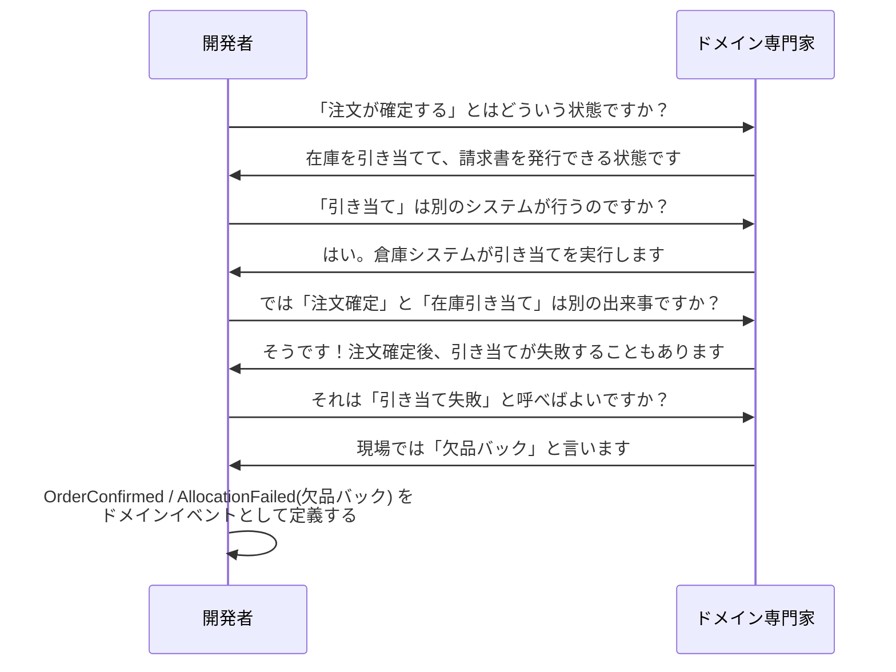

## 2.1 ユビキタス言語とは何か

「ユビキタス（Ubiquitous）」とはラテン語由来の英語で、「いたるところに存在する」という意味です。DDDにおけるユビキタス言語とは、**チーム全員—ドメイン専門家・開発者・テスター・プロダクトマネージャー—が会話・ドキュメント・コードで共通して使う用語体系**のことを指します。

重要なのは、この言語がどちらか一方に合わせるものではないという点です。「システム用語に業務担当者が慣れる」でも「業務用語をそのままクラス名にする」でもなく、**両者が議論しながら練り上げた概念をコードに落とし込む**のです。

## 2.2 言語が設計を決める理由

プログラミングの本質は「名前をつけること」だとも言われます。クラス名・メソッド名・変数名の品質が、コードの可読性と保守性を根本から規定します。

名前の選択は単なる表記の問題ではありません。名前は概念の境界を定義します。

たとえば「顧客」という言葉一つをとっても、販売部門では「まだ購入していない見込み客も顧客」であり、請求部門では「過去に取引のある法人のみが顧客」かもしれません。この曖昧さをそのままコードに持ち込むと、`Customer`クラスが肥大化し、脂肪腫のようなオブジェクトが生まれます。

ユビキタス言語を作る作業は、この概念の揺らぎを発見し、チームで合意することそのものです。

## 2.3 NG例とOK例：言語の違いがコードにどう現れるか

**NG例：システム言語でモデリングした失敗**

```csharp
// 「システム担当者目線」の命名——ビジネスが何をしたいか伝わらない
public class UserAccountManager
{
    // flag で状態管理、bool の意味が文脈依存
    public bool UpdateUserStatusFlag(int userId, int statusType, bool flagValue)
    {
        var user = _db.Users.Find(userId);
        if (statusType == 1) user.IsActive = flagValue;
        else if (statusType == 2) user.IsLocked = flagValue;
        else if (statusType == 3) user.IsPremium = flagValue;

        _db.SaveChanges();
        return true;
    }

    // "Process" という汎用動詞——何が起きるかわからない
    public void ProcessUserData(int userId, Dictionary<string, object> data)
    {
        // ...数百行の処理...
    }
}
```

このコードを読んで「会員がプレミアムにアップグレードされる」という業務ロジックを理解できる人はいません。`statusType == 3` が何を意味するかは、コードを深く追わないとわかりません。

**OK例：ドメイン言語でモデリングした成功**

```csharp
// ドメイン専門家と合意した言語をそのままコードへ
public class Member
{
    public MemberId Id { get; }
    public MemberName Name { get; }
    public MembershipPlan Plan { get; private set; }
    public MemberStatus Status { get; private set; }

    // 「会員を停止する」という業務行為をそのままメソッド名に
    public void Suspend(SuspensionReason reason)
    {
        if (Status == MemberStatus.Suspended)
            throw new DomainException("すでに停止済みの会員です");

        Status = MemberStatus.Suspended;
        AddDomainEvent(new MemberSuspended(Id, reason, DateTimeOffset.UtcNow));
    }

    // 「プレミアムにアップグレードする」という業務行為
    public void UpgradeToPremium(PaymentConfirmation payment)
    {
        if (Plan == MembershipPlan.Premium)
            throw new DomainException("すでにプレミアム会員です");

        if (!payment.IsValid)
            throw new DomainException("有効な決済確認が必要です");

        Plan = MembershipPlan.Premium;
        AddDomainEvent(new MemberUpgradedToPremium(Id, payment.PaidAt));
    }
}
```

`Suspend`・`UpgradeToPremium` という言葉は、業務担当者がそのまま使う言葉です。コードを読めばビジネスが何をしようとしているか、一目でわかります。

## 2.4 ドメイン専門家との会話の進め方

ユビキタス言語は机上で作れるものではありません。実際の業務担当者との対話から生まれます。効果的な進め方を示します。



この会話から「注文確定」と「在庫引き当て」が別の概念であることが明らかになりました。これをひとつの`ConfirmOrder()`メソッドに押し込めていたら、「欠品バック」という重要なビジネスイベントを表現できなかったでしょう。

会話の中で重要なサインは「あ、そういうことですか」「実は二種類あって…」という発言です。これはモデルが現実を捉えきれていないシグナルです。

## 2.5 言語の維持・更新方法

ユビキタス言語は一度作れば終わりではありません。ビジネスが変わるたびに言語も進化させる必要があります。

実践的な維持方法として、以下が有効です。

- **用語集（Glossary）の管理**：`docs/glossary.md`などに用語・定義・コンテキストを明記し、コードレビュー時に参照する
- **命名の違和感を議題にする**：「このメソッド名は業務担当者に通じますか？」をレビューで常に問う
- **コードとドキュメントの同期**：用語が変わったらコードのリネームも行う（`Refactor → Rename`を躊躇しない）

---

> ### 専門家の視点：Vaughn Vernon
>
> Vaughn Vernonは *Implementing Domain-Driven Design*（2013年、通称「赤本」）の中で、命名の重要性についてこう強調しています。
>
> **「ユビキタス言語が貧困であれば、モデルもまた貧困である。チームが『データを処理する』『レコードを更新する』という言葉で話しているなら、それはドメインを理解していないサインだ。」**
>
> Vernonはさらに、「コードのリネームを恐れるな」とも主張します。ドメインの理解が深まれば、以前つけた名前が不適切になることは当然であり、それを機敏にリネームできるチームこそが真にDDDを実践しているといえます。
>
> また彼は「Aggregate（集約）の命名に最も時間をかけよ」とアドバイスします。集約の名前はドメインの核心概念であり、間違えると設計全体がずれていくからです。`OrderAggregate`ではなく`Order`、`CustomerEntity`ではなく`Customer`——修飾語を外し、概念をそのまま名前にすることが原則です。

---

## まとめ

ユビキタス言語は、DDDの実践において最初に取り組むべき作業であり、最も継続的に注意を払うべき要素です。「会話とコードが同じ言語で書かれている」という状態を目指すことで、エンジニアとビジネス担当者の間の翻訳コストがなくなり、仕様の誤解が激減します。次章では、この言語をどのドメインに集中して使うべきかを決める「ドメイン分類」について学びます。
