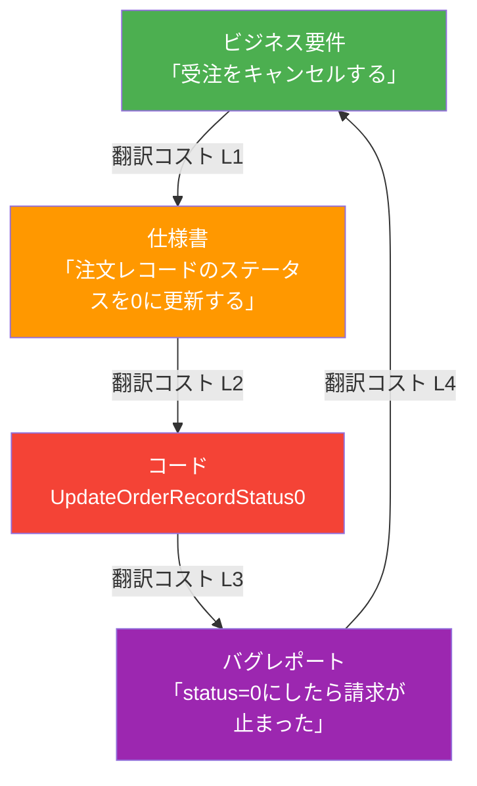
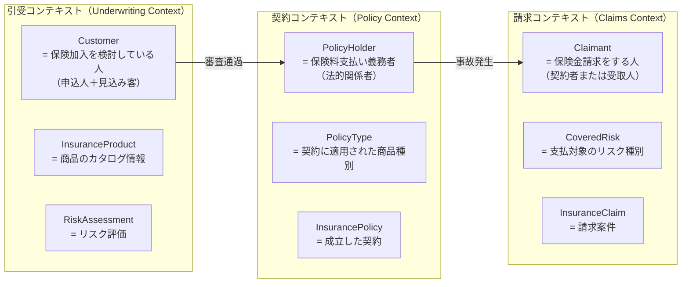
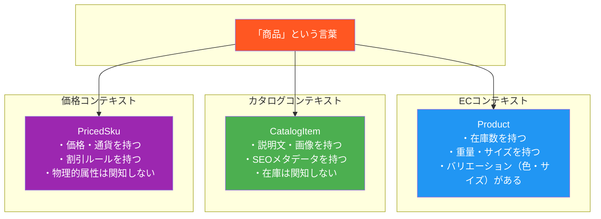
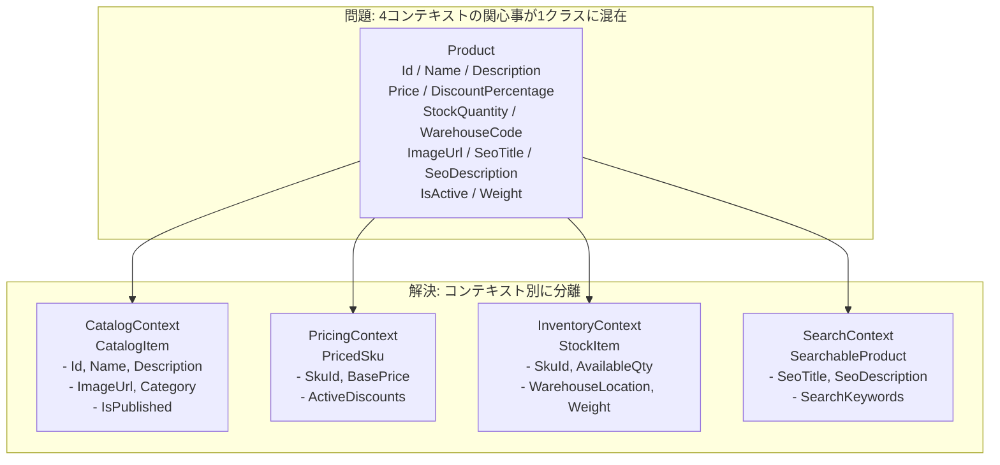

# 第2章 ユビキタス言語——設計を決める言葉の力

---

## 0. TL;DR

ユビキタス言語（Ubiquitous Language）とは、ドメインエキスパートと開発者が**同じ言葉**で話し、**同じ言葉**でコードを書き、**同じ言葉**でドキュメントを更新するための共有語彙体系です。

エリック・エヴァンスが『ドメイン駆動設計（Blue Book）』で提唱したこの概念の本質は、「言語が設計を規定する」という洞察にあります。クラス名が間違っていれば、設計が間違っています。メソッド名が現実と乖離していれば、ビジネスロジックが腐敗します。命名はコスメティックな問題ではなく、アーキテクチャ上の決断です。

本章では、以下を実践的に学びます：

- **Translation Tax（翻訳コスト）**が引き起こす具体的な損失とバグ事例
- ドメインエキスパートとの会話から言語を「発見」する技法
- 良い命名・悪い命名の実例集（C# .NET 9）
- Bounded Contextをまたいだ言語の危険性
- 言語の進化をコードリファクタリングとして管理する方法

アーキテクトレベルの読者に向けて、Blue Bookの知識を前提としつつ、実務経験から来る深い洞察を加えて記述します。

---

## 1. なぜ言語が設計を決めるのか

### 1.1 Translation Tax（翻訳コスト）の正体

ソフトウェア開発において、もっとも隠れたコストの一つが「翻訳コスト」です。

ビジネス側が「受注」と呼ぶものを、開発者が`OrderRecord`と実装する。営業担当者が「キャンセル」と言うとき、システムは`status = 0`に更新する。経理担当者が「締め処理」と呼ぶ月次バッチを、コードでは`RunMonthlyDataProcessingPipeline()`と呼ぶ——。

これらの「翻訳」が発生するたびに、コストが積み上がります。

**Translation Taxの発生源は3層あります：**



**L1コスト**：ビジネス要件を仕様書に落とす際の情報損失。「受注をキャンセルする」という言葉の背後にある業務ルール（在庫の戻し、請求の取消、顧客への通知）が仕様書に明示されないことが多い。

**L2コスト**：仕様書をコードに落とす際の意味の圧縮。`status = 0`が「キャンセル」を意味することは、コードを読むだけでは分からない。

**L3コスト**：バグが発生したとき、コードからビジネスロジックを逆算する時間。`status = 0`の条件を全ファイルでgrepし、影響範囲を洗い出す作業。

**L4コスト**：バグレポートの内容をコードの問題と照合するための認知的コスト。

Eric Evansはこのコストを「認知的摩擦（cognitive friction）」と表現しました。摩擦は熱を生み、熱は燃え尽きを生みます。優秀なエンジニアが「このコードは読めない」と言って離れていく現象の多くは、この Translation Tax が積み重なった結果です。

### 1.2 ビジネス用語とコード用語が乖離するとどうなるか——実際のバグ事例

以下は、筆者が実際に経験したまたは同僚から聞いた「命名の乖離が引き起こしたバグ」の事例集です。

---

**事例1: 「会員」と「ユーザー」の混在によるロールバグ**

あるECサイトで、`User`クラスと`Member`クラスが別々に存在していました。開発チームは「ユーザーはログインできる全員、会員は有料プランに加入している人」という認識でコードを書きましたが、ビジネス側では「会員＝過去に一度でも購入した人」という定義で運用していました。

結果：有料プランの早期解約者が「会員向けキャンペーン」のメールを受け取り、クレームが発生。調査に2日を要しました。

**根本原因**：`Member`というクラス名の定義がコードと業務で乖離していた。ユビキタス言語を確立していれば、「会員」の定義を最初の会話で明確化できていたはずです。

---

**事例2: 「キャンセル」の意味が文脈依存だったバグ**

物流システムで`Order.Cancel()`というメソッドがありました。開発チームはこれを「注文をキャンセル状態にする」と解釈しましたが、業務では「キャンセル」には2種類あることが分かりました：

- **顧客都合キャンセル**：送料は顧客負担、在庫は即時戻し
- **店舗都合キャンセル**：送料は店舗負担、在庫は翌日戻し

`Order.Cancel()`はどちらの処理も行わず、ステータスを変更するだけでした。在庫管理システムは別のバッチが担当していたため、ステータス変更後に在庫が戻らないバグが数ヶ月気づかれませんでした。

**根本原因**：「キャンセル」という言葉に業務的な分岐が存在することを、命名設計の段階で発見できなかった。

---

**事例3: 「承認」フローの「承認」が別の承認を指していたバグ**

ワークフローシステムで`Approve()`メソッドを実装しました。システム上の「承認」はドキュメントを「APPROVED状態にする」処理でした。しかし業務では、「承認」は2段階あります：

- **一次承認**：部長レベルの確認（これをコードでは`Approve()`と呼んでいた）
- **最終承認**：役員レベルの決裁（コードでは`FinalConfirm()`と呼んでいた）

業務担当者は「承認した」と言うとき、常に「最終承認まで完了した」を意味しますが、開発者は「一次承認を完了した」と解釈していました。通知メールの文言が「承認が完了しました」だったため、役員承認を待たずに後続業務が進んでしまいました。

---

これらの事例に共通するパターンは明確です：**ビジネスの言葉とコードの言葉が一致していないとき、バグは設計段階で既に埋め込まれている**のです。テストで発見できないのは、テストもまた「コードの言葉」で書かれているからです。

### 1.3 コードが仕様書になる世界

ユビキタス言語が確立された世界では、コードを読むことがそのままビジネスロジックの理解になります。

```csharp
// ユビキタス言語が実現された世界のコード
public class Order
{
    public void CancelByCustomer(CancellationReason reason)
    {
        EnsureCanBeCancelled();
        ApplyEvent(new OrderCancelledByCustomer(Id, reason, Clock.UtcNow));
    }

    public void CancelByStore(StoreCompensationPolicy policy)
    {
        EnsureCanBeCancelled();
        ApplyEvent(new OrderCancelledByStore(Id, policy, Clock.UtcNow));
    }
}
```

このコードを読んだビジネス担当者は「ああ、顧客都合キャンセルと店舗都合キャンセルは別のアクションなんだな」と理解できます。開発者に説明を求める必要がありません。

これがエヴァンスの言う「ドメインモデルは最も正確な仕様書である」という状態です。英語圏の開発者の間では「コードがドキュメントである」という言い方もしますが、それはコメントをたくさん書くことではなく、**名前が正確であること**を意味します。

---

## 2. ユビキタス言語の作り方（実践手順）

### 2.1 ドメインエキスパートとの会話の実録

以下は、筆者がある保険システムの開発プロジェクトで、保険業務に詳しい業務担当者（以下「山田さん」）とアーキテクト（以下「伊藤」）が行った実際の会話を再構成したものです。

---

**伊藤：** 山田さん、今日は「契約」周りの用語を整理させてください。システムでは`Policy`というクラスを作ろうと思っているんですが、業務では「契約」と「保険証書」と「証券」って言葉がありますよね。これは全部同じものですか？

**山田さん：** あ、それは全然違います。「証券」というのは、契約が締結されたときに発行する紙の書類のことで、番号が振られます。「保険証書」も同じ意味で使うことが多いですね。「契約」はもっと広い概念で、申込みから始まって、引受審査があって、承認されて初めて契約になります。

**伊藤：** なるほど。じゃあ申込みの段階はなんと呼ぶんですか？

**山田さん：** 「申込み」ですね。正確には「保険申込み」です。申込んだ時点では、まだ「契約者」ではなく「申込人」と呼びます。

**伊藤：** 「申込人」と「契約者」は別の概念なんですね。

**山田さん：** そうです。審査に落ちたら「申込人」のままで終わりますから。

**伊藤：** 審査というのは社内で行うんですか？

**山田さん：** 「引受審査」と呼んでいます。「引受部」という部署があって、リスクを評価します。リスクが高ければ「謝絶」といって断りますし、条件付きで受け入れる「条件付引受」もあります。

**伊藤：** 「謝絶」というのは、お断りする、ということですね。

**山田さん：** はい。業界用語ですね。ただ「お断り」と言うと語感が悪いので、社内でも「謝絶」と言っています。

**伊藤：** 分かりました。「条件付引受」というのはどういう条件ですか？

**山田さん：** 特定の疾病に対する保障を外す「部位不担保」だったり、保険料を割り増す「割増保険料」だったりします。

**伊藤：** ちょっと整理させてください。申込人が申込みを出す→引受審査がある→①謝絶、②条件付引受、③通常引受——この3種類があって、②か③の場合に「契約」が成立して、「契約者」と「証券」が生まれる、ということですか？

**山田さん：** そうです、正確には③を「普通引受」と言いますね。

**伊藤：** ありがとうございます。あと「被保険者」と「契約者」も違いますよね？

**山田さん：** 全然違います。「契約者」は保険料を払う人で、「被保険者」は保険の対象になる人です。親が子供のために保険をかける場合、親が契約者で子供が被保険者です。

**伊藤：** それは同一人物でもいいんですか？

**山田さん：** はい、多くの場合は同一人物ですが、法人契約の場合は会社が契約者で、社員が被保険者になります。

**伊藤：** 「受取人」というのは？

**山田さん：** 「保険金受取人」です。死亡保険なら、亡くなった被保険者の代わりに保険金を受け取る人です。生存給付の場合は被保険者本人が受け取りますが、それも「受取人」と呼ぶ場合と「被保険者」と呼ぶ場合があって、ここは正直社内でも統一されていないですね...

**伊藤：** そこは重要なポイントなので、今日の会議で統一しませんか？

**山田さん：** 賛成です。生存給付の受取人は「被保険者」と呼ぶことにしましょう。死亡保険金の受取人だけが「保険金受取人」ということにします。

---

この会話から、以下の用語が「発見」されました：

| 発見された概念 | コードでの表現 | 注釈 |
|---|---|---|
| 保険申込み | `InsuranceApplication` | 審査前の状態 |
| 申込人 | `Applicant` | Contractorとは別人格 |
| 引受審査 | `UnderwritingReview` | リスク評価プロセス |
| 謝絶 | `Rejection` | Refusalではない |
| 条件付引受 | `ConditionalAcceptance` | 部位不担保・割増保険料を含む |
| 普通引受 | `StandardAcceptance` | |
| 契約 | `InsurancePolicy` | 審査後に成立 |
| 契約者 | `PolicyHolder` | 保険料支払い者 |
| 被保険者 | `Insured` | 保険対象者 |
| 証券 | `PolicyDocument` | 発行される書類 |
| 保険金受取人 | `Beneficiary` | 死亡保険金の受取人のみ |

**この会話で重要なのは、開発者が「名前を決めた」のではなく、業務担当者との対話で「名前を発見した」という点です。**

### 2.2 言語を発見する3つの質問

どんなドメインでも、ユビキタス言語を発見するために有効な質問があります。

**質問1: 「それは業界用語ですか？」**

ドメインエキスパートが使う言葉の中に、業界独自の用語が潜んでいます。「謝絶」「引受」「部位不担保」などは保険業界の専門用語です。これらは一般的な英語に安易に置き換えてはいけません。業界用語は、そのドメインの複雑さを凝縮した言葉だからです。

**質問2: 「同じ言葉で別の意味を指していませんか？」**

「承認」「キャンセル」「顧客」「ユーザー」など、日常語に近い言葉ほど定義が曖昧になりがちです。「〇〇というとき、AとBのどちらを指していますか？」と具体的に掘り下げます。

**質問3: 「動詞は何ですか？」**

業務フローを理解するとき、名詞（エンティティ）より動詞（操作）を先に聞くと有効なことがあります。「申込人が申込みを出す」「引受部が審査する」「契約が成立する」——これらの動詞がドメインイベントとメソッド名のヒントになります。

### 2.3 用語集（Glossary）の作り方と運用

ユビキタス言語は、口頭で合意するだけでなく、文書化する必要があります。

**用語集の基本フォーマット**

```markdown
# ドメイン用語集 — 保険システム

## InsuranceApplication（保険申込み）
- **定義**: 契約者候補（申込人）が保険契約の締結を申し出る行為、またはその記録
- **別名**: なし（「申請」とは言わない）
- **Bounded Context**: 引受コンテキスト、契約コンテキスト
- **コードでの表現**: `InsuranceApplication` クラス
- **ステータス遷移**: `Submitted` → `UnderReview` → `Accepted/Rejected`
- **ビジネスルール**: 申込日から30日以内に審査結果を通知しなければならない
- **関連用語**: 申込人（Applicant）、引受審査（UnderwritingReview）

## Rejection（謝絶）
- **定義**: 引受審査の結果、保険リスクが高いと判断し、引受を断ること
- **別名**: 「お断り」「拒絶」とは言わない（業界慣習）
- **コードでの表現**: `Rejection` クラス、`ApplicationStatus.Rejected` 列挙値
- **注意**: `rejection_reason`（謝絶理由）は法的開示対象のため、必ず記録が必要
```

**用語集の運用ルール**

1. **コードレビューで用語集との整合性を確認する** — 新しいクラス名・メソッド名が用語集に載っているか確認することをコードレビューの必須チェック項目にします。

2. **用語集はコードと同じリポジトリに置く** — `docs/domain-glossary.md`として管理し、コードと一緒にバージョン管理します。

3. **用語が変わったらコードも変える** — 「これからは〇〇を△△と呼ぶことにした」という決定があれば、その週中に全コードを変更します。半年後に直そうと思うと、永遠に直せません。

4. **用語の「発見」はスプリントレビューで共有する** — 新しいドメイン用語を発見したスプリントでは、次のスプリント計画前に用語集の更新をチームで確認します。

### 2.4 コードとのマッピング: クラス名・メソッド名・変数名に反映する方法

ユビキタス言語をコードに落とし込む際の具体的なルールを定めます。

**クラス名**: 名詞。ドメイン用語をそのままPascalCaseで使う。

```csharp
// Good: ドメイン用語をそのまま使う
public class InsuranceApplication { }
public class UnderwritingDecision { }
public class PolicyHolder { }

// Bad: 実装詳細や汎用名を使う
public class InsuranceRecord { }
public class DecisionResult { }
public class UserAccount { }
```

**メソッド名**: 動詞句。業務の動詞をそのまま使う。副作用があるコマンドメソッドは命令形、問い合わせは`Get/Find/Calculate`で始める。

```csharp
// Good: ビジネスの動詞を使う
application.Submit();
application.WithdrawByApplicant(reason);
underwriting.Approve();
underwriting.Reject(reason);
underwriting.ApproveConditionally(conditions);

// Bad: 汎用的な動詞を使う
application.Save();
application.UpdateStatus(0);
underwriting.Process();
underwriting.SetResult("approved");
```

**ドメインイベント名**: 過去形の動詞句。「何が起きたか」を表す。

```csharp
// Good: 過去形で「起きた事実」を表現
public record InsuranceApplicationSubmitted(...);
public record UnderwritingDecisionMade(...);
public record PolicyIssued(...);

// Bad: 現在形、または汎用名
public record ApplicationStatusChanged(...);
public record DataUpdated(...);
```

**変数名/パラメータ名**: ドメイン用語を使い、型名の繰り返しを避ける。

```csharp
// Good
void AcceptConditionally(SpecialCondition[] conditions) { }
var applicant = application.Applicant;

// Bad
void AcceptConditionally(List<SpecialCondition> specialConditionList) { }
var applicationApplicant = application.ApplicantInfo;
```

---

## 3. 命名の実例集（良い例・悪い例）

### 3.1 クラス名（10例の対比）

以下はC# .NET 9による実例です。保険・EC・人事など複数ドメインから取材しています。

```csharp
// ============================================================
// 例1: 注文（EC）
// ============================================================

// ❌ Bad: 汎用的すぎる
public class OrderData
{
    public int Id { get; set; }
    public int StatusCode { get; set; }
    public DateTime Timestamp { get; set; }
}

// ✅ Good: ドメイン概念を表す
public class Order
{
    public OrderId Id { get; private set; }
    public OrderStatus Status { get; private set; }
    public DateTimeOffset PlacedAt { get; private set; }
}

// ============================================================
// 例2: 在庫引当（物流）
// ============================================================

// ❌ Bad: 技術的な実装詳細が入っている
public class InventoryLockRecord
{
    public int ProductId { get; set; }
    public int Quantity { get; set; }
    public bool IsLocked { get; set; }
}

// ✅ Good: 業務概念「在庫引当」を正確に表す
public class StockReservation
{
    public ProductId ProductId { get; private set; }
    public Quantity ReservedQuantity { get; private set; }
    public OrderId ReservedForOrder { get; private set; }
    public DateTimeOffset ReservedUntil { get; private set; }
}

// ============================================================
// 例3: 承認ワークフロー（社内稟議）
// ============================================================

// ❌ Bad: 「承認」の段階が分からない
public class ApprovalRecord
{
    public int RecordId { get; set; }
    public int ApproverId { get; set; }
    public int Level { get; set; }
    public bool Approved { get; set; }
}

// ✅ Good: 一次承認と最終決裁を明確に分離
public class DepartmentHeadApproval
{
    public ApproverId ApprovedBy { get; private set; }
    public DateTimeOffset ApprovedAt { get; private set; }
    public Comment? ApprovalComment { get; private set; }
}

public class ExecutiveDecision
{
    public ExecutiveId DecidedBy { get; private set; }
    public Decision Decision { get; private set; }  // Approved / Rejected
    public DateTimeOffset DecidedAt { get; private set; }
}

// ============================================================
// 例4: 顧客（CRM）
// ============================================================

// ❌ Bad: 顧客の文脈が何も分からない
public class UserAccount
{
    public int UserId { get; set; }
    public string Email { get; set; }
    public bool IsMember { get; set; }
    public bool IsPremium { get; set; }
}

// ✅ Good: 見込み客・既存顧客・VIP会員を分離
public class Prospect
{
    public ProspectId Id { get; private set; }
    public EmailAddress Email { get; private set; }
    public ContactPreference ContactPreference { get; private set; }
}

public class Customer
{
    public CustomerId Id { get; private set; }
    public CustomerSegment Segment { get; private set; }  // Regular / Premium / VIP
    public PurchaseHistory PurchaseHistory { get; private set; }
}

// ============================================================
// 例5: 給与（人事・給与）
// ============================================================

// ❌ Bad: 「給与」の何なのかが不明
public class SalaryInfo
{
    public decimal BaseAmount { get; set; }
    public decimal Adjustment { get; set; }
    public decimal Total { get; set; }
}

// ✅ Good: 基本給・各種手当・控除を明確に分離
public class MonthlySalary
{
    public BasicSalary BasicSalary { get; private set; }
    public Allowances Allowances { get; private set; }
    public Deductions Deductions { get; private set; }
    public NetSalary NetSalary => BasicSalary + Allowances - Deductions;
}

// ============================================================
// 例6: 診断（医療）
// ============================================================

// ❌ Bad: 医療ドメインの言葉が失われている
public class DiagnosisEntry
{
    public int PatientId { get; set; }
    public string DiagnosisText { get; set; }
    public int DoctorId { get; set; }
    public DateTime RecordDate { get; set; }
}

// ✅ Good: 確定診断・疑い・暫定などを業界用語で表現
public class ClinicalDiagnosis
{
    public PatientId PatientId { get; private set; }
    public IcdCode PrimaryDiagnosis { get; private set; }
    public IcdCode[] ComorbidityCodes { get; private set; }
    public DiagnosisCertainty Certainty { get; private set; }  // Confirmed / Suspected / RuledOut
    public PhysicianId DiagnosingPhysician { get; private set; }
}

// ============================================================
// 例7: 配送（物流）
// ============================================================

// ❌ Bad: 「配送」の段階が不明
public class DeliveryEntry
{
    public int Id { get; set; }
    public int Status { get; set; }
    public string TrackingCode { get; set; }
}

// ✅ Good: 配送指示・配送中・配達完了を分離
public class ShipmentInstruction
{
    public ShipmentId Id { get; private set; }
    public Address DeliveryAddress { get; private set; }
    public Weight PackageWeight { get; private set; }
    public DeliverySlot RequestedDeliverySlot { get; private set; }
}

// ============================================================
// 例8: 割引（EC）
// ============================================================

// ❌ Bad: 割引の種類が区別できない
public class DiscountData
{
    public int DiscountType { get; set; }
    public decimal DiscountValue { get; set; }
    public bool IsPercentage { get; set; }
}

// ✅ Good: 割引の種類を明示的に表す
public abstract class Discount
{
    public abstract Money Apply(Money originalPrice);
}

public class PercentageDiscount : Discount
{
    public Percentage Rate { get; private set; }
    public override Money Apply(Money originalPrice) => originalPrice * (1 - Rate);
}

public class EarlybirdDiscount : Discount
{
    public Money FixedAmount { get; private set; }
    public DateTimeOffset ValidUntil { get; private set; }
    public override Money Apply(Money originalPrice) => originalPrice - FixedAmount;
}

// ============================================================
// 例9: 保険料（保険）
// ============================================================

// ❌ Bad: 計算要素が不透明
public class PremiumCalculation
{
    public decimal BaseAmount { get; set; }
    public decimal Multiplier { get; set; }
    public decimal FinalAmount { get; set; }
}

// ✅ Good: 保険料計算の業界用語を使う
public class InsurancePremium
{
    public BasicPremium BasicPremium { get; private set; }
    public RiskLoadingFactor RiskLoading { get; private set; }
    public AnnualPremium AnnualPremium { get; private set; }
    public MonthlyPremium MonthlyPremium { get; private set; }
}

// ============================================================
// 例10: テナント（SaaS）
// ============================================================

// ❌ Bad: マルチテナントの概念が失われている
public class OrganizationAccount
{
    public int OrgId { get; set; }
    public string OrgName { get; set; }
    public int PlanId { get; set; }
    public bool IsActive { get; set; }
}

// ✅ Good: テナント・サブスクリプション・プランを分離
public class Tenant
{
    public TenantId Id { get; private set; }
    public TenantName Name { get; private set; }
    public Subscription ActiveSubscription { get; private set; }
    public TenantStatus Status { get; private set; }  // Active / Suspended / Terminated
}
```

### 3.2 メソッド名（10例の対比）

```csharp
public class InsurancePolicy  // 保険契約
{
    // ============================================================
    // 例1: 契約更新
    // ============================================================
    
    // ❌ Bad: 何の更新かが分からない
    public void Update(DateTime newDate, decimal newPremium) { }
    
    // ✅ Good: 更新の業務的意味を表現
    public void Renew(PolicyTerm nextTerm, InsurancePremium newPremium) { }
    
    // ============================================================
    // 例2: 解約
    // ============================================================
    
    // ❌ Bad: Closeは一般的すぎる
    public void Close(int reason) { }
    
    // ✅ Good: 解約の主体と理由を明示
    public void SurrenderByPolicyholder(SurrenderReason reason) { }
    
    // ============================================================
    // 例3: 保険料支払い
    // ============================================================
    
    // ❌ Bad: 処理の内容が不透明
    public void ProcessPayment(decimal amount, string method) { }
    
    // ✅ Good: 保険料収納という業務アクションを表現
    public void RecordPremiumCollection(PremiumPayment payment) { }
    
    // ============================================================
    // 例4: 支払い猶予
    // ============================================================
    
    // ❌ Bad: Extendは汎用的
    public void ExtendDeadline(int days) { }
    
    // ✅ Good: 支払い猶予期間という保険業界固有の概念
    public void GrantGracePeriod(int gracePeriodDays) { }
    
    // ============================================================
    // 例5: 失効
    // ============================================================
    
    // ❌ Bad: Deactivateは技術的な操作名
    public void Deactivate() { }
    
    // ✅ Good: 「失効」という業界用語を使う
    public void Lapse() { }
    
    // ============================================================
    // 例6: 復活
    // ============================================================
    
    // ❌ Bad: Reactivateは技術的
    public void Reactivate(decimal backPremium) { }
    
    // ✅ Good: 「復活」という業界用語、条件も明示
    public void Reinstate(BackPremium backPremium, ReinstatementApplication application) { }
    
    // ============================================================
    // 例7: 保険金請求
    // ============================================================
    
    // ❌ Bad: RequestPaymentは金融取引一般の言葉
    public ClaimId RequestPayment(decimal claimAmount, string reason) { }
    
    // ✅ Good: 保険金「請求」という業界の行為
    public InsuranceClaim FileClaim(ClaimType claimType, ClaimDetails details) { }
    
    // ============================================================
    // 例8: 保障内容変更
    // ============================================================
    
    // ❌ Bad: Modifyは汎用
    public void Modify(Dictionary<string, object> changes) { }
    
    // ✅ Good: 保障内容の変更（ライダーの付加/削除）
    public void AddRider(InsuranceRider rider) { }
    public void RemoveRider(RiderCode riderCode) { }
    
    // ============================================================
    // 例9: 受取人変更
    // ============================================================
    
    // ❌ Bad: UpdateRecord
    public void UpdateBeneficiaryRecord(int newBeneficiaryId) { }
    
    // ✅ Good: 受取人変更手続きという業務行為
    public void ChangeBeneficiary(Beneficiary newBeneficiary, ChangeBeneficiaryReason reason) { }
    
    // ============================================================
    // 例10: 解約返戻金照会
    // ============================================================
    
    // ❌ Bad: 計算という実装詳細が出てしまっている
    public decimal CalculateCashValue(DateTime asOfDate) { }
    
    // ✅ Good: 「解約返戻金」という業界用語を使い、照会という業務行為も表現
    public SurrenderValue GetSurrenderValue(DateOnly asOfDate) { }
}
```

### 3.3 イベント名（10例の対比）

```csharp
// ドメインイベントは「過去に起きた事実」を表す
// フォーマット: [Subject][Action]（主語+過去形）

// ============================================================
// 例1: 申込みが提出された
// ❌ Bad
public record ApplicationCreated(int ApplicationId, DateTime Timestamp);
// ✅ Good
public record InsuranceApplicationSubmitted(
    InsuranceApplicationId ApplicationId,
    Applicant Applicant,
    InsuranceProductCode ProductCode,
    DateTimeOffset SubmittedAt);

// ============================================================
// 例2: 審査が完了した
// ❌ Bad
public record StatusUpdated(int EntityId, string NewStatus);
// ✅ Good
public record UnderwritingDecisionMade(
    InsuranceApplicationId ApplicationId,
    UnderwritingDecision Decision,  // Accepted / ConditionallyAccepted / Rejected
    UnderwriterId DecidedBy,
    DateTimeOffset DecidedAt);

// ============================================================
// 例3: 証券が発行された
// ❌ Bad
public record DocumentGenerated(int DocId, string DocType);
// ✅ Good
public record PolicyDocumentIssued(
    PolicyId PolicyId,
    PolicyDocumentNumber DocumentNumber,
    DateOnly IssueDate);

// ============================================================
// 例4: 保険料が収納された
// ❌ Bad
public record PaymentReceived(int PaymentId, decimal Amount);
// ✅ Good
public record PremiumCollected(
    PolicyId PolicyId,
    Money CollectedAmount,
    PaymentMethod Method,
    DateOnly CollectionDate,
    PremiumDueDate CoveredDueDate);

// ============================================================
// 例5: 契約が失効した
// ❌ Bad
public record PolicyDeactivated(int PolicyId, string Reason);
// ✅ Good
public record PolicyLapsed(
    PolicyId PolicyId,
    DateOnly LapseDate,
    Money OutstandingPremium);

// ============================================================
// 例6: 保険金が請求された
// ❌ Bad
public record ClaimCreated(int ClaimId, decimal Amount);
// ✅ Good
public record InsuranceClaimFiled(
    ClaimId ClaimId,
    PolicyId PolicyId,
    ClaimType ClaimType,
    DateOnly IncidentDate,
    ClaimAmount ClaimedAmount);

// ============================================================
// 例7: 契約が解約された
// ❌ Bad
public record PolicyTerminated(int PolicyId);
// ✅ Good
public record PolicySurrenderedByPolicyholder(
    PolicyId PolicyId,
    SurrenderReason Reason,
    SurrenderValue ReturnedValue,
    DateOnly SurrenderDate);

// ============================================================
// 例8: 受取人が変更された
// ❌ Bad
public record BeneficiaryUpdated(int PolicyId, int OldBeneficiaryId, int NewBeneficiaryId);
// ✅ Good
public record BeneficiaryChanged(
    PolicyId PolicyId,
    Beneficiary PreviousBeneficiary,
    Beneficiary NewBeneficiary,
    ChangeBeneficiaryReason Reason,
    DateTimeOffset ChangedAt);

// ============================================================
// 例9: 契約が復活した
// ❌ Bad
public record PolicyReactivated(int PolicyId);
// ✅ Good
public record PolicyReinstated(
    PolicyId PolicyId,
    BackPremium PaidBackPremium,
    DateOnly ReinstatedOn);

// ============================================================
// 例10: 保障が付加された
// ❌ Bad
public record OptionAdded(int PolicyId, string OptionType, decimal ExtraPremium);
// ✅ Good
public record RiderAttachedToPolicy(
    PolicyId PolicyId,
    InsuranceRider AttachedRider,
    MonthlyRiderPremium AdditionalPremium,
    DateOnly EffectiveDate);
```

### 3.4 フィールド名（10例の対比）

```csharp
// ============================================================
// 例1: 有効期間
// ❌ Bad
public DateTime StartDate { get; set; }
public DateTime EndDate { get; set; }
// ✅ Good（DateOnlyで日付、PolicyTermで有効期間全体を表す）
public DateOnly InceptionDate { get; private set; }      // 保険開始日（業界用語）
public DateOnly MaturityDate { get; private set; }       // 満期日（業界用語）
public PolicyTerm PolicyTerm => new(InceptionDate, MaturityDate);

// ============================================================
// 例2: 保険料
// ❌ Bad
public decimal Premium { get; set; }
public decimal MonthlyAmount { get; set; }
// ✅ Good（金額の種類を明確に）
public AnnualPremium AnnualPremium { get; private set; }
public MonthlyPremium MonthlyInstallmentPremium { get; private set; }

// ============================================================
// 例3: 状態
// ❌ Bad
public int Status { get; set; }
public bool IsActive { get; set; }
// ✅ Good（列挙型でドメイン状態を表現）
public PolicyStatus Status { get; private set; }
// PolicyStatus: InForce / Lapsed / Surrendered / Matured / Cancelled

// ============================================================
// 例4: 関係者
// ❌ Bad
public int UserId { get; set; }
public int AgentId { get; set; }
// ✅ Good（役割を明示）
public PolicyHolderId PolicyHolderId { get; private set; }
public InsuredId InsuredId { get; private set; }
public AgentId SolicitorAgentId { get; private set; }   // 募集代理店

// ============================================================
// 例5: 金額
// ❌ Bad
public decimal Amount { get; set; }
public string Currency { get; set; }
// ✅ Good（Money値オブジェクト、ドメイン固有の金額型）
public SumAssured SumAssured { get; private set; }      // 保険金額（業界用語）
public Money Premium { get; private set; }

// ============================================================
// 例6: 連絡先
// ❌ Bad
public string Phone { get; set; }
public string Email { get; set; }
public string Address { get; set; }
// ✅ Good（連絡先の種類を明確に、値オブジェクト使用）
public PhoneNumber PrimaryPhone { get; private set; }
public EmailAddress PolicyholderEmail { get; private set; }
public PostalAddress RegisteredAddress { get; private set; }

// ============================================================
// 例7: フラグ類
// ❌ Bad
public bool Flag1 { get; set; }
public bool IsEnabled { get; set; }
public bool Checked { get; set; }
// ✅ Good（何のフラグか明示）
public bool HasAutomaticPremiumLoan { get; private set; }  // 自動保険料貸付特約
public bool IsNomineeAbsolutelyAssigned { get; private set; }  // 受取人絶対指定

// ============================================================
// 例8: 日付
// ❌ Bad
public DateTime CreatedAt { get; set; }
public DateTime UpdatedAt { get; set; }
public DateTime Date1 { get; set; }
// ✅ Good（何の日付かを明示、DateOnlyとDateTimeOffsetを使い分け）
public DateTimeOffset ApplicationSubmittedAt { get; private set; }  // 申込日時（時刻まで必要）
public DateOnly UnderwritingCompletedOn { get; private set; }        // 審査完了日（日付のみ）
public DateOnly NextPremiumDueDate { get; private set; }             // 次回保険料払込期日

// ============================================================
// 例9: 理由
// ❌ Bad
public string Reason { get; set; }
public int ReasonCode { get; set; }
// ✅ Good（何の理由か、型で表現）
public SurrenderReason SurrenderReason { get; private set; }
public RejectionReason UnderwritingRejectionReason { get; private set; }

// ============================================================
// 例10: カウンタ/回数
// ❌ Bad
public int Count { get; set; }
public int RetryCount { get; set; }
// ✅ Good（何をカウントしているか明示）
public int PremiumPaymentsMissed { get; private set; }   // 未払い回数
public int RenewalCount { get; private set; }             // 更新回数
```

---

## 4. ユビキタス言語とBounded Contextの関係

### 4.1 ユビキタス言語はBounded Contextの中でのみ有効

ユビキタス言語の最大の落とし穴は「組織全体で一つの言語を作ろうとする」ことです。エヴァンスは明確に述べています：「ユビキタス言語は特定のBounded Contextの内部でのみユビキタスである」と。



同じ保険システムでも「顧客」という言葉は3つの意味を持ちます：

- **引受コンテキスト**での`Customer`は保険加入を検討している人（申込み前の段階も含む）
- **契約コンテキスト**での`PolicyHolder`は法的に保険料支払い義務を持つ人
- **請求コンテキスト**での`Claimant`は保険金を請求する権利を持つ人

この区別を無視して「統一された`Customer`クラス」を作ろうとすると、一つのクラスに全コンテキストの属性が詰め込まれ、神クラスが誕生します。

### 4.2 同じ言葉が別のBCで違う意味を持つ例



ECシステムで「商品」という言葉は文脈によって全く異なる概念を指します：

```csharp
// 在庫管理コンテキスト: 商品は物理的な実体
namespace InventoryContext
{
    public class Product
    {
        public ProductId Id { get; private set; }
        public StockKeepingUnit Sku { get; private set; }
        public Weight Weight { get; private set; }
        public Dimensions Dimensions { get; private set; }
        public StockLevel CurrentStock { get; private set; }
        public WarehouseLocation StorageLocation { get; private set; }
    }
}

// カタログコンテキスト: 商品は顧客に見せる情報の集合
namespace CatalogContext
{
    public class CatalogItem
    {
        public CatalogItemId Id { get; private set; }
        public ProductName Name { get; private set; }
        public ProductDescription Description { get; private set; }
        public IReadOnlyList<ProductImage> Images { get; private set; }
        public SeoMetadata Seo { get; private set; }
        // 在庫情報は持たない。Catalog自体はCatalogContextで完結する。
    }
}

// 価格設定コンテキスト: 商品は価格付けの対象
namespace PricingContext
{
    public class PricedSku
    {
        public SkuId SkuId { get; private set; }
        public Money BasePrice { get; private set; }
        public IReadOnlyList<DiscountRule> ApplicableDiscounts { get; private set; }
        public TaxCategory TaxCategory { get; private set; }
        
        public Money CalculateFinalPrice(CustomerSegment segment, Coupon? coupon)
        {
            // 価格計算ロジックはここにある
        }
    }
}
```

この分離を維持することで、各コンテキストは自分の責務に集中できます。在庫管理チームは価格ルールを知る必要がなく、価格設定チームは倉庫の棚位置を知る必要がありません。

### 4.3 BCをまたいで同じ言語を使う危険性

BCをまたいで同じクラスを共有しようとすると、以下の問題が起きます：

**問題1: 変更の影響範囲が読めなくなる**

「在庫管理コンテキストの`Product`に`Weight`フィールドを追加したい」という要求があったとき、`Product`クラスが全コンテキストで共有されていると、カタログチームと価格設定チームにも変更の影響が及びます。

**問題2: データベースのスキーマが肥大化する**

全コンテキストの属性を一つの`products`テーブルに詰め込もうとすると、NULL許容カラムが増え、どのカラムがどのコンテキストで使われるのか分からなくなります。

**問題3: テストが複雑化する**

「在庫管理コンテキストの`Product`のテスト」を書くとき、カタログ情報のスタブも必要になります。テストのセットアップコストが爆発的に増加します。

**原則：BCをまたぐ場合はAnti-Corruption Layerを使う**

```csharp
// 注文コンテキストが在庫コンテキストの「Product」情報を必要とする場合
namespace OrderContext.Adapters
{
    // ACL: 在庫コンテキストのProductを注文コンテキストの言語に翻訳する
    public class InventoryProductAdapter : IProductAvailabilityService
    {
        private readonly IInventoryClient _inventoryClient;

        public async Task<ProductAvailability> CheckAvailabilityAsync(
            OrderLineItem lineItem,
            CancellationToken ct)
        {
            // 注文コンテキストの"OrderLineItem"を在庫コンテキストの"StockQuery"に変換
            var stockQuery = new StockQuery(lineItem.SkuId, lineItem.Quantity);
            var result = await _inventoryClient.CheckStockAsync(stockQuery, ct);
            
            // 在庫コンテキストの"StockCheckResult"を注文コンテキストの"ProductAvailability"に変換
            return new ProductAvailability(
                IsAvailable: result.AvailableQuantity >= lineItem.Quantity,
                AvailableQuantity: result.AvailableQuantity);
        }
    }
}
```

---

## 5. 言語の進化と管理

### 5.1 言語は変化する（Evolvingの概念）

ユビキタス言語は作って終わりではありません。ビジネスが進化するにつれ、言語も進化します。

エヴァンスは「モデルはリファクタリングのたびに洗練される」と述べました。これは、コードのリファクタリングと言語の進化が不可分であることを意味します。

**言語の進化パターン：**

| パターン | 例 | 対処法 |
|---|---|---|
| 概念の分割 | 「ユーザー」が「顧客」と「管理者」に分離 | クラスの分割 + 旧クラスの段階的廃止 |
| 概念の統合 | 「注文」と「予約」が「購入意向」に統合 | クラスの統合 + 呼び出し箇所の一括更新 |
| 名称の変更 | 「キャンセル」が「取消（顧客都合）」と「返品（店舗都合）」に明確化 | メソッド名のリネーム |
| 概念の深化 | 「割引」に「タイムセール」「会員割引」「クーポン」のサブタイプが生まれる | 継承/戦略パターンへのリファクタリング |

### 5.2 リファクタリングとしての命名変更

命名変更はコスメティックな作業ではなく、**ドメイン理解の深化をコードに反映する知的作業**です。

```csharp
// Before: 「払い戻し」が一つのメソッドで表現されていた
public class Order
{
    public void Refund(decimal amount, string reason) { }
}

// ↓ ビジネスとの対話で「払い戻し」には3種類あることが判明

// After: 3種類の払い戻しを明示的に表現
public class Order
{
    // 顧客都合のキャンセルによる返金
    public void RefundForCustomerCancellation(CancellationReason reason) { }
    
    // 商品不良による返金
    public void RefundForDefectiveProduct(DefectReport defectReport) { }
    
    // 価格誤り訂正による返金
    public void RefundForPricingError(PricingError error, Money overchargedAmount) { }
}
```

このリファクタリングは、コードを変えただけでなく、**「払い戻し」というドメイン概念の理解を深めた**のです。次にビジネス担当者が「払い戻し対応の遅延が多い」と言ったとき、開発者は「どの種類の払い戻しですか？」と正確に聞き返せるようになります。

### 5.3 ドキュメントとコードの同期

用語集とコードが乖離しないための実践的な仕組みを設けます。

**仕組み1: ArchUnit（アーキテクチャテスト）でクラス名をチェック**

```csharp
// ArchUnitNET を使ってドメイン用語違反を自動検出
[Fact]
public void DomainClasses_ShouldNotUseGenericNames()
{
    var forbiddenPatterns = new[]
    {
        "*Manager", "*Helper", "*Util", "*Data", "*Info",
        "*Record", "*Object", "*Item"  // これらは設計の臭いを示す
    };
    
    var domainClasses = Types.InAssembly(DomainAssembly)
        .That()
        .ResideInNamespace("InsuranceSystem.Domain");
    
    foreach (var pattern in forbiddenPatterns)
    {
        domainClasses
            .Should()
            .NotHaveNameMatchingPattern(pattern)
            .Because($"ドメインクラスは汎用名({pattern})を避け、ビジネス用語を使うこと");
    }
}
```

**仕組み2: PRテンプレートに命名チェックを含める**

```markdown
## コードレビューチェックリスト

### ユビキタス言語
- [ ] 新しいクラス名・メソッド名が `docs/domain-glossary.md` の用語と一致しているか
- [ ] 新しいドメイン用語を導入した場合、用語集を更新したか
- [ ] ドメインエキスパートのレビューを受けたか（新しいドメイン概念が含まれる場合）
```

**仕組み3: Fitness Functionsによる継続的な言語整合性確認**

```csharp
// ドメイン用語集のYAMLファイルを読み込んで、コードとの整合性を確認するテスト
[Fact]
public void AllGlossaryTerms_ShouldHaveCorrespondingCodeElements()
{
    var glossary = GlossaryLoader.Load("docs/domain-glossary.yaml");
    var domainAssembly = Assembly.Load("InsuranceSystem.Domain");
    
    var mismatches = new List<string>();
    
    foreach (var term in glossary.Terms)
    {
        if (term.CodeMapping != null)
        {
            var type = domainAssembly.GetType($"InsuranceSystem.Domain.{term.CodeMapping}");
            if (type == null)
            {
                mismatches.Add($"用語「{term.Japanese}」のコード表現「{term.CodeMapping}」が見つかりません");
            }
        }
    }
    
    mismatches.Should().BeEmpty(
        because: "用語集のすべての用語はコードに対応する実装が必要です");
}
```

---

## 6. よくある誤り（Before/After）

### 誤り1: 汎用動詞 "Process" "Handle" "Manage"

**Before（問題のあるコード）：**

```csharp
public class OrderService
{
    // "Process"という動詞は何も語っていない
    public OrderResult ProcessOrder(OrderRequest request)
    {
        // 300行の処理が続く...
        // 在庫確認、価格計算、支払い処理、在庫引当、通知送信が全部入っている
    }
    
    // "Handle"も同様
    public void HandleOrderStatus(int orderId, string status) { }
    
    // "Manage"もNG
    public void ManageInventory(int productId, int quantity) { }
}
```

**After（改善されたコード）：**

```csharp
public class OrderPlacementService
{
    // 注文確定の業務フローを明示
    public async Task<OrderConfirmation> PlaceOrderAsync(
        Cart cart, 
        ShippingAddress address, 
        PaymentMethod paymentMethod,
        CancellationToken ct)
    {
        var availabilityCheck = await _inventory.CheckAvailabilityAsync(cart.Items, ct);
        availabilityCheck.EnsureAllItemsAvailable();
        
        var pricedOrder = _pricing.CalculateFinalPrice(cart, _promotions.GetActivePromos());
        var payment = await _paymentGateway.ChargeAsync(pricedOrder.TotalAmount, paymentMethod, ct);
        
        var order = Order.Place(cart, address, pricedOrder, payment);
        await _repository.SaveAsync(order, ct);
        
        await _notifications.NotifyOrderPlacedAsync(order, ct);
        
        return new OrderConfirmation(order.Id, order.EstimatedDeliveryDate);
    }
}

public class InventoryReservationService
{
    // 在庫引当という業務行為を正確に表現
    public async Task<StockReservation> ReserveStockForOrderAsync(
        Order order,
        CancellationToken ct) { }
    
    // 引当解放も業務用語で
    public async Task ReleaseReservationAsync(
        StockReservation reservation,
        ReservationReleaseReason reason,
        CancellationToken ct) { }
}
```

### 誤り2: フラグとステータスコードの多用

**Before（問題のあるコード）：**

```csharp
public class Member
{
    public bool IsActive { get; set; }
    public bool IsPremium { get; set; }
    public bool IsLocked { get; set; }
    public bool IsEmailVerified { get; set; }
    public int StatusCode { get; set; }  // 0=通常, 1=停止, 2=退会, 3=バン
    
    // 呼び出し側で意図が読めない
    public void UpdateStatus(int statusCode) { }
}

// 呼び出し側
member.IsActive = false;
member.IsLocked = true;
member.UpdateStatus(1);  // これは何? 停止? 退会?
```

**After（改善されたコード）：**

```csharp
public class Member
{
    public MemberStatus Status { get; private set; }
    public MembershipGrade Grade { get; private set; }  // Standard / Premium / VIP
    public EmailVerificationStatus EmailStatus { get; private set; }
    
    // 業務アクションを明示的なメソッドで表現
    public void Suspend(SuspensionReason reason)
    {
        EnsureCanBeSuspended();
        Status = MemberStatus.Suspended;
        AddDomainEvent(new MemberSuspended(Id, reason, Clock.UtcNow));
    }
    
    public void Ban(BanReason reason)
    {
        Status = MemberStatus.Banned;
        AddDomainEvent(new MemberBanned(Id, reason, Clock.UtcNow));
    }
    
    public void Reinstate()
    {
        EnsureCanBeReinstated();
        Status = MemberStatus.Active;
        AddDomainEvent(new MemberReinstated(Id, Clock.UtcNow));
    }
    
    public void UpgradeToGrade(MembershipGrade newGrade)
    {
        var previousGrade = Grade;
        Grade = newGrade;
        AddDomainEvent(new MemberGradeUpgraded(Id, previousGrade, newGrade, Clock.UtcNow));
    }
}

// 呼び出し側: 意図が一目で分かる
await member.Suspend(SuspensionReason.PaymentFailure);
await member.UpgradeToGrade(MembershipGrade.Premium);
```

### 誤り3: データ構造をクラス名にする

**Before（問題のあるコード）：**

```csharp
// データ構造の名前であって、ドメイン概念の名前ではない
public class OrderList { }
public class ProductMap { }
public class UserDictionary { }
public class AddressArray { }
public class TransactionQueue { }

// 技術的な型を示すサフィックス
public class OrderDTO { }
public class ProductViewModel { }
public class UserEntity { }  // 特にひどい: Entityはパターン名なのでクラス名に使ってはいけない
```

**After（改善されたコード）：**

```csharp
// ドメイン概念の名前
public class Cart { }                   // OrderListではない
public class Catalog { }                // ProductMapではない
public class MemberDirectory { }        // UserDictionaryではない
public class DeliveryQueue { }          // TransactionQueueではない（より具体的に）

// レイヤー間の変換は別の命名規則
namespace Application.Contracts
{
    public record PlaceOrderRequest(/* ... */);   // Command/Requestサフィックス
    public record OrderSummary(/* ... */);         // Summary/Response/Resultサフィックス
}
```

### 誤り4: 技術的な命名がドメイン層に漏れ込む

**Before（問題のあるコード）：**

```csharp
// ドメインクラスに技術的な概念が漏れている
public class Order
{
    public int Id { get; set; }  // "Id"はデータベースの概念
    public string JsonData { get; set; }  // JSON、技術的詳細
    public byte[] BinaryAttachment { get; set; }  // バイト配列、技術的詳細
    public string ConnectionString { get; set; }  // ありえないが実際にあった
    
    public void SaveToDatabase() { }  // ドメインがデータベースを知っている
    public string Serialize() { }    // ドメインがシリアル化を知っている
}
```

**After（改善されたコード）：**

```csharp
public class Order
{
    // 値オブジェクトで型安全に
    public OrderId Id { get; private set; }
    // 添付ファイルはドメイン概念で表現
    public IReadOnlyList<OrderAttachment> Attachments { get; private set; }
    
    // ドメインメソッドはビジネスロジックのみ
    public void AddItem(Product product, Quantity quantity) { }
    public void ConfirmPayment(Payment payment) { }
    
    // 技術的関心事（永続化・シリアル化）はインフラ層に
}

// インフラ層
namespace Infrastructure.Persistence
{
    public class OrderRepository : IOrderRepository
    {
        public async Task SaveAsync(Order order, CancellationToken ct)
        {
            var entity = _mapper.ToEntity(order);  // ここでのみ変換
            await _dbContext.Orders.AddAsync(entity, ct);
        }
    }
}
```

---

## 7. コードレビュー観点

ユビキタス言語の観点でコードレビューを行う際の具体的なチェック項目を列挙します。

### 7.1 命名のチェックリスト

```markdown
## ユビキタス言語チェックリスト

### 必須チェック（1つでも✗ならReject）

[ ] 新規クラス名が用語集に存在するか、または用語集に追加されているか
[ ] 新規メソッド名がドメインエキスパートと合意した動詞を使っているか
[ ] Manager/Helper/Util/Dataサフィックスを避けているか
[ ] 汎用動詞（process/handle/manage/execute）を避けているか
[ ] ドメイン層に技術的な概念（Database/Cache/HTTP/JSON）が漏れていないか

### 推奨チェック（✗ならコメントを残す）

[ ] ドメインイベント名が過去形の動詞句になっているか
[ ] フラグ/ステータスコードの代わりに型安全な状態管理をしているか
[ ] BCをまたぐクラス共有をしていないか（している場合はACL経由か）
[ ] DateとDateTimeを適切に使い分けているか（DateOnlyとDateTimeOffset）
[ ] Money/Quantityなどの値オブジェクトを使っているか（素のdecimal/intでないか）

### 確認質問

- 「このクラス名を業務担当者に見せたとき、正しく理解してもらえますか？」
- 「このメソッド名を声に出して読んだとき、業務フローが想像できますか？」
```

### 7.2 レビューコメントの書き方

```markdown
# 良いレビューコメントの例

## ❌ Bad（曖昧・押しつけがましい）
「命名が良くないです。変えてください。」

## ✅ Good（理由 + 代替案 + 質問）
「`ProcessOrderData` という名前が気になります。
用語集では注文の確定を「注文確定」と呼んでいます。
`PlaceOrder` または `ConfirmOrder` の方がドメイン用語と一致すると思いますが、
業務担当者との確認内容はどうなっていますか？」

## ❌ Bad（技術的な視点のみ）
「このクラスはSRPに違反しています。」

## ✅ Good（ドメイン視点 + 技術観点）
「`CustomerManager` が在庫引当ロジックも持っているのが気になります。
業務的には「顧客」と「在庫引当」は別のコンテキストではないでしょうか？
`StockReservationService` を分離することで、
ユビキタス言語の観点でも責務分離の観点でも改善できると思います。」
```

---

## 8. 演習問題（3問、解答付き）

### 演習1: 命名の改善

以下のコードをユビキタス言語の観点で改善してください。対象は病院の予約管理システムです。

**問題コード：**

```csharp
public class AppointmentManager
{
    public bool ProcessAppointment(int userId, int doctorId, DateTime time, string type)
    {
        var user = _db.Users.Find(userId);
        if (user == null) return false;
        
        var doctor = _db.Doctors.Find(doctorId);
        if (!IsAvailable(doctor, time)) return false;
        
        var apt = new Appointment
        {
            UserId = userId,
            DoctorId = doctorId,
            TimeSlot = time,
            AppointmentType = type,
            Status = 1  // 1 = 確定
        };
        
        _db.Appointments.Add(apt);
        _db.SaveChanges();
        return true;
    }
    
    public void UpdateAppointmentStatus(int appointmentId, int status) { }
    public List<Appointment> GetUserAppointments(int userId) { }
}
```

**解答：**

まず用語集を定義します：

```
患者（Patient）: 診察を受ける人物。「ユーザー」ではなく「患者」
診察予約（Appointment）: 患者と医師の診察時間の予約
診察枠（TimeSlot）: 医師が予約を受け付ける時間帯
初診（InitialConsultation）: 初めての診察
再診（FollowUpConsultation）: 2回目以降の診察
```

```csharp
// 改善後
public class AppointmentBookingService
{
    // 「予約確定」という業務アクションを表現
    public async Task<AppointmentConfirmation> BookAppointmentAsync(
        PatientId patientId,
        DoctorId doctorId,
        TimeSlot requestedSlot,
        ConsultationType consultationType,  // InitialConsultation / FollowUpConsultation
        CancellationToken ct)
    {
        var doctor = await _doctors.FindByIdAsync(doctorId, ct);
        doctor.EnsureSlotIsAvailable(requestedSlot);
        
        var patient = await _patients.FindByIdAsync(patientId, ct);
        var appointment = patient.BookAppointmentWith(doctor, requestedSlot, consultationType);
        
        await _appointments.SaveAsync(appointment, ct);
        await _notifications.NotifyAppointmentBookedAsync(appointment, ct);
        
        return AppointmentConfirmation.From(appointment);
    }
}

public class Appointment
{
    public AppointmentId Id { get; private set; }
    public PatientId PatientId { get; private set; }
    public DoctorId AttendingDoctorId { get; private set; }
    public TimeSlot ScheduledSlot { get; private set; }
    public ConsultationType ConsultationType { get; private set; }
    public AppointmentStatus Status { get; private set; }
    //  AppointmentStatus: Confirmed / Cancelled / Completed / NoShow
    
    public void CancelByPatient(CancellationReason reason)
    {
        EnsureCanBeCancelled();
        Status = AppointmentStatus.CancelledByPatient;
        AddDomainEvent(new AppointmentCancelledByPatient(Id, reason, Clock.UtcNow));
    }
    
    public void CancelByClinic(ClinicCancellationReason reason)
    {
        EnsureCanBeCancelled();
        Status = AppointmentStatus.CancelledByClinic;
        AddDomainEvent(new AppointmentCancelledByClinic(Id, reason, Clock.UtcNow));
    }
    
    public void MarkAsNoShow()
    {
        Status = AppointmentStatus.NoShow;
        AddDomainEvent(new PatientNoShowRecorded(Id, PatientId, Clock.UtcNow));
    }
}
```

---

### 演習2: Bounded Contextの識別

以下は「ネットショッピングモール」のコードです。`Product`クラスが1つのみ定義されており、複数のサービスから利用されています。問題点を指摘し、適切なBCとユビキタス言語を提案してください。

**問題コード：**

```csharp
// 全てのコンテキストで共有されているProductクラス
public class Product
{
    public int Id { get; set; }
    public string Name { get; set; }
    public string Description { get; set; }
    public decimal Price { get; set; }
    public int StockQuantity { get; set; }
    public string ImageUrl { get; set; }
    public string Category { get; set; }
    public decimal DiscountPercentage { get; set; }
    public string SeoTitle { get; set; }
    public string SeoDescription { get; set; }
    public bool IsActive { get; set; }
    public string WarehouseCode { get; set; }
    public decimal Weight { get; set; }
}
```

**解答：**

このクラスには少なくとも4つのBCの関心事が混在しています：



```csharp
// カタログコンテキスト
namespace CatalogContext
{
    public class CatalogItem
    {
        public CatalogItemId Id { get; private set; }
        public ProductName Name { get; private set; }
        public ProductDescription Description { get; private set; }
        public ProductImageCollection Images { get; private set; }
        public CategoryId Category { get; private set; }
        public PublicationStatus Status { get; private set; }  // Draft / Published / Discontinued
    }
}

// 価格コンテキスト
namespace PricingContext
{
    public class PricedSku
    {
        public SkuId SkuId { get; private set; }
        public Money BasePrice { get; private set; }
        public IReadOnlyList<DiscountRule> ActiveDiscounts { get; private set; }
        
        public Money GetEffectivePrice(CustomerSegment segment) { }
    }
}

// 在庫コンテキスト
namespace InventoryContext
{
    public class StockItem
    {
        public SkuId SkuId { get; private set; }
        public Quantity AvailableQuantity { get; private set; }
        public WarehouseLocation StorageLocation { get; private set; }
        public Weight Weight { get; private set; }
        
        public void Reserve(Quantity quantity, OrderId orderId) { }
        public void Release(StockReservation reservation) { }
    }
}
```

---

### 演習3: ドメインエキスパートとの対話

あなたは人材紹介システムを開発しています。以下のドメインエキスパート（田中さん、人材紹介業20年）との対話を完成させ、発見したユビキタス言語を用語集形式でまとめてください。

**対話の冒頭（与えられている部分）：**

```
田中さん: 「候補者さんがうちに登録してきたら、まずRAが担当につくんです」
あなた: 「RAって何ですか？」
田中さん: 「リクルーティングアドバイザー、略してRAです。候補者さんに求人を紹介して、選考をサポートする人のことです」
```

**解答：**

```
あなた: 「候補者さんは「登録」するんですね。登録したら自動的にRAがつくんですか、それとも誰かがアサインするんですか？」

田中さん: 「RAが空いていれば自動でアサインされますが、満杯の時は登録待ちになります。
         RA一人が担当できる候補者数には上限があって、うちは50人までとしています」

あなた: 「なるほど。候補者さんをRAが担当することを、業務ではなんと呼んでいますか？」

田中さん: 「担当する、つけるって言いますね。フォーマルには「担当アサイン」です」

あなた: 「求人を紹介するというのは、候補者さんに求人情報を送る、ということですか？」

田中さん: 「送るだけじゃなくて、「この求人どうですか」って提案するんです。
         候補者さんが「受けてみたい」と言ったら、「推薦」という手続きをします」

あなた: 「推薦、というのはどういう手続きですか？」

田中さん: 「RAが企業のCAにコンタクトして、候補者さんの書類を送るんです。CAというのはキャリアアドバイザー、企業側の担当者です」

あなた: 「企業側にもCAという担当者がいるんですね。RAとCAは別々の人ですか？」

田中さん: 「はい、うちは分業制なので別の人です。CAは求人企業を開拓して、求人票を作る人で、RAは候補者担当です」

あなた: 「推薦した後はどうなりますか？」

田中さん: 「企業が書類を見て、「書類選考通過」か「お見送り」か返事をくれます。書類通過したら次は面接です」

あなた: 「「お見送り」という言葉は、お断り、ということですよね」

田中さん: 「そうです。業界では「見送り」と言います」
```

**発見したユビキタス言語：**

```markdown
# 用語集 — 人材紹介システム

## Candidate（候補者）
- 人材紹介サービスに登録した求職者
- 「ユーザー」「求職者」は使わない

## RecruiterAdvisor / RA（リクルーティングアドバイザー）
- 候補者担当者
- 1人あたり最大50名の候補者を担当（業務ルール）

## CareerAdvisor / CA（キャリアアドバイザー）
- 求人企業担当者
- RAとCAは分業（同一人物に担当させない）

## AssignRA（RAアサイン）
- CandidateにRAを担当させること
- 満杯時は WaitingForAssignment 状態になる

## JobOpening（求人）
- 企業が提示する採用要件

## Recommendation（推薦）
- RAがCAを通じて、候補者を求人企業に推薦する手続き
- 書類の送付を含む

## DocumentScreening（書類選考）
- 推薦後、企業が候補者の書類を審査するフェーズ
- 結果: DocumentScreeningPassed / PassedOver

## PassedOver（見送り）
- 「お断り」「拒否」とは言わない（業界慣習）
```

---

## 参考文献と著者の解釈

### 一次資料

**Evans, Eric. "Domain-Driven Design: Tackling Complexity in the Heart of Software." Addison-Wesley, 2003.**

第2章の内容の大部分はこのBlue Bookの第1部「Putting the Domain Model to Work」を拡張したものです。エヴァンスが指摘したユビキタス言語の核心的な洞察——「コードは設計の主要な表現形式である」——は、現在でも色褪せていません。

著者の解釈：エヴァンスはユビキタス言語を「ツール」として説明していますが、実態は「プラクティス」です。言語を作ることよりも、**言語を作り続けるプロセス**に価値があります。

---

**Vernon, Vaughn. "Implementing Domain-Driven Design." Addison-Wesley, 2013.**

より実装寄りの観点からユビキタス言語を論じています。特にBounded Contextとの関係の章は必読です。

著者の解釈：ヴァーノンはモデルのコンテキストマップを詳細に説明しています。しかし本書で強調したいのは、Context Mapを作ることよりも、**コンテキストの境界を会話で見つけること**です。

---

**Fowler, Martin. "Patterns of Enterprise Application Architecture." Addison-Wesley, 2002.**

ユビキタス言語とは直接関係ありませんが、Fowlerが提唱した「Service Layer」「Repository」パターンはユビキタス言語を実現するための設計基盤として機能します。

---

### 推薦する補足資料

**Brandolini, Alberto. "Introducing EventStorming." Leanpub, 2017.**

EventStormingはユビキタス言語を発見するための最も実践的なワークショップ技法です。ドメインイベントを付箋で並べることで、自然にドメイン用語が浮かび上がります。本書と組み合わせて読むことを強く勧めます。

**Skelton, Matthew & Pais, Manuel. "Team Topologies." IT Revolution Press, 2019.**

チームの認知負荷とドメインの複雑さの関係を論じています。Bounded Contextとチーム構造を揃えることで、ユビキタス言語がより自然に形成されます。

---

### 著者注記

本章を通じて強調したいことが一つあります：**ユビキタス言語は技術的な問題ではなく、コミュニケーションの問題です。**

最高のツールも、最高のフレームワークも、ドメインエキスパートと週1時間の会話を続けることの代替にはなりません。会話を続けていると、あるとき突然「あ、そういうことか」という瞬間が来ます。それが「洞察のブレークスルー（Breakthrough）」——エヴァンスがBlue Bookで最も熱心に語ったあの瞬間です。

そのブレークスルーを正確にコードに刻み込むことが、アーキテクトの仕事です。

---

*次章「第3章 ドメインの分類」では、ユビキタス言語で定義した概念をCore Domain / Supporting Domain / Generic Subdomain に分類し、投資対効果を最大化する戦略を学びます。*
