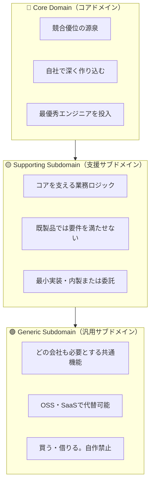

## 3.1 なぜ「分類」が必要なのか

DDDを学んだ開発者がよく犯す失敗があります。それは「すべてをDDDで作ろうとする」ことです。ユビキタス言語を全領域に適用し、すべてのクラスにリッチなドメインモデルを設計しようとする——しかしこれは、認証ライブラリやメール送信機能にまでDDDの設計コストをかけることを意味します。

DDDが提唱するのは、**投資を戦略的に集中させる**ことです。そのための分類フレームワークが、サブドメインの3分類です。

## 3.2 3つのサブドメイン：定義と性質

すべてのシステムは複数の「ビジネス問題領域（サブドメイン）」から構成されます。DDDはこれを3つに分類します。



### Core Domain（コアドメイン）

競合他社には真似できない、あるいは真似されたくない領域です。ここに競争優位の源泉があります。Amazonであれば「需要予測と在庫最適化アルゴリズム」、Uberであれば「リアルタイムのマッチングと価格決定」がコアドメインです。

コアドメインには最も優秀なエンジニアを投入し、DDD・テスト・継続的リファクタリングを徹底して適用します。

### Supporting Subdomain（支援サブドメイン）

コアドメインを動かすために必要だが、それ自体は競争優位にならない領域です。独自のビジネスロジックは存在するため既製品では代替できませんが、コアほど深く作り込む必要はありません。

### Generic Subdomain（汎用サブドメイン）

どの会社でも必要とする、業界共通の機能領域です。認証・決済・メール送信・ロギングなどが典型例です。ここに開発工数を使うのは機会損失です。OSS・SaaSで調達するのが正解です。

## 3.3 ECサイトを例にした分類実例

中規模ECサイトを例に、各機能を3分類に当てはめてみましょう。

| 機能 | 分類 | 理由 | 戦略 |
|------|------|------|------|
| レコメンデーションエンジン | Core Domain | 購買率・LTVに直結する差別化要因 | 自社で深く開発 |
| 価格変動アルゴリズム | Core Domain | 競合との価格競争の武器 | 自社で深く開発 |
| 注文管理フロー | Supporting | 独自ルールあり、汎用品では対応不可 | 最小実装で内製 |
| 返品・返金プロセス | Supporting | 業務ルールあるが差別化要因でない | 最小実装で内製 |
| 決済処理 | Generic | StripeやPayPalで代替可能 | SaaS利用 |
| ユーザー認証 | Generic | Auth0 / Cognitoで代替可能 | OSS/SaaS利用 |
| メール送信 | Generic | SendGrid等で代替可能 | SaaS利用 |
| 検索エンジン | Generic（→Coreに変わる可能性） | Algolia等で代替、ただし検索品質が差別化なら昇格 | まずSaaS、品質要件で見直し |

## 3.4 各分類の実装戦略：コードで見る

**Generic Subdomain：自作してはいけないアンチパターン**

```csharp
// ❌ アンチパターン：メール送信を自前実装する
public class HomebrewEmailSender
{
    // SMTPクライアントの直接実装
    // スパム対策・バウンス処理・テンプレート管理...
    // 数百時間の工数がコアドメインから奪われる
    public async Task Send(string to, string subject, string body)
    {
        using var client = new SmtpClient("smtp.example.com", 587);
        // ... 自前実装が続く
    }
}

// ✅ 正解：SendGridのSDKをそのまま使う
public class SendGridEmailSender : IEmailSender
{
    private readonly ISendGridClient _client;

    public async Task Send(EmailMessage message)
    {
        var msg = MailHelper.CreateSingleEmail(
            from: new EmailAddress("no-reply@shop.example"),
            to: new EmailAddress(message.To),
            subject: message.Subject,
            plainTextContent: message.Body,
            htmlContent: message.HtmlBody);

        await _client.SendEmailAsync(msg);
    }
}
```

**Core Domain：深く作り込むべき領域**

```csharp
// レコメンデーションエンジン：コアドメインとして丁寧に設計する
public class RecommendationEngine
{
    private readonly IPurchaseHistoryRepository _history;
    private readonly IProductAffinityModel _affinity;

    // 「協調フィルタリングで類似ユーザーの購買パターンを基にしたレコメンド」
    // というビジネスロジックをドメインモデルとして表現
    public async Task<IReadOnlyList<RecommendedProduct>> RecommendFor(
        CustomerId customerId,
        RecommendationContext context)
    {
        var history = await _history.GetRecentPurchases(customerId, months: 6);
        var similarCustomers = await _affinity.FindSimilarCustomers(history);

        return similarCustomers
            .SelectMany(c => c.TopPurchases)
            .Where(p => !history.Contains(p))
            .Where(p => context.IsEligible(p))
            .OrderByDescending(p => p.AffinityScore)
            .Take(context.MaxResults)
            .Select(p => new RecommendedProduct(p.Id, p.AffinityScore, RecommendationReason.CollaborativeFiltering))
            .ToList();
    }
}
```

**Supporting Subdomain：最小限に留める**

```csharp
// 返品管理：独自ロジックはあるが、シンプルに保つ
public class ReturnRequest
{
    public ReturnRequestId Id { get; }
    public OrderId OriginalOrderId { get; }
    public ReturnReason Reason { get; }
    public ReturnStatus Status { get; private set; }

    // 承認ロジックは単純なルールに留める（複雑にしない）
    public void Approve()
    {
        if (Status != ReturnStatus.Pending)
            throw new DomainException("審査中の申請のみ承認できます");

        Status = ReturnStatus.Approved;
    }
}
```

## 3.5 分類を間違えるコスト

最も危険なパターンは「Generic SubdomainをCore Domainと誤認する」ことです。

認証基盤を自前実装するために3ヶ月費やしたスタートアップが、競合にレコメンデーション精度で敗れる——これが分類の失敗が招く現実です。Auth0を1日で導入していれば、その3ヶ月をコアドメインの深掘りに使えたはずです。

---

> ### 専門家の視点：Eric Evans & Vaughn Vernon の戦略論
>
> Eric Evansは *Domain-Driven Design* の第15章で「Distillation（蒸留）」という概念を提唱しています。コアドメインを他のすべてから「蒸留」して抽出し、その精髄に集中することがDDDの戦略的核心であると述べています。
>
> **「最も重要なことは、Core Domainを特定し、それを他から分離し、そこに最優秀な人材と最大の注意を集中させることだ。」**
>
> Vaughn Vernonは *Domain-Driven Design Distilled*（2016年）の中でさらに実践的な判断軸を示しています。「そのコードを失ったら事業が止まるか？」がYESならCore Domain、「外部サービスで代替できるか？」がYESならGeneric Subdomainとして扱えとアドバイスしています。
>
> 特に、**Generic SubdomainにDDDを適用するアンチパターン**について彼は厳しく警告します。「汎用機能に精巧なドメインモデルを作るのは、壊れていない車に過剰整備をするようなものだ」と。

---

## まとめ

ドメインを3つに分類することで、エンジニアリング投資の配分を戦略的に決定できます。Generic SubdomainはOSS・SaaSで調達し、Supporting Subdomainは最小実装に留め、Core Domainに最高の設計と最大の工数を投入する——この優先順位を誤ると、差別化に関係ない機能の実装に貴重なリソースが流れていきます。次章では、これらのサブドメインを実際のシステムアーキテクチャに落とし込む「境界づけられたコンテキスト（Bounded Context）」を学びます。
