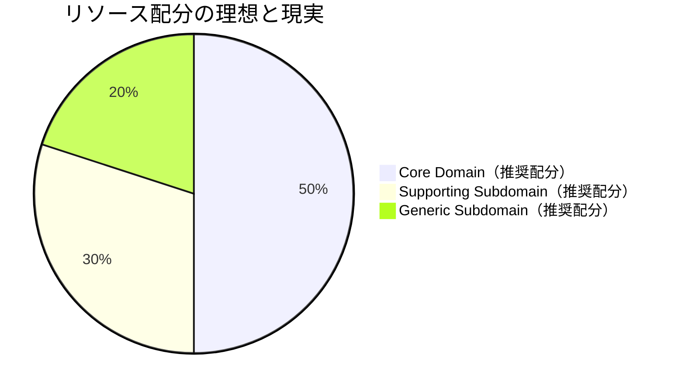
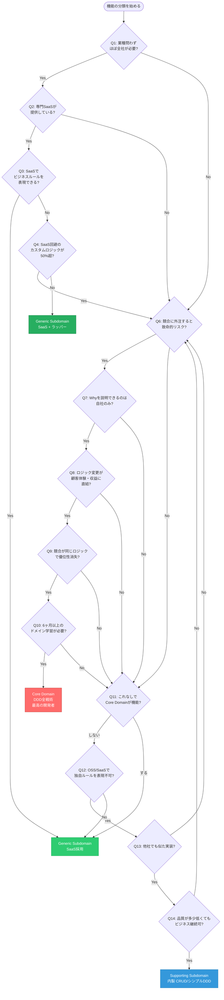
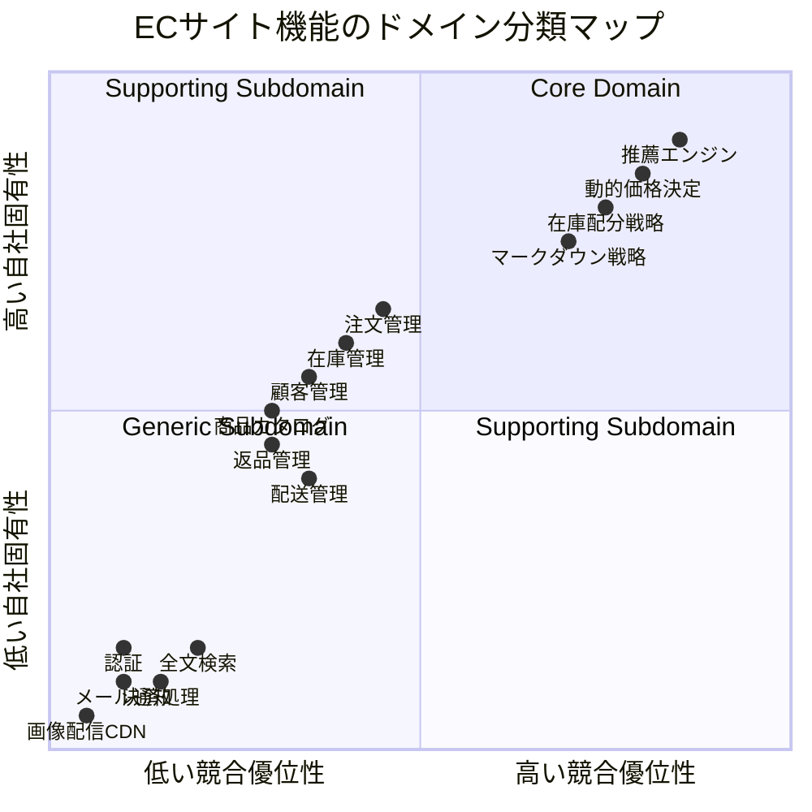
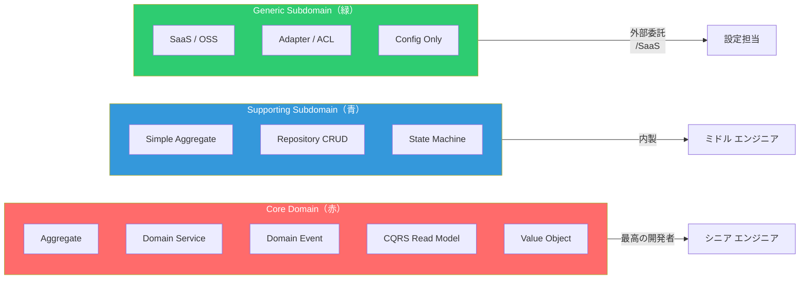

# 第3章: ドメイン分類（Core / Supporting / Generic）

> **アーキテクトレベル解説** — Eric Evans『Domain-Driven Design』(Blue Book) および Vaughn Vernon『Implementing Domain-Driven Design』(IDDD) の知識を前提とし、実務経験から得られた深い洞察を加えた完全ガイド

---

## 0. TL;DR

ソフトウェア開発における最大の失敗パターンの一つは、「すべての機能に同等のリソースと熱量を注ぐこと」です。ECサイトの認証機能と、注文の優先度付けアルゴリズムは、ビジネス的重要度が根本的に異なります。前者はAuth0一行で解決でき、後者はあなたの会社が競合に勝つための核心です。

DDD（ドメイン駆動設計）はこの非対称性を「ドメイン分類」という概念で明示的に扱います。

- **Core Domain（コアドメイン）**: 競合優位性をもたらす、替えの利かない領域。最高の開発者を充て、DDD全戦術を投入する
- **Supporting Subdomain（支援サブドメイン）**: Coreを支えるが、それ自体は差別化にならない。内製するが、CRUD程度で十分
- **Generic Subdomain（汎用サブドメイン）**: どのビジネスにも存在する汎用機能。SaaS・OSS・外注で済ませる

この分類を誤ると、認証に3ヶ月かけてコアロジックが手抜きになる、という最悪の事態が起きます。本章では分類の方法、判断フロー、アーキテクチャへの影響を余すことなく解説します。

---

## 1. なぜドメイン分類が必要か

### 1.1 全てに同じ力を注ぐと何が起きるか（実例）

2018年、某中規模ECスタートアップでの実話をベースにした事例を紹介します（細部は変更済み）。

そのチームは15人のエンジニアを擁し、2年かけてフルスクラッチでECプラットフォームを構築しました。彼らが取り組んだ機能を振り返ると次のようになっていました。

| 機能 | 開発工数 | ビジネス的重要度 | 代替手段 |
|------|---------|----------------|---------|
| メール送信 | 4ヶ月 | 低（汎用） | SendGrid $20/月 |
| ユーザー認証 | 3ヶ月 | 低（汎用） | Auth0 $0〜 |
| 決済処理 | 6ヶ月 | 低（汎用） | Stripe 1日 |
| 在庫管理 | 2ヶ月 | 中（支援） | 内製で妥当 |
| **パーソナライズ推薦エンジン** | **2ヶ月** | **高（コア）** | **代替不可** |
| **動的価格決定アルゴリズム** | **1ヶ月** | **高（コア）** | **代替不可** |

結果は明白でした。2年後にリリースしたとき、競合は既にMLベースの推薦エンジンを持ち、動的価格決定の洗練度で大きく差をつけられていました。一方、彼らのメール送信機能はSendGridと比較して機能が劣り、認証はセキュリティ上の懸念が残り、決済は複数通貨未対応でした。

つまり、**汎用的な機能を作るのに時間を使い、競合優位性を生むべきコアに十分な投資ができなかった**のです。

この悲劇の根本原因は「全ての機能が等しく重要だ」という思い込みです。エンジニアリングの世界では、「作れるから作る」という誘惑が常にあります。しかしアーキテクトとしての責務は、「作るべきものと、買うべきもの・外注すべきものを明確に分けること」です。

Eric Evansはこれをより哲学的に表現しています。「開発者は自分たちのエネルギーを、ドメインの最も価値ある部分に集中させなければならない」（Blue Book, Chapter 15）。しかし実際の現場では、この原則が形骸化していることがほとんどです。なぜなら、「どこが最も価値ある部分か」を明確に定義しなければ、エンジニアは自分の興味や技術的挑戦に引き寄せられてしまうからです。

### 1.2 80/20の法則とドメイン

パレートの法則（80/20の法則）をドメイン分類に適用すると、非常に示唆深い洞察が得られます。

**典型的なECシステムの分析**:
- システム全体の機能数: 100
- Core Domain に相当する機能: 約15〜20（推薦、価格、在庫配分戦略など）
- Supporting Subdomain: 約30〜40（顧客管理、注文処理など）
- Generic Subdomain: 約40〜50（認証、メール、決済API呼び出しなど）

しかし、ビジネス価値の配分を見ると:
- Core Domain 由来の差別化価値: 80%以上
- Supporting + Generic の差別化価値: 20%未満

この非対称性が示すのは、「機能数は少ないが価値が大きいCore Domainに、開発リソースの多くを投入すべき」という結論です。

Vaughn Vernonは『IDDD』の中で「コアドメインを発見することが、DDD実践の最も重要な第一歩だ」と述べています。分類そのものよりも、「どこがコアか」を組織全体で合意することに大きな価値があります。この合意形成のプロセスが、ビジネスとエンジニアリングの対話を生み、より良い設計に繋がります。



実際の現場では「Core Domain: 20%, Supporting: 30%, Generic: 50%」という逆転した配分になっていることが珍しくありません。本章の目的の一つは、この配分を正しい方向に導くための思考ツールを提供することです。

---

## 2. 3つの分類

### 2.1 Core Domain（コアドメイン）

#### 定義: 競合優位性をもたらすもの

Core Domainとは、あなたのビジネスを競合他社と差別化する、替えの利かない知識と能力の集合体です。

Eric Evansの定義を正確に引用すると: 「コアドメインとは、ビジネスにとって最も価値があり、競合優位性の源泉となるドメインモデルの部分である。ここにこそ最高の才能を集中させ、最も洗練されたモデルを作り上げるべきだ」（Blue Book, Chapter 15）。

この定義で重要なのは「競合優位性の源泉」という部分です。Core Domainは単に「重要な機能」ではなく、「これがなければビジネスが成立しない、かつ同じものを競合が容易に真似できない」領域を指します。

#### 見分け方: 「外注できるか」で判断

Core Domainを識別する最も実践的な問いは、「この機能を外注できるか？」です。

外注できないということは、以下のいずれかを意味します。
1. そのロジックが自社独自のビジネスルールに深く依存している
2. そのロジックが顧客へ提供する本質的な価値を生み出している
3. そのロジックを第三者に委ねると、競合優位性が失われる

**外注できない例（Core Domain）**:
- Amazonの推薦アルゴリズム（顧客の購買パターンに基づくパーソナライズ）
- Uberの動的価格決定エンジン（サージプライシング）
- Netflixのコンテンツ最適化（視聴データに基づくコンテンツ投資判断）
- 証券会社の注文執行エンジン（スリッページ最小化アルゴリズム）

**外注できる例（Core Domainではない）**:
- ユーザー認証（Auth0, Firebase Authなど）
- メール送信（SendGrid, SESなど）
- 決済処理（Stripe, Square など）

#### ECサイトのCore Domainは何か（具体例）

一般的なECサイトのCore Domainを深く分析してみましょう。

**ケース: 中規模ファッションECサイト**

ビジネスモデルの核心は「顧客が欲しいものを、欲しいタイミングで、適切な価格で提供すること」です。これを分解すると:

1. **パーソナライズド推薦ロジック**: 閲覧履歴、購買履歴、季節、在庫状況、利益率を組み合わせたレコメンデーション。Amazonのようなプラットフォームに依存した瞬間、このロジックのコントロールを失います。これは明確にCore Domainです。

2. **動的在庫配分**: 複数倉庫間での在庫最適化、欠品予測、補充タイミング決定。これもコアです。なぜなら「在庫を持ちすぎず、欠品もしない」バランスがキャッシュフローと顧客体験の両方に直結するからです。

3. **マークダウン価格戦略**: 売れ残りリスクを最小化しながら利益を最大化する値引きタイミングとパーセントの計算。これは外部SaaSでは提供できないビジネス固有のルールです。

一方で同じECサイトでも、以下はCore Domainではありません:
- カート機能（汎用的な一時保存ロジック）
- 住所入力フォーム（郵便番号補完含む）
- メール通知（注文確認、発送通知など）

#### なぜ最高の開発者をアサインすべきか

Vaughn Vernonは『IDDD』第1章でこう述べています。「コアドメインには最も熟練した、最もドメインを理解した開発者が取り組むべきだ。そうしなければ、最も価値ある部分が最も粗雑に実装されるという逆説が生まれる」。

この主張の背景には、ソフトウェア開発の経済学があります。経験豊富な開発者が複雑なビジネスルールを実装すると、次のような効果があります。

1. **モデルの洗練度**: ドメインエキスパートとの対話から生まれるユビキタス言語が正確に実装される
2. **変更容易性**: 将来のビジネスルール変更に対して、コードが柔軟に対応できる
3. **バグの局所化**: ビジネスロジックが正しくカプセル化されているため、バグが混入しにくく、混入しても発見しやすい

逆に、Junior開発者やアウトソースチームがCore Domainを担当すると、「動いてはいるが、ビジネスルールがコードに正確に反映されていない」という状態になりがちです。これは短期的には問題が見えにくいですが、ビジネスが進化するにつれて技術的負債として噴出します。

#### C# 実装: Core Domain の例

以下は、ファッションECサイトの「マークダウン価格戦略」というCore Domainの実装例です。このコードは実務で使えるレベルを意識しています。

```csharp
// Core Domain: マークダウン価格戦略
// このビジネスルールは自社独自であり、外注・既製品で代替不可能

namespace FashionEC.Domain.Pricing;

/// <summary>
/// マークダウン価格戦略を表すValue Object
/// ビジネスルール: 季節末尾に近いほど積極的にマークダウンし、
/// 在庫回転率と利益率のバランスを最適化する
/// </summary>
public sealed record MarkdownStrategy
{
    private MarkdownStrategy(
        MarkdownPhase phase,
        decimal discountRate,
        DateOnly effectiveFrom,
        DateOnly effectiveTo,
        string rationale)
    {
        Phase = phase;
        DiscountRate = discountRate;
        EffectiveFrom = effectiveFrom;
        EffectiveTo = effectiveTo;
        Rationale = rationale;
    }

    public MarkdownPhase Phase { get; }
    public decimal DiscountRate { get; } // 0.0 - 1.0
    public DateOnly EffectiveFrom { get; }
    public DateOnly EffectiveTo { get; }
    public string Rationale { get; }

    /// <summary>
    /// ファクトリメソッド: ビジネスルールに基づいてマークダウン戦略を決定
    /// </summary>
    public static Result<MarkdownStrategy> Determine(
        Product product,
        SeasonCalendar season,
        InventoryMetrics inventory,
        DateOnly today)
    {
        // ビジネスルール1: シーズン終了30日前以内でない限り積極的なマークダウンをしない
        var daysUntilSeasonEnd = season.EndDate.DayNumber - today.DayNumber;

        // ビジネスルール2: 在庫回転率が目標の50%未満なら早期マークダウン
        var isLowTurnover = inventory.CurrentTurnoverRate < (inventory.TargetTurnoverRate * 0.5m);

        // ビジネスルール3: 残在庫数が初期仕入れの40%超かつシーズン残30日以内
        var isOverstock = inventory.CurrentStockRatio > 0.4m && daysUntilSeasonEnd <= 30;

        var phase = DeterminePhase(daysUntilSeasonEnd, isLowTurnover, isOverstock);
        var rate = CalculateDiscountRate(phase, inventory, product.CostPrice, product.ListPrice);

        if (rate < 0m || rate > 0.8m)
            return Result.Failure<MarkdownStrategy>(
                new DomainError("Markdown.InvalidRate",
                    $"算出された割引率 {rate:P0} が有効範囲外です。コスト割れ防止ルールを確認してください。"));

        return Result.Success(new MarkdownStrategy(
            phase,
            rate,
            today,
            season.EndDate,
            BuildRationale(phase, daysUntilSeasonEnd, inventory)));
    }

    private static MarkdownPhase DeterminePhase(
        int daysUntilSeasonEnd,
        bool isLowTurnover,
        bool isOverstock)
    {
        return (daysUntilSeasonEnd, isLowTurnover, isOverstock) switch
        {
            // シーズン末期 + 過剰在庫 → アグレッシブクリアランス
            (<= 14, _, true) => MarkdownPhase.AggressiveClearance,

            // シーズン末期 + 回転不良 → ヘビーマークダウン
            (<= 30, true, _) => MarkdownPhase.HeavyMarkdown,

            // シーズン中盤 + 回転不良 → ライトマークダウン
            (<= 60, true, _) => MarkdownPhase.LightMarkdown,

            // 通常期
            _ => MarkdownPhase.FullPrice
        };
    }

    private static decimal CalculateDiscountRate(
        MarkdownPhase phase,
        InventoryMetrics inventory,
        Money costPrice,
        Money listPrice)
    {
        // ビジネスルール4: コスト割れは絶対に許容しない（損益分岐点ガード）
        var minimumMarginRate = 0.05m; // 最低5%の利益率確保
        var breakEvenRate = 1m - (costPrice.Amount / listPrice.Amount) - minimumMarginRate;

        var baseRate = phase switch
        {
            MarkdownPhase.FullPrice => 0m,
            MarkdownPhase.LightMarkdown => 0.1m,
            MarkdownPhase.HeavyMarkdown => 0.3m,
            MarkdownPhase.AggressiveClearance => 0.5m,
            _ => throw new UnreachableException()
        };

        // 在庫回転率に応じた追加割引（最大10%ポイント加算）
        var additionalRate = Math.Max(0m,
            (inventory.TargetTurnoverRate - inventory.CurrentTurnoverRate) /
            inventory.TargetTurnoverRate * 0.1m);

        return Math.Min(baseRate + additionalRate, breakEvenRate);
    }

    private static string BuildRationale(
        MarkdownPhase phase,
        int daysUntilSeasonEnd,
        InventoryMetrics inventory)
        => $"フェーズ: {phase}, シーズン残日数: {daysUntilSeasonEnd}日, " +
           $"在庫回転率: {inventory.CurrentTurnoverRate:P0} (目標: {inventory.TargetTurnoverRate:P0})";
}

public enum MarkdownPhase
{
    FullPrice,           // 定価販売
    LightMarkdown,       // 軽度マークダウン（〜10%）
    HeavyMarkdown,       // 重度マークダウン（〜30%）
    AggressiveClearance  // アグレッシブクリアランス（〜50%）
}
```

```csharp
// このドメインサービスを呼び出すアプリケーション層
namespace FashionEC.Application.Pricing;

public sealed class PriceMarkdownApplicationService(
    IProductRepository products,
    IInventoryRepository inventories,
    ISeasonCalendarRepository seasons,
    IMarkdownStrategyRepository strategies,
    IDomainEventPublisher eventPublisher)
{
    public async Task<Result<MarkdownDecision>> EvaluateAndApplyMarkdown(
        ProductId productId,
        CancellationToken ct = default)
    {
        var product = await products.FindByIdAsync(productId, ct);
        if (product is null)
            return Result.Failure<MarkdownDecision>(
                new DomainError("Product.NotFound", $"商品 {productId} が見つかりません"));

        var inventory = await inventories.FindByProductIdAsync(productId, ct);
        if (inventory is null)
            return Result.Failure<MarkdownDecision>(
                new DomainError("Inventory.NotFound", $"在庫情報が見つかりません"));

        var season = await seasons.GetCurrentSeasonAsync(product.Category, ct);
        var today = DateOnly.FromDateTime(DateTime.UtcNow);

        // Core Domain のロジックを呼び出す
        var strategyResult = MarkdownStrategy.Determine(product, season, inventory, today);
        if (strategyResult.IsFailure)
            return Result.Failure<MarkdownDecision>(strategyResult.Error);

        var strategy = strategyResult.Value;

        // 価格変更をAggregate経由で適用
        var markdownResult = product.ApplyMarkdown(strategy);
        if (markdownResult.IsFailure)
            return Result.Failure<MarkdownDecision>(markdownResult.Error);

        await products.SaveAsync(product, ct);
        await eventPublisher.PublishAllAsync(product.DomainEvents, ct);

        return Result.Success(new MarkdownDecision(
            productId,
            strategy.Phase,
            strategy.DiscountRate,
            strategy.Rationale));
    }
}
```

このコードが示すように、Core Domainのロジックは`MarkdownStrategy`というValue Objectにカプセル化されています。ビジネスルール（コスト割れ防止、在庫回転率ベースの割引計算など）は全てドメイン層に集約されており、アプリケーション層はオーケストレーションのみを担っています。

---

### 2.2 Supporting Subdomain（支援サブドメイン）

#### 定義: Core を支えるがそれ自体は競合優位でない

Supporting Subdomainは、Core Domainが機能するために必要不可欠ですが、それ自体がビジネスの差別化要因にはならない領域です。

Vaughn Vernonの表現を借りると: 「支援サブドメインは、コアドメインをサポートするために特化したモデルを必要とするが、そのモデル自体は標準化可能なものであり、コアドメインの専門知識を必要としない」（IDDD, Chapter 2）。

Supporting Subdomainの特徴を整理します。

1. **特定のビジネスに特化している**: 汎用的なOSSでは対応できない自社固有のルールがある
2. **Core Domainの実行基盤となる**: Core Domainのロジックが機能するためのデータや処理を提供する
3. **競合が同じものを持っていても問題ない**: そのサブドメインで勝負する必要がない

#### ECサイトの例: 顧客管理・在庫管理

**顧客管理がSupporting Subdomainである理由**:

ECサイトの顧客管理（顧客プロファイル、住所管理、会員ランク計算など）は、Core Domainである推薦エンジンや価格戦略のインプットとなる重要なデータを管理します。しかし、顧客管理そのもの（CRUDレベルの操作）は競合他社と差別化する要素ではありません。

**在庫管理がSupporting Subdomainである理由**:

在庫の入出庫記録、現在庫数の追跡、倉庫別在庫の管理などは、Core Domainの「在庫配分戦略」が機能するための基盤データを提供します。しかし、入出庫を記録するロジック自体は特別な競合優位性を生みません。一方で、「どの倉庫からどの注文に在庫を割り当てるか」というアルゴリズムはCore Domainに分類されることもあります（ビジネスによる）。

#### 外注・既製品 vs 内製の判断基準

Supporting Subdomainに対してよくある誤りは、「外注すれば工数が削減できる」という発想で、Core Domainと同様に外部SaaSに丸投げしてしまうことです。

Supporting Subdomainに外部SaaSを使うことの問題点:
1. **モデルの不一致**: 外部SaaSのデータモデルが自社のドメインモデルと合わない場合、多大な変換処理が必要になる
2. **ロックイン**: サービスの方針変更や価格改定に振り回される
3. **インテグレーション複雑性**: Core Domainとの連携で予期しない複雑さが生まれる

Supporting Subdomainに対する適切なアプローチは「内製するが、DDDの全戦術を投入しない」ことです。シンプルなCRUDアーキテクチャ、あるいは軽量なトランザクションスクリプトで十分な場合が多いです。

**判断マトリクス**:

| 観点 | Core Domain | Supporting Subdomain | Generic Subdomain |
|------|------------|---------------------|------------------|
| 実装アプローチ | フルDDD | シンプルDDD or CRUD | SaaS/OSS |
| 開発者レベル | シニア必須 | ミドル以上 | 誰でも可 |
| テスト密度 | 最高 | 高 | 最低限 |
| リファクタリング頻度 | 高 | 中 | 低 |
| ドキュメント投資 | 最高 | 中 | 最低限 |

#### C# 実装: Supporting Subdomain の例

```csharp
// Supporting Subdomain: 顧客管理
// シンプルなCRUDで十分。DDD全戦術は不要だが、
// Core Domainとの連携インターフェースは適切に設計する

namespace FashionEC.CustomerManagement;

// Supporting Subdomainでは、シンプルなリポジトリパターンで十分
public sealed class CustomerService(
    ICustomerRepository customers,
    IAddressValidator addressValidator)
{
    public async Task<Result<CustomerId>> RegisterCustomer(
        RegisterCustomerCommand command,
        CancellationToken ct = default)
    {
        // バリデーション（Supporting Subdomainではシンプルに）
        var validationResult = await addressValidator.ValidateAsync(command.Address, ct);
        if (!validationResult.IsValid)
            return Result.Failure<CustomerId>(
                new ValidationError(validationResult.Errors));

        // 重複チェック
        var existing = await customers.FindByEmailAsync(command.Email, ct);
        if (existing is not null)
            return Result.Failure<CustomerId>(
                new DomainError("Customer.Duplicate", "このメールアドレスは既に登録されています"));

        var customer = new Customer(
            id: CustomerId.New(),
            email: new Email(command.Email),
            displayName: command.DisplayName,
            address: Address.From(command.Address),
            membershipTier: MembershipTier.Standard,
            registeredAt: DateTimeOffset.UtcNow);

        await customers.SaveAsync(customer, ct);

        return Result.Success(customer.Id);
    }

    // Core Domainが参照する顧客プロファイル（読み取り専用の投影）
    public async Task<CustomerProfile?> GetProfileForRecommendation(
        CustomerId customerId,
        CancellationToken ct = default)
    {
        var customer = await customers.FindByIdAsync(customerId, ct);
        if (customer is null) return null;

        // Core Domainが必要とする最小限の情報のみを返す（情報隠蔽）
        return new CustomerProfile(
            customerId,
            customer.MembershipTier,
            customer.PreferredCategories,
            customer.PurchaseHistory.GetRecentCategories(months: 3));
    }

    public async Task<Result> UpdateAddress(
        CustomerId customerId,
        UpdateAddressCommand command,
        CancellationToken ct = default)
    {
        var customer = await customers.FindByIdAsync(customerId, ct);
        if (customer is null)
            return Result.Failure(
                new DomainError("Customer.NotFound", $"顧客 {customerId} が見つかりません"));

        var validationResult = await addressValidator.ValidateAsync(command.Address, ct);
        if (!validationResult.IsValid)
            return Result.Failure(new ValidationError(validationResult.Errors));

        customer.UpdateAddress(Address.From(command.Address));
        await customers.SaveAsync(customer, ct);

        return Result.Success();
    }
}
```

Supporting Subdomainのコードは、Core Domainほど複雑なドメインロジックを含みません。しかし、Core Domainとの境界（`CustomerProfile`という投影オブジェクト）は適切に設計されており、情報隠蔽の原則を守っています。

---

### 2.3 Generic Subdomain（汎用サブドメイン）

#### 定義: どのビジネスにも共通する機能

Generic Subdomainは、業界や業種を問わず、ほぼすべてのビジネスが必要とする標準的な機能です。Eric Evansは次のように定義しています。「汎用サブドメインは、特定のビジネスに固有のものではなく、多くのビジネスで必要とされる。そのため、既製のソリューションが存在する可能性が高い」（Blue Book, Chapter 15）。

Generic Subdomainの見分け方:
1. 「この機能、他の会社も絶対持ってるよな」と思える
2. GoogleやAmazon、Stripeなどの専門企業が既にプロダクトとして提供している
3. ビジネスルールがほぼ業界標準で、独自の変形がほとんどない

#### 例: 認証・メール・決済

**認証 (Authentication)**:
ユーザーIDとパスワードの管理、MFA、セッション管理、OAuthプロバイダとの連携。これらは全てのWebサービスが持っており、しかもAuth0, Firebase Auth, Cognito, Clerkといった専門サービスが10年以上かけて洗練させてきた領域です。自前で実装する理由は99%の場合で存在しません。

**メール (Email)**:
注文確認メール、パスワードリセット、マーケティングメールの配信。SendGrid, SES, Postmarkなどが高度な配信率最適化、バウンス処理、スパムフィルター対応を提供しています。

**決済 (Payment)**:
クレジットカード処理、3Dセキュア対応、不正検知。PCI DSS準拠を自前で達成するコストと技術的難易度は凄まじく、Stripeを使えば1日で実装できるものを3ヶ月かけて実装するのは明らかな資源の無駄です。

#### なぜSaaS（Stripe・SendGrid・Auth0）を使うべきか

SaaS採用の合理性を多角的に説明します。

**1. 専門化の経済効果**

Stripeには400人を超える決済に特化したエンジニアがいます。彼らは毎日、不正検知、決済成功率向上、新しい決済手段対応に取り組んでいます。あなたのECサイトの決済チームがこれに匹敵するリソースを持てる可能性はゼロに近いです。

**2. コンプライアンスとセキュリティ**

PCI DSS, SOC2, GDPRなどのコンプライアンス要件への対応は、専門のSaaSプロバイダが既に済ませています。自前実装でこれらを達成するには、専門の監査、定期的な侵入テスト、コンプライアンス担当者が必要です。

**3. 機会コスト**

Generic Subdomainの実装に費やした1ヶ月は、Core Domainの改善に使えた1ヶ月です。Stripeの導入が1日で済むなら、残り29日をパーソナライズ推薦エンジンの改善に投入できます。

**4. 長期保守コスト**

自前実装したメール配信基盤は、5年後にあなたのチームが保守しなければなりません。一方SendGridは5年後も最新の配信技術を提供し続けます。

#### C# 実装: Generic Subdomain の正しい扱い方

Generic Subdomainは「使う」だけです。しかし、外部SaaSとの結合を適切に隔離することで、将来のベンダー切り替えを容易にすることが重要です。

```csharp
// Generic Subdomain: メール通知
// 実装はSendGridに委譲するが、ドメイン層への結合を避けるために
// Anti-Corruption Layerとして抽象化する

namespace FashionEC.Notifications;

// ドメイン層が依存するのはこのインターフェースのみ
public interface INotificationService
{
    Task SendOrderConfirmationAsync(
        OrderId orderId,
        CustomerEmail customerEmail,
        OrderSummary summary,
        CancellationToken ct = default);

    Task SendShippingNotificationAsync(
        OrderId orderId,
        CustomerEmail customerEmail,
        TrackingInfo trackingInfo,
        CancellationToken ct = default);
}

// インフラ層: SendGridを使った実装（Generic Subdomain の実体）
namespace FashionEC.Infrastructure.Notifications;

public sealed class SendGridNotificationService(
    ISendGridClient sendGridClient,
    IOptions<SendGridOptions> options,
    ILogger<SendGridNotificationService> logger)
    : INotificationService
{
    public async Task SendOrderConfirmationAsync(
        OrderId orderId,
        CustomerEmail customerEmail,
        OrderSummary summary,
        CancellationToken ct = default)
    {
        var msg = new SendGridMessage
        {
            From = new EmailAddress(options.Value.FromAddress, "FashionEC"),
            Subject = $"ご注文確認 #{orderId}",
            TemplateId = options.Value.OrderConfirmationTemplateId
        };

        msg.AddTo(new EmailAddress(customerEmail.Value));
        msg.SetTemplateData(new
        {
            order_id = orderId.Value,
            items = summary.Items.Select(i => new { i.ProductName, i.Quantity, i.Price }),
            total = summary.TotalAmount,
            estimated_delivery = summary.EstimatedDeliveryDate
        });

        var response = await sendGridClient.SendEmailAsync(msg, ct);

        if (!response.IsSuccessStatusCode)
        {
            var body = await response.Body.ReadAsStringAsync(ct);
            logger.LogError(
                "SendGrid メール送信失敗 OrderId={OrderId} StatusCode={StatusCode} Body={Body}",
                orderId, response.StatusCode, body);
            // Generic Subdomainの失敗はアプリを止めない（注文は確定させる）
            // 代わりに後処理キューに積む
        }
    }

    public async Task SendShippingNotificationAsync(
        OrderId orderId,
        CustomerEmail customerEmail,
        TrackingInfo trackingInfo,
        CancellationToken ct = default)
    {
        // SendGrid Dynamic Template を使って配送通知メールを送信
        var msg = new SendGridMessage
        {
            From = new EmailAddress(options.Value.FromAddress, "FashionEC"),
            TemplateId = options.Value.ShippingNotificationTemplateId
        };
        msg.AddTo(new EmailAddress(customerEmail.Value));
        msg.SetTemplateData(new
        {
            order_id = orderId.Value,
            tracking_number = trackingInfo.TrackingNumber,
            carrier = trackingInfo.Carrier,
            estimated_delivery = trackingInfo.EstimatedDelivery
        });

        await sendGridClient.SendEmailAsync(msg, ct);
    }
}
```

```csharp
// Generic Subdomain: 認証
// Auth0を使用し、アプリケーション層への漏れを防ぐ

// Program.cs での設定
builder.Services.AddAuthentication(JwtBearerDefaults.AuthenticationScheme)
    .AddJwtBearer(options =>
    {
        options.Authority = $"https://{builder.Configuration["Auth0:Domain"]}/";
        options.Audience = builder.Configuration["Auth0:Audience"];
    });

// ドメイン層はAuth0を一切知らない
// CurrentUserIdという概念のみをドメイン層に渡す
public sealed record CurrentUserId(string Value);

// Generic Subdomainとアプリケーション層の境界
public sealed class CurrentUserProvider(IHttpContextAccessor httpContextAccessor)
    : ICurrentUserProvider
{
    public CurrentUserId? GetCurrentUserId()
    {
        var userId = httpContextAccessor.HttpContext?
            .User.FindFirstValue(ClaimTypes.NameIdentifier);
        return userId is not null ? new CurrentUserId(userId) : null;
    }
}
```

---

## 3. 分類の判断フロー（詳細フローチャート）

### 3.1 15の質問と答え

以下の15の質問に順番に答えることで、対象の機能がCore/Supporting/Genericのいずれに属するかを判断できます。

**フェーズ1: Generic Subdomain の排除（Q1〜Q5）**

**Q1: この機能は、業種・業界を問わず、ほぼすべての会社が必要とするか？**
- Yes → Generic Subdomain の可能性が高い（Q2へ）
- No → Q6へ（Supporting/Core の評価へ）

**Q2: 専門のSaaSプロバイダ（Stripe, Auth0, SendGrid等）がこの機能を提供しているか？**
- Yes → Q3へ
- No → Q6へ

**Q3: そのSaaSを導入した場合、ビジネスの独自ルールを表現できるか？**
- Yes（標準機能で十分） → **Generic Subdomain → SaaS採用を推奨**
- No（独自性が高すぎる） → Q4へ

**Q4: SaaSの制限を回避するためのカスタムロジックが、全体の50%以上を占めるか？**
- Yes → Q6へ（Supporting/Core評価へ）
- No → **Generic Subdomain → SaaS + 最小限のラッパー**

**Q5: コンプライアンス要件（PCI DSS等）により、SaaS利用が困難か？**
- Yes → Q6へ
- No → **Generic Subdomain → SaaS推奨**

**フェーズ2: Core Domain の識別（Q6〜Q10）**

**Q6: この機能を競合他社に完全に丸投げしたら、ビジネス上の致命的なリスクになるか？**
- Yes → Q7へ（Core Domainの深掘り）
- No → Q11へ（Supporting評価へ）

**Q7: このビジネスロジックが「なぜ」そうなっているかを説明できるのは、自社のドメインエキスパートだけか？**
- Yes → Q8へ
- No → Q11へ

**Q8: このロジックが変わると、顧客体験・収益モデルが直接変わるか？**
- Yes → Q9へ
- No → Q11へ

**Q9: 競合他社がこれと同じロジックを持てば、競合優位性が失われるか？**
- Yes → Q10へ
- No → Q11へ

**Q10: このロジックを最も理解するのに、6ヶ月以上のドメイン学習が必要か？**
- Yes → **Core Domain → DDD全戦術 + 最高の開発者**
- No → Q11へ（Supporting評価）

**フェーズ3: Supporting Subdomain の確認（Q11〜Q15）**

**Q11: この機能がなければ、Core Domainが機能しないか？**
- Yes → Q12へ
- No → **Generic Subdomainの可能性を再検討**

**Q12: 既製のOSSやSaaSでは、自社固有のルールを表現できないか？**
- Yes → Q13へ
- No → **Generic Subdomain → OSS/SaaS採用**

**Q13: この機能のビジネスルールは、自社に特有だが、他社でも似たような実装がなされているか？**
- Yes → Q14へ
- No → Core Domain の可能性を再検討（Q6に戻る）

**Q14: この機能の品質が多少低くても、ビジネスは継続できるか（致命的でないか）？**
- Yes → **Supporting Subdomain → 内製 + シンプルDDD/CRUD**
- No → Core Domain との境界を再検討

**Q15: この機能の開発・保守コストが高すぎる場合、外注することで大きなリスクが生じるか？**
- リスク大 → **Supporting Subdomain → 内製（慎重に）**
- リスク小 → **Supporting Subdomain → 外注可能**

### 3.2 Mermaidフローチャート



---

## 4. 分類の実例: ECサイトの完全分析

ここでは、中規模ファッションECサイトの全主要機能に対して、上述の15質問フローを適用した結果を示します。

### 4.1 全機能一覧と分類結果



### 4.2 詳細分析テーブル

| # | 機能 | 分類 | 判断理由 | 推奨アーキテクチャ | 推奨ツール/アプローチ | 開発者レベル |
|---|------|------|---------|-------------------|---------------------|------------|
| 1 | **パーソナライズ推薦エンジン** | **Core** | 購買データと在庫・利益を組み合わせた独自アルゴリズムが競合優位の源泉 | DDD全戦術 + CQRS + Domain Event | フルDDD実装、機械学習連携 | シニア必須 |
| 2 | **動的価格決定** | **Core** | サージプライシング・マークダウン戦略は自社の収益モデルに直結 | DDD全戦術 + Domain Event | フルDDD実装 | シニア必須 |
| 3 | **在庫配分戦略** | **Core** | 複数倉庫・複数注文間の最適配分アルゴリズムが在庫回転率と顧客体験を左右 | DDD + ドメインサービス | フルDDD実装 | シニア必須 |
| 4 | **マークダウン戦略** | **Core** | 季節・在庫回転率・コスト割れ防止を組み合わせた独自ロジック | DDD + Value Object | フルDDD実装 | シニア必須 |
| 5 | **注文管理** | **Supporting** | 注文ステータス遷移・キャンセルポリシーは自社固有だが差別化要因ではない | シンプルDDD + State Machine | 内製、軽量DDD | ミドル以上 |
| 6 | **在庫管理（CRUD）** | **Supporting** | 入出庫の記録・現在庫追跡は汎用だが自社Coreに密結合 | シンプルCRUD + イベント連携 | 内製 | ミドル以上 |
| 7 | **顧客管理** | **Supporting** | 顧客プロファイル・会員ランク管理は推薦エンジンの入力となる | シンプルCRUD | 内製 | ミドル以上 |
| 8 | **商品カタログ管理** | **Supporting** | 商品情報・カテゴリ・属性管理は独自ルールあり（SKU体系等） | シンプルDDD or CRUD | 内製 | ミドル以上 |
| 9 | **配送管理** | **Supporting** | 配送業者連携・追跡は業者APIとの統合が必要だが汎用性高い | Anti-Corruption Layer | 内製 + 配送業者API | ミドル以上 |
| 10 | **返品・返金管理** | **Supporting** | 返品ポリシーは自社固有だが、決済返金はStripeに委譲 | シンプルDDD（返品ルール） + Stripe（返金） | 内製 + Stripe | ミドル以上 |
| 11 | **ユーザー認証** | **Generic** | 全EC共通機能、専門SaaSが充実 | Anti-Corruption Layer のみ | Auth0 / Cognito / Firebase Auth | 誰でも可 |
| 12 | **メール通知** | **Generic** | 全EC共通機能、高配信率は専門業者が有利 | Adapter パターン | SendGrid / SES / Postmark | 誰でも可 |
| 13 | **決済処理** | **Generic** | PCI DSS対応含め自前実装は非合理 | Anti-Corruption Layer のみ | Stripe / Square / PayPay | 誰でも可 |
| 14 | **全文検索** | **Generic** | 商品検索・レコメンド以外の検索は汎用 | Adapter パターン | Algolia / Elasticsearch / OpenSearch | 誰でも可 |
| 15 | **画像配信・CDN** | **Generic** | 画像リサイズ・最適化・配信は完全汎用 | 設定のみ | Cloudflare / CloudFront / Fastly | 誰でも可 |

### 4.3 境界が曖昧なケースの深堀り

**ケース1: 「検索機能」はGenericか？**

表面上、検索はAlgoliaやElasticsearchで十分に見えます。しかし、以下の場合はCore Domainの要素を持ちます。

- 検索結果のランキングに「利益率」「在庫状況」「プレミアム会員への露出優先」などのビジネスロジックを組み込む場合
- 検索意図の解析（「赤いスカート」→ 季節や流行を考慮した結果）が競合優位の源泉である場合

この場合、「検索インデックスの管理」はGeneric（Algolia）、「検索ランキングロジック」はCore Domainとして分類します。これが「サブドメインのネスト」です。

**ケース2: 「返品管理」はSupportingか？**

返品ポリシー（返品期間、条件、返金方法）は自社ごとに異なります。この「返品ポリシー判定ロジック」はSupporting Subdomainです。しかし、返品率が高い商品を特定して仕入れ判断に活かすアルゴリズムは、Core Domainの「仕入れ最適化」に該当する可能性があります。

このように、一つの業務フローの中でも「どの部分がCore/Supporting/Genericか」を分けて考えることが重要です。

---

## 5. 分類がアーキテクチャに与える影響

### 5.1 Core Domain: DDD全戦術

Core Domainには、DDDが提供するすべての戦術パターンを適用します。

**Aggregate（集約）**: 整合性の境界を明確に定義し、ビジネスルールを集約内に封じ込めます。

```csharp
// Core Domain Aggregate: 注文（倉庫配分戦略付き）
namespace FashionEC.Domain.Orders;

public sealed class Order : AggregateRoot<OrderId>
{
    private readonly List<OrderLine> _lines = [];
    private readonly List<IDomainEvent> _domainEvents = [];
    private readonly WarehouseAllocationStrategy _allocationStrategy;

    private Order() { } // EF Core用

    private Order(
        OrderId id,
        CustomerId customerId,
        WarehouseAllocationStrategy allocationStrategy)
    {
        Id = id;
        CustomerId = customerId;
        _allocationStrategy = allocationStrategy;
        Status = OrderStatus.Draft;
    }

    public CustomerId CustomerId { get; private set; }
    public OrderStatus Status { get; private set; }
    public IReadOnlyList<OrderLine> Lines => _lines.AsReadOnly();
    public IReadOnlyList<IDomainEvent> DomainEvents => _domainEvents.AsReadOnly();

    public static Result<Order> Create(
        CustomerId customerId,
        WarehouseAllocationStrategy allocationStrategy)
    {
        if (customerId is null)
            return Result.Failure<Order>(
                new DomainError("Order.InvalidCustomer", "顧客IDが必要です"));

        var order = new Order(OrderId.New(), customerId, allocationStrategy);
        order._domainEvents.Add(new OrderCreatedEvent(order.Id, customerId));

        return Result.Success(order);
    }

    public Result AddItem(ProductId productId, int quantity, Money unitPrice)
    {
        if (Status != OrderStatus.Draft)
            return Result.Failure(
                new DomainError("Order.NotDraft", "確定済み注文に商品を追加できません"));

        if (quantity <= 0)
            return Result.Failure(
                new DomainError("Order.InvalidQuantity", "数量は1以上である必要があります"));

        // Core Domainルール: 同一商品の行を統合
        var existingLine = _lines.FirstOrDefault(l => l.ProductId == productId);
        if (existingLine is not null)
        {
            _lines.Remove(existingLine);
            _lines.Add(existingLine.IncreaseQuantity(quantity));
        }
        else
        {
            _lines.Add(new OrderLine(productId, quantity, unitPrice));
        }

        return Result.Success();
    }

    public Result<WarehouseAllocation> Confirm(InventorySnapshot inventorySnapshot)
    {
        if (Status != OrderStatus.Draft)
            return Result.Failure<WarehouseAllocation>(
                new DomainError("Order.AlreadyConfirmed", "注文は既に確定済みです"));

        if (!_lines.Any())
            return Result.Failure<WarehouseAllocation>(
                new DomainError("Order.EmptyOrder", "注文に商品が含まれていません"));

        // Core Domain: 倉庫配分戦略を適用（これが競合優位の核心）
        var allocationResult = _allocationStrategy.Allocate(_lines, inventorySnapshot);
        if (allocationResult.IsFailure)
            return Result.Failure<WarehouseAllocation>(allocationResult.Error);

        Status = OrderStatus.Confirmed;
        _domainEvents.Add(new OrderConfirmedEvent(
            Id, CustomerId, allocationResult.Value, CalculateTotal()));

        return allocationResult;
    }

    public Money CalculateTotal()
        => _lines.Aggregate(Money.Zero, (sum, line) => sum + line.Subtotal);

    public void ClearDomainEvents() => _domainEvents.Clear();
}
```

**Domain Event（ドメインイベント）**: ビジネス的に重要な出来事を表現し、疎結合な連携を実現します。

```csharp
// Core Domain Events: 過去形の動詞で命名する（DDDの慣習）
public sealed record OrderConfirmedEvent(
    OrderId OrderId,
    CustomerId CustomerId,
    WarehouseAllocation Allocation,
    Money Total) : IDomainEvent
{
    public Guid Id { get; } = Guid.NewGuid();
    public DateTimeOffset OccurredAt { get; } = DateTimeOffset.UtcNow;
}

// このイベントに反応する別のサブドメイン（疎結合）
public sealed class UpdateInventoryOnOrderConfirmed(
    IInventoryRepository inventories)
    : IDomainEventHandler<OrderConfirmedEvent>
{
    public async Task HandleAsync(
        OrderConfirmedEvent domainEvent,
        CancellationToken ct = default)
    {
        // 倉庫配分に基づいて在庫を引き当て
        foreach (var allocation in domainEvent.Allocation.Items)
        {
            var inventory = await inventories
                .FindByProductAndWarehouseAsync(
                    allocation.ProductId,
                    allocation.WarehouseId, ct);

            inventory?.Reserve(allocation.Quantity);
            if (inventory is not null)
                await inventories.SaveAsync(inventory, ct);
        }
    }
}
```

**CQRS（コマンド・クエリ責務分離）**: Core Domainの複雑なクエリをCommandモデルから分離し、それぞれを独立して最適化します。

```csharp
// Query側（Core Domainの読み取り最適化）
// 推薦エンジンへの入力となる複合クエリ
public sealed class GetPersonalizationInputQuery
{
    public required CustomerId CustomerId { get; init; }
    public required DateRange Period { get; init; }
}

public sealed record PersonalizationInput(
    CustomerId CustomerId,
    IReadOnlyList<CategoryPreference> CategoryPreferences,
    IReadOnlyList<PriceRangeAffinity> PriceRangeAffinities,
    IReadOnlyList<BrandAffinity> BrandAffinities,
    decimal AverageOrderValue,
    int PurchaseFrequency);

// Read Modelは正規化せず、クエリに特化した非正規化テーブルから読む
public sealed class GetPersonalizationInputQueryHandler(
    IPersonalizationReadRepository readRepo)
    : IQueryHandler<GetPersonalizationInputQuery, PersonalizationInput?>
{
    public async Task<PersonalizationInput?> HandleAsync(
        GetPersonalizationInputQuery query,
        CancellationToken ct = default)
        => await readRepo.GetPersonalizationInputAsync(
            query.CustomerId, query.Period, ct);
}
```

### 5.2 Supporting Subdomain: CRUD + 簡易DDD

Supporting Subdomainでは、Aggregateの概念は使いますが、Domain EventやCQRSの適用は最小限に留めます。

```csharp
// Supporting Subdomain: シンプルなCRUDに近い実装
// OrderStatus の状態遷移程度はモデル化するが、複雑なドメインサービスは作らない

namespace FashionEC.OrderManagement;

public sealed class OrderStatusTracker
{
    private static readonly Dictionary<OrderStatus, IReadOnlySet<OrderStatus>>
        ValidTransitions = new()
        {
            [OrderStatus.Confirmed] = new HashSet<OrderStatus>
                { OrderStatus.Processing, OrderStatus.Cancelled },
            [OrderStatus.Processing] = new HashSet<OrderStatus>
                { OrderStatus.Shipped, OrderStatus.Cancelled },
            [OrderStatus.Shipped] = new HashSet<OrderStatus>
                { OrderStatus.Delivered, OrderStatus.ReturnRequested },
            [OrderStatus.Delivered] = new HashSet<OrderStatus>
                { OrderStatus.ReturnRequested },
        };

    public static Result Transition(
        OrderStatusRecord record,
        OrderStatus newStatus,
        string reason)
    {
        if (!ValidTransitions.TryGetValue(record.CurrentStatus, out var allowed))
            return Result.Failure(
                new DomainError("Order.TransitionNotAllowed",
                    $"{record.CurrentStatus} からは遷移できません"));

        if (!allowed.Contains(newStatus))
            return Result.Failure(
                new DomainError("Order.InvalidTransition",
                    $"{record.CurrentStatus} → {newStatus} は許可されていません"));

        record.Transition(newStatus, reason, DateTimeOffset.UtcNow);
        return Result.Success();
    }
}
```

### 5.3 Generic Subdomain: OSS/SaaS/外部委託

Generic Subdomainに対しては、ドメインコードを書かずに済む選択肢を最優先します。

```csharp
// Program.cs: Generic Subdomainは設定一行で完了するのが理想

// 認証（Generic）- Auth0の設定のみ
builder.Services.AddAuthentication()
    .AddJwtBearer(options =>
    {
        options.Authority = $"https://{configuration["Auth0:Domain"]}/";
        options.Audience = configuration["Auth0:Audience"];
    });

// メール（Generic）- SendGrid Adapterを登録
builder.Services.AddSendGrid(o =>
    o.ApiKey = configuration["SendGrid:ApiKey"]!);
builder.Services.AddScoped<INotificationService, SendGridNotificationService>();

// 決済（Generic）- StripeのACLを登録
builder.Services.AddSingleton<IStripeClient>(
    new StripeClient(configuration["Stripe:SecretKey"]!));
builder.Services.AddScoped<IPaymentService, StripePaymentService>();

// 検索（Generic for 基本検索 / Core for ランキングロジック）
builder.Services.AddAlgoliaSearch(
    configuration["Algolia:AppId"]!,
    configuration["Algolia:ApiKey"]!);
```

### 5.4 分類とアーキテクチャの対応サマリ



---

## 6. よくある誤り

### 誤り1: 「難しそうだからCore Domain」という判断

技術的な複雑さとビジネス的な重要さを混同するケースです。認証の実装は技術的に複雑（JWT, OAuthフロー, セッション管理）ですが、ビジネス的にはGeneric Subdomainです。

**判断基準の誤り**: 技術的難易度
**正しい基準**: ビジネス的差別化への貢献度

具体例として、暗号化ライブラリの実装は高度に技術的ですが、それはGenericです。一方で「どのユーザーにどの割引を適用するか」という判定ロジックは技術的にはシンプルでも、Core Domainに属することがあります。

### 誤り2: 「全部Core Domainにすれば安全」という過剰設計

全機能にDDD全戦術を適用すると、認証処理にAggregateとDomain Eventを作るような過剰設計になります。これは開発速度を著しく低下させるだけでなく、本当のCore Domainへの投資を削ることになります。

**症状の例**:
- Aggregateがたった2つのフィールドしか持たない
- Domain Eventがメール送信のトリガーにしか使われていない
- Value Objectが`string`のラッパーだけで、ビジネスルールを一切含まない

**解決策**: 「これがなければビジネスが根本的に変わる」という問いに答えられない機能はCore Domainではない、と割り切る。

### 誤り3: 「一度決めたら変えない」という硬直化

ドメイン分類はビジネスの進化とともに変化します。スタートアップ初期に「在庫管理」はSupporting Subdomainだったとしても、物流最適化を競合優位の源泉とする戦略に転換した場合、「在庫配分アルゴリズム」はCore Domainに昇格します。

**推奨プラクティス**: 四半期ごと、もしくは大きな戦略転換のタイミングで分類を再評価する「ドメイン分類レビュー」を制度化する。このレビューにはCTO/エンジニアリングリードだけでなく、プロダクトオーナーや事業責任者も参加すべきです。

### 誤り4: 「Core Domainだから全て内製」という思い込み

Core Domainの中でもGenericな部分は存在します。例えば、推薦エンジンの「行列分解アルゴリズム」自体は汎用的な機械学習技術です。このアルゴリズム自体はOSSライブラリ（ML.NET, scikit-learn等）を使い、「どのデータをどう組み合わせるか」「どのビジネス指標を最適化するか」という部分を内製します。

技術（アルゴリズム）はGenericで、その応用（ドメイン固有の最適化目標設定）がCore Domainです。この区別を意識することで、車輪の再発明を避けながらCore Domainに集中できます。

### 誤り5: Context Mapなしで分類だけする

ドメイン分類はBounded Context間の関係と合わせて考えなければ意味が薄れます。Core Domainが複数のBounded Contextにまたがっていると、結合度が高まり、柔軟性が失われます。第4章（Bounded Context）と第5章（Context Map）と合わせて学習することを強く推奨します。

### 誤り6: 組織設計とドメイン分類を分離して考える

Conway's Law（コンウェイの法則）が示すように、ソフトウェアのアーキテクチャは組織構造を反映します。Core Domainに最高の開発者を充てるためには、組織としてCore Domainチームを独立したチームとして設置し、他のチームからの依存を最小化する必要があります。技術的な分類だけでなく、組織的な分類も合わせて行うことが成功の鍵です。

アーキテクトとしての経験から言うと、「Core Domainチームを作る」という組織上の決断は、技術的な設計決断よりも難しく、かつ重要です。なぜなら、人事・評価・予算の配分と直接繋がるからです。

---

## 7. コードレビュー観点

ドメイン分類の視点でコードレビューを行う際のチェックリストを示します。

### 7.1 Core Domain レビュー観点

```
□ ビジネスルールがドメインモデル内（Entity / Value Object / Domain Service）に
  カプセル化されているか。アプリケーション層やインフラ層に漏れていないか。

□ ユビキタス言語がコードに正確に反映されているか。
  変数名・メソッド名・クラス名がドメインエキスパートの言語と一致しているか。

□ Aggregateの整合性境界が適切か。
  一つのトランザクションで複数のAggregateを変更していないか。

□ Domain EventがAggregateの内部状態変化を正確に表現しているか。
  イベント名が過去形の動詞（OrderConfirmed, ProductAllocated）になっているか。

□ Result型（Result<T, Error>）を使ってドメインエラーを明示的に扱っているか。
  例外は予期しないシステムエラーのみに使用しているか。

□ Value Objectが不変（immutable）であり、等価性がプロパティの同一性で判断されているか。

□ テストがドメインルールをユビキタス言語で記述しているか（シナリオベーステスト）。

□ 外部サービス（SaaS API等）への直接依存がないか。
  必ずインターフェース経由でインフラ層に委譲しているか。
```

### 7.2 Supporting Subdomain レビュー観点

```
□ Core DomainへのAnti-Corruption Layerが適切に設けられているか。
  Supporting SubdomainのモデルがCore Domainモデルに直接依存していないか。

□ シンプルなCRUDで十分なところに不必要な抽象化がないか。
  RepositoryパターンのみでAggregateが本当に必要か確認する。

□ 状態遷移がある場合（注文ステータス等）、遷移ルールがドメインコードに記載されているか。
  if文の羅列ではなく、状態遷移テーブルまたはState Machineパターンを使っているか。

□ Core Domainに提供する「投影オブジェクト」（Read Model等）が
  Supporting Subdomainの内部詳細を隠蔽しているか。
```

### 7.3 Generic Subdomain レビュー観点

```
□ SaaSやOSSへの依存がインフラ層に閉じているか。
  SendGrid や Stripe の型がドメイン層・アプリケーション層に漏れていないか。

□ Adapterが適切に抽象化されているか。
  インターフェースを変えずにSaaSを切り替えられる構造になっているか。

□ 設定値（APIキー等）が環境変数から取得されているか。
  ハードコードされていないか。

□ Generic Subdomainの障害がCore Domainに連鎖しないよう、
  Circuit BreakerやFallbackが実装されているか。

□ Generic Subdomainの利用がコスト効率的か。
  使用量が増えた場合の課金シミュレーションを確認したか。
```

### 7.4 分類境界のレビュー観点

```
□ Core DomainのロジックがGeneric Subdomain（SaaS）の制約に縛られていないか。
  例: Stripeのデータモデルに合わせて注文ドメインモデルを歪めていないか。

□ Supporting SubdomainがCore Domainに必要なデータを適切な形式で提供しているか。
  Core DomainがSupporting Subdomainの内部実装に依存していないか。

□ 新機能追加時に、適切なサブドメインに配置されているか。
  「とりあえずここに追加」でCore DomainにGeneric的なロジックが混入していないか。

□ 定期的なドメイン分類の見直しを促す仕組み（ADRの更新、設計ドキュメントの更新）があるか。
```

---

## 8. 演習問題（3問、解答付き）

### 演習問題1: 医療予約システムのドメイン分類

以下の医療予約システムの機能を Core / Supporting / Generic に分類し、その理由を述べてください。

**機能リスト**:
1. 医師の空き時間管理と予約受付
2. 患者の症状入力とAIによるトリアージ（緊急度判定）
3. 電子カルテの閲覧・更新
4. 診察料金の計算と保険点数の適用
5. 予約確認メールの送信
6. 患者のログイン認証
7. 医師ごとの診療効率分析と最適スケジュール提案

**解答**:

| # | 機能 | 分類 | 理由 |
|---|------|------|------|
| 1 | 医師の空き時間管理と予約受付 | **Supporting** | 予約管理自体は汎用だが、医師ごとのルール（診察時間、専門外来設定）が自社固有。CalComやAcuityで代替できる部分もあるが、EMRとの統合で内製が現実的 |
| 2 | AIトリアージ（緊急度判定） | **Core** | 症状から緊急度を正確に判定するロジックがクリニックの差別化要因かつ患者の安全に直結。外注不可 |
| 3 | 電子カルテの閲覧・更新 | **Supporting** | HIPAA/電子帳簿保存法準拠のEMRは専門SaaSが存在するが、日本の診療報酬対応等は内製が必要なケースも。境界が曖昧 |
| 4 | 診察料金計算・保険点数適用 | **Core** | 日本の診療報酬制度は複雑で頻繁に改定される。正確に適用できるかが収益に直結。専門SaaSは存在するが、クリニックごとのカスタムルールが多い |
| 5 | 予約確認メール | **Generic** | SendGrid / SES で十分 |
| 6 | 患者ログイン認証 | **Generic** | Auth0 / Firebase Auth / LINE Login |
| 7 | 診療効率分析・スケジュール最適化 | **Core** | 医師の専門性・過去の診察時間実績・患者フロー最適化は競合クリニックとの差別化要因 |

**重要な洞察**: 医療システムでは「電子カルテ」がGenericに見えますが、日本の診療報酬制度対応が含まれる場合はSupporting以上に分類すべきです。また、AIトリアージは技術的には機械学習モデル（Generic的な技術）を使いますが、「どのデータでトレーニングするか」「どんな基準で緊急度を判定するか」はCore Domainです。技術とその応用を分けて考えることがポイントです。

---

### 演習問題2: コードの問題点を指摘せよ

以下のコードには、ドメイン分類の観点から重大な問題が含まれています。問題を指摘し、改善案を示してください。

```csharp
// 問題のあるコード（OrderService）
public class OrderService
{
    private readonly StripeClient _stripe;
    private readonly SendGridClient _sendGrid;
    private readonly Auth0Client _auth0;

    public async Task<string> PlaceOrder(PlaceOrderRequest request)
    {
        // Auth0でユーザー確認
        var user = await _auth0.GetUserAsync(request.UserId);
        if (user == null) throw new Exception("User not found");

        // 価格計算 - Stripeから商品価格を取得（問題！）
        decimal total = 0;
        foreach (var item in request.Items)
        {
            var price = await _stripe.Prices.GetAsync(item.StripePriceId);
            total += price.UnitAmount * item.Quantity / 100m;
        }

        // 動的価格決定ロジックがここに直書き（問題！）
        if (DateTime.Now.Hour >= 18 || DateTime.Now.DayOfWeek == DayOfWeek.Saturday)
            total *= 1.2m;

        // Stripe決済
        var paymentIntent = await _stripe.PaymentIntents.CreateAsync(
            new PaymentIntentCreateOptions
            {
                Amount = (long)(total * 100),
                Currency = "jpy",
            });

        // SendGridでメール
        var msg = new SendGridMessage();
        msg.SetFrom("noreply@example.com");
        msg.AddTo(user.Email);
        msg.Subject = "ご注文確認";
        msg.PlainTextContent = $"合計: ¥{total}";
        await _sendGrid.SendEmailAsync(msg);

        return paymentIntent.ClientSecret;
    }
}
```

**解答: 3つの重大な問題**

**問題1: Core Domain（サージプライシング）がアプリケーション層に漏れている**

`total *= 1.2m` という動的価格決定ロジックが`OrderService`（アプリケーション層）に直書きされています。「18時以降または土曜日は20%増し」というビジネスルールはCore Domainであり、ドメイン層の`SurgePricingStrategy`などのドメインサービスまたはValue Objectに移動すべきです。このルールが変わったとき（「土曜日は15%増しに変更」など）、アプリケーション層のコードを変えることになり、テストも困難です。

**問題2: 価格情報をStripe（Generic Subdomain）から取得している**

商品価格がStripeのデータモデル（`StripePriceId`）に依存しており、ビジネスの価格ドメインモデルがGeneric Subdomainに汚染されています。価格情報は自社の商品カタログ（Supporting Subdomain）から取得すべきです。Stripeの料金体系が変わったとき、ドメインモデルを修正しなければならなくなります。

**問題3: 3つのGeneric Subdomainの実装が一つのクラスに混在**

Auth0（認証）、Stripe（決済）、SendGrid（メール）という3つのGeneric Subdomainが一つのクラスに混在しています。それぞれAdapterを通じてインターフェース経由で依存すべきです。

**改善後のコード**:

```csharp
// 改善後: 各懸念が適切な層に分離されている
public class PlaceOrderCommandHandler(
    ICurrentUserProvider currentUser,        // Generic境界: 認証結果のみ
    IProductCatalogRepository catalog,       // Supporting: 自社価格
    ISurgePricingStrategy pricingStrategy,   // Core Domain: 依存性逆転
    IPaymentService payments,               // Generic境界: Stripe詳細隠蔽
    INotificationService notifications,     // Generic境界: SendGrid詳細隠蔽
    IOrderRepository orders)
    : ICommandHandler<PlaceOrderCommand, PlaceOrderResult>
{
    public async Task<Result<PlaceOrderResult>> HandleAsync(
        PlaceOrderCommand command,
        CancellationToken ct = default)
    {
        var userId = currentUser.GetCurrentUserId()
            ?? return Result.Failure<PlaceOrderResult>(
                new AuthenticationError("認証が必要です"));

        // Supporting: 自社カタログから価格取得（Stripe依存なし）
        var products = await catalog.GetByIdsAsync(
            command.Items.Select(i => i.ProductId), ct);

        // Core Domain: Aggregate経由で注文作成
        var orderResult = Order.Create(userId.ToCustomerId(), command.Items, products);
        if (orderResult.IsFailure)
            return Result.Failure<PlaceOrderResult>(orderResult.Error);

        var order = orderResult.Value;

        // Core Domain: サージプライシング戦略を適用（ドメイン層のロジック）
        var pricingContext = new PricingContext(DateTimeOffset.UtcNow, order.CustomerId);
        var pricedOrder = pricingStrategy.Apply(order, pricingContext);

        await orders.SaveAsync(pricedOrder, ct);

        // Generic: Stripe詳細を知らずに決済
        var paymentResult = await payments.AuthorizeAsync(
            new PaymentRequest(pricedOrder.Id, pricedOrder.TotalAmount), ct);

        if (paymentResult.IsFailure)
            return Result.Failure<PlaceOrderResult>(paymentResult.Error);

        // Generic: SendGrid詳細を知らずにメール送信（失敗してもビジネス継続）
        await notifications.SendOrderConfirmationAsync(
            pricedOrder.Id, pricedOrder.CustomerEmail, pricedOrder.ToSummary(), ct);

        return Result.Success(new PlaceOrderResult(
            pricedOrder.Id,
            paymentResult.Value.ClientSecret));
    }
}
```

---

### 演習問題3: 戦略転換時のドメイン分類の再評価

あなたは物流スタートアップのアーキテクトです。当初、「配送ルート管理」はGoogle Maps APIを使ったGeneric Subdomainとして実装されました。しかし、CEOから「AIを使った配送ルート最適化で競合他社に差をつける」という戦略転換が発表されました。

この状況でアーキテクトとして取るべき行動と、技術的な対応策を述べてください。

**解答**:

**状況の分析**:

「配送ルート管理」という機能は、戦略転換前後で次のように変化します。

- **転換前**: Google Maps APIで経路を表示・計算するだけ → Generic Subdomain
- **転換後**: 過去の配送データ・交通パターン・ドライバー特性・荷物の優先度を組み合わせた独自最適化アルゴリズム → **Core Domain**

**ステップ1: 既存実装の依存状況を調査**

まず、Google Maps APIへの依存がコードベースのどこまで浸透しているかを調査します。Stratagy Patternで差し替えができる状態なら移行コストは低い。散在していれば、まずAnti-Corruption Layerを作って一箇所に集約します。

```csharp
// 転換後に作るACL（これが移行の起点）
public interface IRouteCalculator
{
    Task<Route> CalculateAsync(
        Location origin,
        Location destination,
        IReadOnlyList<Waypoint> waypoints,
        CancellationToken ct = default);
}

// 既存: Google Maps をラップして継続稼働（Generic Subdomainのまま）
public sealed class GoogleMapsRouteCalculator(IGoogleMapsClient mapsClient)
    : IRouteCalculator
{
    public async Task<Route> CalculateAsync(
        Location origin,
        Location destination,
        IReadOnlyList<Waypoint> waypoints,
        CancellationToken ct = default)
    {
        var result = await mapsClient.DirectionsAsync(
            origin.ToGoogleLatLng(),
            destination.ToGoogleLatLng(),
            waypoints.Select(w => w.ToGoogleLatLng()));

        return Route.FromGoogleDirections(result);
    }
}
```

**ステップ2: Core Domainとして並行開発**

新しい最適化アルゴリズムをCore Domainとして設計・開発します。同じ`IRouteCalculator`インターフェースを実装することで、フィーチャーフラグによる切り替えが可能です。

```csharp
// 新規 Core Domain: AIによる最適化ルート計算
public sealed class AiOptimizedRouteCalculator(
    IDeliveryHistoryRepository history,
    ITrafficPatternRepository trafficPatterns,
    IRouteOptimizationModel optimizationModel)
    : IRouteCalculator
{
    public async Task<Route> CalculateAsync(
        Location origin,
        Location destination,
        IReadOnlyList<Waypoint> waypoints,
        CancellationToken ct = default)
    {
        // Core Domain: 自社固有の最適化コンテキストを構築
        var historicalData = await history.GetRouteHistoryAsync(origin, destination, ct);
        var trafficData = await trafficPatterns.GetCurrentPatternsAsync(ct);

        var context = new OptimizationContext(
            Origin: origin,
            Destination: destination,
            Waypoints: waypoints,
            HistoricalDeliveryTimes: historicalData,
            TrafficPatterns: trafficData,
            OptimizationObjective: OptimizationObjective.MinimizeTotalTime);

        // ML.NETまたは自社モデルで最適化
        var optimizedSequence = await optimizationModel.OptimizeAsync(context, ct);
        return optimizedSequence.ToRoute();
    }
}
```

**ステップ3: A/Bテストで段階的移行**

フィーチャーフラグで新旧の実装を切り替え、配送効率の改善を計測します。

```csharp
// Strategy Selector（フィーチャーフラグ制御）
public sealed class RouteCalculatorSelector(
    IFeatureFlags features,
    GoogleMapsRouteCalculator googleMaps,
    AiOptimizedRouteCalculator aiOptimized) : IRouteCalculator
{
    public Task<Route> CalculateAsync(
        Location origin, Location destination,
        IReadOnlyList<Waypoint> waypoints,
        CancellationToken ct = default)
    {
        IRouteCalculator calculator = features.IsEnabled("ai-route-optimization")
            ? aiOptimized
            : googleMaps;

        return calculator.CalculateAsync(origin, destination, waypoints, ct);
    }
}
```

**この演習から得られる最も重要な教訓**:

最初の実装でAnti-Corruption Layerを作ってGoogle Mapsへの依存を一箇所に集約していた場合、戦略転換のコストは最小化されます。しかし、依存が散在していた場合は、まず「依存を集約する」リファクタリングから始めなければなりません。

これは「将来の戦略転換を見越して設計すること」の重要性を示しています。どのドメインがいつCore Domainに昇格するかは予測できませんが、Anti-Corruption Layerを通じて外部依存を隔離しておくことで、コストを最小化できます。

---

## 参考文献と著者の解釈

### 参考文献

1. **Eric Evans, 『Domain-Driven Design: Tackling Complexity in the Heart of Software』, Addison-Wesley, 2003** (Blue Book)
   Chapter 15「Distillation」がドメイン分類の原典。コアドメインという概念の発祥。Evansは「コアドメインをどう見つけ、どう育てるか」を非常に哲学的に語っている。実装の詳細よりも「なぜコアドメインへの集中が必要か」の思想を理解するための必読書。

2. **Vaughn Vernon, 『Implementing Domain-Driven Design』, Addison-Wesley, 2013** (IDDD / Red Book)
   Chapter 2「Domains, Subdomains, and Bounded Contexts」が本章の内容に最も直接対応。Vernonは3つの分類（Core/Supporting/Generic）をより明確に定義し、Bounded Contextとの関係を詳しく解説している。Evansより実装寄りで読みやすい。

3. **Vaughn Vernon, 『Domain-Driven Design Distilled』, Addison-Wesley, 2016**
   ドメイン分類の入門として最も読みやすい。Blue BookやIDDDの要点を凝縮した一冊。Event Stormingとの組み合わせでCore Domainを発見する方法が実践的。

4. **Nick Tune, Scott Millett, 『Patterns, Principles, and Practices of Domain-Driven Design』, Wrox, 2015**
   Strategic DDD（ドメイン分類、Bounded Context、Context Map）の実践的なガイドとして優秀。著者の実務経験から来る「なぜうまくいかないか」の分析が特に価値ある。

5. **Martin Fowler, 『Patterns of Enterprise Application Architecture』, Addison-Wesley, 2002**
   Transaction Script（Supporting/Generic向け）とDomain Model（Core向け）の使い分けの思想的背景。ドメイン分類を知ることで、「どこにどのパターンを使うか」の判断が明確になる。

6. **Michael Feathers, 『Working Effectively with Legacy Code』, Prentice Hall, 2004**
   既存コードをドメイン分類の観点で整理し直す際の実践的なテクニックが豊富。「分類を再評価して移行する」演習問題3のような状況では特に参考になる。

### 著者の解釈と実務経験からの洞察

**1. 「Core Domainは組織の鏡」という洞察**

実務でよく見るのは、技術者主導のCore Domain選定と、ビジネス主導のCore Domain選定が乖離しているケースです。技術者は「技術的に面白い」をCore Domain、ビジネス側は「売上に直結する」をCore Domainと感じています。

真のCore Domainは、この両者が重なる領域です。DDDの戦略フェーズ（ドメイン分類）は、エンジニアとビジネスエキスパートが同じ会議室に座り、「私たちのビジネスの本質は何か」を議論することで始まります。その議論なしに技術的な判断だけでCore Domainを決めると、必ずズレが生じます。

このズレを早期に発見するための実践的な方法は、「このシステムの最も重要な機能を5つあげてください」という問いを、エンジニアとプロダクトオーナーとビジネス責任者に別々に聞いて、回答を比較することです。乖離が大きければ、ドメイン分類の議論が必要です。

**2. 「Supporting SubdomainがCore Domainに昇格する瞬間」の見極め**

実務経験から言うと、Supporting SubdomainがCore Domainに昇格するシグナルは以下の通りです。

- そのサブドメインの改善を求める声が、競合比較で繰り返し出てくる
- そのサブドメインの障害が、競合他社との顧客獲得競争に直接影響する
- ドメインエキスパートが「ここはもっと精緻にしたい」と強く主張する
- 競合他社がそのサブドメインをCore Domainとして投資し始めた

逆にCore Domainが「実はGenericだった」と気づくシグナル:
- SaaSプロバイダが同じ機能を提供し始め、かつその品質が自社実装を超える
- 競合他社が同じ実装をして、顧客が気づかない（差別化になっていない）
- そのロジックのメンテナンスに多くの時間を費やしているが、ビジネス価値が見えにくい

**3. 「分類は仮説である」という謙虚さ**

ドメイン分類は科学的に証明できる真実ではなく、現時点のビジネス戦略に基づく仮説です。Amazonが「物流の独自配送ネットワーク構築」をCore Domainと判断したのは、EC事業の戦略的判断でした。同じ「物流」でも、多くの小売ECにとってはGeneric Subdomainです。

アーキテクトの仕事は「正解の分類を見つけること」ではなく、「現時点の戦略に基づく最善の仮説を立て、変化に備えた設計をすること」です。そのために、本章で解説したAnti-Corruption Layerや依存性逆転原則が重要になります。

**4. ドメイン分類と採用戦略の連携**

最後に、ドメイン分類が採用戦略と直結するという点を強調したいと思います。Core Domainには「このビジネスを深く愛せる、かつ技術的に優秀な」人材が必要です。Supporting Subdomainには「着実に仕事をこなせる」人材、Generic Subdomainには「ベンダー管理ができる」人材が適しています。

ドメイン分類を経営レベルで共有することで、「どんな人材を何人採用するか」という採用計画の根拠にもなります。これは純粋に技術的な設計文書ではなく、ビジネス戦略の実行計画としての側面を持っています。

実際の現場では、「Core Domainに関われる」という採用メッセージが、優秀なエンジニアの採用に直接効果をもたらすことがあります。「汎用的なメール機能を作る仕事」よりも「競合に真似されない推薦エンジンを作る仕事」の方が、エンジニアとしての成長を求める人材に響くからです。ドメイン分類は、技術的な設計だけでなく、組織文化とエンジニアリングブランドにも影響を与えます。

**5. マイクロサービスとドメイン分類の関係**

最後に、マイクロサービスアーキテクチャとドメイン分類の関係に触れておきます。「Core Domainはマイクロサービスにすべきか？」という問いに対する答えは「必ずしもそうではない」です。

マイクロサービス分割の境界は、Bounded Contextの境界（第4章、第5章参照）に基づくべきです。Core Domainが一つの大きなモノリスに含まれていても、Bounded Contextが適切に設計されていれば、それで十分な場合があります。逆に、Generic Subdomainを急いでマイクロサービス化することは、運用コストを無駄に増やすだけです。

「Core Domainだからマイクロサービスにしなければならない」という思い込みは避けてください。分割の判断は、スケーラビリティ要件、チームの独立性、デプロイ頻度などの複合的な要因で行います。ドメイン分類はその判断の重要なインプットですが、唯一の決定要因ではありません。

---

*本章の続きは第4章「Bounded Context（境界付けられたコンテキスト）」で、ドメイン分類の結果をどのようにシステム境界として実装するかを詳しく解説します。ドメイン分類とBounded Contextは車の両輪であり、どちらか一方だけでは設計の完成度が大きく下がります。*
