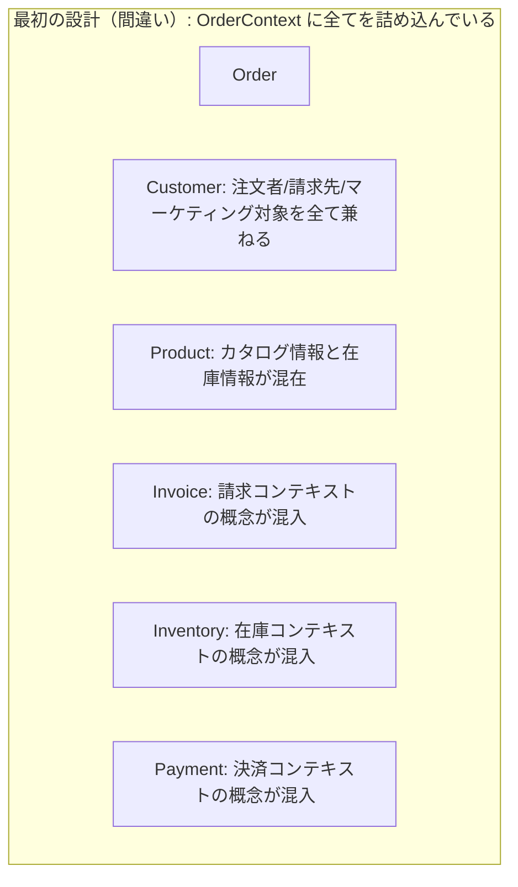
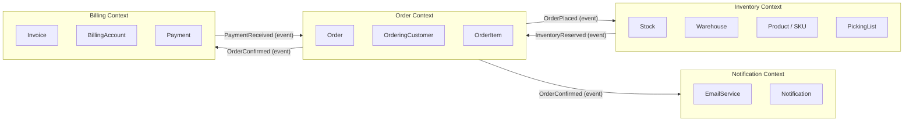
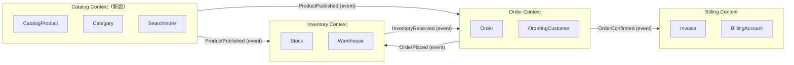

# 第4章: Bounded Context — ドメインモデルに「国境」を引く技術

> **対象読者**: ドメイン駆動設計の概念は把握しているが、実際の境界設計の判断に迷いがあるシニアエンジニア・アーキテクト
> **前提知識**: エンティティ・値オブジェクト・ドメインサービスの基礎概念（第1〜3章）

---

## 0. TL;DR（1分で掴む）

**Bounded Context（境界付けられたコンテキスト）** とは、「あるモデルが特定の意味を持つ、明確に定義されたコンテキストの境界」です。

3行でまとめると次のとおりです。

1. **同じ言葉でも、部署が違えば意味が違う**。「顧客（Customer）」は注文管理では「誰が買ったか」ですが、請求管理では「どこに請求するか」であり、在庫管理では一切登場しません。
2. **その意味の統一性を保証できる最小の境界**を Bounded Context と呼びます。境界を越えれば別のモデルになります。
3. **設計者の仕事は「境界を正しく引くこと」**であり、正しい境界は業務の変化率・チームの構造・整合性要件から導出されます。

---

## 1. なぜ Bounded Context が生まれたか

### 1.1 大規模システムで「モデルが腐敗する」とはどういう状態か

ドメイン駆動設計の文脈において「モデルの腐敗（Model Corruption）」とは、もともと特定の業務問題を正確に表現していたモデルが、時間の経過とともにその表現力を失い、複数の無関係な概念が混在した状態になることを指します。

腐敗の初期症状は微細です。最初は「このフィールド、ここでは使わないけど念のため持たせておこう」というような小さな妥協から始まります。次第に「この関数はAとBの両方のケースで使えるように、少し汎用的にしよう」という再利用の誘惑が生まれます。そして最終的には、1つのクラスに「注文処理時の顧客情報」「請求処理時の顧客情報」「マーケティング分析時の顧客属性」が混在し、いったいこのクラスが何を表しているのか誰も説明できなくなります。

腐敗が進んだコードベースには、次のようなパターンが現れます。

**null だらけのフィールド**: `Customer.InvoiceAddress` は注文コンテキストでは常にnullですが、フィールドが存在します。これは「請求コンテキストの都合でこのクラスが汚染された」証拠です。

**文脈依存の意味**: `Order.Status` が `"Approved"` の時、注文管理部門は「顧客が承認した」と解釈し、在庫管理部門は「ピッキング可能」と解釈し、経理部門は「請求可能」と解釈します。同じ値が3つの意味を持ちます。

**神クラス（God Class）**: あらゆるコンテキストの要求を満たすために肥大化した `Product` クラスが、在庫数・価格・カテゴリ・SEOキーワード・画像URL・仕入れ原価・税率・輸出規制コードを全て保有します。

**暗黙の前提**: 「このメソッドは注文処理からしか呼んではいけない」というコメントがクラス内に散見されますが、コードレベルでの制約はありません。

### 1.2 実際にあった設計崩壊の具体例（ECサイト）

架空の事例として、筆者が関わったEC企業のリプレースプロジェクトを参考にした例を示します。この企業では、10年にわたってモノリスのECシステムを運用していました。

最初の設計では `Customer` というクラスが次の属性を持っていました。

```csharp
// 2009年の初期設計 — 割と素直なモデル
class Customer {
    Guid Id;
    string Name;
    string Email;
    Address ShippingAddress;
}
```

ここまでは問題ありません。しかし3年後、請求機能が追加されました。

```csharp
// 2012年 — 請求機能追加後
class Customer {
    Guid Id;
    string Name;
    string Email;
    Address ShippingAddress;
    Address BillingAddress;      // 追加: 請求先住所（異なる場合がある）
    string TaxNumber;            // 追加: 法人顧客の場合の税番号
    bool IsCorporate;            // 追加: 法人フラグ
    CreditLimit CreditLimit;     // 追加: 後払い与信枠
}
```

さらに2年後、マーケティング部門がパーソナライゼーションを要求しました。

```csharp
// 2014年 — マーケティング要求追加後
class Customer {
    // ...前述の全フィールド...
    DateTime? BirthDate;         // 誕生日キャンペーン用
    string? Gender;              // ターゲティング広告用
    List<string> Interests;      // レコメンド用
    int LoyaltyPoints;           // ポイント残高
    MemberRank Rank;             // ゴールド・シルバー等
    DateTime LastPurchaseDate;   // 休眠顧客判定用
    double LifetimeValue;        // LTV
}
```

2019年には次のような状態になっていました。

```csharp
// 2019年 — 完全に腐敗したモデル
class Customer {
    Guid Id;
    string Name;
    string Email;
    Address ShippingAddress;
    Address? BillingAddress;
    string? TaxNumber;
    bool IsCorporate;
    CreditLimit? CreditLimit;    // 注文管理では参照しない
    DateTime? BirthDate;
    string? Gender;
    List<string> Interests;      // 在庫管理では参照しない
    int LoyaltyPoints;           // 注文キャンセル時の処理が複雑
    MemberRank Rank;
    DateTime LastPurchaseDate;
    double LifetimeValue;
    string? SupplierCode;        // 顧客が供給業者でもある場合（2016年追加）
    PaymentTerms? PaymentTerms;  // サプライヤーとしての支払条件（2016年追加）
    bool IsSupplier;
    string? PassportNumber;      // 海外配送の通関用（2018年追加）
    string Locale;
    string PreferredCurrency;
    string? InternalNote;        // CSチームの内部メモ（2019年追加）
    SupportTier SupportTier;     // サポートレベル
    bool IsBlacklisted;          // 不正注文の顧客フラグ
}
```

このクラスは「顧客」という名前を持っていますが、実際には注文者・請求先・マーケティング対象・供給業者・通関申告者・サポート対象という6つの概念が混在しています。

**崩壊の結果として何が起きたか**: 注文処理のバグ修正が請求処理に影響を与えました。マーケティング担当者がLTVの計算ロジックを変更したところ、与信枠の判定ロジックが壊れました。在庫管理チームが出荷重量の計算に `Customer` を利用していたため、顧客名の変更フローを修正した際に在庫システムが停止しました。これが「モデルの腐敗が引き起こす設計崩壊」の実態です。

### 1.3 Evansが2003年に発見した根本原因

Eric Evansは著書「Domain-Driven Design: Tackling Complexity in the Heart of Software」（2003年）において、この問題の根本原因を明確に言語化しました。

> 「大規模プロジェクトにおけるモデルが腐敗する根本的な原因は、単一のモデルが複数の文脈をまたいで使われることにある。文脈を明確にしないまま、モデルの一貫性を全体に対して維持しようとすることが、混乱と複雑さを生む。」

Evansが指摘した根本原因は「モデルは常に文脈の中で意味を持つ」という事実を無視した設計です。「顧客」という概念は、その言葉が使われる文脈によって意味が変わります。注文管理の文脈では「商品を購入しようとしている人」であり、在庫管理の文脈では「顧客」という概念自体が不要（在庫は顧客ではなく商品と倉庫に関係する）であり、請求管理の文脈では「代金を支払う義務を持つ法的主体」です。

Evansの洞察は「モデルの一貫性を全システムで保持しようとするな、文脈ごとに保持せよ」というものでした。これが Bounded Context という概念の誕生です。

---

## 2. Bounded Context の本質

### 2.1 「同じ言葉が違う意味を持つ場所」という定義の深い意味

Bounded Context の定義を一言で言えば「特定の意味が統一されたモデルが適用される境界」です。しかしこの定義の本当の深さは、「同じ言葉が違う意味を持つことが自然であり、それを無理に統一しようとすることが間違いである」という認識論的な転換にあります。

人間の組織において、同じ単語が部署によって異なる意味で使われることは珍しくありません。営業部門が「プロジェクト」と言えば「受注した案件」を指しますが、エンジニアリング部門が「プロジェクト」と言えば「GitHubリポジトリ」や「開発タスクの集合」を指すことがあります。これは混乱ではなく、各部門の業務に最適化された言語の自然な進化です。

Bounded Context は、この自然な言語の分化を設計に取り込みます。「Customerは全コンテキストで同じクラスを使うべき」という考え方を捨て、「注文コンテキストのCustomerと請求コンテキストのCustomerは別のクラスであって良い」と宣言するのです。

この転換がもたらす具体的な設計上のメリットは3つです。

**第一に、クラスが薄くなります**。各コンテキストの Customer は、そのコンテキストで本当に必要な属性だけを持ちます。注文コンテキストの `OrderingCustomer` は `Name`、`ShippingAddress`、`LoyaltyPoints` だけを持てばよく、税番号も誕生日も必要ありません。

**第二に、変更が局所化されます**。請求コンテキストで法人顧客への請求ルールが変わっても、注文コンテキストの Customer を変更する必要がありません。変更の波及範囲が境界内に留まります。

**第三に、チームが独立して動けます**。注文チームと請求チームは、共有クラスの変更について合意する必要がなくなります。各チームが自分のコンテキスト内で最適なモデルを進化させられます。

### 2.2 「Customer」が注文/在庫/請求で何が違うか

具体的に見ていきましょう。同じ「顧客」という概念が、3つのコンテキストでどのように異なるかを表に整理します。

| 観点 | 注文コンテキスト（OrderContext） | 在庫コンテキスト（InventoryContext） | 請求コンテキスト（BillingContext） |
|------|------|------|------|
| **クラス名** | `OrderingCustomer` | （概念なし） | `BillingAccount` |
| **識別子の意味** | 「この人が注文した」 | — | 「この法的主体に請求する」 |
| **名前** | 表示用の氏名（配送ラベル） | — | 正式法人名（領収書・契約書用） |
| **住所** | 配送先住所（複数持てる） | — | 請求先住所（1つ、変更に制約あり） |
| **状態管理** | アクティブ/休眠/退会 | — | 支払い済み/未払い/与信オーバー |
| **主な操作** | 注文を作る、住所を変える | — | 請求書を発行する、入金確認する |
| **ライフサイクル** | 会員登録から退会まで | — | 最初の取引から債権消滅まで |
| **重要な不変条件** | 注文中は住所変更不可 | — | 未払い請求がある間は与信枠変更不可 |
| **関連する集約** | Order（注文）と強い結合 | — | Invoice（請求書）と強い結合 |
| **整合性要件** | 注文と同一トランザクション | — | 請求サイクルとの整合性 |

在庫コンテキストに「Customer」が存在しないことに注目してください。在庫管理の業務は「どの商品がどの倉庫に何個あるか」という問いに答えるものであり、顧客という概念は本質的に無関係です。在庫コンテキストに Customer を持ち込もうとすること自体が、境界の引き方の間違いを示しています。

### 2.3 モデルの一貫性をどこまでの範囲で保証するか

Bounded Context の本質的な問いは「どこまでのモデルの一貫性を保証するか」です。

一貫性には2種類あります。**ローカル一貫性**はコンテキスト境界内での一貫性であり、**グローバル一貫性**はシステム全体での一貫性です。

DDDが主張するのは「グローバル一貫性を追求することは現実的でなく、有害でさえある」ということです。理由は単純で、グローバル一貫性を保証するためには全ての変更が一つのトランザクション内で完了する必要がありますが、それは分散システムでは達成不可能であり、モノリスでも結果的に神クラスと巨大トランザクションを生みます。

代わりに、各 Bounded Context は自身の境界内で厳密な一貫性を保証し、コンテキスト間は結果整合性（Eventual Consistency）で繋ぐというアプローチを取ります。これは妥協ではなく、業務の現実に即した設計です。

「注文が確定した瞬間に在庫数が減る」ことをリアルタイムで保証しようとすると、OrderContext と InventoryContext が同一トランザクションに縛られます。しかし実際の業務では、「注文確定後、数秒以内に在庫引当処理が完了すればよい」という要件である場合がほとんどです。この数秒間の「結果整合性」を受け入れることで、2つのコンテキストが独立して進化できます。

---

## 3. 境界の引き方 — 実践的な5つの判断基準

境界を正しく引くことは DDD における最も難しい設計判断の一つです。以下の5つの基準は、独立して使うのではなく、複数の基準が収束する場所に境界を引くという形で活用します。

### 3.1 言語の変化点

**判断の核心**: ドメインエキスパートが使う言葉の意味が変わる場所が、境界の候補です。

実践において最も重要で、かつ習得に時間がかかる判断基準が「言語の変化点を見つけること」です。ドメインエキスパートとの会話を注意深く観察していると、同じ言葉を使っているのに微妙に意味がずれている瞬間に気づきます。たとえば次のような会話のパターンです。

> 注文担当者: 「顧客がキャンセルしたとき、ポイントを戻す処理が必要です」
> 経理担当者: 「顧客がキャンセルしたとき、請求の取り消しと返金の処理が別々に必要です」

ここで「顧客」「キャンセル」という同じ言葉を使っていますが、注文担当者の「顧客」は「ポイントを持つ人」であり、経理担当者の「顧客」は「請求先の法的主体」です。「キャンセル」は注文担当者には「注文ステータスの変更」ですが、経理担当者には「請求書の取り消しと貸方票の発行」です。

この言語の乖離を発見するための実践的な手法は **ユビキタス言語の用語集（Glossary）** を作ることです。ドメインエキスパートと一緒に用語を定義していくと、必ず「その言葉、Aの人とBの人で意味が違いますよね？」という瞬間が来ます。その瞬間が境界の候補です。

具体的な検出パターンとして以下が挙げられます。

**修飾語が自然と付く**: 「顧客」について議論していると、自然と「注文顧客」「請求先顧客」「ポイント顧客」という修飾語が付き始めたら、それぞれが別のコンテキストに属している可能性があります。

**同じ概念の定義に矛盾が生じる**: 「商品の価格はいくらか？」という質問に対して、表示価格・原価・税抜き価格・税込み価格・会員価格・バンドル価格・輸出価格と、部署によって答えが異なる場合、「商品」という概念が複数のコンテキストにまたがっています。

**同一操作の意味が異なる**: 「商品を追加する」という操作が、マーケティング担当者には「ECサイトに掲載する」であり、倉庫担当者には「倉庫に在庫を受け入れる」であり、経理担当者には「勘定科目に登録する」である場合、3つのコンテキストが存在します。

言語の変化点が見つかったら、それをそのまま設計に反映します。「顧客という概念を統一しよう」と躊躇してはいけません。言語の変化は業務の実態を反映しており、それを無理に統一しようとすることがモデルの腐敗の始まりです。

アーキテクトとして言語の変化点を見つけるための実践的なアドバイスは「会議室で聞き役に徹する時間を作ること」です。異なる部署の担当者が同じ言葉について議論しているとき、その微妙なずれを観察することが最も効果的なインプットになります。なお、EventStorming（ドメインイベントを付箋に書き出し時系列に並べるワークショップ手法）は、この言語の変化点を可視化するための実践的な手法として広く普及しています。

### 3.2 変更の独立性

**判断の核心**: 「AをBと同時に変更しなければならない」理由が業務上の必然ではなく実装上の都合である場合、境界が間違っています。

変更の独立性とは「あるコンテキストの業務ロジックが変わっても、別のコンテキストに変更の波及が起きないこと」を指します。これは DDD の中でも特に重要な原則であり、マイクロサービスアーキテクチャとも深く関係します。

変更の独立性を評価するために「変更の理由（Reason for Change）」を問います。

```
Q: なぜこのクラスを変更するのか？
A1: 注文割引ロジックが変わったから → OrderContext に属する
A2: 請求の消費税計算が変わったから → BillingContext に属する
A3: A1とA2の両方の場合がある → そのクラスは2つのコンテキストにまたがっており、境界が間違っている
```

実際の変更の独立性を評価する方法として **変更履歴の分析** があります。過去6ヶ月のコミット履歴を見て、同じファイルが変更された理由を記録します。変更理由が複数の業務ドメインにまたがっているファイルは、境界の引き直しの候補です。

変更の独立性が低い（変更が連鎖する）状態には、次のような兆候があります。

**タコ足結合（Octopus Coupling）**: 1つのドメインクラスが変更されると、5つ以上の他クラスも変更が必要になります。変更の理由が「A部門の要求」なのに、変更の影響が「B部門・C部門・D部門」にも及びます。

**デッドロックする変更**: 注文チームが Customer を変更したいが、請求チームも同時期に Customer を変更したいため、調整に時間がかかります。これは共有モデルの問題であり、コンテキストを分離することで解決します。

**リグレッション地獄**: 注文処理の単体テストが、請求ロジックの変更で壊れます。テストの独立性がない状態は、コードの独立性もない状態の反映です。

変更の独立性を高めるための設計として、各コンテキストに独自のリポジトリインターフェースと永続化スキーマを与えることを推奨します。OrderContext の `order_customers` テーブルと BillingContext の `billing_accounts` テーブルは別テーブルとして管理し、データの同期はドメインイベントで行います。

### 3.3 チームの境界（コンウェイの法則）

**判断の核心**: システムの設計は、それを作る組織のコミュニケーション構造を反映します（コンウェイの法則）。チームの境界と BC の境界を一致させることで、摩擦を最小化できます。

メルビン・コンウェイが1968年に提唱した「コンウェイの法則」は DDD の Bounded Context 設計において極めて重要です。「システムの設計は、そのシステムを構築した組織のコミュニケーション構造を反映する」という経験則は、現代でも驚くほど正確です。

この法則を設計に活かす「逆コンウェイ戦略（Reverse Conway Maneuver）」という手法があります。「チームをシステムの設計に合わせる」のではなく「システムの設計をチームの境界に合わせる」という発想の転換です。

具体的には次のような問いを立てます。「もしこのコンテキストを独立したプロダクトとして開発・運用するチームを作るとしたら、何人で構成され、どのようなスキルセットを持つチームになるか？」

この問いに対して「それは1人のエンジニアが片手間でできる」という答えなら、コンテキストが小さすぎます。「それには10人以上が必要で、さらに他のコンテキストを担当するチームと常に協議が必要」という答えなら、コンテキストが大きすぎるか、境界が間違っています。

チームの境界を考える際の実践的なガイドラインとして、「ピザ2枚ルール（Two-Pizza Rule）」を参照することも有効です。Amazon が提唱したこのルールは「2枚のピザで食べられる規模のチーム（6〜8人）が1つのサービス（Bounded Context）を担当すべき」というものです。

ただし、チームの境界と BC の境界を完全に一致させることは理想論であり、現実には難しい場面もあります。特に立ち上げ期の小規模チームでは、1チームが複数の BC を担当することは珍しくありません。その場合でも「コードレベルでの境界」は明確に引いておくことで、後にチームを分割する際の移行コストを最小化できます。

チームの境界とシステムの境界がずれている場合に発生する問題として「フィーチャーチームの境界外変更」があります。Aチームが担当するコンテキストを、Bチームが機能追加のために変更する必要が生じた場合、調整コストが跳ね上がります。これが繰り返されると、チームはコンテキストの純粋性を諦め「どこでも変更していい」というカオスに落ちます。

### 3.4 整合性要件の違い

**判断の核心**: 「強い整合性（Strong Consistency）」が必要な範囲が BC の最大サイズを決定します。強い整合性の範囲が業務上の単位と一致するように境界を引きます。

整合性要件は Bounded Context の境界を決める最も厳密な基準の一つです。整合性には次の2種類があります。

**強い整合性（Strong Consistency / ACID）**: 複数の操作が一つのトランザクションとして完了し、中途状態が外部から観測されない。典型的にはデータベースのトランザクションで実現します。

**結果整合性（Eventual Consistency）**: 一時的な不整合を許容し、最終的に整合状態に収束することを保証します。分散システムや非同期処理で一般的に使われます。

Bounded Context の設計における原則は「強い整合性が必要な範囲が BC の内側に収まるように境界を引く」です。

たとえばECサイトにおいて、次のトランザクション要件があるとします。

- 注文確定時に「注文の作成」「在庫の引当」「ポイントの付与」を同時に行う必要がある

もしこの3つを強い整合性（同一トランザクション）で保証しようとすると、注文・在庫・ポイントが同一 BC に属する必要があります。しかしこれはモデルの大きさとしては一般的に大きすぎます。業務要件をより詳細に聞くと「注文確定時に在庫引当が失敗した場合、注文は確定しない（強い整合性が必要）」「ポイント付与は注文確定から30秒以内に完了すればよい（結果整合性で可）」という要件であることが多いです。

整合性要件の違いを見つけるための実践的な質問があります。「もし処理の途中でシステムが落ちたら、どの状態が業務上許容できますか？」という問いです。「在庫が引いてあるのに注文が作られていない状態はまずい」という答えが返れば強い整合性が必要な組み合わせです。「ポイントが付与されていない状態は5分以内に自動リトライで解決できる」という答えが返れば結果整合性で対応できます。

### 3.5 デプロイの独立性

**判断の核心**: 「AをリリースするためにBも同時にリリースしなければならない」という状況は、デプロイの結合を示しています。独立してデプロイできない BC は、独立した BC として機能していません。

デプロイの独立性は Bounded Context の設計が正しく機能しているかを評価するための「結果指標」であり、境界を引く際の「先行指標」でもあります。

正しく設計された Bounded Context は、他のコンテキストへの影響なしに独立してデプロイできます。これが実現できていない場合、次のいずれかの問題があります。

**共有ライブラリ問題**: OrderContext と InventoryContext が同じ `SharedModels` ライブラリを使っており、そのライブラリのバージョンアップに両者が同時に対応する必要がある状態。解決策は、コンテキスト間でのコード共有を最小化し、それぞれが自律的なモデルを持つことです。

**同期 API 強依存**: OrderContext が InventoryContext の REST API を同期的に呼び出しており、InventoryContext が止まると OrderContext も止まる状態。解決策は非同期メッセージングによるデカップリングです。

**共有データベーステーブル**: OrderContext と InventoryContext が同じ `products` テーブルを直接参照しており、テーブルのスキーマ変更に両者が同時に対応する必要がある状態。解決策はコンテキストごとにデータストレージを分離することです。

デプロイの独立性を評価するための実践的な指標として、デプロイ依存グラフを描くことを推奨します。「AをリリースするためにBのリリースが必要か？」を全コンテキストの組み合わせで評価し、循環依存や強結合のチェーンがあれば境界の見直しを検討します。

デプロイの独立性を実現するための設計パターンとして、**Consumer-Driven Contract Testing（消費者駆動契約テスト）** があります。コンテキスト間の統合イベントのスキーマを「契約」として明示し、各コンテキストが契約に基づいたテストを自動実行することで、デプロイ時の破壊的変更を事前に検出できます。これにより、コンテキストを独立してデプロイしながらも、契約の互換性を保証できます。

デプロイの独立性を阻害するもう一つの一般的なパターンとして「デプロイ時の同期的な初期化依存」があります。OrderContext が起動時に InventoryContext の REST API に問い合わせてデータを初期化するような設計では、InventoryContext が先にデプロイされていないと OrderContext が起動できません。この問題は、コンテキストが起動時に他のコンテキストに依存しないよう、起動シーケンスを設計することで解決します。具体的には「コンテキストは不完全な状態で起動し、必要なデータが揃い次第フル稼働に移行する」というアプローチが有効です。

**5つの判断基準の総括**: これら5つの基準を使いこなすには、実際のドメインエキスパートへのインタビューと、過去の変更履歴の分析と、現在のチーム構成の観察という3つのインプットが必要です。どれか1つの基準だけで境界を決めるのではなく、複数の基準が同じ場所に収束するときに、その場所に境界を引くことが信頼性の高い設計につながります。また、5つの基準すべてが揃わなくても境界を仮置きして始めることが重要です。完璧な境界を待っていると、何も設計が始まりません。境界は後から動かせます。

---

## 4. ECサイトの設計例 — 境界を引く全工程

### 4.1 ドメイン専門家との会話のログ（対話形式）

以下は、ECサイトの Bounded Context 設計を行うにあたり、ドメインエキスパートとアーキテクトが行った会話のシミュレーションです。

---

**アーキテクト**: 「注文が入ってから商品が発送されるまでの流れを教えていただけますか？」

**注文担当者（Aさん）**: 「まず、お客さんがカートに商品を入れて注文ボタンを押します。そのとき在庫を確認して、あれば注文を確定します。確定したらお客さんにメールを送って、ウェアハウスに出荷依頼を出します。」

**アーキテクト**: 「"在庫を確認して"というのは、誰がどのシステムで確認するんですか？」

**注文担当者（Aさん）**: 「それはウェアハウスチームが管理しているシステムですね。私たちはそちらに問い合わせます。」

**アーキテクト**: 「ウェアハウスの方にも伺えますか？在庫確認の仕組みを教えてください。」

**ウェアハウス担当者（Bさん）**: 「私たちは棚番と数量で管理しています。注文が来たら、どの棚のどのロットから引くかを決めてピッキングリストを作ります。注文のことは知りませんよ。誰が注文したかとか、そういう情報は関係なくて、商品コードと数量だけわかればいいです。」

**アーキテクト**（メモを取りながら）: 「面白いですね。Bさんにとって"顧客"という概念は重要ですか？」

**ウェアハウス担当者（Bさん）**: 「全然重要じゃないです。配送先の住所は出荷ラベルに必要ですけど、それは配送サービスに渡すだけで、私たちの業務に顧客情報は関係ないです。商品がどこから来てどこへ行くかだけが問題です。」

**アーキテクト**: 「では経理の方に伺います。注文が確定した後、経理での処理はどうなりますか？」

**経理担当者（Cさん）**: 「注文確定の通知が来たら、請求書を作ります。ただし、法人顧客の場合は月締めの請求書をまとめて発行するので、注文確定のタイミングとは別です。個人顧客は注文ごとに決済完了した時点で売上計上です。」

**アーキテクト**: 「"法人顧客"と"個人顧客"は、注文システムでも区別していますか？」

**注文担当者（Aさん）**: 「しています。でも注文システムで法人かどうかを判断するのは、月締め後払いの場合だけで、普通のクレジットカード払いの法人は個人と同じ扱いです。」

**経理担当者（Cさん）**: 「それは困ります。うちでは法人番号で管理していて、個人扱いにされると経理処理が面倒になります。」

---

この会話から、次の洞察が得られます。

1. **注文コンテキスト**と**在庫コンテキスト**は明確に分離できます。在庫担当者は「顧客」という概念を使いません。
2. **注文コンテキスト**と**請求コンテキスト**では、「顧客」の法人/個人区別が異なる粒度で重要です。
3. **請求コンテキスト**には「月締め」というビジネスルールがあり、注文の確定タイミングとは切り離した処理が必要です。

### 4.2 Event Storming で発見したイベント一覧

ドメインエキスパートとのワークショップで Event Storming を実施した結果、以下のドメインイベントが発見されました。

| イベント名 | 発生源 | 受信者 |
|------|------|------|
| `OrderPlaced`（注文作成） | 注文 | 在庫・請求・通知 |
| `InventoryReserved`（在庫引当） | 在庫 | 注文 |
| `InventoryReservationFailed`（在庫引当失敗） | 在庫 | 注文 |
| `OrderConfirmed`（注文確定） | 注文 | 在庫・請求・通知 |
| `OrderCancelled`（注文キャンセル） | 注文 | 在庫・請求 |
| `PickingListCreated`（ピッキングリスト作成） | 在庫 | 倉庫作業員 |
| `ShipmentDispatched`（出荷完了） | 在庫（配送） | 注文・通知 |
| `InvoiceCreated`（請求書作成） | 請求 | 経理・顧客 |
| `PaymentReceived`（入金確認） | 請求 | 注文 |
| `RefundProcessed`（返金処理） | 請求 | 注文 |

### 4.3 最初の間違った境界の引き方

最初のアーキテクチャ提案では、次のような境界を引きました。



この設計の問題点は次のとおりです。

- `Invoice`（請求書）と `Inventory`（在庫）が Order と同じコンテキストにあり、経理チームとウェアハウスチームが注文チームのコードを変更する必要があります
- `Product` が注文コンテキストにあると、在庫のカタログ情報（SKU・寸法・重量）と注文の商品情報（価格・画像・説明）が混在します
- 結果として神クラスと同じ問題が再発します

### 4.4 修正後の正しい境界

ドメインエキスパートとの追加セッションと Event Storming の結果を踏まえ、次の境界を導出しました。



この境界設計の根拠は次のとおりです。

- **OrderContext**: 顧客の意図（何を買うか）と注文の状態管理に集中します
- **InventoryContext**: 物理的な商品と在庫数管理に集中します。「顧客」は一切登場しません
- **BillingContext**: 金銭の授受に集中します。顧客は「BillingAccount（請求先）」として法的義務の視点で表現されます
- **NotificationContext**: 通知の送信に集中します。業務ロジックを持ちません

### 4.5 最終的な境界図（リファクタリング後）

実装後3ヶ月で「商品検索・表示」という横断的な要件が発生し、境界を再調整しました。



Catalog Context を分離したことで、商品情報の管理（商品名・画像・カテゴリ・検索インデックス）が注文処理や在庫管理から独立しました。ECサイトではこの4コンテキスト構成が多くのケースで適切な出発点となります。

---

## 5. Bounded Context 内部の設計

### 5.1 Ubiquitous Language との関係

Bounded Context と Ubiquitous Language（ユビキタス言語）は表裏一体の関係にあります。Ubiquitous Language とは「コンテキスト内で、エンジニアとドメインエキスパートが共有する言語」であり、その言語が通じる範囲が Bounded Context の境界を定義します。

重要なのは「Ubiquitous は『あらゆる場所で』という意味だが、それはコンテキスト内部でのみ通用するということを忘れてはならない」という点です。OrderContext 内では `OrderingCustomer` という言葉が通じますが、BillingContext では通じません。

コンテキスト内の Ubiquitous Language を維持する実践的な手法として、コードのクラス名・メソッド名・変数名を、ドメインエキスパートが使う言葉と完全に一致させることを徹底します。エンジニアが「`UserRecord`」と呼ぶものをドメインエキスパートが「注文者」と呼ぶなら、コードのクラス名も `OrderingCustomer` にします。この一致が崩れたとき、コードとドメインの乖離が始まります。

### 5.2 同一コンテキスト内のサブモジュール

Bounded Context の内部も、成長するにつれてサブ構造が必要になります。これはサブドメインの概念と対応します。OrderContext を例にとると、次のようなサブモジュール（名前空間）に分割することができます。

```
OrderContext/
├── Cart/               # カート管理（注文前の状態）
│   ├── Cart.cs
│   ├── CartItem.cs
│   └── CartService.cs
├── Ordering/           # 注文処理（注文確定のフロー）
│   ├── Order.cs
│   ├── OrderItem.cs
│   └── OrderingService.cs
├── Discounts/          # 割引計算（ドメインサービス）
│   ├── DiscountPolicy.cs
│   └── DiscountCalculator.cs
└── Shared/             # コンテキスト内共有の値オブジェクト等
    ├── Money.cs
    └── OrderingCustomer.cs
```

このサブモジュールは Bounded Context の外部からは見えない内部構造です。他のコンテキストは OrderContext の公開インターフェース（API・統合イベント）とのみやり取りします。

### 5.3 コンテキスト内でのレイヤー構成

Bounded Context の内部は、クリーンアーキテクチャのレイヤー構成に従います。

```
OrderContext/
├── Domain/                    # ドメイン層（最内部 — フレームワーク非依存）
│   ├── Entities/
│   │   ├── Order.cs
│   │   └── OrderItem.cs
│   ├── ValueObjects/
│   │   ├── Money.cs
│   │   └── OrderStatus.cs
│   ├── Events/                # ドメインイベント（コンテキスト内通知）
│   │   ├── OrderPlacedEvent.cs
│   │   └── OrderConfirmedEvent.cs
│   └── Repositories/          # リポジトリインターフェース定義
│       └── IOrderRepository.cs
├── Application/               # アプリケーション層（ユースケース）
│   ├── UseCases/
│   │   ├── PlaceOrderUseCase.cs
│   │   └── CancelOrderUseCase.cs
│   └── Ports/                 # 外部コンテキストとの境界インターフェース
│       └── IInventoryReservationService.cs
├── Infrastructure/            # インフラ層（フレームワーク・DB依存）
│   ├── Persistence/
│   │   └── OrderRepository.cs
│   └── Messaging/
│       └── OrderIntegrationEventPublisher.cs
└── Api/                       # インターフェース層（HTTP等）
    └── OrderController.cs
```

---

## 6. C# での実装パターン（完全なコード）

### 6.1 プロジェクト構成（.NET 9 ソリューション）

```
EcSite.sln
├── src/
│   ├── OrderContext/
│   │   ├── OrderContext.Domain/
│   │   ├── OrderContext.Application/
│   │   ├── OrderContext.Infrastructure/
│   │   └── OrderContext.Api/
│   ├── InventoryContext/
│   │   ├── InventoryContext.Domain/
│   │   ├── InventoryContext.Application/
│   │   ├── InventoryContext.Infrastructure/
│   │   └── InventoryContext.Api/
│   ├── BillingContext/
│   │   ├── BillingContext.Domain/
│   │   ├── BillingContext.Application/
│   │   └── BillingContext.Infrastructure/
│   └── SharedKernel/
│       └── SharedKernel/     # 統合イベント基底クラス・共通値オブジェクト型のみ
└── tests/
    ├── OrderContext.Tests/
    ├── InventoryContext.Tests/
    └── BillingContext.Tests/
```

### 6.2 OrderContext: Order と OrderingCustomer の完全実装

```csharp
// OrderContext.Domain/Entities/Order.cs
namespace OrderContext.Domain.Entities;

public sealed class Order
{
    public OrderId Id { get; private set; }
    public OrderingCustomer Customer { get; private set; }
    public IReadOnlyList<OrderItem> Items => _items.AsReadOnly();
    public OrderStatus Status { get; private set; }
    public Money TotalAmount { get; private set; }
    public DateTimeOffset PlacedAt { get; private set; }

    private readonly List<OrderItem> _items = [];
    private readonly List<IDomainEvent> _domainEvents = [];

    private Order() { }

    // ファクトリメソッドで生成する — コンストラクタは外部公開しない
    public static Result<Order> Place(
        OrderingCustomer customer,
        IEnumerable<OrderLineRequest> lines,
        IDiscountPolicy discountPolicy)
    {
        if (!lines.Any())
            return Result.Failure<Order>("注文には最低1商品が必要です");

        var order = new Order
        {
            Id = OrderId.NewId(),
            Customer = customer,
            Status = OrderStatus.Pending,
            PlacedAt = DateTimeOffset.UtcNow
        };

        foreach (var line in lines)
        {
            var item = OrderItem.Create(line.ProductId, line.Quantity, line.UnitPrice);
            order._items.Add(item);
        }

        var gross = order._items.Aggregate(Money.Zero, (acc, i) => acc + i.SubTotal);
        var discount = discountPolicy.Calculate(customer, order._items);
        order.TotalAmount = gross - discount;

        // ドメインイベントをキューに追加（コンテキスト内部通知）
        order._domainEvents.Add(new OrderPlacedEvent(order.Id, customer.Id, order.TotalAmount));

        return Result.Success(order);
    }

    public Result Confirm(InventoryReservationId reservationId)
    {
        if (Status != OrderStatus.Pending)
            return Result.Failure($"注文確定できない状態です: {Status}");

        Status = OrderStatus.Confirmed;
        _domainEvents.Add(new OrderConfirmedEvent(Id, reservationId));

        return Result.Success();
    }

    public Result Cancel(CancellationReason reason)
    {
        if (Status == OrderStatus.Shipped)
            return Result.Failure("出荷済みの注文はキャンセルできません");

        Status = OrderStatus.Cancelled;
        _domainEvents.Add(new OrderCancelledEvent(Id, reason));

        return Result.Success();
    }

    public IReadOnlyList<IDomainEvent> DomainEvents => _domainEvents.AsReadOnly();
    public void ClearDomainEvents() => _domainEvents.Clear();
}
```

```csharp
// OrderContext.Domain/ValueObjects/OrderingCustomer.cs
namespace OrderContext.Domain.ValueObjects;

/// <summary>
/// 注文コンテキストにおける「顧客」の表現。
/// 「誰が注文したか」と「どこへ届けるか」に特化している。
/// BillingContext の BillingAccount とは完全に別のモデル。
/// 税番号・与信枠・月締め情報は存在しない。
/// </summary>
public sealed record OrderingCustomer
{
    public CustomerId Id { get; init; }
    public PersonName Name { get; init; }
    public EmailAddress Email { get; init; }
    public ShippingAddress DefaultShippingAddress { get; init; }
    public int LoyaltyPoints { get; init; }

    // 注文コンテキストで意味を持つ業務ルール
    public bool IsEligibleForExpressShipping =>
        LoyaltyPoints >= 1000;

    private OrderingCustomer() { }

    public static OrderingCustomer Reconstitute(
        CustomerId id,
        PersonName name,
        EmailAddress email,
        ShippingAddress defaultAddress,
        int loyaltyPoints)
    {
        return new OrderingCustomer
        {
            Id = id,
            Name = name,
            Email = email,
            DefaultShippingAddress = defaultAddress,
            LoyaltyPoints = loyaltyPoints
        };
    }
}
```

```csharp
// OrderContext.Domain/Events/OrderEvents.cs
namespace OrderContext.Domain.Events;

// ドメインイベント — OrderContext の内部通知
public sealed record OrderPlacedEvent(
    OrderId OrderId,
    CustomerId CustomerId,
    Money TotalAmount) : IDomainEvent
{
    public DateTimeOffset OccurredAt { get; } = DateTimeOffset.UtcNow;
}

public sealed record OrderConfirmedEvent(
    OrderId OrderId,
    InventoryReservationId ReservationId) : IDomainEvent
{
    public DateTimeOffset OccurredAt { get; } = DateTimeOffset.UtcNow;
}
```

```csharp
// SharedKernel/IntegrationEvents/OrderIntegrationEvents.cs
// 統合イベント — コンテキスト間の「契約」として SharedKernel に定義
// プリミティブ型のみ使用（コンテキスト固有の型は一切入れない）
namespace SharedKernel.IntegrationEvents;

public sealed record OrderPlacedIntegrationEvent(
    Guid OrderId,
    Guid CustomerId,
    decimal TotalAmount,
    string Currency,
    IReadOnlyList<OrderedItemDto> Items,
    DateTimeOffset PlacedAt) : IntegrationEvent;

public sealed record OrderConfirmedIntegrationEvent(
    Guid OrderId,
    Guid CustomerId,
    decimal TotalAmount,
    string Currency,
    DateTimeOffset ConfirmedAt) : IntegrationEvent;

public sealed record OrderedItemDto(
    Guid ProductId,
    int Quantity,
    decimal UnitPrice);
```

### 6.3 InventoryContext: Stock と Warehouse の完全実装

```csharp
// InventoryContext.Domain/Entities/Stock.cs
namespace InventoryContext.Domain.Entities;

/// <summary>
/// 在庫コンテキストにおける在庫エンティティ。
/// 「どの商品が、どの倉庫に、何個あるか」を管理する。
/// 注文情報・顧客情報は一切持たない。
/// Customer という概念はこのコンテキストに存在しない。
/// </summary>
public sealed class Stock
{
    public StockId Id { get; private set; }
    public StockKeepingUnit Sku { get; private set; }
    public WarehouseId WarehouseId { get; private set; }
    public Quantity AvailableQuantity { get; private set; }
    public Quantity ReservedQuantity { get; private set; }

    private readonly List<IDomainEvent> _domainEvents = [];

    public Quantity PhysicalQuantity => AvailableQuantity + ReservedQuantity;

    private Stock() { }

    public static Stock Receive(
        StockKeepingUnit sku,
        WarehouseId warehouseId,
        Quantity quantity)
    {
        if (quantity.Value <= 0)
            throw new DomainException("受入数量は0より大きい必要があります");

        return new Stock
        {
            Id = StockId.NewId(),
            Sku = sku,
            WarehouseId = warehouseId,
            AvailableQuantity = quantity,
            ReservedQuantity = Quantity.Zero
        };
    }

    public Result<InventoryReservation> Reserve(
        Quantity requestedQuantity,
        ReservationReference reference)
    {
        if (requestedQuantity.Value > AvailableQuantity.Value)
            return Result.Failure<InventoryReservation>(
                $"在庫不足: 要求={requestedQuantity}, 利用可能={AvailableQuantity}");

        AvailableQuantity = new Quantity(AvailableQuantity.Value - requestedQuantity.Value);
        ReservedQuantity = new Quantity(ReservedQuantity.Value + requestedQuantity.Value);

        var reservation = InventoryReservation.Create(Id, requestedQuantity, reference);
        _domainEvents.Add(new InventoryReservedEvent(Id, Sku, requestedQuantity, reservation.Id));

        return Result.Success(reservation);
    }

    public Result Release(InventoryReservationId reservationId, Quantity quantity)
    {
        // キャンセル時の引当解放
        ReservedQuantity = new Quantity(ReservedQuantity.Value - quantity.Value);
        AvailableQuantity = new Quantity(AvailableQuantity.Value + quantity.Value);
        _domainEvents.Add(new InventoryReleasedEvent(Id, reservationId));

        return Result.Success();
    }

    public IReadOnlyList<IDomainEvent> DomainEvents => _domainEvents.AsReadOnly();
    public void ClearDomainEvents() => _domainEvents.Clear();
}
```

```csharp
// InventoryContext.Application/UseCases/ReserveInventoryUseCase.cs
namespace InventoryContext.Application.UseCases;

/// <summary>
/// OrderPlacedIntegrationEvent を受け取り、在庫を引き当てるユースケース。
/// 注文コンテキストのことは知らない。イベントのデータだけを扱う。
/// </summary>
public sealed class ReserveInventoryUseCase(
    IStockRepository stockRepository,
    IIntegrationEventPublisher eventPublisher)
{
    public async Task HandleAsync(
        OrderPlacedIntegrationEvent @event,
        CancellationToken ct = default)
    {
        foreach (var item in @event.Items)
        {
            var sku = new StockKeepingUnit(item.ProductId.ToString());
            var stock = await stockRepository.FindAvailableAsync(sku, ct);

            if (stock is null)
            {
                await eventPublisher.PublishAsync(
                    new InventoryReservationFailedIntegrationEvent(
                        @event.OrderId, item.ProductId, "商品が見つかりません"), ct);
                return;
            }

            var result = stock.Reserve(
                new Quantity(item.Quantity),
                new ReservationReference(@event.OrderId.ToString()));

            if (result.IsFailure)
            {
                await eventPublisher.PublishAsync(
                    new InventoryReservationFailedIntegrationEvent(
                        @event.OrderId, item.ProductId, result.Error), ct);
                return;
            }

            await stockRepository.SaveAsync(stock, ct);
        }

        await eventPublisher.PublishAsync(
            new InventoryReservedIntegrationEvent(
                @event.OrderId, Guid.NewGuid()), ct);
    }
}
```

### 6.4 両コンテキストが同じ「顧客」を別モデルで表現する例

```csharp
// 注文コンテキストの顧客表現（配送・ポイントに特化）
// OrderContext.Domain/ValueObjects/OrderingCustomer.cs
public sealed record OrderingCustomer
{
    public CustomerId Id { get; init; }
    public PersonName DisplayName { get; init; }         // 配送ラベル用の表示名
    public ShippingAddress DefaultShippingAddress { get; init; }
    public int LoyaltyPoints { get; init; }
    // 税番号・与信枠・月締め情報: 存在しない（このコンテキストに不要）
}

// 請求コンテキストの顧客表現（法的・財務的側面に特化）
// BillingContext.Domain/Entities/BillingAccount.cs
public sealed class BillingAccount
{
    public BillingAccountId Id { get; private set; }
    // CustomerId はIDとしてのみ保持。OrderingCustomerエンティティは持たない
    public CustomerId CustomerId { get; private set; }
    public LegalName LegalName { get; private set; }           // 法人の正式名称（領収書・契約書用）
    public TaxIdentificationNumber? TaxNumber { get; private set; }
    public BillingAddress BillingAddress { get; private set; }
    public CreditLimit CreditLimit { get; private set; }
    public PaymentTerms PaymentTerms { get; private set; }
    public AccountStatus Status { get; private set; }
    public DayOfMonth? MonthlyBillingDay { get; private set; } // 月締め請求の締め日

    // 請求コンテキスト固有のビジネスルール
    public bool CanReceiveInvoice(Money amount) =>
        Status == AccountStatus.Active &&
        CreditLimit.Allows(amount);

    // LoyaltyPoints・配送先住所: 存在しない（このコンテキストに不要）
}
```

2つのクラスは `CustomerId`（値オブジェクト、Guid のラッパー）という識別子だけを共有します。これにより、注文コンテキストと請求コンテキストの Customer を同期するための「ドメインイベント翻訳」が明確に定義できます。

### 6.5 統合イベント（Integration Event）でコンテキスト間を繋ぐ

```csharp
// SharedKernel/IntegrationEvents/InventoryIntegrationEvents.cs
namespace SharedKernel.IntegrationEvents;

public sealed record InventoryReservedIntegrationEvent(
    Guid OrderId,
    Guid ReservationId) : IntegrationEvent;

public sealed record InventoryReservationFailedIntegrationEvent(
    Guid OrderId,
    Guid ProductId,
    string Reason) : IntegrationEvent;

// SharedKernel/IntegrationEvents/BillingIntegrationEvents.cs
public sealed record InvoiceCreatedIntegrationEvent(
    Guid InvoiceId,
    Guid OrderId,
    Guid CustomerId,
    decimal Amount,
    string Currency,
    DateTimeOffset DueDate) : IntegrationEvent;
```

```csharp
// OrderContext.Infrastructure/Messaging/InventoryIntegrationEventConsumer.cs
// OrderContext が InventoryContext の統合イベントを受け取り、注文状態を更新する

public sealed class InventoryIntegrationEventConsumer(
    IOrderRepository orderRepository,
    IIntegrationEventPublisher eventPublisher) :
    IIntegrationEventHandler<InventoryReservedIntegrationEvent>,
    IIntegrationEventHandler<InventoryReservationFailedIntegrationEvent>
{
    public async Task HandleAsync(
        InventoryReservedIntegrationEvent @event,
        CancellationToken ct = default)
    {
        var order = await orderRepository.GetByIdAsync(new OrderId(@event.OrderId), ct);
        if (order is null) return;

        var result = order.Confirm(new InventoryReservationId(@event.ReservationId));
        if (result.IsSuccess)
            await orderRepository.SaveAsync(order, ct);
    }

    public async Task HandleAsync(
        InventoryReservationFailedIntegrationEvent @event,
        CancellationToken ct = default)
    {
        var order = await orderRepository.GetByIdAsync(new OrderId(@event.OrderId), ct);
        if (order is null) return;

        order.Cancel(CancellationReason.InsufficientInventory);
        await orderRepository.SaveAsync(order, ct);
    }
}
```

---

## 7. よくある設計ミス TOP7

### ミス1: 1つの Entity を複数コンテキストで共有する

**Before（問題あり）**:

```csharp
// 共有ライブラリ SharedModels に定義（アンチパターン）
// OrderContext と BillingContext が同じクラスを共有している
public class SharedCustomer
{
    public Guid Id { get; set; }
    public string Name { get; set; }
    public string ShippingAddress { get; set; }
    public string BillingAddress { get; set; }  // Orderでは常にnull
    public string TaxNumber { get; set; }       // Orderでは常にnull
    public int LoyaltyPoints { get; set; }      // Billingでは参照しない
    public decimal CreditLimit { get; set; }    // Orderでは参照しない
}

// OrderContext から使用 — BillingフィールドがnullでOrderContextを汚染
var customer = await sharedCustomerRepo.GetAsync(customerId);
order.SetCustomer(customer);

// BillingContext から使用 — LoyaltyPointsが無意味に入り込む
var customer = await sharedCustomerRepo.GetAsync(customerId);
invoice.SetBillingAccount(customer);
```

**After（正しい設計）**:

```csharp
// OrderContext 独自のモデル — 必要な属性だけを持つ
public sealed record OrderingCustomer(
    CustomerId Id,
    PersonName Name,
    ShippingAddress DefaultAddress,
    int LoyaltyPoints);

// BillingContext 独自のモデル — 必要な属性だけを持つ
public sealed class BillingAccount
{
    public BillingAccountId Id { get; }
    public CustomerId CustomerId { get; }   // IDのみ（OrderingCustomerへの依存なし）
    public LegalName LegalName { get; }
    public TaxIdentificationNumber? TaxNumber { get; }
    public CreditLimit CreditLimit { get; }
}
// 2コンテキスト間で共有するのは CustomerId の型（値オブジェクト）のみ
```

### ミス2: 境界が大きすぎる（全部入りコンテキスト）

**Before**: 1つの Context にあらゆる概念を詰め込んでいます。

```csharp
namespace EcSite.Domain  // コンテキスト名が曖昧 — 全社的なドメインとして扱っている
{
    class Order { }
    class Customer { }
    class Product { }
    class Inventory { }  // 在庫の概念が注文コンテキストに侵入
    class Invoice { }    // 請求の概念が混入
    class Payment { }    // 決済の概念が混入
    class Shipping { }   // 配送の概念が混入
    class Marketing { }  // マーケティングの概念が混入
}
```

**After**: 変更の独立性と言語の変化点で分割します。

```csharp
namespace OrderContext.Domain    { class Order { }   class OrderItem { } }
namespace InventoryContext.Domain{ class Stock { }   class Warehouse { } }
namespace CatalogContext.Domain  { class Product { } class Category { }  }
namespace BillingContext.Domain  { class Invoice { } class Payment { }   }
```

### ミス3: 境界が小さすぎる（1Entity = 1Context）

**Before**: 過剰な分割で統合コストが跳ね上がります。

```csharp
// Order と OrderItem を別コンテキストに分けてしまっている
namespace OrderContext { class Order { Guid Id; List<Guid> OrderItemIds; } }
namespace OrderItemContext { class OrderItem { Guid Id; Guid OrderId; } }
// → Order集約の内部操作が全てコンテキスト間通信になり、トランザクション設計が崩壊する
```

**After**: 強い整合性が必要な範囲を1つのコンテキストにまとめます。

```csharp
// Order と OrderItem は同一集約、同一コンテキストに属する
namespace OrderContext.Domain
{
    class Order
    {
        OrderId Id { get; }
        IReadOnlyList<OrderItem> Items { get; }  // 集約の境界内で管理
        Money TotalAmount { get; }
    }
    class OrderItem { }  // Order集約の一部 — 独立したContextにする必要はない
}
```

### ミス4: DBテーブルを境界にする

**Before**: テーブル設計からコンテキストを導出する（データ中心設計の誤り）。

```csharp
// "orders テーブルがあるから OrderContext" という発想
// "customers テーブルがあるから CustomerContext" という発想
namespace CustomerContext { class Customer { } }
// → 業務の言語ではなく、物理的なテーブルが境界の根拠になっている
// → テーブルを追加するたびにContextが増え、業務の文脈が失われる
```

**After**: 業務の言語と変更理由から境界を導出し、テーブルはその結果として設計します。

```csharp
// 業務の言語から: "注文者"と"請求先"は別の概念
namespace OrderContext.Domain   { class OrderingCustomer { } }  // order_customers テーブル
namespace BillingContext.Domain { class BillingAccount { }   }  // billing_accounts テーブル
// テーブルの数や名前がコンテキストの境界を決めるのではなく、業務の言語が決める
```

### ミス5: 組織図を境界にする

**Before**: 組織の部署とコンテキストを1対1で対応させています。

```csharp
// 「営業部があるから SalesContext」という発想
namespace SalesDepartmentContext { }      // 組織構造に依存した境界
namespace AccountingDepartmentContext { } // 部門名そのままをContext名にしている
// → 組織が改編されると境界も変わる → 組織変更のたびにシステムを改修する悪循環
```

**After**: 業務の関心事（Concern）とユビキタス言語を基準にします。

```csharp
// 組織が再編されても、注文・在庫・請求という業務の関心事は変わらない
namespace OrderContext { }     // 注文という行為に関する境界
namespace InventoryContext { } // 在庫という資産に関する境界
namespace BillingContext { }   // 金銭の授受に関する境界
```

### ミス6: 技術レイヤーを境界にする

**Before**: 「APIレイヤー」「データベースレイヤー」をコンテキストと混同しています。

```csharp
namespace ApiContext { }        // 技術的関心事はContextではない
namespace DatabaseContext { }   // DBアクセスは全てのContextの実装詳細
namespace CacheContext { }      // キャッシュも同様
// → "OrderContextのAPIレイヤー"と"OrderContextのDBレイヤー"を別Contextにすると
// → 注文という業務の一貫性がレイヤーをまたいで管理不能になる
```

**After**: Bounded Context は業務の関心事の単位であり、技術レイヤーはその実装詳細です。

```csharp
namespace OrderContext.Api             { }  // 技術レイヤーはContextの内側
namespace OrderContext.Application     { }
namespace OrderContext.Domain          { }  // 業務知識はここに集中する
namespace OrderContext.Infrastructure  { }  // DB・外部APIはここに封じ込める
// OrderContext は1つのビジネスの関心事 — APIもDBも内側に持つ
```

### ミス7: 境界を固定して再設計しない

**Before**: 最初に引いた境界を「設計済み」として変更しません。

```csharp
// 2年前の設計
// ProductContext が「カタログ情報」と「在庫情報」を両方持っていた
namespace ProductContext.Domain
{
    class Product
    {
        string Name;        // カタログ情報
        string ImageUrl;    // カタログ情報
        int StockCount;     // 在庫情報 ← 本来は InventoryContext に属する
        decimal Price;      // カタログ情報（ただし「価格」の定義が肥大化してきた）
    }
}
// → Catalogチームが在庫DBを触らないと商品が更新できない設計になっている
```

**After**: 業務の変化に合わせて境界を積極的にリファクタリングします。

```csharp
// ストラングラーパターンで段階的に分離する
namespace CatalogContext.Domain  { class CatalogProduct { string Name; string ImageUrl; } }
namespace InventoryContext.Domain{ class Stock { StockKeepingUnit Sku; Quantity Available; } }

// 移行期は Anti-Corruption Layer で旧境界と新境界を橋渡しする
public sealed class ProductContextAdapter(
    ICatalogProductRepository catalogRepo,
    ILegacyProductRepository legacyRepo) : IProductSummaryQuery
{
    public async Task<ProductSummary?> GetAsync(ProductId id)
    {
        // 新Contextを優先し、なければ旧Contextにフォールバック
        var catalog = await catalogRepo.FindAsync(id);
        if (catalog is not null) return MapFromCatalog(catalog);

        var legacy = await legacyRepo.FindAsync(id);
        return legacy is not null ? MapFromLegacy(legacy) : null;
    }
}
```

---

## 8. Bounded Context のコードレビュー観点

### 8.1 PRを見てBC設計が正しいか判断するチェックリスト15項目

1. **[ ] クラス名がユビキタス言語と一致しているか** — コードの名前がドメインエキスパートの言葉と対応しているか。`UserRecord` ではなく `OrderingCustomer` になっているか。
2. **[ ] コンテキスト境界を越えたEntityの直接参照がないか** — OrderContext の Order が BillingContext の Invoice を直接 `new` または `import` していないか。
3. **[ ] コンテキスト間の通信が統合イベントまたはACL経由になっているか** — 直接のメソッド呼び出しやオブジェクト渡しになっていないか。
4. **[ ] 統合イベントのスキーマが SharedKernel に定義されているか** — コンテキスト固有の型（`OrderId` 型等）が統合イベントに混入していないか。
5. **[ ] 各コンテキストが独自のリポジトリインターフェースを持つか** — `IOrderRepository` が OrderContext の中で完結しており、BillingContext の型を参照していないか。
6. **[ ] null フィールドが多い Entity はないか** — 特定の文脈でしか使わないフィールドが多ければ、境界の見直しを検討します。
7. **[ ] コンテキスト間で同じ概念に異なるモデルを使っているか** — 「顧客」を両コンテキストで別クラスで表現しているか。
8. **[ ] ドメインイベントと統合イベントを区別しているか** — コンテキスト内通知（`IDomainEvent`）と外部通知（`IntegrationEvent`）が混同されていないか。
9. **[ ] Anti-Corruption Layer が外部コンテキストとの境界に存在するか** — 外部コンテキストのモデルが内部ドメインに漏れ出していないか。
10. **[ ] コンテキストをまたぐ操作がサーガパターン等で管理されているか** — 複数コンテキストにまたがるトランザクションが適切に設計されているか。
11. **[ ] 各コンテキストのテストが他コンテキストへの依存なしに実行できるか** — テストでモックするのがコンテキスト境界のインターフェースのみか。
12. **[ ] コンテキスト内のユビキタス言語に一貫性があるか** — 同一コンテキスト内で同じ概念に複数の名前が使われていないか。
13. **[ ] コンテキスト間のデータ同期がドメインイベント経由か** — データベースを直接またいだJOINやDBトリガーによる同期になっていないか。
14. **[ ] コンテキストを識別するnamespaceが一貫しているか** — `OrderContext.Domain.Order` のようにコンテキスト名がnamespaceに含まれているか。
15. **[ ] 新機能追加時に既存コンテキストへの押し込みではなく、新コンテキスト検討がされているか** — 「この機能はどのコンテキストに属するか？」という問いが設計段階で立てられているか。

### 8.2 具体的なコードの悪例と指摘方法

**悪例1: コンテキスト境界違反**

```csharp
// OrderContext.Application から BillingContext の Entity を直接操作している — 境界違反
public sealed class PlaceOrderUseCase(
    IOrderRepository orderRepo,
    IBillingAccountRepository billingRepo)  // ← OrderContextがBillingContextのリポジトリを持つ
{
    public async Task<OrderId> ExecuteAsync(PlaceOrderCommand cmd)
    {
        // BillingContextの業務ロジック（与信チェック）がOrderContextに漏れている
        var billing = await billingRepo.GetAsync(cmd.CustomerId);
        if (!billing.CanReceiveInvoice(new Money(cmd.TotalAmount, Currency.JPY)))
            throw new InvalidOperationException("与信枠超過");

        var order = Order.Place(/* ... */);
        await orderRepo.SaveAsync(order);
        return order.Id;
    }
}
```

**指摘コメント例**:
> `IBillingAccountRepository` を OrderContext のユースケースから直接参照しているため、コンテキスト境界違反です。与信枠チェックは BillingContext の責務であり、OrderContext はその詳細を知るべきではありません。修正案: `OrderPlaced` 統合イベントを発行し、BillingContext がそれを受け取って与信チェックを行い、失敗した場合は `CreditLimitExceededIntegrationEvent` で OrderContext に通知する非同期フローに変更してください。

**悪例2: 統合イベントにコンテキスト固有の型を使用**

```csharp
// 統合イベントに OrderContext 固有の型が混入している
public sealed record OrderPlacedIntegrationEvent(
    OrderId OrderId,              // ← OrderContext.Domain の値オブジェクト型
    OrderingCustomer Customer,    // ← OrderContext.Domain のクラス
    List<OrderItem> Items         // ← OrderContext.Domain のクラス
) : IntegrationEvent;            // これを受け取る側は OrderContext.Domain への依存が発生する
```

**指摘コメント例**:
> 統合イベントはコンテキスト間の公開契約（Public Contract）です。`OrderId`・`OrderingCustomer`・`OrderItem` といった OrderContext 固有の型を統合イベントに使ってはいけません。受信側のコンテキストがこれらの型に依存することで、コンテキストの独立性が破壊されます。`Guid`・`string`・`decimal`・`DateTimeOffset` 等のプリミティブ型、または `SharedKernel` で定義された共通 DTO 型のみを使用してください。

---

## 9. アーキテクトの視点

### 9.1 「どのくらいの大きさが正しいか」の経験則

Bounded Context の適切な大きさに関する厳密な定量的答えはありませんが、経験則として次のような指標が参考になります。

**チームサイズ**: 1つのコンテキストを1つのチームが担当できる大きさが目安です。一般的に5〜8人のエンジニアが6ヶ月でゼロから実装・テスト・デプロイできる範囲が適切です。

**ユースケース数**: 1コンテキストに含まれるユースケース（アプリケーション層のメソッド）が20〜50程度を超えたら分割を検討します。100を超える場合は確実に大きすぎます。

**集約（Aggregate）数**: 1コンテキストの集約が10〜15を超えたら分割を検討します。ただしこれは副次的な指標であり、集約数よりも変更の独立性と言語の変化点を優先します。

**変更理由の数**: 「なぜこのコンテキストが変更されるのか？」という問いに対して5つ以上の異なる答えが返ってくるなら、コンテキストが大きすぎる可能性があります。単一のコンテキストは、単一の業務変化軸（Axis of Change）を持つべきです。

### 9.2 マイクロサービスとBCの関係（1BC = 1サービスが常に正しいわけではない）

「1 Bounded Context = 1マイクロサービス」という等式は、DDDとマイクロサービスの組み合わせでよく語られますが、これは常に正しいわけではありません。

**開発の初期段階**: チームが小さく、インフラコストも限られている初期段階では、複数のコンテキストを単一のモノリスとして実装しつつ、コードレベルでは厳密にコンテキスト境界を維持することが現実的です。これを「モジュラーモノリス（Modular Monolith）」と呼びます。

```csharp
// モジュラーモノリス: 1つのアプリで複数のコンテキストを保有しつつ
// コードレベルでは厳密に境界を維持する
// Program.cs
builder.Services
    .AddOrderContext(configuration)       // OrderContext モジュールを登録
    .AddInventoryContext(configuration)   // InventoryContext モジュールを登録
    .AddBillingContext(configuration);    // BillingContext モジュールを登録

// 各コンテキストは独立したアセンブリ（.dll）として分離
// OrderContext.dll / InventoryContext.dll / BillingContext.dll
// これらを1つのDockerコンテナにまとめてデプロイする
// → マイクロサービスの複雑さなしにBCの設計原則を実現できる
```

**分割のタイミング**: コンテキストを独立したサービスに分割するのは、次の条件が揃ったときです。

- チームが成長し、コンテキストごとに独立したチームを組めるようになった
- 特定のコンテキストのスケーリング要件が他と大きく異なる（在庫コンテキストは注文の10倍の読み取りが必要、など）
- デプロイサイクルが他より大幅に異なる（在庫は倉庫の需要で毎日リリース、請求は税制改正で年数回など）
- 技術スタックの違いが生じた（機械学習を含む推薦コンテキストはPythonで実装したい、など）

境界が正しく引かれていれば、モノリスからマイクロサービスへの移行は段階的に実施できます。逆に境界が間違っていれば、マイクロサービスに分割するほど地獄になります。「正しい境界こそが最も重要であり、物理的な分割は二次的な問題である」というのが、Evansの思想の核心です。

### 9.3 BCのリファクタリング: 間違った境界を発見したらどうするか

間違った境界を発見したときのリファクタリング手順を示します。これは「どう対処するか」というテクニカルな問題だけでなく、「いつ対処するか」というタイミングの問題でもあります。

**境界の問題を検知するシグナル**: 次のいずれかが繰り返し発生している場合、境界の見直しを検討します。

- 1つのコンテキストへの変更要求が、常に他のコンテキストへの変更も必要とする
- あるチームがリリースをブロックされることが、他チームの作業完了を待つことが原因である
- コンテキスト内の Entity が「ここでは使わないフィールド」を5つ以上持っている
- コンテキスト内のユニットテストが、他のコンテキストの詳細をモックする量が多い

**リファクタリングの優先度付け**: 全ての境界問題を同時に直す必要はありません。まず「最も変更頻度が高く、変更の波及が大きい」境界から手をつけます。変更が年1回しか起きない境界は、後回しにしても問題ありません。

**Step 1: 現状の境界違反を可視化する**

アーキテクチャテスト（ArchUnitNET 等）を導入し、コンテキスト間の不正な依存を自動検出します。

```csharp
// tests/ArchitectureTests/BoundedContextTests.cs
[Fact]
public void OrderContext_ShouldNotDependOn_BillingContext()
{
    var result = Types.InAssembly(typeof(Order).Assembly)
        .Should()
        .NotHaveDependencyOn("BillingContext")
        .GetResult();

    result.IsSuccessful.Should().BeTrue(
        because: "OrderContextはBillingContextを直接参照してはいけません");
}
```

**Step 2: ストラングラーフィグパターンで新しい境界を並行導入する**

新しいコンテキストを作り、古いコンテキストから機能を移植していきます。両方が共存する期間はAnti-Corruption Layer で橋渡しします。

```csharp
// 旧 ProductContext から新 CatalogContext への移行期
// OrderContext は ICatalogQuery インターフェース経由でアクセスし
// 実装は移行フェーズに応じて差し替える
public sealed class CatalogQueryAdapter(
    ICatalogProductRepository catalogRepo,
    ILegacyProductRepository legacyRepo) : ICatalogQuery
{
    public async Task<ProductSummary?> GetAsync(ProductId id)
    {
        // 新Contextを優先し、データがなければ旧Contextにフォールバック
        var catalogProduct = await catalogRepo.FindAsync(id);
        if (catalogProduct is not null)
            return new ProductSummary(catalogProduct.Id.Value, catalogProduct.DisplayName.Value,
                catalogProduct.ListPrice.Amount);

        var legacyProduct = await legacyRepo.FindAsync(id);
        return legacyProduct is not null
            ? new ProductSummary(legacyProduct.Id, legacyProduct.Name, legacyProduct.Price)
            : null;
    }
}
```

**Step 3: 段階的に移行し、旧コンテキストのコードを縮小・廃止する**

移行完了後はAdapterを削除し、新コンテキストへの直接アクセスに切り替えます。この段階的移行により、ビッグバンリファクタリングのリスクなしに境界を正しく引き直すことができます。

---
