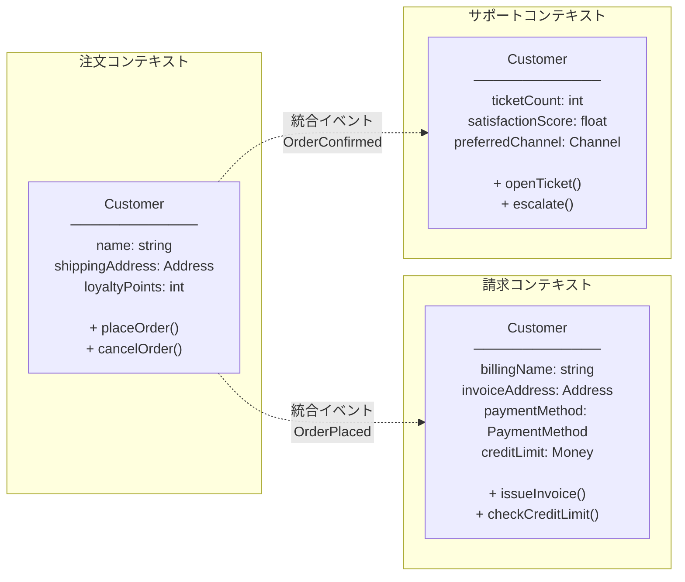
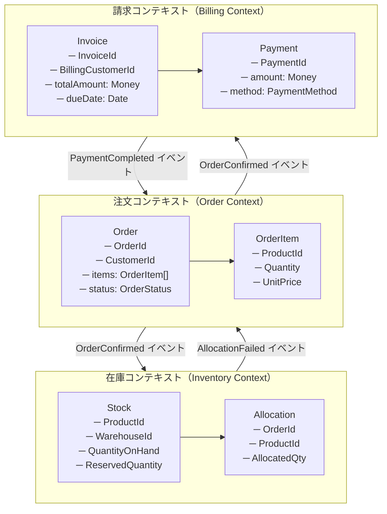

## 4.1 Bounded Contextとは何か

DDDの全戦略パターンの中で最も重要なのが、**Bounded Context（境界づけられたコンテキスト）**です。

一言で定義すれば、**「特定のドメインモデルが有効な範囲と、その範囲の明確な境界」**のことです。

なぜこれが重要なのでしょうか。大規模なソフトウェアシステムを単一のドメインモデルで表現しようとすると、必ずモデルが破綻します。なぜなら、同じ「言葉」が文脈によって異なる意味を持つからです。

「顧客」という言葉だけでも：
- **販売コンテキスト**：まだ購買していない見込み客も「顧客」として管理する
- **請求コンテキスト**：過去に取引があり、請求書を送れる法人のみが「顧客」
- **サポートコンテキスト**：サポートチケットを持つユーザーが「顧客」

これらを一つの`Customer`クラスで表現しようとした瞬間に、クラスはすべての文脈の属性を持つ「神クラス」になり、ビジネスルールの場所が不明確になります。

Bounded Contextとは、「このモデルはここの範囲でのみ有効」という住所を定義することです。

## 4.2 同じ言葉が違う意味を持つ場所が境界

どこでBounded Contextを区切るべきか——その最大のシグナルは「**同じ用語が違う意味で使われている場所**」です。



同じ`Customer`という名前でも、それぞれのコンテキストで保持する属性・振る舞い・ビジネスルールがまったく異なります。これらを統合しようとしてはいけません。分離こそが正解です。

## 4.3 ECサイトの3コンテキスト：具体的な境界の引き方

ECサイトを「注文」「在庫」「請求」の3コンテキストに分割した場合を見てみましょう。



各コンテキストは独立しており、互いに直接のクラス参照を持ちません。コンテキスト間の通信は**ドメインイベント**（統合イベント）を通じて行います。

## 4.4 境界の引き方：5つの実践的判断基準

Bounded Contextをどこで切るかは、DDDの実践における最大の判断ポイントです。以下の5つの基準が有効です。

**① 用語の意味が変わる場所で切る**
前述の通り、「顧客」の意味が違う場所は境界のシグナルです。

**② 組織の境界に合わせる（Conway's Law）**
Melvin Conwayの法則：「システムの構造は、それを設計した組織のコミュニケーション構造を反映する」。注文チームと請求チームが別なら、コンテキストも別にするのが自然です。

**③ 変更頻度の違いで切る**
在庫管理は倉庫業務の変化に追従し、請求システムは税制改正に追従します。変更サイクルが違うものは境界で分離することで、片方の変更が他方に波及しなくなります。

**④ デプロイ単位で切る**
マイクロサービスへの発展を見越すなら、独立してデプロイできる単位がBounded Contextと一致するように設計します。

**⑤ データの整合性要件で切る**
「注文の確定と在庫の引き当ては即時整合が必要か」「請求は翌日バッチで構わないか」——整合性要件が異なる場所は境界の候補です。

## 4.5 モデルの分離 vs 共有：Anti-corruption Layerの役割

コンテキスト間でデータをやり取りする際、モデルを共有してはいけません。代わりに、コンテキスト間の変換を担う**Anti-corruption Layer（ACL）**を設けます。

```csharp
// ❌ アンチパターン：コンテキスト間でモデルを直接共有する
// BillingContextがOrderContextのOrderクラスを直接参照している
public class InvoiceGenerator
{
    public Invoice GenerateFrom(Order order)  // ← OrderContextのクラスをそのまま使用
    {
        // 請求ロジックが注文モデルに依存してしまい
        // 注文モデルの変更が請求にも波及する
        return new Invoice(order.CustomerId, order.TotalAmount);
    }
}

// ✅ 正解：Anti-corruption Layerで翻訳する
// 注文コンテキストが発行するイベント（DTO）
public record OrderConfirmedEvent(
    Guid OrderId,
    Guid CustomerId,
    decimal TotalAmount,
    DateTimeOffset ConfirmedAt);

// 請求コンテキストのACL：外部イベントを内部モデルに変換する
public class OrderConfirmedEventHandler
{
    private readonly IBillingRepository _billing;

    public async Task Handle(OrderConfirmedEvent @event)
    {
        // 外部の概念（OrderId）を内部の概念（BillingReference）に変換
        var billingCustomer = await _billing.FindCustomerByExternalId(@event.CustomerId)
            ?? throw new DomainException("請求顧客が見つかりません");

        var invoice = Invoice.CreateFrom(
            billingCustomer: billingCustomer,
            amount: Money.Of(@event.TotalAmount, Currency.JPY),
            reference: new BillingReference(@event.OrderId),
            issuedAt: @event.ConfirmedAt);

        await _billing.Save(invoice);
    }
}
```

ACLにより、注文コンテキストのモデルが変わっても、請求コンテキストのモデルは保護されます。変換処理はACLに閉じ込めるだけです。

## 4.6 Bounded Context内のUniversal Language

Bounded Contextの内部では、その文脈に特化したユビキタス言語（第2章参照）が完全に機能します。「顧客」という言葉は、在庫コンテキスト内には存在しません（在庫は「ProductId × Quantity」の世界で動く）。これが「Universal Language within a Bounded Context」です。

境界の外では別の言語が話されていてよく、その翻訳はACLが担う——この構造が大規模システムを健全に保つ鍵です。

---

> ### 専門家の視点：Alberto Brandolini（EventStorming の考案者）
>
> Alberto Brandoliniは、Bounded Contextの発見手法として**EventStorming**を考案しました（2013年頃）。ワークショップ形式でドメインイベントを付箋に書き出し、時系列に並べることで、自然にBounded Contextの境界が浮かび上がるという手法です。
>
> 彼はこう述べています。**「境界は事前に設計するものではない。ドメインイベントを発見することを通して、自然に現れてくるものだ。」**
>
> これはEventStormingの哲学の核心であり、Martin Fowlerも *Patterns of Enterprise Application Architecture*（2002年）で「Context Map（コンテキストマップ）」の重要性を指摘しています。複数のBounded Contextがどのように連携するかを可視化したContext Mapは、大規模システムの全体設計図として不可欠です。
>
> また、Vaughn Vernonは「Bounded Contextを小さく保つことへの誘惑に注意せよ」と警告します。マイクロサービスブームの影響で、1クラス1サービスのような過度な分割が起きることがあります。正しいBounded Contextは「言語の境界」で決まるのであり、技術的な分割容易性で決めるべきではないと彼は強調します。

---

## まとめ

Bounded Contextは、DDDの戦略パターンの中で最も重要かつ最も実装に直結する概念です。「同じ言葉が違う意味を持つ場所に境界を引く」「境界を越えるモデル共有を禁じ、ACLで翻訳する」「組織構造・変更頻度・整合性要件を基準に境界を決める」——これらの実践により、大規模システムを複数の自律的なコンテキストとして設計できます。

DDDは「ドメインを理解すること」から始まり、「言語を作ること」を経て、「境界を引くこと」で設計に落ちていきます。本書の以降の章では、各Bounded Contextの内部設計——Entity・Value Object・Aggregate・Repository——を詳しく見ていきます。
