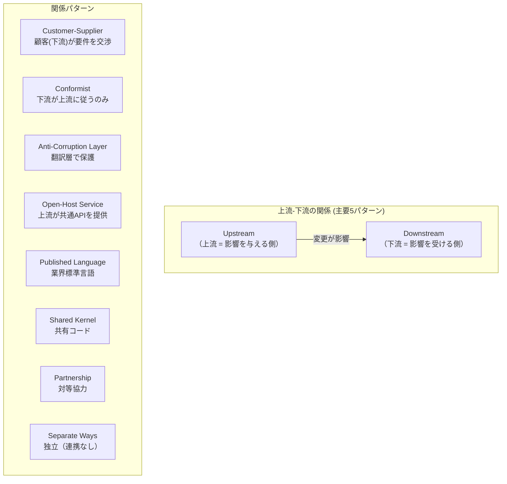
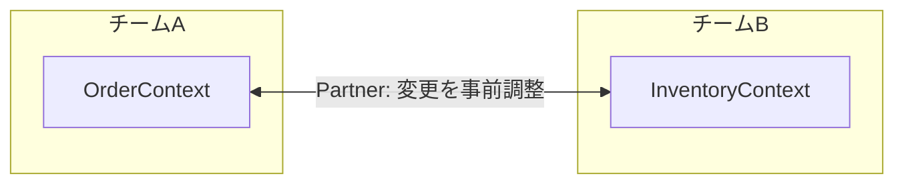
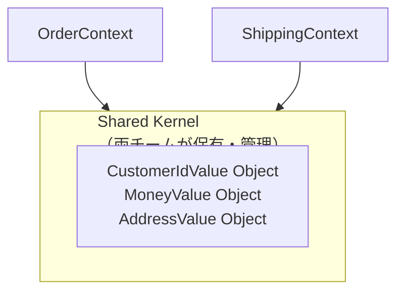
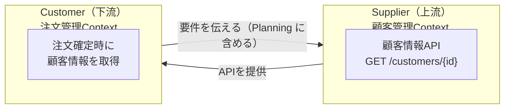
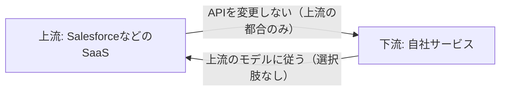
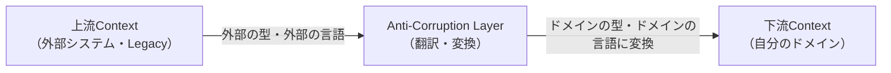
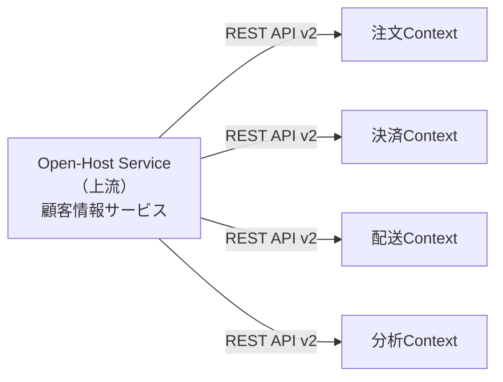
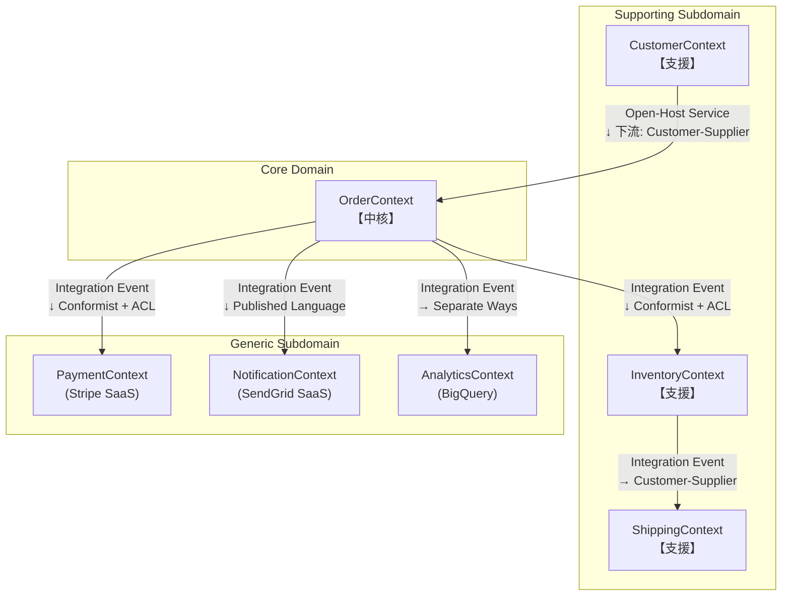

# 第 5 章: Context Map — Bounded Context 間の関係を設計する

## 0. TL;DR

Context Map とは、複数の Bounded Context がどのような関係で繋がっているかを可視化した地図。9つの関係パターン（Partnership、Shared Kernel、Customer-Supplier、Conformist、Anti-Corruption Layer、Open-Host Service、Published Language、Separate Ways、Big Ball of Mud）があり、チームの力学・コードの結合度・ビジネス上の依存関係が全て含まれる。Context Map を描かない設計は、意図せず Conformist になる。

---

## 1. なぜ Context Map が必要か

### 1.1 「コンテキストが孤立した島にはならない」問題

第4章で Bounded Context の概念を学びました。しかし現実のシステムでは、複数のコンテキストが孤立した島として存在することはありません。

```
注文管理コンテキストが顧客情報を必要とする
在庫管理コンテキストが注文情報を必要とする
決済コンテキストが注文と顧客の両方を必要とする
```

この「コンテキスト間の繋がり」を設計せずに放置すると、何が起きるかを実例で見てみましょう。

**実際のシステムで起きた問題:**

あるECサイトの開発チームは、「注文コンテキスト」と「在庫コンテキスト」を分離して開発しました。しかし Context Map を描かなかったため:

1. 在庫コンテキストのエンジニアが「注文コンテキストの Customer モデルを直接使いたい」と、`Order.Domain.Customer` クラスを直接参照するコードを書いた
2. 注文コンテキストが Customer の構造を変更すると、在庫コンテキストがビルドエラーになる
3. 隠れた依存関係により、2つのチームが互いの変更を調整する必要が生まれた（= 分割の恩恵が消えた）

**Context Map が解決すること:**
- コンテキスト間の依存方向を意図的に設計する
- 「この変更が他のコンテキストに影響するか」を地図から判断できる
- チーム間の協力・競争関係を明示する

### 1.2 Evans の言う「Map」の意味

Eric Evans は Blue Book（2003）で次のように述べています:

> 「複数のチームが複数の Bounded Context で作業するとき、コンテキスト同士の関係と、それを管理する戦略を明示した俯瞰図（map）が必要だ」

この「地図」が Context Map です。Context Map はコードではなく、**チームが共有するコミュニケーションのドキュメント**です。

---

## 2. Context Map の9つのパターン

Evans は Context Map を描く際に使う関係パターンを定義しました。これらを理解することが、Context Map の核心です。



### 2.1 Partnership（パートナーシップ）

**定義**: 2チームが対等な立場で協力し、互いの変更を調整しながら開発する関係。



**特徴:**
- どちらのコンテキストが変更する際も、相手チームと事前に合意する
- 成功も失敗も共有する
- 密接な協力関係が必要

**適用条件:**
- 2つのチームの成功が密接に結びついている
- 頻繁なコミュニケーションが可能
- 相互依存が避けられない場合

```csharp
// Partnership の実装例: 共通の Integration Event を両チームが使う
// OrderContext と InventoryContext が同じ Contract 定義を参照

// shared/contracts/OrderPlacedIntegrationEvent.cs
// （両コンテキストで共有するコントラクト）
namespace SharedContracts.Orders
{
    public sealed record OrderPlacedIntegrationEvent(
        Guid OrderId,
        Guid CustomerId,
        IReadOnlyList<OrderItemContract> Items,
        decimal TotalAmount,
        string Currency,
        DateTime OccurredAt
    );

    public sealed record OrderItemContract(
        Guid ProductId,
        string Sku,
        int Quantity,
        decimal UnitPrice
    );
}

// InventoryContext が Partnership で利用
namespace InventoryContext.Handlers
{
    public class ReserveStockOnOrderPlaced
    {
        public async Task HandleAsync(OrderPlacedIntegrationEvent evt)
        {
            // Partnership の前提: この Contract の Sku フィールドは
            // 両チームが合意した仕様。変更は事前調整必須。
            foreach (var item in evt.Items)
            {
                await _inventoryRepo.ReserveAsync(item.Sku, item.Quantity);
            }
        }
    }
}
```

**リスク:** Partnership は密な調整コストが高い。チームが離れた場所にある、または独立して動きたい場合は不適切。

### 2.2 Shared Kernel（共有カーネル）

**定義**: 2つ以上のコンテキストが、ドメインモデルの一部を明示的に共有する関係。



**特徴:**
- 共有するモデルは明示的に「Shared Kernel」として宣言する
- どちらのチームも単独で Shared Kernel を変更できない
- 変更には両チームの合意と承認が必要
- CI/CD で Shared Kernel の変更を検知する仕組みが重要

```csharp
// Shared Kernel: 共通の Value Object
// SharedKernel/SharedKernel.csproj として独立プロジェクトに

namespace SharedKernel.ValueObjects
{
    // Money は注文・在庫・決済コンテキストで共通の概念
    public sealed class Money : ValueObject
    {
        public decimal Amount { get; }
        public string Currency { get; }  // ISO 4217

        private Money(decimal amount, string currency)
        {
            if (amount < 0)
                throw new ArgumentException("金額は0以上である必要があります");
            if (currency.Length != 3)
                throw new ArgumentException("通貨コードは3文字（ISO 4217）");

            Amount = amount;
            Currency = currency;
        }

        public static Money Of(decimal amount, string currency)
            => new(amount, currency);

        public static Money Zero(string currency) => new(0, currency);

        public Money Add(Money other)
        {
            EnsureSameCurrency(other);
            return new Money(Amount + other.Amount, Currency);
        }

        public Money Multiply(decimal factor)
            => new Money(Amount * factor, Currency);

        private void EnsureSameCurrency(Money other)
        {
            if (Currency != other.Currency)
                throw new InvalidOperationException(
                    $"通貨が異なります: {Currency} vs {other.Currency}");
        }

        protected override IEnumerable<object> GetEqualityComponents()
        {
            yield return Amount;
            yield return Currency;
        }
    }

    // Address も複数コンテキストで共有
    public sealed class Address : ValueObject
    {
        public string PostalCode { get; }
        public string Prefecture { get; }
        public string City { get; }
        public string Street { get; }

        // ... コンストラクタ・バリデーション
    }
}
```

**警告:** Shared Kernel は慎重に使う。共有範囲が広がるほど、コンテキストの独立性が失われる。`Money` や `Address` のような本当に汎用的な Value Object のみに限定すること。

### 2.3 Customer-Supplier（顧客-サプライヤー）

**定義**: 上流（サプライヤー）が下流（顧客）にサービスを提供する関係。下流の要求に基づいて上流が API を決定する。



**特徴:**
- 下流（注文コンテキスト）が「顧客情報のこのフィールドが必要」と上流（顧客管理）に要求できる
- 上流は下流の要求を Planning に含める責任がある
- 下流は上流の変更に追従する必要がある

```csharp
// Customer-Supplier の実装例
// 下流（OrderContext）が上流（CustomerContext）のAPIを呼ぶ

// CustomerContext が提供する API レスポンス
public sealed record CustomerResponse(
    Guid CustomerId,
    string Name,
    string Email,
    string? DefaultPostalCode,
    string? DefaultPrefecture,
    string? DefaultCity,
    string? DefaultStreet,
    string CustomerTier  // "Standard" | "Gold" | "Platinum"
);

// OrderContext が CustomerContext を呼ぶ Anti-Corruption Layer
// （Customer-Supplier でも ACL を使うことでより疎結合に）
public sealed class CustomerContextClient : ICustomerInfoProvider
{
    private readonly HttpClient _httpClient;

    public async Task<CustomerInfo?> GetCustomerAsync(CustomerId customerId)
    {
        var response = await _httpClient.GetAsync(
            $"/api/customers/{customerId.Value}");

        if (!response.IsSuccessStatusCode)
            return null;

        var dto = await response.Content.ReadFromJsonAsync<CustomerResponse>();
        if (dto is null) return null;

        // 外部の型 → ドメインの型に変換（ACL の役割）
        return new CustomerInfo(
            Id: CustomerId.From(dto.CustomerId),
            Name: dto.Name,
            Email: EmailAddress.Of(dto.Email),
            DefaultAddress: dto.DefaultPostalCode is not null
                ? Address.Of(
                    dto.DefaultPostalCode,
                    dto.DefaultPrefecture!,
                    dto.DefaultCity!,
                    dto.DefaultStreet!)
                : null,
            Tier: dto.CustomerTier switch
            {
                "Gold" => CustomerTier.Gold,
                "Platinum" => CustomerTier.Platinum,
                _ => CustomerTier.Standard
            }
        );
    }
}

// OrderContext 内でのドメイン型（上流の型に汚染されていない）
public sealed record CustomerInfo(
    CustomerId Id,
    string Name,
    EmailAddress Email,
    Address? DefaultAddress,
    CustomerTier Tier
);

public enum CustomerTier { Standard, Gold, Platinum }
```

### 2.4 Conformist（追従者）

**定義**: 下流が上流のモデルに完全に従い、自分のモデルを上流に合わせる関係。上流は下流の要求に応じない。



**典型例:**
- Salesforce・SAP などのパッケージシステムを使う場合
- 社内の権威ある Legacy System のモデルに従う場合
- 上流のチームが下流の要求を聞かない文化の場合

```csharp
// Conformist の例: Salesforceのモデルに従う
// Salesforceが返すレスポンスをそのまま使う（モデルを変換しない）

// Conformist では、上流の型をそのまま使うことが多い
// （Anti-Corruption Layer を使わない = 上流のモデルに従う）

public sealed record SalesforceOpportunity
{
    public string Id { get; init; } = "";
    public string Name { get; init; } = "";
    public string StageName { get; init; } = "";  // "Prospecting" | "Closed Won" etc.
    public decimal Amount { get; init; }
    public string AccountId { get; init; } = "";
    public DateTime CloseDate { get; init; }
}

// Conformist: SalesforceのモデルをそのままDomainに使う
// → 上流が変わると Domain が壊れるリスクがある
public class OpportunityService
{
    public async Task<SalesforceOpportunity?> GetOpportunityAsync(string id)
    {
        // Salesforceの型をそのままドメインで使っている（Conformist）
        return await _sfClient.GetOpportunityAsync(id);
    }
}
```

**問題点:** Conformist では、上流の変更（Salesforce がフィールド名を変えるなど）が直接ドメインに影響します。これを防ぐために、次の ACL パターンを使います。

### 2.5 Anti-Corruption Layer（腐敗防止層）

**定義**: 下流が上流の「汚染された」モデルから自身を守るために、翻訳層（ACL）を設ける関係。



**いつ使うか:**
- Conformist（上流のモデルが悪い、または変更できない）の場合に追加する
- 外部SaaSのモデルが複雑または汚染されている場合
- Legacy Systemを呼び出す場合

```csharp
// ACL の完全実装例

// 外部の在庫管理システム（Legacy）が返す型
namespace ExternalInventory
{
    public class InventoryRecord
    {
        public string ItemCode { get; set; } = "";           // 旧システムのアイテムコード
        public int QtyOnHand { get; set; }                   // 在庫数（QtyがDomain語でない）
        public string LocCode { get; set; } = "";            // 倉庫コード
        public decimal UnitCostUSD { get; set; }             // コスト（USDのみ）
        public string Status { get; set; } = "";             // "A", "D", "H"（不明）
        public DateTime LastUpdDt { get; set; }              // 略語まみれの日付
    }
}

// ACL: 外部型 → ドメイン型に変換する翻訳層
namespace OrderContext.Infrastructure.Adapters
{
    public sealed class InventorySystemAdapter : IInventoryAvailabilityChecker
    {
        private readonly ILegacyInventoryClient _legacyClient;

        public InventorySystemAdapter(ILegacyInventoryClient legacyClient)
            => _legacyClient = legacyClient;

        // Domain Interface を implements（Secondary Port）
        public async Task<StockAvailability> CheckAvailabilityAsync(
            ProductId productId, int requestedQuantity)
        {
            // 外部システムを呼ぶ
            var record = await _legacyClient.GetInventoryAsync(
                productId.ToItemCode());  // ProductId → 外部のItemCode変換

            if (record is null)
                return StockAvailability.NotFound();

            // ACL の本体: 外部の型 → ドメインの型へ変換
            var status = MapStatus(record.Status);
            if (status == InventoryStatus.Discontinued)
                return StockAvailability.Unavailable("廃番商品です");

            var availableStock = record.QtyOnHand;  // Qty → 在庫数（名前を変換）
            var costJpy = ConvertToJpy(record.UnitCostUSD);  // USD → JPY 変換

            if (availableStock < requestedQuantity)
                return StockAvailability.Insufficient(availableStock, requestedQuantity);

            return StockAvailability.Available(availableStock, costJpy);
        }

        // 外部の "A", "D", "H" → ドメインの InventoryStatus に変換
        private static InventoryStatus MapStatus(string legacyStatus) =>
            legacyStatus switch
            {
                "A" => InventoryStatus.Active,
                "D" => InventoryStatus.Discontinued,
                "H" => InventoryStatus.OnHold,
                _ => throw new InvalidOperationException(
                    $"不明な在庫ステータス: {legacyStatus}")
            };

        private Money ConvertToJpy(decimal usdAmount)
        {
            const decimal exchangeRate = 150m; // 実際には為替APIから取得
            return Money.Of(Math.Round(usdAmount * exchangeRate, 0), "JPY");
        }
    }
}

// ドメインの型（外部システムの概念が一切入っていない）
namespace OrderContext.Domain.Inventory
{
    public interface IInventoryAvailabilityChecker
    {
        Task<StockAvailability> CheckAvailabilityAsync(
            ProductId productId, int requestedQuantity);
    }

    public sealed record StockAvailability
    {
        public bool IsAvailable { get; }
        public int AvailableQuantity { get; }
        public Money? UnitCost { get; }
        public string? UnavailableReason { get; }

        private StockAvailability(bool isAvailable, int available,
            Money? cost, string? reason)
        {
            IsAvailable = isAvailable;
            AvailableQuantity = available;
            UnitCost = cost;
            UnavailableReason = reason;
        }

        public static StockAvailability Available(int qty, Money cost)
            => new(true, qty, cost, null);
        public static StockAvailability Insufficient(int available, int requested)
            => new(false, available, null, $"在庫不足（要求{requested}件/在庫{available}件）");
        public static StockAvailability Unavailable(string reason)
            => new(false, 0, null, reason);
        public static StockAvailability NotFound()
            => new(false, 0, null, "商品が見つかりません");
    }

    public enum InventoryStatus { Active, Discontinued, OnHold }
}
```

### 2.6 Open-Host Service（公開ホストサービス）

**定義**: 上流コンテキストが、複数の下流コンテキストのために明確に定義された API を公開する関係。



**特徴:**
- 上流は「バージョン管理された公開API」を提供する
- 複数の下流が同じ API を使う
- API の変更は後方互換性を保ちながら行う

```csharp
// Open-Host Service の実装例: 顧客情報サービス

// CustomerContext が Open-Host Service として提供するエンドポイント
[ApiController]
[Route("api/v2/customers")]  // バージョン管理
public sealed class CustomerApiController : ControllerBase
{
    private readonly ICustomerRepository _customerRepo;

    // 公開APIは変更を最小限にする（下流への影響を最小化）
    [HttpGet("{customerId:guid}")]
    [ProducesResponseType<CustomerPublicDto>(200)]
    [ProducesResponseType(404)]
    public async Task<IActionResult> GetCustomer(Guid customerId)
    {
        var customer = await _customerRepo.FindByIdAsync(
            CustomerId.From(customerId));

        if (customer is null)
            return NotFound();

        // 内部ドメインモデル → 公開API用DTOに変換
        // 公開APIは安定したコントラクト
        return Ok(new CustomerPublicDto(
            CustomerId: customer.Id.Value,
            Name: customer.Name,
            Email: customer.Email.Value,
            Tier: customer.Tier.ToString(),
            HasDefaultAddress: customer.DefaultAddress is not null
        ));
    }
}

// 公開API用DTO（安定したコントラクト）
// 内部のドメインモデルが変わっても、このDTOは維持する
public sealed record CustomerPublicDto(
    Guid CustomerId,
    string Name,
    string Email,
    string Tier,
    bool HasDefaultAddress
);
```

### 2.7 Published Language（公開言語）

**定義**: コンテキスト間で共有する、よく定義された情報交換モデル（スキーマ）。業界標準・国際標準であることが多い。

**例:**
- 金融: FIX プロトコル（株式取引）
- 医療: HL7 FHIR（医療データ）
- EC: OpenAPI + JSON Schema

```csharp
// Published Language の例: 業界標準JSONスキーマを使う
// OpenAPI Schema として定義した注文イベント

// published-language/order-events.schema.json の内容を C# で表現
public sealed record OrderEventSchema
{
    [JsonPropertyName("specversion")]
    public string SpecVersion { get; init; } = "1.0";  // CloudEvents 標準

    [JsonPropertyName("type")]
    public string Type { get; init; } = "";  // "com.creanest.order.placed.v1"

    [JsonPropertyName("source")]
    public string Source { get; init; } = "";  // "https://orders.creanest.co"

    [JsonPropertyName("id")]
    public string Id { get; init; } = "";  // UUID

    [JsonPropertyName("time")]
    public string Time { get; init; } = "";  // RFC 3339

    [JsonPropertyName("data")]
    public JsonElement Data { get; init; }
}
```

### 2.8 Separate Ways（独立した道）

**定義**: 2つのコンテキストが協力関係を持たない、完全に独立した関係。

**いつ使うか:**
- 統合のコストが恩恵を上回る場合
- 2つの機能が技術的に近くても、ビジネス上の関係がない場合

```
例: ECサイトの「商品レビューコンテキスト」と「配送コンテキスト」
→ どちらも注文と関係するが、レビューと配送は直接繋がらない
→ Separate Ways: 両コンテキストは独立して進化する
```

### 2.9 Big Ball of Mud（泥団子）

**定義**: 境界が存在せず、全てが混在した既存システム。

```
現実のシステムの大半がこの状態。
Context Map を描く際、"Big Ball of Mud" としてマークした後、
どこから境界を抽出するかを議論する。
```

---

## 3. Context Map を描く手順

### 3.1 ステップ1: コンテキストを列挙する

まず、システム内の全 Bounded Context を書き出します。

```
ECサイトの例:
- OrderContext（注文管理）
- CustomerContext（顧客管理）
- InventoryContext（在庫管理）
- PaymentContext（決済）
- ShippingContext（配送管理）
- NotificationContext（通知）
- AnalyticsContext（分析・レポート）
```

### 3.2 ステップ2: 依存関係を洗い出す

各コンテキストが「どのコンテキストのデータ・機能を必要とするか」を列挙します。

```
OrderContext ← CustomerContext（注文時に顧客情報を参照）
OrderContext → InventoryContext（注文確定時に在庫を引き当て）
OrderContext → PaymentContext（注文確定時に決済を実行）
OrderContext → NotificationContext（注文確定時にメールを送信）
ShippingContext ← OrderContext（発送する注文情報を参照）
AnalyticsContext ← OrderContext（売上データを分析）
```

### 3.3 ステップ3: チームの力学を考慮する

```
パターン選択の判断基準:
├─ 両チームが対等に協力できる → Partnership
├─ 共通モデルを管理できる → Shared Kernel
├─ 下流が要求を交渉できる → Customer-Supplier
├─ 上流が変更できない / 下流が従うしかない → Conformist + ACL
├─ 上流が多数の下流にAPIを提供する → Open-Host Service
└─ 関係なし → Separate Ways
```

### 3.4 ECサイトの Context Map 例



---

## 4. Context Map を C# で実装する

Context Map はドキュメントですが、実装に影響します。各パターンを C# でどう表現するかを示します。

### 4.1 Anti-Corruption Layer の実装（詳細版）

```csharp
// Domain Layer: Secondary Port（Interface）
namespace OrderContext.Domain.Ports
{
    public interface ICustomerInfoPort
    {
        Task<CustomerInfo?> GetCustomerAsync(CustomerId customerId);
    }

    // ドメインの型（外部システムとは無関係）
    public sealed record CustomerInfo(
        CustomerId Id,
        string Name,
        EmailAddress Email,
        CustomerTier Tier,
        Address? DefaultAddress
    );
}

// Infrastructure Layer: ACL の実装
namespace OrderContext.Infrastructure.Adapters
{
    // CustomerContext の Open-Host API を呼ぶ ACL
    public sealed class CustomerContextAdapter : ICustomerInfoPort
    {
        private readonly HttpClient _http;
        private readonly ILogger<CustomerContextAdapter> _logger;

        public CustomerContextAdapter(
            HttpClient http, ILogger<CustomerContextAdapter> logger)
        {
            _http = http;
            _logger = logger;
        }

        public async Task<CustomerInfo?> GetCustomerAsync(CustomerId customerId)
        {
            try
            {
                // Open-Host Service の API を呼ぶ
                var response = await _http.GetAsync(
                    $"/api/v2/customers/{customerId.Value}");

                if (response.StatusCode == HttpStatusCode.NotFound)
                    return null;

                response.EnsureSuccessStatusCode();

                var dto = await response.Content
                    .ReadFromJsonAsync<CustomerPublicDto>();

                if (dto is null)
                    return null;

                // ACL: 外部の型 → ドメインの型に変換
                return TranslateToCustomerInfo(dto);
            }
            catch (HttpRequestException ex)
            {
                _logger.LogError(ex,
                    "CustomerContext への接続に失敗: {CustomerId}", customerId.Value);
                throw new InfrastructureException(
                    "顧客情報の取得に失敗しました", ex);
            }
        }

        private static CustomerInfo TranslateToCustomerInfo(CustomerPublicDto dto)
        {
            // 翻訳: 外部の型 → ドメインの型
            return new CustomerInfo(
                Id: CustomerId.From(dto.CustomerId),
                Name: dto.Name,
                Email: EmailAddress.Of(dto.Email),
                Tier: dto.Tier switch
                {
                    "Gold" => CustomerTier.Gold,
                    "Platinum" => CustomerTier.Platinum,
                    _ => CustomerTier.Standard
                },
                DefaultAddress: null // Open-Host Service が住所を返さない設計のため
            );
        }
    }

    // 外部のDTOはInfrastructure層に閉じ込める
    private sealed record CustomerPublicDto(
        Guid CustomerId,
        string Name,
        string Email,
        string Tier,
        bool HasDefaultAddress
    );
}
```

### 4.2 Integration Event による疎結合な連携

```csharp
// コンテキスト間の連携は Integration Event で行う（Published Language）

// OrderContext が発行する Integration Event
// この型は両コンテキストが参照できる場所に置く（SharedContracts など）
public sealed record OrderPlacedIntegrationEvent(
    Guid OrderId,
    Guid CustomerId,
    IReadOnlyList<OrderItemMessage> Items,
    decimal TotalAmountJpy,
    DateTime OccurredAt
);

public sealed record OrderItemMessage(
    Guid ProductId,
    string Sku,
    int Quantity,
    decimal UnitPriceJpy
);

// OrderContext が発行する Publisher（Domain Event → Integration Event）
public sealed class OrderIntegrationEventPublisher
    : IDomainEventHandler<OrderPlacedEvent>
{
    private readonly IMessageBus _messageBus;

    public async Task HandleAsync(OrderPlacedEvent evt, CancellationToken ct = default)
    {
        // Domain Event（内部型）→ Integration Event（公開型）に変換
        var integrationEvent = new OrderPlacedIntegrationEvent(
            OrderId: evt.OrderId.Value,
            CustomerId: evt.CustomerId.Value,
            Items: evt.Items.Select(i => new OrderItemMessage(
                ProductId: i.ProductId,
                Sku: i.ProductId.ToString(), // 実際はSKUマスタから取得
                Quantity: i.Quantity,
                UnitPriceJpy: i.UnitPrice
            )).ToList(),
            TotalAmountJpy: evt.TotalAmount.Amount,
            OccurredAt: evt.OccurredAt
        );

        // Message Bus に発行（InventoryContext / ShippingContext が subscribe）
        await _messageBus.PublishAsync(integrationEvent, ct);
    }
}

// InventoryContext が消費するハンドラー（別プロセス）
// InventoryContext は OrderContext を直接参照しない
namespace InventoryContext.Handlers
{
    public class ReserveStockOnOrderPlaced
    {
        private readonly IInventoryRepository _inventoryRepo;

        public async Task HandleAsync(OrderPlacedIntegrationEvent evt)
        {
            foreach (var item in evt.Items)
            {
                var inventory = await _inventoryRepo.FindBySkuAsync(item.Sku);
                if (inventory is null) continue;

                inventory.Reserve(item.Quantity);  // InventoryContext 独自の操作
                await _inventoryRepo.SaveAsync(inventory);
            }
        }
    }
}
```

---

## 5. Context Map の定期的な見直し

### 5.1 Context Map は生きた文書

Context Map は一度描いたら終わりではありません。ビジネスの変化・チームの変化・技術の変化に伴い、定期的に見直します。

**見直しのトリガー:**
- 新しい機能が既存のコンテキストの境界を超える場合
- チームの組織変更（コンウェイの法則が変わる）
- Performance の問題（統合のオーバーヘッドが大きい）
- 外部システムの変更（API が廃止になる）

### 5.2 Context Map の健全性指標

| 指標 | 良い状態 | 警告サイン |
|------|---------|-----------|
| **依存の方向** | 一方向または少数 | 循環依存がある |
| **ACL の存在** | 外部システムとの境界に存在 | Conformist のまま（ACL なし） |
| **Integration Event** | 非同期で疎結合 | 同期 API 呼び出しの連鎖 |
| **パターンの明示** | 全ての関係にパターンが割り当てられている | 「なんとなく繋がっている」 |

---

## 6. よくある設計ミス TOP6

### ミス1: Context Map を描かずに実装を始める

結果: コンテキスト間の依存が意図せず形成され、後から変更できなくなる。

### ミス2: Conformist を選択したのに ACL を使わない

```csharp
// NG: 外部SaaSのモデルをDomainに持ち込む（Conformist + 無防備）
public class OrderService
{
    public async Task PlaceOrderAsync(SalesforceAccount sfAccount, ...)
    {
        // SalesforceのモデルがDomainに漏れている
        var tier = sfAccount.AccountType == "Enterprise" ? Tier.Gold : Tier.Standard;
    }
}

// OK: ACL で外部型をドメイン型に変換してから使う
public class OrderService
{
    private readonly ISalesforceAdapter _salesforceAdapter; // ACL interface

    public async Task PlaceOrderAsync(CustomerId customerId, ...)
    {
        var customerInfo = await _salesforceAdapter.GetCustomerAsync(customerId);
        // customerInfo は ドメインの CustomerInfo 型（Salesforce型ではない）
    }
}
```

### ミス3: Partnership のつもりが Shared Kernel になる

チームが「Partnership だから共有しよう」と言って、ドメインモデルを大量に共有し始めると Shared Kernel（またはその劣化版）になります。Partnership はデータを共有するのではなく、変更の調整をすることです。

### ミス4: Open-Host Service の API バージョン管理をしない

下流が増えるにつれて、上流が API を変更するとすべての下流が影響を受けます。`/api/v1/` → `/api/v2/` の移行を計画的に行わないと、全チームに同時変更を強いることになります。

### ミス5: Integration Event に Domain 型（Value Object）を含める

```csharp
// NG: Integration EventにDomain型を含める
public sealed record OrderPlacedIntegrationEvent(
    OrderId OrderId,  // ← Domain型
    Money TotalAmount  // ← Domain型（別コンテキストが参照できない）
);

// OK: プリミティブ型のみ
public sealed record OrderPlacedIntegrationEvent(
    Guid OrderId,           // ← プリミティブ
    decimal TotalAmountJpy  // ← プリミティブ
);
```

### ミス6: Context Map のパターンを1つのコンテキストに混在させる

```
NG: OrderContext が CustomerContext に対して
- Open-Host Service（複数の下流にAPIを提供）でもあり
- Customer-Supplier（下流の要求に応える）でもある

1つの関係には1つのパターン
```

---

## 7. コードレビュー観点

**Integration Event のチェック**
- [ ] Integration Event がプリミティブ型のみで構成されているか（Domain 型を含んでいないか）
- [ ] Integration Event に `OccurredAt` が含まれているか
- [ ] 受信側（Consumer）がべき等に実装されているか

**ACL のチェック**
- [ ] 外部システムの型と Domain の型を変換する ACL が存在するか
- [ ] ACL が Infrastructure Layer に置かれているか（Domain Layer ではなく）
- [ ] ACL の変換ロジックが単体テストされているか

**依存方向のチェック**
- [ ] コンテキスト間の依存に循環がないか
- [ ] 外部システムへの依存が Interface 経由か（直接 new していないか）

---

## 8. アーキテクトの視点

### Context Map は「組織の設計図」

Conway's Law（コンウェイの法則）:

> 「システムを設計する組織は、その組織のコミュニケーション構造をコピーしたシステムを作る」

Context Map を描くと、実はそれはチーム間のコミュニケーション構造の鏡でもあります。

- チームAとチームBが頻繁に会議している → Partnership または Customer-Supplier
- チームCが別のチームの変更を勝手に使っている → Conformist（意図せず）

**逆コンウェイ戦略**: アーキテクチャの理想に合わせてチームを再編成する。

### Strangler Fig Pattern と Context Map

既存のシステム（Big Ball of Mud）を段階的にDDDに移行する際、Context Map が指針になります:

1. Big Ball of Mud を1つのコンテキストとして描く
2. まず分離したい境界を1つ特定する
3. ACL で保護しながら新コンテキストを構築する
4. 徐々に機能を移行する

---

## 9. 演習問題

**問1: Context Map 設計**

以下のシステムの Context Map を設計してください。

- 病院の予約管理システム
- コンテキスト: 患者管理、予約管理、医師スケジュール、保険会社連携、電子カルテ
- 制約: 電子カルテは外部の Legacy System（変更不可）

解答のポイント:
- 電子カルテは Conformist + ACL
- 保険会社は Conformist + ACL（外部組織のAPIを変更できない）
- 予約管理と医師スケジュールは Customer-Supplier
- 患者管理は Open-Host Service（複数コンテキストが参照）

**問2: パターンの判定**

以下の状況に最適な Context Map パターンを選んでください。

1. 自社の「注文管理システム」が、Salesforce（外部SaaS）の顧客データを使う。Salesforce は変更できない。
2. 「マーケティングチーム」と「注文管理チーム」が共同で「キャンペーン割引」機能を開発する。両チームの成功が紐づいている。
3. 「決済サービス」が「注文サービス」「定期購読サービス」「ギフトカードサービス」の3つに決済APIを提供する。

解答:
1. Conformist + Anti-Corruption Layer
2. Partnership
3. Open-Host Service

**問3: ACL の実装**

以下の外部APIのレスポンスをドメインの型に変換するACLを C# で実装してください。

```json
{
  "user_id": "U12345",
  "display_nm": "田中 太郎",
  "email_addr": "tanaka@example.com",
  "user_class": "2",  // 1=一般, 2=プレミアム, 3=VIP
  "reg_dt": "2024-01-15"
}
```

---

## 参考文献と著者の解釈

Eric Evans は Blue Book（2003）の第4部「Strategic Design」で Context Map を定義しました。特に印象的なのは「チームは、自分たちのコンテキストを明示的に描くことで、他チームとの関係を意識的に設計できる」という指摘です。

Vaughn Vernon は *Implementing Domain-Driven Design*（2013）第3章で、9つの Context Map パターンを整理し、各パターンを実装レベルで説明しました。本章の ACL 実装例は Vernon の解説に基づいています。

筆者の経験では、Context Map を「描くこと」自体に大きな価値があります。コードを書く前に Context Map を描いてチームで共有するだけで、「ここに循環依存がある」「このコンテキストはACLが必要」という議論が自然に生まれます。Context Map はアーキテクトがチームとコミュニケーションするための最も効果的なツールの一つです。
