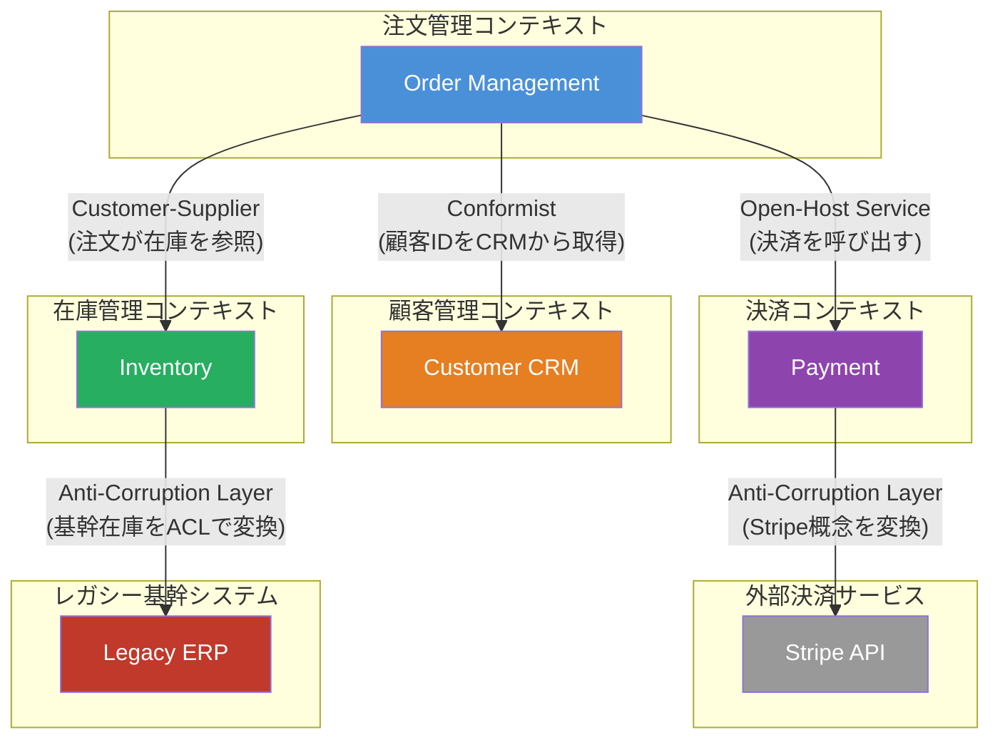

## Context Mapとは何か

大規模なシステムを設計する際、複数のBounded Contextが必ず登場します。たとえばECサイトには「注文管理」「在庫管理」「顧客管理」「決済」など、それぞれ独自のユビキタス言語と境界を持つコンテキストが存在します。これらが孤立した島のように存在するわけではなく、互いに連携しながらシステム全体を形成しています。

**Context Map**とは、こうした複数のBounded Context間の関係性と統合パターンを地図（Map）として可視化したものです。Eric Evansは「Context Mapは、チーム間の協力関係と依存関係を明示化し、設計上の落とし穴を早期に発見するための重要なツールである」と述べています。

Context Mapを描くことで、次のような問いに答えられるようになります。

- あるコンテキストの変更が、他のコンテキストにどう影響するか？
- どのチームがどのコンテキストに責任を持つか？
- コンテキスト間のデータ変換はどこで行われるか？

## 9つの統合パターン

コンテキスト間の関係は、以下の9つのパターンに分類されます。

| パターン | 概要 | 典型的な用途 |
|---|---|---|
| **Shared Kernel** (共有カーネル) | 2つのチームが共通のモデルを共有する。変更は相互合意が必要 | 緊密に連携する社内チーム間 |
| **Customer-Supplier** (顧客-供給者) | 上流（供給者）が下流（顧客）のニーズを考慮しながら開発する | 社内の異なるチーム間 |
| **Conformist** (順応者) | 下流チームが上流チームのモデルをそのまま採用する | 上流に交渉力がない場合 |
| **Anti-Corruption Layer** (腐敗防止層) | 下流が上流の概念が自分のモデルを汚染しないよう変換層を設ける | レガシーシステムとの統合 |
| **Open-Host Service** (公開ホストサービス) | 上流が複数の下流に対してプロトコルを公開する | API設計、社内プラットフォーム |
| **Published Language** (公開言語) | コンテキスト間の通信に標準化された共通言語を使う | イベント駆動、XML/JSON標準 |
| **Separate Ways** (分かれた道) | 統合するコストが高く、各チームが独自に解決策を持つ | 依存コストが高い場合 |
| **Partnership** (パートナーシップ) | 2チームが相互に依存し、共同で調整しながら開発する | 成功/失敗を共にするチーム |
| **Big Ball of Mud** (大きな泥団子) | 境界が不明確で混乱したシステム。既存システムに多い | 既存レガシーシステムの現実 |

## ECサイトのContext Map

実際のECサイトを例に、Context Mapを描いてみましょう。



## Anti-Corruption Layerの実装例

最も重要なパターンの一つ、**Anti-Corruption Layer（ACL）**を実装してみましょう。決済コンテキストがStripe APIと連携する際、Stripeの概念（`PaymentIntent`、`charge`など）を自分たちのドメイン語彙（`Payment`、`PaymentResult`）に変換します。

### Before: ACLなしの問題のある実装

```csharp
// Before: Stripeの概念が決済コンテキスト内に直接漏れ込んでいる
public class OrderService
{
    private readonly StripeClient _stripeClient;

    public async Task ProcessOrderAsync(Order order)
    {
        // Stripeのデータ構造が直接ドメインコードに侵入している
        var paymentIntentOptions = new PaymentIntentCreateOptions
        {
            Amount = (long)(order.TotalPrice * 100), // Stripeは金額を整数セント単位で扱う
            Currency = "jpy",
            PaymentMethod = order.Customer.StripePaymentMethodId, // Stripe固有のID
            Confirm = true,
        };

        var service = new PaymentIntentService(_stripeClient);
        var intent = await service.CreateAsync(paymentIntentOptions);

        // Stripeのステータス文字列が直接使われている
        if (intent.Status == "succeeded")
        {
            order.MarkAsPaid(intent.Id); // Stripe IDがドメインに保存される
        }
    }
}
```

この実装では、Stripeのデータ構造（`PaymentIntentCreateOptions`、`succeeded`ステータス文字列）が注文管理コンテキストのドメインコードに直接侵入しています。もしStripeから別の決済プロバイダーへ変更する場合、注文管理コンテキスト全体を書き直す必要が生じます。

### After: Anti-Corruption Layerを導入した実装

```csharp
// ドメイン側の概念（外部サービスに依存しない）
public record PaymentRequest(
    Guid OrderId,
    Money Amount,
    string CustomerToken);

public record PaymentResult(
    bool IsSucceeded,
    string? TransactionId,
    string? ErrorMessage);

// ACL: 決済コンテキストのインターフェース（ドメイン語彙）
public interface IPaymentGateway
{
    Task<PaymentResult> ProcessAsync(PaymentRequest request);
}

// ACL実装: StripeのAPIをドメイン概念に変換する「翻訳層」
public class StripePaymentGateway : IPaymentGateway
{
    private readonly StripeClient _stripeClient;

    public async Task<PaymentResult> ProcessAsync(PaymentRequest request)
    {
        // ドメイン概念 → Stripe概念への変換
        var stripeAmount = ConvertToStripeAmount(request.Amount);

        var options = new PaymentIntentCreateOptions
        {
            Amount = stripeAmount,
            Currency = request.Amount.Currency.Code.ToLower(),
            PaymentMethod = request.CustomerToken,
            Confirm = true,
        };

        try
        {
            var service = new PaymentIntentService(_stripeClient);
            var intent = await service.CreateAsync(options);

            // Stripe概念 → ドメイン概念への変換
            return intent.Status == "succeeded"
                ? PaymentResult.Success(intent.Id)
                : PaymentResult.Failure("決済が承認されませんでした");
        }
        catch (StripeException ex)
        {
            // Stripe固有の例外をドメイン概念に変換
            return PaymentResult.Failure(TranslateStripeError(ex.StripeError.Code));
        }
    }

    private static long ConvertToStripeAmount(Money amount) =>
        (long)(amount.Value * 100); // ドメインの円単位 → Stripeのセント単位

    private static string TranslateStripeError(string stripeCode) => stripeCode switch
    {
        "card_declined" => "カードが拒否されました",
        "insufficient_funds" => "残高が不足しています",
        _ => "決済処理中にエラーが発生しました"
    };
}

// ドメインサービス: 外部サービスを知らず、ドメイン概念のみで語る
public class OrderService
{
    private readonly IPaymentGateway _paymentGateway;

    public async Task ProcessOrderAsync(Order order)
    {
        var request = new PaymentRequest(
            order.Id,
            order.TotalPrice,
            order.Customer.PaymentToken);

        var result = await _paymentGateway.ProcessAsync(request);

        if (result.IsSucceeded)
            order.MarkAsPaid(result.TransactionId!);
        else
            order.MarkAsPaymentFailed(result.ErrorMessage!);
    }
}
```

`OrderService`はもはやStripeを一切知らず、`IPaymentGateway`というドメイン語彙だけで語ります。決済プロバイダーをStripeからPayPayに変えても、`StripePaymentGateway`を新しい実装クラスに差し替えるだけで済みます。

> **専門家の視点**
>
> Context Mapは「描いて終わり」ではありません。システムの成長とともに関係性は変化します。Vlad Khononov（著書「Learning Domain-Driven Design」）は「Context Mapは生きたドキュメントであり、チームのコミュニケーションツールである」と述べています。特に注目すべきは**チームの力学**です。Customer-Supplierパターンで上流チームが下流チームのニーズを無視する状況が続くと、下流チームは自衛のためにConformistかACLかSeparate Waysを選ばざるを得ません。Context Mapを描くことで、技術的な関係性だけでなく、チーム間の政治的な力関係も可視化されます。Big Ball of Mudとして正直に描かれたシステムを見て初めて「私たちのシステムはここまで混乱しているのか」と認識できるチームは少なくありません。Context Mapは現実を直視させる勇気のある設計ツールです。
