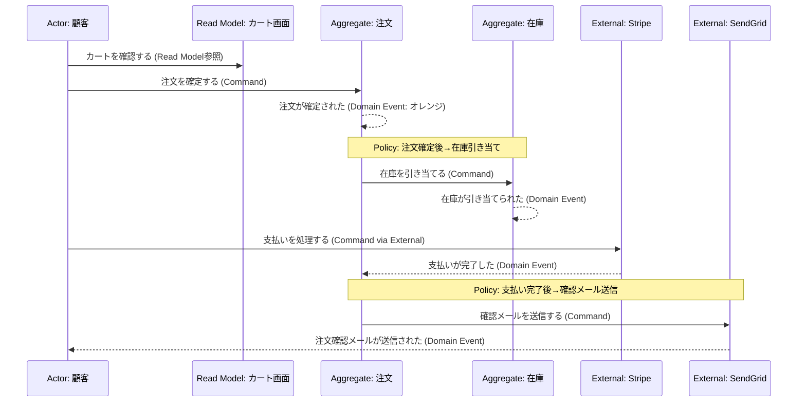

## Event Stormingの誕生

2013年、イタリア人ソフトウェアコンサルタントのAlberto Brandoliniは、一つの根本的な問いに悩んでいました。「なぜ私たちは、ドメインを理解しきれないままコードを書き始めてしまうのか？」

従来のソフトウェア開発では、要件定義書やUML図を作成してから実装に入るのが一般的でした。しかしこのアプローチには欠点がありました。設計者とドメイン専門家（業務担当者）の間に深い溝があり、技術者は業務を誤解したまま設計し、業務担当者はUML図を読めないため誤りを指摘できない——という悪循環です。

Brandoliniはこの問題を解決するため、**Event Storming**を考案しました。彼が掲げた哲学は明快です。

> 「ソフトウェア開発は学習のプロセスであり、動くコードはその副産物に過ぎない」

この言葉はDDD界隈に衝撃を与えました。コードを書くことが目的ではなく、**ドメインを深く理解することが目的**であり、コードはその理解の結果として自然に生まれるものだ——という転換です。

## 付箋の色と意味

Event Stormingでは、異なる色の付箋を使って業務の流れを表現します。壁一面に広げた大きな紙の上に、参加者全員が付箋を貼っていきます。

| 付箋の色 | 種類 | 説明 | 例 |
|---|---|---|---|
| オレンジ | **Domain Event** | 過去に起きたこと（過去形） | 「注文が確定された」「支払いが完了した」 |
| 青 | **Command** | イベントを引き起こす指示・操作 | 「注文を確定する」「支払いを処理する」 |
| 黄 | **Actor** | Commandを発行する人や役割 | 「顧客」「管理者」「配送担当者」 |
| ライラック | **Policy** | イベントが発生したときに自動実行されるルール | 「注文確定後、在庫を引き当てる」 |
| 緑 | **Read Model** | Actorが意思決定するために参照するデータ | 「在庫一覧画面」「注文履歴ページ」 |
| ピンク | **External System** | 外部のサービスやシステム | 「Stripe」「SendGrid」「配送業者API」 |
| 黄緑 | **Aggregate** | 状態を管理するビジネスオブジェクトの単位 | 「注文」「在庫」「顧客アカウント」 |
| 赤/薄紫 | **Bounded Context** | 同じ言語が通じる業務の境界 | 「注文管理」「在庫管理」「決済」 |

## 3つのフェーズ

Event Stormingには目的と深さが異なる3つのフェーズがあります。

### フェーズ1: Big Picture（全体像の把握）

最初のフェーズは、システム全体で何が起きているかを把握することです。技術者・業務担当者・マネージャーなど、関係者全員が同じ部屋に集まり、**オレンジの付箋（Domain Event）だけ**を使って、業務で起きる出来事をすべて書き出します。

「注文が確定された」「支払いが失敗した」「在庫が不足した」「商品が発送された」——参加者はこれらを過去形で書き、時系列に並べていきます。重複や矛盾があっても構いません。むしろそこに重要な発見が潜んでいます。

### フェーズ2: Process Modelling（プロセスのモデリング）

Big Pictureで洗い出されたイベントに対し、今度はCommand・Actor・Policy・Read Modelを加えていきます。「なぜこのイベントが起きるのか？」「誰が何を見て決断するのか？」を詳細化するフェーズです。

### フェーズ3: Software Design（ソフトウェア設計）

最終フェーズでは、AggregateとBounded Contextを特定し、実装設計に落とし込みます。このフェーズで初めてコードの話が登場します。

## 注文管理のEvent Storming例



このEvent Storming図を見ると、ドメインの流れが時系列で一目瞭然です。Policyのロジック（「注文確定後、在庫を引き当てる」）が自然に浮かび上がり、実装すべきビジネスルールが明確になります。

## コードを書く前にEvent Stormingを行う理由

なぜコードを書く前にこのワークショップを行うべきなのでしょうか。以下のC#コードで比較してみましょう。

### Before: Event Stormingなしで実装した場合

```csharp
// Event Stormingなし: 技術者の思い込みで実装された注文処理
public class OrderController
{
    public async Task<IActionResult> PlaceOrder(OrderRequest request)
    {
        // 注文を保存する（業務ルールを理解せずに実装）
        var order = new Order(request.CustomerId, request.Items);
        await _db.SaveAsync(order);

        // 在庫チェック（注文保存後に在庫チェック？実際は逆では？）
        foreach (var item in request.Items)
        {
            var stock = await _db.GetStockAsync(item.ProductId);
            if (stock.Quantity < item.Quantity)
            {
                // 既に注文を保存した後にエラー！ロールバックが必要になる
                return BadRequest("在庫が不足しています");
            }
        }

        // 決済処理（業務担当者は「在庫確保→決済」の順を期待していた）
        await _paymentService.ChargeAsync(request.PaymentToken, order.TotalAmount);

        return Ok(order.Id);
    }
}
```

この実装には重大な問題があります。在庫チェックより先に注文を保存してしまっており、業務ルールとは逆の順序です。Event Stormingを行っていれば、「在庫が引き当てられた」というイベントが「注文が確定された」の直後に来ることを、業務担当者から教えてもらえていたはずです。

### After: Event Stormingを経て実装した場合

```csharp
// Event Storming後: ドメインイベントの流れに沿った実装
public class PlaceOrderCommandHandler
{
    public async Task<OrderId> HandleAsync(PlaceOrderCommand command)
    {
        // Step 1: 在庫の引き当て（Event Stormingで「先に在庫確保」と判明）
        var reservations = await _inventoryService.ReserveAsync(command.Items);

        // Step 2: 注文の確定（在庫確保後に注文を作成する）
        var order = Order.Place(command.CustomerId, command.Items, reservations);

        // Domain Eventを発行（Event Stormingで洗い出されたイベント群）
        await _eventPublisher.PublishAsync(new OrderPlaced(order.Id, order.Items));

        // Step 3: PolicyがDomain Eventを受け取り自動実行（疎結合）
        // - PaymentPolicy: "OrderPlaced" → Stripeに決済リクエスト
        // - NotificationPolicy: "PaymentCompleted" → 確認メール送信
        // OrderHandlerはこれらを知らない（関心の分離）

        return order.Id;
    }
}
```

Event Stormingによって、業務の正確な順序（在庫確保→注文確定→決済→通知）と、PolicyパターンによるEventDrivenアーキテクチャの自然な実装が導き出されました。

> **専門家の視点 — Alberto Brandoliniの教え**
>
> Brandoliniはよく「部屋の中で最も賢い人は、部屋そのものだ（The smartest person in the room is the room itself）」と言います。Event Stormingの力は、技術者だけでも業務担当者だけでも発揮されません。両者が**同じ場所で、同じ付箋を使って、同じ言語で語り合う**ことで初めて、誰も気づいていなかったドメインの真実が浮かび上がります。
>
> 特に注目すべきは「Hot Spot」の概念です。参加者が同じ場所に矛盾した付箋を貼ったり、「ここのルールがよくわからない」と赤いメモを貼ったりする箇所が、システムの最も危険な設計リスクを示しています。Event Stormingはコードを生産するためのツールではなく、**無知を可視化するためのツール**です。発見される課題の数が多いほど、そのワークショップは成功していると言えます。
