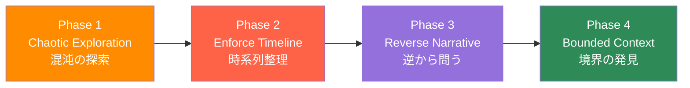
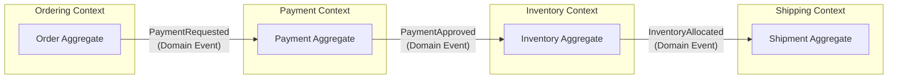
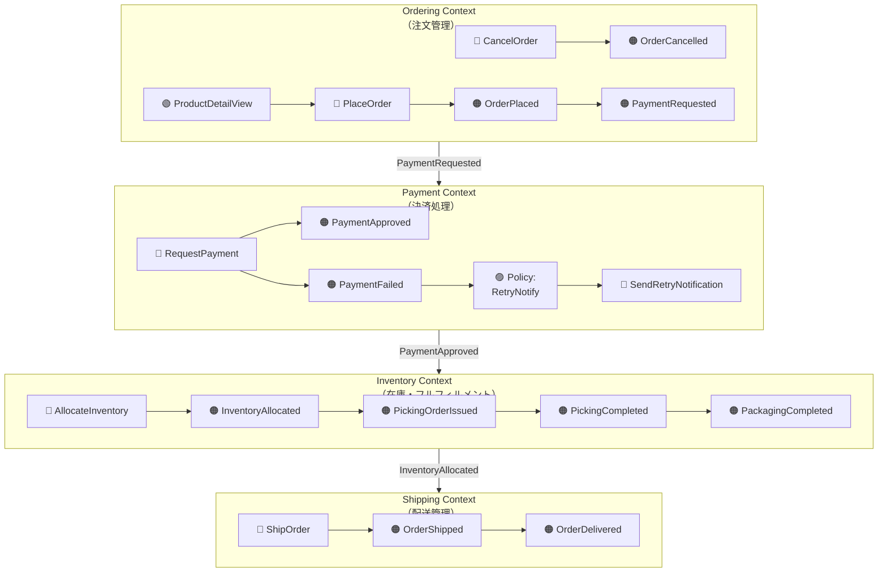
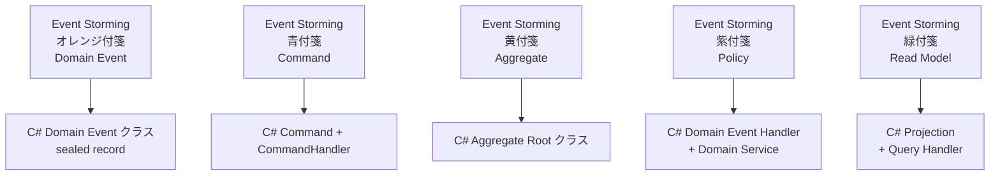

# 第6章 Event Storming — 混沌から境界を掘り出す技法

> "Event Storming is a flexible workshop format for collaborative exploration of complex business domains."
> — Alberto Brandolini, *Introducing EventStorming* (Leanpub, 2021)

---

## 0. TL;DR

Event Storming は 2013 年に Alberto Brandolini が考案した**付箋と壁だけを使うワークショップ手法**です。ドメインエキスパートと開発者が同じ壁の前に立ち、ビジネス上の「出来事（Domain Event）」を起点に会話を重ねることで、UML や ER 図では数週間かかっていたドメイン理解を**数時間で共有**します。本章では次の4点を学びます。

1. Event Storming が UML / ER 図より圧倒的に速い理由（認知科学的根拠）
2. 6色の付箋が持つ意味と使い分け
3. 4フェーズの進行方法（Chaotic Exploration → Enforce Timeline → Reverse Narrative → Bounded Context）
4. ECサイトを題材にしたワークショップの誌上体験と、C# .NET 9 への実装マッピング

Event Storming はモデリングツールではなく**発見ツール**です。「正しい図を作ること」が目標ではなく、「チームが知らなかったことを知ること」が目標であるという点を、本章を通じて繰り返し強調します。

---

## 1. Event Storming とは（Alberto Brandolini, 2013）

### 1.1 誕生の経緯

Alberto Brandolini はイタリア出身のソフトウェアコンサルタントです。2010年代初頭、彼は大規模エンタープライズ案件において「ドメインモデリングに費やす時間の大半が、実は関係者間の認識合わせに使われている」という事実に気づきました。コンサルタントが綺麗な UML を書いて顧客に見せると、顧客はそれを承認する一方で「こんなに複雑なシステムを作られたら困る」と思っている。開発者はそのモデルを実装しながら「なぜこういう設計なのかわからない」と感じる。ドメインエキスパートは「図が難しくて自分の意見を言えない」と口をつぐむ——この三者の断絶こそが、ソフトウェア開発の本質的な問題だと Brandolini は確信しました。

解決策として彼が選んだのは、あらゆる知識表現を「過去形の出来事（Past-tense Event）」に統一することでした。「注文が確定された（OrderPlaced）」「支払いが承認された（PaymentApproved）」——人間は時系列のストーリーとして物事を記憶するため、イベントという形式は万人が直感的に理解できます。ITの知識がないドメインエキスパートでも、「昨日、注文が入ったとき、在庫が足りなくて困った」という体験を付箋に書くことはできます。2013年、Brandolini はこの手法を "Event Storming" と命名し、ブログ記事で公開しました。以来、Domain-Driven Design コミュニティで爆発的に普及し、現在では世界中の組織でアジャイル開発の標準プラクティスの一つとなっています。

### 1.2 なぜ UML / ER図 より発見が速いか

この問いに答えるには、まず UML と ER 図が「何を前提とするか」を整理する必要があります。

**UML（統一モデリング言語）の前提**:
- クラス図はオブジェクト指向の構造を表現する——すなわち「システムがどう動くか」をある程度知っていることが前提
- シーケンス図は処理の流れを表現する——すなわち「誰が誰に何を依頼するか」の答えが既にある状態を前提
- UML を読み書きできるのはエンジニアとモデラーに限定される

**ER図の前提**:
- データの永続構造を表現する——すなわち「何を保存すべきか」という答えが既にある状態を前提
- ビジネスルールは図には現れず、別途ドキュメントが必要
- ドメインエキスパートは ER 図を見ても「自分のビジネスの話ではない」と感じる

つまり、UML と ER 図は**ある程度の理解がある人が、その理解を記録するためのツール**です。「まだ何もわかっていない状態からドメインを発見する」という目的には本質的に向いていません。

Event Storming が速い理由は **5 つ**あります。

**理由1: 入門コストがゼロ**。付箋に過去形の動詞フレーズを書くだけです。「OrderPlaced（注文が確定された）」「PaymentFailed（支払いが失敗した）」——この書き方はエンジニアにも、営業担当者にも、経理担当者にも平等に開かれています。UML の記法を学ぶ必要はありません。

**理由2: 全員が同じ壁の前に立つ**。物理的に同じ場所に集まり、同じ高さの視点で付箋を見ることは、「私が詳しいドメインはここ」「私が詳しいドメインはあそこ」という棲み分けを自然に消去します。エンジニアがコードを書いてドメインエキスパートに「これで合ってますか？」と確認するのではなく、両者が同時に付箋を貼ることで、**知識の共同生成**が起きます。

**理由3: 間違えることが奨励される**。付箋は剥がして貼り直せます。「この Event は間違っていた」「ここは重複している」という発見がワークショップの価値を生みます。UML を描き直すには設計ツールのスキルと時間が必要ですが、付箋を剥がすのに1秒もかかりません。この低いコストが「発言のしやすさ」を劇的に高めます。

**理由4: ホットスポットが可視化される**。赤い付箋（Hot Spot）は「ここはわからない、議論が必要」という合図です。UML でも ER 図でも「不明な点」は図に現れません。会議で誰かが口頭で指摘するまで見えないのです。Event Storming では「赤い付箋の密度が高い領域」こそが最優先で深掘りすべき境界を示します。

**理由5: ストーリーテリングの形式**。人間の認知は「〇〇が起きた → その結果〇〇が起きた」という因果連鎖の形式に最も適応しています（認知心理学でいう Narrative Thinking）。時系列に並んだオレンジ付箋はストーリーボードそのものです。ドメインエキスパートは自分のビジネスを「物語」として語れるため、彼らの暗黙知が自然に引き出されます。

**具体的な比較例**:

あるECサイトで「注文の確定処理」を設計するケースを考えます。

- **UML クラス図アプローチ**: エンジニアが Order / OrderItem / Customer / Payment クラスを設計し、ドメインエキスパートに見せる。「注文確定」が Order.Confirm() メソッドなのか OrderService.Confirm() なのかの議論に1日費やす。「在庫チェックは確定前か確定後か」という本質的な問いが1週間後まで浮かび上がらない。

- **Event Storming アプローチ**: 最初の20分で「OrderPlaced（注文確定）」「InventoryDecreased（在庫減少）」「PaymentCapture（支払いキャプチャ）」「OrderConfirmationSent（注文確認メール送信）」が壁に並ぶ。ドメインエキスパートが「あ、在庫チェックって確定の前？後？」と自分から言い出す。赤い付箋が貼られ、30分後にはその議論が解決している。

Event Storming は「解答を書くツール」ではなく「問いを見つけるツール」です。

### 1.3 必要な道具とメンバー構成

**物理的な道具**:

| 道具 | 仕様 | 注意点 |
|---|---|---|
| 付箋（ポストイット） | 6色（後述）、7.6cm × 7.6cm 推奨 | 量は多めに。100名規模なら1色500枚以上 |
| 壁 | 幅5m以上のロール紙を貼った壁 | ガラス面でも可。貼り直せる接着力が重要 |
| マーカー | 太字の黒マーカー | 細いボールペンは後ろから見えない |
| スペース | 参加者が自由に動ける広さ | 椅子は撤去することを推奨 |

**デジタルでの実施**:
Miro、MURAL、Figma FigJam などのオンラインホワイトボードでも実施できますが、Brandolini 自身は物理ワークショップを強く推奨しています。その理由は「ラップトップ画面があると、人はそれを見始める（Zoom 疲れ、チャットの流れ、コードを書く誘惑）」からです。オンラインでやむを得ない場合は、全員カメラオン・チャット閉じを徹底することが成功の鍵です。

**メンバー構成**:

理想的なメンバーは **8〜15名**です。それ以上になると壁が足りなくなり、会話が分散します。

| 役割 | 必須度 | 人数目安 |
|---|---|---|
| ドメインエキスパート（業務担当者） | 必須 | 3〜6名（複数部署から） |
| ソフトウェアアーキテクト | 必須 | 1〜2名 |
| 開発者 | 推奨 | 2〜4名 |
| ファシリテーター | 必須 | 1名（参加者と兼任可だが非推奨） |
| プロダクトオーナー | 推奨 | 1名 |
| UXデザイナー | オプション | 0〜1名 |

**ファシリテーターの責務**:
ファシリテーターは「答えを知っている人」ではなく「プロセスを守る人」です。具体的には以下を担います。

- タイムキーピング（各フェーズ15〜30分の時間管理）
- 沈黙の破壊（最初に誰も付箋を貼らない5分を乗り越える）
- ホットスポットの認識（議論が長引いている場所に赤付箋を貼り、先に進む）
- ドメインエキスパートへの傾聴促進（エンジニアが話しすぎないよう介入）
- 用語の統一促進（「注文」「オーダー」「購入」が混在したら揃える）

---

## 2. 付箋の色と意味

Event Storming では付箋の色に明確なセマンティクスがあります。この色の意味を全員が共有することが、ワークショップの共通言語を作ります。

| 色 | 意味 | 名前 | 例 |
|---|---|---|---|
| **オレンジ** | Domain Event | ドメインイベント | OrderPlaced（注文が確定された） |
| **青** | Command | コマンド | PlaceOrder（注文を確定する） |
| **黄** | Aggregate / Actor | 集約 / アクター | Order（集約）、Customer（アクター） |
| **紫** | Policy / Rule | ポリシー / ルール | 在庫不足時は通知する |
| **赤** | Hot Spot（議論が必要） | ホットスポット | どこで在庫チェックするか？ |
| **緑** | Read Model | 読み取りモデル | 在庫一覧画面 |

### 2.1 各付箋の詳細解説

**オレンジ（Domain Event）**:
最も重要な付箋です。「ビジネス上で意味のある出来事」を**過去形**で書きます。「注文が確定される（現在形）」ではなく「注文が確定された（過去形）」。この過去形のルールには深い意味があります——過去形にすることで「これは既に起きた事実である」という確実性が付与され、「この出来事は本当に起きるか？」という不毛な議論を避けられます。また、過去形のイベントは **副作用のトリガー**になります。「OrderPlaced が発生した後、何が起きるか？」という問いかけが自然に生まれます。

**青（Command）**:
Domain Event を引き起こす「意図的な操作」です。コマンドパターン（GoF）に対応します。「PlaceOrder（注文を確定する）」「CancelOrder（注文をキャンセルする）」のように命令形で書きます。コマンドは必ずアクター（人間、他システム、タイマー）から発行されます。ファシリテーターは「この Event は誰が/何が引き起こすか？」と問うことでコマンドを引き出します。

**黄（Aggregate / Actor）**:
二つの異なる意味で使われます。アーキテクトレベルでは区別が重要です。
- **Aggregate（集約）**: コマンドを受け取り、内部状態を変えてドメインイベントを発行する責任単位。「Order」「Payment」「Inventory」。Phase 4 でほぼ確定します。
- **Actor（アクター）**: コマンドを発行する主体。「Customer（顧客）」「Admin（管理者）」「External Payment Gateway（外部決済システム）」。

**紫（Policy / Rule）**:
「Aが起きたら Bをせよ」という自動的な反応ルールです。英語では "Whenever [Event], then [Command]" という形式で表現します。例：「`PaymentFailed` が発生したとき、`SendRetryNotification` コマンドを発行する」。ポリシーはドメインの暗黙ルールを表面化させます。ドメインエキスパートが「当然そうなるでしょ」と思っている部分が、エンジニアにとっては全く自明でない——この断絶がポリシー付箋で可視化されます。

**赤（Hot Spot）**:
議論が必要な「わからない点」「矛盾点」「合意できていない点」を示します。ファシリテーターが最も多用する付箋です。「誰が在庫チェックの責任を持つか？」「注文確定後24時間以内に支払われなかった場合はどうするか？」などの問いを赤付箋に書いて貼ります。Hot Spot を「後で解決する課題」としてマークし、今日の時間を本質的な流れの発見に集中させることがファシリテーターの重要なスキルです。

**緑（Read Model）**:
ユーザーが意思決定のために参照する「画面・ビュー・レポート」です。「在庫一覧画面」「注文履歴ページ」「売上日次レポート」。Read Model はコマンドの入力情報を提供します。「PlaceOrder コマンドを発行するために、顧客はどの画面を見ているか？」という問いかけで引き出します。CQRS（Command Query Responsibility Segregation）の「Q」側に対応します。

---

## 3. Event Storming の4フェーズ



### Phase 1: Chaotic Exploration（混沌の探索）

**目的**: ドメインに存在する Domain Event を、あらゆるバイアスなしに洗い出す。

**所要時間**: 20〜30分

**やり方**: 全員が同時に（ルールなしで）オレンジ付箋に Domain Event を書き、壁に貼り続けます。「重複してもいい」「順番は関係ない」「間違っていてもいい」。これがこのフェーズの唯一のルールです。

**ファシリテーターの役割**:
最初の3〜5分が最大の難関です。誰も付箋を書き始めない「凍りつきの瞬間」が必ず訪れます。ファシリテーターはこれを予期し、事前に自分で3〜4枚の付箋を書いておき、説明しながら壁に貼ることで最初のアイスブレイクを担います。「例えばこういうものですよ」という例示が全員の思考を解放します。

**20分で何百枚でも貼る**:
「どれくらい貼ればいいか？」という質問をよく受けます。Brandolini の経験則では、**参加者1人あたり20〜30枚**のオレンジ付箋が貼られると、ドメインの大まかな全体像が見えてきます。10名参加なら200〜300枚。「それだけ出てくるのか？」と疑問に思うかもしれませんが、ビジネスの複雑さを正しく反映すれば、その量は必然です。むしろ50枚しか出なかった場合は「まだドメインエキスパートが本音を出していない」サインです。

**品質より量**:
このフェーズでは「この Event は正しいか？」を考えてはいけません。「それは Event と言えるのか？」「それはすでに貼られていないか？」という検証は Phase 2 に委ねます。Chaotic Exploration の本質は、参加者の脳内にある暗黙知の外化（Externalization）です。「書く」行為そのものが思考を明確にします。

**よくある光景**:
- ドメインエキスパートAさんが「RequestSubmitted（申請が提出された）」と書いて貼る
- 隣でエンジニアのBさんが「ApplicationReceived（申請が受理された）」と書いて貼る
- 少し後でドメインエキスパートCさんが「これ同じじゃないですか？」と気づく
- この「気づき」こそが Event Storming の最初の成果です

**シャドー Event の発見**:
経験豊富なファシリテーターが注目するのは、付箋に書かれた「例外的なイベント」です。「OrderCancelled（注文がキャンセルされた）」は誰でも思いつきますが、「OrderCancelledDueToFraud（不正により注文がキャンセルされた）」「OrderCancelledAfterShipment（発送後に注文がキャンセルされた）」は、ドメインエキスパートだけが書ける貴重な洞察です。これらの「シャドー Event（影の事象）」にこそ、複雑なビジネスルールが潜んでいます。

**並走する複数のストーリー**:
大規模なドメインでは、壁の左から右へ一本の時系列が流れるのではなく、複数のストーリーが並走します。「顧客の注文フロー」「倉庫の出荷フロー」「経理の請求フロー」——これらは後のフェーズで統合・分離される候補です。Phase 1 では混在させたまま先に進みます。

**デジタルツールでの注意点**:
Miro 等を使う場合は「付箋を書いたらすぐ貼る、考えすぎない」というルールを強調します。デジタルの場合、書いた後に「もう少し考えてから貼ろう」という行動が増えがちです。これが Phase 1 の量的な充実を妨げます。5秒以内に貼ることをルール化してください。

**終了のサイン**:
20〜30分後、新しい付箋が追加されるペースが明らかに落ちてきたら Phase 2 に移行します。「もう思いつきません」という声が複数の参加者から出たらそのサインです。完全な網羅性を求める必要はありません——後のフェーズで追加は常に可能です。

### Phase 2: Enforce Timeline（時系列整理）

**目的**: ランダムに貼られた Domain Event を、ビジネスプロセスの時系列順に並べ替え、重複・矛盾・欠落を発見する。

**所要時間**: 20〜30分

**やり方**: 全員で協力して、Phase 1 で貼った付箋を「ビジネス上の時系列」に沿って左から右に並べ替えます。「このイベントはどの時点で起きるか？」という問いかけが整理の軸になります。

**時系列整理の実践**:
整理を始めると必ず発見されることがあります。まず**重複**です。「OrderPlaced」と「OrderCreated」と「PurchaseConfirmed」は実は同じ事象を指している可能性があります。この瞬間こそが、ドメインのユビキタス言語を定義するきっかけです。「どれが正しい名前か？」という議論を通じて、チームは共通の言語を得ます。

**矛盾の発見**:
「InventoryChecked（在庫チェック済み）」が「OrderPlaced（注文確定）」の前にある人と後にある人が、同じ組織に両方いることがあります。これは実は「システムによって違う」「部署によって違う」という状態を反映していることが多く、まさに Hot Spot です。赤い付箋で「どこで在庫チェックするか？注文前？注文後？」と書き、先に進みます。

**ピボットイベントの特定**:
時系列整理を進めると、「ここから物語が大きく変わる」という転換点が見えてきます。ECサイトなら「PaymentConfirmed（支払いが確定された）」がピボットイベントです。これ以前は「注文作成・検討・変更」が主なフロー、これ以降は「倉庫・出荷・配送」が主なフローになります。このピボットイベントは後の Bounded Context の境界候補になります。

**「絵のない絵本」を作る**:
時系列整理の目標は「ビジネスの物語を壁の上に作ること」です。ドメインエキスパートが壁の前に立って「うちの業務って、こうなってるんだな」と感慨を持って眺められる状態——これが Phase 2 の理想的な成果です。

**欠落の発見**:
時系列が繋がらない箇所が必ず現れます。「PaymentRequested（支払い要求）」の次が「PackagingStarted（梱包開始）」になっているが、その間に「PaymentApproved（支払い承認）」がなければビジネスは成立しません。このような「つながりの切れ目」は、既存システムでは暗黙的に処理されていることが多く、Event Storming によって初めて意識されます。

**ロールプレイの活用**:
ファシリテーターが「今から顧客役をやります。スマホでECサイトを開いて商品を選んで...」と実際のユーザー体験を演じることで、参加者の思考が「システムの動作」から「人の体験」へとシフトします。この視点の切り替えが欠落を発見するのに非常に効果的です。

**並行フローの整理**:
同じ時点で複数のフローが並走することを表現するために、壁の上下（レーン）を使います。「顧客フロー（上レーン）」と「バックオフィスフロー（下レーン）」を分けることで、「顧客が注文確定ボタンを押した瞬間、バックオフィスでは何が起きているか？」というアーキテクチャ上の重要な問いが浮かび上がります。

**Phase 2 終了の条件**:
全ての付箋が大まかに時系列順に並び、主要な矛盾・欠落に赤付箋が貼られていれば Phase 3 に移行します。「完璧な時系列」を求める必要はありません。80% の精度で前に進むことが Event Storming の哲学です。

### Phase 3: Reverse Narrative（逆から問う）

**目的**: Domain Event の原因（Command）と、Event を引き起こす自動反応（Policy）を発見する。

**所要時間**: 30〜45分

**やり方**: 時系列に並んだ Domain Event それぞれに対して、「この Event の直前に何があったか？」と逆方向に問いかけます。これにより、Command（青付箋）、Policy（紫付箋）、Actor（黄付箋）、Read Model（緑付箋）が次々と現れます。

**Reverse Narrative の必要性**:
なぜ「順方向（原因→結果）」ではなく「逆方向（結果→原因）」で問うのか？それは人間の思考の癖に対抗するためです。「注文確定という出来事が起きた」→「その直前に何があったか？」という問いは具体的で答えやすいですが、「注文確定という処理を実装するには？」という問いは抽象的で、設計の前提知識が必要です。逆から問うことで、ドメインエキスパートが直感的に答えられる問いに変換します。

**Command の引き出し方**:
ファシリテーターが「OrderPlaced が起きた直前に、誰が何をしたか？」と問います。ドメインエキスパートは「顧客が注文確定ボタンを押した」と答えます。これが「PlaceOrder（注文を確定する）」という青付箋のコマンドになります。コマンドは必ず**命令形の動詞句**で書きます。

**Policy の引き出し方**:
「PaymentApproved（支払い承認）が起きた後、自動的に何が起きるか？」という問いに「注文確認メールが送られる」という答えが返れば、「PaymentApproved のとき、SendConfirmationEmail を発行する」という紫付箋のポリシーになります。

ポリシーは多くのチームで最も驚きのある発見をもたらします。「え、そんな自動処理があったのか」というエンジニアの反応と、「当たり前じゃないですか」というドメインエキスパートの反応のギャップ——このギャップが具体的な実装要件の見落としを防ぎます。

**Actor の明示**:
コマンドを発行する主体（アクター）を黄付箋で明示します。アクターには「人間（Customer, Admin, Operator）」と「システム（Payment Gateway, Timer, External API）」の両方があります。特にシステムが自動でコマンドを発行する場合（タイムアウト処理、定期バッチ、Webhook受信など）を明示することで、統合ポイントの設計が明確になります。

**Read Model の引き出し方**:
「PlaceOrder コマンドを実行する直前に、顧客は何を見ているか？」→「商品詳細ページと在庫状況を見ている」→これが「ProductDetailView（商品詳細ビュー）」という緑付箋の Read Model になります。Read Model は「意思決定の情報基盤」であり、CQRS 設計の Projection（射影）の定義につながります。

**Reverse Narrative の典型的な発見例**:
ECサイトでよく発見されるのは「注文キャンセルポリシー」の複雑さです。「OrderCancelled が起きた場合、InventoryReleased が起きるか？」→「支払い前ならリリースする、支払い後ならポイント返還する」→「PaymentStatus によって2つの異なるポリシーが存在する」——このような分岐は、UMLのクラス図では「isCancelled フラグ」として埋もれてしまいますが、Event Storming では2枚の紫付箋として可視化されます。

**用語の衝突と解決**:
Reverse Narrative のフェーズで頻出するのが「同じ概念への異なる名前問題」です。在庫管理部門が「在庫引当（AllocateInventory）」と呼んでいるものを、物流部門では「ピッキング指示（IssuePickingOrder）」と呼んでいることがあります。これは Bounded Context の境界候補です——同じ「概念」を異なる言語で表現しているのであれば、それぞれの Context でそれぞれの名前が正しい可能性があります。

### Phase 4: Bounded Context（境界の発見）

**目的**: Phase 1〜3 で収集した情報から、Bounded Context の境界候補を発見し、Context Map の草案を描く。

**所要時間**: 30〜60分

**やり方**: 壁全体を眺め、「ここから雰囲気が変わる」「ここで別の用語が使われる」「ここで別の組織が関与する」という箇所に境界線を引きます。境界線はマーカーで壁のロール紙に直接描くか、別色のテープで示します。

**Hotspot から境界を見つける**:
赤い Hot Spot が密集している領域は、「ここはまだ整理できていない複雑な部分」を示します。逆に言えば、Hot Spot のない領域は「皆が共通理解を持っている部分」です。Hot Spot の密集度の差が、境界線を引くヒントになります。

**境界を引く3つの判断基準**:
1. **用語の変わり目**: 同じ概念を別の名前で呼び始める箇所（ドメイン言語の境界）
2. **組織の変わり目**: 関与する人や部署が切り替わる箇所（組織の境界）
3. **データの変わり目**: 参照するデータの種類が大きく変わる箇所（技術的な境界）

**ソフトラインとハードライン**:
境界には「ソフトライン（同じデプロイ可能だが設計上は分離）」と「ハードライン（完全に別サービスとして独立）」があります。Event Storming の段階では両者を区別せず、まず「論理的な境界」を発見することに集中します。物理的な分割（マイクロサービス化等）の議論は後続のアーキテクチャ決定で行います。

**Context Map の草案**:
境界が引かれたら、各 Context に名前をつけ、Context 間の関係を矢印で示します。「Ordering Context」「Inventory Context」「Payment Context」「Shipping Context」——各 Context の名前は、そのコンテキスト内のユビキタス言語から命名します。



**Phase 4 の成果物**:
- 壁に境界線が引かれた Event Storming マップ（写真で記録）
- Context 名のリスト
- Context 間の統合パターンの仮説（Upstream/Downstream、ACL の必要性等）
- Hot Spot の残存リスト（次回ワークショップの agenda）

---

## 4. ECサイトの Event Storming 実践例

### 4.1 ワークショップ開始前の情景

場所は会議室ではなく、廊下の壁を使ったオープンスペースです。高さ2メートル、幅8メートルのロール紙が貼られています。参加者は9名——倉庫管理のベテラン山田さん（60代、PCが苦手）、ECサイトの開発リードの中村さん（30代）、プロダクトオーナーの田中さん（40代）、カスタマーサポートの鈴木さん（20代）、ファイナンスの清水さん（50代）、UIデザイナーの伊藤さん（20代）、バックエンドエンジニア2名（斉藤さん・高橋さん）、そしてファシリテーターです。

全員に6色の付箋とマーカーが配られます。

**ファシリテーター**: 「今日は2時間で、このECサイトのドメインを一緒に発見していきます。最初のルールは一つだけ——このオレンジの付箋に、ビジネスで起きる"出来事"を過去形で書いて、壁に貼ってください。例えば...」

ファシリテーターは事前に書いておいた「OrderPlaced（注文が確定された）」を壁の中央に貼ります。

**ファシリテーター**: 「こんな感じです。正しいか間違いかを考える必要はありません。20分で思いつく限り全部書いてください。どうぞ！」

### 4.2 Phase 1: Chaotic Exploration（0:00〜0:20）

最初の2分間、全員が固まっています。中村さんが口を開きます。

**中村さん**: 「...えっと、これって技術的なイベントでもいいんですか？DBに書き込まれた、とか」

**ファシリテーター**: 「ビジネス上の意味があれば何でも。でもまず業務の人から先に聞きましょう。山田さん、倉庫で毎日どんなことが起きてますか？」

**山田さん**: 「そうですねえ...朝イチで出荷指示書が来て、それに従ってピッキングして、梱包して、佐川さんに渡して...」

**ファシリテーター**: 「完璧です！それを付箋に書いてください。"出荷指示書が届いた"、"ピッキングが完了した"、"梱包が完了した"...」

山田さんが書き始めると、全員の動きが変わります。

*（5分後）*

壁には約60枚の付箋が乱雑に貼られています。

鈴木さん（CS）が「OrderCancellationRequested（注文キャンセルが要求された）」と「OrderCancelled（注文がキャンセルされた）」を両方貼りながら、「これ、違いがあるんですよ。キャンセルを申請してから、実際にキャンセルされるまでに承認が必要な場合があって...」と呟きます。

**中村さん**: 「えっ、キャンセルに承認フローがあるんですか？知らなかった！」

**田中さん（PO）**: 「2万円以上の注文は手動承認が必要なんだよ。法務の要件で。」

まだ Phase 1 ですが、既に重要な発見がありました。ファシリテーターは赤付箋を取り出し、「キャンセル承認フロー——金額条件、法務の要件の詳細を要確認」と書いて貼ります。この発見は記録しておき、Phase 3 で深掘りします。

*（20分後）*

壁には287枚のオレンジ付箋が貼られています。主な内容は次のとおりです。

- 顧客フロー: ProductViewed, CartUpdated, OrderPlaced, PaymentRequested, OrderConfirmed, DeliveryTrackingViewed...
- 倉庫フロー: PickingOrderIssued, PickingCompleted, PackagingCompleted, HandedToCarrier, ReturnReceived...
- 経理フロー: InvoiceGenerated, PaymentSettled, RefundIssued, MonthlyReportGenerated...
- CS フロー: InquiryReceived, OrderCancellationRequested, ReturnRequested, ComplaintEscalated...

### 4.3 Phase 2: Enforce Timeline（0:20〜0:45）

全員で付箋を並べ始めます。壁の左端から時系列が始まります。

**高橋さん**: 「`ProductViewed` って `CartUpdated` の前ですよね？」

**伊藤さん（デザイナー）**: 「いや、カートに入れてから商品詳細見ることもありますよ？比較するために。」

**ファシリテーター**: 「両方ありうるということで、ループとして表現しましょう。今は大まかな流れを作ることが優先なので、細かい分岐は赤付箋で記録して先に進みましょう。」

*（整理の中盤 0:35）*

`PaymentApproved` の前後で明らかに「雰囲気が変わる」ことが全員に見え始めます。

**山田さん**: 「そこから先は倉庫の話になりますね。」

**清水さん（経理）**: 「そこから先は請求の話も始まります。」

**ファシリテーター**: 「これは重要な観察です。`PaymentApproved` がピボットイベントかもしれません。後で境界の候補にしましょう。」

*（0:45 — Phase 2 終了時の壁の状態）*:

```
[商品を探す] → [カートに入れる] → [注文確定] → [支払い]
                                                     ↓
                           ★ PaymentApproved ★（ピボットイベント）
                                                     ↓
                           [倉庫処理] → [配送] → [到着]
```

赤付箋が7枚貼られています（キャンセル承認フロー、在庫チェックタイミング、返品処理フロー、ポイント還元タイミング、税計算方法、外部物流との接続方式、クレジットカードのオーソリとキャプチャの違い）。

### 4.4 Phase 3: Reverse Narrative（0:45〜1:20）

**ファシリテーター**: 「では、一番シンプルな Event から始めましょう。`OrderPlaced` の直前に何がありましたか？」

**田中さん（PO）**: 「顧客が"注文を確定する"ボタンを押した。」

**ファシリテーター**: 「それがコマンドです。青い付箋に `PlaceOrder` と書いて、`OrderPlaced` の左に貼ってください。そして、そのボタンを押す前に顧客は何を見ていましたか？」

**伊藤さん**: 「注文確認画面です。商品リスト、合計金額、配送先、支払い方法が全部表示されています。」

**ファシリテーター**: 「それが Read Model です。緑の付箋に `OrderConfirmationView` と書いて`PlaceOrder` の左に貼ってください。」

*（1:00 — 鈴木さんの気づき）*

`OrderCancelled` の原因を逆向きに追うと：

**鈴木さん**: 「キャンセルには3つのパターンがあって。1つ目は顧客が自分でキャンセルした場合、2つ目は支払いが通らなくてシステムが自動キャンセルした場合、3つ目は在庫切れで倉庫が...あれ、倉庫ってキャンセルできるんでしたっけ？」

**山田さん**: 「できないよ。在庫が足りない場合は俺たちには権限がない。本社に電話して...」

**中村さん**: 「じゃあ、倉庫にはキャンセルの権限がないんですか。それ、システムに権限制御がなかったかも...」

ファシリテーターが赤付箋「倉庫にキャンセル権限を与えるか？ビジネスルール未確認」を貼ります。

*（1:15 — ポリシーの発見）*

**田中さん（PO）**: 「`PaymentFailed` が発生したとき、どうなるんですか？」

**中村さん**: 「今は手動で確認してCSが顧客に電話してます。」

**鈴木さん**: 「毎日20件くらいあって、正直しんどいです...」

**ファシリテーター**: 「それはポリシーとして整理できますね。`PaymentFailed` が起きたとき → `SendRetryNotification` コマンドを自動発行する、というポリシーが現状は実装されていないということです。これは重要な改善機会です。」

紫付箋に「PaymentFailed のとき → SendPaymentRetryNotification を発行する」と書いて貼ります。

### 4.5 Phase 4: Bounded Context（1:20〜2:00）

ファシリテーターがマーカーを持って壁の前に立ちます。

**ファシリテーター**: 「皆さん、壁全体を見て、どこかで"話が変わる"瞬間はありますか？」

**山田さん**: 「さっきも言いましたが、支払いが確定してからは倉庫の話です。」

**清水さん**: 「経理の話は注文から始まって、実際の売上は発送完了後ですね。」

**田中さん**: 「顧客に見える部分と、バックヤードの部分は明らかに違いますね。」

ファシリテーターは壁に4本の境界線を引きます。

**発見された Bounded Context と付箋の配置（Mermaid 図）**:



**ワークショップ終了時の成果**:

2時間のワークショップで次の成果が得られました。

1. **287枚のオレンジ付箋**: ドメイン全体の Domain Event の可視化
2. **4つの Bounded Context**: Ordering / Payment / Inventory / Shipping
3. **13枚の赤付箋（Hot Spot）**: 次回の深掘りセッションの agenda
4. **8枚の紫付箋（Policy）**: 実装されていなかった自動化ポリシーの発見
5. **最重要発見**: 支払い失敗時の手動対応（鈴木さんが毎日20件処理していた）を自動化できる可能性

特に山田さんが「これで倉庫と本社の話がやっと繋がった」と感想を述べたことが、このワークショップの本質的な価値を表しています。

---

## 5. Event Storming から DDD 実装へ

### 5.1 実装マッピングの全体像



### 5.2 Domain Event クラス（C# .NET 9）

Event Storming の「OrderPlaced（注文が確定された）」を C# の Domain Event クラスにマッピングします。

```csharp
// Domain/Events/OrderPlaced.cs
namespace Ecommerce.Ordering.Domain.Events;

/// <summary>
/// 注文が確定されたことを表すドメインイベント。
/// Event Storming: オレンジ付箋「OrderPlaced」に対応。
/// 発生トリガー: Order.Aggregate.Place() メソッド
/// 後続ポリシー: PaymentRequested を発行する
/// </summary>
public sealed record OrderPlaced(
    Guid OrderId,
    Guid CustomerId,
    IReadOnlyList<OrderLineItem> LineItems,
    Money TotalAmount,
    DateTimeOffset PlacedAt
) : IDomainEvent
{
    /// <summary>
    /// イベント識別子。Event Sourcing でのリプレイ用。
    /// </summary>
    public Guid EventId { get; } = Guid.NewGuid();

    /// <summary>
    /// イベントのバージョン番号。スキーマ進化管理用。
    /// </summary>
    public int Version { get; } = 1;
}

/// <summary>
/// ドメインイベントの共通インターフェース。
/// すべてのドメインイベントが実装する。
/// </summary>
public interface IDomainEvent
{
    Guid EventId { get; }
    DateTimeOffset PlacedAt { get; }
    int Version { get; }
}

/// <summary>
/// 注文明細行の値オブジェクト。
/// </summary>
public sealed record OrderLineItem(
    Guid ProductId,
    string ProductName,
    int Quantity,
    Money UnitPrice
)
{
    public Money LineTotal => UnitPrice * Quantity;
}

/// <summary>
/// 金額の値オブジェクト（通貨単位込み）。
/// </summary>
public sealed record Money(decimal Amount, string CurrencyCode)
{
    public static Money Zero(string currencyCode) => new(0m, currencyCode);

    public Money operator +(Money other)
    {
        if (CurrencyCode != other.CurrencyCode)
            throw new InvalidOperationException(
                $"通貨単位が一致しません: {CurrencyCode} vs {other.CurrencyCode}");
        return this with { Amount = Amount + other.Amount };
    }

    public static Money operator *(Money money, int multiplier) =>
        money with { Amount = money.Amount * multiplier };
}
```

同様に、支払い失敗イベントも実装します。

```csharp
// Domain/Events/PaymentFailed.cs
namespace Ecommerce.Payment.Domain.Events;

/// <summary>
/// 支払いが失敗したことを表すドメインイベント。
/// Event Storming: 「PaymentFailed」オレンジ付箋に対応。
/// 後続ポリシー（紫付箋）: "PaymentFailed のとき → SendRetryNotification を発行"
/// </summary>
public sealed record PaymentFailed(
    Guid PaymentId,
    Guid OrderId,
    string FailureReason,
    int AttemptCount,
    DateTimeOffset FailedAt
) : IDomainEvent
{
    public Guid EventId { get; } = Guid.NewGuid();
    public int Version { get; } = 1;
}
```

### 5.3 Command と CommandHandler（C# .NET 9）

Event Storming の「PlaceOrder（注文を確定する）」青付箋を、Command と CommandHandler にマッピングします。

```csharp
// Application/Commands/PlaceOrder/PlaceOrderCommand.cs
namespace Ecommerce.Ordering.Application.Commands.PlaceOrder;

/// <summary>
/// 注文確定コマンド。
/// Event Storming: 青付箋「PlaceOrder」に対応。
/// Actor: Customer（顧客）が発行。
/// Read Model: OrderConfirmationView（注文確認画面）を見た後に発行。
/// </summary>
public sealed record PlaceOrderCommand(
    Guid CustomerId,
    IReadOnlyList<OrderLineItemRequest> LineItems,
    ShippingAddress ShippingAddress,
    Guid PaymentMethodId
);

public sealed record OrderLineItemRequest(
    Guid ProductId,
    int Quantity
);

public sealed record ShippingAddress(
    string PostalCode,
    string Prefecture,
    string City,
    string AddressLine1,
    string? AddressLine2
);
```

```csharp
// Application/Commands/PlaceOrder/PlaceOrderCommandHandler.cs
namespace Ecommerce.Ordering.Application.Commands.PlaceOrder;

/// <summary>
/// PlaceOrder コマンドハンドラー。
/// PlaceOrderCommand を受け取り、Order Aggregate を操作し、
/// OrderPlaced ドメインイベントを発行する責任を持つ。
/// </summary>
public sealed class PlaceOrderCommandHandler(
    IOrderRepository orderRepository,
    IProductCatalogService productCatalogService,
    IDomainEventPublisher eventPublisher,
    ILogger<PlaceOrderCommandHandler> logger
) : ICommandHandler<PlaceOrderCommand, PlaceOrderResult>
{
    public async Task<PlaceOrderResult> HandleAsync(
        PlaceOrderCommand command,
        CancellationToken cancellationToken = default)
    {
        logger.LogInformation(
            "注文確定処理開始: CustomerId={CustomerId}, 商品数={ItemCount}",
            command.CustomerId,
            command.LineItems.Count);

        // 1. 商品情報の取得（Read Model: ProductPriceView から取得）
        var productDetails = await productCatalogService.GetProductDetailsAsync(
            command.LineItems.Select(i => i.ProductId).ToList(),
            cancellationToken);

        // 2. Aggregate の生成（Event Storming: 黄付箋「Order」に対応）
        var order = Order.Create(
            customerId: command.CustomerId,
            lineItems: command.LineItems.Select(item => new OrderLineItemDto(
                ProductId: item.ProductId,
                ProductName: productDetails[item.ProductId].Name,
                Quantity: item.Quantity,
                UnitPrice: productDetails[item.ProductId].Price
            )).ToList(),
            shippingAddress: command.ShippingAddress,
            paymentMethodId: command.PaymentMethodId
        );

        // 3. Aggregate の永続化
        await orderRepository.SaveAsync(order, cancellationToken);

        // 4. Domain Event の発行（OrderPlaced）
        // Event Storming のオレンジ付箋がここで実体化
        foreach (var domainEvent in order.DomainEvents)
        {
            await eventPublisher.PublishAsync(domainEvent, cancellationToken);
        }

        logger.LogInformation("注文確定完了: OrderId={OrderId}", order.Id);
        return new PlaceOrderResult(order.Id, order.TotalAmount);
    }
}

public sealed record PlaceOrderResult(Guid OrderId, Money TotalAmount);
```

### 5.4 Aggregate クラス（C# .NET 9）

Event Storming の「Order（黄付箋）」を Aggregate Root にマッピングします。Aggregate は「コマンドを受け取り、ビジネスルールを強制し、ドメインイベントを発行する」責任の単位です。

```csharp
// Domain/Aggregates/Order.cs
namespace Ecommerce.Ordering.Domain.Aggregates;

/// <summary>
/// 注文集約（Order Aggregate Root）。
/// Event Storming: 黄付箋「Order」に対応。
/// Command を受け取り、ビジネスルールを適用し、Domain Event を発行する。
/// </summary>
public sealed class Order : AggregateRoot
{
    // 集約の内部状態（外部からの直接変更を禁止）
    public Guid Id { get; private set; }
    public Guid CustomerId { get; private set; }
    public OrderStatus Status { get; private set; }
    public Money TotalAmount { get; private set; } = Money.Zero("JPY");
    private readonly List<OrderLineItem> _lineItems = [];
    public IReadOnlyList<OrderLineItem> LineItems => _lineItems.AsReadOnly();

    // ファクトリーメソッド（コンストラクタはプライベートにして不正な生成を防ぐ）
    public static Order Create(
        Guid customerId,
        IReadOnlyList<OrderLineItemDto> lineItems,
        ShippingAddress shippingAddress,
        Guid paymentMethodId)
    {
        // ビジネスバリデーション
        if (!lineItems.Any())
            throw new DomainException("注文には最低1つの商品が必要です。");

        if (lineItems.Any(i => i.Quantity <= 0))
            throw new DomainException("注文数量は1以上でなければなりません。");

        var order = new Order
        {
            Id = Guid.NewGuid(),
            CustomerId = customerId,
            Status = OrderStatus.Pending
        };

        // 注文明細を追加
        foreach (var item in lineItems)
        {
            order._lineItems.Add(new OrderLineItem(
                ProductId: item.ProductId,
                ProductName: item.ProductName,
                Quantity: item.Quantity,
                UnitPrice: item.UnitPrice
            ));
        }

        // 合計金額の計算
        order.TotalAmount = order._lineItems
            .Aggregate(
                Money.Zero("JPY"),
                (sum, item) => sum + item.LineTotal);

        // Domain Event の記録（Event Storming: オレンジ付箋 OrderPlaced）
        order.AddDomainEvent(new OrderPlaced(
            OrderId: order.Id,
            CustomerId: customerId,
            LineItems: order.LineItems,
            TotalAmount: order.TotalAmount,
            PlacedAt: DateTimeOffset.UtcNow
        ));

        return order;
    }

    /// <summary>
    /// 注文キャンセル。
    /// Event Storming: Command「CancelOrder」→ Event「OrderCancelled」に対応。
    /// ビジネスルール: PaymentApproved 後はキャンセル不可
    /// （ワークショップの赤付箋「倉庫にキャンセル権限を与えるか？」の議論で確定）
    /// </summary>
    public void Cancel(string reason, CancelledBy cancelledBy)
    {
        // ビジネスルール1: 支払い完了後はキャンセルできない
        if (Status == OrderStatus.PaymentApproved)
            throw new DomainException(
                "支払い完了後の注文はキャンセルできません。返品フローを使用してください。");

        if (Status is OrderStatus.Shipped or OrderStatus.Delivered)
            throw new DomainException("発送後の注文はキャンセルできません。");

        if (Status == OrderStatus.Cancelled)
            throw new DomainException("既にキャンセル済みの注文です。");

        Status = OrderStatus.Cancelled;

        AddDomainEvent(new OrderCancelled(
            OrderId: Id,
            CustomerId: CustomerId,
            Reason: reason,
            CancelledBy: cancelledBy,
            CancelledAt: DateTimeOffset.UtcNow
        ));
    }

    /// <summary>
    /// 支払い確認。
    /// Event Storming: Event「PaymentApproved」受信後に呼ばれる。
    /// </summary>
    public void ConfirmPayment(Guid paymentId)
    {
        if (Status != OrderStatus.Pending)
            throw new DomainException(
                $"支払い確定は Pending 状態のみ可能です。現在: {Status}");

        Status = OrderStatus.PaymentApproved;

        AddDomainEvent(new PaymentConfirmedForOrder(
            OrderId: Id,
            PaymentId: paymentId,
            ConfirmedAt: DateTimeOffset.UtcNow
        ));
    }
}

public enum OrderStatus
{
    Pending,          // 支払い待ち
    PaymentApproved,  // 支払い確定
    InFulfillment,    // 倉庫処理中
    Shipped,          // 発送済み
    Delivered,        // 配達完了
    Cancelled         // キャンセル
}

/// <summary>
/// Aggregate Root の基底クラス。
/// Domain Event の記録と取得機能を提供する。
/// </summary>
public abstract class AggregateRoot
{
    private readonly List<IDomainEvent> _domainEvents = [];

    public IReadOnlyList<IDomainEvent> DomainEvents => _domainEvents.AsReadOnly();

    protected void AddDomainEvent(IDomainEvent domainEvent)
        => _domainEvents.Add(domainEvent);

    public void ClearDomainEvents()
        => _domainEvents.Clear();
}

public enum CancelledBy { Customer, Admin, System }
```

### 5.5 Policy（Domain Event Handler）（C# .NET 9）

Event Storming の「`PaymentFailed` のとき → `SendRetryNotification` を発行する」という紫付箋のポリシーを実装します。このポリシーは、ワークショップで「鈴木さんが毎日20件手動対応していた業務」を自動化するものです。

```csharp
// Application/Policies/PaymentFailedRetryPolicy.cs
namespace Ecommerce.Payment.Application.Policies;

/// <summary>
/// 支払い失敗時の自動リトライ通知ポリシー。
/// Event Storming: 紫付箋「PaymentFailed のとき → SendRetryNotification を発行」に対応。
/// "Whenever [PaymentFailed], then [SendRetryNotification]" パターン。
///
/// 背景: ワークショップでCSの鈴木さんが「毎日20件手動対応している」と発言したことで
///       このポリシーの自動化の必要性が発見された。
/// </summary>
public sealed class PaymentFailedRetryPolicy(
    ICommandDispatcher commandDispatcher,
    ILogger<PaymentFailedRetryPolicy> logger
) : IDomainEventHandler<PaymentFailed>
{
    // ビジネスルール（Event Storming ワークショップで確定）
    private const int MaxRetryAttempts = 3;
    private static readonly TimeSpan[] RetryIntervals =
    [
        TimeSpan.FromMinutes(30),  // 1回目失敗: 30分後にリトライ
        TimeSpan.FromHours(2),     // 2回目失敗: 2時間後にリトライ
        TimeSpan.FromHours(24)     // 3回目失敗: 24時間後にリトライ
    ];

    public async Task HandleAsync(
        PaymentFailed @event,
        CancellationToken cancellationToken = default)
    {
        logger.LogWarning(
            "支払い失敗ポリシー発動: OrderId={OrderId}, 試行回数={AttemptCount}",
            @event.OrderId,
            @event.AttemptCount);

        // ビジネスルール: 最大試行回数に達した場合は注文をキャンセル
        if (@event.AttemptCount >= MaxRetryAttempts)
        {
            logger.LogInformation(
                "最大試行回数到達。注文キャンセルコマンドを発行: OrderId={OrderId}",
                @event.OrderId);

            await commandDispatcher.DispatchAsync(
                new CancelOrderDueToPaymentFailureCommand(@event.OrderId),
                cancellationToken);
            return;
        }

        // リトライ通知コマンドを発行（自動化されたCSの代替）
        var retryInterval = RetryIntervals[@event.AttemptCount - 1];
        await commandDispatcher.DispatchAsync(
            new SendPaymentRetryNotificationCommand(
                OrderId: @event.OrderId,
                AttemptCount: @event.AttemptCount,
                NextRetryAt: DateTimeOffset.UtcNow.Add(retryInterval)
            ),
            cancellationToken);
    }
}

/// <summary>
/// ドメインイベントハンドラーの汎用インターフェース。
/// ポリシーはこのインターフェースを実装する。
/// </summary>
public interface IDomainEventHandler<in TEvent> where TEvent : IDomainEvent
{
    Task HandleAsync(TEvent @event, CancellationToken cancellationToken = default);
}
```

### 5.6 Dependency Injection での組み立て（.NET 9 Keyed Services）

```csharp
// Infrastructure/DependencyInjection.cs
namespace Ecommerce.Infrastructure;

public static class ServiceCollectionExtensions
{
    public static IServiceCollection AddOrderingModule(
        this IServiceCollection services,
        IConfiguration configuration)
    {
        // Aggregate Repository
        services.AddScoped<IOrderRepository, OrderRepository>();

        // Command Handlers（Event Storming: 青付箋ごとに1つのハンドラー）
        services.AddScoped<
            ICommandHandler<PlaceOrderCommand, PlaceOrderResult>,
            PlaceOrderCommandHandler>();
        services.AddScoped<
            ICommandHandler<CancelOrderCommand, Unit>,
            CancelOrderCommandHandler>();

        // Domain Event Handlers（Event Storming: 紫付箋ごとに1つのハンドラー）
        services.AddScoped<
            IDomainEventHandler<PaymentFailed>,
            PaymentFailedRetryPolicy>();
        services.AddScoped<
            IDomainEventHandler<OrderPlaced>,
            OrderPlacedInventoryReservationPolicy>();
        services.AddScoped<
            IDomainEventHandler<InventoryAllocated>,
            InventoryAllocatedShippingPolicy>();

        return services;
    }
}
```

---

## 6. よくある誤り

### 誤り1: Event Storming を「要件定義会議」として扱う

最も多い誤りは、Event Storming を「要件を収集して仕様書に落とすセッション」として進行することです。「この Event は仕様書に書いてあるか？」「これは要件定義書に載せる必要があるか？」という問いはご法度です。Event Storming は**発見のためのセッション**であり、成果物は「仕様書のドラフト」ではなく「理解の共有」です。

セッション後に写真を撮って「完了」とするのではなく、発見した Bounded Context と Hot Spot を次のアクション（Architecture Decision Record の作成、詳細設計セッション、バックログへの追加等）に明確に繋げてください。

### 誤り2: ファシリテーターが正解を持ち込む

ファシリテーターは「これが正しい Event の名前だ」「この境界線は間違っている」という主張をしてはいけません。ファシリテーターの役割はプロセスを管理することであり、ドメインの内容への口出しは最小限にします。特にアーキテクトがファシリテーターを兼任する場合、「この設計が正しい」という信念が参加者の発言を抑圧するリスクがあります。アーキテクトがファシリテートする場合は「帽子をかけ替える」意識が必要です。

### 誤り3: イベントを技術的な粒度で書く

「DBにレコードが挿入された」「APIが200を返した」「セッションが開始された」——これらは技術的なイベントであり、Domain Event ではありません。Domain Event は「ビジネス上の意味を持つ出来事」です。テストとして「このイベントをビジネス担当者に見せて、意味が通じるか？」を確認してください。意味が通じなければ、それは Domain Event ではなく実装の詳細です。

### 誤り4: Hot Spot をその場で解決しようとする

赤い付箋（Hot Spot）を発見した瞬間、参加者全員でその議論に入り込んでしまうことがあります。1つの Hot Spot の議論に30分費やして、全体のフローが完成しない——これは Event Storming セッションの典型的な失敗パターンです。

ファシリテーターは「赤付箋に書いて、先に進みましょう。今日の目的は全体像を掴むことです」と断固として前に進む責任があります。Hot Spot は別途の「深掘りワークショップ」で解決します。ファシリテーターが「先に進む勇気」を持てるかどうかが、セッションの成否を分けます。

### 誤り5: 1回のワークショップで全部解決しようとする

大規模なドメインを1日で完全に理解することはできません。Event Storming はイテレーティブなプロセスです。最初のセッション（Big Picture Event Storming）で全体像を把握し、2回目以降のセッション（Process Level Event Storming）で特定の Context を深掘りし、3回目（Design Level Event Storming）で実装設計に落とし込みます。

Brandolini は「Event Storming は旅であり、1枚の地図で表せるものではない」と述べています。1回のセッションで「完璧なモデル」を求める圧力は、参加者を疲弊させ、本質的な発見を妨げます。

### 誤り6: 全員がラップトップを開いたまま進める

全員がラップトップを開いたままオンラインビデオ会議で Event Storming を行うと、情報処理の帯域が付箋に集中しません。Slack の通知、メール、コードレビューのコメント——これらが参加者の思考を物理的な壁から引き離します。オンラインで実施する場合は、カメラオン必須、Slack 非表示、可能であれば全員スタンディング（座ると思考が鈍る）という環境を作ってください。この環境を作れないのであれば、別の日に延期することをためらわないでください。

### 誤り7: Aggregate を最初に定義しようとする

「まず集約を決めてから Event を考えよう」というアプローチは Event Storming の哲学と逆行します。集約はドメインイベントとコマンドが明確になった後に「自然に浮かび上がってくるもの」であり、先に決めるものではありません。Phase 3（Reverse Narrative）が終わってから集約を見つける順序を守ってください。

ただし例外として、既存システムのリファクタリングや移行プロジェクトでは、既知の集約をアンカーとして使うことがあります。この場合でも「その集約の境界は本当に正しいか？」という問いを Event Storming で再検証することが重要です。

---

## 7. 演習問題

### 演習1: 医療予約システムの Event Storming

**問題**:
あなたは地域クリニックの医療予約システムの開発プロジェクトに参加することになりました。以下のステークホルダーが参加者です。
- 受付スタッフ（熟練者）
- 担当医師
- 患者（代表として、ITに詳しくない60代の田中さん）
- システム開発エンジニア2名

以下の質問に答えてください。

（1）このシステムで考えられる Domain Event を15個以上列挙してください（過去形で）。  
（2）最も重要なピボットイベントを1つ選び、その理由を説明してください。  
（3）このシステムで想定される Bounded Context を3〜4つ提案し、各 Context の責務を説明してください。  
（4）「予約のキャンセル」に関して、ポリシー（紫付箋）が2つ以上存在すると考えられる理由を説明してください。

---

**解答**:

**（1）Domain Event の例（15個以上）**:

1. AppointmentRequested（予約が申し込まれた）
2. AppointmentConfirmed（予約が確定された）
3. AppointmentCancelled（予約がキャンセルされた）
4. AppointmentRescheduled（予約が変更された）
5. PatientRegistered（患者が登録された）
6. PatientCheckedIn（患者が受付した）
7. MedicalExaminationStarted（診察が開始された）
8. DiagnosisRecorded（診断が記録された）
9. PrescriptionIssued（処方箋が発行された）
10. BillingCalculated（請求額が計算された）
11. PaymentReceived（支払いが完了した）
12. MedicalRecordUpdated（カルテが更新された）
13. ReminderSent（リマインダーが送信された）
14. DoctorSchedulePublished（医師のスケジュールが公開された）
15. SlotBlockedDueToEmergency（緊急対応によりスロットがブロックされた）
16. WaitlistPositionChanged（キャンセル待ち順位が変わった）
17. InsuranceCoverageVerified（保険適用が確認された）

**（2）ピボットイベント: PatientCheckedIn（患者が受付した）**

この Event を境に、「予約管理・スケジュール管理（デジタル世界、非同期）」から「実際の診察・医療記録（現実世界、同期的・物理的）」へとドメインが大きく変化します。受付前は主にシステムとのインタラクション（オンライン予約・確認）ですが、受付後は医師・看護師・患者の物理的なインタラクションとなります。電子カルテシステム、医療機器との統合、保険適用の確認等、全く異なる技術的・ビジネス的関心事が始まります。

**（3）Bounded Context の提案**:

| Context 名 | 責務 | ユビキタス言語の例 |
|---|---|---|
| Appointment Scheduling | 予約の申込・確認・変更・キャンセル。ドクタースケジュール管理 | Appointment, Slot, Schedule |
| Patient Management | 患者情報の登録・更新。個人情報保護法の適用範囲 | Patient, MedicalRecord, Diagnosis |
| Clinical | 診察・処方・検査の実施。医師が主な Actor | Examination, Prescription, TestResult |
| Billing | 保険計算・請求・支払い。診療報酬点数との統合 | Claim, InsuranceCoverage, Receipt |

**（4）キャンセルポリシーが複数存在する理由**:

医療予約のキャンセルには少なくとも以下の3つの明確に異なるポリシーが存在します。

**ポリシー1（時間的条件）**: `AppointmentCancelled` が発生し、キャンセルが**診察予定時刻の24時間以上前**の場合 → `NotifyWaitlistPatient`（キャンセル待ちの患者に通知する）コマンドを発行する。

**ポリシー2（時間的条件）**: `AppointmentCancelled` が発生し、キャンセルが**診察予定時刻の24時間未満**の場合 → `RecordLateCancellationFee`（遅いキャンセル料を記録する）コマンドを発行する。

**ポリシー3（Actor の条件）**: `AppointmentCancelled` が発生し、キャンセルが**医師側の都合（緊急手術等）**の場合 → `SendApologyAndRescheduleOffer`（お詫びと再予約の提案を送信する）コマンドを発行する。

このような条件分岐は、Event Storming なしでは「キャンセル処理は1つのメソッドで」という誤った実装につながります。

---

### 演習2: C# .NET 9 実装への変換

**問題**:
以下の Event Storming の結果（テキスト表現）を、C# .NET 9 の DDD 実装に変換してください。

```
【Event Storming 成果】
Context: Appointment Scheduling Context

Command（青）: ConfirmAppointment（予約を確定する）
Actor（黄）: ReceptionStaff（受付スタッフ）
Aggregate（黄）: Appointment（予約）
Event（オレンジ）: AppointmentConfirmed（予約が確定された）
Policy（紫）: AppointmentConfirmed のとき → SendConfirmationEmail を発行する

ビジネスルール（赤付箋で議論済み）:
- キャンセル済みの予約は確定できない
- 過去の日時の予約は確定できない
```

---

**解答**:

```csharp
// Domain/Events/AppointmentConfirmed.cs
namespace Clinic.Scheduling.Domain.Events;

/// <summary>
/// 予約が確定されたことを表すドメインイベント。
/// Event Storming: オレンジ付箋「AppointmentConfirmed」に対応。
/// </summary>
public sealed record AppointmentConfirmed(
    Guid AppointmentId,
    Guid PatientId,
    Guid DoctorId,
    DateTimeOffset ScheduledAt,
    DateTimeOffset ConfirmedAt
) : IDomainEvent
{
    public Guid EventId { get; } = Guid.NewGuid();
    public int Version { get; } = 1;
}

// Domain/Aggregates/Appointment.cs
namespace Clinic.Scheduling.Domain.Aggregates;

/// <summary>
/// 予約集約。
/// Event Storming: 黄付箋「Appointment」に対応。
/// </summary>
public sealed class Appointment : AggregateRoot
{
    public Guid Id { get; private set; }
    public Guid PatientId { get; private set; }
    public Guid DoctorId { get; private set; }
    public AppointmentStatus Status { get; private set; }
    public DateTimeOffset ScheduledAt { get; private set; }

    public static Appointment Create(
        Guid patientId,
        Guid doctorId,
        DateTimeOffset scheduledAt)
    {
        if (scheduledAt <= DateTimeOffset.UtcNow)
            throw new DomainException("過去の日時での予約作成はできません。");

        var appointment = new Appointment
        {
            Id = Guid.NewGuid(),
            PatientId = patientId,
            DoctorId = doctorId,
            Status = AppointmentStatus.Requested,
            ScheduledAt = scheduledAt
        };

        appointment.AddDomainEvent(new AppointmentRequested(
            appointment.Id,
            patientId,
            doctorId,
            scheduledAt,
            DateTimeOffset.UtcNow
        ));

        return appointment;
    }

    /// <summary>
    /// 予約を確定する。
    /// Event Storming: Command「ConfirmAppointment」→ Event「AppointmentConfirmed」
    /// Actor: ReceptionStaff（受付スタッフ）
    ///
    /// ビジネスルール（赤付箋で確定）:
    ///   - キャンセル済みは確定不可
    ///   - 過去日時は確定不可
    /// </summary>
    public void Confirm()
    {
        // ビジネスルール1: キャンセル済みは確定不可
        if (Status == AppointmentStatus.Cancelled)
            throw new DomainException("キャンセル済みの予約は確定できません。");

        // ビジネスルール2: 過去日時は確定不可
        if (ScheduledAt <= DateTimeOffset.UtcNow)
            throw new DomainException("過去の予約日時の予約は確定できません。");

        // ビジネスルール3: すでに確定済みは二重確定不可
        if (Status == AppointmentStatus.Confirmed)
            throw new DomainException("すでに確定済みの予約です。");

        Status = AppointmentStatus.Confirmed;

        // Domain Event の記録（Event Storming: オレンジ付箋 AppointmentConfirmed）
        AddDomainEvent(new AppointmentConfirmed(
            AppointmentId: Id,
            PatientId: PatientId,
            DoctorId: DoctorId,
            ScheduledAt: ScheduledAt,
            ConfirmedAt: DateTimeOffset.UtcNow
        ));
    }
}

public enum AppointmentStatus
{
    Requested,  // 申込済み（未確定）
    Confirmed,  // 確定済み
    CheckedIn,  // 受付済み
    Completed,  // 診察完了
    Cancelled   // キャンセル
}

// Application/Commands/ConfirmAppointment/ConfirmAppointmentCommandHandler.cs
namespace Clinic.Scheduling.Application.Commands.ConfirmAppointment;

/// <summary>
/// 予約確定コマンドハンドラー。
/// Event Storming: 青付箋「ConfirmAppointment」に対応。
/// Actor: ReceptionStaff（受付スタッフ）が発行。
/// </summary>
public sealed class ConfirmAppointmentCommandHandler(
    IAppointmentRepository appointmentRepository,
    IDomainEventPublisher eventPublisher
) : ICommandHandler<ConfirmAppointmentCommand, Unit>
{
    public async Task<Unit> HandleAsync(
        ConfirmAppointmentCommand command,
        CancellationToken cancellationToken = default)
    {
        var appointment = await appointmentRepository
            .GetByIdAsync(command.AppointmentId, cancellationToken)
            ?? throw new NotFoundException(
                $"予約が見つかりません: {command.AppointmentId}");

        // Aggregate のメソッドを呼ぶ（ビジネスロジックは Aggregate 内にカプセル化）
        appointment.Confirm();

        // 永続化
        await appointmentRepository.SaveAsync(appointment, cancellationToken);

        // Domain Event の発行（後続ポリシー: SendConfirmationEmail を発行）
        foreach (var domainEvent in appointment.DomainEvents)
            await eventPublisher.PublishAsync(domainEvent, cancellationToken);

        return Unit.Value;
    }
}

// Application/Policies/AppointmentConfirmedEmailPolicy.cs
namespace Clinic.Scheduling.Application.Policies;

/// <summary>
/// 予約確定時のメール送信ポリシー。
/// Event Storming: 紫付箋「AppointmentConfirmed のとき → SendConfirmationEmail を発行」に対応。
/// "Whenever [AppointmentConfirmed], then [SendConfirmationEmail]" パターン。
/// </summary>
public sealed class AppointmentConfirmedEmailPolicy(
    ICommandDispatcher commandDispatcher,
    ILogger<AppointmentConfirmedEmailPolicy> logger
) : IDomainEventHandler<AppointmentConfirmed>
{
    public async Task HandleAsync(
        AppointmentConfirmed @event,
        CancellationToken cancellationToken = default)
    {
        logger.LogInformation(
            "予約確定メール送信ポリシー発動: AppointmentId={AppointmentId}",
            @event.AppointmentId);

        await commandDispatcher.DispatchAsync(
            new SendConfirmationEmailCommand(
                PatientId: @event.PatientId,
                AppointmentId: @event.AppointmentId,
                DoctorId: @event.DoctorId,
                ScheduledAt: @event.ScheduledAt
            ),
            cancellationToken);
    }
}

/// <summary>
/// コマンドとペイロードをまとめた型。
/// Event Storming: 青付箋「ConfirmAppointment」のコマンド定義。
/// </summary>
public sealed record ConfirmAppointmentCommand(Guid AppointmentId);
```

---

## 参考文献と著者の解釈

### 一次文献

**Alberto Brandolini, *Introducing EventStorming* (Leanpub, 2021)**  
Event Storming の考案者による公式書籍。現在も継続的に更新されており、最新の実践知識を含みます。全ての Event Storming 実践者にとっての一次資料であり、本章の内容の大部分はこの書籍に基づいています。特に「Big Picture / Process Level / Design Level」という3段階のワークショップ設計と、「Chaotic Exploration」における量の重要性の強調は、この書籍から直接学べる最重要の実践知識です。

**Alberto Brandolini, "Ziobrando's Barbershop" (ブログ, 2013〜現在)**  
Event Storming が最初に公開されたブログです。最初の記事「Introducing Event Storming」（2013年）は DDD コミュニティに革命をもたらしました。現在も新しい洞察が更新され続けており、定期的な確認を推奨します。

**Eric Evans, *Domain-Driven Design: Tackling Complexity in the Heart of Software* (Addison-Wesley, 2003)**  
DDD の原典です。Bounded Context、Aggregate、Domain Event の概念はここに由来します。Event Storming はこの概念群を実践的に発見する手法として位置づけられます。本書なしに Event Storming の成果を実装に繋げることは困難であるため、Event Storming の実践と並行して読み進めることを強く推奨します。

**Vaughn Vernon, *Implementing Domain-Driven Design* (Addison-Wesley, 2013)**  
DDD の実装指針書です。Event Storming で発見した Bounded Context を実装に落とし込む際の参考文献として最適です。特に「Aggregate の設計指針」と「Domain Event の実装パターン」の章は、本章の C# 実装例と対応して読むと理解が深まります。

### 二次文献と拡張

**Paul Rayner, "EventStorming Cheat Sheet"**  
付箋の色と意味を整理したチートシートです。ワークショップ参加者への配布資料として広く使われます。Brandolini 自身も推薦しているリソースです。

**Kenny Baas-Schwegler & João Rosa, *Visual Collaboration Tools* (Leanpub)**  
Event Storming を含む複数のビジュアルコラボレーション手法（Impact Mapping、User Story Mapping 等）を比較・解説します。Event Storming を「どの状況で使うべきか」の判断に役立ちます。

### 著者の解釈と実践からの洞察

筆者はフィンテック、EC、医療、製造業の各ドメインで30回以上の Event Storming ワークショップをファシリテートしてきました。その経験から、Brandolini の書籍に書かれていない実践知識を補足します。

**洞察1: Event の粒度は「1つの Aggregate が知るべき範囲」が適切**

Chaotic Exploration で出てくる Event の粒度はバラバラです。「OrderPlaced（注文確定）」という大きな Event の中に「AddressValidated（住所検証済み）」「InventoryChecked（在庫確認済み）」という小さな Event が含まれることがあります。後者の2つは、実装上は OrderPlaced の前処理であり、独立した Domain Event として公開すべきかは「他の Aggregate や他の Context がこの Event を必要とするか？」で判断します。他者が購読するなら公開イベントとして設計し、そうでなければ Aggregate 内部の状態変化として実装します。

**洞察2: 「わからない」が最も価値ある付箋**

経験上、赤い Hot Spot 付箋が最も多く出るワークショップが最も成功したワークショップです。「わからない」を公開することへの抵抗感（特に上位職の参加者）をいかに解くかが、ファシリテーターの最大の課題です。「このワークショップに間違った答えはない。知らないことを共有することが価値だ」というメッセージを開始前に明示することが効果的です。

**洞察3: Event Storming の真の価値は「関係構築」にある**

技術的な成果（Bounded Context の発見、ドメインモデルの草案）以上に価値があるのは、「倉庫の山田さんが開発チームと同じ言語で話せるようになること」です。Event Storming をやった後、チームの会話の質が変わります。「あの OrderCancelled の件、ポリシーに落ちてたけどどうなってる？」という会話が自然に生まれるようになる——これこそが Event Storming の本質的な価値であり、一度やれば終わりではなく、継続的なコラボレーションの文化を作るきっかけだと確信しています。

**洞察4: Big Picture / Process Level / Design Level の3段階**

Brandolini は Event Storming を3つのレベルで使い分けることを提唱しています。

- **Big Picture Event Storming**: ドメイン全体を俯瞰。2〜8時間。全ステークホルダー参加。本章で説明した4フェーズがこれに対応します。
- **Process Level Event Storming**: 特定のプロセスを深掘り。2〜4時間。関連者のみ。Hot Spot を解決し、Policy と Aggregate の詳細を確定します。
- **Design Level Event Storming**: 実装設計への橋渡し。2〜3時間。開発チームのみ。本章で示した C# 実装に直接つながる設計図を作ります。

段階を踏まずに一度のセッションで全てをやろうとすることが、Event Storming 疲弊の最大の原因です。

---

*本章で扱った Event Storming は、第4章「Bounded Context の設計」と第10章「Domain Events の実装」と密接に連携しています。付箋から始まった Bounded Context の境界が第4章の Context Map に発展し、オレンジ付箋から始まった Domain Event が第10章の実装パターンに繋がることを意識しながら読み進めてください。次章（第7章）では、今回の実践例で登場した Money や OrderLineItem などの値オブジェクトの設計パターンを詳しく解説します。*
