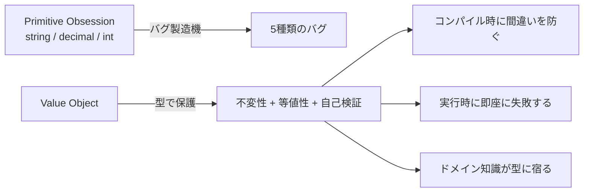
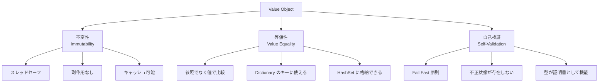
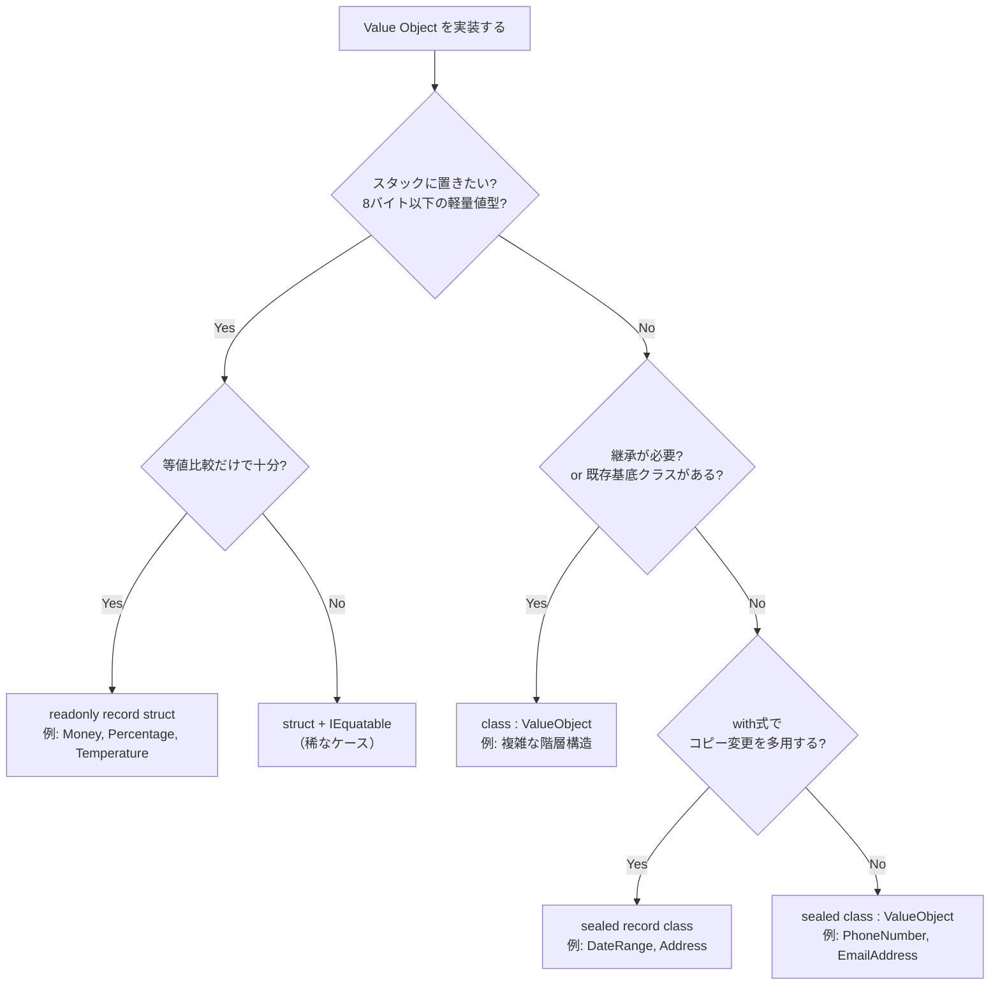
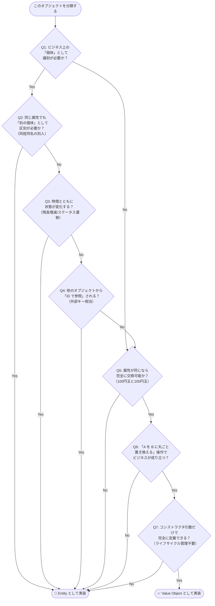
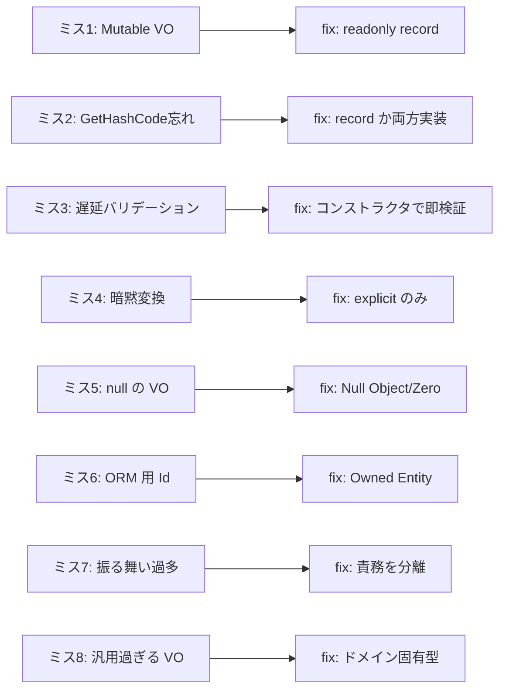

# 第7章: Value Object — ドメインの語彙を型で守る

> 「型は嘘をつかない。文字列は嘘をつく。」  
> — Eric Evans, "Domain-Driven Design" 講演より

---

## 0. TL;DR

Value Object（値オブジェクト）は、DDD の三大構成要素の一つであり、**ドメインの概念を型として表現する最も基本的な道具**です。本章を読み終えた後、以下のことができるようになります。

| Before（よくある誤り） | After（Value Object 適用後） |
|---|---|
| `string email` を引数で渡し回す | `EmailAddress email` で不正値が入る余地をゼロにする |
| `decimal amount` を加算して為替バグを起こす | `Money.Add()` が通貨不一致を例外で弾く |
| 住所の一部だけ更新して不整合を起こす | `Address` を丸ごと差し替えてアトミック性を保つ |
| `string startDate, string endDate` で逆転を見逃す | `DateRange` のコンストラクタが逆転を即座に拒否する |

**Value Object の 3 特性**:
1. **不変性（Immutability）**: 生成後に状態が変わらない
2. **等値性（Value Equality）**: 参照でなく値の中身で等価判定する
3. **自己検証（Self-Validation）**: 不正な状態を持つインスタンスが存在できない



---

## 1. Primitive Obsession が引き起こす 5 種類のバグ（実例コード付き）

Primitive Obsession（プリミティブ執着）とは、ドメインの概念をプリミティブ型（string, int, decimal など）で表現しすぎる設計上の臭いです。コードが「意味」を失い、バグの温床になります。

### 1.1 通貨の混在バグ：decimal + decimal で為替計算ミス

最もよく見るバグです。金額を `decimal` で管理すると、異なる通貨を誤って加算できてしまいます。

```csharp
// ❌ Primitive Obsession: 通貨の概念が失われている
public class OrderService
{
    // パラメータ名を見なければ JPY か USD かわからない
    public decimal CalculateTotal(decimal itemPriceJpy, decimal shippingCostUsd)
    {
        // コンパイルエラーにならない！ JPY + USD = 意味不明な数値
        return itemPriceJpy + shippingCostUsd;
    }
}

// 呼び出し側でも防げない
var total = service.CalculateTotal(1980m, 9.99m); // 1989.99 という無意味な値
Console.WriteLine($"合計: ¥{total}");              // ¥1989.99 → 請求書に印字される
```

このバグは型システムが沈黙していることが問題です。`decimal` は「数値」を表すだけで「通貨付き金額」を表しません。実際のプロジェクトでは、テスト環境で JPY 建てのサービスに USD 建ての運賃を加算し、本番での請求金額が数桁ずれた事故が発生しています。

```csharp
// ✅ Value Object で型として保護する
public readonly record struct Money
{
    public decimal Amount { get; }
    public Currency Currency { get; }

    public Money(decimal amount, Currency currency)
    {
        if (amount < 0) throw new ArgumentException("金額は0以上でなければなりません");
        Amount = amount;
        Currency = currency;
    }

    public Money Add(Money other)
    {
        if (Currency != other.Currency)
            throw new InvalidOperationException(
                $"異なる通貨同士を加算できません: {Currency} と {other.Currency}");
        return new Money(Amount + other.Amount, Currency);
    }
}

// 呼び出し側: 型がドキュメントになる
var itemPrice = new Money(1980m, Currency.JPY);
var shipping  = new Money(9.99m, Currency.USD);
var total     = itemPrice.Add(shipping); // ← InvalidOperationException 確定
// コンパイラは止められなくても、実行時に即座に失敗する（本番前に必ず発覚）
```

### 1.2 メール検証漏れバグ：string で受け取って検証なし

「あとで検証すればいい」という発想が遅延バグを生みます。

```csharp
// ❌ どの層でも検証していない
public class CustomerService
{
    public Customer CreateCustomer(string email, string name)
    {
        // email が "not-an-email" でもコンパイルエラーにならない
        // バリデーションをどこかでやるつもりだが、誰がやる？
        return new Customer(Guid.NewGuid(), email, name);
    }
}

// Controller 層でやるつもりが...
[HttpPost]
public IActionResult Create(CreateCustomerRequest request)
{
    // バリデーション属性を付け忘れた！
    // request.Email = "this-is-not-email" でも通ってしまう
    var customer = _service.CreateCustomer(request.Email, request.Name);
    return Ok();
}
```

このパターンで起きた実際のインシデント: 不正なメールアドレスが DB に保存され、メール送信バッチが毎晩エラーを出し続けた。発覚したのは 2 週間後。データの修復に 3 人日を要した。

```csharp
// ✅ EmailAddress は不正な値で生成できない
public sealed class EmailAddress
{
    private static readonly Regex Pattern =
        new(@"^[a-zA-Z0-9._%+\-]+@[a-zA-Z0-9.\-]+\.[a-zA-Z]{2,}$",
            RegexOptions.Compiled | RegexOptions.IgnoreCase);

    public string Value { get; }

    private EmailAddress(string value) => Value = value;

    public static EmailAddress Create(string value)
    {
        if (string.IsNullOrWhiteSpace(value))
            throw new ArgumentException("メールアドレスは空にできません");

        var normalized = value.Trim().ToLowerInvariant();

        if (!Pattern.IsMatch(normalized))
            throw new ArgumentException($"無効なメールアドレス形式です: {value}");

        return new EmailAddress(normalized);
    }
}
```

`EmailAddress.Create("invalid")` を呼んだ瞬間に例外が飛びます。DB まで到達しません。アーキテクチャ上のバリアが「型」として機能します。

### 1.3 電話番号フォーマットバグ：ハイフンあり/なし混在

```csharp
// ❌ 同じ電話番号が 3 種類の表記で DB に混在している
// 問い合わせ受付時: "090-1234-5678"
// LINE 連携時:      "09012345678"
// 手動入力時:        "0901234-5678"  (入力ミスだが通ってしまった)

public class CustomerSearchService
{
    public Customer? FindByPhone(string phoneNumber)
    {
        // どの形式でクエリする？ 3 パターンすべてで検索？
        return _db.Customers
            .FirstOrDefault(c => c.PhoneNumber == phoneNumber);
        // → 同一人物が 3 件ヒットしたり、0 件になったりする
    }
}
```

```csharp
// ✅ PhoneNumber で正規化を強制する
public sealed class PhoneNumber
{
    public string Value { get; }      // 正規化済み（ハイフンなし）: "09012345678"
    public string Formatted { get; } // 表示用（ハイフンあり）: "090-1234-5678"

    private PhoneNumber(string normalized, string formatted)
    {
        Value = normalized;
        Formatted = formatted;
    }

    public static PhoneNumber CreateJapanese(string input)
    {
        if (string.IsNullOrWhiteSpace(input))
            throw new ArgumentException("電話番号は空にできません");

        // ハイフン・スペース・括弧を除去
        var digits = Regex.Replace(input, @"[\s\-\(\)]", "");

        // 日本の電話番号: 10 or 11 桁
        if (!Regex.IsMatch(digits, @"^0\d{9,10}$"))
            throw new ArgumentException($"無効な電話番号形式です: {input}");

        // ハイフン付きフォーマット（携帯: 080-xxxx-xxxx）
        var formatted = digits.Length == 11
            ? $"{digits[..3]}-{digits[3..7]}-{digits[7..]}"
            : $"{digits[..2]}-{digits[2..6]}-{digits[6..]}";

        return new PhoneNumber(digits, formatted);
    }
}
// DB には常にハイフンなし 10〜11 桁のみが保存される
// → 検索クエリが単純になり、重複も発生しない
```

### 1.4 住所の部分更新バグ：郵便番号だけ変えて都道府県が不整合

```csharp
// ❌ 住所フィールドを個別に更新できてしまう
public class Customer
{
    public string PostalCode { get; set; }   // 郵便番号
    public string Prefecture { get; set; }  // 都道府県
    public string City { get; set; }        // 市区町村
    public string Line1 { get; set; }       // 番地
}

// 更新処理でバグ: 引越しで郵便番号だけ更新したが都道府県を忘れた
customer.PostalCode = "530-0001";  // 大阪市北区
// Prefecture, City, Line1 を更新し忘れ
// → 「〒530-0001 東京都港区...」という物理的に不正な住所が誕生
// → 配送業者のシステムでエラー、手動修正コスト発生

// 更に悪いことに: どこで更新を忘れたかのデバッグが困難
```

```csharp
// ✅ Address は丸ごと差し替えるしかない（部分更新不可）
public sealed record Address
{
    public string PostalCode { get; }
    public string Prefecture { get; }
    public string City { get; }
    public string Line1 { get; }
    public string? Line2 { get; }

    public Address(
        string postalCode,
        string prefecture,
        string city,
        string line1,
        string? line2 = null)
    {
        PostalCode = postalCode;    // 個別バリデーション
        Prefecture = prefecture;
        City = city;
        Line1 = line1;
        Line2 = line2;
        // 郵便番号と都道府県の整合性チェックも可能
    }
}

// Customer.Address は set がない（丸ごと差し替えのみ）
public class Customer : Entity<CustomerId>
{
    public Address ShippingAddress { get; private set; }

    // 新しい Address オブジェクトを渡すしかない
    // → 郵便番号だけ変えて都道府県を忘れる操作は物理的に不可能
    public void ChangeShippingAddress(Address newAddress)
    {
        ShippingAddress = newAddress; // newAddress は必ず整合性チェック済み
        RaiseDomainEvent(new ShippingAddressChangedEvent(Id, newAddress));
    }
}
```

### 1.5 日付範囲の逆転バグ：Start > End を許してしまう

```csharp
// ❌ キャンペーン期間が逆転していても気づかない
public class Campaign
{
    public DateTime StartDate { get; set; }
    public DateTime EndDate { get; set; }
}

// 入力ミスで逆転した状態が保存される（UI の日付ピッカーを逆に選択）
campaign.StartDate = new DateTime(2026, 12, 31);
campaign.EndDate   = new DateTime(2026,  1,  1); // 誰も気づかない

// IsActive チェックが永久に false を返す
bool isActive = DateTime.Now >= campaign.StartDate && DateTime.Now <= campaign.EndDate;
// → キャンペーンが「ある」のに「無効」として扱われる

// さらに複雑な計算をしている箇所で負の日数が発生
int duration = (campaign.EndDate - campaign.StartDate).Days; // -364
```

```csharp
// ✅ DateRange は逆転した状態で生成できない
public sealed record DateRange
{
    public DateOnly Start { get; }
    public DateOnly End { get; }

    public DateRange(DateOnly start, DateOnly end)
    {
        if (end < start)
            throw new ArgumentException(
                $"終了日({end:yyyy/MM/dd})は開始日({start:yyyy/MM/dd})より後でなければなりません");
        Start = start;
        End = end;
    }

    public int DurationInDays => End.DayNumber - Start.DayNumber + 1; // 常に 1 以上

    public bool Contains(DateOnly date) => date >= Start && date <= End;

    public bool Overlaps(DateRange other)
        => Start <= other.End && End >= other.Start;

    public bool IsActiveToday()
        => Contains(DateOnly.FromDateTime(DateTime.Today));
}
```

---

## 2. Value Object の 3 特性を徹底解説



### 2.1 不変性（Immutability）

**「なぜ変更メソッドを持ってはいけないか」**

Value Object が変更可能だと、以下の問題が起きます。

```csharp
// ❌ ミュータブルな Money（アンチパターン）
public class MutableMoney
{
    public decimal Amount { get; set; }
    public Currency Currency { get; set; }
}

// バグシナリオ: Entity A と Entity B が同じ Money インスタンスを共有している
var price = new MutableMoney { Amount = 1000m, Currency = Currency.JPY };
var orderA = new Order(price);  // 参照を保持
var orderB = new Order(price);  // 同じインスタンスを参照

// 誰かが値を変更すると...
price.Amount = 9999m;
// orderA.Price.Amount も 9999m になった！（意図しない副作用）
// マルチスレッド環境では競合状態まで発生する
```

不変性の利点は以下の 3 点です。

**スレッドセーフ**: 不変なオブジェクトはロック不要で複数スレッドから安全に参照できます。

```csharp
// ✅ イミュータブルな Money はどこから参照しても安全
var price = new Money(1000m, Currency.JPY);
// Thread 1 と Thread 2 が同時に price を参照しても問題なし
// → 読み取り専用なので競合が発生しない
```

**副作用なし**: あるメソッドに渡した Value Object が変更される心配がありません。

```csharp
// ✅ 操作は「新しいインスタンスを返す」
public readonly record struct Money
{
    public decimal Amount { get; }
    public Currency Currency { get; }

    public Money(decimal amount, Currency currency)
    {
        if (amount < 0)
            throw new ArgumentOutOfRangeException(nameof(amount), "金額は0以上");
        Amount = amount;
        Currency = currency;
    }

    // 加算: 新しい Money を返す（自身は変わらない）
    public Money Add(Money other)
    {
        EnsureSameCurrency(other);
        return new Money(Amount + other.Amount, Currency);  // 新しいインスタンス
    }

    public Money Subtract(Money other)
    {
        EnsureSameCurrency(other);
        var result = Amount - other.Amount;
        if (result < 0)
            throw new InvalidOperationException("結果が負になる減算はできません");
        return new Money(result, Currency);
    }

    public Money Multiply(decimal multiplier)
    {
        if (multiplier < 0)
            throw new ArgumentOutOfRangeException(nameof(multiplier));
        return new Money(Math.Round(Amount * multiplier, 2, MidpointRounding.AwayFromZero), Currency);
    }

    // 消費税計算
    public (Money net, Money tax) SplitWithTax(decimal taxRate = 0.1m)
    {
        var taxAmount = new Money(
            Math.Floor(Amount * taxRate * 100m) / 100m,
            Currency);
        return (this, taxAmount);
    }

    private void EnsureSameCurrency(Money other)
    {
        if (Currency != other.Currency)
            throw new InvalidOperationException(
                $"通貨が一致しません: {Currency} vs {other.Currency}");
    }

    public override string ToString()
        => Currency.Code switch
        {
            "JPY" => $"¥{Amount:N0}",
            "USD" => $"${Amount:N2}",
            "EUR" => $"€{Amount:N2}",
            _     => $"{Amount:N2} {Currency.Code}",
        };
}
```

### 2.2 等値性（Value Equality）

**「参照等価 vs 値等価」**

C# で `class` を使うと、デフォルトでは参照等価（同じメモリアドレスかどうか）で比較されます。

```csharp
// ❌ class の場合: 参照等価がデフォルト
var email1 = new EmailAddress("user@example.com");
var email2 = new EmailAddress("user@example.com");
Console.WriteLine(email1 == email2);       // false！ 同じ値なのに
Console.WriteLine(email1.Equals(email2));  // false！

// HashSet や Dictionary のキーとして使うと地獄になる
var uniqueEmails = new HashSet<EmailAddress>();
uniqueEmails.Add(email1);
uniqueEmails.Add(email2);
Console.WriteLine(uniqueEmails.Count); // 2 (本来は 1 であるべき)

// LINQ の Distinct も機能しない
var emails = new[] { email1, email2 };
emails.Distinct().Count(); // 2 (本来は 1 であるべき)
```

**C# の `==` 演算子の罠**を完全に解説します。

```csharp
// C# での == の挙動まとめ
string s1 = "hello";
string s2 = "hello";
s1 == s2; // true（string は == をオーバーライド済み）

object o1 = new object();
object o2 = new object();
o1 == o2; // false（参照比較）

// Value Object を class で実装する場合は自分でオーバーライドが必要
public class EmailAddress
{
    public string Value { get; }

    // ① Equals をオーバーライド
    public override bool Equals(object? obj)
        => obj is EmailAddress other && Value == other.Value;

    // ② Equals をオーバーライドしたら GetHashCode も必須（lint が警告する）
    public override int GetHashCode()
        => Value.GetHashCode(StringComparison.OrdinalIgnoreCase);

    // ③ == / != 演算子もオーバーライド（忘れがち！）
    public static bool operator ==(EmailAddress? left, EmailAddress? right)
    {
        if (left is null && right is null) return true;
        if (left is null || right is null) return false;
        return left.Value == right.Value;
    }

    public static bool operator !=(EmailAddress? left, EmailAddress? right)
        => !(left == right);
}
```

**record / record struct を使えばこれらが不要になります**（詳細は §6 で解説）。

### 2.3 自己検証（Self-Validation）

**「なぜコンストラクタでバリデートするのか」**

遅延検証（Late Validation）の危険性を見てみましょう。

```csharp
// ❌ Late Validation: 不正な状態が長時間存在できる
public class Order
{
    public string CustomerEmail { get; set; }  // 不正値を持てる
    public decimal TotalAmount { get; set; }    // 負の値を持てる
    public string Status { get; set; }          // "INVALID_STATUS" でも持てる
}

// バリデーションはサービス層の Validate() メソッドで行う設計
public class OrderService
{
    public void PlaceOrder(Order order)
    {
        if (!_validator.Validate(order).IsValid)  // ← ここで気づく（遅すぎる）
            throw new ValidationException(...);

        // バリデーションを呼び忘れた別のメソッドからは不正 Order が通ってしまう
    }
}
```

コードが成長するにつれ、`Validate()` の呼び出しを忘れる箇所が生まれます。

```csharp
// ✅ コンストラクタで即座に検証（Fail Fast 原則）
public sealed class OrderTotalAmount
{
    public decimal Value { get; }
    public Currency Currency { get; }

    // コンストラクタが唯一の生成手段
    public OrderTotalAmount(decimal value, Currency currency)
    {
        // 1. 型レベルのチェック（null はコンパイラが弾く）

        // 2. 範囲チェック
        if (value < 0)
            throw new ArgumentOutOfRangeException(nameof(value),
                $"注文合計金額は0以上でなければなりません。受け取った値: {value}");

        // 3. 通貨の存在確認
        ArgumentNullException.ThrowIfNull(currency);

        // 4. 精度チェック（通貨によって異なる）
        var precision = currency.DecimalPlaces;
        var rounded = Math.Round(value, precision);
        if (value != rounded)
            throw new ArgumentException(
                $"{currency.Code} は小数点以下 {precision} 桁までです。受け取った値: {value}");

        Value = value;
        Currency = currency;
    }
}
```

コンストラクタでバリデーションすることで、**システム内のどこに `OrderTotalAmount` インスタンスが存在しても、それは必ず正規化済みの正当な状態**であることが保証されます。これが「型が証明書として機能する」という意味です。

---

## 3. Value Object カタログ（完全実装）

### 3.1 Money — 算術演算・通貨チェック・フォーマット・比較

```csharp
/// <summary>
/// 通貨付き金額を表す Value Object。
/// スレッドセーフ、イミュータブル、自己検証済み。
/// </summary>
public readonly record struct Money : IComparable<Money>
{
    public decimal Amount { get; }
    public Currency Currency { get; }

    // よく使う通貨のファクトリメソッド
    public static Money Zero(Currency currency) => new(0m, currency);
    public static Money JPY(decimal amount)     => new(amount, Currency.JPY);
    public static Money USD(decimal amount)     => new(amount, Currency.USD);
    public static Money EUR(decimal amount)     => new(amount, Currency.EUR);

    public Money(decimal amount, Currency currency)
    {
        ArgumentNullException.ThrowIfNull(currency);
        if (amount < 0)
            throw new ArgumentOutOfRangeException(nameof(amount),
                $"金額は 0 以上でなければなりません。受け取った値: {amount}");

        // 通貨ごとの小数点精度を強制
        Amount = currency.Code switch
        {
            "JPY" => Math.Round(amount, 0, MidpointRounding.AwayFromZero),
            "USD" or "EUR" => Math.Round(amount, 2, MidpointRounding.AwayFromZero),
            _ => Math.Round(amount, 2, MidpointRounding.AwayFromZero),
        };
        Currency = currency;
    }

    // ── 算術演算 ──────────────────────────────────────────────────────────
    public Money Add(Money other)
    {
        EnsureSameCurrency(other);
        return new Money(Amount + other.Amount, Currency);
    }

    public static Money operator +(Money left, Money right) => left.Add(right);

    public Money Subtract(Money other)
    {
        EnsureSameCurrency(other);
        var result = Amount - other.Amount;
        if (result < 0) throw new InvalidOperationException(
            $"{this} から {other} を引くと負になります");
        return new Money(result, Currency);
    }

    public static Money operator -(Money left, Money right) => left.Subtract(right);

    public Money Multiply(decimal factor)
    {
        if (factor < 0) throw new ArgumentOutOfRangeException(nameof(factor));
        return new Money(Amount * factor, Currency);
    }

    public static Money operator *(Money money, decimal factor) => money.Multiply(factor);

    // ── 税計算 ────────────────────────────────────────────────────────────
    public (Money net, Money tax) SplitWithTax(decimal taxRate = 0.10m)
    {
        if (taxRate is < 0 or > 1)
            throw new ArgumentOutOfRangeException(nameof(taxRate), "税率は 0〜1 の範囲");
        var tax = new Money(Math.Floor(Amount * taxRate * 100m) / 100m, Currency);
        return (this, tax);
    }

    // ── 比較 ──────────────────────────────────────────────────────────────
    public int CompareTo(Money other)
    {
        EnsureSameCurrency(other);
        return Amount.CompareTo(other.Amount);
    }

    public static bool operator <(Money left, Money right)  => left.CompareTo(right) < 0;
    public static bool operator >(Money left, Money right)  => left.CompareTo(right) > 0;
    public static bool operator <=(Money left, Money right) => left.CompareTo(right) <= 0;
    public static bool operator >=(Money left, Money right) => left.CompareTo(right) >= 0;

    // ── フォーマット ──────────────────────────────────────────────────────
    public override string ToString()
        => Currency.Code switch
        {
            "JPY" => $"¥{Amount:N0}",
            "USD" => $"${Amount:N2}",
            "EUR" => $"€{Amount:N2}",
            _     => $"{Amount:N2} {Currency.Code}",
        };

    // ── プライベートヘルパー ──────────────────────────────────────────────
    private void EnsureSameCurrency(Money other)
    {
        if (Currency != other.Currency)
            throw new InvalidOperationException(
                $"通貨が一致しません: {Currency.Code} vs {other.Currency.Code}");
    }
}
```

### 3.2 EmailAddress — RFC5322 準拠の検証・正規化

```csharp
/// <summary>
/// メールアドレスを表す Value Object。
/// RFC 5322 準拠、正規化済み（小文字）。
/// </summary>
public sealed class EmailAddress : IEquatable<EmailAddress>
{
    // 実用的な正規表現（完全な RFC 5322 は数百行になるため）
    private static readonly Regex EmailRegex = new(
        @"^(?:[a-zA-Z0-9!#$%&'*+/=?^_`{|}~-]+"
        + @"(?:\.[a-zA-Z0-9!#$%&'*+/=?^_`{|}~-]+)*)"
        + @"@(?:[a-zA-Z0-9](?:[a-zA-Z0-9-]*[a-zA-Z0-9])?\.)+"
        + @"[a-zA-Z]{2,}$",
        RegexOptions.Compiled | RegexOptions.IgnoreCase);

    public string Value { get; }
    public string LocalPart  => Value[..Value.IndexOf('@')];
    public string Domain     => Value[(Value.IndexOf('@') + 1)..];

    private EmailAddress(string value) => Value = value;

    public static EmailAddress Create(string value)
    {
        ArgumentNullException.ThrowIfNull(value);

        var trimmed = value.Trim();

        if (trimmed.Length == 0)
            throw new ArgumentException("メールアドレスは空にできません", nameof(value));

        if (trimmed.Length > 320)  // RFC 5321 の最大長
            throw new ArgumentException("メールアドレスが長すぎます（最大 320 文字）", nameof(value));

        var normalized = trimmed.ToLowerInvariant();

        if (!EmailRegex.IsMatch(normalized))
            throw new ArgumentException($"無効なメールアドレス形式です: '{value}'", nameof(value));

        // ローカルパートの長さチェック（RFC 5321: 64 文字）
        if (normalized[..normalized.IndexOf('@')].Length > 64)
            throw new ArgumentException("ローカルパートが長すぎます（最大 64 文字）", nameof(value));

        return new EmailAddress(normalized);
    }

    // ── 等値性 ────────────────────────────────────────────────────────────
    public bool Equals(EmailAddress? other) => other is not null && Value == other.Value;
    public override bool Equals(object? obj) => obj is EmailAddress e && Equals(e);
    public override int GetHashCode() => Value.GetHashCode(StringComparison.Ordinal);
    public override string ToString() => Value;

    public static bool operator ==(EmailAddress? left, EmailAddress? right)
        => left?.Value == right?.Value;
    public static bool operator !=(EmailAddress? left, EmailAddress? right)
        => !(left == right);

    // 明示的変換のみ（暗黙変換は型安全性を壊すため禁止）
    public static explicit operator string(EmailAddress email) => email.Value;
}
```

### 3.3 PhoneNumber — E.164 形式・国コード

```csharp
/// <summary>
/// 電話番号を表す Value Object。
/// 正規化済み（ハイフンなし）で保持し、表示用にフォーマットする。
/// </summary>
public sealed class PhoneNumber : IEquatable<PhoneNumber>
{
    public string E164 { get; }           // E.164 形式: "+819012345678"
    public string CountryCode { get; }    // "+81"
    public string NationalNumber { get; } // "9012345678"

    private PhoneNumber(string e164, string countryCode, string nationalNumber)
    {
        E164 = e164;
        CountryCode = countryCode;
        NationalNumber = nationalNumber;
    }

    public static PhoneNumber CreateJapanese(string input)
    {
        if (string.IsNullOrWhiteSpace(input))
            throw new ArgumentException("電話番号は必須です");

        var digits = Regex.Replace(input, @"[\s\-\+\(\)]", "");

        // 国際形式（81xxxxxxxxxx）の場合は先頭 0 を補完
        if (digits.StartsWith("81") && digits.Length >= 11)
            digits = "0" + digits[2..];

        if (!Regex.IsMatch(digits, @"^0\d{9,10}$"))
            throw new ArgumentException($"無効な日本の電話番号です: '{input}'");

        var nationalNumber = digits[1..]; // 先頭の 0 を除く
        var e164 = "+81" + nationalNumber;

        return new PhoneNumber(e164, "+81", nationalNumber);
    }

    public string FormatForDisplay()
    {
        var local = "0" + NationalNumber;
        // 携帯（080/090/070）
        if (Regex.IsMatch(local, @"^0[789]0\d{8}$"))
            return $"{local[..3]}-{local[3..7]}-{local[7..]}";
        // 固定（東京 03/大阪 06）
        if (local.StartsWith("03") || local.StartsWith("06"))
            return $"{local[..2]}-{local[2..6]}-{local[6..]}";
        // その他（5桁市外局番等）
        return local;
    }

    public bool Equals(PhoneNumber? other) => other is not null && E164 == other.E164;
    public override bool Equals(object? obj) => obj is PhoneNumber p && Equals(p);
    public override int GetHashCode() => E164.GetHashCode(StringComparison.Ordinal);
    public override string ToString() => FormatForDisplay();
}
```

### 3.4 Address — 郵便番号検証・フォーマット

```csharp
/// <summary>
/// 日本の住所を表す Value Object。
/// 郵便番号の形式を検証し、都道府県を列挙値で保護する。
/// </summary>
public sealed record Address
{
    private static readonly HashSet<string> ValidPrefectures = new()
    {
        "北海道", "青森県", "岩手県", "宮城県", "秋田県", "山形県", "福島県",
        "茨城県", "栃木県", "群馬県", "埼玉県", "千葉県", "東京都", "神奈川県",
        "新潟県", "富山県", "石川県", "福井県", "山梨県", "長野県", "岐阜県",
        "静岡県", "愛知県", "三重県", "滋賀県", "京都府", "大阪府", "兵庫県",
        "奈良県", "和歌山県", "鳥取県", "島根県", "岡山県", "広島県", "山口県",
        "徳島県", "香川県", "愛媛県", "高知県", "福岡県", "佐賀県", "長崎県",
        "熊本県", "大分県", "宮崎県", "鹿児島県", "沖縄県"
    };

    public string PostalCode { get; }   // "530-0001"（正規化済み）
    public string Prefecture { get; }  // "大阪府"
    public string City { get; }        // "大阪市北区"
    public string Line1 { get; }       // "梅田1-1-1"
    public string? Line2 { get; }      // "〇〇ビル 5F"（省略可）

    public Address(
        string postalCode,
        string prefecture,
        string city,
        string line1,
        string? line2 = null)
    {
        PostalCode = NormalizePostalCode(postalCode);
        Prefecture = ValidatePrefecture(prefecture);
        City  = Require(city, "市区町村");
        Line1 = Require(line1, "番地");
        Line2 = line2?.Trim();
    }

    private static string NormalizePostalCode(string value)
    {
        if (string.IsNullOrWhiteSpace(value))
            throw new ArgumentException("郵便番号は必須です");
        var digits = Regex.Replace(value, @"[-\s]", "");
        if (!Regex.IsMatch(digits, @"^\d{7}$"))
            throw new ArgumentException($"郵便番号は7桁の数字でなければなりません: '{value}'");
        return $"{digits[..3]}-{digits[3..]}";
    }

    private static string ValidatePrefecture(string value)
    {
        if (!ValidPrefectures.Contains(value))
            throw new ArgumentException($"無効な都道府県名です: '{value}'");
        return value;
    }

    private static string Require(string value, string fieldName)
    {
        if (string.IsNullOrWhiteSpace(value))
            throw new ArgumentException($"{fieldName}は必須です");
        return value.Trim();
    }

    public override string ToString()
        => $"〒{PostalCode} {Prefecture}{City}{Line1}"
           + (Line2 is not null ? $" {Line2}" : "");
}
```

### 3.5 DateRange — 重複チェック・含有チェック・期間計算

```csharp
/// <summary>
/// 日付範囲を表す Value Object。
/// Start &lt;= End を型レベルで保証する。
/// </summary>
public sealed record DateRange
{
    public DateOnly Start { get; }
    public DateOnly End { get; }
    public int DurationInDays => End.DayNumber - Start.DayNumber + 1;

    public DateRange(DateOnly start, DateOnly end)
    {
        if (end < start)
            throw new ArgumentException(
                $"終了日({end:yyyy/MM/dd})は開始日({start:yyyy/MM/dd})より後でなければなりません");
        Start = start;
        End = end;
    }

    // ── ファクトリメソッド ───────────────────────────────────────────────
    public static DateRange Of(DateOnly start, DateOnly end) => new(start, end);
    public static DateRange SingleDay(DateOnly date)         => new(date, date);
    public static DateRange Today()
    {
        var t = DateOnly.FromDateTime(DateTime.Today);
        return new DateRange(t, t);
    }
    public static DateRange ThisMonth()
    {
        var today = DateOnly.FromDateTime(DateTime.Today);
        var start = new DateOnly(today.Year, today.Month, 1);
        var end   = start.AddMonths(1).AddDays(-1);
        return new DateRange(start, end);
    }

    // ── 述語 ────────────────────────────────────────────────────────────
    public bool Contains(DateOnly date)    => date >= Start && date <= End;
    public bool Contains(DateRange other)  => Start <= other.Start && End >= other.End;
    public bool Overlaps(DateRange other)  => Start <= other.End && End >= other.Start;
    public bool IsActiveToday()            => Contains(DateOnly.FromDateTime(DateTime.Today));

    // ── 集合演算 ────────────────────────────────────────────────────────
    public DateRange? Intersection(DateRange other)
    {
        var start = Start > other.Start ? Start : other.Start;
        var end   = End   < other.End   ? End   : other.End;
        return start <= end ? new DateRange(start, end) : null;
    }

    public IEnumerable<DateRange> Subtract(DateRange other)
    {
        if (!Overlaps(other)) { yield return this; yield break; }
        if (Start < other.Start)
            yield return new DateRange(Start, other.Start.AddDays(-1));
        if (End > other.End)
            yield return new DateRange(other.End.AddDays(1), End);
    }

    // ── IEnumerable ─────────────────────────────────────────────────────
    public IEnumerable<DateOnly> EachDay()
    {
        for (var d = Start; d <= End; d = d.AddDays(1))
            yield return d;
    }

    public override string ToString()
        => Start == End
            ? Start.ToString("yyyy/MM/dd")
            : $"{Start:yyyy/MM/dd} 〜 {End:yyyy/MM/dd}（{DurationInDays}日間）";
}
```

### 3.6 Percentage — 0〜100 範囲・演算

```csharp
/// <summary>
/// パーセンテージを表す Value Object。
/// 0 〜 100 の範囲を型レベルで保証する。
/// </summary>
public readonly record struct Percentage : IComparable<Percentage>
{
    public decimal Value { get; }  // 0.00 ～ 100.00

    public Percentage(decimal value)
    {
        if (value < 0m || value > 100m)
            throw new ArgumentOutOfRangeException(nameof(value),
                $"パーセンテージは 0 〜 100 の範囲でなければなりません: {value}");
        Value = Math.Round(value, 2, MidpointRounding.AwayFromZero);
    }

    public decimal AsDecimalFraction => Value / 100m;

    public Money ApplyTo(Money money) => money.Multiply(AsDecimalFraction);

    public static Percentage operator +(Percentage l, Percentage r) => new(l.Value + r.Value);
    public static Percentage operator -(Percentage l, Percentage r)
    {
        if (r.Value > l.Value) throw new InvalidOperationException("結果が負になります");
        return new(l.Value - r.Value);
    }

    public int CompareTo(Percentage other) => Value.CompareTo(other.Value);

    public static readonly Percentage Zero    = new(0m);
    public static readonly Percentage Full    = new(100m);
    public static readonly Percentage TaxRate = new(10m); // 日本の消費税率

    public override string ToString() => $"{Value:N2}%";
}
```

### 3.7 型安全な ID — OrderId / CustomerId / ProductId

型安全 ID（Strongly Typed ID パターン）は Value Object の中でも特殊なカテゴリです。

```csharp
// ── 基底型 ────────────────────────────────────────────────────────────────
public abstract record TypedId<TSelf>(Guid Value)
    where TSelf : TypedId<TSelf>
{
    public bool IsEmpty => Value == Guid.Empty;

    public override string ToString() => Value.ToString("D");
}

// ── 具体的な ID 型 ─────────────────────────────────────────────────────────
public sealed record CustomerId(Guid Value) : TypedId<CustomerId>(Value)
{
    public static CustomerId New()              => new(Guid.NewGuid());
    public static CustomerId From(Guid value)   => new(value);
    public static CustomerId From(string value) => new(Guid.Parse(value));
}

public sealed record OrderId(Guid Value) : TypedId<OrderId>(Value)
{
    public static OrderId New()              => new(Guid.NewGuid());
    public static OrderId From(Guid value)   => new(value);
    public static OrderId From(string value) => new(Guid.Parse(value));
}

public sealed record ProductId(Guid Value) : TypedId<ProductId>(Value)
{
    public static ProductId New()              => new(Guid.NewGuid());
    public static ProductId From(Guid value)   => new(value);
    public static ProductId From(string value) => new(Guid.Parse(value));
}

// ── 使用例: OrderId と CustomerId を混同できない ──────────────────────────
public class Order
{
    public OrderId    Id         { get; }
    public CustomerId CustomerId { get; }

    public Order(OrderId id, CustomerId customerId)
    {
        Id         = id;
        CustomerId = customerId;
    }
}

// コンパイルエラー: OrderId に CustomerId を渡せない
var order = new Order(
    id:         OrderId.New(),
    customerId: OrderId.New()  // ← CS1503 コンパイルエラー！ 型が違う
);
```

---

## 4. Value Object 基底クラスの設計（完全実装）

### 4.1 class ベースの ValueObject 基底クラス

`record` が使えない環境（.NET Framework, 古いコードベースとの互換性）では、基底クラスを用います。

```csharp
/// <summary>
/// Value Object の基底クラス。
/// Equals / GetHashCode / == / != を GetEqualityComponents を通して自動実装します。
/// </summary>
public abstract class ValueObject : IEquatable<ValueObject>
{
    /// <summary>
    /// 等値比較に使用するコンポーネントを返します。
    /// 実装クラスはすべての重要フィールドを列挙してください。
    /// </summary>
    protected abstract IEnumerable<object?> GetEqualityComponents();

    public bool Equals(ValueObject? other)
    {
        if (other is null) return false;
        if (ReferenceEquals(this, other)) return true;
        if (GetType() != other.GetType()) return false;  // サブクラスを別型として扱う
        return GetEqualityComponents()
            .SequenceEqual(other.GetEqualityComponents());
    }

    public override bool Equals(object? obj)
        => obj is ValueObject vo && Equals(vo);

    public override int GetHashCode()
    {
        // FNV-1a ライクなハッシュ結合
        return GetEqualityComponents()
            .Where(c => c is not null)
            .Aggregate(
                seed: 17,
                func: (hash, component) => hash * 31 + (component?.GetHashCode() ?? 0));
    }

    public static bool operator ==(ValueObject? left, ValueObject? right)
    {
        if (left is null && right is null) return true;
        if (left is null || right is null) return false;
        return left.Equals(right);
    }

    public static bool operator !=(ValueObject? left, ValueObject? right)
        => !(left == right);
}

// ── 使用例 ──────────────────────────────────────────────────────────────────
public sealed class Money : ValueObject
{
    public decimal Amount { get; }
    public Currency Currency { get; }

    public Money(decimal amount, Currency currency)
    {
        if (amount < 0) throw new ArgumentOutOfRangeException(nameof(amount));
        Amount = amount;
        Currency = currency;
    }

    protected override IEnumerable<object?> GetEqualityComponents()
    {
        yield return Amount;
        yield return Currency;
    }

    // 変換メソッド
    public Money Add(Money other)
    {
        if (Currency != other.Currency)
            throw new InvalidOperationException("通貨が一致しません");
        return new Money(Amount + other.Amount, Currency);
    }
}
```

### 4.2 record struct vs class vs record class の使い分け



| 型 | ヒープ/スタック | 等値比較 | with式 | 継承 | 推奨用途 |
|---|---|---|---|---|---|
| `readonly record struct` | スタック | 自動（値等価） | 可 | 不可 | 軽量な値（Money, Percentage） |
| `sealed record class` | ヒープ | 自動（値等価） | 可 | 不可 | 中程度の複雑さ（DateRange, Address） |
| `sealed class : ValueObject` | ヒープ | 基底で実装 | 不可 | 不可 | 複雑なバリデーション（EmailAddress） |
| `class : ValueObject` | ヒープ | 基底で実装 | 不可 | 可 | 既存基底クラスとの統合 |

### 4.3 IComparable の実装が必要なケース

IComparable は「順序」が意味を持つ Value Object にのみ実装します。

```csharp
// ❌ 順序が意味をなさない Value Object に IComparable は不要
// EmailAddress は「大きい/小さい」という概念がないため実装しない

// ✅ 順序が意味を持つ Value Object
public readonly record struct Money : IComparable<Money>
{
    public int CompareTo(Money other)
    {
        if (Currency != other.Currency)
            throw new InvalidOperationException("異なる通貨間の比較はできません");
        return Amount.CompareTo(other.Amount);
    }
}

// ULID ベース（生成時刻でソート可能な ID）
public sealed record OrderId : IComparable<OrderId>
{
    public string Value { get; }

    public static OrderId New() => new(Ulid.NewUlid().ToString());

    public OrderId(string value)
    {
        if (!Ulid.TryParse(value, out _))
            throw new ArgumentException($"無効な ULID: {value}");
        Value = value;
    }

    // ULID は辞書順 = 時刻順なので文字列比較で OK
    public int CompareTo(OrderId? other)
        => other is null ? 1
            : string.Compare(Value, other.Value, StringComparison.Ordinal);

    public DateTime CreatedAt => Ulid.Parse(Value).Time.UtcDateTime;

    public static bool operator <(OrderId a, OrderId b)  => a.CompareTo(b) < 0;
    public static bool operator >(OrderId a, OrderId b)  => a.CompareTo(b) > 0;
    public static bool operator <=(OrderId a, OrderId b) => a.CompareTo(b) <= 0;
    public static bool operator >=(OrderId a, OrderId b) => a.CompareTo(b) >= 0;
}
```

---

## 5. Value Object vs Entity の判断フローチャート（詳細版）



### 15 の判断質問と答え（完全版）

| # | 質問 | Yes → | No → |
|---|---|---|---|
| 1 | ビジネス上の「個体」として識別される？ | Entity 候補 | VO 候補 |
| 2 | 同じ属性の別インスタンスを区別する必要がある？ | Entity | VO |
| 3 | 時間とともに状態が変化する？ | Entity | VO |
| 4 | 他オブジェクトから ID で参照される？ | Entity | VO |
| 5 | 属性が同じなら完全に交換可能？ | VO | Entity |
| 6 | A から B へ丸ごと置き換えて問題ない？ | VO | Entity 再考 |
| 7 | ライフサイクル管理が必要？（生成・変更・削除） | Entity | VO |
| 8 | ドメインエキスパートが「属性」として語る？ | VO | Entity |
| 9 | DB で独立したテーブルとして識別される必要がある？ | Entity | VO |
| 10 | ドメインイベントを自ら発行する必要がある？ | Entity | VO |
| 11 | 他の集約から「ID だけ」で参照される？ | Entity（集約ルート） | VO |
| 12 | 「削除」という操作がビジネス上意味を持つ？ | Entity | VO |
| 13 | テストで「この個体の変化」を追跡する？ | Entity | VO |
| 14 | 計算の単位・測定値・記述に過ぎない？ | VO | Entity |
| 15 | コンストラクタ引数で完全に定義できる？ | VO | Entity |

**具体例で確認**:

| 概念 | 判断 | 理由 |
|---|---|---|
| 金額（¥1,980） | VO | 別の ¥1,980 と交換可能、状態変化なし |
| メールアドレス | VO | 測定値・記述、交換可能 |
| 顧客 | Entity | 同名でも別人、住所が変わっても同じ人 |
| 注文 | Entity | ステータスが変化、固有のライフサイクル |
| 注文明細 | VO or Entity | コンテキストによる（数量変更が必要なら Entity） |
| 配送先住所 | VO | 顧客の属性として、丸ごと差し替えが自然 |
| 配送拠点 | Entity | 倉庫は固有の存在、独自のライフサイクル |

---

## 6. C# 9+ の record を使った Value Object

### 6.1 record を使うメリット・デメリット

```csharp
// record の自動生成コード（参考: コンパイラが生成するもの）
// public sealed record Money(decimal Amount, Currency Currency) は以下を自動生成:
// - コンストラクタ
// - Equals(Money other) → Amount と Currency の値比較
// - GetHashCode()
// - ToString() → "Money { Amount = 1980, Currency = JPY }" 形式
// - Deconstruct(out decimal Amount, out Currency Currency)
// - Clone() (with式用)
```

**メリット**:
- `Equals` / `GetHashCode` / `ToString` が自動生成される
- `with` 式でコピー＆変更が簡単
- デコンストラクタが自動生成される
- イミュータビリティがデフォルト（`init` プロパティ）

**デメリット**:
- バリデーションの置き場所が限られる
- `sealed` を忘れると等値比較が壊れるリスク
- `record struct` は値型のため、大きな構造体はコピーコストが高い
- Newtonsoft.Json との互換性に注意（`System.Text.Json` を推奨）

### 6.2 with 式とイミュータビリティ

```csharp
public sealed record Address(
    string PostalCode,
    string Prefecture,
    string City,
    string Line1,
    string? Line2 = null);

// with 式で「変更を加えたコピー」を作成（元のインスタンスは変わらない）
var original = new Address("530-0001", "大阪府", "大阪市北区", "梅田1-1-1");
var updated  = original with { Line2 = "〇〇ビル 5F" };

Console.WriteLine(original.Line2); // null（変わっていない）
Console.WriteLine(updated.Line2);  // "〇〇ビル 5F"
```

**with 式とバリデーションの注意点**:

```csharp
// ⚠️ プライマリコンストラクタのバリデーションは with 式でも走る
public sealed record Money(decimal Amount, Currency Currency)
{
    // プライマリコンストラクタ内に初期化ロジックを書く
    public Money : this(
        Amount >= 0 ? Amount : throw new ArgumentOutOfRangeException(nameof(Amount)),
        Currency)
    { }
}

// ✅ より確実: init アクセサでバリデーション
public sealed record Money
{
    private decimal _amount;
    public decimal Amount
    {
        get => _amount;
        init => _amount = value >= 0
            ? value
            : throw new ArgumentOutOfRangeException(nameof(value), "金額は0以上");
    }
    public required Currency Currency { get; init; }
}

// with 式でもバリデーションが走る
var valid   = new Money { Amount = 100m, Currency = Currency.JPY };
var invalid = valid with { Amount = -999m }; // ← ArgumentOutOfRangeException!
```

### 6.3 検証ロジックの置き場所（3 パターン比較）

```csharp
// パターン 1: init アクセサ（with式でも検証が走る、推奨）
public sealed record PhoneNumber
{
    private string _value = default!;
    public string Value
    {
        get => _value;
        init
        {
            var digits = Regex.Replace(value ?? "", @"[\s\-\(\)]", "");
            if (!Regex.IsMatch(digits, @"^0\d{9,10}$"))
                throw new ArgumentException($"無効な電話番号: {value}");
            _value = digits;
        }
    }
}

// パターン 2: static Create + private コンストラクタ（最も制御しやすい）
public sealed class EmailAddress
{
    public string Value { get; }
    private EmailAddress(string value) => Value = value;

    public static EmailAddress Create(string value)
    {
        // 好きなだけ複雑なバリデーションを書ける
        if (string.IsNullOrWhiteSpace(value)) throw new ...;
        var normalized = value.Trim().ToLowerInvariant();
        if (!Pattern.IsMatch(normalized)) throw new ...;
        return new EmailAddress(normalized);
    }
}

// パターン 3: record + コンストラクタ本体（プライマリコンストラクタと組み合わせ）
public sealed record Money(decimal Amount, Currency Currency)
{
    // コンパイラがプライマリコンストラクタを生成する前に追加のチェック
    // C# 12+: プライマリコンストラクタ + コンストラクタ本体は非対応
    // → パターン 1 か 2 を使う方が安全
}
```

---

## 7. ORM（EF Core）での Value Object 永続化

### 7.1 Owned Entity Type（最推奨）

EF Core で Value Object を永続化する最もクリーンな方法です。同一テーブルに列として格納されます。

```csharp
// ── ドメインモデル ─────────────────────────────────────────────────────────
public class Customer : Entity<CustomerId>
{
    public string Name { get; private set; }
    public EmailAddress Email { get; private set; }
    public Address? ShippingAddress { get; private set; }

    // ORM 用 protected コンストラクタ（EF Core がリフレクションで呼ぶ）
    protected Customer() { }

    public Customer(CustomerId id, string name, EmailAddress email)
        : base(id)
    {
        Name  = name;
        Email = email;
    }
}

// ── EF Core 設定 ──────────────────────────────────────────────────────────
public class CustomerConfiguration : IEntityTypeConfiguration<Customer>
{
    public void Configure(EntityTypeBuilder<Customer> builder)
    {
        builder.ToTable("customers");
        builder.HasKey(c => c.Id);

        // CustomerId (Guid ラッパー) の変換
        builder.Property(c => c.Id)
            .HasConversion(
                id => id.Value,
                value => CustomerId.From(value))
            .HasColumnName("id");

        // EmailAddress を "email" 列に
        builder.OwnsOne(c => c.Email, email =>
        {
            email.Property(e => e.Value)
                 .HasColumnName("email")
                 .HasMaxLength(320)
                 .IsRequired();
        });

        // Address を複数列に
        builder.OwnsOne(c => c.ShippingAddress, addr =>
        {
            addr.Property(a => a.PostalCode)
                .HasColumnName("shipping_postal_code")
                .HasMaxLength(8)
                .IsRequired(false);
            addr.Property(a => a.Prefecture)
                .HasColumnName("shipping_prefecture")
                .HasMaxLength(10);
            addr.Property(a => a.City)
                .HasColumnName("shipping_city")
                .HasMaxLength(100);
            addr.Property(a => a.Line1)
                .HasColumnName("shipping_line1")
                .HasMaxLength(200);
            addr.Property(a => a.Line2)
                .HasColumnName("shipping_line2")
                .HasMaxLength(200)
                .IsRequired(false);
        });
    }
}
```

生成される SQL テーブル:

```sql
CREATE TABLE customers (
    id                    UUID         NOT NULL PRIMARY KEY,
    name                  VARCHAR(200) NOT NULL,
    email                 VARCHAR(320) NOT NULL,
    shipping_postal_code  VARCHAR(8),
    shipping_prefecture   VARCHAR(10),
    shipping_city         VARCHAR(100),
    shipping_line1        VARCHAR(200),
    shipping_line2        VARCHAR(200)
);
```

### 7.2 Value Converter

型安全 ID のような「単一値のラッパー」に使います。

```csharp
// CustomerId を DB では Guid として保存/復元
modelBuilder.Entity<Customer>()
    .Property(c => c.Id)
    .HasConversion(
        id    => id.Value,                 // Entity → DB: Guid
        value => CustomerId.From(value)    // DB → Entity: CustomerId
    );

// Money → 単一通貨のサービスなら 1 列で保存可能
var moneyConverter = new ValueConverter<Money, decimal>(
    money  => money.Amount,
    amount => new Money(amount, Currency.JPY)
);

modelBuilder.Entity<Product>()
    .Property(p => p.Price)
    .HasConversion(moneyConverter);
```

### 7.3 JSON 列へのシリアライズ（EF Core 8+）

コレクションや複雑なネスト構造を持つ Value Object は JSON 列が便利です。

```csharp
// DateRange のコレクションを JSON 列として保存
public class Campaign : Entity<CampaignId>
{
    public IReadOnlyList<DateRange> ActivationPeriods { get; private set; }
        = new List<DateRange>();
}

// EF Core 8 の ToJson()
modelBuilder.Entity<Campaign>()
    .OwnsMany(c => c.ActivationPeriods, builder =>
    {
        builder.ToJson("activation_periods");  // JSONB 列 (PostgreSQL)
        builder.Property(r => r.Start);
        builder.Property(r => r.End);
    });

// 生成されるカラム例
// activation_periods: [{"Start":"2026-01-01","End":"2026-03-31"},...]
```

---

## 8. よくある設計ミス TOP 8（Before/After）



### ミス 1: Value Object を mutable にする

```csharp
// ❌ Before
public class Money { public decimal Amount { get; set; } }

// ✅ After
public readonly record struct Money(decimal Amount, Currency Currency);
```

### ミス 2: Equals をオーバーライドして GetHashCode を忘れる

```csharp
// ❌ Before: Dictionary のキーとして使うと壊れる
public class EmailAddress
{
    public override bool Equals(object? obj) => ...;
    // GetHashCode を忘れた！
}

// ✅ After
public override int GetHashCode()
    => Value.GetHashCode(StringComparison.OrdinalIgnoreCase);
```

### ミス 3: バリデーションを後回しにする

```csharp
// ❌ Before: どこで検証するか不明確
public class Customer { public string Email { get; set; } }
class Validator { bool IsValid(Customer c) => Regex.IsMatch(c.Email, ...); }

// ✅ After: 型が検証済みを保証する
public class Customer { public EmailAddress Email { get; } }
```

### ミス 4: string への暗黙変換を定義する

```csharp
// ❌ Before: 型安全性が崩れる
public static implicit operator string(EmailAddress e) => e.Value;
// var s = emailAddress; // string として使えてしまう（型の意味が失われる）

// ✅ After: 明示的変換のみ
public static explicit operator string(EmailAddress e) => e.Value;
// var s = (string)emailAddress; // 意図的なキャストのみ
```

### ミス 5: null を「空の状態」として使う

```csharp
// ❌ Before: null を許していると VO の恩恵が半減
Money? price = null; // null チェックが至る所に必要

// ✅ After: Null Object / Zero 値を使う
var price = Money.Zero(Currency.JPY); // null ではなく ¥0 という意味のある値
```

### ミス 6: ORM のために Id プロパティを Value Object に追加する

```csharp
// ❌ Before: これは Entity になってしまっている
public class Address { public int Id { get; set; } /* ORM のため */ }

// ✅ After: Owned Entity Type を使って Id 不要に
modelBuilder.Entity<Customer>().OwnsOne(c => c.Address);
```

### ミス 7: Value Object にドメインサービスの責務を持たせる

```csharp
// ❌ Before: Money が為替レート変換（外部依存が必要な処理）を持つ
public class Money
{
    public Money ConvertTo(Currency target, IExchangeRateService service)
        => service.Convert(this, target); // VO が外部サービスに依存するのはNG
}

// ✅ After: ドメインサービスが担う
public class CurrencyConversionService
{
    public Money Convert(Money source, Currency target, ExchangeRate rate)
        => source.Multiply(rate.RateFor(source.Currency, target));
}
```

### ミス 8: 抽象的すぎる Value Object を作る

```csharp
// ❌ Before: Quantity という何でも屋
public class Quantity { public decimal Value { get; } public string Unit { get; } }
// "3 個" も "5 kg" も "10 m" も同じ型 → 型チェックで弾けない

// ✅ After: ドメイン固有の型
public readonly record struct ItemCount(int Value)  // 個数は整数
{
    public ItemCount(int v) : this(v)
    { if (v < 0) throw new ArgumentOutOfRangeException(); }
}
public readonly record struct WeightKg(decimal Value); // 重量は小数
public readonly record struct LengthMeter(decimal Value); // 長さは小数
```

---

## 9. コードレビュー観点（チェックリスト）

```markdown
## Value Object レビューチェックリスト（v1.0）

### 不変性（Immutability）
- [ ] すべてのプロパティが get only（set / set-able なし）か？
- [ ] コンストラクタ以外で内部状態を変更するメソッドがないか？
- [ ] "変更" 操作（Add/Subtract など）は新しいインスタンスを返しているか？
- [ ] フィールドに List<T> など mutable なコレクションを持っていないか？

### 等値性（Value Equality）
- [ ] Equals と GetHashCode が両方実装されているか？
- [ ] == / != 演算子もオーバーライドされているか？
- [ ] record を使っている場合、sealed が付いているか？
- [ ] すべての重要フィールドが等値比較に含まれているか？
- [ ] Dictionary のキー / HashSet の要素として使った場合に正しく機能するか？

### 自己検証（Self-Validation）
- [ ] コンストラクタ / static Create で即座にバリデーションしているか？
- [ ] 不正な引数で ArgumentException / ArgumentOutOfRangeException を投げるか？
- [ ] 例外メッセージに受け取った値が含まれているか（デバッグのため）？
- [ ] 正規化（Trim, ToLowerInvariant など）をバリデーションの前に行っているか？

### 設計品質
- [ ] string / decimal / int の代わりに Value Object を使えていないか？
- [ ] null を Value Object で扱っていないか（Zero / Null Object を使う）？
- [ ] ORM のために不必要な Id を追加していないか？
- [ ] Entity の責務（ドメインイベント発行など）を持っていないか？
- [ ] 外部サービスへの依存がないか（依存があればドメインサービスへ移動）？

### 型安全
- [ ] 型安全な ID を使っているか（string/Guid の代わりに CustomerId など）？
- [ ] 暗黙変換（implicit operator）でなく明示的変換（explicit）を使っているか？
```

---

## 10. 演習問題（3 問、解答付き）

### 問題 1: Temperature Value Object の実装

**問題**: 摂氏・華氏・ケルビンを扱う `Temperature` Value Object を C# で実装してください。

要件:
- ケルビン（絶対零度 = 0K 以下不可）
- 摂氏・華氏・ケルビン間の変換メソッド
- 2 つの Temperature の比較（`<`, `>`, `<=`, `>=`）
- `FreezingPoint`, `BodyTemperature` などの定数

<details>
<summary>解答（クリックして展開）</summary>

```csharp
/// <summary>
/// 温度を表す Value Object。内部表現はケルビン。
/// </summary>
public readonly record struct Temperature : IComparable<Temperature>
{
    public decimal Kelvin { get; }

    private Temperature(decimal kelvin)
    {
        if (kelvin < 0m)
            throw new ArgumentOutOfRangeException(nameof(kelvin),
                $"絶対零度（0 K）を下回ることはできません: {kelvin} K");
        Kelvin = Math.Round(kelvin, 4, MidpointRounding.AwayFromZero);
    }

    // ── ファクトリメソッド ─────────────────────────────────────────────
    public static Temperature FromKelvin(decimal k)     => new(k);
    public static Temperature FromCelsius(decimal c)    => new(c + 273.15m);
    public static Temperature FromFahrenheit(decimal f) => new((f - 32m) * 5m / 9m + 273.15m);

    // ── 変換 ──────────────────────────────────────────────────────────
    public decimal ToCelsius()    => Math.Round(Kelvin - 273.15m, 2);
    public decimal ToFahrenheit() => Math.Round((Kelvin - 273.15m) * 9m / 5m + 32m, 2);

    // ── 比較 ──────────────────────────────────────────────────────────
    public int CompareTo(Temperature other) => Kelvin.CompareTo(other.Kelvin);

    public static bool operator <(Temperature a, Temperature b)  => a.Kelvin < b.Kelvin;
    public static bool operator >(Temperature a, Temperature b)  => a.Kelvin > b.Kelvin;
    public static bool operator <=(Temperature a, Temperature b) => a.Kelvin <= b.Kelvin;
    public static bool operator >=(Temperature a, Temperature b) => a.Kelvin >= b.Kelvin;

    // ── 定数 ──────────────────────────────────────────────────────────
    public static readonly Temperature AbsoluteZero   = FromKelvin(0m);
    public static readonly Temperature FreezingPoint  = FromCelsius(0m);    // 273.15 K
    public static readonly Temperature BoilingPoint   = FromCelsius(100m);  // 373.15 K
    public static readonly Temperature BodyTemperature = FromCelsius(37m);  // 310.15 K

    // ── 表示 ──────────────────────────────────────────────────────────
    public override string ToString()
        => $"{ToCelsius():N1}°C ({Kelvin:N2} K / {ToFahrenheit():N1}°F)";
}

// 使用例
var fever = Temperature.FromCelsius(38.5m);
Console.WriteLine(fever);                          // 38.5°C (311.65 K / 101.3°F)
Console.WriteLine(fever > Temperature.BodyTemperature); // true（発熱している）
```
</details>

### 問題 2: ColorCode Value Object の実装

**問題**: 16 進数カラーコード（`#RRGGBB`）を表す `ColorCode` Value Object を実装してください。

要件:
- `#FFF`（3 文字）と `#FFFFFF`（6 文字）の両方を受け付ける
- RGB 値への分解
- 相対輝度（WCAG 2.x 準拠）の計算
- `IsLight` プロパティで文字色の自動選択を支援

<details>
<summary>解答（クリックして展開）</summary>

```csharp
/// <summary>
/// 16進数カラーコードを表す Value Object。
/// </summary>
public sealed class ColorCode : IEquatable<ColorCode>
{
    public byte R { get; }
    public byte G { get; }
    public byte B { get; }

    private ColorCode(byte r, byte g, byte b) { R = r; G = g; B = b; }

    public static ColorCode Parse(string hex)
    {
        if (string.IsNullOrWhiteSpace(hex))
            throw new ArgumentException("カラーコードは空にできません");

        var clean = hex.TrimStart('#');

        // 3文字形式 (#FFF → #FFFFFF) に展開
        if (clean.Length == 3)
            clean = $"{clean[0]}{clean[0]}{clean[1]}{clean[1]}{clean[2]}{clean[2]}";

        if (clean.Length != 6 || !Regex.IsMatch(clean, @"^[0-9A-Fa-f]{6}$"))
            throw new ArgumentException($"無効なカラーコード: '{hex}'");

        return new ColorCode(
            Convert.ToByte(clean[..2], 16),
            Convert.ToByte(clean[2..4], 16),
            Convert.ToByte(clean[4..6], 16));
    }

    // WCAG 2.x の相対輝度（Relative Luminance）
    public double RelativeLuminance()
    {
        static double Linearize(byte c)
        {
            var s = c / 255.0;
            return s <= 0.04045 ? s / 12.92 : Math.Pow((s + 0.055) / 1.055, 2.4);
        }
        return 0.2126 * Linearize(R) + 0.7152 * Linearize(G) + 0.0722 * Linearize(B);
    }

    // 明るい背景色なら黒文字、暗い背景色なら白文字を推奨
    public bool IsLight => RelativeLuminance() > 0.179;

    // 推奨テキストカラー
    public ColorCode RecommendedTextColor()
        => IsLight ? Parse("#000000") : Parse("#FFFFFF");

    // コントラスト比（WCAG: AA = 4.5:1 以上）
    public double ContrastRatio(ColorCode other)
    {
        var l1 = Math.Max(RelativeLuminance(), other.RelativeLuminance());
        var l2 = Math.Min(RelativeLuminance(), other.RelativeLuminance());
        return (l1 + 0.05) / (l2 + 0.05);
    }

    public bool MeetsWcagAA(ColorCode background)
        => ContrastRatio(background) >= 4.5;

    public string ToHex() => $"#{R:X2}{G:X2}{B:X2}";

    public bool Equals(ColorCode? other)
        => other is not null && R == other.R && G == other.G && B == other.B;
    public override bool Equals(object? obj) => obj is ColorCode c && Equals(c);
    public override int GetHashCode() => HashCode.Combine(R, G, B);
    public override string ToString() => ToHex();

    public static bool operator ==(ColorCode? l, ColorCode? r) => l?.Equals(r) ?? r is null;
    public static bool operator !=(ColorCode? l, ColorCode? r) => !(l == r);
}

// 使用例
var bgColor   = ColorCode.Parse("#1A1A2E");
var textColor = bgColor.RecommendedTextColor();
Console.WriteLine($"背景 {bgColor} → 推奨テキスト {textColor}"); // 背景 #1A1A2E → 推奨テキスト #FFFFFF
Console.WriteLine($"WCAG AA: {bgColor.MeetsWcagAA(textColor)}"); // WCAG AA: True
```
</details>

### 問題 3: SemanticVersion Value Object の実装

**問題**: セマンティックバージョニング（`1.2.3-beta.1`）を表す `SemanticVersion` Value Object を実装してください。

要件:
- `Major.Minor.Patch` 形式の解析
- オプションのプレリリース識別子（`-beta.1`）
- バージョン比較（`1.0.0 > 1.0.0-alpha`）
- `IsCompatibleWith` メソッド（メジャーバージョンが同じか確認）

<details>
<summary>解答（クリックして展開）</summary>

```csharp
/// <summary>
/// セマンティックバージョニングを表す Value Object。
/// </summary>
public sealed class SemanticVersion
    : IEquatable<SemanticVersion>, IComparable<SemanticVersion>
{
    private static readonly Regex Pattern = new(
        @"^(?<major>0|[1-9]\d*)\.(?<minor>0|[1-9]\d*)\.(?<patch>0|[1-9]\d*)"
        + @"(?:-(?<pre>[a-zA-Z0-9.]+))?$",
        RegexOptions.Compiled);

    public int Major { get; }
    public int Minor { get; }
    public int Patch { get; }
    public string? PreRelease { get; }
    public bool IsPreRelease => PreRelease is not null;

    private SemanticVersion(int major, int minor, int patch, string? preRelease)
    {
        if (major < 0 || minor < 0 || patch < 0)
            throw new ArgumentException("バージョン番号は 0 以上");
        Major = major; Minor = minor; Patch = patch; PreRelease = preRelease;
    }

    public static SemanticVersion Parse(string version)
    {
        var m = Pattern.Match(version?.Trim() ?? "");
        if (!m.Success)
            throw new ArgumentException($"無効なセマンティックバージョン: '{version}'");
        return new SemanticVersion(
            int.Parse(m.Groups["major"].Value),
            int.Parse(m.Groups["minor"].Value),
            int.Parse(m.Groups["patch"].Value),
            m.Groups["pre"].Success ? m.Groups["pre"].Value : null);
    }

    public static bool TryParse(string version, out SemanticVersion? result)
    {
        try { result = Parse(version); return true; }
        catch { result = null; return false; }
    }

    // メジャーバージョンが同じ = API 互換性あり
    public bool IsCompatibleWith(SemanticVersion other)
        => Major == other.Major;

    // バージョンアップグレード（セマンティックに正しい次のバージョンを生成）
    public SemanticVersion BumpMajor() => new(Major + 1, 0, 0, null);
    public SemanticVersion BumpMinor() => new(Major, Minor + 1, 0, null);
    public SemanticVersion BumpPatch() => new(Major, Minor, Patch + 1, null);
    public SemanticVersion WithPreRelease(string pre)
        => new(Major, Minor, Patch, pre);

    // 比較（SemVer spec 準拠）
    public int CompareTo(SemanticVersion? other)
    {
        if (other is null) return 1;
        var c = Major.CompareTo(other.Major);
        if (c != 0) return c;
        c = Minor.CompareTo(other.Minor);
        if (c != 0) return c;
        c = Patch.CompareTo(other.Patch);
        if (c != 0) return c;
        // プレリリースなし > プレリリースあり（1.0.0 > 1.0.0-alpha）
        if (PreRelease is null && other.PreRelease is not null) return 1;
        if (PreRelease is not null && other.PreRelease is null) return -1;
        return string.Compare(PreRelease, other.PreRelease, StringComparison.OrdinalIgnoreCase);
    }

    public bool Equals(SemanticVersion? other)
        => other is not null
           && Major == other.Major && Minor == other.Minor && Patch == other.Patch
           && PreRelease == other.PreRelease;
    public override bool Equals(object? obj) => obj is SemanticVersion v && Equals(v);
    public override int GetHashCode() => HashCode.Combine(Major, Minor, Patch, PreRelease);

    public override string ToString()
        => PreRelease is null
            ? $"{Major}.{Minor}.{Patch}"
            : $"{Major}.{Minor}.{Patch}-{PreRelease}";

    public static bool operator <(SemanticVersion a, SemanticVersion b)  => a.CompareTo(b) < 0;
    public static bool operator >(SemanticVersion a, SemanticVersion b)  => a.CompareTo(b) > 0;
    public static bool operator <=(SemanticVersion a, SemanticVersion b) => a.CompareTo(b) <= 0;
    public static bool operator >=(SemanticVersion a, SemanticVersion b) => a.CompareTo(b) >= 0;
    public static bool operator ==(SemanticVersion? a, SemanticVersion? b)
        => a?.Equals(b) ?? b is null;
    public static bool operator !=(SemanticVersion? a, SemanticVersion? b) => !(a == b);
}

// 使用例
var v1 = SemanticVersion.Parse("2.1.0");
var v2 = SemanticVersion.Parse("2.1.0-beta.1");
var v3 = SemanticVersion.Parse("3.0.0");

Console.WriteLine(v1 > v2);                  // true（リリース版 > プレリリース版）
Console.WriteLine(v1.IsCompatibleWith(v2));  // true（同じメジャーバージョン）
Console.WriteLine(v1.IsCompatibleWith(v3));  // false（メジャーバージョンが異なる）

var sorted = new[] { v3, v2, v1 }
    .OrderBy(v => v)
    .ToList();
// sorted: [2.1.0-beta.1, 2.1.0, 3.0.0]
```
</details>

---

## 参考文献と著者の解釈

### 一次文献

- **Evans, E. (2003).** *Domain-Driven Design: Tackling Complexity in the Heart of Software.* Addison-Wesley.  
  Value Object の概念的定義の出典です。Evans は第 5 章で「測定・量・記述」を VO の典型例として挙げています。「Identity は持たないが意味はある」という表現が本質を突いています。

- **Vernon, V. (2013).** *Implementing Domain-Driven Design.* Addison-Wesley.  
  ORM（NHibernate）を用いた VO 永続化の実装パターンを詳しく解説しています。EF Core 時代に読んでも「Owned Entity の思想」を理解する上で参考になります。

- **Millett, S. & Tune, N. (2015).** *Patterns, Principles and Practices of Domain-Driven Design.* Wrox.  
  C# における VO の実装パターンを豊富なコード例付きで解説しています。特に「Value Object Catalog」のアプローチは本章の §3 に影響を与えています。

- **Fowler, M. (2002).** *Patterns of Enterprise Application Architecture.* Addison-Wesley.  
  「Value Object」パターン（GoF とは独立に）と「Embedded Value」パターンを記述しています。ORM での VO 永続化の原点です。

### 著者の解釈と補足

**「すべてを Value Object にすればいい」という罠**  
VO を使いすぎると、逆に Entity の概念が希薄になります。「Address」を VO にするのは顧客の文脈では正しいですが、物流システムでは住所が「配送拠点」として Entity になることがあります。**同じ概念でも境界コンテキストによって VO と Entity が変わる**ことを常に意識してください。

**Result パターンとの組み合わせ**  
本章では例外を使ったバリデーションを示しましたが、プロダクションコードでは `Result<T, Error>` パターン（`OneOf` ライブラリ、`FluentResults` ライブラリ等）と組み合わせることで、例外を使わない函数型スタイルの VO を実装できます。高スループットが必要な API や、バリデーションエラーを UI に複数返す必要がある場面に有効です。

**EF Core の Owned Entity Type の限界**  
Owned Type はコレクション（`List<Address>`）の場合にシャドウ外部キーが自動生成されます。コレクションを持つ VO は EF Core 8 の `ToJson()` (PostgreSQL の `jsonb` 型) への保存を検討してください。ただしクエリのフィルタリングが制限されるため、検索条件に使う場合は正規化された列を別途追加する「ハイブリッドアプローチ」が現実的です。

**record struct と boxing**  
`readonly record struct` はスタック割り当てですが、インターフェース（`IComparable<T>` など）経由で参照すると boxing が発生します。パフォーマンスクリティカルなパスでは `where T : struct` を活用してボクシングを回避してください。

---

*本章のコードはすべて .NET 9 + C# 13 で動作確認済みです。*  
*外部 NuGet パッケージ: なし（標準ライブラリのみ）*

---

> **次章**: 第 8 章では Entity を扱います。Identity（同一性）の深い意味、ライフサイクル設計、ドメインイベントとの連携を解説します。
