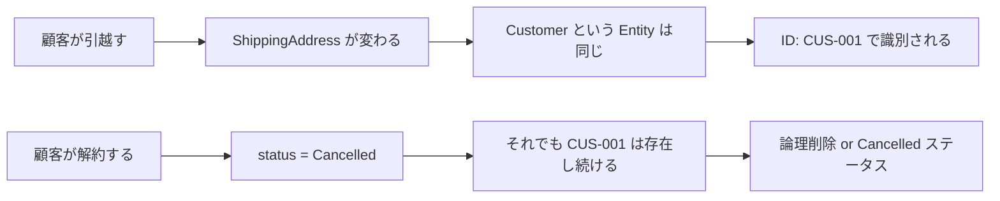
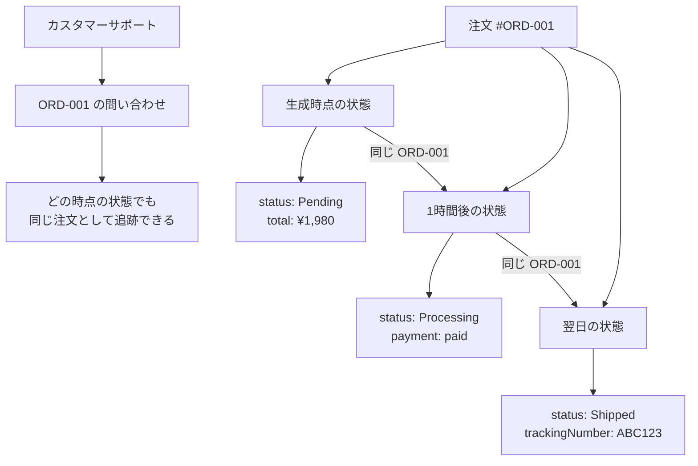
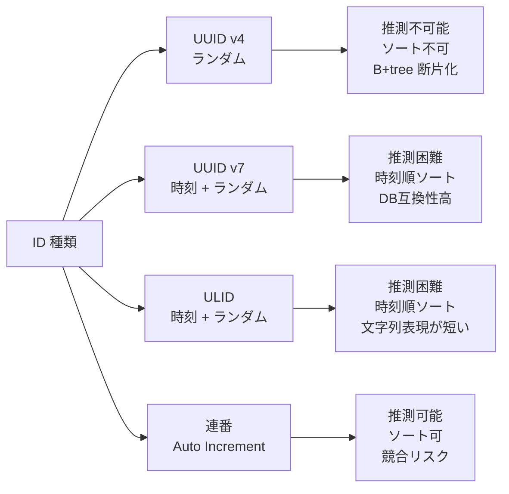
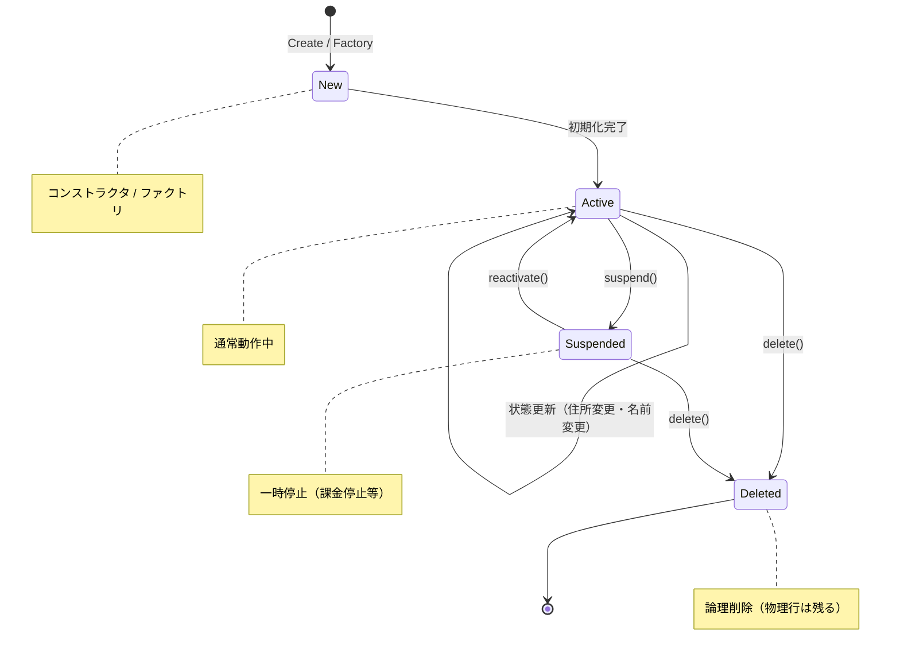
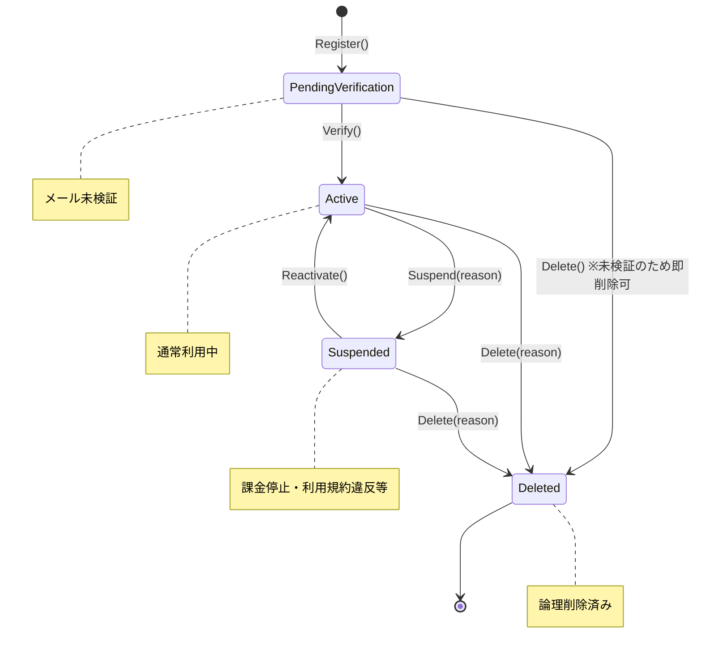
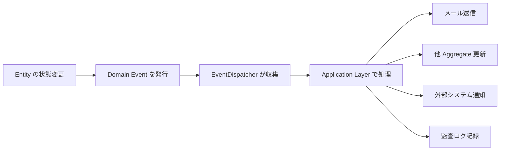
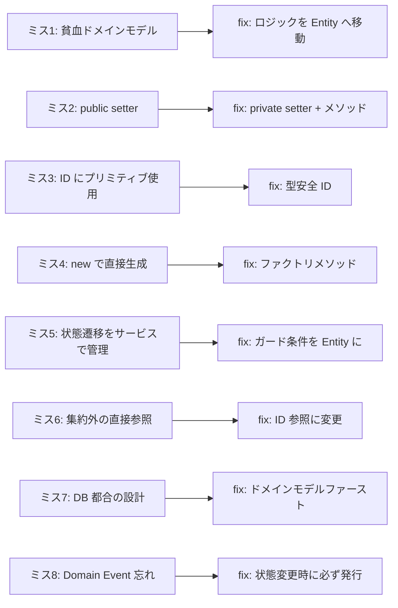

# 第8章: Entity — 同一性とライフサイクルを持つオブジェクト

> 「Entity とは、それが何であるかよりも、それが誰であるかが重要なオブジェクトだ。」  
> — Eric Evans, "Domain-Driven Design"

---

## 0. TL;DR

Entity は、**同一性（Identity）を持ち、時間とともに状態が変化するドメインオブジェクト**です。Value Object と異なり、「中身が変わっても同じ存在」という概念を型として表現します。

| 観点 | Value Object | Entity |
|---|---|---|
| **識別** | 属性の値で識別 | 一意 ID で識別 |
| **等価性** | 値が同じなら等価 | ID が同じなら等価 |
| **変化** | 不変（変化したら別オブジェクト） | 変化しても同じ Entity |
| **例** | Money(¥1,980), EmailAddress | Customer, Order, Product |

**本章で学ぶ核心**:
1. **同一性（Identity）**: 「住所が変わっても同じ人」という概念の実装
2. **ID 設計**: UUID v4 vs UUID v7 vs ULID vs 連番の使い分け
3. **ライフサイクル**: 生成・変更・削除・復元の設計パターン
4. **状態遷移**: ステートマシンとしての Entity 設計
5. **Domain Events**: Entity の変化を事実として記録する



---

## 1. 同一性（Identity）とは何か

### 1.1 「住所が変わっても同じ人」という概念の深い意味

**哲学的な問いから始まる DDD の核心**

ヘラクレイトスは言いました。「同じ川に二度は入れない。川は常に変化しているから」。しかし私たちは「荒川」という川を昨日も今日も「同じ川」として扱います。川の水が入れ替わっても、川床が侵食されても、それが「荒川」であることは変わりません。

Entity も同じです。

```csharp
// 田中花子さん（顧客 ID: CUS-001）の変化を追跡する
var tanaka = new Customer(
    id:    CustomerId.From("CUS-001"),
    name:  "田中花子",
    email: EmailAddress.Create("hanako@example.com"),
    address: new Address("150-0001", "東京都", "渋谷区", "神南1-1-1")
);

// 1年後: 引越し
tanaka.ChangeShippingAddress(
    new Address("530-0001", "大阪府", "大阪市北区", "梅田1-1-1")
);

// 2年後: 結婚して名前が変わる
tanaka.ChangeName("山田花子");

// 3年後: メールアドレスが変わる
tanaka.ChangeEmail(EmailAddress.Create("hanako.yamada@example.com"));

// 質問: これは同じ顧客か？
// 答え: YES。CUS-001 が同じだから。
// 属性（名前/住所/メール）が変わっても、Identity（ID）は変わらない。
```

### 1.2 参照等価 vs 識別子等価

C# で `class` を使うと、デフォルトで「参照等価」（同じメモリアドレスか）で比較されます。

しかし Entity が必要としているのは「識別子等価」（同じ ID を持つか）です。

```csharp
// ❌ 参照等価: Entity では機能しない
var customer1 = LoadFromDb(CustomerId.From("CUS-001"));  // DBから取得
var customer2 = LoadFromDb(CustomerId.From("CUS-001"));  // 同じIDで再取得

ReferenceEquals(customer1, customer2);  // false（異なるオブジェクトインスタンス）
customer1 == customer2;                  // false（デフォルトは参照比較）

// しかし「同じ顧客」として扱うべき！
```

```csharp
// ✅ 識別子等価: ID で比較する Entity の実装
public abstract class Entity<TId> : IEquatable<Entity<TId>>
    where TId : TypedId<TId>
{
    public TId Id { get; }

    protected Entity(TId id)
    {
        ArgumentNullException.ThrowIfNull(id);
        if (id.IsEmpty) throw new ArgumentException("Entity の ID は空にできません");
        Id = id;
    }

    // 識別子等価: ID が同じなら同じ Entity
    public bool Equals(Entity<TId>? other)
    {
        if (other is null) return false;
        if (ReferenceEquals(this, other)) return true;
        if (GetType() != other.GetType()) return false;  // 異なる型は別物
        return Id.Equals(other.Id);
    }

    public override bool Equals(object? obj)
        => obj is Entity<TId> entity && Equals(entity);

    public override int GetHashCode() => Id.GetHashCode();

    public static bool operator ==(Entity<TId>? left, Entity<TId>? right)
    {
        if (left is null && right is null) return true;
        if (left is null || right is null) return false;
        return left.Equals(right);
    }

    public static bool operator !=(Entity<TId>? left, Entity<TId>? right)
        => !(left == right);
}
```

### 1.3 「同一性」が必要なビジネス理由

なぜ「同一性」という概念がビジネスに必要なのかを具体例で見てみましょう。



**ビジネスシナリオ**:
1. **監査ログ**: 誰がいつ何をしたかを Entity の ID で追跡する
2. **問い合わせ対応**: 「注文 #001 の件ですが…」と顧客が連絡してくる
3. **報告・集計**: 「顧客 #CUS-001 の累計購入額」を計算する
4. **ロック制御**: 在庫 #INV-001 の在庫数を排他的に更新する

---

## 2. ID 設計の完全ガイド

### 2.1 UUID v4 vs UUID v7 vs ULID vs 連番の比較



| 特性 | UUID v4 | UUID v7 | ULID | 連番 (BIGINT) |
|---|---|---|---|---|
| **長さ** | 128 bit | 128 bit | 128 bit | 64 bit |
| **文字列** | 36 文字 | 36 文字 | 26 文字 | 可変 |
| **ソート性** | なし | 時刻順 | 時刻順 | 昇順 |
| **推測可能性** | 不可能 | 困難 | 困難 | 可能 |
| **B+tree 効率** | 低（断片化） | 高（末尾挿入） | 高（末尾挿入） | 高（末尾挿入） |
| **分散生成** | 可 | 可 | 可 | 困難（競合） |
| **DB 互換性** | 高 | 中（要 DB バージョン） | 低（UUID 型に変換要） | 高 |
| **API 露出** | 安全 | 安全 | 安全 | 危険（連番探索） |
| **推奨用途** | 旧システム互換 | **新規 PostgreSQL** | **新規（多言語）** | 内部用テーブルのみ |

**具体的な推奨**:

```csharp
// 新規 PostgreSQL プロジェクト: UUID v7
// .NET 9 では Guid.CreateVersion7() が標準で使える
var orderId = Guid.CreateVersion7();
Console.WriteLine(orderId); // "019746a2-1234-7xxx-..." 時刻prefix付き

// 多言語混在 / 短い文字列が必要: ULID
// Nuget: Ulid パッケージ
var ulid = Ulid.NewUlid();
Console.WriteLine(ulid); // "01H8XKBMD82V0QMXKY0S6K2Y5B" 26文字

// 連番 (Auto Increment) はパブリック API に絶対に露出しない
// GET /orders/1, /orders/2, /orders/3 → 全件スキャンが簡単にできてしまう
```

### 2.2 ドメイン固有 ID を作る理由

```csharp
// ❌ なぜ Guid をそのまま使ってはいけないか
public class OrderService
{
    // 引数が全部 Guid → どれが注文 ID でどれが顧客 ID か型レベルでわからない
    public Order ProcessPayment(Guid orderId, Guid customerId, Guid paymentMethodId)
    {
        var order = _orderRepo.GetById(orderId);
        // 引数の順番を間違えてもコンパイルエラーにならない！
        return ProcessPayment(customerId, orderId, paymentMethodId); // バグ
    }
}

// ✅ 型安全な ID
public class OrderService
{
    // 型が違うので引数の順番を間違えるとコンパイルエラー
    public Order ProcessPayment(OrderId orderId, CustomerId customerId, PaymentMethodId paymentMethodId)
    {
        var order = _orderRepo.GetById(orderId); // OrderId しか渡せない
        return ProcessPayment(customerId, orderId, paymentMethodId); // CS1503 コンパイルエラー!
    }
}
```

### 2.3 型安全 ID の完全実装（.NET 9）

```csharp
// ── 基底型 ────────────────────────────────────────────────────────────────
public abstract record TypedId<TSelf>
    where TSelf : TypedId<TSelf>
{
    public Guid Value { get; }

    protected TypedId(Guid value)
    {
        if (value == Guid.Empty)
            throw new ArgumentException($"{GetType().Name} の ID は Empty にできません");
        Value = value;
    }

    public bool IsEmpty => Value == Guid.Empty;

    public override string ToString() => Value.ToString("D");

    // 等値比較は record が自動実装（Value フィールドで比較）
}

// ── 具体的な ID 型 ─────────────────────────────────────────────────────────
public sealed record CustomerId(Guid Value) : TypedId<CustomerId>(Value)
{
    /// <summary>UUID v7（時刻順ソート可能）で新規 ID を生成します。</summary>
    public static CustomerId New()              => new(Guid.CreateVersion7());
    public static CustomerId From(Guid value)   => new(value);
    public static CustomerId From(string value) => new(Guid.Parse(value));
    public static CustomerId Parse(string value) => From(value);
    public static bool TryParse(string value, out CustomerId? result)
    {
        if (Guid.TryParse(value, out var guid))
        {
            result = From(guid);
            return true;
        }
        result = null;
        return false;
    }
}

public sealed record OrderId(Guid Value) : TypedId<OrderId>(Value)
{
    public static OrderId New()              => new(Guid.CreateVersion7());
    public static OrderId From(Guid value)   => new(value);
    public static OrderId From(string value) => new(Guid.Parse(value));
}

public sealed record ProductId(Guid Value) : TypedId<ProductId>(Value)
{
    public static ProductId New()              => new(Guid.CreateVersion7());
    public static ProductId From(Guid value)   => new(value);
    public static ProductId From(string value) => new(Guid.Parse(value));
}

// EF Core の Value Converter（汎用）
public class TypedIdConverter<TId> : ValueConverter<TId, Guid>
    where TId : TypedId<TId>
{
    private static readonly Func<Guid, TId> _fromGuid;

    static TypedIdConverter()
    {
        // コンパイル時にリフレクションを使って From(Guid) を呼ぶ
        var method = typeof(TId).GetMethod("From", new[] { typeof(Guid) })
            ?? throw new InvalidOperationException($"{typeof(TId).Name} に From(Guid) メソッドがありません");
        var param  = Expression.Parameter(typeof(Guid));
        _fromGuid  = Expression.Lambda<Func<Guid, TId>>(
            Expression.Call(method, param), param).Compile();
    }

    public TypedIdConverter()
        : base(id => id.Value, guid => _fromGuid(guid)) { }
}
```

---

## 3. Entity のライフサイクル設計



### 3.1 生成（Creation）: ファクトリメソッドとコンストラクタの使い分け

```csharp
// ── コンストラクタで生成（シンプルなケース）──────────────────────────────
// メリット: 直感的、テストが書きやすい
// 適用場面: 生成ロジックが単純で、ドメインイベントが不要な場合
public class Product : Entity<ProductId>
{
    public string Name { get; private set; }
    public Money Price { get; private set; }

    public Product(ProductId id, string name, Money price)
        : base(id)
    {
        if (string.IsNullOrWhiteSpace(name))
            throw new ArgumentException("商品名は必須です");
        Name  = name.Trim();
        Price = price;
    }
}

// ── ファクトリメソッドで生成（複雑なケース）─────────────────────────────
// メリット: 意図が明確、ドメインイベントを発行できる、複雑な検証が可能
// 適用場面: 生成がビジネスルールを含む、複数の生成パターンがある
public class Customer : Entity<CustomerId>
{
    public string Name { get; private set; }
    public EmailAddress Email { get; private set; }
    public CustomerStatus Status { get; private set; }
    public DateTime RegisteredAt { get; private set; }

    private readonly List<DomainEvent> _domainEvents = new();
    public IReadOnlyList<DomainEvent> DomainEvents => _domainEvents.AsReadOnly();

    // ❌ public コンストラクタは ORM 用だけにする（protected or private）
    protected Customer() { }  // EF Core 用

    private Customer(
        CustomerId id,
        string name,
        EmailAddress email,
        DateTime registeredAt)
        : base(id)
    {
        Name         = name;
        Email        = email;
        Status       = CustomerStatus.Active;
        RegisteredAt = registeredAt;
    }

    // ✅ ファクトリメソッド: 生成の「意図」が明確になる
    public static Customer Register(string name, EmailAddress email)
    {
        if (string.IsNullOrWhiteSpace(name))
            throw new ArgumentException("顧客名は必須です");

        var customer = new Customer(
            id:           CustomerId.New(),
            name:         name.Trim(),
            email:        email,
            registeredAt: DateTime.UtcNow);

        customer._domainEvents.Add(new CustomerRegisteredEvent(customer.Id, email));
        return customer;
    }

    // 別の生成パターン（企業顧客として登録）
    public static Customer RegisterCorporate(string companyName, string contactName, EmailAddress email)
    {
        if (string.IsNullOrWhiteSpace(companyName))
            throw new ArgumentException("会社名は必須です");

        var displayName = $"{companyName}（担当: {contactName}）";
        var customer    = new Customer(
            id:           CustomerId.New(),
            name:         displayName,
            email:        email,
            registeredAt: DateTime.UtcNow);

        customer._domainEvents.Add(new CorporateCustomerRegisteredEvent(
            customer.Id, companyName, contactName));
        return customer;
    }
}
```

### 3.2 変更（Mutation）: どのメソッドが状態を変えていいか

Entity の状態変更は「メソッドを通じて行う」のが DDD の原則です。プロパティの setter を public にしません。

```csharp
public class Customer : Entity<CustomerId>
{
    // ❌ public setter は禁止
    public string Name { get; set; }  // 誰でも変更できる = ドメインルールが消える

    // ✅ private setter + 専用メソッド
    public string Name { get; private set; }

    public void ChangeName(string newName)
    {
        if (string.IsNullOrWhiteSpace(newName))
            throw new ArgumentException("顧客名は必須です");

        // ビジネスルール: 名前の変更は ActiveStatus のみ可能
        if (Status != CustomerStatus.Active)
            throw new InvalidOperationException(
                $"ステータスが {Status} の顧客は名前を変更できません");

        var oldName = Name;
        Name = newName.Trim();

        // 変更をドメインイベントで記録
        AddDomainEvent(new CustomerNameChangedEvent(Id, oldName, Name));
    }

    public void ChangeEmail(EmailAddress newEmail)
    {
        // メール変更はビジネスルールあり（同じメールは不可）
        if (Email == newEmail)
            throw new InvalidOperationException("新しいメールアドレスが現在と同じです");

        var oldEmail = Email;
        Email = newEmail;

        AddDomainEvent(new CustomerEmailChangedEvent(Id, oldEmail, newEmail));
    }
}
```

### 3.3 削除（Deletion）: 物理削除 vs 論理削除

```csharp
// ── 論理削除（推奨: ほとんどのビジネスケース）─────────────────────────────
// メリット: 監査ログが保持される、参照整合性が維持される
public class Customer : Entity<CustomerId>
{
    public bool IsDeleted { get; private set; }
    public DateTime? DeletedAt { get; private set; }
    public string? DeletedReason { get; private set; }

    public void Delete(string reason)
    {
        if (IsDeleted)
            throw new InvalidOperationException("すでに削除済みの顧客です");

        if (string.IsNullOrWhiteSpace(reason))
            throw new ArgumentException("削除理由は必須です");

        IsDeleted     = true;
        DeletedAt     = DateTime.UtcNow;
        DeletedReason = reason;
        Status        = CustomerStatus.Deleted;

        AddDomainEvent(new CustomerDeletedEvent(Id, reason));
    }
}

// EF Core での論理削除フィルタ設定
protected override void OnModelCreating(ModelBuilder modelBuilder)
{
    // Customer は IsDeleted == false のものだけクエリに含める
    modelBuilder.Entity<Customer>()
        .HasQueryFilter(c => !c.IsDeleted);
    // 削除済みも含めて取得したい場合: .IgnoreQueryFilters()
}

// ── 物理削除（限定的なケース）─────────────────────────────────────────────
// 適用場面: GDPR 対応（忘れられる権利）、完全な機密データの消去
public class GdprComplianceService
{
    public async Task EraseCustomerData(CustomerId customerId)
    {
        // 注意: このメソッドは法的要件がある場合のみ使用する
        // 関連する全データを先に匿名化してから削除する
        await _customerRepo.HardDelete(customerId);
    }
}
```

### 3.4 復元（Reconstitution）: DB からの復元とドメインロジックを混ぜない

**「復元」は「生成」ではない**という重要な区別があります。

```csharp
// ❌ アンチパターン: DB から復元する時にドメインイベントが発行される
public class Customer : Entity<CustomerId>
{
    public Customer(CustomerId id, string name, EmailAddress email)
        : base(id)
    {
        Name = name;
        Email = email;
        AddDomainEvent(new CustomerRegisteredEvent(id, email)); // ← 復元時にも発行されてしまう！
    }
}

// ✅ 正解: ファクトリメソッドで「生成」と「復元」を分ける
public class Customer : Entity<CustomerId>
{
    // EF Core が使う protected コンストラクタ（復元用）
    // ドメインイベントを発行しない
    protected Customer() { }  

    // ドメイン生成用のファクトリ（イベントを発行する）
    public static Customer Register(string name, EmailAddress email)
    {
        var customer = new Customer();
        customer.Id    = CustomerId.New();
        customer.Name  = name;
        customer.Email = email;
        customer.AddDomainEvent(new CustomerRegisteredEvent(customer.Id, email));
        return customer;
    }
}

// EF Core は protected コンストラクタを呼ぶ（イベントは発行されない）
var customer = await _dbContext.Customers.FindAsync(id);
// → Customer(Id, Name, Email, ...) が復元される
// → CustomerRegisteredEvent は発行されない ✅
```

---

## 4. Entity の状態遷移設計

### 4.1 ステートマシンとして Entity を設計する

Entity の `Status` フィールドがある場合、それは有限オートマトン（Finite State Machine）として設計します。



### 4.2 状態遷移のガード条件

```csharp
public enum CustomerStatus
{
    PendingVerification,  // メール検証待ち
    Active,               // 利用中
    Suspended,            // 一時停止
    Deleted               // 削除済み
}

public class Customer : Entity<CustomerId>
{
    public CustomerStatus Status { get; private set; }

    // 状態遷移メソッドで「ガード条件」を実装する
    public void Verify()
    {
        // ガード: PendingVerification からのみ遷移可能
        if (Status != CustomerStatus.PendingVerification)
            throw new InvalidOperationException(
                $"Verify() は PendingVerification ステータスの顧客のみ実行できます。現在: {Status}");

        Status = CustomerStatus.Active;
        AddDomainEvent(new CustomerVerifiedEvent(Id));
    }

    public void Suspend(string reason)
    {
        // ガード: Active からのみ一時停止可能
        if (Status != CustomerStatus.Active)
            throw new InvalidOperationException(
                $"Suspend() は Active ステータスの顧客のみ実行できます。現在: {Status}");

        if (string.IsNullOrWhiteSpace(reason))
            throw new ArgumentException("一時停止理由は必須です");

        Status = CustomerStatus.Suspended;
        AddDomainEvent(new CustomerSuspendedEvent(Id, reason));
    }

    public void Reactivate()
    {
        // ガード: Suspended からのみ再有効化可能
        if (Status != CustomerStatus.Suspended)
            throw new InvalidOperationException(
                $"Reactivate() は Suspended ステータスの顧客のみ実行できます。現在: {Status}");

        Status = CustomerStatus.Active;
        AddDomainEvent(new CustomerReactivatedEvent(Id));
    }

    public void Delete(string reason)
    {
        // ガード: Deleted からは遷移不可
        if (Status == CustomerStatus.Deleted)
            throw new InvalidOperationException("すでに削除済みの顧客です");

        Status = CustomerStatus.Deleted;
        AddDomainEvent(new CustomerDeletedEvent(Id, reason));
    }

    // 現在の状態で許可される操作を照会するヘルパー
    public bool CanVerify()      => Status == CustomerStatus.PendingVerification;
    public bool CanSuspend()     => Status == CustomerStatus.Active;
    public bool CanReactivate()  => Status == CustomerStatus.Suspended;
    public bool CanDelete()      => Status != CustomerStatus.Deleted;
    public bool IsUsable()       => Status == CustomerStatus.Active;
}
```

### 4.3 不正な遷移からの保護

```csharp
// ❌ アンチパターン: Status を直接 set できてしまう
public class Customer
{
    public CustomerStatus Status { get; set; } // 誰でも任意の状態に変更できる
}

// 呼び出し側: ビジネスルール無視で状態を変更できてしまう
customer.Status = CustomerStatus.Active; // Deleted からも Active に戻せてしまう！

// ✅ 正解: メソッド経由のみ状態変更を許可
// → 上記のガード条件が必ず通る
```

### 4.4 完全実装: Customer の状態遷移

```csharp
public class Customer : Entity<CustomerId>
{
    // ── プロパティ（private set）────────────────────────────────────────
    public string Name { get; private set; }
    public EmailAddress Email { get; private set; }
    public CustomerStatus Status { get; private set; }
    public Address? ShippingAddress { get; private set; }
    public DateTime RegisteredAt { get; private set; }
    public DateTime? LastModifiedAt { get; private set; }

    // ── Domain Events ────────────────────────────────────────────────────
    private readonly List<DomainEvent> _domainEvents = new();
    public IReadOnlyList<DomainEvent> DomainEvents => _domainEvents.AsReadOnly();
    protected void AddDomainEvent(DomainEvent @event) => _domainEvents.Add(@event);
    public void ClearDomainEvents() => _domainEvents.Clear();

    // ── コンストラクタ（ORM 用）──────────────────────────────────────────
    protected Customer() { }

    // ── ファクトリメソッド ──────────────────────────────────────────────
    public static Customer Register(string name, EmailAddress email)
    {
        if (string.IsNullOrWhiteSpace(name))
            throw new ArgumentException("顧客名は必須です");

        var customer = new Customer
        {
            Id           = CustomerId.New(),
            Name         = name.Trim(),
            Email        = email,
            Status       = CustomerStatus.PendingVerification,
            RegisteredAt = DateTime.UtcNow,
        };

        customer.AddDomainEvent(new CustomerRegisteredEvent(
            customer.Id, customer.Name, customer.Email, customer.RegisteredAt));
        return customer;
    }

    // ── 状態変更メソッド ────────────────────────────────────────────────
    public void Verify()
    {
        EnsureStatus(CustomerStatus.PendingVerification, nameof(Verify));
        Status = CustomerStatus.Active;
        Touch();
        AddDomainEvent(new CustomerVerifiedEvent(Id));
    }

    public void ChangeName(string newName)
    {
        EnsureStatus(CustomerStatus.Active, nameof(ChangeName));
        if (string.IsNullOrWhiteSpace(newName))
            throw new ArgumentException("顧客名は必須です");

        var oldName = Name;
        Name = newName.Trim();
        Touch();
        AddDomainEvent(new CustomerNameChangedEvent(Id, oldName, Name));
    }

    public void ChangeEmail(EmailAddress newEmail)
    {
        EnsureStatus(CustomerStatus.Active, nameof(ChangeEmail));
        if (Email == newEmail)
            throw new InvalidOperationException("新しいメールが現在と同じです");

        var oldEmail = Email;
        Email = newEmail;
        Touch();
        AddDomainEvent(new CustomerEmailChangedEvent(Id, oldEmail, newEmail));
    }

    public void UpdateShippingAddress(Address newAddress)
    {
        if (Status == CustomerStatus.Deleted)
            throw new InvalidOperationException("削除済みの顧客は更新できません");

        ShippingAddress = newAddress;
        Touch();
        AddDomainEvent(new ShippingAddressUpdatedEvent(Id, newAddress));
    }

    public void Suspend(string reason)
    {
        EnsureStatus(CustomerStatus.Active, nameof(Suspend));
        Status = CustomerStatus.Suspended;
        Touch();
        AddDomainEvent(new CustomerSuspendedEvent(Id, reason, DateTime.UtcNow));
    }

    public void Reactivate()
    {
        EnsureStatus(CustomerStatus.Suspended, nameof(Reactivate));
        Status = CustomerStatus.Active;
        Touch();
        AddDomainEvent(new CustomerReactivatedEvent(Id, DateTime.UtcNow));
    }

    public void Delete(string reason)
    {
        if (Status == CustomerStatus.Deleted)
            throw new InvalidOperationException("すでに削除済みの顧客です");
        Status = CustomerStatus.Deleted;
        Touch();
        AddDomainEvent(new CustomerDeletedEvent(Id, reason, DateTime.UtcNow));
    }

    // ── ヘルパー ────────────────────────────────────────────────────────
    private void EnsureStatus(CustomerStatus required, string methodName)
    {
        if (Status != required)
            throw new InvalidOperationException(
                $"{methodName}() は {required} ステータスの顧客のみ実行できます。現在: {Status}");
    }

    private void Touch() => LastModifiedAt = DateTime.UtcNow;
}
```

---

## 5. Entity 基底クラスの完全実装

```csharp
/// <summary>
/// Entity の基底クラス。
/// - 識別子等価（ID で比較）
/// - Domain Events の蓄積・発行
/// - ジェネリック ID 型のサポート
/// </summary>
public abstract class Entity<TId> : IEquatable<Entity<TId>>
    where TId : TypedId<TId>
{
    // ── Identity ─────────────────────────────────────────────────────────
    public TId Id { get; protected set; } = default!;  // ORM 用に protected set

    protected Entity() { }

    protected Entity(TId id)
    {
        ArgumentNullException.ThrowIfNull(id);
        if (id.IsEmpty) throw new ArgumentException("Entity の ID は空にできません", nameof(id));
        Id = id;
    }

    // ── 等値性（識別子等価）──────────────────────────────────────────────
    public bool Equals(Entity<TId>? other)
    {
        if (other is null) return false;
        if (ReferenceEquals(this, other)) return true;
        if (GetType() != other.GetType()) return false;  // 型が違えば別物
        return Id.Equals(other.Id);
    }

    public override bool Equals(object? obj)
        => obj is Entity<TId> entity && Equals(entity);

    public override int GetHashCode() => Id.GetHashCode();

    public static bool operator ==(Entity<TId>? left, Entity<TId>? right)
    {
        if (left is null && right is null) return true;
        if (left is null || right is null) return false;
        return left.Equals(right);
    }

    public static bool operator !=(Entity<TId>? left, Entity<TId>? right)
        => !(left == right);

    // ── Domain Events ─────────────────────────────────────────────────────
    private readonly List<DomainEvent> _domainEvents = new();

    public IReadOnlyList<DomainEvent> DomainEvents
        => _domainEvents.AsReadOnly();

    protected void AddDomainEvent(DomainEvent @event)
    {
        ArgumentNullException.ThrowIfNull(@event);
        _domainEvents.Add(@event);
    }

    public void ClearDomainEvents() => _domainEvents.Clear();

    // ── デバッグ支援 ──────────────────────────────────────────────────────
    public override string ToString()
        => $"{GetType().Name}(Id={Id})";
}

// ── Domain Event 基底 ────────────────────────────────────────────────────
public abstract record DomainEvent
{
    public Guid EventId { get; } = Guid.CreateVersion7();
    public DateTime OccurredAt { get; } = DateTime.UtcNow;
}
```

---

## 6. Entity のライフサイクルイベントと Domain Events

### 6.1 Domain Events の設計思想

Domain Event は「ドメインで何かが起きた」という事実の記録です。



**重要な原則**:
1. Domain Event は過去形の名詞句（`CustomerRegistered`, `OrderPlaced`, `PaymentFailed`）
2. Domain Event は Entity 内で `AddDomainEvent()` するが、実際の発行（publish）は Application Layer が行う
3. Domain Event は不変（record）

### 6.2 Customer の完全な Domain Events 実装

```csharp
// ── Domain Events 定義 ─────────────────────────────────────────────────────
public sealed record CustomerRegisteredEvent(
    CustomerId CustomerId,
    string     Name,
    EmailAddress Email,
    DateTime   RegisteredAt) : DomainEvent;

public sealed record CustomerVerifiedEvent(
    CustomerId CustomerId) : DomainEvent;

public sealed record CustomerNameChangedEvent(
    CustomerId CustomerId,
    string     OldName,
    string     NewName) : DomainEvent;

public sealed record CustomerEmailChangedEvent(
    CustomerId   CustomerId,
    EmailAddress OldEmail,
    EmailAddress NewEmail) : DomainEvent;

public sealed record CustomerSuspendedEvent(
    CustomerId CustomerId,
    string     Reason,
    DateTime   SuspendedAt) : DomainEvent;

public sealed record CustomerReactivatedEvent(
    CustomerId CustomerId,
    DateTime   ReactivatedAt) : DomainEvent;

public sealed record CustomerDeletedEvent(
    CustomerId CustomerId,
    string     Reason,
    DateTime   DeletedAt) : DomainEvent;

public sealed record ShippingAddressUpdatedEvent(
    CustomerId CustomerId,
    Address    NewAddress) : DomainEvent;

// ── Application Layer での Domain Events 処理 ──────────────────────────────
// （Mediator パターン / MediatR を使う例）
public class CustomerRegisteredEventHandler
    : INotificationHandler<CustomerRegisteredEvent>
{
    private readonly IEmailService _emailService;

    public CustomerRegisteredEventHandler(IEmailService emailService)
        => _emailService = emailService;

    public async Task Handle(
        CustomerRegisteredEvent notification,
        CancellationToken cancellationToken)
    {
        // Entity の状態変更後に副作用（メール送信）を実行する
        await _emailService.SendWelcomeEmailAsync(
            notification.Email,
            notification.Name,
            cancellationToken);
    }
}

// Repository が SaveChanges 後に Domain Events を発行する
public class CustomerRepository : ICustomerRepository
{
    private readonly AppDbContext _db;
    private readonly IPublisher _publisher;

    public async Task SaveAsync(Customer customer, CancellationToken ct)
    {
        await _db.SaveChangesAsync(ct);

        // 保存が成功した後に Domain Events を発行する
        foreach (var @event in customer.DomainEvents)
        {
            await _publisher.Publish(@event, ct);
        }
        customer.ClearDomainEvents();
    }
}
```

### 6.3 いつ Domain Event を Raise するか

```csharp
// ✅ Raise するべきタイミング
public void PlaceOrder(IReadOnlyList<OrderItem> items)
{
    // ビジネスロジック実行後
    ValidateItems(items);
    _items.AddRange(items);
    Status = OrderStatus.Placed;
    Total  = CalculateTotal();

    // ← 状態が確定してから Event を Raise する
    AddDomainEvent(new OrderPlacedEvent(Id, CustomerId, Total, DateTime.UtcNow));
}

// ❌ Raise してはいけないタイミング
public void PlaceOrder(IReadOnlyList<OrderItem> items)
{
    AddDomainEvent(new OrderPlacedEvent(...)); // ← 最初に発行（まだ検証していない）
    ValidateItems(items); // ← ここで例外が飛ぶと Event が宙に浮く
}
```

---

## 7. EF Core での Entity 永続化

### 7.1 プライベートコンストラクタと ORM の共存

EF Core はインスタンスを生成するためにコンストラクタを呼ぶ必要があります。ドメインモデルの `private` コンストラクタとどう共存するかが課題です。

```csharp
public class Customer : Entity<CustomerId>
{
    public string Name { get; private set; }
    public EmailAddress Email { get; private set; }
    public CustomerStatus Status { get; private set; }

    // ✅ EF Core 用: protected のパラメータなしコンストラクタ
    // → EF Core はリフレクションで protected コンストラクタを呼べる
    // → ドメインコードからは呼べない（protected）
    protected Customer() { }  

    // ✅ ドメイン生成用: private コンストラクタ + ファクトリメソッド
    private Customer(CustomerId id, string name, EmailAddress email)
        : base(id)
    {
        Name   = name;
        Email  = email;
        Status = CustomerStatus.PendingVerification;
    }

    public static Customer Register(string name, EmailAddress email)
    {
        var customer = new Customer(CustomerId.New(), name, email);
        customer.AddDomainEvent(new CustomerRegisteredEvent(customer.Id, email));
        return customer;
    }
}
```

### 7.2 プライベートセッターのマッピング

EF Core は `private set` のプロパティにもマッピングできます（内部実装でバッキングフィールドを直接設定）。

```csharp
public class CustomerConfiguration : IEntityTypeConfiguration<Customer>
{
    public void Configure(EntityTypeBuilder<Customer> builder)
    {
        builder.ToTable("customers");

        // ── ID ──────────────────────────────────────────────────────────
        builder.HasKey(c => c.Id);
        builder.Property(c => c.Id)
            .HasConversion(new TypedIdConverter<CustomerId>())
            .HasColumnName("id")
            .ValueGeneratedNever(); // アプリケーション側で生成するため

        // ── 通常プロパティ（private set でも EF Core はマッピングできる）──
        builder.Property(c => c.Name)
            .HasColumnName("name")
            .HasMaxLength(200)
            .IsRequired();

        builder.Property(c => c.Status)
            .HasColumnName("status")
            .HasConversion<string>() // enum → 文字列で保存（数値より可読性が高い）
            .HasMaxLength(30)
            .IsRequired();

        // ── Value Object (Owned) ─────────────────────────────────────────
        builder.OwnsOne(c => c.Email, email =>
        {
            email.Property(e => e.Value)
                 .HasColumnName("email")
                 .HasMaxLength(320)
                 .IsRequired();
        });

        // ── 監査フィールド ────────────────────────────────────────────────
        builder.Property(c => c.RegisteredAt)
            .HasColumnName("registered_at")
            .IsRequired();

        builder.Property(c => c.LastModifiedAt)
            .HasColumnName("last_modified_at");

        // ── インデックス ──────────────────────────────────────────────────
        builder.HasIndex("email").IsUnique(); // emailの等値比較はOwned Typeのカラム名を直接指定

        // ── Domain Events はマッピングしない（永続化不要）────────────────
        builder.Ignore(c => c.DomainEvents);
    }
}
```

### 7.3 ナビゲーションプロパティと DDD の関係

```csharp
// ── Order には OrderItems のコレクションがある ─────────────────────────
public class Order : Entity<OrderId>
{
    public CustomerId CustomerId { get; private set; }  // 集約外は ID 参照のみ
    public OrderStatus Status { get; private set; }
    public Money Total { get; private set; }

    // ✅ コレクションはプライベートバッキングフィールドで管理
    private readonly List<OrderItem> _items = new();
    public IReadOnlyList<OrderItem> Items => _items.AsReadOnly();

    protected Order() { }  // EF Core 用

    public void AddItem(ProductId productId, int quantity, Money unitPrice)
    {
        if (Status != OrderStatus.Draft)
            throw new InvalidOperationException("確定済みの注文には商品を追加できません");

        var existing = _items.FirstOrDefault(i => i.ProductId == productId);
        if (existing is not null)
        {
            existing.IncreaseQuantity(quantity);
        }
        else
        {
            _items.Add(new OrderItem(OrderItemId.New(), Id, productId, quantity, unitPrice));
        }
        RecalculateTotal();
    }

    private void RecalculateTotal()
        => Total = _items.Aggregate(
            Money.Zero(Currency.JPY),
            (sum, item) => sum + item.SubTotal);
}

// EF Core 設定: プライベートコレクション
builder.HasMany<OrderItem>("_items") // バッキングフィールド名で指定
       .WithOne()
       .HasForeignKey("OrderId")
       .OnDelete(DeleteBehavior.Cascade);
```

---

## 8. よくある設計ミス TOP 8（Before/After）



### ミス 1: 貧血ドメインモデル（Anemic Domain Model）

```csharp
// ❌ Before: ロジックが全部サービス層にある（貧血ドメインモデル）
public class Order { public OrderStatus Status { get; set; } }

public class OrderService
{
    public void CancelOrder(Order order)
    {
        if (order.Status == OrderStatus.Shipped)
            throw new Exception("発送済みの注文はキャンセルできません");
        order.Status = OrderStatus.Cancelled;
        // ビジネスルールがサービス層に散乱する
    }
}

// ✅ After: ビジネスルールが Entity に宿る
public class Order : Entity<OrderId>
{
    public OrderStatus Status { get; private set; }

    public void Cancel()
    {
        if (Status == OrderStatus.Shipped)
            throw new InvalidOperationException("発送済みの注文はキャンセルできません");
        Status = OrderStatus.Cancelled;
        AddDomainEvent(new OrderCancelledEvent(Id, DateTime.UtcNow));
    }
}
```

### ミス 2: public setter でどこからでも状態変更できる

```csharp
// ❌ Before: ガード条件をバイパスできる
public class Customer { public CustomerStatus Status { get; set; } }
customer.Status = CustomerStatus.Active; // Deleted からも直接変更できてしまう

// ✅ After: メソッド経由のみ
public class Customer : Entity<CustomerId>
{
    public CustomerStatus Status { get; private set; }
    public void Reactivate() { EnsureStatus(CustomerStatus.Suspended, nameof(Reactivate)); ... }
}
```

### ミス 3: ID にプリミティブ型を使う

```csharp
// ❌ Before
public class Order { public Guid Id { get; } }
_repo.GetById(customerId); // CustomerId を OrderId として渡せてしまう（型チェックなし）

// ✅ After
public class Order : Entity<OrderId> { }
_repo.GetById(customerId); // CS1503: OrderId が必要なのに CustomerId を渡した
```

### ミス 4: new で直接生成してドメインイベントを発行し忘れる

```csharp
// ❌ Before
var order = new Order(id, customerId, items); // イベント発行なし

// ✅ After
var order = Order.Place(customerId, items); // ファクトリ内でイベント発行
```

### ミス 5: 状態遷移をサービス層で if 文で管理する

```csharp
// ❌ Before: サービス層に if 文が散乱（DRY 違反 + 漏れやすい）
if (order.Status == OrderStatus.Draft)
    order.Status = OrderStatus.Placed;
else
    throw new ...;

// ✅ After: Entity のメソッドがガード条件を内包する
order.Place(); // Place() の中でガード条件が定義されている
```

### ミス 6: 集約外の Entity を直接ナビゲーションプロパティで参照する

```csharp
// ❌ Before: Order が Customer の全プロパティにアクセスできてしまう
public class Order : Entity<OrderId>
{
    public Customer Customer { get; private set; } // 集約境界を越えた参照
}

// ✅ After: ID 参照のみ（集約外は ID で参照する）
public class Order : Entity<OrderId>
{
    public CustomerId CustomerId { get; private set; } // ID のみ保持
}
```

### ミス 7: DB のテーブル設計に合わせてドメインモデルを設計する

```csharp
// ❌ Before: customers テーブルに合わせて不自然なドメインモデルを作る
public class Customer : Entity<CustomerId>
{
    public int StatusId { get; set; }        // 外部テーブルの FK
    public string StatusName { get; set; }   // JOIN で取得した値
    // ← ドメインモデルが DB スキーマの奴隷になっている
}

// ✅ After: ドメインモデルファースト
public class Customer : Entity<CustomerId>
{
    public CustomerStatus Status { get; private set; } // ドメインの概念
    // DB マッピングは Configuration クラスに委ねる
}
```

### ミス 8: 重要な状態変更で Domain Event を発行し忘れる

```csharp
// ❌ Before: 状態変更はするがイベントを発行しない
public void Suspend(string reason)
{
    Status = CustomerStatus.Suspended;
    // → メール通知が送られない
    // → 監査ログが記録されない
    // → 他集約が反応できない
}

// ✅ After: 状態変更と Event 発行をセットにする
public void Suspend(string reason)
{
    Status = CustomerStatus.Suspended;
    AddDomainEvent(new CustomerSuspendedEvent(Id, reason, DateTime.UtcNow));
}
```

---

## 9. コードレビュー観点（チェックリスト）

```markdown
## Entity レビューチェックリスト（v1.0）

### 同一性（Identity）
- [ ] ID は型安全な TypedId（CustomerId など）を使っているか？
- [ ] Entity の等値比較が ID ベース（Equals/== が ID で比較）になっているか？
- [ ] ORM 用の protected コンストラクタがあるか？

### カプセル化
- [ ] すべてのプロパティが private set か get only か？
- [ ] コレクションは IReadOnlyList<T> で公開されているか？
- [ ] 状態変更は public メソッド経由のみか？

### 状態遷移
- [ ] 状態遷移メソッドにガード条件があるか？
- [ ] 不正な遷移（DeletedからActiveへなど）が InvalidOperationException を投げるか？
- [ ] 状態を直接 set できる public setter がないか？

### ライフサイクル
- [ ] 生成はファクトリメソッドか、コンストラクタを使うとしてもドメインイベントを発行しているか？
- [ ] 論理削除と物理削除の使い分けが意図的か？
- [ ] 復元（ORM のリフレクション）時にドメインイベントが発行されていないか？

### Domain Events
- [ ] 重要な状態変更ごとに Domain Event を AddDomainEvent しているか？
- [ ] Event 名が過去形の名詞句か（CustomerRegistered, OrderPlaced など）？
- [ ] Domain Events が Entity 外（Repository の SaveAsync 後など）で publish されているか？
- [ ] ClearDomainEvents() が publish 後に呼ばれているか？

### 集約境界
- [ ] 集約外の Entity は ID でのみ参照しているか（ナビゲーションプロパティで直接保持していないか）？
- [ ] コレクションの追加/削除はメソッド経由か（_list.Add() が private か）？

### パフォーマンス
- [ ] コレクションが遅延ロード（LazyLoading）で N+1 問題を起こしていないか？
- [ ] ID が UUID v7 か ULID で、B+tree の末尾挿入が効率的か？
```

---
