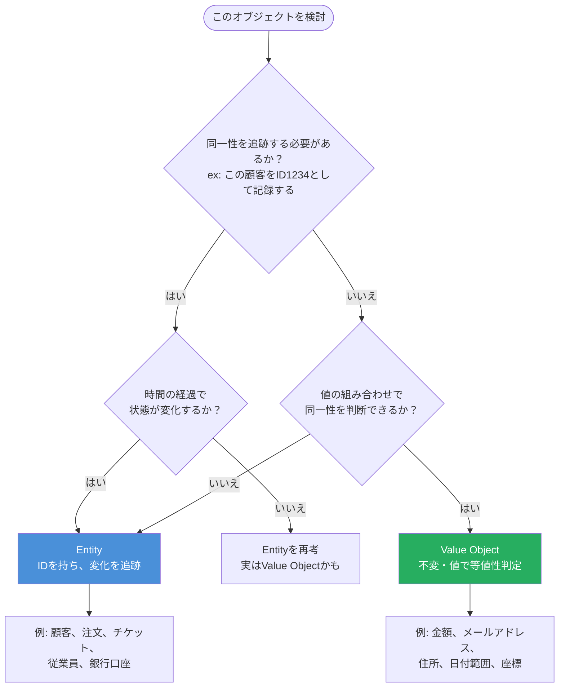
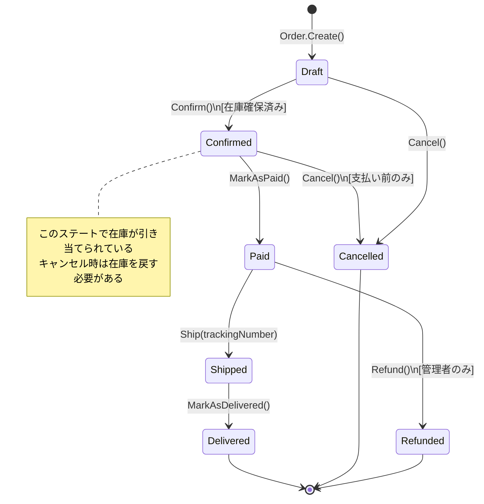

## Entityの本質

前章でValue Objectを学びました。では**Entity（エンティティ）**は何が違うのでしょうか。

「住所が変わっても同じ人」——これがEntityの本質を表す最もシンプルな言葉です。田中さんが引越しをして、名前も山田さんに変わっても（結婚など）、同じ一人の人間です。体重が変わっても、職業が変わっても、「その人」としての同一性は変わりません。

一方、「同じ5000円でも2枚は別々」——同じ価値を持つ5000円紙幣が2枚あっても、それらは2つの別々のモノとして扱います。これがValue Objectです。

DDDにおけるEntityは、**同一性（Identity）とライフサイクル（Lifecycle）** を持ちます。時間の経過とともに状態が変化しますが、「同じもの」として追跡され続けます。注文、顧客、商品、チケット——これらはすべてEntityです。

## Value ObjectとEntityの選択基準

どちらを使うべきか迷った時は、以下の判断フローを参考にしてください。



**実践的な判断基準**:

- 「このオブジェクトが同じ値を持つ別のインスタンスと区別する必要があるか？」→ Entity
- 「このオブジェクトを変更する場合、置き換えるのか、上書きするのか？」→ 置き換えるならValue Object
- 「データベースで個別に検索・追跡する必要があるか？」→ Entity

## ID設計の考え方

EntityのIDには主に3種類のアプローチがあります。

| ID種類 | 例 | メリット | デメリット |
|---|---|---|---|
| **連番整数** | `1, 2, 3...` | シンプル・短い | 分散環境で衝突・順序が推測可能 |
| **UUID (v4)** | `550e8400-e29b...` | 分散生成・推測不能 | 長い・インデックス効率が低い |
| **ULID** | `01ARZ3NDEKTSV4...` | 時刻順ソート可能・分散生成 | やや複雑 |

ECサイトや業務システムでは**ULID**が最もバランスが良い選択です。分散環境でも衝突せず、時刻順ソートにより「最近の注文を取得」などのクエリが効率的になります。

```csharp
// EntityのIDを型安全に定義する
public record OrderId(string Value)
{
    public static OrderId NewId() => new OrderId(Ulid.NewUlid().ToString());
    public static OrderId From(string value) => new OrderId(value);
    public override string ToString() => Value;
}
```

## EntityのライフサイクルStateマシン

Entityはライフサイクルを持ちます。注文Entityの状態遷移を例に見てみましょう。



状態遷移は**ドメインルール**そのものです。「支払い後はキャンセルできない」「出荷前でないと配送番号を設定できない」——これらをEntityのメソッドで強制します。

## CustomerエンティティのC#完全実装

```csharp
public sealed class Customer : Entity<CustomerId>
{
    private readonly List<Address> _addresses = new();

    public PersonName Name { get; private set; }
    public EmailAddress Email { get; private set; }
    public PhoneNumber? Phone { get; private set; }
    public CustomerStatus Status { get; private set; }
    public DateTime RegisteredAt { get; }
    public IReadOnlyList<Address> Addresses => _addresses.AsReadOnly();

    private Customer(
        CustomerId id,
        PersonName name,
        EmailAddress email,
        DateTime registeredAt) : base(id)
    {
        Name = name;
        Email = email;
        Status = CustomerStatus.Active;
        RegisteredAt = registeredAt;
    }

    // ファクトリメソッド: 無効な状態のEntityは作れない
    public static Customer Register(PersonName name, EmailAddress email)
    {
        var id = CustomerId.NewId();
        var customer = new Customer(id, name, email, DateTime.UtcNow);

        // Domain Eventを発行（第10章で詳説）
        customer.AddDomainEvent(new CustomerRegistered(id, email));

        return customer;
    }

    // 状態を変更するメソッド: ビジネスルールを内包
    public void ChangeName(PersonName newName)
    {
        if (Status == CustomerStatus.Suspended)
            throw new DomainException("停止中の顧客は名前を変更できません");

        Name = newName; // Value Objectを新しい値で「置き換え」る
    }

    public void ChangeEmail(EmailAddress newEmail)
    {
        if (Email == newEmail) return; // 同じメールアドレスなら何もしない

        var oldEmail = Email;
        Email = newEmail;
        AddDomainEvent(new CustomerEmailChanged(Id, oldEmail, newEmail));
    }

    public Address AddShippingAddress(PostalCode postalCode, Prefecture prefecture, string street)
    {
        const int MaxAddressCount = 5;
        if (_addresses.Count >= MaxAddressCount)
            throw new DomainException($"配送先住所は最大{MaxAddressCount}件までです");

        var address = Address.Create(postalCode, prefecture, street);
        _addresses.Add(address);
        return address;
    }

    public void Suspend(string reason)
    {
        if (Status == CustomerStatus.Suspended)
            throw new DomainException("既に停止中です");

        Status = CustomerStatus.Suspended;
        AddDomainEvent(new CustomerSuspended(Id, reason));
    }
}

// Entityの基底クラス: Equalityの定義
public abstract class Entity<TId> where TId : notnull
{
    public TId Id { get; }
    private readonly List<IDomainEvent> _domainEvents = new();
    public IReadOnlyList<IDomainEvent> DomainEvents => _domainEvents.AsReadOnly();

    protected Entity(TId id)
    {
        Id = id ?? throw new ArgumentNullException(nameof(id));
    }

    protected void AddDomainEvent(IDomainEvent domainEvent) =>
        _domainEvents.Add(domainEvent);

    public void ClearDomainEvents() => _domainEvents.Clear();

    // EntityのEqualityはIDのみで判定（名前や住所が変わっても同じEntity）
    public override bool Equals(object? obj)
    {
        if (obj is not Entity<TId> other) return false;
        if (ReferenceEquals(this, other)) return true;
        if (GetType() != other.GetType()) return false;
        return Id.Equals(other.Id);
    }

    public override int GetHashCode() => Id.GetHashCode();

    public static bool operator ==(Entity<TId>? left, Entity<TId>? right) =>
        left?.Equals(right) ?? right is null;

    public static bool operator !=(Entity<TId>? left, Entity<TId>? right) =>
        !(left == right);
}
```

## Entityのequality実装の意味

```csharp
// 使用例でEntityとValue Objectのequalityの違いを確認する
var customer1 = Customer.Register(
    PersonName.Of("田中", "太郎"),
    EmailAddress.Of("tanaka@example.com"));

// 同じIDを持つ別インスタンス（DBから再取得したと想定）
var customer2 = Customer.GetById(customer1.Id); // 同じIDで取得

// EntityはIDで等値判定（名前が変わっても同じ顧客）
customer1.ChangeName(PersonName.Of("山田", "太郎")); // 引越し後に改名
Console.WriteLine(customer1 == customer2);  // True（同じIDなので同じ人）

// ======================================

// Value Objectは値で等値判定
var address1 = new Address("150-0001", "東京都", "渋谷区神南1-1-1");
var address2 = new Address("150-0001", "東京都", "渋谷区神南1-1-1");
Console.WriteLine(address1 == address2);    // True（同じ住所なので同じ値）

// 住所が変わったら別のValue Object（顧客は同じでも住所は別物）
var newAddress = new Address("112-0012", "東京都", "文京区大塚4-45-9");
Console.WriteLine(address1 == newAddress);  // False（異なる住所）
```

「住所が変わっても同じ人（Entity）」「同じ住所でも2つの住所オブジェクトは等しい（Value Object）」——型システムがこの業務ルールを正確に表現しています。

> **専門家の視点**
>
> Entityの設計で最も見落とされるのは「**貧血ドメインモデル（Anemic Domain Model）**」の問題です。Martin Fowlerが警告したこのアンチパターンは、EntityがデータのコンテナにすぎずロジックをすべてServiceクラスに書くスタイルです。`customer.Status = CustomerStatus.Suspended`と直接セットできるのであれば、「停止前にメールを送る」「停止理由を記録する」などのルールを誰が守るのでしょうか？
>
> Entityのメソッドは「このEntityに関するビジネスルールの唯一の守護者」です。`customer.Suspend(reason)`というメソッドを通じてのみ状態を変更できるようにすることで、どこからSuspendが呼ばれても必ずDomain Eventが発行され、ルールが適用されます。プロパティのセッターをprivateにし、すべての状態変更をメソッド経由にするだけで、ドメインモデルの堅牢性は飛躍的に向上します。
