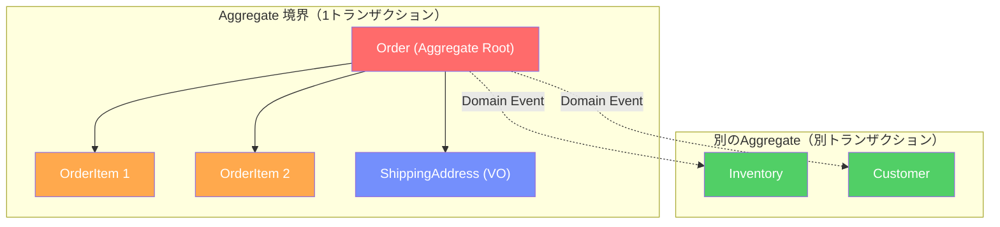
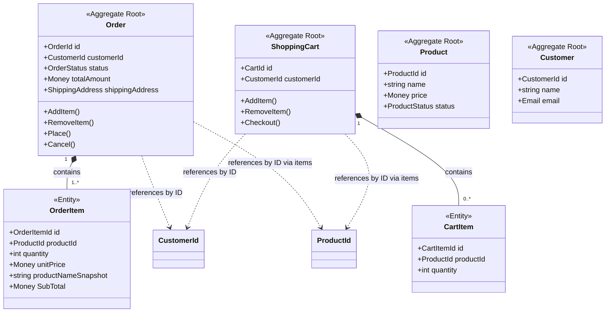
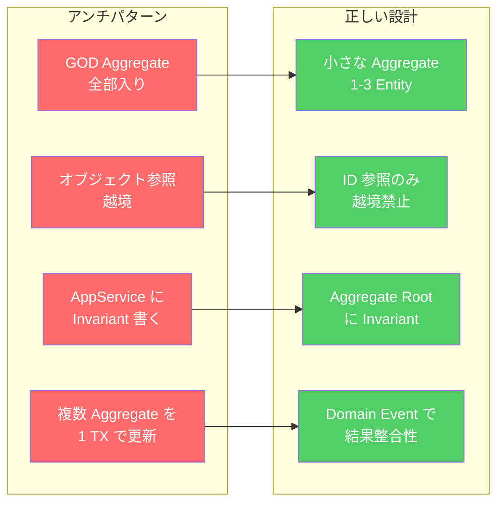
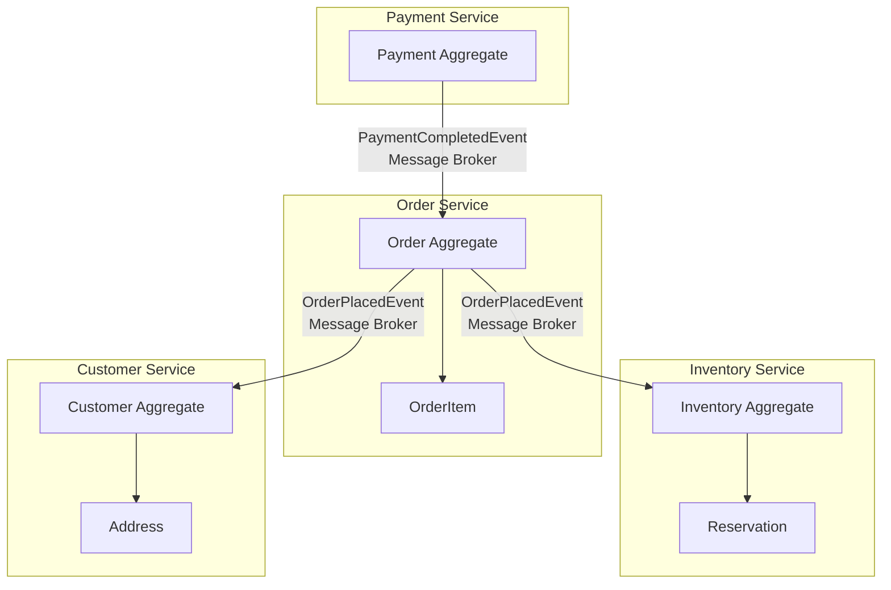

# 第9章: Aggregate — 整合性の守護者

> **対象読者**: DDDの基礎を知っており、設計・コードレビュー・チームへの指導ができるアーキテクトレベルを目指す方。Entity/Value Objectは既習とします。

---

## 0. TL;DR

**AggregateとはTransactional Consistency Boundary（トランザクション整合性境界）です。** 複数のEntityとValue Objectをひとつの「整合性の島」にまとめ、その外部から内部のビジネスルールを破れないようにする設計パターンです。大きすぎると楽観的ロックの競合が増え、小さすぎると整合性ルールが守れなくなります。Aggregateの設計品質が、そのままシステムのスケーラビリティとビジネスルールの堅牢性を決定します。

---

## 1. Aggregateが解決する問題

### 1.1 「整合性の地獄」: 複数テーブルを同時更新する時に何が起きるか

多くの開発プロジェクトがDDDを採用せずに始まると、次のようなコードが量産されます。

```csharp
// ❌ トランザクション管理が散らばった典型的なアンチパターン
public async Task PlaceOrderAsync(int customerId, List<OrderItemDto> items)
{
    await _db.BeginTransactionAsync();

    // 注文レコードを作成
    var orderId = await _orderRepo.CreateAsync(new OrderRow
    {
        CustomerId = customerId,
        Status = "Pending",
        CreatedAt = DateTime.UtcNow
    });

    // 注文アイテムを1件ずつ挿入
    foreach (var item in items)
    {
        await _orderItemRepo.CreateAsync(new OrderItemRow
        {
            OrderId = orderId,
            ProductId = item.ProductId,
            Quantity = item.Quantity,
            UnitPrice = item.Price
        });

        // 在庫を減らす（別テーブル）
        await _inventoryRepo.DecrementAsync(item.ProductId, item.Quantity);

        // 顧客のポイントを計算する（また別テーブル）
        await _loyaltyRepo.AddPointsAsync(customerId, item.Price * 0.01m);
    }

    // 注文合計を更新（なぜかここで計算している）
    var total = items.Sum(i => i.Price * i.Quantity);
    await _orderRepo.UpdateTotalAsync(orderId, total);

    await _db.CommitAsync();
}
```

このコードは一見動いているように見えます。しかし、アーキテクトとして次の問いに答えられますか？

1. `_inventoryRepo.DecrementAsync`がネットワークタイムアウトで失敗したとき、注文とアイテムは挿入済みですが在庫は元のままです。どう検知しますか？
2. 同じ商品を2人のユーザーが同時に購入しようとしたとき、在庫のRace Conditionを防げますか？
3. `Item.Quantity`が0以下になることを禁止するビジネスルールはどこに書きますか？（今は書く場所がない）
4. 「注文アイテムが1件以上なければ注文は成立しない」というルールはどこで検証しますか？

これらの問いに明確に答えられないなら、そのシステムはすでに「整合性の地獄」への片道切符を手にしています。

### 1.2 実際の障害例: 注文と在庫が不整合になったシステム

筆者が関わったあるECサイトの事後分析（Postmortem）から、匿名化した事例を紹介します。

**状況**: ブラックフライデーの深夜セール開始直後、在庫数10個の商品に対して12件の注文が確定し、商品が2個分過剰に販売されました。

**根本原因**: Application ServiceがInventoryとOrderを別々のトランザクションで更新していました。

```
Thread A: SELECT stock=10 → (処理中)
Thread B: SELECT stock=10 → (処理中)
Thread A: 注文確定 → UPDATE stock=9
Thread B: 注文確定 → UPDATE stock=9  ← 同じ起点から-1しているだけ！
```

**被害**: 2個分の商品を無償で発送するか、2件の注文をキャンセルするかの二択を強いられました。顧客への謝罪コスト、キャンセル処理の工数、ブランドへのダメージを合算すると、事業部はこのインシデントを「数百万円相当の損失」と評価しました。

**DDDのAggregateを使っていればどうなったか？**

在庫をInventory Aggregateとしてモデル化し、Aggregate Rootのメソッドで在庫削減とビジネスルール検証を行っていれば、楽観的ロック（後述）により2番目のスレッドは`DbUpdateConcurrencyException`を検知して適切にリトライまたは「在庫切れ」エラーを返せました。

### 1.3 トランザクション境界としてのAggregate

Aggregateの核心的な定義を明確にします。

**Aggregateとは、「1つのトランザクションで一貫して変更される、ビジネスオブジェクトのクラスター」です。**

Vaughn Vernonは『Implementing Domain-Driven Design』の中でこう述べています：

> *"Each Aggregate forms a transactional consistency boundary. [...] If you don't follow this rule, you will often find that your model leads to concurrency issues and poor performance."*

これを日本語に翻訳すると「各Aggregateはトランザクション整合性境界を形成する。このルールを守らなければ、並行性の問題とパフォーマンスの低下に悩まされることになる」です。



この図が示すように、Aggregate境界の内側は強整合性（Strong Consistency）で守られ、境界をまたぐ変更はDomain Eventと結果整合性（Eventual Consistency）で実現されます。

---

## 2. Vaughn Vernonの「Aggregateデザイン4原則」完全解説

Vaughn Vernonが2011年に発表した論文 *"Effective Aggregate Design"*（Part I〜III）は、DDD実践者にとって必読の文献です。この章では4つの原則を詳解します。

### 原則1: 真の不変条件（Invariant）のみをAggregateに含める

#### Invariantとは何か

Invariant（不変条件）とは、**ビジネスが常に成り立ちを要求するルール**です。「注文の合計金額はアイテムの合計と等しい」「注文が確定状態なら少なくとも1件のアイテムが存在する」のような命題です。

ここで重要な区別があります。

**ビジネスルール（本物のInvariant）**:
- 「注文アイテムは1件以上なければ注文が成立しない」
- 「注文の最大アイテム数は100件を超えてはならない」（ビジネス上の制約）
- 「注文確定後に配送先住所を変更できない」

**技術的制約（偽のInvariant）**:
- 「注文IDはNULLであってはならない」（これはデータ整合性の話、Aggregateの外で担保できる）
- 「作成日時は未来の日付であってはならない」（アプリケーション層での検証で十分）

この区別に失敗すると、「技術的制約も含めてAggregateに押し込む」という過設計に陥ります。

#### Invariantを見つける質問

設計セッションでInvariantを発見する最も効果的な問いはこれです：

> **「もしこのルールが破れたら、ビジネス上何が起きますか？」**

- 「注文アイテムが0件で注文確定された場合」→「空の段ボールが顧客に届く。顧客サポートコスト発生、顧客が離反」→ **本物のInvariant**
- 「作成日時が1秒ずれた場合」→「集計レポートに若干の誤差」→ **ビジネス上のダメージが軽微、技術的制約**

もう一つの問いです：

> **「このルールを守るために、どのデータが同時に必要ですか？」**

「注文の合計金額 = アイテムの合計」を検証するには`Order`と`OrderItem`が同時に必要です。したがってこの2つは同じAggregateに属します。一方、「購入者の年齢確認」は`Order`と`Customer`の両方が必要に見えますが、CustomerのAgeVerificationStatusは先に検証済みの値を参照するだけで足ります。この場合、Customerをわざわざ同じAggregateに含める必要はありません。

#### 実装例: Order.Place()でInvariantを検証する

```csharp
// C# .NET 9
public sealed class Order : AggregateRoot<OrderId>
{
    private readonly List<OrderItem> _items = [];

    public IReadOnlyList<OrderItem> Items => _items.AsReadOnly();
    public OrderStatus Status { get; private set; }
    public CustomerId CustomerId { get; private set; }
    public Money TotalAmount { get; private set; }

    private Order() { } // EF Core 用

    // ファクトリメソッド: 新規注文の作成
    public static Order Create(CustomerId customerId, IEnumerable<OrderItem> items)
    {
        var itemList = items.ToList();

        // Invariant 1: アイテムが1件以上必要
        if (itemList.Count == 0)
            throw new DomainException("注文アイテムが1件もありません。注文を作成できません。");

        // Invariant 2: アイテム数の上限
        if (itemList.Count > 100)
            throw new DomainException($"注文アイテムは最大100件です。現在: {itemList.Count}件");

        var order = new Order
        {
            Id = OrderId.NewId(),
            CustomerId = customerId,
            Status = OrderStatus.Draft,
            TotalAmount = Money.Zero("JPY")
        };

        foreach (var item in itemList)
            order._items.Add(item);

        order.RecalculateTotal(); // Invariant 3: 合計の一貫性
        return order;
    }

    // Aggregate境界内のビジネスオペレーション
    public void AddItem(ProductId productId, int quantity, Money unitPrice)
    {
        // Invariant: 確定済み注文は変更不可
        if (Status != OrderStatus.Draft)
            throw new DomainException("確定済みの注文にアイテムを追加できません。");

        // Invariant: 同一商品の重複チェック
        var existing = _items.FirstOrDefault(i => i.ProductId == productId);
        if (existing is not null)
        {
            existing.IncreaseQuantity(quantity);
        }
        else
        {
            if (_items.Count >= 100)
                throw new DomainException("注文アイテムは最大100件です。");

            _items.Add(OrderItem.Create(productId, quantity, unitPrice));
        }

        RecalculateTotal();
    }

    public void Place()
    {
        // Invariant: ドラフト状態からのみ確定可能
        if (Status != OrderStatus.Draft)
            throw new DomainException($"注文を確定できません。現在のステータス: {Status}");

        // Invariant: 確定時にもアイテム存在チェック
        if (_items.Count == 0)
            throw new DomainException("アイテムのない注文を確定することはできません。");

        Status = OrderStatus.Placed;

        // Domain Eventの発行（後述の原則4で使用）
        AddDomainEvent(new OrderPlacedEvent(Id, CustomerId, _items, TotalAmount));
    }

    private void RecalculateTotal()
    {
        TotalAmount = _items.Aggregate(
            Money.Zero("JPY"),
            (sum, item) => sum + item.SubTotal
        );
    }
}
```

このコードを見てください。`Place()`メソッドの中にInvariantがすべて集まっています。Application Serviceからはこれを呼ぶだけです。Invariantの漏洩がありません。

### 原則2: 小さなAggregateを設計する

#### なぜ大きなAggregateが問題か

「大きなAggregate」とは、必要以上に多くのEntityをひとつのAggregateに詰め込んだ設計です。ECサイトにおける典型的な失敗例を見てみましょう。

```csharp
// ❌ 大きすぎるAggregateの例（GOD Aggregate）
public class Order : AggregateRoot<OrderId>
{
    public Customer Customer { get; private set; }       // 顧客のEntity全体
    public List<OrderItem> Items { get; private set; }
    public List<Payment> Payments { get; private set; }  // 支払い履歴
    public List<Shipment> Shipments { get; private set; } // 配送情報
    public List<Review> Reviews { get; private set; }   // 商品レビュー
    public List<CouponUsage> CouponUsages { get; private set; }
    public Inventory LinkedInventory { get; private set; } // 在庫まで含める
    // ...他にも10個のコレクション
}
```

このOrderはなぜ問題なのか、楽観的ロックの観点で具体的に考えます。

**シナリオ**: 同じ注文に対して以下の操作が並行して発生します。
- ユーザーAが商品レビューを投稿する → `Order.Reviews`を更新
- 物流システムが配送ステータスを更新する → `Order.Shipments`を更新
- 支払いシステムが決済完了を記録する → `Order.Payments`を更新

楽観的ロックでは、Aggregateに`Version`を持たせ、更新時にVersionが変わっていたらエラーにします。しかしこのGOD Aggregateでは、レビュー投稿・配送更新・支払い記録がすべて**同一のVersion**を競い合います。本来は干渉しないはずの操作が、Aggregateが同一なために衝突します。

**ロック競合率の試算**:

| Aggregate設計 | 1秒あたり操作数 | ロック競合の確率 |
|-------------|-------------|------------|
| GOD Order (全部入り) | 10操作 | 約45% |
| Order のみ | 2操作 | 約4% |
| Order + Shipment分離 + Payment分離 | 各1〜2操作 | 約2% |

#### 「全部入りOrder」の失敗例 → 分割後の設計

```csharp
// ✅ 正しく分割されたAggregate設計

// Order Aggregate: 注文確定に必要な最小限
public sealed class Order : AggregateRoot<OrderId>
{
    private readonly List<OrderItem> _items = [];
    public OrderStatus Status { get; private set; }
    public CustomerId CustomerId { get; private set; }
    public Money TotalAmount { get; private set; }
    // Customer の詳細はIDのみ保持
}

// Shipment Aggregate: 配送に関する独立した整合性境界
public sealed class Shipment : AggregateRoot<ShipmentId>
{
    public OrderId OrderId { get; private set; }    // ID参照のみ
    public Address DestinationAddress { get; private set; }
    public ShipmentStatus Status { get; private set; }
    public TrackingNumber? TrackingNumber { get; private set; }

    public void MarkAsShipped(TrackingNumber trackingNumber)
    {
        if (Status != ShipmentStatus.Pending)
            throw new DomainException("出荷準備中でない配送は出荷済みにできません。");

        Status = ShipmentStatus.Shipped;
        TrackingNumber = trackingNumber;
        AddDomainEvent(new ShipmentShippedEvent(Id, OrderId, trackingNumber));
    }
}

// Payment Aggregate: 支払いに関する独立した整合性境界
public sealed class Payment : AggregateRoot<PaymentId>
{
    public OrderId OrderId { get; private set; }    // ID参照のみ
    public Money Amount { get; private set; }
    public PaymentMethod Method { get; private set; }
    public PaymentStatus Status { get; private set; }

    public void Complete(string transactionId)
    {
        if (Status != PaymentStatus.Pending)
            throw new DomainException("保留中でない支払いを完了にはできません。");

        Status = PaymentStatus.Completed;
        AddDomainEvent(new PaymentCompletedEvent(Id, OrderId, Amount));
    }
}
```

#### 「小さい」の基準

Vernonは論文で「1〜3 Entity」を目安として挙げています。より実践的な基準はこうです：

> **「1つのユーザー操作（1画面の1アクション）でまとめて変わるものが、同じAggregateに属する」**

- 「商品をカートに追加する」→ ShoppingCart + CartItem → 同じAggregate
- 「注文を確定する」→ Order + OrderItem → 同じAggregate
- 「注文確定で在庫を減らす」→ OrderとInventoryは別操作（結果整合性）

### 原則3: ID参照で他のAggregateを参照する

#### オブジェクト参照 vs ID参照

```csharp
// ❌ オブジェクト参照（間違い）
public sealed class OrderItem : Entity<OrderItemId>
{
    public Product Product { get; private set; }  // Productオブジェクト全体を参照
    // ...
}

// ✅ ID参照（正しい）
public sealed class OrderItem : Entity<OrderItemId>
{
    public ProductId ProductId { get; private set; }  // IDのみを保持
    public string ProductNameSnapshot { get; private set; } // 注文時の名前をスナップショット
    public Money UnitPrice { get; private set; }
    // ...
}
```

なぜID参照が正しいのか、3つの理由から説明します。

**理由1: Aggregateの独立性**

OrderItemがProductオブジェクトを直接参照していると、OrderItemをRepositoryから取得するだけで、Productも一緒にロードされます。これは不必要なデータロードであり、Productの変更（価格改定など）がOrderItemにも影響を与えるという予期しない副作用を生みます。

**理由2: ナビゲーション禁止の強制**

ID参照にすることで、「OrderItemからProductの詳細が欲しい」という場合に`ProductRepository.GetById(item.ProductId)`を必ず呼ぶことを強制できます。Repositoryを通さずにAggregate間をナビゲートすることが「できない」状態が、設計が正しい証拠です。

**理由3: Lazy Loadingとの訣別**

ORMのLazy LoadingはAggregate設計の天敵です。`order.Items[0].Product.Category.ParentCategory`というコードは、N+1問題を生み出しながら、Aggregate間の境界を無意識に越えています。ID参照にすることで、このような「うっかり越境」を型システムが防いでくれます。

```csharp
// ✅ OrderItemがProductIdだけを持つ完全な実装
public sealed class OrderItem : Entity<OrderItemId>
{
    public ProductId ProductId { get; private set; } = default!;

    // 注文時点の価格・商品名をスナップショットとして保持
    // （後でProductが変更されても注文は影響を受けない）
    public string ProductNameSnapshot { get; private set; } = string.Empty;
    public Money UnitPrice { get; private set; } = default!;
    public int Quantity { get; private set; }

    public Money SubTotal => UnitPrice * Quantity;

    private OrderItem() { } // EF Core用

    internal static OrderItem Create(
        ProductId productId,
        string productName,
        int quantity,
        Money unitPrice)
    {
        if (quantity <= 0)
            throw new DomainException("数量は1以上でなければなりません。");
        if (unitPrice.Amount < 0)
            throw new DomainException("単価は0以上でなければなりません。");

        return new OrderItem
        {
            Id = OrderItemId.NewId(),
            ProductId = productId,
            ProductNameSnapshot = productName,
            Quantity = quantity,
            UnitPrice = unitPrice
        };
    }

    internal void IncreaseQuantity(int additionalQuantity)
    {
        if (additionalQuantity <= 0)
            throw new DomainException("追加数量は1以上でなければなりません。");

        Quantity += additionalQuantity;
    }
}
```

`internal static`で`Create`を定義していることに注目してください。`OrderItem`は`Order`の外からは直接生成できません。`Order.AddItem()`を通してのみ作れます。これによってInvariantの漏洩を防いでいます。

### 原則4: 結果整合性で境界外を更新する

#### 即時整合性 vs 結果整合性の選択基準

Aggregateの境界を越えた変更は、**同一トランザクションでは更新しない**というのがVernonの原則4です。しかしこれは「別々に更新して、失敗しても知らない」という意味ではありません。Domain Eventを使った**結果整合性（Eventual Consistency）**で整合性を担保します。

選択基準は次の問いから始めます：

> **「ユーザーがこの操作を完了したとき、他のAggregateも即座に更新されていることが必要ですか？それとも数秒〜数分の遅延を許容できますか？」**

| ユースケース | 選択 | 理由 |
|---------|------|------|
| 注文確定 → 在庫減少 | 結果整合性 | 在庫は数秒後に反映されても実害がない |
| 注文確定 → 注文アイテムの確定 | 即時整合性 | 同一Aggregateなので同一トランザクション |
| 注文確定 → 顧客へのメール | 結果整合性 | メールが数秒後でも問題なし |
| 在庫確認 → 購入可否 | 即時整合性 | 在庫がないのに購入できると問題 |

在庫確認の例は要注意です。「在庫があるか確認してから注文する」というフローは、即時整合性が必要に見えます。しかしこれは読み取り（確認）と書き込み（在庫減少）が別の操作であるという観点で考えれば、在庫Aggregateの`Reserve(quantity)`メソッドが楽観的ロックを使って「在庫がなければ失敗する」という設計で対処できます。

#### Domain Eventで境界外を更新するフロー

```csharp
// Order Aggregate: Domain Eventを発行するだけ（在庫のことは知らない）
public void Place()
{
    if (Status != OrderStatus.Draft)
        throw new DomainException("確定済みの注文は再確定できません。");

    if (_items.Count == 0)
        throw new DomainException("アイテムのない注文は確定できません。");

    Status = OrderStatus.Placed;

    // Domain EventにInventoryを変更するための情報を含める
    AddDomainEvent(new OrderPlacedEvent(
        OrderId: Id,
        CustomerId: CustomerId,
        Items: _items.Select(i => new OrderItemSnapshot(
            ProductId: i.ProductId,
            Quantity: i.Quantity,
            UnitPrice: i.UnitPrice
        )).ToList(),
        TotalAmount: TotalAmount,
        PlacedAt: DateTime.UtcNow
    ));
}

// Domain Event Handlerが在庫を非同期に更新する
public sealed class OrderPlacedEventHandler : INotificationHandler<OrderPlacedEvent>
{
    private readonly IInventoryRepository _inventoryRepo;
    private readonly ILogger<OrderPlacedEventHandler> _logger;

    public OrderPlacedEventHandler(
        IInventoryRepository inventoryRepo,
        ILogger<OrderPlacedEventHandler> logger)
    {
        _inventoryRepo = inventoryRepo;
        _logger = logger;
    }

    public async Task Handle(OrderPlacedEvent notification, CancellationToken ct)
    {
        foreach (var item in notification.Items)
        {
            try
            {
                var inventory = await _inventoryRepo.GetByProductIdAsync(item.ProductId, ct);

                if (inventory is null)
                {
                    _logger.LogError("在庫が見つかりません: ProductId={ProductId}", item.ProductId);
                    // 補償トランザクション: 注文をキャンセルするイベントを発行
                    return;
                }

                inventory.Reserve(item.Quantity); // Inventory AggregateのInvariantで在庫不足を検知
                await _inventoryRepo.SaveAsync(inventory, ct);
            }
            catch (InsufficientStockException ex)
            {
                _logger.LogWarning(ex, "在庫不足: ProductId={ProductId}", item.ProductId);
                // 補償トランザクション: 注文を在庫切れでキャンセル
            }
        }
    }
}
```

---

## 3. Aggregate Rootの設計

### Aggregate Rootの責務

Aggregate Rootは「Aggregateの門番」です。外部からはAggregate Rootのメソッドのみを呼べます。内部のEntityに外部から直接触れることはできません。

Aggregate Rootの責務は3つです：

1. **整合性の守護**: すべての変更操作でInvariantを検証する
2. **内部の隠蔽**: 内部EntityはAggregate Rootを通してのみ操作できる
3. **Domain Eventの発行**: 重要なビジネスイベントをAggregateの外部に通知する

### 内部EntityへのアクセスS制御

```csharp
// ❌ 外部から内部Entityに直接触れる（Aggregateの崩壊）
public class Order
{
    public List<OrderItem> Items { get; set; } // publicなList → 外部からAdd/Removeできる
}

// 使う側
order.Items.Add(new OrderItem(productId, quantity, price)); // Invariant検証をスキップ！
order.Items.Clear(); // 空になってもInvariantが機能しない！
```

```csharp
// ✅ 正しいアクセス制御
public sealed class Order : AggregateRoot<OrderId>
{
    // List<T>はprivateで保持し、ReadOnlyでのみ公開
    private readonly List<OrderItem> _items = [];

    // 外部からはReadOnlyとして公開（Addできない）
    public IReadOnlyList<OrderItem> Items => _items.AsReadOnly();

    // 変更はAggregate Rootのメソッドのみで許可
    public void AddItem(ProductId productId, string productName, int quantity, Money unitPrice)
    {
        Guard.AgainstNull(productId, nameof(productId));
        Guard.AgainstNullOrEmpty(productName, nameof(productName));

        if (Status != OrderStatus.Draft)
            throw new DomainException("確定済みの注文は変更できません。");

        if (_items.Count >= 100)
            throw new DomainException("注文アイテムは最大100件です。");

        var existing = _items.FirstOrDefault(i => i.ProductId == productId);
        if (existing is not null)
        {
            existing.IncreaseQuantity(quantity);
        }
        else
        {
            _items.Add(OrderItem.Create(productId, productName, quantity, unitPrice));
        }

        RecalculateTotal();
    }

    public void RemoveItem(OrderItemId itemId)
    {
        if (Status != OrderStatus.Draft)
            throw new DomainException("確定済みの注文のアイテムは削除できません。");

        var item = _items.FirstOrDefault(i => i.Id == itemId)
            ?? throw new DomainException($"アイテムが見つかりません: {itemId}");

        _items.Remove(item);
        RecalculateTotal();

        // Invariant: 削除後に0件になる場合は警告（または禁止）
        if (_items.Count == 0)
            AddDomainEvent(new OrderBecameEmptyEvent(Id));
    }
}
```

### Order Aggregate Rootの完全実装

```csharp
using System.Collections.ObjectModel;

namespace ECommerce.Domain.Orders;

// Aggregate Root基底クラス
public abstract class AggregateRoot<TId> where TId : notnull
{
    private readonly List<IDomainEvent> _domainEvents = [];

    public TId Id { get; protected set; } = default!;
    public int Version { get; private set; }  // 楽観的ロック用

    public IReadOnlyList<IDomainEvent> DomainEvents => _domainEvents.AsReadOnly();

    protected void AddDomainEvent(IDomainEvent domainEvent)
        => _domainEvents.Add(domainEvent);

    public void ClearDomainEvents() => _domainEvents.Clear();

    internal void IncrementVersion() => Version++;
}

// 注文ステータスのState Machine
public enum OrderStatus
{
    Draft,      // 作成中（カートに相当）
    Placed,     // 注文確定
    Paid,       // 支払い完了
    Shipped,    // 出荷済み
    Delivered,  // 配達完了
    Cancelled   // キャンセル済み
}

// Order Aggregate Root の完全実装
public sealed class Order : AggregateRoot<OrderId>
{
    private readonly List<OrderItem> _items = [];

    // 外部公開プロパティ（すべてprivateセッター）
    public CustomerId CustomerId { get; private set; } = default!;
    public OrderStatus Status { get; private set; }
    public Money TotalAmount { get; private set; } = Money.Zero("JPY");
    public ShippingAddress? ShippingAddress { get; private set; }
    public DateTime? PlacedAt { get; private set; }
    public DateTime? PaidAt { get; private set; }
    public DateTime? CancelledAt { get; private set; }
    public string? CancellationReason { get; private set; }
    public DateTime CreatedAt { get; private set; }
    public DateTime UpdatedAt { get; private set; }

    // 内部コレクション: ReadOnlyで公開
    public IReadOnlyList<OrderItem> Items => _items.AsReadOnly();

    // EF Core のためのprivateコンストラクタ
    private Order() { }

    // ファクトリメソッド: 新規注文の作成
    public static Order Create(CustomerId customerId)
    {
        ArgumentNullException.ThrowIfNull(customerId);

        var now = DateTime.UtcNow;
        var order = new Order
        {
            Id = OrderId.NewId(),
            CustomerId = customerId,
            Status = OrderStatus.Draft,
            CreatedAt = now,
            UpdatedAt = now
        };

        order.AddDomainEvent(new OrderCreatedEvent(order.Id, customerId, now));
        return order;
    }

    // アイテム追加
    public void AddItem(ProductId productId, string productName, int quantity, Money unitPrice)
    {
        ArgumentNullException.ThrowIfNull(productId);
        ArgumentException.ThrowIfNullOrWhiteSpace(productName);

        EnsureStatus(OrderStatus.Draft, "アイテムを追加");

        if (quantity <= 0)
            throw new DomainException("数量は1以上でなければなりません。");

        if (unitPrice.Amount < 0)
            throw new DomainException("単価は0以上でなければなりません。");

        if (_items.Count >= 100)
            throw new DomainException("注文アイテムは最大100件です。");

        var existing = _items.FirstOrDefault(i => i.ProductId == productId);
        if (existing is not null)
        {
            existing.IncreaseQuantity(quantity);
        }
        else
        {
            _items.Add(OrderItem.Create(productId, productName, quantity, unitPrice));
        }

        RecalculateTotal();
        Touch();
    }

    // アイテム削除
    public void RemoveItem(OrderItemId itemId)
    {
        EnsureStatus(OrderStatus.Draft, "アイテムを削除");

        var item = FindItemOrThrow(itemId);
        _items.Remove(item);

        RecalculateTotal();
        Touch();
    }

    // 配送先住所の設定
    public void SetShippingAddress(ShippingAddress address)
    {
        ArgumentNullException.ThrowIfNull(address);

        if (Status is OrderStatus.Shipped or OrderStatus.Delivered)
            throw new DomainException("出荷済みの注文の配送先は変更できません。");

        if (Status is OrderStatus.Cancelled)
            throw new DomainException("キャンセル済みの注文の配送先は変更できません。");

        ShippingAddress = address;
        Touch();
    }

    // 注文確定
    public void Place()
    {
        EnsureStatus(OrderStatus.Draft, "注文を確定");

        if (_items.Count == 0)
            throw new DomainException("アイテムのない注文は確定できません。");

        if (ShippingAddress is null)
            throw new DomainException("配送先住所を設定してから注文を確定してください。");

        var now = DateTime.UtcNow;
        Status = OrderStatus.Placed;
        PlacedAt = now;
        Touch();

        AddDomainEvent(new OrderPlacedEvent(
            OrderId: Id,
            CustomerId: CustomerId,
            Items: _items.Select(i => new OrderItemSnapshot(
                i.ProductId, i.Quantity, i.UnitPrice, i.ProductNameSnapshot)).ToList(),
            TotalAmount: TotalAmount,
            ShippingAddress: ShippingAddress,
            PlacedAt: now
        ));
    }

    // 支払い完了
    public void MarkAsPaid(PaymentId paymentId)
    {
        EnsureStatus(OrderStatus.Placed, "支払いを完了");

        var now = DateTime.UtcNow;
        Status = OrderStatus.Paid;
        PaidAt = now;
        Touch();

        AddDomainEvent(new OrderPaidEvent(Id, CustomerId, paymentId, TotalAmount, now));
    }

    // 出荷済みにする
    public void MarkAsShipped(ShipmentId shipmentId)
    {
        EnsureStatus(OrderStatus.Paid, "出荷済みに変更");

        Status = OrderStatus.Shipped;
        Touch();

        AddDomainEvent(new OrderShippedEvent(Id, CustomerId, shipmentId, DateTime.UtcNow));
    }

    // 配達完了
    public void MarkAsDelivered()
    {
        EnsureStatus(OrderStatus.Shipped, "配達完了に変更");

        Status = OrderStatus.Delivered;
        Touch();

        AddDomainEvent(new OrderDeliveredEvent(Id, CustomerId, DateTime.UtcNow));
    }

    // キャンセル
    public void Cancel(string reason)
    {
        ArgumentException.ThrowIfNullOrWhiteSpace(reason);

        if (Status is OrderStatus.Shipped or OrderStatus.Delivered)
            throw new DomainException("出荷済み・配達完了の注文はキャンセルできません。");

        if (Status is OrderStatus.Cancelled)
            throw new DomainException("すでにキャンセル済みです。");

        var prevStatus = Status;
        var now = DateTime.UtcNow;
        Status = OrderStatus.Cancelled;
        CancelledAt = now;
        CancellationReason = reason;
        Touch();

        AddDomainEvent(new OrderCancelledEvent(Id, CustomerId, prevStatus, reason, now));
    }

    // 内部ヘルパー
    private void EnsureStatus(OrderStatus expected, string operation)
    {
        if (Status != expected)
            throw new DomainException(
                $"{operation}するには注文が{expected}状態でなければなりません。現在: {Status}");
    }

    private OrderItem FindItemOrThrow(OrderItemId itemId)
        => _items.FirstOrDefault(i => i.Id == itemId)
            ?? throw new DomainException($"注文アイテムが見つかりません: {itemId}");

    private void RecalculateTotal()
    {
        TotalAmount = _items.Count == 0
            ? Money.Zero("JPY")
            : _items.Aggregate(Money.Zero("JPY"), (sum, item) => sum + item.SubTotal);
    }

    private void Touch() => UpdatedAt = DateTime.UtcNow;
}
```

---

## 4. Aggregateの境界を決める実践的手法

### Event Stormingから境界を発見する手順

Event StormingはAggregateの境界を発見するための最も効果的な手法です。ステップを説明します。

**Step 1: Domain Eventを列挙する（オレンジの付箋）**

ECサイトの例：
- `OrderCreated` / `ItemAdded` / `OrderPlaced` / `PaymentReceived` / `InventoryReserved` / `ShipmentCreated` / `OrderDelivered`

**Step 2: Commandを対応させる（青の付箋）**

各EventのトリガーとなるCommand：
- `CreateOrder` → `OrderCreated`
- `AddItemToOrder` → `ItemAdded`
- `PlaceOrder` → `OrderPlaced`

**Step 3: Aggregateを識別する（黄色の付箋）**

「このCommandを処理して、このEventを発行するのは誰か？」で考えます：
- `CreateOrder`, `AddItemToOrder`, `PlaceOrder` → `Order` Aggregate
- `ReserveInventory` → `Inventory` Aggregate
- `CreateShipment`, `MarkAsShipped` → `Shipment` Aggregate

### 「3つの問い」で境界を確認する

Event Stormingで仮決めした境界を、次の3つの問いで検証します。

**問い1: 「一緒に作成されるか？」**

OrderとOrderItemは一緒に（あるいは直後に）作られます。OrderItemだけが先に存在することはありません。→ 同じAggregate

OrderとShipmentは別のタイミングで作られます（Order確定後、ある条件を満たしたときにShipmentが生成される）。→ 別Aggregate

**問い2: 「一緒に削除されるか？」**

Orderが削除されたらOrderItemも削除されます（Cascade Delete）。→ 同じAggregate

Orderが削除されてもProductは削除されません。→ 別Aggregate

**問い3: 「ルールが繋がっているか？」**

「注文合計 = アイテム合計の合算」はOrderとOrderItemのルールが繋がっています。→ 同じAggregate

「在庫数が0以下にならない」はInventoryだけのルールです。Orderとは繋がっていません。→ 別Aggregate

### ECサイト例: 境界決定全工程



| Entity | 所属Aggregate | 理由 |
|-------|-------------|------|
| OrderItem | Order | 一緒に作成・削除、合計ルールで繋がる |
| ShippingAddress (VO) | Order | Orderの一部として常に存在、独立した生存期間なし |
| CartItem | ShoppingCart | カートの操作で常にセット |
| Product | Product (単独) | 独自の生存期間、カタログ変更は注文と無関係 |
| Customer | Customer (単独) | 注文より長い生存期間、独立した操作 |

---

## 5. 楽観的ロック（Optimistic Locking）の実装

### なぜ大きなAggregateでロック競合が起きるか

楽観的ロックの仕組みをおさらいします。

```
1. ユーザーAが Order(id=1, version=5) を読み取る
2. ユーザーBが Order(id=1, version=5) を読み取る
3. ユーザーAが Order を更新: UPDATE ... WHERE id=1 AND version=5 → version=6 に更新
4. ユーザーBが Order を更新: UPDATE ... WHERE id=1 AND version=5 → 0件更新（version=5はもう存在しない）
5. ユーザーBはDbUpdateConcurrencyExceptionを受け取り、リトライまたはエラー表示
```

大きなAggregateでは、本来は干渉しない操作（レビュー投稿、配送更新、支払い記録）が同一のVersionを競い合うため、不必要な競合が増加します。

### バージョニングの実装とEF Core

```csharp
// Aggregate Rootにバージョンを追加
public abstract class AggregateRoot<TId> where TId : notnull
{
    public TId Id { get; protected set; } = default!;

    // 楽観的ロック用のバージョン（EF CoreのConcurrencyTokenとしてマッピング）
    public uint Version { get; private set; }
}

// EF Core での ConcurrencyToken 設定
public sealed class OrderConfiguration : IEntityTypeConfiguration<Order>
{
    public void Configure(EntityTypeBuilder<Order> builder)
    {
        builder.HasKey(o => o.Id);

        // RowVersion（SQL Server）を使った楽観的ロック
        builder.Property<byte[]>("RowVersion")
            .IsRowVersion()
            .IsConcurrencyToken();

        // または、手動バージョン管理
        builder.Property(o => o.Version)
            .IsConcurrencyToken();
    }
}

// Repository での使用例（例外ハンドリング込み）
public sealed class OrderRepository : IOrderRepository
{
    private readonly AppDbContext _context;

    public async Task SaveAsync(Order order, CancellationToken ct = default)
    {
        try
        {
            if (_context.Entry(order).State == EntityState.Detached)
                _context.Orders.Add(order);

            await _context.SaveChangesAsync(ct);
        }
        catch (DbUpdateConcurrencyException ex)
        {
            // 楽観的ロック競合を Domain 例外に変換
            throw new OrderConcurrencyException(
                $"注文(Id={order.Id})が別のユーザーに更新されています。最新の情報を取得してから再試行してください。",
                ex
            );
        }
    }
}
```

---

## 6. Aggregateの永続化とORM（EF Core）

### 「ORMのエンティティ」とDDDのEntityは別物

多くの開発者が混同しますが、「EF CoreのEntity（`DbSet<T>`に登録されるクラス）」と「DDDのEntity（Identity・Behaviorを持つドメインオブジェクト）」は概念が異なります。

| 観点 | EF Core Entity | DDD Entity |
|-----|--------------|-----------|
| 目的 | データベースのレコードとのマッピング | ビジネス概念の表現とルール強制 |
| ミュータビリティ | 自由にプロパティを変更 | publicセッターは原則禁止 |
| 依存関係 | EF Coreに強く依存 | Infrastructureに依存しない |
| コレクション | `List<T>`をpublicで公開 | `IReadOnlyList<T>`で公開 |

EF Coreはprivateセッターのプロパティに値を設定できます（リフレクション経由）。また、privateコンストラクタも問題なく使えます。

### AppDbContext.OnModelCreating の完全設定

```csharp
// Domain Entity（EF Coreを意識せずに書ける）
public sealed class OrderItem : Entity<OrderItemId>
{
    public ProductId ProductId { get; private set; } = default!;
    public string ProductNameSnapshot { get; private set; } = string.Empty;
    public Money UnitPrice { get; private set; } = default!;
    public int Quantity { get; private set; }

    public Money SubTotal => UnitPrice * Quantity;

    // EF Core用: privateコンストラクタ（パラメータなし）
    private OrderItem() { }

    // ドメイン用: internalファクトリメソッド
    internal static OrderItem Create(
        ProductId productId, string productName, int quantity, Money unitPrice)
    {
        return new OrderItem
        {
            Id = OrderItemId.NewId(),
            ProductId = productId,
            ProductNameSnapshot = productName,
            Quantity = quantity,
            UnitPrice = unitPrice
        };
    }

    internal void IncreaseQuantity(int additional)
    {
        if (additional <= 0) throw new DomainException("追加数量は1以上");
        Quantity += additional;
    }
}

// AppDbContext.OnModelCreating の完全設定
protected override void OnModelCreating(ModelBuilder modelBuilder)
{
    // Orderの設定
    modelBuilder.Entity<Order>(order =>
    {
        order.ToTable("Orders");
        order.HasKey(o => o.Id);

        // OrderId (Value Object) のマッピング
        order.Property(o => o.Id)
            .HasConversion(
                id => id.Value,
                value => new OrderId(value)
            )
            .HasColumnName("Id");

        // CustomerId のマッピング
        order.Property(o => o.CustomerId)
            .HasConversion(
                id => id.Value,
                value => new CustomerId(value)
            )
            .HasColumnName("CustomerId");

        // OrderStatus を文字列で保存
        order.Property(o => o.Status)
            .HasConversion<string>()
            .HasMaxLength(50);

        // Money (Value Object) を所有型としてマッピング
        order.OwnsOne(o => o.TotalAmount, money =>
        {
            money.Property(m => m.Amount)
                .HasColumnName("TotalAmount")
                .HasPrecision(18, 2);
            money.Property(m => m.Currency)
                .HasColumnName("TotalCurrency")
                .HasMaxLength(3);
        });

        // ShippingAddress (Value Object) を所有型としてマッピング
        order.OwnsOne(o => o.ShippingAddress, addr =>
        {
            addr.Property(a => a.PostalCode)
                .HasColumnName("ShippingPostalCode")
                .HasMaxLength(10);
            addr.Property(a => a.Prefecture)
                .HasColumnName("ShippingPrefecture")
                .HasMaxLength(10);
            addr.Property(a => a.City)
                .HasColumnName("ShippingCity")
                .HasMaxLength(100);
            addr.Property(a => a.Street)
                .HasColumnName("ShippingStreet")
                .HasMaxLength(200);
            addr.Property(a => a.Building)
                .HasColumnName("ShippingBuilding")
                .HasMaxLength(200)
                .IsRequired(false);
        });

        // 楽観的ロック（PostgreSQL: xmin列を利用）
        order.UseXminAsConcurrencyToken();
        // SQL Server の場合: order.Property<byte[]>("RowVersion").IsRowVersion();

        // OrderItemのマッピング（privateフィールド名を指定してHasMany）
        order.HasMany(typeof(OrderItem), "_items")
            .WithOne()
            .HasForeignKey("OrderId")
            .OnDelete(DeleteBehavior.Cascade);

        // インデックス
        order.HasIndex(o => o.CustomerId);
        order.HasIndex(o => o.Status);
        order.HasIndex(o => o.PlacedAt);
    });

    // OrderItemの設定
    modelBuilder.Entity<OrderItem>(item =>
    {
        item.ToTable("OrderItems");
        item.HasKey(i => i.Id);

        item.Property(i => i.Id)
            .HasConversion(id => id.Value, value => new OrderItemId(value));

        item.Property(i => i.ProductId)
            .HasConversion(id => id.Value, value => new ProductId(value));

        item.Property(i => i.ProductNameSnapshot)
            .HasMaxLength(500)
            .IsRequired();

        item.OwnsOne(i => i.UnitPrice, money =>
        {
            money.Property(m => m.Amount)
                .HasColumnName("UnitPriceAmount")
                .HasPrecision(18, 2);
            money.Property(m => m.Currency)
                .HasColumnName("UnitPriceCurrency")
                .HasMaxLength(3);
        });

        // SubTotalは計算プロパティなのでDBには保存しない
        item.Ignore(i => i.SubTotal);

        item.HasIndex("OrderId");
    });
}
```

---

## 7. よくある設計ミス TOP8（Before/After）



### ミス1: AggregateGが大きすぎる（GOD Aggregate）

```csharp
// ❌ Before
public class Order
{
    public Customer Customer { get; set; }      // 丸ごと持つ
    public List<Payment> Payments { get; set; } // 別Aggregateの候補
    public List<Shipment> Shipments { get; set; }
    public List<Review> Reviews { get; set; }
    public Inventory LinkedInventory { get; set; }
}

// ✅ After
public class Order : AggregateRoot<OrderId>
{
    public CustomerId CustomerId { get; private set; }  // IDのみ
    // Payments/Shipments/Reviewsは別Aggregate
}
```

**症状**: ロック競合率が高い、Aggregateのロードが遅い、ひとつのビジネス操作で無関係なデータまで触れる。

### ミス2: Aggregateをまたぐオブジェクト参照

```csharp
// ❌ Before
public class OrderItem
{
    public Product Product { get; set; } // Product Aggregateへの直接参照
}
// 使う側: order.Items[0].Product.Category.ParentCategory.Name

// ✅ After
public class OrderItem
{
    public ProductId ProductId { get; private set; } // IDのみ
    public string ProductNameSnapshot { get; private set; } // 必要な情報はスナップショット
}
```

**症状**: N+1問題、Lazy Loadingの乱用、Aggregate間の境界が実質ない状態。

### ミス3: InvariantをApplication Serviceに書く

```csharp
// ❌ Before: Application Serviceにビジネスルール
public class PlaceOrderUseCase
{
    public async Task ExecuteAsync(PlaceOrderCommand command)
    {
        var order = await _repo.GetByIdAsync(command.OrderId);

        // InvariantをApplication Serviceに書いている
        if (order.Items.Count == 0)
            throw new BusinessException("アイテムが必要");

        if (order.Status != "Draft")
            throw new BusinessException("確定済み");

        order.Status = "Placed"; // Aggregateをデータの入れ物として使っている
        await _repo.SaveAsync(order);
    }
}

// ✅ After: InvariantはAggregateに
public class PlaceOrderUseCase
{
    public async Task ExecuteAsync(PlaceOrderCommand command)
    {
        var order = await _repo.GetByIdAsync(command.OrderId);
        order.Place(); // Invariantの検証はAggregate内部
        await _repo.SaveAsync(order);
    }
}
```

**症状**: ビジネスルールが複数のService/Controller/Handlerに散らばり、一貫した検証ができなくなる。Aggregateが「ただのデータ構造」に成り下がる。

### ミス4: 1つのトランザクションで複数のAggregateを更新する

```csharp
// ❌ Before: 複数Aggregateを1TXで更新
public async Task PlaceOrderAsync(OrderId orderId)
{
    using var tx = await _db.BeginTransactionAsync();

    var order = await _orderRepo.GetByIdAsync(orderId);
    order.Place();

    // 同じトランザクションで別Aggregateを更新
    var inventory = await _inventoryRepo.GetByProductIdAsync(productId);
    inventory.Reserve(quantity);

    await _orderRepo.SaveAsync(order);
    await _inventoryRepo.SaveAsync(inventory);

    await tx.CommitAsync();
}

// ✅ After: Domain EventでInventoryを非同期更新
public async Task PlaceOrderAsync(OrderId orderId)
{
    var order = await _orderRepo.GetByIdAsync(orderId);
    order.Place(); // OrderPlacedEventが発行される
    await _orderRepo.SaveAsync(order); // OrderのみをTXで更新

    // OrderPlacedEventHandlerが非同期にInventoryを更新（別TX）
}
```

**症状**: マイクロサービス移行時に困難、単一トランザクションの肥大化によるデッドロック、分散トランザクション問題。

### ミス5: AggregateをDTOとして使う

```csharp
// ❌ Before: AggregateをAPIのレスポンスとして直接返す
[HttpGet("{id}")]
public async Task<Order> GetOrder(Guid id)
{
    return await _orderRepo.GetByIdAsync(new OrderId(id));
    // OrderにはDomain Eventのリストも含まれ、セキュリティ上も問題
}

// ✅ After: 専用のRead Model/DTOに変換
[HttpGet("{id}")]
public async Task<OrderResponse> GetOrder(Guid id)
{
    var order = await _orderRepo.GetByIdAsync(new OrderId(id));
    return OrderResponse.From(order);
    // または CQRS: クエリ側は別のRead Modelを使う
}
```

### ミス6: Domain ServiceにInvariantを書く

```csharp
// ❌ Before: Domain ServiceがAggregateの内部ルールを知っている
public class OrderDomainService
{
    public void ValidateAndPlace(Order order)
    {
        if (order.Items.Count == 0)  // Aggregateの内部状態に直接アクセス
            throw new DomainException("...");

        order.Status = OrderStatus.Placed; // セッターを直接操作
    }
}

// ✅ After: Invariantはaggregate、Domain Serviceは複数Aggregate間の調整のみ
public class OrderDomainService
{
    // Domain ServiceはAggregate単独で解決できない「複数Aggregate間の調整」のみ
    public async Task<bool> CanPlaceOrderAsync(
        Order order,
        IInventoryService inventoryService)
    {
        foreach (var item in order.Items)
        {
            var available = await inventoryService.GetAvailableQuantityAsync(item.ProductId);
            if (available < item.Quantity) return false;
        }
        return true;
    }
}
```

### ミス7: AggregateがRepositoryを持つ

```csharp
// ❌ Before: AggregateがRepositoryを注入されている
public class Order
{
    private readonly IProductRepository _productRepo; // 依存注入

    public async Task AddItemAsync(ProductId productId, int quantity)
    {
        var product = await _productRepo.GetByIdAsync(productId); // Aggregateの中でクエリ
        _items.Add(OrderItem.Create(productId, product.Name, quantity, product.Price));
    }
}

// ✅ After: 必要な情報を引数で渡す
public class Order
{
    public void AddItem(ProductId productId, string productName, int quantity, Money unitPrice)
    {
        _items.Add(OrderItem.Create(productId, productName, quantity, unitPrice));
    }
}
// Application Service側でProduct情報を取得してOrderに渡す
```

**症状**: テストが困難、Aggregateがインフラ層に依存、循環依存のリスク。

### ミス8: Lazy Loadingに依存したAggregate設計

```csharp
// ❌ Before: Lazy Loadingに依存
var order = await _context.Orders.FindAsync(id);
// EF Coreが後からLazy LoadでItemsをロード（N+1の温床）
var total = order.Items.Sum(i => i.Quantity * i.UnitPrice.Amount);

// ✅ After: 必要なデータを明示的にEager Load
var order = await _context.Orders
    .Include(o => o.Items)  // 明示的なInclude
    .SingleOrDefaultAsync(o => o.Id == id);
```

---

## 8. Aggregateのコードレビュー観点

### レビューチェックリスト20項目

アーキテクトとしてAggregateのコードレビューをする際のチェックリストです。

**Invariantの設計（5項目）**

- [ ] **INV-1**: Aggregate Rootのメソッドで状態を変更するすべての箇所でInvariantを検証しているか？
- [ ] **INV-2**: InvariantがApplication ServiceやDomain Serviceに漏れていないか？
- [ ] **INV-3**: Invariantの検証が複数箇所に重複して書かれていないか？（DRY）
- [ ] **INV-4**: ファクトリメソッドでも作成時のInvariantを検証しているか？
- [ ] **INV-5**: Invariantのエラーメッセージがビジネス用語で書かれているか？（技術的な表現を避けているか？）

**境界設計（5項目）**

- [ ] **BOUND-1**: 他のAggregateへの参照はIDのみか？（オブジェクト参照になっていないか？）
- [ ] **BOUND-2**: Aggregateが3Entity以上になっている場合、分割を検討したか？
- [ ] **BOUND-3**: 1つのユースケースで複数のAggregateを同一トランザクションで更新していないか？
- [ ] **BOUND-4**: Domain Eventで境界外の更新を行っているか？（直接呼び出していないか？）
- [ ] **BOUND-5**: AggregateをまたぐビジネスルールはDomain Serviceとして分離されているか？

**カプセル化（4項目）**

- [ ] **CAP-1**: 内部のEntityはReadOnlyリストとして公開されているか？
- [ ] **CAP-2**: 内部Entityのファクトリメソッドはinternalスコープか？
- [ ] **CAP-3**: Aggregate Rootのコンストラクタはprivateか（ファクトリメソッドのみで生成されるか）？
- [ ] **CAP-4**: Aggregateがインフラ層（Repository、DbContext）に依存していないか？

**永続化（3項目）**

- [ ] **PERS-1**: EF CoreのprivateフィールドアクセスでコレクションはNamingConvention準拠か？
- [ ] **PERS-2**: 楽観的ロック（ConcurrencyToken）が設定されているか？
- [ ] **PERS-3**: 不要なLazy Loadingが残っていないか？

**テスト（3項目）**

- [ ] **TEST-1**: Aggregateの各操作に対してUnit Testが書かれているか？
- [ ] **TEST-2**: 異常系（Invariant違反）のテストがあるか？
- [ ] **TEST-3**: テストはRepositoryをモックせずに純粋なドメインロジックとしてテストされているか？

### 具体的な悪いコードと指摘方法

**悪いコードの例**

```csharp
// PRで見つけた問題コード
public class OrderService
{
    public async Task AddItemToOrderAsync(Guid orderId, Guid productId, int qty)
    {
        var order = await _orderRepo.GetByIdAsync(new OrderId(orderId));
        var product = await _productRepo.GetByIdAsync(new ProductId(productId));

        // INV-2違反: Invariantが漏れている
        if (order.Status != OrderStatus.Draft)
            throw new Exception("Cannot modify placed order");

        if (qty <= 0)
            throw new Exception("Quantity must be positive");

        // CAP-1違反: 内部コレクションに直接追加
        order.Items.Add(new OrderItem
        {
            ProductId = product.Id,
            ProductName = product.Name,
            Quantity = qty,
            UnitPrice = product.Price
        });

        // INV-3: 合計計算がService側にある
        order.TotalAmount = order.Items.Sum(i => i.Quantity * i.UnitPrice.Amount);

        await _orderRepo.SaveAsync(order);
    }
}
```

**レビューコメントの書き方**

```
【INV-2違反】Invariantの漏洩

`Status != OrderStatus.Draft`と`qty <= 0`の検証は
Application Serviceではなく`Order.AddItem()`の中に移動してください。

理由: このチェックが`OrderService`にあると、
①別のServiceから`order.Items.Add()`を直接呼ばれた場合に
  検証がスキップされます
②Invariantがどこに書いてあるか発見しにくくなります

期待する実装:
order.AddItem(productId, product.Name, qty, product.Price);
// InvariantはOrder.AddItem()が検証する

【CAP-1違反】内部コレクションへの直接アクセス
order.Items は IReadOnlyList<T> で公開し、
直接 Add できないようにしてください。
```

---

## 9. アーキテクトの視点

### Aggregateサイズに関する経験則

**「1画面操作 = 1Aggregate更新」**

これはVaughn Vernonの論文から派生した実践的な経験則です。ユーザーが画面で行う1つの操作（ボタンクリック、フォーム送信）で更新されるAggregateは原則として1つです。複数のAggregateを同時に更新したいと感じたら、それはDomain Event + 結果整合性のシグナルです。

**「ユースケース = 1コマンド = 1Aggregate更新」**

Application Serviceの1メソッドが複数のAggregateを`SaveAsync`していたら、設計の見直しを提案します。

```csharp
// アーキテクトが発見したい危険なパターン
public async Task CheckoutAsync(CheckoutCommand command)
{
    var cart = await _cartRepo.GetByIdAsync(command.CartId);
    var order = cart.Checkout(); // Order Aggregate生成
    var customer = await _customerRepo.GetByIdAsync(command.CustomerId);

    customer.AddOrderHistory(order.Id); // 複数Aggregate更新のシグナル！

    await _orderRepo.SaveAsync(order);
    await _customerRepo.SaveAsync(customer); // ロック競合のリスク
    await _cartRepo.DeleteAsync(cart);       // さらに追加
}
```

このパターンを見たら：「`customer.AddOrderHistory`はOrderPlacedEventで非同期に処理できませんか？」と問いかけます。

### マイクロサービス時代のAggregate設計

マイクロサービスアーキテクチャでは、Aggregateの境界がそのままサービスの境界候補になります。



マイクロサービスへの移行をモノリスから始める場合、Aggregate境界が正しく設計されていれば、サービス分割時の工数が大幅に削減されます。逆に、Aggregate境界が曖昧（GOD Aggregate、オブジェクト参照が散乱）なシステムをマイクロサービスに分割しようとすると、分散トランザクションの泥沼にはまります。

### リファクタリングのタイミング

Aggregateのリファクタリングが必要なタイミングを示す4つのシグナル：

1. **ロック競合のアラートが増加**: APMツールで`DbUpdateConcurrencyException`が増えている
2. **Aggregateのロードが500ms超え**: 含まれるEntityが多すぎる証拠
3. **Application Serviceにビジネスロジックが集まっている**: Invariantの漏洩が起きている
4. **新機能追加のたびにAggregate全体に影響が出る**: 責務が過剰に集中している

リファクタリングの順序：
1. まずテストを書いて現在の振る舞いをロック
2. 内部EntityをAggregate外に切り出す（新しいAggregate作成）
3. オブジェクト参照をID参照に変換
4. 直接更新をDomain Event経由に変換

---
