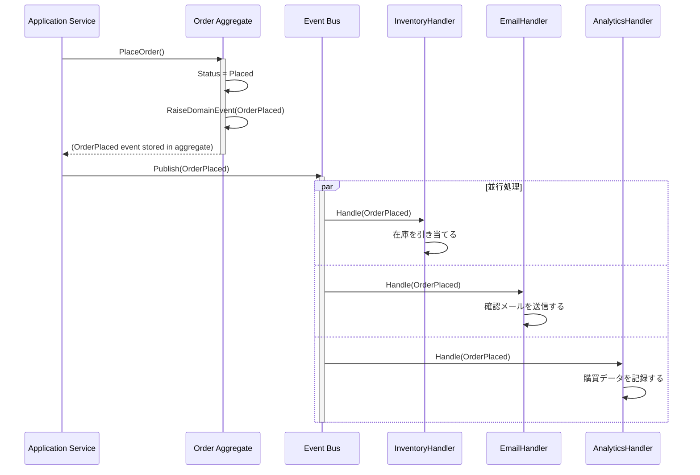

## Domain Eventの本質

「注文が確定された」「支払いが完了した」「在庫が不足した」——これらはすべて、**ビジネスドメインで起きた事実**です。Domain Eventとは、この「過去に起きた出来事」をオブジェクトとして表現したものです。

重要なのは、Domain Eventは**変更不可能（Immutable）**であるという点です。過去の出来事は変えられません。イベントは「何が、いつ、どのように起きたか」を忠実に記録するだけです。

## なぜDomain Eventが必要か

Domain Eventがない世界では、Aggregateが別のAggregateを直接呼び出すか、Application Serviceが両方を操作することになります。

```csharp
// Domain Eventなし: Application Serviceが責任を持ちすぎている
public class PlaceOrderService
{
    public void Execute(Guid orderId)
    {
        var order = _orderRepo.FindById(orderId);
        order.Place();
        _orderRepo.Save(order);

        // 問題: Order確定とは無関係なロジックが混入している
        var inventory = _inventoryRepo.FindByOrder(order);
        inventory.Reserve(order.Items);
        _inventoryRepo.Save(inventory);

        _emailService.SendConfirmation(order.CustomerId, order);
        _analyticsService.TrackPurchase(order);
        // 新しい要件が増えるたびにここに追加される → Fat Service
    }
}
```

Domain Eventを使うと、それぞれの関心事を独立したHandlerに分離できます。

## Domain EventとApplication Eventの違い

| 観点 | Domain Event | Application Event |
|------|-------------|-------------------|
| **表現対象** | ビジネスの出来事 | 技術的なシステムの出来事 |
| **命名** | `OrderPlaced`, `PaymentReceived` | `EmailSent`, `CacheInvalidated` |
| **含む情報** | ビジネス的に意味のあるデータ | システム処理の詳細 |
| **定義場所** | Domain層 | Application/Infrastructure層 |

## イベントフロー図



## イベントの命名規則（過去形の動詞）

Domain Eventは必ず**過去形の動詞**で命名します。これは「起きた事実」を表すという本質から来ています。

- `OrderPlaced`（注文が確定された）
- `PaymentReceived`（支払いが受領された）
- `InventoryDepleted`（在庫が枯渇した）
- `CustomerRegistered`（顧客が登録された）

「OrderPlace」「PlaceOrder」のような命名は、コマンド（命令）と混同される危険があるため避けます。

## Before/After: Domain Eventを使った責任分離

### Before: Application Serviceに全てが集中する

```csharp
// Fat Application Service（アンチパターン）
public async Task PlaceOrderAsync(Guid orderId)
{
    var order = await _orderRepo.GetByIdAsync(orderId);
    order.Place();
    await _orderRepo.SaveAsync(order);

    // ここから先は全て「副作用」だが、全部ここに書かれている
    await _inventoryService.ReserveAsync(order);
    await _notificationService.SendEmailAsync(order.CustomerId);
    await _analyticsService.TrackAsync(order);
    await _loyaltyService.AddPointsAsync(order.CustomerId, order.TotalAmount);
    // 次の要件: SNS通知、請求書発行、倉庫システム連携...
}
```

### After: Domain Eventで責任を分散する

```csharp
// Domain Eventの定義（Domain層）
public sealed record OrderPlaced : IDomainEvent
{
    public Guid EventId { get; } = Guid.NewGuid();
    public DateTime OccurredAt { get; } = DateTime.UtcNow;

    public Guid OrderId { get; init; }
    public Guid CustomerId { get; init; }
    public Money TotalAmount { get; init; }
    public IReadOnlyList<OrderItemSnapshot> Items { get; init; }

    public OrderPlaced(Guid orderId, Guid customerId,
                       Money totalAmount, IReadOnlyList<OrderItemSnapshot> items)
    {
        OrderId = orderId;
        CustomerId = customerId;
        TotalAmount = totalAmount;
        Items = items;
    }
}

// Aggregate内でイベントを発行する
public class Order : AggregateRoot
{
    public void Place()
    {
        if (!_items.Any())
            throw new DomainException("商品が1件もありません。");

        Status = OrderStatus.Placed;

        // イベントはここで「発生記録」されるが、発行はApplication Serviceが行う
        var snapshot = _items
            .Select(i => new OrderItemSnapshot(i.ProductId, i.Quantity, i.UnitPrice))
            .ToList();

        RaiseDomainEvent(new OrderPlaced(Id, CustomerId, TotalAmount, snapshot));
    }
}

// Application Service: シンプルなオーケストレーター
public class PlaceOrderCommandHandler
{
    private readonly IOrderRepository _orderRepo;
    private readonly IDomainEventPublisher _eventPublisher;

    public async Task HandleAsync(PlaceOrderCommand command)
    {
        var order = await _orderRepo.GetByIdAsync(command.OrderId);
        order.Place();  // ビジネスロジックはAggregateに委ねる

        await _orderRepo.SaveAsync(order);

        // Aggregateに蓄積されたイベントを一括発行
        foreach (var domainEvent in order.DomainEvents)
        {
            await _eventPublisher.PublishAsync(domainEvent);
        }
        order.ClearDomainEvents();
    }
}

// 在庫引き当てHandler（独立した関心事）
public class ReserveInventoryOnOrderPlaced : IDomainEventHandler<OrderPlaced>
{
    public async Task HandleAsync(OrderPlaced @event)
    {
        foreach (var item in @event.Items)
        {
            var inventory = await _inventoryRepo.GetByProductIdAsync(item.ProductId);
            inventory.Reserve(item.Quantity);
            await _inventoryRepo.SaveAsync(inventory);
        }
    }
}

// メール送信Handler（独立した関心事）
public class SendConfirmationEmailOnOrderPlaced : IDomainEventHandler<OrderPlaced>
{
    public async Task HandleAsync(OrderPlaced @event)
    {
        var customer = await _customerRepo.GetByIdAsync(@event.CustomerId);
        await _emailService.SendOrderConfirmationAsync(customer.Email, @event);
    }
}
```

## Aggregate内でのイベント発行パターン（AggregateRoot基底クラス）

```csharp
public abstract class AggregateRoot
{
    private readonly List<IDomainEvent> _domainEvents = new();

    public IReadOnlyList<IDomainEvent> DomainEvents => _domainEvents.AsReadOnly();

    protected void RaiseDomainEvent(IDomainEvent domainEvent)
    {
        _domainEvents.Add(domainEvent);
    }

    public void ClearDomainEvents()
    {
        _domainEvents.Clear();
    }
}
```

## Eventual Consistency（結果整合性）との関係

Domain Eventを介した処理は、**必ずしも即座に完了するわけではありません**。在庫引き当てのHandlerが処理を完了する前に、注文確定のレスポンスを返すことができます。これが**結果整合性（Eventual Consistency）**です。

重要なのは、「いつかは整合した状態になる」という設計の意図を明確に持つことです。失敗した場合のリトライ戦略や補償トランザクション（Saga）もこの文脈で設計します。

> **専門家の視点**
>
> Domain Eventの設計で最も難しいのは、「何をイベントに含めるか」の判断です。
>
> 筆者の経験則として、イベントには「そのHandlerが仕事をするために必要な最小限の情報」を含めます。CustomerIdだけ含めてHandlerがDBを引きに行くのか、それとも必要な情報を全てイベントに詰めるのか（Fat Event）——これはパフォーマンスと結合度のトレードオフです。
>
> また、Domain Eventは「外部システムとの契約」になることがあります。イベントの構造を変えると下流のHandlerが全て影響を受けるため、一度公開したイベントは後方互換性を保つか、バージョニング（`OrderPlacedV2`）で対応することを推奨します。

## まとめ

Domain Eventは「過去の事実」を表す不変のオブジェクトです。Aggregate内でRaiseし、Application Serviceが発行し、各HandlerがSingle Responsibilityで処理する——このパターンにより、ビジネスロジックの追加がApplication Serviceの肥大化を招かない、疎結合なシステムを構築できます。
