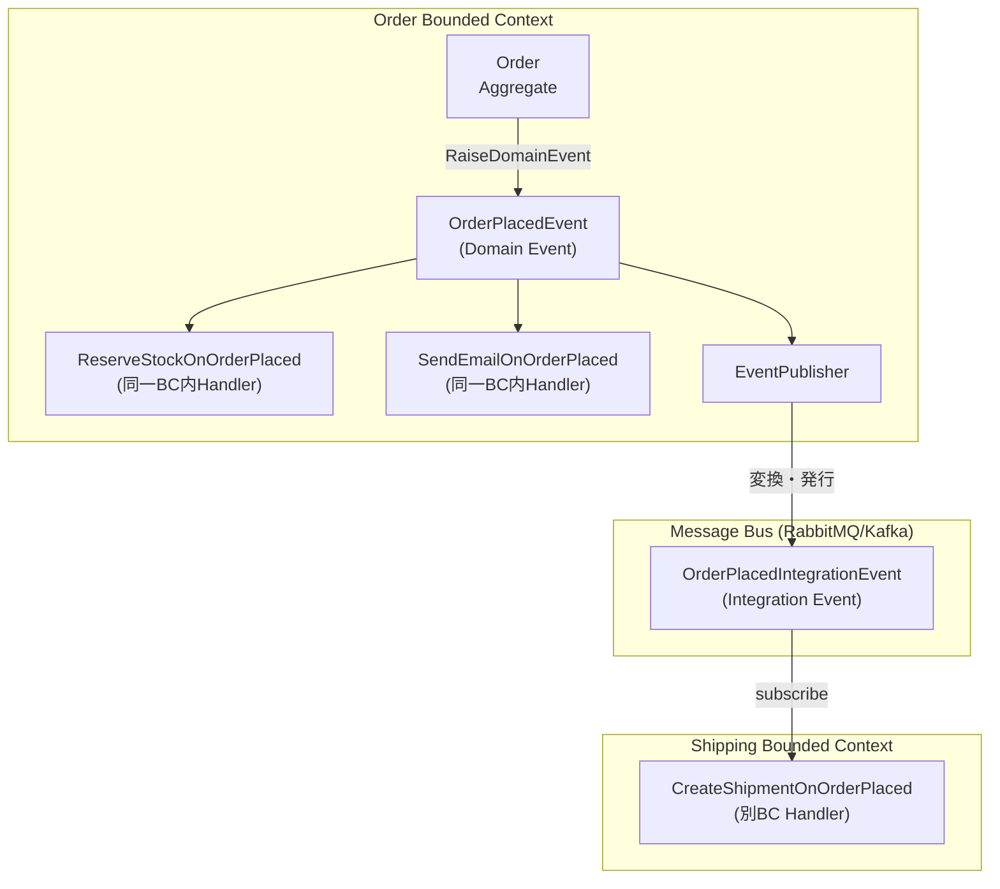

# 第 10 章: Domain Events — ドメインで起きた出来事をコードで表現する

## 0. TL;DR

Domain Event とは「ドメインで起きた、ビジネス的に重要な出来事」をオブジェクトとして表現したもの。過去形の名詞句（OrderPlaced、CustomerRegistered）で命名し、Aggregate 内部で Raise し、Repository 保存後に dispatch する。これにより、Aggregate 間の疎結合・副作用の明示化・監査ログの自然な生成が実現する。

---

## 1. Domain Events が生まれた背景

### 1.1 「Aggregate 変更後に何かしたい」という普遍的な問題

注文が確定したら、在庫を減らしたい。メールを送りたい。履歴ログを記録したい。ポイントを付与したい——こういった「ある出来事に連動する副作用」は、すべてのビジネスシステムに存在します。

初期の実装は往々にしてこうなります:

```csharp
// NG: Application Service に副作用を直書き（スパゲッティの始まり）
public async Task HandleAsync(PlaceOrderCommand cmd)
{
    var order = await _orderRepo.FindByIdAsync(cmd.OrderId);
    order.Place();
    await _orderRepo.SaveAsync(order);

    // ここからが問題: 副作用が Application Service に散乱する
    await _inventoryService.ReserveAsync(order.Items);       // 在庫引き当て
    await _emailService.SendOrderConfirmationAsync(order);   // メール送信
    await _auditLogService.LogAsync("OrderPlaced", order);   // 監査ログ
    await _pointService.GrantPointsAsync(order.CustomerId);  // ポイント付与
    await _analyticsService.TrackAsync("order_placed", order); // 分析
}
```

このコードには 5 つの深刻な問題があります:

**問題1: 依存が爆発する**
`PlaceOrderHandler` が 5 つのサービスに依存。新しい副作用が増えるたびに Handler を修正する必要があります。違反: Open/Closed Principle。

**問題2: 副作用の順序が不明**
在庫引き当てが失敗したらメールは送るべきか？ポイントは？ビジネスルールが Handler に暗黙的に埋まっています。

**問題3: テストが困難**
`PlaceOrderHandler` のテストで 5 つのサービスのモックが必要。テストが Infrastructure の実装詳細に縛られます。

**問題4: 部分失敗の扱いが困難**
メール送信が失敗したら注文全体をロールバックすべきか？監査ログ失敗は？トランザクション境界が不明確です。

**問題5: 機能追加のたびに危険な変更が発生**
新しい副作用（SNS通知など）を追加するたびに、既存の Handler を変更しなければならない。回帰テストのコストが増大します。

### 1.2 Event という解法

Eric Evans は Blue Book（2003）の後、このパターンを「Domain Events」と名付けました。本書中では明示的に章立てしていませんでしたが、コミュニティでのディスカッションを経て、Vaughn Vernon が IDDD（2013）で体系化しました。

基本的な発想はシンプルです:

> 「Aggregate の中で何かが起きたことを、イベントというオブジェクトで表現する。関心を持つ誰かが、そのイベントを受け取って反応する」

```csharp
// Aggregate 内部でイベントを Raise する
public void Place()
{
    EnsureStatus(OrderStatus.Draft, "注文確定");
    if (!_items.Any())
        throw new DomainException("注文アイテムが1件もありません");

    Status = OrderStatus.Placed;
    PlacedAt = DateTime.UtcNow;

    // イベントを Raise（副作用はここで宣言するだけ）
    RaiseDomainEvent(new OrderPlacedEvent(Id, CustomerId, TotalAmount, DateTime.UtcNow));
}
```

Aggregate は「何が起きたか」だけを宣言し、「何をすべきか」は各 Handler が独立して決める。これが Domain Events の本質です。

---

## 2. Domain Events の設計原則

### 2.1 命名規則: 過去形の名詞句

Domain Event は「すでに起きた出来事」を表現します。そのため、必ず**過去形**で命名します。

```
良い命名:
OrderPlacedEvent       ← 注文が確定された
CustomerRegisteredEvent ← 顧客が登録された
PaymentProcessedEvent  ← 決済が処理された
StockDepletedEvent     ← 在庫が枯渇した
ShipmentDispatchedEvent ← 発送が指示された

悪い命名:
PlaceOrderEvent   ← 命令形。「これからやる」の意味になる
OrderUpdated      ← 何が更新されたか不明。粒度が荒すぎる
OrderEvent        ← 種類が不明。Event 全体が曖昧
```

**なぜ過去形が重要か:** イベントは「変更できない事実」です。過去形の命名は、「このオブジェクトはすでに起きた出来事の記録であり、変更できない」という意味を名前で伝えます。これは不変性（immutability）の意図を言語で表現することでもあります。

### 2.2 イベントは不変（Immutable）

```csharp
// Good: sealed record で不変を表現
public sealed record OrderPlacedEvent(
    OrderId OrderId,
    CustomerId CustomerId,
    Money TotalAmount,
    DateTime OccurredAt
) : IDomainEvent;

// Bad: セッターがある（イベントを変更できてしまう）
public class OrderPlacedEvent : IDomainEvent
{
    public Guid OrderId { get; set; }  // NG: セッターがある
    public decimal Amount { get; set; }
}
```

`record` を使うことで、C# は `Equals`/`GetHashCode`/`ToString` を自動生成し、with 式による新しいインスタンス生成をサポートします。イベントに変更が必要なケースは存在しません（あると感じたら設計を見直す）。

### 2.3 イベントに含めるべき情報

イベントは「後で何でも再現できる」だけの情報を含むべきです。Handler がイベントだけを見て処理できるよう、必要な識別子と値を含めます。

```csharp
// 適切な情報を含むイベント
public sealed record OrderPlacedEvent(
    OrderId OrderId,           // ← 必須: 何の注文か特定できる
    CustomerId CustomerId,     // ← 必須: 誰の注文か（Customer取得に使う）
    Money TotalAmount,         // ← 含める: メール送信・ポイント計算で使う
    IReadOnlyList<OrderItemSnapshot> Items, // ← 含める: 在庫引き当てで使う
    DateTime OccurredAt        // ← 必須: いつ起きたか
) : IDomainEvent;

// スナップショット: イベント発生時点のデータを固める
public sealed record OrderItemSnapshot(
    Guid ProductId,
    string ProductName,
    int Quantity,
    decimal UnitPrice
);
```

**注意**: イベントに「すべての情報」を詰め込む必要はありません。Handler が「追加情報が必要なら Repository で取得する」設計でも構いません。ただし、その場合は Eventual Consistency（結果整合性）の文脈で Handler がデータを取得するタイミングを考慮する必要があります。

### 2.4 OccurredAt の重要性

`OccurredAt` は「イベントが何時に起きたか」を記録します。これは：

1. **監査ログ**: 「誰が、いつ、何をしたか」の記録
2. **デバッグ**: 問題発生時の時系列再現
3. **Event Sourcing**: イベントを時系列順に再生するための順序情報

常に `DateTime.UtcNow` を使います。`DateTime.Now`（ローカル時刻）は分散システムで危険です。

---

## 3. Aggregate 内での Domain Event の実装

### 3.1 Entity 基底クラスへの Domain Events 蓄積

```csharp
// 基底クラス: Domain Events を蓄積する
public abstract class Entity<TId>
{
    private readonly List<IDomainEvent> _domainEvents = new();

    public TId Id { get; protected set; } = default!;

    public IReadOnlyList<IDomainEvent> DomainEvents
        => _domainEvents.AsReadOnly();

    protected void RaiseDomainEvent(IDomainEvent domainEvent)
        => _domainEvents.Add(domainEvent);

    public IReadOnlyList<IDomainEvent> PopDomainEvents()
    {
        var events = _domainEvents.ToList();
        _domainEvents.Clear();
        return events;
    }

    // Equals/GetHashCode は ID で比較（省略）
}
```

**`PopDomainEvents` の設計意図**: イベントを取り出すと同時にリストをクリアします。これにより、「同じイベントを2回 dispatch する」バグを防ぎます。Repository の `SaveAsync` が呼ばれた後に一度だけ取り出す設計です。

### 3.2 Aggregate Root でのイベント Raise

```csharp
public sealed class Order : Entity<OrderId>
{
    private readonly List<OrderItem> _items = new();

    public CustomerId CustomerId { get; private set; } = default!;
    public OrderStatus Status { get; private set; }
    public Address ShippingAddress { get; private set; } = default!;
    public Money TotalAmount => _items
        .Aggregate(Money.Zero("JPY"), (sum, item) => sum.Add(item.SubTotal));
    public DateTime? PlacedAt { get; private set; }
    public DateTime? ShippedAt { get; private set; }
    public IReadOnlyList<OrderItem> Items => _items.AsReadOnly();

    private Order() { }

    public static Order Create(CustomerId customerId, Address shippingAddress)
    {
        ArgumentNullException.ThrowIfNull(shippingAddress);

        var order = new Order
        {
            Id = OrderId.New(),
            CustomerId = customerId,
            ShippingAddress = shippingAddress,
            Status = OrderStatus.Draft
        };

        // 作成時点でイベントを Raise
        order.RaiseDomainEvent(new OrderCreatedEvent(
            order.Id,
            customerId,
            DateTime.UtcNow
        ));

        return order;
    }

    public void AddItem(ProductId productId, string productName,
        Money unitPrice, int quantity)
    {
        EnsureStatus(OrderStatus.Draft, "アイテム追加");

        if (quantity <= 0)
            throw new DomainException("数量は1以上である必要があります");

        // 同一商品が既にあれば数量を増やす
        var existing = _items.FirstOrDefault(i => i.ProductId == productId);
        if (existing is not null)
        {
            existing.IncreaseQuantity(quantity);
            return;
        }

        _items.Add(OrderItem.Create(
            OrderItemId.New(), productId, productName, unitPrice, quantity));
    }

    public void Place()
    {
        EnsureStatus(OrderStatus.Draft, "注文確定");

        if (!_items.Any())
            throw new DomainException("注文アイテムが1件もありません");

        Status = OrderStatus.Placed;
        PlacedAt = DateTime.UtcNow;

        // イベントに在庫引き当てに必要なスナップショットを含める
        var itemSnapshots = _items.Select(i => new OrderItemSnapshot(
            i.ProductId.Value,
            i.ProductName,
            i.Quantity,
            i.UnitPrice.Amount
        )).ToList();

        RaiseDomainEvent(new OrderPlacedEvent(
            Id,
            CustomerId,
            TotalAmount,
            itemSnapshots,
            DateTime.UtcNow
        ));
    }

    public void Ship()
    {
        EnsureStatus(OrderStatus.Placed, "発送");
        Status = OrderStatus.Shipped;
        ShippedAt = DateTime.UtcNow;

        RaiseDomainEvent(new OrderShippedEvent(Id, ShippedAt.Value, DateTime.UtcNow));
    }

    public void Cancel(string reason)
    {
        if (Status == OrderStatus.Shipped || Status == OrderStatus.Delivered)
            throw new DomainException("発送済み・配達済みの注文はキャンセルできません");

        var previousStatus = Status;
        Status = OrderStatus.Cancelled;

        RaiseDomainEvent(new OrderCancelledEvent(Id, reason, previousStatus, DateTime.UtcNow));
    }

    private void EnsureStatus(OrderStatus expected, string action)
    {
        if (Status != expected)
            throw new DomainException(
                $"{action}は{expected}状態の注文にのみ実行できます（現在: {Status}）");
    }
}
```

### 3.3 Domain Events の型定義

```csharp
// インターフェース（マーカー）
public interface IDomainEvent
{
    DateTime OccurredAt { get; }
}

// 注文作成イベント
public sealed record OrderCreatedEvent(
    OrderId OrderId,
    CustomerId CustomerId,
    DateTime OccurredAt
) : IDomainEvent;

// 注文確定イベント（最も重要）
public sealed record OrderPlacedEvent(
    OrderId OrderId,
    CustomerId CustomerId,
    Money TotalAmount,
    IReadOnlyList<OrderItemSnapshot> Items,
    DateTime OccurredAt
) : IDomainEvent;

// 発送イベント
public sealed record OrderShippedEvent(
    OrderId OrderId,
    DateTime ShippedAt,
    DateTime OccurredAt
) : IDomainEvent;

// キャンセルイベント（前状態も記録）
public sealed record OrderCancelledEvent(
    OrderId OrderId,
    string Reason,
    OrderStatus PreviousStatus,  // ← 補償処理に必要
    DateTime OccurredAt
) : IDomainEvent;

// アイテムスナップショット
public sealed record OrderItemSnapshot(
    Guid ProductId,
    string ProductName,
    int Quantity,
    decimal UnitPrice
);
```

---

## 4. Domain Events の Dispatch — いつ、どうやって発行するか

### 4.1 「Aggregate保存後」に dispatch する理由

```csharp
// NG: 保存前に dispatch（トランザクション境界外でのイベント発行）
public async Task HandleAsync(PlaceOrderCommand cmd)
{
    var order = ...;
    order.Place();

    // この時点で dispatch すると...
    await _dispatcher.DispatchAsync(order.DomainEvents); // ← NG

    await _orderRepo.SaveAsync(order); // ← もしここで例外が発生したら？
    // Order は保存されなかったのに、在庫引き当て・メール送信が実行されてしまう
}

// OK: 保存後に dispatch
public async Task HandleAsync(PlaceOrderCommand cmd)
{
    var order = ...;
    order.Place();

    await _orderRepo.SaveAsync(order); // ← 先に保存

    // 保存が成功してから dispatch
    var events = order.PopDomainEvents();
    await _dispatcher.DispatchAsync(events);
}
```

**原則**: Aggregate の状態変化が永続化されてから、イベントを dispatch する。これにより「イベントは起きた事実」という整合性を保ちます。

### 4.2 IDomainEventDispatcher の実装

```csharp
// インターフェース（Domain 層）
public interface IDomainEventDispatcher
{
    Task DispatchAsync(IReadOnlyList<IDomainEvent> events,
        CancellationToken ct = default);
}

// 実装（Infrastructure/Application 層）
public sealed class DomainEventDispatcher : IDomainEventDispatcher
{
    private readonly IServiceProvider _serviceProvider;
    private readonly ILogger<DomainEventDispatcher> _logger;

    public DomainEventDispatcher(
        IServiceProvider serviceProvider,
        ILogger<DomainEventDispatcher> logger)
    {
        _serviceProvider = serviceProvider;
        _logger = logger;
    }

    public async Task DispatchAsync(IReadOnlyList<IDomainEvent> events,
        CancellationToken ct = default)
    {
        foreach (var domainEvent in events)
        {
            var eventType = domainEvent.GetType();
            var handlerType = typeof(IDomainEventHandler<>).MakeGenericType(eventType);

            // DI コンテナから対応する Handler を全件取得（複数 Handler OK）
            var handlers = _serviceProvider.GetServices(handlerType);

            foreach (var handler in handlers)
            {
                if (handler is null) continue;

                try
                {
                    var method = handlerType.GetMethod(nameof(IDomainEventHandler<IDomainEvent>.HandleAsync))!;
                    await (Task)method.Invoke(handler, [domainEvent, ct])!;

                    _logger.LogDebug(
                        "Domain event {EventType} handled by {HandlerType}",
                        eventType.Name, handler.GetType().Name);
                }
                catch (Exception ex)
                {
                    _logger.LogError(ex,
                        "Error handling domain event {EventType} in {HandlerType}",
                        eventType.Name, handler.GetType().Name);
                    throw;
                }
            }
        }
    }
}

// Handler インターフェース
public interface IDomainEventHandler<in TEvent> where TEvent : IDomainEvent
{
    Task HandleAsync(TEvent domainEvent, CancellationToken ct = default);
}
```

### 4.3 各 Handler の実装例

```csharp
// 在庫引き当て Handler
public sealed class ReserveStockOnOrderPlaced
    : IDomainEventHandler<OrderPlacedEvent>
{
    private readonly IInventoryService _inventory;

    public ReserveStockOnOrderPlaced(IInventoryService inventory)
        => _inventory = inventory;

    public async Task HandleAsync(OrderPlacedEvent evt, CancellationToken ct = default)
    {
        var reservations = evt.Items.Select(i =>
            new StockReservation(i.ProductId, i.Quantity)).ToList();

        await _inventory.ReserveBatchAsync(evt.OrderId.Value, reservations, ct);
    }
}

// メール送信 Handler
public sealed class SendOrderConfirmationEmail
    : IDomainEventHandler<OrderPlacedEvent>
{
    private readonly IEmailService _email;
    private readonly ICustomerRepository _customerRepo;

    public async Task HandleAsync(OrderPlacedEvent evt, CancellationToken ct = default)
    {
        var customer = await _customerRepo.FindByIdAsync(evt.CustomerId);
        if (customer is null) return; // 顧客が見つからない場合は無視（べき等性）

        await _email.SendAsync(new OrderConfirmationEmail(
            To: customer.Email.Value,
            OrderId: evt.OrderId.Value.ToString(),
            TotalAmount: evt.TotalAmount.Amount,
            Currency: evt.TotalAmount.Currency
        ), ct);
    }
}

// 監査ログ Handler
public sealed class AuditOrderPlaced
    : IDomainEventHandler<OrderPlacedEvent>
{
    private readonly IAuditLogger _auditLogger;

    public async Task HandleAsync(OrderPlacedEvent evt, CancellationToken ct = default)
    {
        await _auditLogger.LogAsync(new AuditEntry(
            EntityType: "Order",
            EntityId: evt.OrderId.Value.ToString(),
            Action: "OrderPlaced",
            OccurredAt: evt.OccurredAt,
            Details: $"TotalAmount: {evt.TotalAmount.Amount} {evt.TotalAmount.Currency}"
        ), ct);
    }
}

// ポイント付与 Handler
public sealed class GrantPurchasePoints
    : IDomainEventHandler<OrderPlacedEvent>
{
    private readonly IPointService _pointService;

    public async Task HandleAsync(OrderPlacedEvent evt, CancellationToken ct = default)
    {
        var points = (int)(evt.TotalAmount.Amount / 100);
        if (points > 0)
            await _pointService.GrantAsync(evt.CustomerId.Value, points, ct);
    }
}
```

**この設計の優れた点**:
- `PlaceOrderHandler`（Application Service）は、これらの Handler を一切知りません
- 新しい副作用を追加する際、既存コードを変更せずに新しい Handler を DI 登録するだけで OK
- 各 Handler は独立してテスト可能

### 4.4 DI 登録

```csharp
// Program.cs
builder.Services.AddScoped<IDomainEventDispatcher, DomainEventDispatcher>();

// OrderPlacedEvent の Handler を複数登録
builder.Services.AddScoped<IDomainEventHandler<OrderPlacedEvent>, ReserveStockOnOrderPlaced>();
builder.Services.AddScoped<IDomainEventHandler<OrderPlacedEvent>, SendOrderConfirmationEmail>();
builder.Services.AddScoped<IDomainEventHandler<OrderPlacedEvent>, AuditOrderPlaced>();
builder.Services.AddScoped<IDomainEventHandler<OrderPlacedEvent>, GrantPurchasePoints>();

// OrderShippedEvent の Handler
builder.Services.AddScoped<IDomainEventHandler<OrderShippedEvent>, NotifyCustomerOnShipped>();

// OrderCancelledEvent の Handler
builder.Services.AddScoped<IDomainEventHandler<OrderCancelledEvent>, ReleaseStockOnCancelled>();
builder.Services.AddScoped<IDomainEventHandler<OrderCancelledEvent>, RefundOnCancelled>();
```

---

## 5. Application Service での完全な統合

```csharp
public sealed class PlaceOrderHandler
{
    private readonly IOrderRepository _orderRepo;
    private readonly ICustomerRepository _customerRepo;
    private readonly OrderDomainService _domainService;
    private readonly IDomainEventDispatcher _dispatcher;

    public PlaceOrderHandler(
        IOrderRepository orderRepo,
        ICustomerRepository customerRepo,
        OrderDomainService domainService,
        IDomainEventDispatcher dispatcher)
    {
        _orderRepo = orderRepo;
        _customerRepo = customerRepo;
        _domainService = domainService;
        _dispatcher = dispatcher;
    }

    public async Task<PlaceOrderResult> HandleAsync(
        PlaceOrderCommand cmd, CancellationToken ct = default)
    {
        // 1. 顧客の存在確認
        var customer = await _customerRepo.FindByIdAsync(CustomerId.From(cmd.CustomerId));
        if (customer is null)
            return PlaceOrderResult.Failure("顧客が存在しません");

        // 2. 注文作成（Order.Create でイベント Raise）
        var address = Address.Of(cmd.PostalCode, cmd.Prefecture, cmd.City, cmd.Street);
        var order = Order.Create(customer.Id, address);

        foreach (var item in cmd.Items)
        {
            var price = Money.Of(item.UnitPrice, item.Currency);
            order.AddItem(ProductId.From(item.ProductId), item.ProductName, price, item.Quantity);
        }

        // 3. 重複注文チェック（Domain Service）
        if (await _domainService.HasRecentDuplicateAsync(order, TimeSpan.FromMinutes(5)))
            return PlaceOrderResult.Failure("直近に同じ注文があります（5分以内）");

        // 4. 注文確定（Order.Place でイベント Raise）
        order.Place();

        // 5. 保存（ここまでイベントは Raise されたが dispatch されていない）
        await _orderRepo.SaveAsync(order, ct);

        // 6. 保存成功後にイベントを dispatch
        var events = order.PopDomainEvents();
        await _dispatcher.DispatchAsync(events, ct);

        return PlaceOrderResult.Success(order.Id.Value);
    }
}

public sealed class PlaceOrderResult
{
    public bool IsSuccess { get; }
    public Guid? OrderId { get; }
    public string? ErrorMessage { get; }

    private PlaceOrderResult(bool isSuccess, Guid? orderId, string? errorMessage)
    {
        IsSuccess = isSuccess;
        OrderId = orderId;
        ErrorMessage = errorMessage;
    }

    public static PlaceOrderResult Success(Guid orderId) => new(true, orderId, null);
    public static PlaceOrderResult Failure(string message) => new(false, null, message);
}
```

---

## 6. Domain Events vs Integration Events

大規模システムでは、2種類のイベントを使い分けます。



| 比較軸 | Domain Event | Integration Event |
|--------|-------------|------------------|
| **スコープ** | 同一 Bounded Context 内 | Bounded Context をまたぐ |
| **型の依存** | ドメイン型（`Money`、`OrderId`）を含む | プリミティブ型のみ（シリアライズを考慮） |
| **配信保証** | なし（インプロセス） | At-least-once（Message Bus による） |
| **べき等性** | 不要（同一プロセス） | 必須（重複配信される可能性） |
| **バス** | DI コンテナ | RabbitMQ / Azure Service Bus / Kafka |

```csharp
// Domain Event → Integration Event に変換する Publisher
public sealed class OrderEventPublisher
    : IDomainEventHandler<OrderPlacedEvent>
{
    private readonly IMessageBus _bus;

    public async Task HandleAsync(OrderPlacedEvent evt, CancellationToken ct = default)
    {
        // Domain 型 → プリミティブ型に変換（シリアライズ安全）
        var integrationEvent = new OrderPlacedIntegrationEvent(
            OrderId: evt.OrderId.Value,
            CustomerId: evt.CustomerId.Value,
            TotalAmountJpy: evt.TotalAmount.Amount,
            Items: evt.Items.Select(i => new OrderItemMessage(
                i.ProductId, i.Quantity, i.UnitPrice
            )).ToList(),
            OccurredAt: evt.OccurredAt
        );

        await _bus.PublishAsync(integrationEvent, ct);
    }
}

public sealed record OrderPlacedIntegrationEvent(
    Guid OrderId,
    Guid CustomerId,
    decimal TotalAmountJpy,
    List<OrderItemMessage> Items,
    DateTime OccurredAt
);

public sealed record OrderItemMessage(
    Guid ProductId,
    int Quantity,
    decimal UnitPrice
);
```

---

## 7. Outbox Pattern — イベント配信の確実性保証

### 7.1 なぜ Outbox が必要か

```csharp
// この2行の間でプロセスが落ちたら？
await _orderRepo.SaveAsync(order);        // DB commit 成功
await _dispatcher.DispatchAsync(events); // ← ここでプロセスクラッシュ
// 結果: Order は保存されたが、在庫引き当て・メール送信が実行されなかった
```

このアトミック性の問題を解決するのが **Transactional Outbox Pattern** です。

### 7.2 Outbox 実装

```csharp
// Outbox Message エンティティ
public sealed class OutboxMessage
{
    public Guid Id { get; private set; } = Guid.NewGuid();
    public string EventType { get; private set; } = default!;
    public string Payload { get; private set; } = default!;
    public DateTime OccurredAt { get; private set; }
    public DateTime? ProcessedAt { get; private set; }
    public int RetryCount { get; private set; }

    public static OutboxMessage Create(IDomainEvent domainEvent)
        => new()
        {
            EventType = domainEvent.GetType().AssemblyQualifiedName!,
            Payload = JsonSerializer.Serialize(domainEvent,
                domainEvent.GetType(), JsonOptions.Default),
            OccurredAt = domainEvent.OccurredAt
        };

    public void MarkProcessed() => ProcessedAt = DateTime.UtcNow;
    public void IncrementRetry() => RetryCount++;
}

// Repository: Domain Event を Outbox に書く
public sealed class EfOrderRepository : IOrderRepository
{
    private readonly AppDbContext _ctx;

    public async Task SaveAsync(Order order, CancellationToken ct = default)
    {
        _ctx.Orders.Update(order);

        // Domain Events を Outbox に書く（同一トランザクション）
        var outboxMessages = order.PopDomainEvents()
            .Select(OutboxMessage.Create)
            .ToList();
        _ctx.OutboxMessages.AddRange(outboxMessages);

        // 1つのトランザクションで Order + Outbox を commit
        await _ctx.SaveChangesAsync(ct);
    }
}

// Background Service: Outbox をポーリングして dispatch
public sealed class OutboxProcessor : BackgroundService
{
    private readonly IServiceScopeFactory _scopeFactory;
    private readonly ILogger<OutboxProcessor> _logger;

    protected override async Task ExecuteAsync(CancellationToken ct)
    {
        while (!ct.IsCancellationRequested)
        {
            await ProcessPendingMessagesAsync(ct);
            await Task.Delay(TimeSpan.FromSeconds(5), ct);
        }
    }

    private async Task ProcessPendingMessagesAsync(CancellationToken ct)
    {
        await using var scope = _scopeFactory.CreateAsyncScope();
        var ctx = scope.ServiceProvider.GetRequiredService<AppDbContext>();
        var dispatcher = scope.ServiceProvider.GetRequiredService<IDomainEventDispatcher>();

        var pending = await ctx.OutboxMessages
            .Where(m => m.ProcessedAt == null && m.RetryCount < 3)
            .OrderBy(m => m.OccurredAt)
            .Take(50)
            .ToListAsync(ct);

        foreach (var message in pending)
        {
            try
            {
                var eventType = Type.GetType(message.EventType)!;
                var domainEvent = (IDomainEvent)JsonSerializer.Deserialize(
                    message.Payload, eventType, JsonOptions.Default)!;

                await dispatcher.DispatchAsync([domainEvent], ct);
                message.MarkProcessed();
            }
            catch (Exception ex)
            {
                _logger.LogError(ex,
                    "Outbox message {MessageId} processing failed", message.Id);
                message.IncrementRetry();
            }
        }

        await ctx.SaveChangesAsync(ct);
    }
}
```

---

## 8. Domain Events のテスト戦略

### 8.1 Aggregate のユニットテスト

```csharp
public class OrderDomainEventTests
{
    [Fact]
    public void Place_ShouldRaiseOrderPlacedEvent()
    {
        // Arrange (Given)
        var order = Order.Create(
            CustomerId.From(Guid.NewGuid()),
            Address.Of("113-0001", "東京都", "文京区", "本郷1-1-1")
        );
        order.AddItem(
            ProductId.From(Guid.NewGuid()),
            "テスト商品",
            Money.Of(1000m, "JPY"),
            quantity: 2
        );

        // Act (When)
        order.Place();

        // Assert (Then)
        var events = order.DomainEvents;
        var placedEvent = events.OfType<OrderPlacedEvent>().Single();
        placedEvent.OrderId.Should().Be(order.Id);
        placedEvent.TotalAmount.Amount.Should().Be(2000m);
        placedEvent.Items.Should().HaveCount(1);
        placedEvent.OccurredAt.Should().BeCloseTo(DateTime.UtcNow, precision: TimeSpan.FromSeconds(1));
    }

    [Fact]
    public void Place_WithNoItems_ShouldNotRaisePlacedEvent()
    {
        var order = Order.Create(
            CustomerId.From(Guid.NewGuid()),
            Address.Of("113-0001", "東京都", "文京区", "本郷1-1-1")
        );

        var action = () => order.Place();
        action.Should().Throw<DomainException>()
            .WithMessage("*アイテムが1件もありません*");

        order.DomainEvents.Should().NotContain(e => e is OrderPlacedEvent);
    }

    [Fact]
    public void Cancel_AfterShipped_ShouldThrow()
    {
        var order = CreatePlacedAndShippedOrder();

        var action = () => order.Cancel("返品したい");
        action.Should().Throw<DomainException>()
            .WithMessage("*発送済み*");
    }

    [Fact]
    public void PopDomainEvents_ShouldClearEventsAfterCall()
    {
        var order = Order.Create(
            CustomerId.From(Guid.NewGuid()),
            Address.Of("113-0001", "東京都", "文京区", "本郷1-1-1")
        );

        var events = order.PopDomainEvents();
        events.Should().HaveCount(1); // OrderCreatedEvent

        // 2回目の呼び出しは空
        var events2 = order.PopDomainEvents();
        events2.Should().BeEmpty();
    }
}
```

### 8.2 Handler のユニットテスト

```csharp
public class ReserveStockOnOrderPlacedTests
{
    [Fact]
    public async Task HandleAsync_ShouldCallReserveBatchWithCorrectItems()
    {
        // Arrange
        var mockInventory = Substitute.For<IInventoryService>();
        var handler = new ReserveStockOnOrderPlaced(mockInventory);

        var productId = Guid.NewGuid();
        var evt = new OrderPlacedEvent(
            OrderId: OrderId.New(),
            CustomerId: CustomerId.From(Guid.NewGuid()),
            TotalAmount: Money.Of(2000m, "JPY"),
            Items: [new OrderItemSnapshot(productId, "商品A", Quantity: 2, UnitPrice: 1000m)],
            OccurredAt: DateTime.UtcNow
        );

        // Act
        await handler.HandleAsync(evt);

        // Assert
        await mockInventory.Received(1).ReserveBatchAsync(
            evt.OrderId.Value,
            Arg.Is<List<StockReservation>>(r =>
                r.Count == 1 &&
                r[0].ProductId == productId &&
                r[0].Quantity == 2),
            Arg.Any<CancellationToken>()
        );
    }
}
```

---

## 9. よくある設計ミス TOP8

### ミス1: Command と Domain Event を混同する

```csharp
// NG: Command なのに Event の名前
public sealed record PlaceOrderEvent(...);  // "Event" は「起きた事実」

// OK
public sealed record PlaceOrderCommand(...);  // Command は命令形
public sealed record OrderPlacedEvent(...);   // Event は過去形
```

### ミス2: イベント内にドメインロジックを書く

```csharp
// NG
public sealed record OrderPlacedEvent(...)
{
    public Money CalculateDiscount() { ... }  // NG: イベントはデータの記録のみ
}

// OK: イベントは pure data
public sealed record OrderPlacedEvent(
    OrderId OrderId,
    Money TotalAmount,
    DateTime OccurredAt
) : IDomainEvent;
```

### ミス3: Handler 内で別の Domain Event を Raise する

```csharp
// NG: Handler が Domain Event を連鎖的に発行
public class ReserveStockOnOrderPlaced : IDomainEventHandler<OrderPlacedEvent>
{
    public async Task HandleAsync(OrderPlacedEvent evt, ...)
    {
        await _inventory.ReserveAsync(...);
        _eventBus.Publish(new StockReservedEvent(...));  // NG: Aggregate の責務
    }
}
```

### ミス4: イベントを保存前に dispatch する（上述）

### ミス5: イベントに DB の自動採番 int ID を使う

```csharp
// NG: 保存前に ID が確定しない
public sealed record OrderPlacedEvent(int OrderId, ...);

// OK: 事前生成可能な Guid を使う
public sealed record OrderPlacedEvent(Guid OrderId, ...);
```

### ミス6: Handler が単一責務を超える（God Handler）

```csharp
// NG: 1つの Handler で全副作用を処理
public class OnOrderPlaced : IDomainEventHandler<OrderPlacedEvent>
{
    public async Task HandleAsync(OrderPlacedEvent evt, ...)
    {
        await ReserveStock(evt);
        await SendEmail(evt);
        await GrantPoints(evt);
        await WriteAuditLog(evt);
        await TrackAnalytics(evt);
    }
}
```

### ミス7: イベント名が汎用的すぎる

```csharp
// NG
public sealed record OrderUpdatedEvent(...);  // 何が更新された？
public sealed record OrderChangedEvent(...); // 何が変わった？

// OK
public sealed record OrderShippingAddressChangedEvent(...);
public sealed record OrderItemAddedEvent(...);
```

### ミス8: 全変化を1つのイベントで表現しようとする

```csharp
// NG: 汎用イベント
public sealed record OrderStateChangedEvent(
    string ChangedField, string OldValue, string NewValue);

// OK: 変化の種類ごとにイベントを定義
public sealed record OrderPlacedEvent(...);
public sealed record OrderShippedEvent(...);
public sealed record OrderCancelledEvent(...);
```

---

## 10. Domain Events のコードレビュー観点

**命名・設計チェックリスト**
- [ ] イベント名が過去形の名詞句か（OrderPlaced, CustomerRegistered）
- [ ] `sealed record` + `IDomainEvent` で実装されているか
- [ ] `OccurredAt: DateTime` プロパティが含まれているか
- [ ] イベントにドメインロジックが含まれていないか

**Raise のタイミング**
- [ ] `RaiseDomainEvent` が Aggregate のメソッド内で呼ばれているか
- [ ] Repository の `SaveAsync` 後に `dispatcher.DispatchAsync` が呼ばれているか
- [ ] 保存前に dispatch していないか

**Handler の設計**
- [ ] Handler が単一責務か
- [ ] Handler が別の Domain Event を直接 Raise していないか
- [ ] べき等性が考慮されているか（同じイベントが2回来ても安全か）

**テスト**
- [ ] Aggregate のユニットテストでイベントの発行を検証しているか
- [ ] Handler のユニットテストで副作用を検証しているか

---

## 11. アーキテクトの視点

### Domain Events と Event Sourcing の違い

| | Domain Events | Event Sourcing |
|--|---------------|----------------|
| **目的** | 副作用の疎結合 | 状態変化の永続化 |
| **保存** | 任意（Outbox Pattern を使う場合のみ） | 必須（Event Store に全件保存） |
| **再生** | 不要 | 必須（イベント再生でステートを復元） |

### 副作用の失敗ポリシー

| ポリシー | 説明 | 適用場面 |
|---------|------|---------|
| **Fail Fast** | Handler 失敗でトランザクション全体をロールバック | 業務上クリティカルな副作用 |
| **Fire and Forget** | Handler 失敗をログだけ記録して続行 | 分析イベント等、失敗しても構わないもの |
| **Retry** | Outbox Pattern でリトライ | 在庫引き当てなど、一時的な失敗が起きうるもの |
| **Compensating** | Saga で補償トランザクション | 長期プロセス・マイクロサービス間連携 |

---

## 12. 演習問題

**問1: イベントの設計**

以下の要件をもとに、Domain Events を設計してください。

要件: EC サイトで「顧客が住所を変更したとき、配達中の注文がある場合は配送先変更申請フローを起動する」

解答のポイント:
- `CustomerAddressChangedEvent` を設計する（旧住所・新住所を含める）
- Handler が「配達中の注文があるか確認 → ある場合は別フローを起動」する
- Aggregate（Customer）の住所変更メソッドでイベントを Raise する

**問2: コードレビュー**

以下のコードの問題を3つ指摘し、修正案を提示してください。

```csharp
public async Task UpdateOrderStatus(Guid orderId, string status)
{
    var order = await _repo.FindByIdAsync(orderId);
    order.Status = status; // 直接プロパティを変更
    await _repo.SaveAsync(order);
    await _emailService.SendStatusUpdateEmail(orderId); // 直接呼び出し
}
```

問題:
1. `Status` を直接セットしている（ドメインロジックなし・Invariant 検証なし）
2. 副作用（メール送信）が Application Service に直書き
3. Domain Event が Raise されていない

**問3: 実装**

`CustomerRegisteredEvent` を設計し、以下の Handler を実装してください:
- 登録完了メールを送信する Handler
- 初回購入クーポン（100ポイント）を付与する Handler

---

## 参考文献と著者の解釈

Eric Evans は Blue Book（2003）の後のコミュニティ活動で Domain Events の概念を発展させました。Vaughn Vernon は *Implementing Domain-Driven Design*（2013）第8章で Domain Events の実装パターンを体系化し、「Aggregate は Domain Event を Raise し、Application Service が dispatch する責務を持つ」という分離を明確にしました。

筆者の解釈では、Domain Events の最大の価値は「副作用の明示化」にあります。メソッド呼び出しの連鎖で副作用を実装すると、コードを読んだだけでは「Order.Place() を呼ぶと在庫が引き当てられ、メールが送られる」という事実が見えません。Domain Events を使えば、「OrderPlacedEvent が発行される」という一文で副作用の存在を宣言でき、Handler を探せば何が起きるかが分かります。

Outbox Pattern については、Kamil Grzybek の記事「Outbox Pattern」（2019）が実装の詳細として参考になります。インプロセス dispatch だけでは「保存成功・dispatch失敗」の問題を完全には解決できないため、本番品質のシステムでは Outbox Pattern の採用を推奨します。
