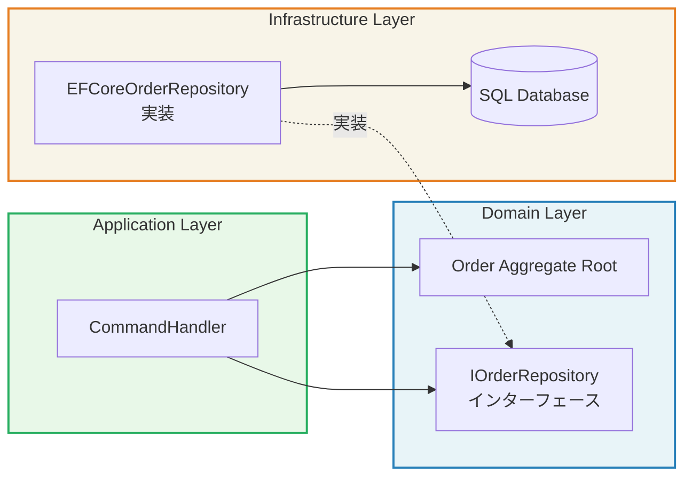

## Repositoryの本質

Repositoryパターンの本質を一言で表すなら、「**永続化の詳細を隠し、Aggregateのコレクションであるかのようにふるまうオブジェクト**」です。

Martin Fowlerは著書「Patterns of Enterprise Application Architecture（PoEAA）」でRepositoryを次のように定義しています。「ドメインオブジェクトにアクセスするためのコレクションのようなインターフェースを使い、ドメインとデータマッピング層の仲介をする」。

つまり、Repositoryはドメイン層のコードに対して「メモリ上のコレクションを操作しているかのような感覚」を提供します。SQLを書いているとか、DBに接続しているといった意識をドメイン層から完全に取り除くのがRepositoryの役割です。

## Repository ≠ DAO

RepositoryとDAO（Data Access Object）を同一視する誤解は非常によく見られます。しかし、両者は根本的に異なります。

| 観点 | Repository | DAO |
|------|-----------|-----|
| **関心事** | Aggregateのライフサイクル管理 | テーブルのCRUD操作 |
| **操作単位** | Aggregate（整合性の単位） | テーブル行 |
| **返すもの** | ドメインオブジェクト | DTOや行データ |
| **コレクション的** | はい（`Add`, `Remove`, `FindById`） | いいえ（`Insert`, `Update`, `Delete`, `Select`） |
| **1テーブル=1DAOか** | 複数テーブルを1Repositoryで扱う | 通常は1テーブル=1DAO |

DAOは技術的な永続化の抽象化であり、RepositoryはドメインのAggregateに特化した抽象化です。

## 依存関係逆転の原則（DIP）

Repositoryのインターフェースはドメイン層に定義し、実装はインフラ層に置きます。これにより、ドメイン層はインフラ（DB、ORM）の具体的な実装に依存しません。



ドメイン層がインフラ層を知らず、インフラ層がドメイン層のインターフェースを実装する——この逆転した依存関係が、テスタビリティと変更容易性を生みます。

## Repositoryに書くべきメソッド / 書くべきでないメソッド

```csharp
// 良いIOrderRepository
public interface IOrderRepository
{
    // 書くべきメソッド: Aggregateのコレクション操作
    Task<Order?> FindByIdAsync(OrderId orderId);
    Task<IReadOnlyList<Order>> FindByCustomerIdAsync(CustomerId customerId);
    Task AddAsync(Order order);
    Task UpdateAsync(Order order);

    // 書いてもよい: ドメイン的に意味のある検索
    Task<IReadOnlyList<Order>> FindPendingOrdersAsync();
}

// 書くべきでないメソッド（DAOになっている）
public interface IBadOrderRepository
{
    // NG: SQLの都合を持ち込んでいる
    Task<IReadOnlyList<Order>> GetOrdersByDateRangeAndStatusWithPagingAsync(
        DateTime from, DateTime to, string status, int page, int pageSize);

    // NG: Aggregateの内部を直接操作している
    Task UpdateOrderStatusAsync(Guid orderId, string status);

    // NG: 集計はQuery Model（CQRS）で行うべき
    Task<decimal> GetTotalRevenueAsync(DateTime from, DateTime to);
}
```

## Before/After: EF Coreでの実装例

### Before: Domain層がEF Coreに直接依存している

```csharp
// 悪い例: Application ServiceがDbContextを直接操作
public class PlaceOrderHandler
{
    private readonly AppDbContext _context;  // インフラへの直接依存

    public async Task HandleAsync(PlaceOrderCommand command)
    {
        var order = await _context.Orders
            .Include(o => o.Items)
            .FirstOrDefaultAsync(o => o.Id == command.OrderId);

        // ドメインロジックとDB操作が混在
        order.Place();
        _context.Entry(order).State = EntityState.Modified;
        await _context.SaveChangesAsync();
    }
}
```

### After: Repositoryで永続化の詳細を隠蔽する

```csharp
// ドメイン層: インターフェースのみ定義（Infrastructure依存なし）
public interface IOrderRepository
{
    Task<Order?> FindByIdAsync(OrderId orderId, CancellationToken ct = default);
    Task AddAsync(Order order, CancellationToken ct = default);
    Task UpdateAsync(Order order, CancellationToken ct = default);
}

// インフラ層: EF Coreを使った実装
public class EFCoreOrderRepository : IOrderRepository
{
    private readonly AppDbContext _context;

    public EFCoreOrderRepository(AppDbContext context)
    {
        _context = context;
    }

    public async Task<Order?> FindByIdAsync(OrderId orderId, CancellationToken ct = default)
    {
        return await _context.Orders
            .Include(o => o.Items)  // EF Coreの詳細はここに閉じ込める
            .FirstOrDefaultAsync(o => o.Id == orderId.Value, ct);
    }

    public async Task AddAsync(Order order, CancellationToken ct = default)
    {
        await _context.Orders.AddAsync(order, ct);
        // SaveChangesAsyncはUnit of Workで管理する（後述）
    }

    public async Task UpdateAsync(Order order, CancellationToken ct = default)
    {
        _context.Orders.Update(order);
    }
}

// Unit of Workパターン: トランザクション境界を管理する
public interface IUnitOfWork
{
    IOrderRepository Orders { get; }
    Task<int> CommitAsync(CancellationToken ct = default);
}

public class EFCoreUnitOfWork : IUnitOfWork
{
    private readonly AppDbContext _context;

    public IOrderRepository Orders { get; }

    public EFCoreUnitOfWork(AppDbContext context)
    {
        _context = context;
        Orders = new EFCoreOrderRepository(context);
    }

    public async Task<int> CommitAsync(CancellationToken ct = default)
    {
        return await _context.SaveChangesAsync(ct);
    }
}

// Application Service: クリーンな実装
public class PlaceOrderCommandHandler
{
    private readonly IUnitOfWork _uow;
    private readonly IDomainEventPublisher _publisher;

    public async Task HandleAsync(PlaceOrderCommand command, CancellationToken ct)
    {
        var order = await _uow.Orders.FindByIdAsync(
            new OrderId(command.OrderId), ct)
            ?? throw new OrderNotFoundException(command.OrderId);

        order.Place();  // ドメインロジックはAggregateに

        await _uow.Orders.UpdateAsync(order, ct);
        await _uow.CommitAsync(ct);  // ここでトランザクションが確定する

        // イベント発行
        foreach (var ev in order.DomainEvents)
            await _publisher.PublishAsync(ev, ct);
        order.ClearDomainEvents();
    }
}
```

## Specificationパターンとの組み合わせ

複雑な検索条件をRepositoryに直接書くと、メソッドが爆発的に増えます。Specificationパターンを使うと、検索条件をドメインオブジェクトとして表現できます。

```csharp
// Specification: ドメイン言語で検索条件を表現
public class PendingOrdersOlderThan : Specification<Order>
{
    private readonly TimeSpan _age;

    public PendingOrdersOlderThan(TimeSpan age) { _age = age; }

    public override Expression<Func<Order, bool>> ToExpression()
        => order => order.Status == OrderStatus.Pending
                 && order.CreatedAt < DateTime.UtcNow - _age;
}

// 使用側: ドメイン言語で意図が伝わる
var staleOrders = await _uow.Orders.FindAsync(
    new PendingOrdersOlderThan(TimeSpan.FromDays(7)));
```

> **専門家の視点**
>
> Unit of WorkとRepositoryの関係について、実務でよく議論になるのは「SaveChangesAsync をどこで呼ぶか」という問題です。
>
> Repositoryのメソッド内で毎回SaveChangesAsyncを呼ぶと、1つのユースケースで複数のAggregateを操作した時にトランザクションが分断されます。Unit of Workパターンを使い、SaveChangesAsyncをApplication Serviceの最後に1回だけ呼ぶことで、ユースケース全体を1トランザクションに収めることができます。
>
> ただし、EF Coreの`DbContext`自体がUnit of Workのセマンティクスを持っているため、シンプルなプロジェクトではDbContextをUnit of Workとして使い、Repositoryのみを別途定義するアーキテクチャも現実的な選択肢です。

## まとめ

Repositoryはドメイン層とインフラ層の橋渡し役です。インターフェースをドメイン層に置き、実装をインフラ層に隔離することで、ドメインロジックは永続化技術の変更から完全に守られます。Unit of Workと組み合わせることで、トランザクション境界も明確に制御できます。
