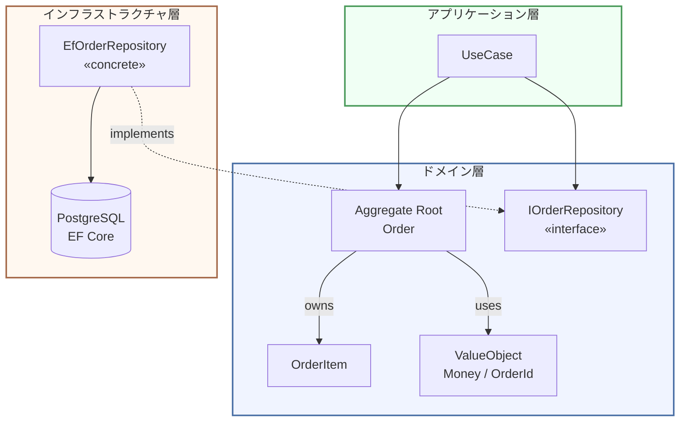
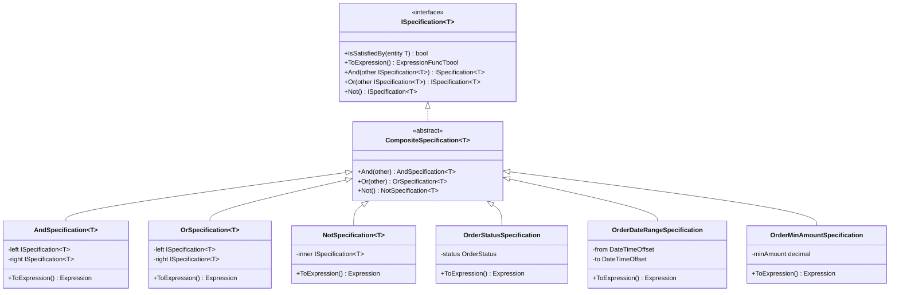

# 第11章 Repositoryパターン — ドメインとデータ永続化の橋渡し

---

## 0. TL;DR

- **Repository は「ドメインオブジェクトのコレクション」として振る舞います**。DAOのようにテーブルのCRUDを公開するのではなく、Aggregate Root 単位でドメイン言語に合ったメソッドを持ちます。
- **インターフェースはドメイン層、実装はインフラ層**。依存逆転の原則（DIP）により、ドメイン層はデータベースの詳細を一切知りません。
- **Aggregate Root 単位で Repository を作ります**。`OrderItem` のような子エンティティに Repository を持たせると、Aggregateの整合性境界が崩壊します。
- **Specification パターンと組み合わせると検索条件の複雑さをカプセル化できます**。条件を組み合わせて再利用可能な仕様オブジェクトを作ります。
- **Unit of Work パターンと組み合わせて複数 Aggregate を同一トランザクションで保存します**。EF Core の `DbContext` がこの役割を担います。

---

## 1. Repository が DAO と何が違うか

Repositoryパターンとは何かを理解するために、まず「なぜ DAOではダメなのか」から始めましょう。

### 1.1 DAO (Data Access Object) の発想

DAOはテーブルを中心に据えます。`users` テーブルがあれば `UserDAO`、`orders` テーブルがあれば `OrderDAO` を作ります。そのメソッドは `SelectById`、`InsertOne`、`UpdateById`、`DeleteById` といった、**SQLのCRUD操作に対応した手続き的なもの**です。

```csharp
// DAOの例 — テーブル中心の設計（アンチパターン）
namespace Infrastructure.DataAccess;

public class OrderDAO(IDbConnection conn)
{
    // テーブルの行を返す — ドメインオブジェクトではなくデータコンテナ
    public OrderRecord SelectById(Guid id)
    {
        const string sql = "SELECT * FROM orders WHERE id = @Id";
        return conn.QuerySingle<OrderRecord>(sql, new { Id = id });
    }

    // 子テーブルの行を別途取得する — Aggregateとして扱われていない
    public IEnumerable<OrderItemRecord> SelectItemsByOrderId(Guid orderId)
    {
        const string sql = "SELECT * FROM order_items WHERE order_id = @OrderId";
        return conn.Query<OrderItemRecord>(sql, new { OrderId = orderId });
    }

    // テーブルの列名がそのままメソッド名に漏れ出ている
    public IEnumerable<OrderRecord> SelectByStatus(string status)
    {
        const string sql = "SELECT * FROM orders WHERE status = @Status";
        return conn.Query<OrderRecord>(sql, new { Status = status });
    }

    // Application Serviceで組み合わせる必要がある — Aggregateの境界がない
    public void Insert(OrderRecord order)
    {
        const string sql = """
            INSERT INTO orders (id, customer_id, status, total_amount, created_at)
            VALUES (@Id, @CustomerId, @Status, @TotalAmount, @CreatedAt)
            """;
        conn.Execute(sql, order);
    }
}
```

DAOの問題は明確です。

1. **`OrderRecord` はただのデータコンテナ**。`order.Confirm()` のようなドメインロジックを持てません。
2. **Aggregateが分断されている**。`Order` とその `OrderItem` を同時に取得するにはApplication Serviceが二度呼び出す必要があります。
3. **インフラの言語がにじみ出ている**。`SelectByStatus` という名前は、ドメインの言語ではなくSQLのフィルタ操作そのものです。
4. **ドメイン層がDAOに依存する**。ドメインオブジェクトを操作したいときにインフラ層の詳細が必要になります。

### 1.2 Repository の発想

Repositoryはインメモリ上のコレクションとして振る舞います。呼び出し側（Application Service）からは、まるで `HashSet<Order>` を操作しているかのように見えます。

```csharp
// Repositoryの例 — Aggregate中心の設計（正しいパターン）

// インターフェースはドメイン層に置く
namespace Domain.Repositories;

public interface IOrderRepository
{
    // 「IDで注文を取得する」— ドメイン言語
    Task<Order?> FindByIdAsync(OrderId id, CancellationToken ct = default);

    // 「顧客の注文一覧を取得する」— ドメイン言語
    Task<IReadOnlyList<Order>> FindByCustomerIdAsync(CustomerId customerId, CancellationToken ct = default);

    // 「確定待ちの注文を取得する」— ドメイン言語（Statusという内部状態ではなくビジネス意図を表す）
    Task<IReadOnlyList<Order>> FindPendingOrdersAsync(CancellationToken ct = default);

    // Aggregate全体を保存 — 子エンティティも含めて一括
    Task SaveAsync(Order order, CancellationToken ct = default);

    // Aggregate全体を削除
    Task DeleteAsync(OrderId id, CancellationToken ct = default);
}
```

```csharp
// Application Serviceでの利用例
namespace Application.UseCases;

public sealed class ConfirmOrderUseCase(
    IOrderRepository orderRepository,
    IUnitOfWork unitOfWork)
{
    public async Task ExecuteAsync(Guid orderId, CancellationToken ct = default)
    {
        var id = new OrderId(orderId);

        // まるでコレクションから取り出すように見える
        var order = await orderRepository.FindByIdAsync(id, ct)
            ?? throw new OrderNotFoundException(id);

        // ドメインロジックを呼び出す — インフラ詳細は一切知らない
        order.Confirm();

        // コレクションに保存するように見える
        await orderRepository.SaveAsync(order, ct);
        await unitOfWork.CommitAsync(ct);
    }
}
```

**なぜ `FindByIdAsync` と `FindByEmailAsync` はあるが `FindByTable` はないのか**、答えは明快です。Repositoryのメソッド名はユビキタス言語で表現されます。「テーブルから取得」はインフラの言語であり、「メールアドレスで顧客を見つける」がドメインの言語です。`FindByEmailAsync` は「このメールアドレスを持つ顧客は誰か」というビジネス上の問いに直接対応しています。

---

## 2. Repository の設計原則

### 2.1 依存の方向を逆転させる

Repositoryパターンの核心は**依存逆転の原則（DIP: Dependency Inversion Principle）**の実現です。ドメイン層はデータベースの存在を知りません。知っているのはインターフェースだけです。



図中の実線は「依存する」、破線は「実装する（implements）」を示します。注目すべきは、**矢印の方向がすべてドメイン層に向かっている**点です。インフラ層はドメイン層に依存しますが、ドメイン層はインフラ層を一切知りません。

### 2.2 Aggregate Root 単位で Repository を作る

DDDにおける重要な原則として、**Repository は Aggregate Root に対してのみ作る**があります。

```csharp
// 正しい設計 — Aggregate Root に Repository を作る
public interface IOrderRepository { ... }       // ✅ Order は Aggregate Root
public interface ICustomerRepository { ... }    // ✅ Customer は Aggregate Root
public interface IProductRepository { ... }     // ✅ Product は Aggregate Root

// 誤った設計 — 子エンティティに Repository を作る
public interface IOrderItemRepository { ... }   // ❌ OrderItem は子エンティティ
```

なぜ `IOrderItemRepository` がダメなのでしょうか。`OrderItem` は `Order` というAggregateの内部に属します。もし `OrderItemRepository` から直接 `OrderItem` を取得・更新できてしまうと、`Order` の「合計金額は常に OrderItem の合計である」という不変条件を守れなくなります。Aggregateの整合性境界が壊れてしまうのです。

### 2.3 原則のまとめ

| 原則 | 内容 |
|------|------|
| **インターフェースはドメイン層** | `Domain.Repositories` 名前空間に配置する |
| **実装はインフラ層** | `Infrastructure.Repositories` 名前空間に配置する |
| **Aggregate Root 単位** | 子エンティティに Repository を持たせない |
| **ドメイン言語でメソッドを定義** | `FindByStatus` でなく `FindPendingOrders` |
| **Aggregate全体を返す** | 部分的なデータを返さない（Read Model は別の仕組みで） |

---

## 3. Repository インターフェースの設計

### 3.1 どのメソッドを定義すべきか

Repositoryインターフェースに全てのクエリを詰め込もうとする衝動を抑えることが重要です。定義するメソッドは**ユースケースが実際に必要とするものだけ**にします。YAGNI（You Aren't Gonna Need It）原則がここでも有効です。

### 3.2 汎用基底インターフェース vs 具体インターフェース

汎用基底インターフェースの誘惑に注意が必要です。

```csharp
// 汎用基底インターフェース — 一見便利だが問題をはらむ
public interface IRepository<T, TId>
{
    Task<T?> FindByIdAsync(TId id, CancellationToken ct = default);
    Task SaveAsync(T entity, CancellationToken ct = default);
    Task DeleteAsync(TId id, CancellationToken ct = default);
}

// 具体インターフェースで汎用を継承
public interface IOrderRepository : IRepository<Order, OrderId>
{
    // Order固有のメソッドを追加
    Task<IReadOnlyList<Order>> FindByCustomerIdAsync(CustomerId customerId, CancellationToken ct = default);
}
```

汎用基底インターフェースは一定の価値がありますが、**すべてのAggregateに同じ基底操作が必要とは限らない**ことに注意が必要です。例えば、`Product` は削除できても、`Order` はビジネス上のルールで論理削除しか許可されないかもしれません。その場合、`IRepository<T, TId>` に `DeleteAsync` を持たせると `IOrderRepository` はそれを強制実装しなければなりません。

筆者は**具体インターフェース優先**を推奨します。各Aggregateの操作をそのドメインの文脈で明示的に定義する方が、長期的に保守しやすくなります。

### 3.3 完全実装: IOrderRepository / ICustomerRepository / IProductRepository

```csharp
// Domain/Repositories/IOrderRepository.cs
namespace Domain.Repositories;

public interface IOrderRepository
{
    /// <summary>
    /// IDで注文を取得します。存在しない場合はnullを返します。
    /// </summary>
    /// <remarks>
    /// nullを返す設計にした理由: 例外をフロー制御に使うアンチパターンを避けるため。
    /// 呼び出し側がnullチェックを明示することで、「存在しない可能性がある」という
    /// ビジネス上の事実をコードで表現できます。
    /// </remarks>
    Task<Order?> FindByIdAsync(OrderId id, CancellationToken ct = default);

    /// <summary>
    /// 指定した顧客の全注文を取得します（最新順）。
    /// </summary>
    Task<IReadOnlyList<Order>> FindByCustomerIdAsync(
        CustomerId customerId,
        CancellationToken ct = default);

    /// <summary>
    /// 確定待ち（Pending）状態の注文を取得します。
    /// </summary>
    /// <remarks>
    /// FindByStatus(OrderStatus.Pending) ではなく FindPendingOrders としている理由:
    /// ビジネスの意図（確定待ちの注文を処理する）をメソッド名で表現するため。
    /// 将来「確定待ち」の定義が変わっても、インターフェースのシグネチャは変わりません。
    /// </remarks>
    Task<IReadOnlyList<Order>> FindPendingOrdersAsync(CancellationToken ct = default);

    /// <summary>
    /// 指定期間内に作成された注文を取得します。
    /// </summary>
    Task<IReadOnlyList<Order>> FindByDateRangeAsync(
        DateTimeOffset from,
        DateTimeOffset to,
        CancellationToken ct = default);

    /// <summary>
    /// 注文を保存します（新規作成 または 更新）。
    /// </summary>
    /// <remarks>
    /// 新規/更新を統一したUpsertにしている理由:
    /// 呼び出し側（Application Service）はドメインオブジェクトを「コレクション」
    /// として扱うべきで、DBの状態管理（INSERT vs UPDATE）を意識させない設計にするため。
    /// </remarks>
    Task SaveAsync(Order order, CancellationToken ct = default);

    /// <summary>
    /// 注文を削除します（物理削除）。
    /// </summary>
    Task DeleteAsync(OrderId id, CancellationToken ct = default);
}
```

```csharp
// Domain/Repositories/ICustomerRepository.cs
namespace Domain.Repositories;

public interface ICustomerRepository
{
    Task<Customer?> FindByIdAsync(CustomerId id, CancellationToken ct = default);

    /// <summary>
    /// メールアドレスで顧客を取得します。
    /// </summary>
    /// <remarks>
    /// メールアドレスは一意識別子として使われるケースが多いため、このメソッドを提供します。
    /// FindByEmailAsync は「このメールのユーザーは登録済みか」という頻出ユースケースを
    /// ドメイン言語で表現しています。
    /// </remarks>
    Task<Customer?> FindByEmailAsync(Email email, CancellationToken ct = default);

    /// <summary>
    /// 全アクティブ顧客を取得します（管理系ユースケース用）。
    /// </summary>
    Task<IReadOnlyList<Customer>> FindAllActiveAsync(CancellationToken ct = default);

    Task SaveAsync(Customer customer, CancellationToken ct = default);

    /// <summary>
    /// 顧客を削除します（論理削除）。
    /// </summary>
    /// <remarks>
    /// Order と異なり Customer には DeleteAsync を提供しています。
    /// ただしこれは論理削除（IsDeleted フラグ）であり、物理削除は行いません。
    /// GDPRの忘れられる権利への対応は別途 AnonymizeAsync を用意します。
    /// </remarks>
    Task DeleteAsync(CustomerId id, CancellationToken ct = default);
}
```

```csharp
// Domain/Repositories/IProductRepository.cs
namespace Domain.Repositories;

public interface IProductRepository
{
    Task<Product?> FindByIdAsync(ProductId id, CancellationToken ct = default);

    /// <summary>
    /// SKU（在庫管理単位）で商品を取得します。
    /// </summary>
    Task<Product?> FindBySkuAsync(Sku sku, CancellationToken ct = default);

    /// <summary>
    /// 在庫が残っている商品を取得します。
    /// </summary>
    Task<IReadOnlyList<Product>> FindInStockAsync(CancellationToken ct = default);

    /// <summary>
    /// カテゴリで商品を取得します。
    /// </summary>
    Task<IReadOnlyList<Product>> FindByCategoryAsync(
        ProductCategory category,
        CancellationToken ct = default);

    /// <summary>
    /// 複数の商品IDで一括取得します。
    /// </summary>
    /// <remarks>
    /// N+1問題を回避するためのバルク取得メソッドです。
    /// 注文時に複数商品の在庫を確認するユースケースで使用します。
    /// </remarks>
    Task<IReadOnlyList<Product>> FindByIdsAsync(
        IEnumerable<ProductId> ids,
        CancellationToken ct = default);

    Task SaveAsync(Product product, CancellationToken ct = default);
}
```

---

## 4. EF Core を使った Repository 実装（完全版）

### 4.1 Aggregate の設計（ドメイン層）

まずドメインオブジェクトを定義します。

```csharp
// Domain/Aggregates/Orders/Order.cs
namespace Domain.Aggregates.Orders;

public sealed class Order : AggregateRoot<OrderId>
{
    private readonly List<OrderItem> _items = [];

    // EF Core はプライベートコンストラクタを使ってインスタンスを復元する
    private Order() { }

    public Order(OrderId id, CustomerId customerId)
    {
        Id = id;
        CustomerId = customerId;
        Status = OrderStatus.Draft;
        CreatedAt = DateTimeOffset.UtcNow;
        // ドメインイベントを発行
        AddDomainEvent(new OrderCreatedEvent(id, customerId));
    }

    public CustomerId CustomerId { get; private set; } = default!;
    public OrderStatus Status { get; private set; }
    public Money TotalAmount { get; private set; } = Money.Zero;
    public DateTimeOffset CreatedAt { get; private set; }
    public DateTimeOffset? ConfirmedAt { get; private set; }

    // 読み取り専用コレクションとして公開
    public IReadOnlyList<OrderItem> Items => _items.AsReadOnly();

    // 楽観的ロック用のバージョン番号
    public uint Version { get; private set; }

    public void AddItem(ProductId productId, string productName, Money unitPrice, int quantity)
    {
        if (Status != OrderStatus.Draft)
            throw new InvalidOperationException("確定済みまたはキャンセル済みの注文には商品を追加できません。");

        if (quantity <= 0)
            throw new ArgumentException("数量は1以上である必要があります。");

        var existingItem = _items.FirstOrDefault(i => i.ProductId == productId);
        if (existingItem is not null)
        {
            existingItem.IncreaseQuantity(quantity);
        }
        else
        {
            var item = new OrderItem(
                OrderItemId.NewId(),
                Id,
                productId,
                productName,
                unitPrice,
                quantity);
            _items.Add(item);
        }

        RecalculateTotalAmount();
    }

    public void Confirm()
    {
        if (Status != OrderStatus.Draft)
            throw new InvalidOperationException("下書き状態の注文のみ確定できます。");

        if (!_items.Any())
            throw new InvalidOperationException("商品が1つも追加されていない注文は確定できません。");

        Status = OrderStatus.Confirmed;
        ConfirmedAt = DateTimeOffset.UtcNow;
        AddDomainEvent(new OrderConfirmedEvent(Id, CustomerId, TotalAmount, ConfirmedAt.Value));
    }

    public void Cancel(string reason)
    {
        if (Status == OrderStatus.Shipped)
            throw new InvalidOperationException("発送済みの注文はキャンセルできません。");

        if (Status == OrderStatus.Cancelled)
            throw new InvalidOperationException("既にキャンセル済みです。");

        Status = OrderStatus.Cancelled;
        AddDomainEvent(new OrderCancelledEvent(Id, reason));
    }

    private void RecalculateTotalAmount()
    {
        TotalAmount = _items.Aggregate(
            Money.Zero,
            (sum, item) => sum + item.SubTotal);
    }
}
```

```csharp
// Domain/Aggregates/Orders/OrderItem.cs
namespace Domain.Aggregates.Orders;

public sealed class OrderItem : Entity<OrderItemId>
{
    // EF Core 用プライベートコンストラクタ
    private OrderItem() { }

    public OrderItem(
        OrderItemId id,
        OrderId orderId,
        ProductId productId,
        string productName,
        Money unitPrice,
        int quantity)
    {
        Id = id;
        OrderId = orderId;
        ProductId = productId;
        ProductName = productName;
        UnitPrice = unitPrice;
        Quantity = quantity;
    }

    public OrderId OrderId { get; private set; } = default!;
    public ProductId ProductId { get; private set; } = default!;
    public string ProductName { get; private set; } = default!;
    public Money UnitPrice { get; private set; } = default!;
    public int Quantity { get; private set; }
    public Money SubTotal => UnitPrice * Quantity;

    internal void IncreaseQuantity(int additionalQuantity)
    {
        if (additionalQuantity <= 0)
            throw new ArgumentException("追加数量は1以上である必要があります。");
        Quantity += additionalQuantity;
    }
}
```

### 4.2 EF Core の DbContext 設定（Fluent API 完全版）

```csharp
// Infrastructure/Persistence/AppDbContext.cs
namespace Infrastructure.Persistence;

public sealed class AppDbContext(
    DbContextOptions<AppDbContext> options,
    IMediator mediator) : DbContext(options), IUnitOfWork
{
    public DbSet<Order> Orders => Set<Order>();
    public DbSet<Customer> Customers => Set<Customer>();
    public DbSet<Product> Products => Set<Product>();

    protected override void OnModelCreating(ModelBuilder modelBuilder)
    {
        // 設定クラスを自動適用（IEntityTypeConfiguration<T> を実装したクラスを全て読み込む）
        modelBuilder.ApplyConfigurationsFromAssembly(typeof(AppDbContext).Assembly);

        // グローバルクエリフィルタ（論理削除の共通処理）
        modelBuilder.Entity<Customer>().HasQueryFilter(c => !c.IsDeleted);
    }

    public async Task CommitAsync(CancellationToken ct = default)
    {
        // ドメインイベントの dispatch は SaveChanges 前に行う
        await DispatchDomainEventsAsync(ct);
        await SaveChangesAsync(ct);
    }

    public Task RollbackAsync(CancellationToken ct = default)
    {
        foreach (var entry in ChangeTracker.Entries())
            entry.State = EntityState.Detached;
        return Task.CompletedTask;
    }

    private async Task DispatchDomainEventsAsync(CancellationToken ct)
    {
        var aggregates = ChangeTracker
            .Entries<AggregateRoot>()
            .Where(e => e.Entity.DomainEvents.Any())
            .Select(e => e.Entity)
            .ToList();

        var domainEvents = aggregates
            .SelectMany(a => a.DomainEvents)
            .ToList();

        aggregates.ForEach(a => a.ClearDomainEvents());

        foreach (var domainEvent in domainEvents)
            await mediator.Publish(domainEvent, ct);
    }
}
```

```csharp
// Infrastructure/Persistence/Configurations/OrderConfiguration.cs
namespace Infrastructure.Persistence.Configurations;

public sealed class OrderConfiguration : IEntityTypeConfiguration<Order>
{
    public void Configure(EntityTypeBuilder<Order> builder)
    {
        builder.ToTable("orders");

        // プライマリキー（ValueObjectをGuidとしてマップ）
        builder.HasKey(o => o.Id);
        builder.Property(o => o.Id)
            .HasColumnName("id")
            .HasConversion(
                id => id.Value,                    // ドメイン → DB
                value => new OrderId(value))       // DB → ドメイン
            .ValueGeneratedNever();

        // CustomerId の ValueObject マッピング
        builder.Property(o => o.CustomerId)
            .HasColumnName("customer_id")
            .HasConversion(
                id => id.Value,
                value => new CustomerId(value))
            .IsRequired();

        // OrderStatus の enum マッピング（文字列として保存）
        builder.Property(o => o.Status)
            .HasColumnName("status")
            .HasConversion<string>()
            .HasMaxLength(50)
            .IsRequired();

        // Money の ValueObject をカラム分割でマップ
        builder.ComplexProperty(o => o.TotalAmount, money =>
        {
            money.Property(m => m.Amount)
                .HasColumnName("total_amount")
                .HasColumnType("decimal(18,2)");
            money.Property(m => m.Currency)
                .HasColumnName("currency")
                .HasMaxLength(3);
        });

        builder.Property(o => o.CreatedAt)
            .HasColumnName("created_at")
            .IsRequired();

        builder.Property(o => o.ConfirmedAt)
            .HasColumnName("confirmed_at");

        // 楽観的ロック — uint 型の Version カラムを使う
        // PostgreSQLの場合は xmin を使う方法もある
        builder.Property(o => o.Version)
            .HasColumnName("version")
            .IsRowVersion()
            .IsConcurrencyToken();

        // _items プライベートフィールドを EF Core に認識させる
        builder.HasMany<OrderItem>("_items")
            .WithOne()
            .HasForeignKey(i => i.OrderId)
            .IsRequired()
            .OnDelete(DeleteBehavior.Cascade);

        // インデックス
        builder.HasIndex(o => o.CustomerId)
            .HasDatabaseName("ix_orders_customer_id");
        builder.HasIndex(o => o.Status)
            .HasDatabaseName("ix_orders_status");
        builder.HasIndex(o => o.CreatedAt)
            .HasDatabaseName("ix_orders_created_at");
    }
}
```

```csharp
// Infrastructure/Persistence/Configurations/OrderItemConfiguration.cs
namespace Infrastructure.Persistence.Configurations;

public sealed class OrderItemConfiguration : IEntityTypeConfiguration<OrderItem>
{
    public void Configure(EntityTypeBuilder<OrderItem> builder)
    {
        builder.ToTable("order_items");

        builder.HasKey(i => i.Id);
        builder.Property(i => i.Id)
            .HasColumnName("id")
            .HasConversion(
                id => id.Value,
                value => new OrderItemId(value))
            .ValueGeneratedNever();

        builder.Property(i => i.OrderId)
            .HasColumnName("order_id")
            .HasConversion(
                id => id.Value,
                value => new OrderId(value))
            .IsRequired();

        builder.Property(i => i.ProductId)
            .HasColumnName("product_id")
            .HasConversion(
                id => id.Value,
                value => new ProductId(value))
            .IsRequired();

        builder.Property(i => i.ProductName)
            .HasColumnName("product_name")
            .HasMaxLength(255)
            .IsRequired();

        builder.ComplexProperty(i => i.UnitPrice, money =>
        {
            money.Property(m => m.Amount)
                .HasColumnName("unit_price")
                .HasColumnType("decimal(18,2)");
            money.Property(m => m.Currency)
                .HasColumnName("currency")
                .HasMaxLength(3);
        });

        builder.Property(i => i.Quantity)
            .HasColumnName("quantity")
            .IsRequired();

        // SubTotal は計算プロパティなので永続化しない
        builder.Ignore(i => i.SubTotal);

        builder.HasIndex(i => i.OrderId)
            .HasDatabaseName("ix_order_items_order_id");
    }
}
```

### 4.3 EF Core Repository 実装（完全版）

```csharp
// Infrastructure/Repositories/EfOrderRepository.cs
namespace Infrastructure.Repositories;

public sealed class EfOrderRepository(AppDbContext context) : IOrderRepository
{
    // Aggregate全体をEagerLoadingで取得するクエリ基底
    // Order と OrderItem を常に一緒に取得する（N+1を防ぐ）
    private IQueryable<Order> BaseQuery =>
        context.Orders
            .Include("_items");   // プライベートフィールドをInclude

    public async Task<Order?> FindByIdAsync(OrderId id, CancellationToken ct = default)
    {
        return await BaseQuery
            .AsSplitQuery()  // 大量の子エンティティがある場合のパフォーマンス最適化
            .FirstOrDefaultAsync(o => o.Id == id, ct);
    }

    public async Task<IReadOnlyList<Order>> FindByCustomerIdAsync(
        CustomerId customerId,
        CancellationToken ct = default)
    {
        return await BaseQuery
            .Where(o => o.CustomerId == customerId)
            .OrderByDescending(o => o.CreatedAt)
            .AsSplitQuery()
            .ToListAsync(ct);
    }

    public async Task<IReadOnlyList<Order>> FindPendingOrdersAsync(
        CancellationToken ct = default)
    {
        // ビジネス上「確定待ち」とはConfirmed状態（出荷前）の注文を指す
        return await BaseQuery
            .Where(o => o.Status == OrderStatus.Confirmed)
            .OrderBy(o => o.ConfirmedAt)
            .AsSplitQuery()
            .ToListAsync(ct);
    }

    public async Task<IReadOnlyList<Order>> FindByDateRangeAsync(
        DateTimeOffset from,
        DateTimeOffset to,
        CancellationToken ct = default)
    {
        return await BaseQuery
            .Where(o => o.CreatedAt >= from && o.CreatedAt <= to)
            .OrderByDescending(o => o.CreatedAt)
            .AsSplitQuery()
            .ToListAsync(ct);
    }

    public async Task SaveAsync(Order order, CancellationToken ct = default)
    {
        // EF Core の Change Tracker を使って新規/更新を判断
        var entry = context.Entry(order);

        if (entry.State == EntityState.Detached)
        {
            // 新規エンティティの場合 — Add（EF CoreがINSERT SQLを生成）
            context.Orders.Add(order);
        }
        // 既存エンティティの場合 — Change Trackerが追跡しているためそのまま
        // EF Coreが変更差分を検出してUPDATE SQLを生成する

        try
        {
            // SaveChanges は Unit of Work (CommitAsync) で一括呼び出しが理想だが、
            // シンプルなユースケースでは Repository 内で呼ぶことも許容する
            await context.SaveChangesAsync(ct);
        }
        catch (DbUpdateConcurrencyException ex)
        {
            // 楽観的ロック競合 — 別のトランザクションが先に更新した
            var entry2 = ex.Entries.Single();
            var databaseValues = await entry2.GetDatabaseValuesAsync(ct);

            if (databaseValues is null)
            {
                // DBから削除されていた場合
                throw new OrderConcurrencyException(
                    order.Id,
                    "注文が別のプロセスによって削除されました。",
                    ex);
            }

            // 競合情報を含めた例外を投げる
            throw new OrderConcurrencyException(
                order.Id,
                "注文が別のプロセスによって更新されました。再試行してください。",
                ex);
        }
    }

    public async Task DeleteAsync(OrderId id, CancellationToken ct = default)
    {
        // 物理削除: ExecuteDeleteAsync を使うと Change Tracker を経由せずに直接削除できる
        // （EF Core 7.0以降で利用可能）
        var deleted = await context.Orders
            .Where(o => o.Id == id)
            .ExecuteDeleteAsync(ct);

        if (deleted == 0)
            throw new OrderNotFoundException(id);
    }
}
```

### 4.4 楽観的ロックと再試行パターン

楽観的ロックは「競合は滅多に起きない」という前提に基づくロック戦略です。読み取り時にロックをかけず、書き込み時に「読み取った後に別のプロセスが変更していないか」を確認します。

```csharp
// Application Serviceでの再試行パターン（Polly ライブラリを推奨）
namespace Application.UseCases;

public sealed class UpdateOrderUseCase(
    IOrderRepository orderRepository,
    IUnitOfWork unitOfWork)
{
    private const int MaxRetries = 3;

    public async Task ExecuteAsync(
        Guid orderId,
        UpdateOrderCommand command,
        CancellationToken ct = default)
    {
        for (var attempt = 0; attempt < MaxRetries; attempt++)
        {
            try
            {
                var order = await orderRepository.FindByIdAsync(new OrderId(orderId), ct)
                    ?? throw new OrderNotFoundException(new OrderId(orderId));

                // ドメイン操作
                order.AddItem(
                    new ProductId(command.ProductId),
                    command.ProductName,
                    new Money(command.UnitPrice, command.Currency),
                    command.Quantity);

                await orderRepository.SaveAsync(order, ct);
                await unitOfWork.CommitAsync(ct);
                return; // 成功したら終了
            }
            catch (OrderConcurrencyException) when (attempt < MaxRetries - 1)
            {
                // 競合が発生した場合、指数バックオフで再試行
                await Task.Delay(
                    TimeSpan.FromMilliseconds(50 * Math.Pow(2, attempt)),
                    ct);
            }
        }

        throw new InvalidOperationException(
            "最大再試行回数を超えました。しばらく後にお試しください。");
    }
}
```

---

## 5. InMemory Repository（テスト用）

### 5.1 テスト用 InMemory Repository の必要性

本番用の EF Core Repository はデータベースが必要です。しかしユニットテストではデータベースに依存せず、**高速かつ決定論的なテスト**が書けることが重要です。`InMemoryRepository` を用意することで、Application Service のテストがデータベース設定なしで実行できます。

```csharp
// Infrastructure/Repositories/InMemoryOrderRepository.cs
namespace Infrastructure.Repositories;

/// <summary>
/// テスト用インメモリ実装。
/// ConcurrentDictionary を使ってスレッドセーフにします。
/// </summary>
public sealed class InMemoryOrderRepository : IOrderRepository
{
    // ディープコピーを保存することで、「取り出した後に変更が及ばない」本番DBの挙動を再現
    private readonly ConcurrentDictionary<OrderId, Order> _store = new();

    public Task<Order?> FindByIdAsync(OrderId id, CancellationToken ct = default)
    {
        ct.ThrowIfCancellationRequested();

        _store.TryGetValue(id, out var order);
        // テスト用なので参照を直接返す
        // より忠実なシミュレーションが必要な場合はシリアライズ/デシリアライズでコピーする
        return Task.FromResult(order);
    }

    public Task<IReadOnlyList<Order>> FindByCustomerIdAsync(
        CustomerId customerId,
        CancellationToken ct = default)
    {
        ct.ThrowIfCancellationRequested();

        IReadOnlyList<Order> result = _store.Values
            .Where(o => o.CustomerId == customerId)
            .OrderByDescending(o => o.CreatedAt)
            .ToList();

        return Task.FromResult(result);
    }

    public Task<IReadOnlyList<Order>> FindPendingOrdersAsync(CancellationToken ct = default)
    {
        ct.ThrowIfCancellationRequested();

        IReadOnlyList<Order> result = _store.Values
            .Where(o => o.Status == OrderStatus.Confirmed)
            .OrderBy(o => o.ConfirmedAt)
            .ToList();

        return Task.FromResult(result);
    }

    public Task<IReadOnlyList<Order>> FindByDateRangeAsync(
        DateTimeOffset from,
        DateTimeOffset to,
        CancellationToken ct = default)
    {
        ct.ThrowIfCancellationRequested();

        IReadOnlyList<Order> result = _store.Values
            .Where(o => o.CreatedAt >= from && o.CreatedAt <= to)
            .OrderByDescending(o => o.CreatedAt)
            .ToList();

        return Task.FromResult(result);
    }

    public Task SaveAsync(Order order, CancellationToken ct = default)
    {
        ct.ThrowIfCancellationRequested();

        // AddOrUpdate はアトミック操作（スレッドセーフ）
        _store.AddOrUpdate(order.Id, order, (_, _) => order);

        return Task.CompletedTask;
    }

    public Task DeleteAsync(OrderId id, CancellationToken ct = default)
    {
        ct.ThrowIfCancellationRequested();

        if (!_store.TryRemove(id, out _))
            throw new OrderNotFoundException(id);

        return Task.CompletedTask;
    }

    /// <summary>
    /// テスト用ヘルパー: ストアの全データを取得します。
    /// </summary>
    public IReadOnlyCollection<Order> GetAll() => _store.Values.ToList().AsReadOnly();

    /// <summary>
    /// テスト用ヘルパー: ストアをリセットします（テストケース間の独立性を保つため）。
    /// </summary>
    public void Clear() => _store.Clear();
}
```

### 5.2 DI コンテナでの差し替えとテスト例

```csharp
// Tests/Fixtures/InMemoryRepositoryExtensions.cs
namespace Tests.Fixtures;

public static class InMemoryRepositoryExtensions
{
    public static IServiceCollection UseInMemoryRepositories(
        this IServiceCollection services)
    {
        // 本番用 Repository を InMemory 実装に差し替え
        services.RemoveAll<IOrderRepository>();
        services.RemoveAll<ICustomerRepository>();
        services.RemoveAll<IProductRepository>();
        services.RemoveAll<IUnitOfWork>();

        // Singleton として登録してテスト間で状態を共有する（または Scoped にしてリセット）
        services.AddSingleton<InMemoryOrderRepository>();
        services.AddSingleton<IOrderRepository>(sp =>
            sp.GetRequiredService<InMemoryOrderRepository>());

        services.AddSingleton<InMemoryCustomerRepository>();
        services.AddSingleton<ICustomerRepository>(sp =>
            sp.GetRequiredService<InMemoryCustomerRepository>());

        services.AddSingleton<InMemoryUnitOfWork>();
        services.AddSingleton<IUnitOfWork>(sp =>
            sp.GetRequiredService<InMemoryUnitOfWork>());

        return services;
    }
}
```

```csharp
// テストの例
namespace Tests.UseCases;

public sealed class ConfirmOrderUseCaseTests
{
    private readonly InMemoryOrderRepository _orderRepo = new();
    private readonly InMemoryUnitOfWork _unitOfWork = new();
    private readonly ConfirmOrderUseCase _useCase;

    public ConfirmOrderUseCaseTests()
    {
        _useCase = new ConfirmOrderUseCase(_orderRepo, _unitOfWork);
    }

    [Fact]
    public async Task 注文を確定できる()
    {
        // Arrange
        var orderId = new OrderId(Guid.NewGuid());
        var customerId = new CustomerId(Guid.NewGuid());
        var order = new Order(orderId, customerId);
        order.AddItem(
            new ProductId(Guid.NewGuid()),
            "テスト商品",
            new Money(1000m, "JPY"),
            2);
        await _orderRepo.SaveAsync(order);

        // Act
        await _useCase.ExecuteAsync(orderId.Value);

        // Assert
        var saved = await _orderRepo.FindByIdAsync(orderId);
        Assert.NotNull(saved);
        Assert.Equal(OrderStatus.Confirmed, saved.Status);
        Assert.NotNull(saved.ConfirmedAt);
    }

    [Fact]
    public async Task 商品がない注文は確定できない()
    {
        // Arrange
        var orderId = new OrderId(Guid.NewGuid());
        var customerId = new CustomerId(Guid.NewGuid());
        var order = new Order(orderId, customerId);
        await _orderRepo.SaveAsync(order); // 商品を追加しない

        // Act & Assert
        await Assert.ThrowsAsync<InvalidOperationException>(
            () => _useCase.ExecuteAsync(orderId.Value));
    }
}
```

---

## 6. Specification パターン

### 6.1 Specification パターンとは

検索条件が複雑になると、Repository のメソッドが爆発的に増えます。`FindByStatusAndDateRange`、`FindByCustomerAndStatus`、`FindByDateRangeAndMinAmount`... これでは際限がありません。

**Specification パターン**は検索条件をオブジェクトとして表現し、組み合わせ可能にします。



### 6.2 Specification 実装（完全版）

```csharp
// Domain/Specifications/ISpecification.cs
namespace Domain.Specifications;

public interface ISpecification<T>
{
    bool IsSatisfiedBy(T entity);
    Expression<Func<T, bool>> ToExpression();
    ISpecification<T> And(ISpecification<T> other);
    ISpecification<T> Or(ISpecification<T> other);
    ISpecification<T> Not();
}
```

```csharp
// Domain/Specifications/CompositeSpecification.cs
namespace Domain.Specifications;

public abstract class CompositeSpecification<T> : ISpecification<T>
{
    public abstract Expression<Func<T, bool>> ToExpression();

    public bool IsSatisfiedBy(T entity) =>
        ToExpression().Compile()(entity);

    public ISpecification<T> And(ISpecification<T> other) =>
        new AndSpecification<T>(this, other);

    public ISpecification<T> Or(ISpecification<T> other) =>
        new OrSpecification<T>(this, other);

    public ISpecification<T> Not() =>
        new NotSpecification<T>(this);
}

public sealed class AndSpecification<T>(
    ISpecification<T> left,
    ISpecification<T> right) : CompositeSpecification<T>
{
    public override Expression<Func<T, bool>> ToExpression()
    {
        var leftExpr = left.ToExpression();
        var rightExpr = right.ToExpression();

        // Expression ツリーを結合（LINQ to SQL で変換可能）
        var param = Expression.Parameter(typeof(T));
        var body = Expression.AndAlso(
            Expression.Invoke(leftExpr, param),
            Expression.Invoke(rightExpr, param));

        return Expression.Lambda<Func<T, bool>>(body, param);
    }
}

public sealed class OrSpecification<T>(
    ISpecification<T> left,
    ISpecification<T> right) : CompositeSpecification<T>
{
    public override Expression<Func<T, bool>> ToExpression()
    {
        var leftExpr = left.ToExpression();
        var rightExpr = right.ToExpression();

        var param = Expression.Parameter(typeof(T));
        var body = Expression.OrElse(
            Expression.Invoke(leftExpr, param),
            Expression.Invoke(rightExpr, param));

        return Expression.Lambda<Func<T, bool>>(body, param);
    }
}

public sealed class NotSpecification<T>(
    ISpecification<T> inner) : CompositeSpecification<T>
{
    public override Expression<Func<T, bool>> ToExpression()
    {
        var innerExpr = inner.ToExpression();
        var param = Expression.Parameter(typeof(T));
        var body = Expression.Not(Expression.Invoke(innerExpr, param));
        return Expression.Lambda<Func<T, bool>>(body, param);
    }
}
```

```csharp
// Domain/Specifications/Orders/OrderStatusSpecification.cs
namespace Domain.Specifications.Orders;

public sealed class OrderStatusSpecification(OrderStatus status)
    : CompositeSpecification<Order>
{
    public override Expression<Func<Order, bool>> ToExpression() =>
        order => order.Status == status;
}
```

```csharp
// Domain/Specifications/Orders/OrderDateRangeSpecification.cs
namespace Domain.Specifications.Orders;

public sealed class OrderDateRangeSpecification(
    DateTimeOffset from,
    DateTimeOffset to) : CompositeSpecification<Order>
{
    public override Expression<Func<Order, bool>> ToExpression() =>
        order => order.CreatedAt >= from && order.CreatedAt <= to;
}
```

```csharp
// Domain/Specifications/Orders/OrderMinAmountSpecification.cs
namespace Domain.Specifications.Orders;

public sealed class OrderMinAmountSpecification(decimal minAmount)
    : CompositeSpecification<Order>
{
    public override Expression<Func<Order, bool>> ToExpression() =>
        order => order.TotalAmount.Amount >= minAmount;
}
```

```csharp
// Domain/Specifications/Orders/OrderCustomerSpecification.cs
namespace Domain.Specifications.Orders;

public sealed class OrderCustomerSpecification(CustomerId customerId)
    : CompositeSpecification<Order>
{
    public override Expression<Func<Order, bool>> ToExpression() =>
        order => order.CustomerId == customerId;
}
```

### 6.3 Specification を使った Repository 拡張

```csharp
// IOrderRepository へのメソッド追加
public interface IOrderRepository
{
    // ... 既存のメソッド ...

    /// <summary>
    /// Specification で指定した条件に合致する注文を取得します。
    /// </summary>
    Task<IReadOnlyList<Order>> FindBySpecificationAsync(
        ISpecification<Order> specification,
        CancellationToken ct = default);

    /// <summary>
    /// Specification で指定した条件に合致する注文数を取得します。
    /// </summary>
    Task<int> CountBySpecificationAsync(
        ISpecification<Order> specification,
        CancellationToken ct = default);
}
```

```csharp
// EF Core Repository での Specification 実装
public async Task<IReadOnlyList<Order>> FindBySpecificationAsync(
    ISpecification<Order> specification,
    CancellationToken ct = default)
{
    return await BaseQuery
        .Where(specification.ToExpression())  // Expression ツリーがSQLに変換される
        .AsSplitQuery()
        .ToListAsync(ct);
}

public async Task<int> CountBySpecificationAsync(
    ISpecification<Order> specification,
    CancellationToken ct = default)
{
    return await context.Orders
        .Where(specification.ToExpression())
        .CountAsync(ct);
}
```

```csharp
// Application Layer での Specification 活用例
namespace Application.Queries;

public sealed class GetOrdersQueryHandler(IOrderRepository orderRepository)
{
    public async Task<IReadOnlyList<Order>> HandleAsync(
        GetOrdersQuery query,
        CancellationToken ct = default)
    {
        // ベースとなる Specification
        ISpecification<Order> spec = new OrderStatusSpecification(OrderStatus.Confirmed);

        // 条件を動的に組み合わせる
        if (query.CustomerId.HasValue)
        {
            spec = spec.And(
                new OrderCustomerSpecification(new CustomerId(query.CustomerId.Value)));
        }

        if (query.FromDate.HasValue && query.ToDate.HasValue)
        {
            spec = spec.And(
                new OrderDateRangeSpecification(query.FromDate.Value, query.ToDate.Value));
        }

        if (query.MinAmount.HasValue)
        {
            spec = spec.And(new OrderMinAmountSpecification(query.MinAmount.Value));
        }

        return await orderRepository.FindBySpecificationAsync(spec, ct);
    }
}
```

---

## 7. Unit of Work との組み合わせ

### 7.1 Unit of Work パターンの目的

**Unit of Work（作業単位）**パターンは、一連のデータ操作をひとまとまりのトランザクションとして扱うためのパターンです。「顧客の住所を更新し、同時に進行中の注文の配送先も更新する」という操作を、一方だけ成功して一方が失敗する状態にならないよう保護します。

```csharp
// Domain/UnitOfWork/IUnitOfWork.cs
namespace Domain.UnitOfWork;

public interface IUnitOfWork
{
    /// <summary>
    /// 現在のトランザクションをコミットします。
    /// </summary>
    Task CommitAsync(CancellationToken ct = default);

    /// <summary>
    /// 現在のトランザクションをロールバックします。
    /// </summary>
    Task RollbackAsync(CancellationToken ct = default);
}
```

### 7.2 EF Core DbContext が Unit of Work を兼ねる場合の詳細

EF Core の `DbContext` はすでに Unit of Work パターンを内包しています。`Change Tracker` がすべての変更を追跡し、`SaveChangesAsync` でまとめてコミットします。

複数の Repository が同一の `DbContext` インスタンスを共有することで、自動的に同一トランザクションとなります。これは DI コンテナで `AppDbContext` を `Scoped` として登録することで実現します。

```csharp
// Program.cs での DI 設定
builder.Services.AddDbContext<AppDbContext>(options =>
    options.UseNpgsql(builder.Configuration.GetConnectionString("DefaultConnection")));

// Scoped 登録により、1つの HTTP リクエスト = 1つの DbContext = 1つのトランザクション
builder.Services.AddScoped<IUnitOfWork>(sp => sp.GetRequiredService<AppDbContext>());
builder.Services.AddScoped<IOrderRepository, EfOrderRepository>();
builder.Services.AddScoped<ICustomerRepository, EfCustomerRepository>();
builder.Services.AddScoped<IProductRepository, EfProductRepository>();
```

### 7.3 Application Service での Unit of Work 活用

```csharp
// 複数 Aggregate を1トランザクションで保存するユースケース
namespace Application.UseCases;

public sealed class PlaceOrderUseCase(
    IOrderRepository orderRepository,
    ICustomerRepository customerRepository,
    IProductRepository productRepository,
    IUnitOfWork unitOfWork)
{
    public async Task<OrderId> ExecuteAsync(
        PlaceOrderCommand command,
        CancellationToken ct = default)
    {
        // 顧客の存在確認
        var customer = await customerRepository.FindByIdAsync(
            new CustomerId(command.CustomerId), ct)
            ?? throw new CustomerNotFoundException(new CustomerId(command.CustomerId));

        // 商品の在庫確認（バルク取得でN+1を防ぐ）
        var productIds = command.Items.Select(i => new ProductId(i.ProductId));
        var products = await productRepository.FindByIdsAsync(productIds, ct);

        // 新しい注文を作成
        var orderId = new OrderId(Guid.NewGuid());
        var order = new Order(orderId, customer.Id);

        foreach (var itemCommand in command.Items)
        {
            var product = products.FirstOrDefault(p => p.Id == new ProductId(itemCommand.ProductId))
                ?? throw new ProductNotFoundException(new ProductId(itemCommand.ProductId));

            // ドメインロジック: 在庫減算（Product Aggregate の更新）
            product.DecrementStock(itemCommand.Quantity);
            await productRepository.SaveAsync(product, ct);

            // ドメインロジック: 注文明細追加（Order Aggregate の更新）
            order.AddItem(
                product.Id,
                product.Name,
                product.Price,
                itemCommand.Quantity);
        }

        await orderRepository.SaveAsync(order, ct);

        // ここで CommitAsync を呼ぶことで、Product と Order の更新が
        // 同一トランザクションでコミットされる
        // どちらかが失敗した場合は全てロールバックされる
        await unitOfWork.CommitAsync(ct);

        return orderId;
    }
}
```

### 7.4 トランザクションの可視化

```
PlaceOrderUseCase.ExecuteAsync() 開始
    |
    ├── productRepository.SaveAsync(product1) → DBに変更を追跡（コミットはしない）
    ├── productRepository.SaveAsync(product2) → DBに変更を追跡（コミットはしない）
    ├── orderRepository.SaveAsync(order)      → DBに変更を追跡（コミットはしない）
    |
    └── unitOfWork.CommitAsync()
            |
            ├── DispatchDomainEventsAsync()    → OrderCreatedEvent を発行
            └── SaveChangesAsync()             → ここで初めてDBにSQLが送信される
                    ├── UPDATE products SET stock = ... WHERE id = product1.Id
                    ├── UPDATE products SET stock = ... WHERE id = product2.Id
                    ├── INSERT INTO orders ...
                    └── INSERT INTO order_items ...
                    → 全て成功 → COMMIT
                    → いずれか失敗 → ROLLBACK
```

---

## 8. よくある設計ミス TOP7（Before/After）

### ミス1: Repository にビジネスロジックを書く

```csharp
// ❌ Before: Repository にビジネスロジックが混入
public sealed class EfOrderRepository : IOrderRepository
{
    public async Task SaveAsync(Order order, CancellationToken ct = default)
    {
        // ここに「注文確定時はメール通知」などのビジネスロジックを書いてはいけない
        if (order.Status == OrderStatus.Confirmed)
        {
            await emailService.SendOrderConfirmationAsync(order); // ❌ インフラがビジネスルールを持っている
        }
        await context.SaveChangesAsync(ct);
    }
}
```

```csharp
// ✅ After: ビジネスロジックはドメインイベントで表現
public sealed class EfOrderRepository : IOrderRepository
{
    public async Task SaveAsync(Order order, CancellationToken ct = default)
    {
        // Repository は永続化のみ担当
        // メール送信は OrderConfirmedEvent → OrderConfirmedEventHandler が処理する
        context.Orders.Attach(order);
        await context.SaveChangesAsync(ct);
    }
}

// ドメインイベントハンドラ（Application Layer）
public sealed class OrderConfirmedEventHandler(IEmailService emailService)
    : INotificationHandler<OrderConfirmedEvent>
{
    public async Task Handle(OrderConfirmedEvent notification, CancellationToken ct)
    {
        await emailService.SendOrderConfirmationAsync(notification.OrderId, ct);
    }
}
```

### ミス2: Repository が Application Service に依存する

```csharp
// ❌ Before: 循環依存が生まれる
public sealed class EfOrderRepository : IOrderRepository
{
    private readonly IOrderValidationService _validationService; // ❌ Application層に依存

    public async Task SaveAsync(Order order, CancellationToken ct = default)
    {
        await _validationService.ValidateAsync(order); // Application層を呼び出している
        await context.SaveChangesAsync(ct);
    }
}
```

```csharp
// ✅ After: バリデーションはドメイン層（Order エンティティ内）に記述
// Order.Confirm() を呼んだ時点でドメインのバリデーションは完了している
// Repository はその結果を保存するだけ
public sealed class EfOrderRepository : IOrderRepository
{
    public async Task SaveAsync(Order order, CancellationToken ct = default)
    {
        var entry = context.Entry(order);
        if (entry.State == EntityState.Detached)
            context.Orders.Add(order);
        await context.SaveChangesAsync(ct);
    }
}
```

### ミス3: Repository の返り値が IEnumerable による遅延評価の破棄

```csharp
// ❌ Before: IEnumerable を返すと DbContext のライフタイム外で評価が起きる危険がある
public IEnumerable<Order> FindPendingOrders()
{
    return context.Orders
        .Where(o => o.Status == OrderStatus.Confirmed);
    // ← ここでは SQL は実行されていない
    // Caller が foreach を呼ぶまで評価されない
    // DbContext が Dispose されていたら ObjectDisposedException が発生する
}
```

```csharp
// ✅ After: 非同期で評価を完了させてから返す
public async Task<IReadOnlyList<Order>> FindPendingOrdersAsync(CancellationToken ct = default)
{
    return await context.Orders
        .Where(o => o.Status == OrderStatus.Confirmed)
        .Include("_items")
        .ToListAsync(ct); // ← ここで SQL が実行され、結果がメモリに載る
    // IReadOnlyList<T> を返すことで Caller は変更できないことも明示
}
```

### ミス4: 1つの Repository が複数の Aggregate Root を管理

```csharp
// ❌ Before: 「注文関連」としてまとめすぎ
public class OrderManagementRepository
{
    public Task<Order> FindOrderByIdAsync(Guid id) { ... }
    public Task<Customer> FindCustomerByIdAsync(Guid id) { ... }  // ❌ Customer は別 Aggregate
    public Task<Product> FindProductByIdAsync(Guid id) { ... }    // ❌ Product は別 Aggregate
}
```

```csharp
// ✅ After: Aggregate Root ごとに Repository を分離
public class EfOrderRepository : IOrderRepository
{
    public Task<Order?> FindByIdAsync(OrderId id, CancellationToken ct = default) { ... }
}

public class EfCustomerRepository : ICustomerRepository
{
    public Task<Customer?> FindByIdAsync(CustomerId id, CancellationToken ct = default) { ... }
}

public class EfProductRepository : IProductRepository
{
    public Task<Product?> FindByIdAsync(ProductId id, CancellationToken ct = default) { ... }
}
```

### ミス5: Lazy Loading に依存した設計

```csharp
// ❌ Before: Lazy Loading 前提（EF Core で UseLazyLoadingProxies を有効化している場合）
public async Task ProcessPendingOrdersAsync()
{
    var orders = await context.Orders
        .Where(o => o.Status == OrderStatus.Confirmed)
        .ToListAsync(); // Order のみをロード

    foreach (var order in orders)
    {
        // order.Items にアクセスした瞬間にSQLが発行される（N+1問題）
        // 100件の Order があれば 100回の SELECT が追加で実行される
        var total = order.Items.Sum(i => i.UnitPrice.Amount * i.Quantity); // ❌ Lazy Load 発生
    }
}
```

```csharp
// ✅ After: Eager Loading で必要なデータをまとめて取得
public async Task ProcessPendingOrdersAsync()
{
    var orders = await context.Orders
        .Include("_items")  // Eager Load — 1回のJOINクエリで取得
        .Where(o => o.Status == OrderStatus.Confirmed)
        .AsSplitQuery()     // 件数が多い場合は SplitQuery でN+1を防ぐ
        .ToListAsync();

    foreach (var order in orders)
    {
        // 追加のSQLは発行されない
        var total = order.Items.Sum(i => i.SubTotal.Amount);
    }
}
```

### ミス6: Read Model 不要と誤解（全てに Aggregate を返す）

```csharp
// ❌ Before: 画面表示用に Aggregate を返す（過剰なデータロード）
public async Task<IReadOnlyList<OrderSummaryDto>> GetOrderListAsync(CustomerId customerId, CancellationToken ct)
{
    // Aggregate全体（OrderItem含む）をロードして画面表示用に変換
    var orders = await orderRepository.FindByCustomerIdAsync(customerId, ct);
    return orders.Select(o => new OrderSummaryDto(
        o.Id.Value,
        o.Status.ToString(),
        o.TotalAmount.Amount,
        o.CreatedAt,
        o.Items.Count  // ← Items をロードするためだけに全OrderItemがメモリに載る
    )).ToList();
}
```

```csharp
// ✅ After: 読み取り専用のクエリサービスを使う（CQRS の読み取り側）
// Read Model は Repository を経由しない
namespace Infrastructure.Queries;

public sealed class OrderListQueryService(AppDbContext context)
{
    public async Task<IReadOnlyList<OrderSummaryDto>> GetByCustomerIdAsync(
        CustomerId customerId,
        CancellationToken ct = default)
    {
        // 必要なカラムだけSELECT（Aggregateのルールを守らなくてよい）
        return await context.Orders
            .Where(o => o.CustomerId == customerId)
            .Select(o => new OrderSummaryDto(
                o.Id,
                o.Status.ToString(),
                o.TotalAmount.Amount,
                o.CreatedAt,
                o.Items.Count()))  // SQLのCOUNT(*)サブクエリに変換される
            .OrderByDescending(o => o.CreatedAt)
            .ToListAsync(ct);
    }
}
```

### ミス7: Generic Repository の過剰な抽象化

```csharp
// ❌ Before: 汎用 Repository ですべてを賄おうとする
public class GenericRepository<T>(AppDbContext context) where T : class
{
    // IQueryable を外に漏らしている — ドメイン言語が消える
    public IQueryable<T> GetAll() => context.Set<T>();
    public Task<T?> FindByIdAsync(object id) => context.Set<T>().FindAsync(id).AsTask();
    public void Add(T entity) => context.Set<T>().Add(entity);
    public void Update(T entity) => context.Set<T>().Update(entity);
    public void Delete(T entity) => context.Set<T>().Remove(entity);
    public Task SaveAsync() => context.SaveChangesAsync();
}

// Application Service での使用（ドメイン言語が消える）
var pendingOrders = await genericOrderRepo
    .GetAll()
    .Where(o => o.Status == "Confirmed")  // ← ドメイン言語ではなくDB列の文字列比較
    .ToListAsync();
```

```csharp
// ✅ After: 具体的な Repository を使う（ドメイン言語が復活する）
var pendingOrders = await orderRepository.FindPendingOrdersAsync(ct);

// もし汎用基底が必要な場合は、IQueryable を外に漏らさない設計にする
public interface IRepository<T, TId>
{
    Task<T?> FindByIdAsync(TId id, CancellationToken ct = default);
    Task SaveAsync(T entity, CancellationToken ct = default);
    // IQueryable は外に露出させない
}
```

---

## 9. コードレビュー観点（チェックリスト15項目）

Repositoryパターンのコードレビューで確認すべき15項目を示します。

1. **インターフェースがドメイン層に配置されているか** — `Domain.Repositories` 名前空間であること。`Infrastructure` 配下に定義されていないか確認します。

2. **実装がインフラ層に配置されているか** — `Infrastructure.Repositories` 名前空間であること。ドメイン層に具体的なDB操作が混入していないか確認します。

3. **メソッド名がドメイン言語で書かれているか** — `FindByStatus` より `FindPendingOrders`、`SelectAll` より `FindAllActive` が適切です。テーブル名・カラム名が漏れていないか確認します。

4. **Aggregate Root 単位で Repository が作られているか** — 子エンティティ（`OrderItem` 等）に Repository が存在していないか確認します。

5. **Aggregate全体が一括で取得・保存されているか** — `Include` が適切に設定されているか、子エンティティを別途取得・保存するコードがないか確認します。

6. **戻り値が `IReadOnlyList<T>` または `T?` になっているか** — `IEnumerable<T>` の遅延評価が外に漏れていないか、`List<T>` で変更可能なコレクションを返していないか確認します。

7. **非同期メソッドが `async/await` と `CancellationToken` を適切に使っているか** — すべてのI/O操作が非同期であること、`CancellationToken` が連鎖して渡されていることを確認します。

8. **楽観的ロックの実装があるか** — 同時更新が想定されるAggregateに `ConcurrencyToken` が設定されているか、競合時の例外処理が適切か確認します。

9. **N+1問題が発生していないか** — Lazy Loadingに依存していないか、`Include` でEager Loadしているか確認します。子エンティティが多い場合は `AsSplitQuery` が使われているか確認します。

10. **EF Core の `OnModelCreating` / Fluent API が完全に設定されているか** — ValueObjectの型変換（`HasConversion`）が適切か、インデックスが設定されているか確認します。

11. **プライベートフィールドのコレクションが適切に露出されているか** — `_items` のようなプライベートフィールドが `Include("_items")` でロードされているか、ドメインオブジェクトの `Items` プロパティが `IReadOnlyList` として公開されているか確認します。

12. **Repository がトランザクション管理（Unit of Work）と適切に分離されているか** — Repository が `SaveChangesAsync` を直接呼んでいないか（Unit of Workが管理する場合）確認します。特に複数Aggregateを扱うユースケースで注意が必要です。

13. **InMemory Repository（テスト用実装）が存在し、スレッドセーフか** — `ConcurrentDictionary` を使用しているか、本番実装と完全に同じインターフェースを実装しているか確認します。

14. **Specification パターンの Expression ツリーが SQL に変換可能か** — `IQueryable` に対して `.Where(specification.ToExpression())` を呼び出した際にSQLに変換されるか（EF CoreがサポートするExpressionツリー構文のみ使用しているか）確認します。`Compile()` を使った場合はin-memory評価になるため注意が必要です。

15. **Read Model用のクエリサービスとRepositoryが適切に分離されているか** — 画面表示専用のDTOを返すクエリがRepositoryを経由していないか（CQRS原則）、必要なカラムのみSELECTしているか確認します。

---

## 10. 演習問題（3問、解答付き）

### 演習問題1: Repository インターフェースの設計

**問題**: ECサイトで「お気に入りリスト」という機能を追加します。`Wishlist` は顧客が商品を登録するリストで、複数の `WishlistItem`（商品IDと追加日時）を持ちます。以下の2つの設計案のどちらが正しく、その理由を述べてください。

**案A**:
```csharp
public interface IWishlistRepository
{
    Task<Wishlist?> FindByCustomerIdAsync(CustomerId customerId);
    Task SaveAsync(Wishlist wishlist);
}

public interface IWishlistItemRepository
{
    Task<IReadOnlyList<WishlistItem>> FindByWishlistIdAsync(WishlistId wishlistId);
    Task AddAsync(WishlistItem item);
    Task DeleteAsync(WishlistItemId id);
}
```

**案B**:
```csharp
public interface IWishlistRepository
{
    Task<Wishlist?> FindByCustomerIdAsync(CustomerId customerId);
    Task SaveAsync(Wishlist wishlist);
}
```

**解答**:

**案B が正解**です。

`Wishlist` はAggregate Rootであり、`WishlistItem` はその子エンティティです。`WishlistItem` の整合性（「同じ商品が重複登録されない」「1リストの最大登録数は50件」など）は `Wishlist` というAggregateが管理すべき不変条件です。

案Aのように `IWishlistItemRepository` を作成すると、Application Serviceが `WishlistItem` を直接操作できてしまい、`Wishlist` を経由せずに不変条件を破ることができてしまいます。

正しいユースケースの実装は以下のようになります。

```csharp
public sealed class AddToWishlistUseCase(
    IWishlistRepository wishlistRepository,
    IUnitOfWork unitOfWork)
{
    public async Task ExecuteAsync(
        CustomerId customerId,
        ProductId productId,
        CancellationToken ct = default)
    {
        var wishlist = await wishlistRepository.FindByCustomerIdAsync(customerId, ct)
            ?? Wishlist.CreateFor(customerId);

        // Wishlist Aggregate が不変条件を守る
        // 重複チェック・上限チェックはここで行う
        wishlist.AddItem(productId);

        await wishlistRepository.SaveAsync(wishlist, ct);
        await unitOfWork.CommitAsync(ct);
    }
}
```

---

### 演習問題2: Specification パターンの実装

**問題**: 以下のユースケースをSpecificationパターンを使って実装してください。

「過去30日以内に確定され、合計金額が10,000円以上の注文で、かつVIP顧客（`IsVip = true`）ではない顧客の注文を取得したい。」

**解答**:

```csharp
// 各 Specification を個別に定義する

public sealed class OrderConfirmedInLastDaysSpecification(int days)
    : CompositeSpecification<Order>
{
    public override Expression<Func<Order, bool>> ToExpression()
    {
        var cutoff = DateTimeOffset.UtcNow.AddDays(-days);
        return order =>
            order.Status == OrderStatus.Confirmed &&
            order.ConfirmedAt != null &&
            order.ConfirmedAt >= cutoff;
    }
}

public sealed class OrderMinAmountSpecification(decimal minAmount)
    : CompositeSpecification<Order>
{
    public override Expression<Func<Order, bool>> ToExpression() =>
        order => order.TotalAmount.Amount >= minAmount;
}

// VIP ではない顧客の注文（顧客IDのセットを使用）
public sealed class NonVipCustomerOrderSpecification(
    IReadOnlySet<CustomerId> nonVipCustomerIds) : CompositeSpecification<Order>
{
    public override Expression<Func<Order, bool>> ToExpression() =>
        order => nonVipCustomerIds.Contains(order.CustomerId);
}

// Application Service での組み合わせ
public sealed class GetHighValueNonVipOrdersQueryHandler(
    IOrderRepository orderRepository,
    ICustomerRepository customerRepository)
{
    public async Task<IReadOnlyList<Order>> HandleAsync(CancellationToken ct = default)
    {
        // VIP ではない顧客IDを先取得（別 Aggregate のため）
        var allCustomers = await customerRepository.FindAllActiveAsync(ct);
        var nonVipCustomerIds = allCustomers
            .Where(c => !c.IsVip)
            .Select(c => c.Id)
            .ToHashSet();

        // Specification を組み合わせる
        var spec = new OrderConfirmedInLastDaysSpecification(30)
            .And(new OrderMinAmountSpecification(10_000m))
            .And(new NonVipCustomerOrderSpecification(nonVipCustomerIds));

        return await orderRepository.FindBySpecificationAsync(spec, ct);
    }
}
```

注意点として、`NonVipCustomerOrderSpecification` は `IReadOnlySet<CustomerId>` をコンストラクタで受け取っています。`Customer` は別のAggregateであるため、Repository のクエリをまたいで結合することはできません。そのため、先に顧客一覧を取得してからIDのセットを `Specification` に渡す設計にしています。

---

### 演習問題3: EF Core の設計ミスを修正せよ

**問題**: 以下のコードには複数の問題があります。問題点を全て指摘し、修正したコードを示してください。

```csharp
// 問題のあるコード
public class OrderService(AppDbContext context)
{
    public List<Order> GetCustomerOrders(Guid customerId)
    {
        return context.Orders
            .Where(o => o.CustomerId == customerId)
            .ToList();  // 同期呼び出し
    }

    public void SaveOrder(Order order)
    {
        if (order.Items.Any(i => i.Quantity <= 0))
        {
            throw new Exception("数量エラー");  // ビジネスルールがここにある
        }

        context.Orders.Update(order);
        context.SaveChanges();  // 同期呼び出し
    }
}
```

**解答**:

**問題点の一覧**:

1. `AppDbContext` に直接依存している（インターフェースを介していない）
2. `List<Order>` を返している（`IReadOnlyList<Order>` であるべき）
3. 同期メソッドを使用している（`async/await` を使うべき）
4. `OrderItem` の子エンティティを EagerLoad していない（Lazy Load の危険）
5. ビジネスロジック（数量チェック）がこのクラスに混入している
6. 汎用例外 `Exception` を使用している
7. `context.SaveChanges()` を直接呼んでいる（Unit of Work パターン違反）
8. メソッド名がドメイン言語でない

```csharp
// ✅ 修正後のコード

// Domain Layer: ビジネスロジックをドメインモデルに移す
public sealed class OrderItem : Entity<OrderItemId>
{
    // ... 略 ...

    // internal にして Order 経由でのみ変更可能にする
    internal void IncreaseQuantity(int additionalQuantity)
    {
        // ビジネスロジックはドメインモデルに
        if (additionalQuantity <= 0)
            throw new DomainException("数量は1以上である必要があります。");
        Quantity += additionalQuantity;
    }
}

// Domain Layer: Repository インターフェース
namespace Domain.Repositories;

public interface IOrderRepository
{
    Task<IReadOnlyList<Order>> FindByCustomerIdAsync(CustomerId customerId, CancellationToken ct = default);
    Task SaveAsync(Order order, CancellationToken ct = default);
}

// Infrastructure Layer: 正しい Repository 実装
namespace Infrastructure.Repositories;

public sealed class EfOrderRepository(AppDbContext context) : IOrderRepository
{
    public async Task<IReadOnlyList<Order>> FindByCustomerIdAsync(
        CustomerId customerId,
        CancellationToken ct = default)
    {
        return await context.Orders
            .Include("_items")              // Eager Load
            .Where(o => o.CustomerId == customerId)
            .OrderByDescending(o => o.CreatedAt)
            .ToListAsync(ct);              // 非同期で評価完了、IReadOnlyList として返す
    }

    public async Task SaveAsync(Order order, CancellationToken ct = default)
    {
        var entry = context.Entry(order);
        if (entry.State == EntityState.Detached)
            context.Orders.Add(order);
        // SaveChanges は Unit of Work（CommitAsync）に委ねる
    }
}

// Application Layer: ユースケースを正しく実装
namespace Application.UseCases;

public sealed class GetCustomerOrdersUseCase(IOrderRepository orderRepository)
{
    public async Task<IReadOnlyList<Order>> ExecuteAsync(
        Guid customerId,
        CancellationToken ct = default)
    {
        return await orderRepository.FindByCustomerIdAsync(
            new CustomerId(customerId), ct);
    }
}
```

---

## 参考文献と著者の解釈

### 参考文献

- **Eric Evans, "Domain-Driven Design: Tackling Complexity in the Heart of Software" (2003)**
  Repositoryパターンの原典。「コレクションとして振る舞う」という考え方はEvansに由来します。第6章で詳細に解説されています。

- **Martin Fowler, "Patterns of Enterprise Application Architecture" (2002)**
  Repository パターン、Unit of Work パターン、Data Mapper パターンの詳細な解説。EF CoreはこれらのパターンをORM内部で実装しています。

- **Vaughn Vernon, "Implementing Domain-Driven Design" (2013)**
  AggregateとRepositoryの関係、EF Coreのような ORM との組み合わせ方についての実践的な解説。特に第12章「Repositories」は必読です。

- **Mark Seemann, "Dependency Injection in .NET, 2nd Edition" (2019)**
  DIP（依存逆転の原則）の実現方法とDIコンテナの活用について。RepositoryをDIで管理する実践的な方法が学べます。

- **Microsoft Learn, "The Repository Pattern"**
  `https://learn.microsoft.com/ja-jp/dotnet/architecture/microservices/microservice-ddd-cqrs-patterns/infrastructure-persistence-layer-design`

- **EF Core ドキュメント, "Modeling" / "Querying Data"**
  `https://learn.microsoft.com/ja-jp/ef/core/modeling/`

### 著者の解釈

本章を通じて強調したかったのは、**Repositoryパターンの本質は「抽象化の向きを逆にすること」**です。

DAOはデータベースという物理的な実在を上位レイヤーに公開します。一方Repositoryはドメインという概念的な実在を下位レイヤーに要求します。この方向の違いが、ドメインモデルをインフラの詳細から守る鎧になります。

実務においてよく耳にする「Repositoryを作るくらいならDbContextを直接使えばいい」という主張は、短期的には正しいように見えます。しかし2〜3年のプロダクトライフサイクルを考えると、**テスタビリティ・データソースの差し替え可能性・ドメイン言語の保護**という3つの価値が必ず効いてきます。

EF Coreは非常に強力なORMですが、その強力さゆえに「EF Coreに引きずられた設計」になりがちです。`DbContext` を直接Application Serviceに注入したり、`IQueryable` をRepositoryの外に漏らしたりすると、ドメイン層がEF Coreに汚染されます。Repositoryパターンはそのような汚染を防ぐ防護壁として機能します。

Specificationパターンとの組み合わせは、**検索条件の爆発的な増加をコントロールする優れた手法**です。ただし、EF CoreのExpressionツリーへの変換が保証されない複雑な条件（C#のメソッド呼び出し、静的フィールド参照など）はin-memory評価になるため注意が必要です。実装時は必ず `ToQueryString()` で生成されるSQLを確認しましょう。

最後に、**Repositoryパターンは銀の弾丸ではありません**。読み取り専用の画面表示クエリにはRead Model（CQRSのQuery側）を使い、Repositoryを経由する必要はありません。第15章のCQRSと組み合わせることで、書き込み側（Aggregate + Repository）と読み取り側（QueryService + DTO）を明確に分離した、保守性の高い設計が完成します。

---

*次章「第12章 ドメインサービス」では、どのエンティティにも自然に属さないドメインロジックをどこに置くか、その設計判断を解説します。*
