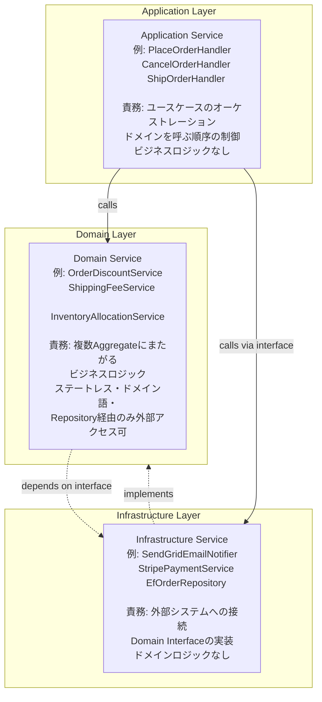
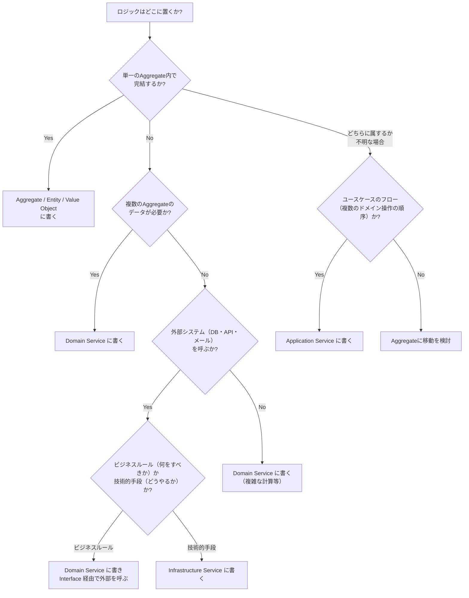

# 第 12 章: Service — ドメインサービス・アプリケーションサービス・インフラサービスを正確に区別する

## 0. TL;DR

DDD における「Service」は3種類ある。**Domain Service**（複数の Aggregate にまたがるビジネスロジック）、**Application Service**（ユースケースのオーケストレーター）、**Infrastructure Service**（外部システムへの接続）。最も重要な判断は「このロジックはどこに属するか」であり、誤った配置がシステムを腐敗させる。

---

## 1. なぜ Service の種類を区別しなければならないか

### 1.1 「サービス」という言葉の曖昧さ

「サービスに書く」という言葉は、DDDの文脈では意味が曖昧です。以下の3つのケースは、それぞれ異なる層に属します:

```csharp
// ケース1: 複数のAggregateにまたがるビジネスロジック
// → Domain Service に属する
"顧客のポイント残高と注文金額を比較して、ポイント払いの可否を判定する"

// ケース2: 注文確定の一連のユースケースのオーケストレーション
// → Application Service に属する
"注文確定の処理: 顧客取得 → 在庫確認 → 注文作成 → 保存 → メール送信"

// ケース3: 外部のメールAPIを呼ぶ処理
// → Infrastructure Service に属する
"SendGrid API を使ってメールを送信する"
```

この3つを混同すると、ビジネスロジックがインフラに漏れ、Aggregate が痩せ、Application Service が肥大化し、システムが保守できなくなります。

### 1.2 ロジックの置き場所を間違えると何が起きるか

```csharp
// NG: 全てが Application Service に詰め込まれた設計
public class OrderApplicationService
{
    public async Task PlaceOrderAsync(Guid customerId, List<OrderItemDto> items)
    {
        // ↓ これは本来 Aggregate に属する（NG: Application Service にビジネスロジック）
        if (!items.Any())
            throw new Exception("注文アイテムが1件以上必要です");

        var total = items.Sum(i => i.UnitPrice * i.Quantity);

        // ↓ これは Domain Service に属する（NG: Application Service に複数Aggregateのロジック）
        var customer = await _db.Customers.FindAsync(customerId);
        if (customer.TotalPurchaseAmount > 100000)
            total *= 0.9m; // ゴールド会員は10%割引

        // ↓ これは Infrastructure に属する（NG: ビジネスロジックとインフラが混在）
        using var smtp = new SmtpClient("mail.example.com");
        await smtp.SendMailAsync(new MailMessage { ... });

        // 保存
        await _db.Orders.AddAsync(new Order { Total = total, ... });
        await _db.SaveChangesAsync();
    }
}
```

この「全部入り Application Service」は、DDD の最も一般的な失敗パターンです。1〜2年後には数千行の神様クラスになります。

---

## 2. Domain Service（ドメインサービス）

### 2.1 Domain Service とは

Domain Service は、**単一の Aggregate には属さない、しかしドメインの重要なビジネスロジック**を表現するオブジェクトです。

Eric Evans の定義:
> 「オペレーションが本来 Entity や Value Object に属さないとき、そのオペレーションを Domain Service として定義する。Domain Service は Ubiquitous Language で表現され、ドメインの概念の一部である」

### 2.2 Domain Service が必要になる3つのシグナル

**シグナル1: 複数の Aggregate にまたがるロジック**

```csharp
// 「注文金額と顧客のポイント残高を比較してポイント払いが可能か」
// → Order と Customer の両方を知る必要がある
// → どちらの Aggregate に属するかが不明

public sealed class OrderDiscountService  // Domain Service
{
    // 「Gold会員かつ月3回以上注文した顧客には追加5%割引」
    // この判断は Customer と Order の両方を必要とする
    public Money CalculateAdditionalDiscount(Customer customer, Order order)
    {
        if (customer.Tier == CustomerTier.Gold &&
            customer.MonthlyOrderCount >= 3 &&
            order.TotalAmount.Amount >= 10000)
        {
            return order.TotalAmount.Multiply(0.05m); // 5% 割引
        }
        return Money.Zero(order.TotalAmount.Currency);
    }
}
```

**シグナル2: Aggregate を越えるチェック（同一性の確認）**

```csharp
// 「同じ顧客が5分以内に同じ商品構成の注文を出した場合は重複とみなす」
// → Order の履歴（Repository）を参照する必要がある
// → Order Aggregate が Repository を持つのは不適切

public sealed class OrderDomainService  // Domain Service
{
    private readonly IOrderRepository _orderRepo;

    public OrderDomainService(IOrderRepository orderRepo)
        => _orderRepo = orderRepo;

    public async Task<bool> HasRecentDuplicateAsync(
        Order order, TimeSpan window)
    {
        var recentOrders = await _orderRepo.FindRecentByCustomerAsync(
            order.CustomerId,
            from: DateTime.UtcNow - window
        );

        return recentOrders.Any(recent =>
            recent.Items.Count == order.Items.Count &&
            recent.Items.All(ri =>
                order.Items.Any(oi =>
                    oi.ProductId == ri.ProductId &&
                    oi.Quantity == ri.Quantity)));
    }
}
```

**シグナル3: 複数の Aggregate を協調させるビジネスルール**

```csharp
// 「限定版商品の場合、1顧客あたり最大2点まで」
// → Product（限定版かどうか）と Order（過去の注文）を両方確認

public sealed class PurchaseLimitService  // Domain Service
{
    private readonly IOrderRepository _orderRepo;

    public PurchaseLimitService(IOrderRepository orderRepo)
        => _orderRepo = orderRepo;

    public async Task<bool> CanPurchaseAsync(
        Customer customer, Product product, int requestedQuantity)
    {
        if (!product.IsLimitedEdition)
            return true; // 限定版でなければ制限なし

        var previousPurchases = await _orderRepo.FindCompletedByCustomerAndProductAsync(
            customer.Id, product.Id);

        var alreadyPurchased = previousPurchases.Sum(o =>
            o.Items.Where(i => i.ProductId == product.Id).Sum(i => i.Quantity));

        return (alreadyPurchased + requestedQuantity) <= 2;
    }
}
```

### 2.3 Domain Service の設計原則

**原則1: ステートレス（状態を持たない）**

```csharp
// OK: ステートレス
public sealed class ShippingFeeService
{
    public Money Calculate(Address destination, Weight weight, Carrier carrier)
    {
        // 計算ロジックのみ、状態なし
        return carrier switch
        {
            Carrier.Express => CalculateExpressFee(destination, weight),
            Carrier.Standard => CalculateStandardFee(destination, weight),
            _ => throw new DomainException("不明な配送業者")
        };
    }
}

// NG: 状態を持つ Domain Service（Aggregate に昇格すべき）
public class OrderTracker
{
    private List<Order> _trackedOrders = new(); // ← 状態を持っている

    public void Track(Order order) => _trackedOrders.Add(order);
    // ... これは Aggregate として設計すべき
}
```

**原則2: Ubiquitous Language で命名する**

```csharp
// NG: 技術的な命名
public class OrderCalculationHelper { ... }
public class OrderProcessor { ... }

// OK: ドメイン語
public class OrderDiscountService { ... }    // 割引計算
public class ShippingFeeService { ... }      // 送料計算
public class PurchaseLimitService { ... }    // 購入制限チェック
public class TaxCalculationService { ... }  // 消費税計算
```

**原則3: ドメインの概念を表現する**

Domain Service は Infrastructure を知りません。DB接続・外部API呼び出しは持ちません（Repository インターフェース経由はOK）。

```csharp
// OK: Repository インターフェース（Domain 定義）を使う
public class OrderDomainService
{
    private readonly IOrderRepository _orderRepo; // Domain Layer の interface

    public OrderDomainService(IOrderRepository orderRepo)
        => _orderRepo = orderRepo;
}

// NG: Infrastructure を直接使う
public class OrderDomainService
{
    private readonly AppDbContext _db; // ← Infrastructure が Domain に入っている

    public OrderDomainService(AppDbContext db) => _db = db;
}
```

### 2.4 Domain Service の完全実装例

```csharp
// ===== ドメインサービス: 注文割引計算 =====
public sealed class OrderDiscountService
{
    // 割引ルール:
    // 1. Gold会員 + 注文額 ¥10,000以上 → 10% 割引
    // 2. 初回注文（まだ注文履歴なし） → 5% 割引
    // 3. バースデー月（今月が誕生月） → 3% 割引
    // 複数条件が重なる場合は最大の割引率を適用（累積しない）

    public DiscountResult Calculate(
        Customer customer,
        Order order,
        int existingOrderCount,
        bool isBirthdayMonth)
    {
        var discounts = new List<Discount>();

        // ルール1: Gold会員 + 高額注文
        if (customer.Tier == CustomerTier.Gold &&
            order.TotalAmount.Amount >= 10000)
        {
            discounts.Add(new Discount(
                Type: DiscountType.GoldMember,
                Rate: 0.10m,
                Description: "Gold会員特典 (10%)"
            ));
        }

        // ルール2: 初回注文
        if (existingOrderCount == 0)
        {
            discounts.Add(new Discount(
                Type: DiscountType.FirstOrder,
                Rate: 0.05m,
                Description: "初回注文特典 (5%)"
            ));
        }

        // ルール3: 誕生月
        if (isBirthdayMonth)
        {
            discounts.Add(new Discount(
                Type: DiscountType.Birthday,
                Rate: 0.03m,
                Description: "バースデー特典 (3%)"
            ));
        }

        // 最大割引率を適用
        if (!discounts.Any())
            return DiscountResult.NoDiscount();

        var bestDiscount = discounts.MaxBy(d => d.Rate)!;
        var discountAmount = order.TotalAmount.Multiply(bestDiscount.Rate);

        return DiscountResult.Applied(discountAmount, bestDiscount);
    }
}

public sealed record Discount(
    DiscountType Type,
    decimal Rate,
    string Description
);

public enum DiscountType { GoldMember, FirstOrder, Birthday }

public sealed record DiscountResult
{
    public bool HasDiscount { get; }
    public Money? Amount { get; }
    public Discount? AppliedDiscount { get; }

    private DiscountResult(bool hasDiscount, Money? amount, Discount? discount)
    {
        HasDiscount = hasDiscount;
        Amount = amount;
        AppliedDiscount = discount;
    }

    public static DiscountResult NoDiscount() => new(false, null, null);
    public static DiscountResult Applied(Money amount, Discount discount)
        => new(true, amount, discount);
}

// ===== ドメインサービス: 在庫チェック（複数サービス） =====
public sealed class InventoryAllocationService
{
    private readonly IProductRepository _productRepo;
    private readonly IOrderRepository _orderRepo;

    public InventoryAllocationService(
        IProductRepository productRepo,
        IOrderRepository orderRepo)
    {
        _productRepo = productRepo;
        _orderRepo = orderRepo;
    }

    // 複数の注文アイテムに対して在庫を確認し、
    // 全アイテムが確保できるかチェック
    public async Task<AllocationCheckResult> CheckAsync(
        IReadOnlyList<OrderItem> items)
    {
        var failures = new List<AllocationFailure>();

        foreach (var item in items)
        {
            var product = await _productRepo.FindByIdAsync(item.ProductId);
            if (product is null)
            {
                failures.Add(new AllocationFailure(
                    item.ProductId,
                    item.ProductName,
                    RequestedQuantity: item.Quantity,
                    AvailableQuantity: 0,
                    Reason: "商品が見つかりません"
                ));
                continue;
            }

            if (!product.IsActive)
            {
                failures.Add(new AllocationFailure(
                    item.ProductId,
                    item.ProductName,
                    RequestedQuantity: item.Quantity,
                    AvailableQuantity: 0,
                    Reason: "販売停止商品です"
                ));
                continue;
            }

            if (product.StockQuantity < item.Quantity)
            {
                failures.Add(new AllocationFailure(
                    item.ProductId,
                    item.ProductName,
                    RequestedQuantity: item.Quantity,
                    AvailableQuantity: product.StockQuantity,
                    Reason: "在庫不足"
                ));
            }
        }

        return failures.Any()
            ? AllocationCheckResult.Failure(failures)
            : AllocationCheckResult.Success();
    }
}

public sealed record AllocationFailure(
    ProductId ProductId,
    string ProductName,
    int RequestedQuantity,
    int AvailableQuantity,
    string Reason
);

public sealed record AllocationCheckResult
{
    public bool IsSuccess { get; }
    public IReadOnlyList<AllocationFailure> Failures { get; }

    private AllocationCheckResult(bool isSuccess, IReadOnlyList<AllocationFailure> failures)
    {
        IsSuccess = isSuccess;
        Failures = failures;
    }

    public static AllocationCheckResult Success()
        => new(true, Array.Empty<AllocationFailure>());
    public static AllocationCheckResult Failure(IReadOnlyList<AllocationFailure> failures)
        => new(false, failures);
}
```

---

## 3. Application Service（アプリケーションサービス）

### 3.1 Application Service とは

Application Service は、**ユースケース（Use Case）のオーケストレーター**です。ドメインオブジェクトを呼び出す順序を制御しますが、ビジネスルールを自分では持ちません。

Evans の定義:
> 「Application Service はドメインのオブジェクトを薄いレイヤーで包み、ユースケースを実行する。Application Service にはビジネスロジックがあってはならない。ビジネスロジックはドメイン層にある」

### 3.2 Application Service の責務

```
Application Service の正しい責務:
1. 入力の変換（HTTPリクエスト/DTOをドメイン型に）
2. 認可チェック（このユーザーはこの操作を行う権限があるか）
3. Repository からの取得
4. Domain Object / Domain Service の呼び出し
5. Repository への保存
6. Domain Events の dispatch
7. 出力の変換（ドメイン型を DTO に）
```

### 3.3 Application Service の完全実装

```csharp
// Application Service（CommandHandler）: 注文確定
public sealed class PlaceOrderHandler
{
    private readonly IOrderRepository _orderRepo;
    private readonly ICustomerRepository _customerRepo;
    private readonly IProductRepository _productRepo;
    private readonly OrderDomainService _orderDomainService;
    private readonly InventoryAllocationService _inventoryService;
    private readonly OrderDiscountService _discountService;
    private readonly IDomainEventDispatcher _dispatcher;

    public PlaceOrderHandler(
        IOrderRepository orderRepo,
        ICustomerRepository customerRepo,
        IProductRepository productRepo,
        OrderDomainService orderDomainService,
        InventoryAllocationService inventoryService,
        OrderDiscountService discountService,
        IDomainEventDispatcher dispatcher)
    {
        _orderRepo = orderRepo;
        _customerRepo = customerRepo;
        _productRepo = productRepo;
        _orderDomainService = orderDomainService;
        _inventoryService = inventoryService;
        _discountService = discountService;
        _dispatcher = dispatcher;
    }

    public async Task<PlaceOrderResult> HandleAsync(
        PlaceOrderCommand cmd, CancellationToken ct = default)
    {
        // ======================================================
        // ここから先はオーケストレーションのみ
        // ビジネスルールは Domain / Domain Service が持つ
        // ======================================================

        // 1. 入力の変換と検証（形式的な検証のみ）
        //    ビジネスルールの検証は Domain に委ねる
        if (!cmd.Items.Any())
            return PlaceOrderResult.Failure("注文アイテムが必要です");

        // 2. 顧客の取得
        var customer = await _customerRepo.FindByIdAsync(
            CustomerId.From(cmd.CustomerId));
        if (customer is null)
            return PlaceOrderResult.Failure("顧客が存在しません");

        // 3. 在庫チェック（Domain Service）
        var orderItems = cmd.Items.Select(i => OrderItem.Create(
            OrderItemId.New(),
            ProductId.From(i.ProductId),
            i.ProductName,
            Money.Of(i.UnitPrice, i.Currency),
            i.Quantity
        )).ToList();

        // 仮の注文オブジェクト（割引計算・在庫チェック用）
        var address = Address.Of(cmd.PostalCode, cmd.Prefecture, cmd.City, cmd.Street);
        var order = Order.Create(customer.Id, address);
        foreach (var item in orderItems)
            order.AddItemInternal(item);

        // 4. 在庫チェック（Domain Service）
        var inventoryCheck = await _inventoryService.CheckAsync(order.Items);
        if (!inventoryCheck.IsSuccess)
        {
            var failedItems = inventoryCheck.Failures
                .Select(f => $"{f.ProductName}: 在庫{f.AvailableQuantity}件（要求{f.RequestedQuantity}件）");
            return PlaceOrderResult.Failure(
                $"在庫不足の商品があります: {string.Join(", ", failedItems)}");
        }

        // 5. 重複注文チェック（Domain Service）
        if (await _orderDomainService.HasRecentDuplicateAsync(order, TimeSpan.FromMinutes(5)))
            return PlaceOrderResult.Failure("直近5分以内に同じ注文があります");

        // 6. 割引計算（Domain Service）
        var existingOrderCount = await _orderRepo.CountByCustomerAsync(customer.Id);
        var isBirthdayMonth = customer.BirthDate?.Month == DateTime.UtcNow.Month;
        var discountResult = _discountService.Calculate(
            customer, order, existingOrderCount, isBirthdayMonth);

        // 7. 注文確定（Aggregate のメソッドを呼ぶ）
        order.Place(discountResult.Amount); // ← ビジネスロジックは Aggregate が持つ

        // 8. 永続化
        await _orderRepo.SaveAsync(order, ct);

        // 9. Domain Events の dispatch
        var events = order.PopDomainEvents();
        await _dispatcher.DispatchAsync(events, ct);

        return PlaceOrderResult.Success(order.Id.Value, order.TotalAmount.Amount);
    }
}

public sealed record PlaceOrderCommand(
    Guid CustomerId,
    string PostalCode,
    string Prefecture,
    string City,
    string Street,
    IReadOnlyList<OrderItemInput> Items
);

public sealed record OrderItemInput(
    Guid ProductId, string ProductName,
    decimal UnitPrice, string Currency, int Quantity
);

public sealed record PlaceOrderResult
{
    public bool IsSuccess { get; }
    public Guid? OrderId { get; }
    public decimal? FinalAmount { get; }
    public string? ErrorMessage { get; }

    private PlaceOrderResult(bool isSuccess, Guid? orderId,
        decimal? finalAmount, string? errorMessage)
    {
        IsSuccess = isSuccess;
        OrderId = orderId;
        FinalAmount = finalAmount;
        ErrorMessage = errorMessage;
    }

    public static PlaceOrderResult Success(Guid orderId, decimal amount)
        => new(true, orderId, amount, null);
    public static PlaceOrderResult Failure(string msg)
        => new(false, null, null, msg);
}
```

### 3.4 Application Service が「してはいけないこと」

```csharp
// NG パターン集

// NG1: Application Service でビジネスルール判定
public async Task<Result> PlaceOrderAsync(PlaceOrderCommand cmd)
{
    // NG: Application Service が「注文が有効か」を判定している
    if (cmd.TotalAmount <= 0)
        throw new Exception("金額が0以下");

    if (cmd.Items.Count > 50)
        throw new Exception("アイテム数の上限は50個");

    // ↑ これは Domain の Invariant（Aggregate が持つべき）
}

// NG2: Application Service でエンティティを直接操作
public async Task CancelOrderAsync(Guid orderId, string reason)
{
    var order = await _orderRepo.FindByIdAsync(orderId);

    // NG: Application Service が Order の状態を直接変える
    order.Status = OrderStatus.Cancelled; // ← Aggregate のメソッドを呼ぶべき
    order.CancelledAt = DateTime.UtcNow;
    order.CancelReason = reason;

    await _orderRepo.SaveAsync(order);
}

// OK: Aggregate のメソッドを呼ぶ
public async Task CancelOrderAsync(Guid orderId, string reason)
{
    var order = await _orderRepo.FindByIdAsync(orderId);

    order.Cancel(reason); // ← Aggregate がビジネスルールを検証・状態変化

    await _orderRepo.SaveAsync(order);
    await _dispatcher.DispatchAsync(order.PopDomainEvents());
}

// NG3: Application Service に複雑な計算ロジック
public async Task<Money> CalculateShippingFeeAsync(Guid orderId)
{
    var order = await _orderRepo.FindByIdAsync(orderId);

    // NG: 送料計算ロジックが Application Service にある
    decimal fee = order.ShippingAddress.Prefecture == "東京都" ? 0 : 800;
    if (order.TotalAmount.Amount >= 5000) fee = 0;
    if (order.TotalWeight > 20) fee += 500;

    return Money.Of(fee, "JPY");
    // ↑ ShippingFeeService（Domain Service）に移動すべき
}
```

---

## 4. Infrastructure Service（インフラサービス）

### 4.1 Infrastructure Service とは

Infrastructure Service は、**外部システムへの接続を担う実装**です。ドメインインターフェース（Secondary Port）を実装します。

```csharp
// Domain Layer が定義する Secondary Port（インターフェース）
public interface IEmailNotifier  // ← Domain の言語で表現
{
    Task SendOrderConfirmationAsync(
        string recipientEmail, Guid orderId, decimal totalAmount);
    Task SendShippingNotificationAsync(
        string recipientEmail, Guid orderId, string trackingNumber);
}

// Infrastructure Layer の実装
public sealed class SendGridEmailNotifier : IEmailNotifier
{
    private readonly ISendGridClient _client;
    private readonly string _senderEmail;

    public SendGridEmailNotifier(ISendGridClient client, IConfiguration config)
    {
        _client = client;
        _senderEmail = config["Email:SenderAddress"]!;
    }

    public async Task SendOrderConfirmationAsync(
        string recipientEmail, Guid orderId, decimal totalAmount)
    {
        var message = MailHelper.CreateSingleEmail(
            from: new EmailAddress(_senderEmail, "CreaNest Store"),
            to: new EmailAddress(recipientEmail),
            subject: $"ご注文の確認 #{orderId.ToString()[..8]}",
            plainTextContent: $"ご注文ありがとうございます。合計金額: ¥{totalAmount:N0}",
            htmlContent: BuildConfirmationHtml(orderId, totalAmount)
        );

        var response = await _client.SendEmailAsync(message);
        if (!response.IsSuccessStatusCode)
            throw new InfrastructureException(
                $"メール送信失敗: StatusCode={response.StatusCode}");
    }

    public async Task SendShippingNotificationAsync(
        string recipientEmail, Guid orderId, string trackingNumber)
    {
        // ... 発送通知メールの実装 ...
    }

    private static string BuildConfirmationHtml(Guid orderId, decimal totalAmount)
        => $"""
            <html><body>
            <h1>ご注文ありがとうございます</h1>
            <p>注文番号: {orderId}</p>
            <p>合計金額: ¥{totalAmount:N0}</p>
            </body></html>
            """;
}
```

### 4.2 Infrastructure Service の特徴

```csharp
// Infrastructure Service は:
// - ドメインのインターフェースを実装する
// - 外部ライブラリ・フレームワーク（SendGrid, AWS, etc.）を使う
// - ドメインロジックを持たない
// - ドメイン型を知るが、ドメインモデルを変更しない

// Infrastructure Service は:
// - ドメイン型（Money, OrderId, CustomerId）を引数に取ることもある
// - ただし、変換（ACL）を経てプリミティブ型にしてから外部APIを呼ぶのが望ましい

public sealed class StripePaymentService : IPaymentGateway
{
    private readonly StripeClient _stripe;

    public async Task<PaymentResult> ChargeAsync(Money amount, string paymentMethodId)
    {
        // Money（Domain 型）→ Stripe のプリミティブ型に変換
        var options = new ChargeCreateOptions
        {
            Amount = (long)(amount.Amount * 100),  // Stripe はセント単位
            Currency = amount.Currency.ToLower(),
            PaymentMethod = paymentMethodId,
            Confirm = true
        };

        try
        {
            var charge = await _stripe.ChargeService.CreateAsync(options);

            return charge.Status == "succeeded"
                ? PaymentResult.Success(PaymentId.From(charge.Id), amount)
                : PaymentResult.Failure($"決済失敗: {charge.FailureMessage}");
        }
        catch (StripeException ex)
        {
            return PaymentResult.Failure($"Stripe エラー: {ex.StripeError.Message}");
        }
    }
}
```

---

## 5. 3つの Service の比較表



| 比較軸 | Domain Service | Application Service | Infrastructure Service |
|--------|---------------|--------------------|-----------------------|
| **置く層** | Domain | Application | Infrastructure |
| **ビジネスロジック** | 持つ | 持たない | 持たない |
| **状態** | ステートレス | ステートレス | ステートフルな場合あり（接続） |
| **テスト** | ユニットテスト（モックなし） | ユニットテスト（モック必要） | 統合テスト |
| **外部依存** | Repository interface のみ | 全て interface 経由 | 直接（外部ライブラリ使用） |
| **例** | 送料計算、割引計算 | 注文確定フロー | SendGrid、Stripe、EF Core |

---

## 6. 「このロジックをどこに置くか」の判断フロー



---

## 7. よくある設計ミス TOP7

### ミス1: Application Service にビジネスロジックを書く（最多）

```csharp
// NG: Application Service がビジネスルールを持つ
public async Task PlaceOrderAsync(PlaceOrderCommand cmd)
{
    if (cmd.Items.Count > 100)  // ← これは Domain の Invariant
        throw new Exception("100品を超える注文は受け付けられません");

    var total = cmd.Items.Sum(i => i.Price * i.Qty);  // ← これも Domain ロジック
    if (total < 100)  // ← 最低注文金額も Domain ロジック
        throw new Exception("最低注文金額は100円です");
}

// OK: Aggregate が Invariant を持つ
public class Order : Entity<OrderId>
{
    public void AddItem(ProductId productId, string name, Money price, int qty)
    {
        if (_items.Count >= 100)
            throw new DomainException("100品を超える注文は受け付けられません");
        // ...
    }

    public void Place()
    {
        if (TotalAmount.Amount < 100)
            throw new DomainException("最低注文金額は100円です");
        // ...
    }
}
```

### ミス2: Domain Service が Infrastructure に依存する

```csharp
// NG: Domain Service が外部ライブラリを直接使う
public class ShippingFeeService
{
    private readonly HttpClient _http;  // ← Infrastructure が Domain に混入

    public async Task<Money> CalculateAsync(Address destination)
    {
        var response = await _http.GetAsync($"https://shipping-api.example.com/fee?zip={destination.PostalCode}");
        // ← API 呼び出しが Domain Service にある
    }
}

// OK: Interface 経由
public class ShippingFeeService
{
    private readonly IShippingFeeProvider _provider;  // Domain が定義した interface

    public ShippingFeeService(IShippingFeeProvider provider)
        => _provider = provider;

    public async Task<Money> CalculateAsync(Address destination, Weight weight)
    {
        // Domain Service: 計算ロジック
        var baseFee = await _provider.GetBaseFeeAsync(destination.PostalCode);
        var surcharge = weight.Grams > 5000 ? Money.Of(200, "JPY") : Money.Zero("JPY");
        return baseFee.Add(surcharge);
    }
}
```

### ミス3: Domain Service が Aggregate になっていいケースを見逃す

```csharp
// NG: 状態を持つ Domain Service（Aggregate にすべき）
public class CartService
{
    private List<CartItem> _items = new();  // ← 状態がある

    public void AddItem(CartItem item) => _items.Add(item);
    public decimal GetTotal() => _items.Sum(i => i.Price * i.Qty);
    // ↑ これは Cart Aggregate として設計すべき
}

// OK: Cart Aggregate
public class Cart : Entity<CartId>
{
    private readonly List<CartItem> _items = new();
    public IReadOnlyList<CartItem> Items => _items.AsReadOnly();
    public Money TotalAmount => _items.Aggregate(Money.Zero("JPY"), ...);

    public void AddItem(ProductId productId, string name, Money price, int qty) { ... }
    public void RemoveItem(CartItemId itemId) { ... }
    public Order Checkout(CustomerId customerId, Address address) { ... }
}
```

### ミス4: Application Service が薄すぎてドメインロジックを素通りさせる

```csharp
// NG: Application Service が「Repository → 返す」だけで何もしない
public async Task<Order> GetOrderAsync(Guid orderId)
{
    return await _orderRepo.FindByIdAsync(orderId);
    // ↑ Aggregate をそのまま返すのは NG
    // Domain 型が Presentation まで漏れる
    // Query 側は DTO を返すべき（第15章 CQRS）
}
```

### ミス5: Application Service に複数のユースケースを詰め込む

```csharp
// NG: 1つの Application Service クラスにユースケースが何十もある
public class OrderService
{
    public Task PlaceOrderAsync(...) { ... }
    public Task CancelOrderAsync(...) { ... }
    public Task ShipOrderAsync(...) { ... }
    public Task<Order> GetOrderAsync(...) { ... }
    public Task<List<Order>> GetOrdersByCustomerAsync(...) { ... }
    // ... 数十のメソッドが増殖する
}

// OK: ユースケース = 1つの Handler クラス
public class PlaceOrderHandler { ... }
public class CancelOrderHandler { ... }
public class ShipOrderHandler { ... }
public class GetOrderQueryHandler { ... }
```

### ミス6: Infrastructure Service がビジネスロジックを持つ

```csharp
// NG: Infrastructure Service（Repository 実装）にビジネスロジック
public class EfOrderRepository : IOrderRepository
{
    public async Task<List<Order>> FindActiveAsync()
    {
        // NG: 「有効期限内の注文」の定義がインフラに漏れている
        return await _ctx.Orders
            .Where(o => o.Status == "Placed" && o.PlacedAt > DateTime.UtcNow.AddDays(-30))
            .ToListAsync();
    }
}

// OK: ビジネスロジックは Domain (Specification) が持つ
public class ActiveOrderSpecification : ISpecification<Order>
{
    public Expression<Func<Order, bool>> ToExpression()
        => order => order.Status == OrderStatus.Placed &&
                    order.PlacedAt > DateTime.UtcNow.AddDays(-30);
}
```

### ミス7: Domain Service と Application Service の命名が区別できない

```csharp
// NG: 両方 "Service" で区別がつかない
public class OrderService { ... }         // Domain? Application?
public class CustomerService { ... }      // どっち?

// OK: 層が分かる命名
// Domain Service
public class OrderDiscountService { ... }  // ドメインの概念
public class ShippingFeeService { ... }    // ドメインの概念

// Application Service (Handler)
public class PlaceOrderHandler { ... }     // ユースケース
public class CancelOrderHandler { ... }    // ユースケース

// または UseCase 接尾語
public class PlaceOrderUseCase { ... }
public class CancelOrderUseCase { ... }
```

---

## 8. コードレビュー観点チェックリスト

**Domain Service のレビュー**
- [ ] Domain Service がステートレスか（状態フィールドを持っていないか）
- [ ] Domain Service がドメイン語で命名されているか（`XxxHelper`, `XxxUtil` は NG）
- [ ] Domain Service が Infrastructure を直接インスタンス化していないか
- [ ] 単一の Aggregate で完結するロジックが Domain Service に書かれていないか（Aggregate に移動すべき）

**Application Service のレビュー**
- [ ] Application Service にビジネスロジックが書かれていないか（Aggregate / Domain Service に移動すべき）
- [ ] Application Service が Aggregate を直接変更していないか（Aggregate のメソッドを呼ぶべき）
- [ ] Application Service がインフラ（EF Core DbContext など）を直接使っていないか
- [ ] 1つの Application Service クラスに多すぎるユースケースが詰め込まれていないか

**Infrastructure Service のレビュー**
- [ ] Infrastructure Service が Domain Interface を実装しているか
- [ ] Infrastructure Service にビジネスロジックが書かれていないか

---

## 9. アーキテクトの視点

### Domain Service の大きさの経験則

Domain Service は「1〜3つのメソッドを持つ、小さなクラス」が理想です。

- `ShippingFeeService.Calculate(Address, Weight) → Money`
- `OrderDiscountService.Calculate(Customer, Order) → DiscountResult`
- `PurchaseLimitService.CanPurchase(Customer, Product, int) → bool`

10以上のメソッドを持つ Domain Service は、設計の再考を示すサインです。複数の異なる責務が混在している可能性があります。

### Application Service はどの粒度で作るか

**コマンドハンドラーパターン（推奨）**: 1ユースケース = 1クラス

```
PlaceOrderHandler     (注文確定)
CancelOrderHandler    (注文キャンセル)
ShipOrderHandler      (発送)
UpdateAddressHandler  (住所変更)
```

このパターンの利点:
- 各ハンドラーが単一責務
- テストが書きやすい
- 依存関係が明確（コンストラクタに必要なものだけ）

### Transaction Script からの移行

「全部入り Application Service」から正しい設計に移行する手順:

1. Application Service のメソッドに `// ビジネスルール: ...` コメントを書く
2. コメントを書いた箇所が「Aggregate か Domain Service に移動すべきもの」
3. 移動後、Application Service は「呼び出すだけ」のコードになる

---

## 10. 演習問題

**問1: ロジックの配置**

以下のロジックを Domain Service / Application Service / Aggregate / Infrastructure のどこに置くか答えてください。

1. 「1日に同じIPアドレスから10回以上ログイン失敗したらアカウントをロックする」
2. 「注文確定時に在庫を減らす」
3. 「ポイントカードの残高が足りない場合は注文できない」
4. 「AWS S3に商品画像をアップロードする」
5. 「月次の売上集計レポートを作成する」

解答:
1. Domain Service（ログイン失敗 + IP + アカウントをまたぐ）または Infrastructure（ログインフロー次第）
2. Domain Event Handler（OrderPlacedEvent で在庫引き当て）— Aggregate への直接操作は避ける
3. Aggregate または Domain Service（ポイント残高と注文金額の比較）
4. Infrastructure Service（S3は外部システム）
5. Application Service（クエリユースケース）/ Query Handler

**問2: コードレビュー**

以下の OrderDomainService に問題があります。指摘してください。

```csharp
public class OrderDomainService
{
    private readonly AppDbContext _db;  // 問題1
    private List<Order> _processedOrders = new();  // 問題2

    public async Task<bool> ValidateAndProcessAsync(Order order)
    {
        _processedOrders.Add(order);  // 問題3

        // メール送信（問題4）
        var smtp = new SmtpClient();
        await smtp.SendMailAsync(...);

        return order.Items.Any();  // 問題5
    }
}
```

**問3: 設計**

「タクシー配車サービス」の以下のロジックを設計してください:
- 最も近いドライバーを見つける（距離計算）
- ドライバーが承認した場合に料金見積もりを計算する
- 乗車が完了した時に支払いを処理する

どれを Domain Service / Application Service / Infrastructure Service にするか設計し、インターフェースを C# で定義してください。

---

## 参考文献と著者の解釈

Eric Evans は Blue Book（2003）第6章で Domain Service を定義し、「Entity や Value Object に属さないとき、その操作を Service として表現する」と述べました。重要なのは「Service はステートレスであるべき」という点で、もし状態が必要なら Aggregate として設計すべきことを示唆しています。

Vaughn Vernon は *Implementing Domain-Driven Design*（2013）第7章で、Domain Service の判断基準を明確にしました。「そのオペレーションが Aggregate Root または Value Object に属すとすれば、どちらに属するか自明でない場合に Domain Service を使う」という指針は、本章の判断フローと一致します。

筆者の実務経験では、「Application Service が肥大化している」プロジェクトの多くは、Domain Service を知らずに全てのロジックを Application Service に詰め込んでいました。Domain Service という「受け皿」があることを知るだけで、ドメインロジックの置き場所が明確になり、設計が劇的に改善します。
