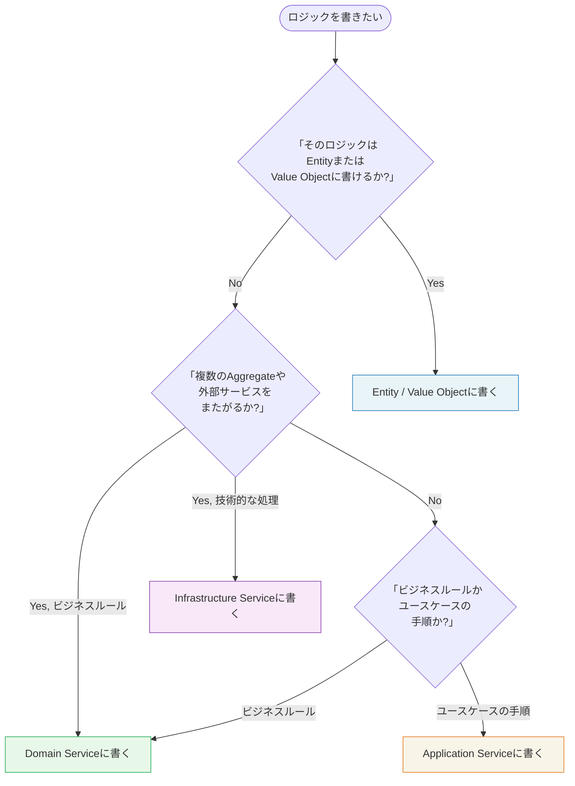

## 3種類のServiceを区別する

DDDでの「Service」という言葉は文脈によって異なるものを指します。混乱を避けるため、まず3種類を明確に区別しましょう。

| 種類 | 責務 | 定義場所 | ビジネスルールを書くか |
|------|------|---------|-------------------|
| **Domain Service** | 複数のAggregateにまたがるビジネスルール | Domain層 | **はい** |
| **Application Service** | ユースケースのオーケストレーション | Application層 | **いいえ** |
| **Infrastructure Service** | 技術的な機能（メール送信・外部API） | Infrastructure層 | いいえ |

この区別が曖昧になると、ビジネスロジックがApplication ServiceやInfrastructure Serviceに漏れ出し、ドメインモデルが空洞化します（**Transaction Script化**）。

## 「このロジックはどこに書くか」の判断フロー



## Domain Service: 複数のAggregateにまたがるビジネスルール

Domain Serviceが必要になるのは、「このビジネスルールは特定のAggregateに属するのが不自然だ」という場合です。

典型的なケースとして、「重複メールアドレスの顧客は登録できない」というルールを考えます。このルールを`Customer`内部に書くには、全顧客データへのアクセスが必要で不自然です。

```csharp
// Domain Service: 重複チェック（ドメインルール）
public class CustomerUniquenessChecker
{
    private readonly ICustomerRepository _customerRepo;

    public CustomerUniquenessChecker(ICustomerRepository customerRepo)
    {
        _customerRepo = customerRepo;
    }

    // ビジネスルール: 同じメールアドレスの顧客は存在してはならない
    public async Task<bool> IsUniqueAsync(Email email)
    {
        var existing = await _customerRepo.FindByEmailAsync(email);
        return existing is null;
    }
}

// Domain Service: 会員ランク別割引計算（複数のAggregateに関わるルール）
public class DiscountCalculationService
{
    // 会員ランクと購入金額に基づく割引率の計算はビジネスルール
    public DiscountRate Calculate(Customer customer, Order order)
    {
        // ゴールド会員かつ購入金額1万円以上は10%割引
        if (customer.Rank == CustomerRank.Gold
            && order.TotalAmount >= Money.FromJpy(10_000))
        {
            return DiscountRate.TenPercent;
        }

        // シルバー会員は5%割引
        if (customer.Rank == CustomerRank.Silver)
        {
            return DiscountRate.FivePercent;
        }

        return DiscountRate.None;
    }
}
```

## Application Service: ユースケースのオーケストレーター

Application ServiceはビジネスルールをAggregateやDomain Serviceに委ね、自身は「何を呼ぶか」と「どの順番で呼ぶか」だけを管理するオーケストレーターです。

**Application Serviceに書いてよいこと:**
- Repositoryへの問い合わせ（データ取得）
- Aggregateのメソッド呼び出し（ビジネスルールの実行依頼）
- Domain Eventの発行
- トランザクション境界の管理
- 認可チェック（認証ユーザーがこの操作を行う権限を持つか）

**Application Serviceに書いてはいけないこと:**
- ビジネスルールそのもの（「もし在庫が10個以下なら...」という条件分岐）
- データの変換ロジック（これはDomain層かMapper層へ）

## Before/After: Fat Serviceの解体

### Before: Application ServiceにビジネスルールとTask Script両方が混入

```csharp
// アンチパターン: Fat Application Service
public class RegisterCustomerService
{
    public async Task RegisterAsync(string name, string email, string password)
    {
        // ビジネスルールがApplication Serviceに混入している
        if (string.IsNullOrWhiteSpace(name) || name.Length > 100)
            throw new Exception("名前は1〜100文字で入力してください。");

        if (!email.Contains("@") || email.Length > 256)
            throw new Exception("有効なメールアドレスを入力してください。");

        // 重複チェックもここに書かれている
        var existing = await _db.Customers
            .FirstOrDefaultAsync(c => c.Email == email);
        if (existing != null)
            throw new Exception("このメールアドレスは既に使用されています。");

        // パスワードハッシュ化（Infrastructure の責務）
        var hashedPassword = BCrypt.HashPassword(password, workFactor: 12);

        var customer = new Customer { Name = name, Email = email, PasswordHash = hashedPassword };
        await _db.Customers.AddAsync(customer);
        await _db.SaveChangesAsync();
    }
}
```

### After: 責務を正しく分散させたApplication Service

```csharp
// Application Service: 薄くてクリーン
public class RegisterCustomerCommandHandler
{
    private readonly ICustomerRepository _customerRepo;
    private readonly CustomerUniquenessChecker _uniquenessChecker;  // Domain Service
    private readonly IUnitOfWork _uow;
    private readonly IDomainEventPublisher _publisher;

    public async Task HandleAsync(RegisterCustomerCommand command, CancellationToken ct)
    {
        // バリデーションはValue Objectのコンストラクタが担う（Domain層）
        var email = new Email(command.Email);  // 不正なEmailなら例外
        var customerName = new CustomerName(command.Name);  // 不正なNameなら例外

        // Domain Serviceに重複チェックを委ねる（ビジネスルール）
        if (!await _uniquenessChecker.IsUniqueAsync(email))
            throw new CustomerAlreadyExistsException(email);

        // Aggregateのファクトリメソッドで生成（生成ロジックはドメインに）
        var customer = Customer.Register(customerName, email, command.Password);

        await _customerRepo.AddAsync(customer, ct);
        await _uow.CommitAsync(ct);

        foreach (var ev in customer.DomainEvents)
            await _publisher.PublishAsync(ev, ct);
        customer.ClearDomainEvents();
    }
}
```

## Transaction Script vs Domain Model

**Transaction Script**（アンチパターン）は、手続き的にDB操作を記述するアプローチです。小規模システムでは機能しますが、ビジネスルールが増えると手に負えなくなります。

```csharp
// Transaction Script（アンチパターン）
public async Task PlaceOrderAsync(Guid customerId, List<CartItem> cartItems)
{
    // 手続き的にDBを直接操作
    decimal total = cartItems.Sum(i => i.Price * i.Quantity);
    var orderId = Guid.NewGuid();
    await _db.ExecuteAsync(
        "INSERT INTO Orders VALUES (@Id, @CustomerId, @Total, 'Placed')",
        new { Id = orderId, CustomerId = customerId, Total = total });
    // ...
}
```

DDDのDomain Modelアプローチでは、ビジネスロジックをAggregateに集め、Application Serviceは手順の調整に徹することで、複雑なドメインでも保守性を維持します。

> **専門家の視点**
>
> Application Serviceの肥大化（Fat Service）は、チームが「とりあえずここに書けば動く」と学習することで進行します。コードレビューの段階で「このif文はDomain Service/Aggregateに移動できないか?」を問いかける文化が、モデルの健全性を長期的に保つ最も効果的な方法です。
>
> また、「Application ServiceはUnit Test不要、Domain Serviceは必須」という原則を持つチームもあります。Application ServiceはIntegration Testで全体の振る舞いを確認し、ビジネスロジックのUnit TestはAggregateとDomain Serviceに集中させる——この分担により、テストの目的が明確になります。

## まとめ

ロジックの住所を正しく決めることがDDD設計の核心の一つです。「Aggregateに書ける → 書く」「複数Aggregateをまたがるビジネスルール → Domain Service」「ユースケースの手順 → Application Service」——この判断フローを習慣化することで、ドメインモデルの純粋性が保たれます。
