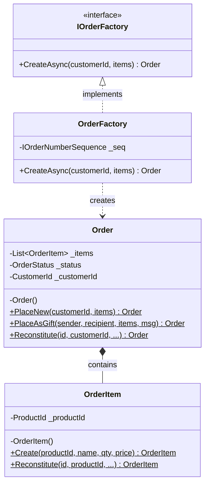
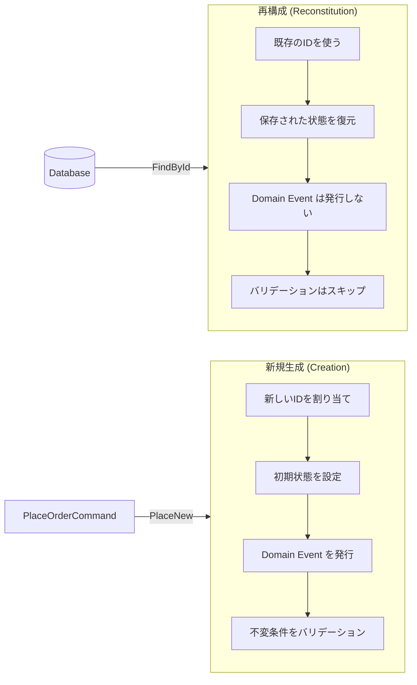

# 第 13 章: Factory パターン — ドメインオブジェクトの生成を設計する

## 0. TL;DR

Factory パターンは、複雑なドメインオブジェクトの「生成ロジック」をカプセル化する。`new Order(...)` に 10 個の引数が並び始めたら Factory のサイン。4 種類の Factory（Static Factory Method / Factory Method / Abstract Factory / Factory Service）を使い分けることで、生成ロジックがドメインの不変条件を守り続ける。「新規生成（Creation）」と「再構成（Reconstitution）」の分離が最重要の実装ポイント。

---

## 1. なぜ Factory が必要か

### 1.1 「new が散らばる問題」

ドメインオブジェクトを `new` で生成するコードがアプリケーション中に散らばると、何が起きるか見てみましょう。

**問題のある実装:**

```csharp
// Application Service の複数箇所に new Order(...) が散らばる

// 場所1: 通常注文
var order1 = new Order(
    Guid.NewGuid(),
    customerId,
    new List<OrderItem>(),
    DateTime.UtcNow,
    "Pending",  // ← 文字列のステータスが各地に散らばる
    null,
    0m
);

// 場所2: ギフト注文
var order2 = new Order(
    Guid.NewGuid(),
    customerId,
    new List<OrderItem>(),
    DateTime.UtcNow,
    "Pending",
    giftMessage,  // ← ギフトメッセージ
    0m
);

// 場所3: 予約注文
var order3 = new Order(
    Guid.NewGuid(),
    customerId,
    new List<OrderItem>(),
    DateTime.UtcNow,
    "Reserved",  // ← 予約ステータス
    null,
    0m
);
```

**問題点:**
1. `OrderStatus` の初期値が各所にハードコードされる（"Pending" が何箇所も）
2. 必須フィールドのバリデーションが各箇所に分散する
3. 新しいフィールドを追加する際、全箇所を修正する必要がある
4. 生成時の「不変条件」（"注文は最低1品必要"など）を各箇所でチェックする

### 1.2 Factory が解決すること

Evans は Blue Book（2003）で次のように述べています:

> 「複雑なオブジェクトの生成ロジックをドメインの一部として見なし、その責務を Factory に集約することで、生成プロセスにおける不変条件を確実に守る」

Factory の役割:
- **生成ロジックの単一化**: `new Order(...)` の引数が変わっても Factory 内だけ修正
- **不変条件の保証**: 「注文には最低1品必要」などのルールを Factory で確認
- **ドメイン言語での生成**: `Order.PlaceNew(...)` や `Order.Reserve(...)` などのファクトリメソッドがユビキタス言語になる



---

## 2. 4種類の Factory パターン

DDD における Factory は目的によって4種類に分類できます。それぞれの適用場面を理解することが重要です。

| 種類 | 配置 | 適用場面 |
|------|------|---------|
| Static Factory Method | 集約クラス内 | ほとんどのケース。最もシンプル |
| Factory Method | 抽象クラス内 | サブクラスによるポリモーフィズムが必要 |
| Abstract Factory | 独立したインタフェース | 複数の関連オブジェクトを一括生成 |
| Factory Service | Application/Domain Layer | 外部サービス・DBへの依存が必要 |

### 2.1 Static Factory Method（最も基本的）

集約ルート（Aggregate Root）自身に静的ファクトリメソッドを持つパターン。`PlaceNew()` や `Create()` など、ドメイン言語に沿った名前をつける。

```csharp
namespace OrderContext.Domain.Orders;

public sealed class Order : AggregateRoot<OrderId>
{
    private readonly List<OrderItem> _items = [];
    private OrderStatus _status;
    private CustomerId _customerId;
    private DateTime _placedAt;
    private string? _specialInstructions;
    private bool _isGift;
    private CustomerId? _recipientId;

    // コンストラクタは private（外部からの new を禁止）
    // EF Core が使う private コンストラクタ
    private Order() { }

    // プロパティ（EF Core 対応: private setter）
    public OrderStatus Status => _status;
    public CustomerId CustomerId => _customerId;
    public IReadOnlyList<OrderItem> Items => _items.AsReadOnly();
    public bool IsGift => _isGift;

    // ===========================================================
    // Static Factory Method #1: 通常注文の生成
    // ===========================================================
    public static Order PlaceNew(
        CustomerId customerId,
        IReadOnlyList<OrderItem> items,
        string? specialInstructions = null)
    {
        // 不変条件チェック（ドメインルールの守護）
        if (items.Count == 0)
            throw new DomainException("注文には最低1品の商品が必要です");

        if (items.Any(i => i.Quantity <= 0))
            throw new DomainException("注文数量は1以上である必要があります");

        if (items.Any(i => i.UnitPrice.Amount <= 0))
            throw new DomainException("商品単価は0より大きい必要があります");

        var order = new Order
        {
            Id = OrderId.New(),           // IDはFactory内で生成
            _customerId = customerId,
            _status = OrderStatus.Pending, // 初期状態を設定
            _placedAt = DateTime.UtcNow,
            _specialInstructions = specialInstructions,
            _isGift = false
        };

        foreach (var item in items)
            order._items.Add(item);

        // Domain Event を発行（生成時の重要な出来事）
        order.RaiseDomainEvent(new OrderPlacedEvent(
            order.Id,
            customerId,
            items.Select(i => new OrderItemSnapshot(
                i.ProductId, i.Quantity, i.UnitPrice)).ToList(),
            order.CalculateTotalAmount(),
            order._placedAt
        ));

        return order;
    }

    // ===========================================================
    // Static Factory Method #2: ギフト注文（ビジネス的に異なる生成）
    // ===========================================================
    public static Order PlaceAsGift(
        CustomerId senderId,
        CustomerId recipientId,
        IReadOnlyList<OrderItem> items,
        string giftMessage)
    {
        // ギフト注文固有のバリデーション
        if (string.IsNullOrWhiteSpace(giftMessage))
            throw new DomainException("ギフトメッセージは必須です");

        if (giftMessage.Length > 200)
            throw new DomainException("ギフトメッセージは200文字以内です");

        if (items.Count == 0)
            throw new DomainException("ギフト注文には最低1品の商品が必要です");

        if (senderId == recipientId)
            throw new DomainException("送り主と受取人は異なる必要があります");

        var order = new Order
        {
            Id = OrderId.New(),
            _customerId = senderId,
            _status = OrderStatus.Pending,
            _placedAt = DateTime.UtcNow,
            _specialInstructions = giftMessage,
            _isGift = true,
            _recipientId = recipientId
        };

        foreach (var item in items)
            order._items.Add(item);

        // ギフト固有のイベント
        order.RaiseDomainEvent(new GiftOrderPlacedEvent(
            order.Id, senderId, recipientId,
            giftMessage, order._placedAt));

        return order;
    }

    // ===========================================================
    // Reconstitution Method: DBからの復元（新規生成とは明確に分離）
    // ===========================================================
    // Domain Event を発行しない、既存のIDを使う
    public static Order Reconstitute(
        Guid orderId,
        Guid customerId,
        IReadOnlyList<OrderItemData> itemData,
        string status,
        DateTime placedAt,
        string? specialInstructions,
        bool isGift,
        Guid? recipientId)
    {
        var order = new Order
        {
            Id = OrderId.From(orderId),
            _customerId = CustomerId.From(customerId),
            _status = Enum.Parse<OrderStatus>(status),
            _placedAt = placedAt,
            _specialInstructions = specialInstructions,
            _isGift = isGift,
            _recipientId = recipientId.HasValue
                ? CustomerId.From(recipientId.Value)
                : null
        };

        foreach (var data in itemData)
        {
            order._items.Add(OrderItem.Reconstitute(
                data.Id,
                data.ProductId,
                data.ProductName,
                data.Quantity,
                Money.Of(data.UnitPrice, data.Currency)));
        }

        // ★ Reconstitution では Domain Event を発行しない！
        // これが PlaceNew との最大の違い
        return order;
    }

    private Money CalculateTotalAmount()
        => _items.Aggregate(
            Money.Zero("JPY"),
            (sum, item) => sum.Add(item.TotalPrice));
}
```

### 2.2 Factory Method（クラス階層の生成）

サブクラス（またはポリモーフィズム）の生成に使う Factory Method パターン。

```csharp
namespace OrderContext.Domain.Discounts;

// DiscountPolicy の Factory Method
public abstract class DiscountPolicy
{
    // Factory Method: 種類に応じたサブクラスを返す
    public static DiscountPolicy Create(DiscountType type, decimal value)
        => type switch
        {
            DiscountType.Percentage    => new PercentageDiscount(value),
            DiscountType.FixedAmount   => new FixedAmountDiscount(Money.Of(value, "JPY")),
            DiscountType.BuyOneGetOne  => new BuyOneGetOneDiscount(),
            DiscountType.FreeShipping  => new FreeShippingDiscount(),
            _ => throw new ArgumentException($"未知の割引タイプ: {type}")
        };

    public abstract Money Apply(Money originalPrice, int quantity);
    public abstract string Description { get; }
}

public sealed class PercentageDiscount(decimal percentage) : DiscountPolicy
{
    private readonly decimal _percentage = percentage is >= 0 and <= 100
        ? percentage
        : throw new DomainException("割引率は0〜100の範囲");

    public override string Description => $"{_percentage}%割引";

    public override Money Apply(Money originalPrice, int quantity)
        => originalPrice.Multiply(1m - _percentage / 100m);
}

public sealed class FixedAmountDiscount(Money discountAmount) : DiscountPolicy
{
    public override string Description => $"{discountAmount.Amount}円引き";

    public override Money Apply(Money originalPrice, int quantity)
    {
        var discounted = originalPrice.Subtract(discountAmount);
        // 割引後がマイナスにならないよう保護
        return discounted.Amount < 0
            ? Money.Zero(originalPrice.Currency)
            : discounted;
    }
}

public sealed class BuyOneGetOneDiscount : DiscountPolicy
{
    public override string Description => "1個購入で1個無料";

    public override Money Apply(Money originalPrice, int quantity)
    {
        // 2個買ったら1個分の価格
        var paidCount = (quantity + 1) / 2;
        return originalPrice.Multiply(paidCount);
    }
}

// 使う側（Application Service）
public async Task ApplyDiscountAsync(
    OrderId orderId, DiscountType type, decimal value)
{
    var order = await _orderRepo.FindByIdAsync(orderId)
        ?? throw new NotFoundException($"注文が見つかりません: {orderId}");

    // Factory Method で適切なサブクラスを生成
    var discount = DiscountPolicy.Create(type, value);
    order.ApplyDiscount(discount);

    await _orderRepo.SaveAsync(order);
}
```

### 2.3 Abstract Factory（依存する複数オブジェクトの生成）

複数の関連するオブジェクトをまとめて生成するパターン。テスト環境と本番環境で異なる実装を使いたい場合に特に有用。

```csharp
namespace OrderContext.Domain.Factories;

// Abstract Factory: 注文関連の複数オブジェクトを生成する
public interface IOrderComponentFactory
{
    OrderId CreateOrderId();
    IOrderPricingStrategy CreatePricingStrategy(CustomerTier tier);
    IOrderValidator CreateValidator(OrderType orderType);
    IShippingCalculator CreateShippingCalculator(Address destination);
}

// 本番用ファクトリ（DI コンテナで登録）
public sealed class ProductionOrderComponentFactory : IOrderComponentFactory
{
    public OrderId CreateOrderId() => OrderId.New();  // UUID v7（時系列ソート可能）

    public IOrderPricingStrategy CreatePricingStrategy(CustomerTier tier)
        => tier switch
        {
            CustomerTier.Gold     => new GoldMemberPricingStrategy(discountRate: 0.10m),
            CustomerTier.Platinum => new PlatinumMemberPricingStrategy(discountRate: 0.20m),
            _                     => new StandardPricingStrategy()
        };

    public IOrderValidator CreateValidator(OrderType orderType)
        => orderType switch
        {
            OrderType.Gift  => new GiftOrderValidator(),
            OrderType.Bulk  => new BulkOrderValidator(minQuantity: 10),
            OrderType.Rush  => new RushOrderValidator(),
            _               => new StandardOrderValidator()
        };

    public IShippingCalculator CreateShippingCalculator(Address destination)
        => destination.Prefecture switch
        {
            "北海道" or "沖縄" => new RemoteAreaShippingCalculator(),
            _                   => new StandardShippingCalculator()
        };
}

// テスト用ファクトリ（テストコードで差し替え）
public sealed class TestOrderComponentFactory(Guid fixedId) : IOrderComponentFactory
{
    public OrderId CreateOrderId() => OrderId.From(fixedId);  // 固定ID（テストで予測可能）

    public IOrderPricingStrategy CreatePricingStrategy(CustomerTier tier)
        => new FixedPriceStrategy();  // 常に元の価格を返す

    public IOrderValidator CreateValidator(OrderType orderType)
        => new AlwaysValidValidator();  // 常に valid

    public IShippingCalculator CreateShippingCalculator(Address destination)
        => new FixedShippingCalculator(Money.Of(500, "JPY"));  // 固定送料
}
```

### 2.4 Factory Service（外部依存が必要な生成）

ドメインオブジェクトの生成に外部サービス（DB シーケンス・外部 API）が必要な場合、Domain Layer に Interface、Infrastructure Layer に実装を配置します。

```csharp
namespace OrderContext.Domain.Factories;

// Domain Layer: Factory の契約（Interface）
public interface IOrderFactory
{
    Task<Order> CreateAsync(
        CustomerId customerId,
        IReadOnlyList<OrderItem> items,
        OrderType orderType = OrderType.Standard,
        CancellationToken ct = default);
}

// Infrastructure Layer: Factory の実装（外部サービス依存）
namespace OrderContext.Infrastructure.Factories;

public sealed class OrderFactory(
    IOrderNumberSequence orderNumberSeq,
    ICustomerInfoPort customerInfo,
    ICurrencyConverter currencyConverter) : IOrderFactory
{
    public async Task<Order> CreateAsync(
        CustomerId customerId,
        IReadOnlyList<OrderItem> items,
        OrderType orderType = OrderType.Standard,
        CancellationToken ct = default)
    {
        // 1. 外部サービスから注文番号を採番（DB シーケンス）
        var orderNumber = await orderNumberSeq.NextAsync(ct);

        // 2. 顧客情報から Customer Tier を取得（割引計算に必要）
        var customerInfo = await this.customerInfo.GetCustomerAsync(customerId, ct);
        var tier = customerInfo?.Tier ?? CustomerTier.Standard;

        // 3. Tier に応じた割引ポリシーを取得
        var pricingStrategy = PricingStrategy.For(tier);

        // 4. 実際の価格で OrderItem を調整
        var pricedItems = items.Select(item =>
            item.WithAdjustedPrice(pricingStrategy.Apply(item.UnitPrice)))
            .ToList();

        // 5. Pure な Factory を使って Order を生成
        return Order.PlaceNew(
            customerId,
            pricedItems,
            orderNumber: orderNumber,
            orderType: orderType);
    }
}

// DI 登録（Program.cs または Startup.cs）
services.AddScoped<IOrderFactory, OrderFactory>();
services.AddScoped<IOrderNumberSequence, DatabaseOrderNumberSequence>();
services.AddScoped<ICustomerInfoPort, CustomerContextAdapter>();
```

---

## 3. Reconstitution パターン（再構成）

### 3.1 「生成」と「再構成」を分離する重要性

これは DDD 実装で最も見落とされやすいポイントです。



**誤った実装（Domain Event が二重発行される）:**

```csharp
// NG: Repository.FindById が PlaceNew を使って再構成
public async Task<Order?> FindByIdAsync(OrderId orderId)
{
    var row = await _db.Orders
        .Include(o => o.Items)
        .FirstOrDefaultAsync(o => o.Id == orderId.Value);

    if (row is null) return null;

    // NG: PlaceNew を使うと OrderPlacedEvent が再度発行される！
    // 注文詳細を表示するたびに OrderPlacedEvent が発火するバグ
    return Order.PlaceNew(
        CustomerId.From(row.CustomerId),
        row.Items.Select(MapToOrderItem).ToList()
    );
}
```

**正しい実装（Reconstitute を使う）:**

```csharp
// OK: Repository.FindById が Reconstitute を使って再構成
public async Task<Order?> FindByIdAsync(OrderId orderId, CancellationToken ct = default)
{
    var row = await _db.Orders
        .Include(o => o.Items)
        .FirstOrDefaultAsync(o => o.Id == orderId.Value, ct);

    if (row is null) return null;

    // OK: Reconstitute は Domain Event を発行しない
    return Order.Reconstitute(
        orderId: row.Id,
        customerId: row.CustomerId,
        itemData: row.Items.Select(i => new OrderItemData(
            i.Id,
            i.ProductId,
            i.ProductName,
            i.Quantity,
            i.UnitPrice,
            i.Currency
        )).ToList(),
        status: row.Status,
        placedAt: row.PlacedAt,
        specialInstructions: row.SpecialInstructions,
        isGift: row.IsGift,
        recipientId: row.RecipientId
    );
}
```

### 3.2 EF Core での Reconstitution 実装

EF Core では `private` コンストラクタを使い、ORM が直接フィールドにアクセスする設定が必要です。

```csharp
// EF Core Configuration
public sealed class OrderConfiguration : IEntityTypeConfiguration<Order>
{
    public void Configure(EntityTypeBuilder<Order> builder)
    {
        builder.ToTable("orders");
        builder.HasKey(o => o.Id);

        // Value Converter: OrderId (Value Object) → Guid
        builder.Property(o => o.Id)
            .HasConversion(
                id => id.Value,
                value => OrderId.From(value));

        // Enum → string に変換（DBで可読性確保）
        builder.Property<OrderStatus>("_status")
            .HasColumnName("status")
            .HasConversion<string>();

        // private field へのアクセス設定
        builder.Property<CustomerId>("_customerId")
            .HasColumnName("customer_id")
            .HasConversion(
                id => id.Value,
                value => CustomerId.From(value));

        builder.Property<bool>("_isGift")
            .HasColumnName("is_gift");

        // Navigation property: private backing field を使う
        builder.HasMany<OrderItem>("_items")
            .WithOne()
            .HasForeignKey("order_id");

        // EF Core が private フィールドにアクセスするための設定
        builder.Navigation("_items")
            .UsePropertyAccessMode(PropertyAccessMode.Field);
    }
}

// 【重要】EF Core は以下の順で再構成する:
// 1. private Order() でインスタンス生成（リフレクション）
// 2. 各プロパティ/フィールドに値を設定（リフレクション）
// 3. Navigation プロパティを設定
// → Domain Event は一切発行されない（正しい Reconstitution）
```

---

## 4. OrderItem Factory の設計

集約内の子エンティティも Factory パターンが必要です。

```csharp
namespace OrderContext.Domain.Orders;

public sealed class OrderItem : Entity<OrderItemId>
{
    // EF Core 用 private コンストラクタ
    private OrderItem() { }

    public ProductId ProductId { get; private set; } = null!;
    public string ProductName { get; private set; } = "";
    public int Quantity { get; private set; }
    public Money UnitPrice { get; private set; } = null!;

    // 計算プロパティ（ストアしない）
    public Money TotalPrice => UnitPrice.Multiply(Quantity);

    // ===========================================================
    // 新規作成
    // ===========================================================
    public static OrderItem Create(
        ProductId productId,
        string productName,
        int quantity,
        Money unitPrice)
    {
        if (string.IsNullOrWhiteSpace(productName))
            throw new DomainException("商品名は必須です");
        if (productName.Length > 100)
            throw new DomainException("商品名は100文字以内です");
        if (quantity <= 0)
            throw new DomainException($"数量は1以上: {quantity}");
        if (unitPrice.Amount <= 0)
            throw new DomainException("単価は0より大きい必要があります");

        return new OrderItem
        {
            Id = OrderItemId.New(),
            ProductId = productId,
            ProductName = productName.Trim(),
            Quantity = quantity,
            UnitPrice = unitPrice
        };
    }

    // ===========================================================
    // DBからの再構成（Domain Event なし）
    // ===========================================================
    public static OrderItem Reconstitute(
        Guid id,
        Guid productId,
        string productName,
        int quantity,
        Money unitPrice)
    {
        return new OrderItem
        {
            Id = OrderItemId.From(id),
            ProductId = ProductId.From(productId),
            ProductName = productName,
            Quantity = quantity,
            UnitPrice = unitPrice
        };
    }

    // 不変メソッド（新しい OrderItem を返す）
    public OrderItem WithQuantity(int newQuantity)
    {
        if (newQuantity <= 0)
            throw new DomainException($"数量は1以上: {newQuantity}");

        return new OrderItem
        {
            Id = Id,
            ProductId = ProductId,
            ProductName = ProductName,
            Quantity = newQuantity,
            UnitPrice = UnitPrice
        };
    }

    public OrderItem WithAdjustedPrice(Money adjustedPrice)
    {
        if (adjustedPrice.Amount < 0)
            throw new DomainException("調整後価格は0以上");

        return new OrderItem
        {
            Id = Id,
            ProductId = ProductId,
            ProductName = ProductName,
            Quantity = Quantity,
            UnitPrice = adjustedPrice
        };
    }
}
```

---

## 5. 複雑な集約の生成パターン

### 5.1 Builder パターンとの組み合わせ

引数が多い場合、Builder を使ってより読みやすい API を提供します。ただし Builder は外部（Application Layer）のユーティリティであり、ドメイン不変条件は Factory/集約内で守ります。

```csharp
namespace OrderContext.Application.Builders;

// OrderBuilder: Application Layer のユーティリティ
// ドメイン不変条件は Order.PlaceNew の内部で守る（Builderではない）
public sealed class OrderBuilder
{
    private CustomerId? _customerId;
    private readonly List<OrderItem> _items = [];
    private string? _specialInstructions;
    private bool _isGift;
    private string? _giftMessage;
    private CustomerId? _recipientId;

    public OrderBuilder ForCustomer(CustomerId customerId)
    {
        _customerId = customerId;
        return this;
    }

    public OrderBuilder AddItem(
        ProductId productId, string name, int quantity, Money unitPrice)
    {
        _items.Add(OrderItem.Create(productId, name, quantity, unitPrice));
        return this;
    }

    public OrderBuilder AddItems(IEnumerable<OrderItem> items)
    {
        _items.AddRange(items);
        return this;
    }

    public OrderBuilder AsGift(CustomerId recipient, string message)
    {
        _isGift = true;
        _recipientId = recipient;
        _giftMessage = message;
        return this;
    }

    public OrderBuilder WithInstructions(string instructions)
    {
        _specialInstructions = instructions;
        return this;
    }

    public Order Build()
    {
        if (_customerId is null)
            throw new InvalidOperationException("ForCustomer() を呼んでください");

        return _isGift
            ? Order.PlaceAsGift(_customerId, _recipientId!, _items, _giftMessage!)
            : Order.PlaceNew(_customerId, _items, _specialInstructions);
    }
}

// 使い方（Application Service）
var order = new OrderBuilder()
    .ForCustomer(customerId)
    .AddItem(productId1, "Tシャツ（赤/L）", 2, Money.Of(2000, "JPY"))
    .AddItem(productId2, "パーカー（黒/M）", 1, Money.Of(5000, "JPY"))
    .WithInstructions("配達は午後希望")
    .Build();
```

### 5.2 Command から Domain Object への変換

Application Service での典型的なパターン。Command（DTO）をドメインオブジェクトに変換する際、Factory を経由することで変換の責務を明確にします。

```csharp
namespace OrderContext.Application.Commands;

public sealed record PlaceOrderCommand(
    Guid CustomerId,
    IReadOnlyList<PlaceOrderItemCommand> Items,
    string? SpecialInstructions,
    bool IsGift = false,
    Guid? RecipientId = null,
    string? GiftMessage = null
);

public sealed record PlaceOrderItemCommand(
    Guid ProductId,
    int Quantity
);

// Application Service
public sealed class PlaceOrderHandler(
    IOrderRepository orderRepo,
    IProductRepository productRepo,
    IDomainEventDispatcher dispatcher)
{
    public async Task<PlaceOrderResult> HandleAsync(
        PlaceOrderCommand cmd, CancellationToken ct = default)
    {
        // 1. Command からドメイン型に変換
        var customerId = CustomerId.From(cmd.CustomerId);

        // 2. 商品マスタから最新価格を取得（コマンドの価格は使わない）
        var items = new List<OrderItem>();
        foreach (var itemCmd in cmd.Items)
        {
            var productId = ProductId.From(itemCmd.ProductId);
            var product = await productRepo.FindByIdAsync(productId, ct)
                ?? throw new NotFoundException($"商品が見つかりません: {itemCmd.ProductId}");

            if (!product.IsAvailable)
                throw new DomainException($"商品は購入できない状態です: {product.Name}");

            items.Add(OrderItem.Create(
                product.Id,
                product.Name.Value,
                itemCmd.Quantity,
                product.CurrentPrice  // マスタから取得した正式価格
            ));
        }

        // 3. Factory で Order を生成（不変条件はここで保証）
        Order order;
        if (cmd.IsGift)
        {
            var recipientId = cmd.RecipientId.HasValue
                ? CustomerId.From(cmd.RecipientId.Value)
                : throw new DomainException("ギフト注文には受取人IDが必要");

            order = Order.PlaceAsGift(
                customerId, recipientId,
                items, cmd.GiftMessage!);
        }
        else
        {
            order = Order.PlaceNew(customerId, items, cmd.SpecialInstructions);
        }

        // 4. 保存してからイベント発行
        await orderRepo.SaveAsync(order, ct);
        await dispatcher.DispatchAsync(order.PopDomainEvents(), ct);

        return new PlaceOrderResult(order.Id.Value, order.CalculateTotalAmount().Amount);
    }
}
```

---

## 6. よくある設計ミス TOP6

### ミス1: Public コンストラクタに大量の引数を渡す

```csharp
// NG: コンストラクタが外部に公開されている
public sealed class Order
{
    // 10 個の引数が並ぶコンストラクタ
    public Order(
        Guid id, Guid customerId, List<OrderItem> items,
        DateTime createdAt, string status, bool isGift,
        string? giftMessage, Guid? recipientId,
        string? specialInstructions, decimal total)
    {
        // バリデーションなし。外部が全フィールドを渡す責務を持つ
        Id = id; CustomerId = customerId; // ...
    }
}

// OK: Private コンストラクタ + Static Factory Method
public sealed class Order
{
    private Order() { }  // EF Core 用 + Factory 内から使う

    public static Order PlaceNew(CustomerId customerId, IReadOnlyList<OrderItem> items, ...)
    {
        // バリデーション + Domain Event + 適切な初期状態を設定
    }
}
```

### ミス2: 生成と再構成に同じメソッドを使う

```csharp
// NG: Create が生成にも再構成にも使われる
// Domain Event が DB読み込みの度に発行される
public static Order Create(CustomerId customerId, ...)
{
    var order = new Order { ... };
    // 再構成時に不要なイベントが発行される！
    order.RaiseDomainEvent(new OrderCreatedEvent(...));
    return order;
}

// OK: 明確に分離
public static Order PlaceNew(...)
{
    // 新規生成: Domain Event を発行する
    var order = new Order { ... };
    order.RaiseDomainEvent(new OrderPlacedEvent(...));
    return order;
}

public static Order Reconstitute(...)
{
    // 再構成: Domain Event を発行しない
    return new Order { ... };
}
```

### ミス3: Factory 内でリポジトリを呼ぶ（Domain Factory の場合）

```csharp
// NG: Domain Factory がリポジトリに依存する
// Domain Layer がInfrastructure Layer に依存してしまう
public static async Task<Order> PlaceNewAsync(
    CustomerId customerId,
    IOrderRepository repo,  // ← Factory がリポジトリを知っている
    ...)
{
    var existingOrders = await repo.FindByCustomerAsync(customerId);
    // ...
}

// OK: Application Service がオーケストレーションし、Factory は Pure
public async Task HandleAsync(PlaceOrderCommand cmd)
{
    // リポジトリは Application Service が呼ぶ
    var existingOrders = await _repo.FindByCustomerAsync(customerId);
    if (existingOrders.HasActiveOrder())
        throw new DomainException("既に有効な注文があります");

    // Factory は Pure（外部依存なし）
    var order = Order.PlaceNew(customerId, items);
    await _repo.SaveAsync(order);
}
```

### ミス4: バリデーションを Factory の外でやる

```csharp
// NG: Application Service がバリデーションし、Factory はスキップ
public async Task HandleAsync(PlaceOrderCommand cmd)
{
    if (cmd.Items.Count == 0)  // ← ドメインルールが Application Layer にある
        throw new ValidationException("商品は最低1点");

    var order = new Order(cmd.CustomerId, cmd.Items);  // バリデーションなし
}

// OK: Factory がドメインの不変条件を保証する
public static Order PlaceNew(CustomerId customerId, IReadOnlyList<OrderItem> items)
{
    // ドメインルールは Factory の中に閉じ込める
    if (items.Count == 0)
        throw new DomainException("注文には最低1品の商品が必要です");
    // ...
}
```

### ミス5: Factory の名前がドメイン言語になっていない

```csharp
// NG: 技術的な名前（ドメイン知識が含まれない）
public static Order Create(...) { }
public static Order New(...) { }
public static Order Build(...) { }
public static Order Make(...) { }

// OK: ユビキタス言語（ドメインの動詞を使う）
public static Order PlaceNew(...) { }       // 注文を行う
public static Order Reserve(...) { }        // 予約する
public static Order PlaceAsGift(...) { }    // ギフトとして注文する
public static Order CloneFromTemplate(...) { } // テンプレートから複製する
```

### ミス6: Reconstitute でバリデーションを実行する

```csharp
// NG: Reconstitute でバリデーション（DBデータが拒否される）
public static Order Reconstitute(...)
{
    if (items.Count == 0)
        throw new DomainException("...");  // ← DBのデータが拒否されてしまう！
    // DBに保存した時点でバリデーション済みのはず
}

// OK: Reconstitute はバリデーションなしで復元のみ
public static Order Reconstitute(...)
{
    // DBの既存データは保存時点でバリデーション済み
    // → 復元時はそのまま設定する
    return new Order
    {
        _status = status,
        _customerId = customerId,
        // ...
    };
}
```

---

## 7. テストでの Factory の使い方

### 7.1 Object Mother パターン

```csharp
namespace OrderContext.Tests.Fixtures;

// テスト用の Object Mother（テストデータ生成ヘルパー）
public static class OrderFixture
{
    // デフォルトの注文（基本的なテストに使う）
    public static Order DefaultOrder(
        CustomerId? customerId = null,
        int itemCount = 1)
    {
        var customer = customerId ?? CustomerId.From(Guid.NewGuid());
        var items = Enumerable.Range(0, itemCount)
            .Select(i => OrderItem.Create(
                ProductId.From(Guid.NewGuid()),
                $"テスト商品{i + 1}",
                1,
                Money.Of(1000m, "JPY")))
            .ToList();

        return Order.PlaceNew(customer, items);
    }

    // ギフト注文
    public static Order GiftOrder(
        CustomerId? sender = null,
        CustomerId? recipient = null,
        string message = "お誕生日おめでとうございます")
    {
        var s = sender ?? CustomerId.From(Guid.NewGuid());
        var r = recipient ?? CustomerId.From(Guid.NewGuid());
        var items = [
            OrderItem.Create(
                ProductId.From(Guid.NewGuid()),
                "ギフト商品",
                1,
                Money.Of(3000m, "JPY"))
        ];
        return Order.PlaceAsGift(s, r, items, message);
    }

    // キャンセル済み注文
    public static Order CancelledOrder(CustomerId? customerId = null)
    {
        var order = DefaultOrder(customerId);
        order.Cancel("テスト用キャンセル");
        order.PopDomainEvents(); // テストで余分なイベントをクリア
        return order;
    }

    // 確定済み注文（配送可能状態）
    public static Order ConfirmedOrder(CustomerId? customerId = null)
    {
        var order = DefaultOrder(customerId);
        order.Confirm();
        order.PopDomainEvents();
        return order;
    }
}
```

### 7.2 Factory のテスト

```csharp
public sealed class OrderTests
{
    [Fact]
    public void PlaceNew_WithValidItems_ShouldCreatePendingOrder()
    {
        // Arrange
        var customerId = CustomerId.From(Guid.NewGuid());
        var items = [
            OrderItem.Create(ProductId.From(Guid.NewGuid()),
                "Tシャツ", 1, Money.Of(2000m, "JPY"))
        ];

        // Act
        var order = Order.PlaceNew(customerId, items);

        // Assert
        order.Status.Should().Be(OrderStatus.Pending);
        order.Items.Should().HaveCount(1);
        order.DomainEvents.Should().ContainSingle()
            .Which.Should().BeOfType<OrderPlacedEvent>();
    }

    [Fact]
    public void PlaceNew_WithNoItems_ShouldThrowDomainException()
    {
        // Arrange
        var customerId = CustomerId.From(Guid.NewGuid());
        var emptyItems = Array.Empty<OrderItem>();

        // Act & Assert
        var act = () => Order.PlaceNew(customerId, emptyItems);
        act.Should().Throw<DomainException>()
            .WithMessage("*最低1品*");
    }

    [Fact]
    public void PlaceAsGift_WithSameSenderAndRecipient_ShouldThrowDomainException()
    {
        // Arrange
        var sameId = CustomerId.From(Guid.NewGuid());
        var items = [
            OrderItem.Create(ProductId.From(Guid.NewGuid()),
                "商品", 1, Money.Of(1000m, "JPY"))
        ];

        // Act & Assert
        var act = () => Order.PlaceAsGift(sameId, sameId, items, "メッセージ");
        act.Should().Throw<DomainException>()
            .WithMessage("*送り主と受取人は異なる*");
    }

    [Fact]
    public void Reconstitute_ShouldNotRaiseDomainEvents()
    {
        // Arrange
        var orderId = Guid.NewGuid();
        var customerId = Guid.NewGuid();
        var items = [new OrderItemData(Guid.NewGuid(), Guid.NewGuid(),
            "商品", 1, 1000m, "JPY")];

        // Act
        var order = Order.Reconstitute(
            orderId, customerId, items,
            "Pending", DateTime.UtcNow, null, false, null);

        // Assert: 再構成では Domain Event が発行されない
        order.DomainEvents.Should().BeEmpty();
    }

    [Theory]
    [InlineData(0)]
    [InlineData(-1)]
    [InlineData(-100)]
    public void CreateOrderItem_WithInvalidQuantity_ShouldThrowDomainException(
        int invalidQuantity)
    {
        var act = () => OrderItem.Create(
            ProductId.From(Guid.NewGuid()),
            "テスト商品",
            invalidQuantity,
            Money.Of(1000m, "JPY"));

        act.Should().Throw<DomainException>()
            .WithMessage("*数量は1以上*");
    }
}
```

---

## 8. コードレビュー観点

**Factory の存在確認:**
- [ ] `new Order(...)` が Application Layer や Infrastructure Layer に直接現れていないか
- [ ] Factory のメソッド名がユビキタス言語になっているか（`Create` より `PlaceNew`）
- [ ] コンストラクタが `private` または `internal` になっているか（EF Core 用以外）

**不変条件のチェック:**
- [ ] Factory 内でドメインの不変条件がチェックされているか
- [ ] バリデーションが Application Layer に流出していないか
- [ ] 例外が `DomainException` で投げられているか（`ArgumentException` ではなく）

**生成 vs 再構成の分離:**
- [ ] `PlaceNew`（生成）と `Reconstitute`（再構成）が明確に分離されているか
- [ ] `Reconstitute` 内で Domain Event を発行していないか
- [ ] Repository の `FindByIdAsync` が `Reconstitute` を使っているか
- [ ] `Reconstitute` がバリデーションをスキップしているか（DB データは保存時点で有効）

**Factory Service の場合:**
- [ ] Interface が Domain Layer に定義されているか
- [ ] 実装が Infrastructure Layer に置かれているか
- [ ] DI でテスト用 Factory に差し替えられるか

---

## 9. アーキテクトの視点

### Factory パターンの配置戦略

```mermaid
graph TB
    subgraph DomainLayer["Domain Layer"]
        SF["Static Factory Method\nOrder.PlaceNew()\nOrder.PlaceAsGift()"]
        RC["Reconstitution Method\nOrder.Reconstitute()"]
        IFac["IOrderFactory\n（外部依存が必要な場合のInterface）"]
    end

    subgraph AppLayer["Application Layer"]
        Handler["Command Handler\nFactory を呼んで生成・保存"]
        Builder["Builder（任意）\n読みやすいAPI提供"]
    end

    subgraph InfraLayer["Infrastructure Layer"]
        FacImpl["OrderFactory（実装）\nDB・外部サービス依存"]
        Repo["Repository.FindById\nReconstitute を呼ぶ"]
    end

    Handler -->|"Simple な生成"| SF
    Handler -->|"外部依存が必要な生成"| IFac
    Repo --> RC
    FacImpl ..|> IFac
```

**配置の原則:**
- **Simple な生成** → Domain の Static Factory Method（依存なし）
- **外部依存が必要な生成** → Domain に Interface、Infrastructure に実装
- **テスト用の再構成** → Domain の Reconstitute（Object Mother 経由で使う）

### Conway の法則と Factory

チームが大きくなると、Factory の設計がチームの境界と一致することがあります。例えば:

- Order Factory はオーダーチームが管理
- Customer Factory は顧客チームが管理

この場合、Factory Service の Interface（= Domain Layer のポート）がチーム間のコントラクトになります。

---

## 10. 演習問題

**問1: Factory の設計**

ホテル予約システムの `Reservation` 集約の Static Factory Method を設計してください。

要件:
- 通常予約（チェックイン日・アウト日・部屋タイプ・宿泊者数）
- グループ予約（10名以上・法人名必須）
- チェックイン日は今日以降
- 宿泊者数は部屋タイプの最大収容人数以内
- 再構成メソッドも実装

解答のポイント:
```csharp
public static Reservation BookNow(
    RoomType roomType,
    CheckInDate checkIn,
    CheckOutDate checkOut,
    int guestCount)
{
    if (checkIn.Date < DateOnly.FromDateTime(DateTime.UtcNow.Date))
        throw new DomainException("チェックイン日は今日以降");
    if (checkOut <= checkIn)
        throw new DomainException("チェックアウト日はチェックイン日より後");
    if (guestCount > roomType.MaxOccupancy)
        throw new DomainException($"定員超過: 最大{roomType.MaxOccupancy}名");

    var res = new Reservation
    {
        Id = ReservationId.New(),
        RoomType = roomType,
        CheckIn = checkIn,
        CheckOut = checkOut,
        GuestCount = guestCount,
        Status = ReservationStatus.Tentative
    };
    res.RaiseDomainEvent(new ReservationCreatedEvent(...));
    return res;
}

public static Reservation Reconstitute(...)
{
    // Domain Event なし、既存IDを使う
}
```

**問2: Reconstitution の実装**

以下のデータベースの行から `Customer` 集約を再構成するメソッドを実装してください。

DB テーブル: `customers`
- `customer_id: UUID`
- `name: string`
- `email: string`
- `tier: string` ("Standard" | "Gold" | "Platinum")
- `joined_at: timestamp`
- `point_balance: decimal`

解答のポイント: `Create`（新規生成）と `Reconstitute`（DB 復元）を分離し、`Reconstitute` では `CustomerRegisteredEvent` を発行しない。

**問3: Factory の種類の選択**

以下の各シナリオで適切な Factory の種類を選んでください。

1. `MoneyTransfer`（振替）を生成。振替には外部銀行コードの検証が必要（同期 API）
2. `PaymentMethod` を生成。種類はクレジットカード/銀行振込/コンビニ払いの3種類
3. `Invoice`（請求書）を生成。請求書番号は DB のシーケンスから採番が必要（非同期）
4. `Appointment`（予約）を生成。シンプルな引数のみ（外部依存なし）

解答:
1. Factory Service（外部同期 API 依存）→ Domain に Interface、Infrastructure に実装
2. Factory Method（種類によるポリモーフィズム）→ `PaymentMethod.Create(type, ...)` が返すサブクラスを切り替える
3. Factory Service（非同期 DB 依存）→ `Task<Invoice>` を返す Factory Service
4. Static Factory Method（外部依存なし）→ `Appointment.Schedule(...)` が最もシンプル

---

## 参考文献と著者の解釈

Eric Evans は Blue Book（2003）第6章「The Life Cycle of a Domain Object」で Factory パターンを定義しました。特に「Entities と Value Objects の生成は、それ自体が重要なドメイン操作であり、単なるコードの片付けではない」という観点が重要です。

Vaughn Vernon は *Implementing Domain-Driven Design*（2013）で、Static Factory Method と Reconstitution の分離を特に強調しています。「Repository は Reconstitution を使い、新規生成とは明確に区別せよ」という指摘は、DDD 実装で最も見落とされやすい点です。本章の `Reconstitute` パターンは Vernon の解説に基づいています。

筆者の経験では、「Factory がない = 不変条件が守られない」という相関があります。コードレビューで `new Order(...)` が Application Layer に現れたら、必ず「このコンストラクタはどこで不変条件をチェックしているか」を確認します。答えが「していない」なら Factory 設計の出番です。Factory はコードの整理ではなく、ドメイン不変条件の守護者です。

また、「Reconstitution の分離」は実務で最も見落とされやすいポイントです。`PlaceNew` と `Reconstitute` を分けないと、「注文詳細を表示するたびに `OrderPlacedEvent` が発火する」という怪奇バグが発生します。このバグはテストで再現しにくく、本番環境でサイドエフェクト（二重メール送信など）として現れることがあります。Factory パターンを実装する際は、生成と再構成の分離を最初に設計してください。
